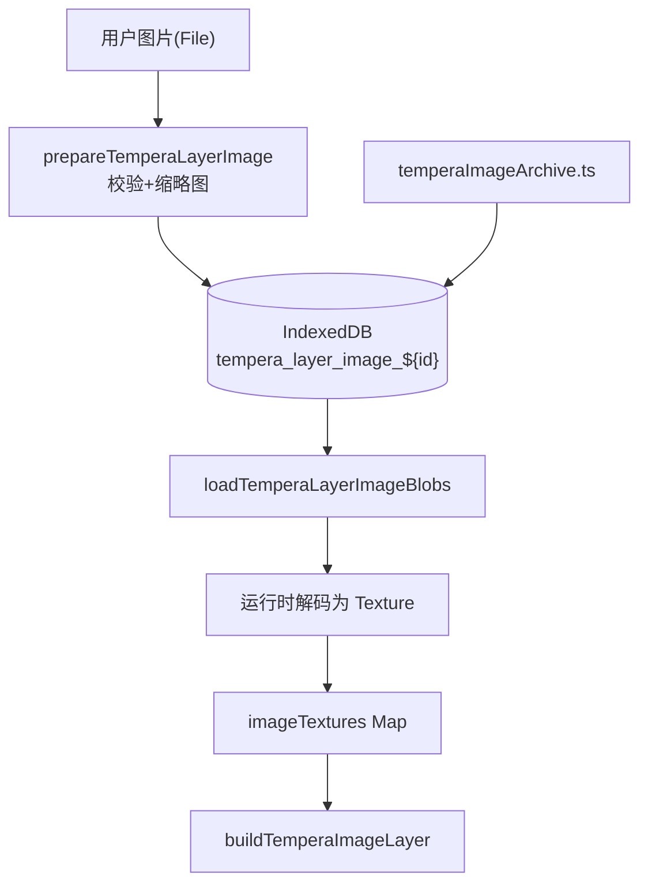
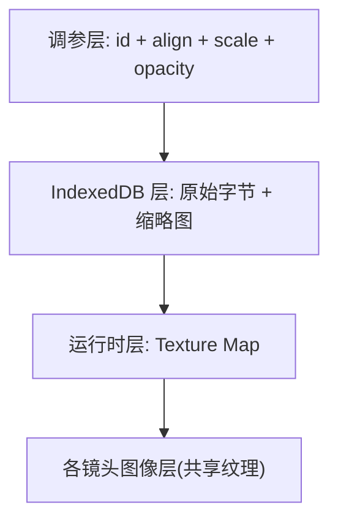
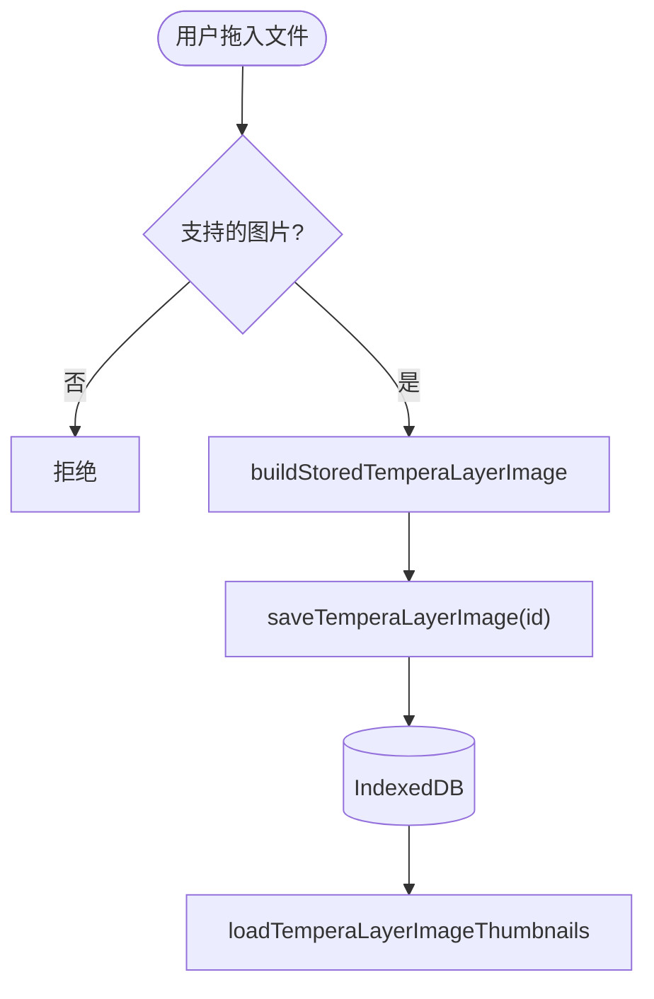
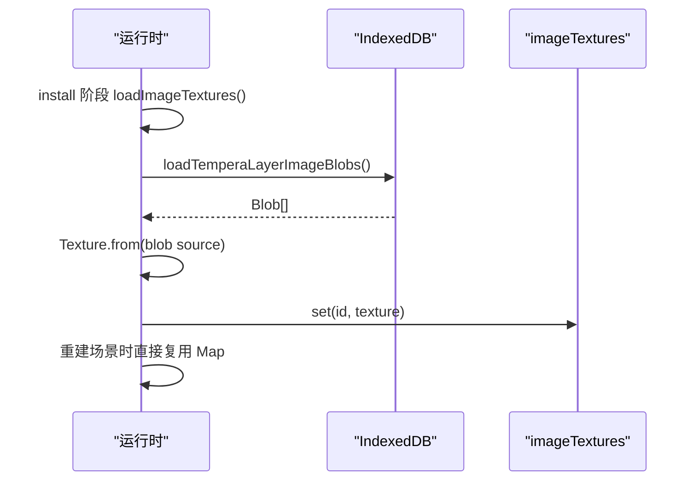
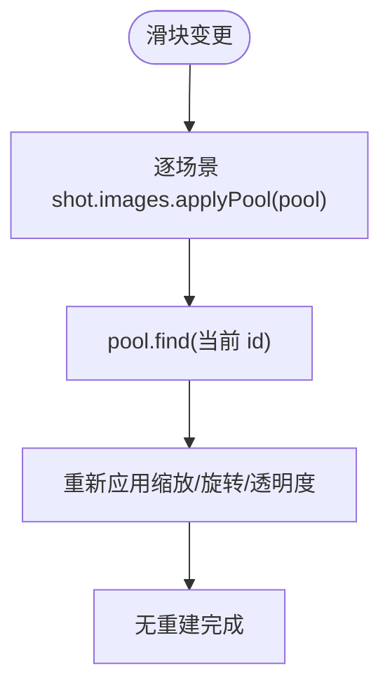
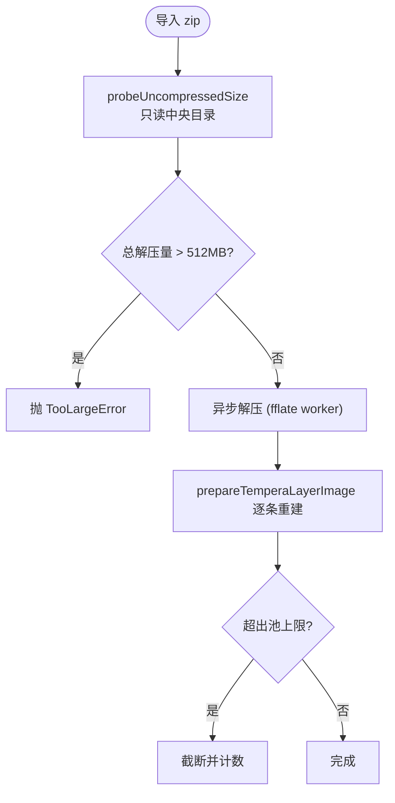
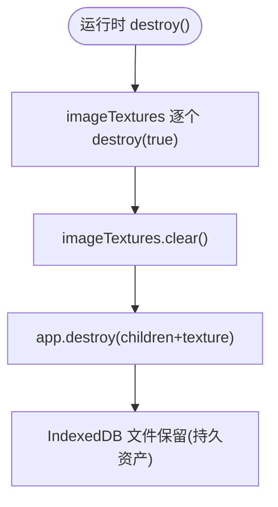
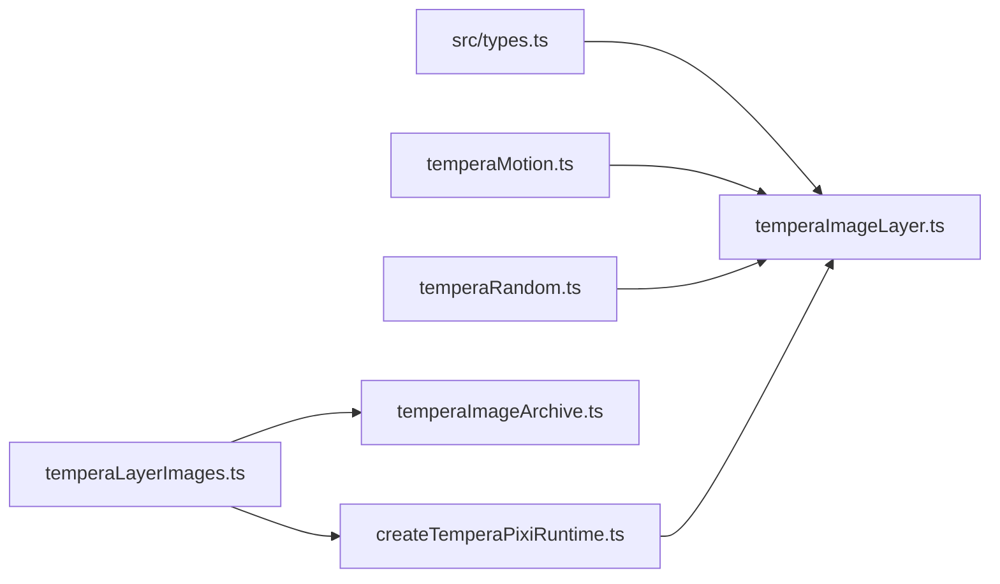

# 图像加载与缓存机制

<cite>
**本文引用的文件**   
- [temperaImageLayer.ts](file://src/components/visualizer/tempera/temperaImageLayer.ts)
- [temperaImageArchive.ts](file://src/services/temperaImageArchive.ts)
- [temperaLayerImages.ts](file://src/services/temperaLayerImages.ts)
- [temperaImageArchiveFormat.ts](file://src/services/temperaImageArchiveFormat.ts)
- [createTemperaPixiRuntime.ts](file://src/components/visualizer/tempera/createTemperaPixiRuntime.ts)
- [types.ts](file://src/types.ts)
</cite>

## 目录
1. [引言](#引言)
2. [项目结构](#项目结构)
3. [核心组件](#核心组件)
4. [架构总览](#架构总览)
5. [详细组件分析](#详细组件分析)
6. [依赖关系分析](#依赖关系分析)
7. [性能考量](#性能考量)
8. [故障排查指南](#故障排查指南)
9. [结论](#结论)

## 引言
本文聚焦 Tempera 模式的图像加载与缓存机制，围绕以下目标展开：
- 解释 IndexedDB 存储架构：图片原件以 `tempera_layer_image_${id}` 为键持久化，调参只携带 id 与放置参数。
- 说明纹理加载与缓存策略：从 Blob 直接解码（刻意不用 `Assets.load`）、运行期共享纹理表、场景重建不重载。
- 阐述图像池的导入导出（zip 归档）与解压炸弹防护。
- 解释内存管理：纹理归属与销毁时序。

## 项目结构
- temperaLayerImages.ts：IndexedDB 读写服务（存取/清除/缩略图/批量加载）。
- temperaImageLayer.ts：单镜头图像层的构建（选图、放置、纹理使用）。
- temperaImageArchive.ts：图像池的 zip 归档导入导出（fflate 异步、512MB 上限防护）。
- temperaImageArchiveFormat.ts：归档条目路径与收集规则。
- createTemperaPixiRuntime.ts：运行时纹理持有者（`imageTextures`）与销毁路径。

**图示来源**
- [temperaLayerImages.ts:35-110](file://src/services/temperaLayerImages.ts#L35-L110)
- [createTemperaPixiRuntime.ts:425-446](file://src/components/visualizer/tempera/createTemperaPixiRuntime.ts#L425-L446)

**章节来源**
- [temperaImageArchive.ts:12-30](file://src/services/temperaImageArchive.ts#L12-L30)

## 核心组件
- `prepareTemperaLayerImage(file)`：校验 + 生成缩略图 + 生成存储记录，是拖拽上传与归档导入共用的唯一入口。
- `getTemperaLayerImage` / `saveTemperaLayerImage` / `clearTemperaLayerImage`：IndexedDB 单条存取与清理。
- `loadTemperaLayerImageThumbnails` / `loadTemperaLayerImageBlobs`：批量加载（面板预览与纹理解码分别使用）。
- `createTemperaImageArchive` / `readTemperaImageArchiveFile`：zip 导入导出。
- `imageTextures: Map<string, Texture>`：运行时共享纹理表，键为图片 id。

**章节来源**
- [temperaLayerImages.ts:13-110](file://src/services/temperaLayerImages.ts#L13-L110)

## 架构总览
图像的三层存储结构：**调参只存 id 与放置参数**（可同步、体积小）；**文件字节存 IndexedDB**（二进制、进程内持久）；**纹理存运行时内存**（解码产物、场景共享）。任何一层都不重复另一层的职责，因此调参同步快照天然不携带图片字节，图片通过专门的二进制 sidecar（zip）备份迁移。

**图示来源**
- [temperaImageArchive.ts:14-24](file://src/services/temperaImageArchive.ts#L14-L24)
- [temperaImageLayer.ts:101-111](file://src/components/visualizer/tempera/temperaImageLayer.ts#L101-L111)

**章节来源**
- [temperaImageArchive.ts:14-24](file://src/services/temperaImageArchive.ts#L14-L24)

## 详细组件分析

### IndexedDB 存储架构
- 存储键：`tempera_layer_image_${id}`——id 由图像池条目携带，读写完全按 id 索引。
- 存储内容：`StoredTemperaLayerImage`（blob 字节 + mimeType + 尺寸等元数据）。
- 上传路径：拖拽/选择文件 → `isSupportedTemperaLayerImageFile` 校验 → `buildStoredTemperaLayerImage` → `saveTemperaLayerImage`。
- 预览路径：`loadTemperaLayerImageThumbnails` 批量取缩略图，供设置面板渲染。

**图示来源**
- [temperaLayerImages.ts:33-55](file://src/services/temperaLayerImages.ts#L33-L55)

**章节来源**
- [temperaLayerImages.ts:33-88](file://src/services/temperaLayerImages.ts#L33-L88)

### 纹理加载与缓存策略
运行时的加载函数把用户的图片**直接从 Blob 解码**——注释明确说明这是刻意避开 `Assets.load` 的选择。所有纹理存入 `imageTextures` Map（键为图片 id），"加载一次、所有场景共享"：段落场景会随播放重建，但重建不会重新解码纹理。纹理归属运行时（而非场景），因此场景销毁不释放它们。

**图示来源**
- [createTemperaPixiRuntime.ts:425-446](file://src/components/visualizer/tempera/createTemperaPixiRuntime.ts#L425-L446)
- [createTemperaPixiRuntime.ts:252-258](file://src/components/visualizer/tempera/createTemperaPixiRuntime.ts#L252-L258)

**章节来源**
- [createTemperaPixiRuntime.ts:204-258](file://src/components/visualizer/tempera/createTemperaPixiRuntime.ts#L204-L258)

### 图像池的设置热更新
图像层对外暴露 `applyPool(pool)`：**拖动尺寸/透明度滑块时不重建场景**——`applyPool` 找到当前选中的图片并重新应用放置参数（缩放、旋转、透明度），调用方在调参变化时对每个镜头的图像层逐个应用。"拖动滑块不该付出场景重建、更不该付出渲染器重启的代价"是这条 API 的设计原则。

**图示来源**
- [temperaImageLayer.ts:85-99](file://src/components/visualizer/tempera/temperaImageLayer.ts#L85-L99)
- [createTemperaPixiRuntime.ts:1024-1025](file://src/components/visualizer/tempera/createTemperaPixiRuntime.ts#L1024-L1025)

**章节来源**
- [temperaImageLayer.ts:85-99](file://src/components/visualizer/tempera/temperaImageLayer.ts#L85-L99)

### 归档导入导出与防护
- 导出：`createTemperaImageArchive` 读取每条目的字节 + `pool.json`（放置清单）+ `meta.json`（kind/schemaVersion/imageCount）打包为 zip（level 6）；文件缺失的条目被剔除并计数返回；**顺序保持图像池数组顺序**（渲染顺序即数组顺序）。
- 导入：`readTemperaImageArchiveFile` 先做解压炸弹防护——`probeUncompressedSize` 只解析中央目录、对 `originalSize` 求和（filter 恒返 false，不解压任何条目），超过 `TEMPERA_ARCHIVE_MAX_UNCOMPRESSED_BYTES`（512MB）即抛 `TemperaArchiveTooLargeError`；通过校验的字节走 `prepareTemperaLayerImage` 重建（与拖拽上传同一条路径，缩略图一并生成）。
- 池大小上限：`TEMPERA_MAX_LAYER_IMAGES` 常量约束导入时截断（`truncated` 计数）。

**图示来源**
- [temperaImageArchive.ts:47-60](file://src/services/temperaImageArchive.ts#L47-L60)
- [temperaImageArchive.ts:103-138](file://src/services/temperaImageArchive.ts#L103-L138)
- [temperaImageArchive.ts:140-145](file://src/services/temperaImageArchive.ts#L140-L145)

**章节来源**
- [temperaImageArchive.ts:32-97](file://src/services/temperaImageArchive.ts#L32-L97)

### 内存管理与销毁时序
- 纹理由运行时创建并持有，销毁时逐个 `texture.destroy(true)` 释放源资源，再 `imageTextures.clear()`；最后 `app.destroy({ removeView: true }, { children: true, texture: true })` 清理应用级资源。
- 关键注释：Tempera 不加载外部纹理（除用户图片外），因此销毁只需走"滤镜 → 容器 → app"三段。
- IndexedDB 中的文件不随运行时销毁而删除——它们是持久资产，只在用户删除图片或清理池时移除。

**图示来源**
- [createTemperaPixiRuntime.ts:1046-1069](file://src/components/visualizer/tempera/createTemperaPixiRuntime.ts#L1046-L1069)

**章节来源**
- [createTemperaPixiRuntime.ts:1046-1069](file://src/components/visualizer/tempera/createTemperaPixiRuntime.ts#L1046-L1069)

## 依赖关系分析
- 图像层依赖 `TemperaLayerImage` 类型（src/types.ts）、缓动函数（入场与 creep）与哈希（放置确定性）。
- 归档依赖 fflate（异步压缩/解压）与 IndexedDB 服务；与运行时解耦（只动存储层）。
- 运行时是唯一持有纹理的层；构图层与服务层都不缓存解码结果。

**图示来源**
- [temperaImageLayer.ts:1-7](file://src/components/visualizer/tempera/temperaImageLayer.ts#L1-L7)

**章节来源**
- [temperaImageArchive.ts:1-10](file://src/services/temperaImageArchive.ts#L1-L10)

## 性能考量
- 解码一次、全场景共享：场景重建（段落切换）不触发重新解码。
- 归档压缩/解压在 worker 中执行（fflate async），避免主线程阻塞歌词动画；代价是压缩期间池被短暂持有两份（备注中已明确权衡）。
- 解压上限 512MB 防护同时约束内存峰值（实测 51KB zip 可 inflate 出 50MB）。
- 缩略图与原件分离加载：面板预览不触碰全尺寸字节。

**章节来源**
- [temperaImageArchive.ts:26-37](file://src/services/temperaImageArchive.ts#L26-L37)

## 故障排查指南
- 图像不显示且无报错：检查 IndexedDB 中该 id 的字节是否存在（导出时 `skipped` 计数可提示缺失）；`getTemperaLayerImage` 失败会静默跳过。
- 导入提示过大：解压总大小超过 512MB 上限；这是压缩炸弹防护的预期行为。
- 导入后图片顺序不同：导出按池数组顺序、导入按条目重建；确认 `pool.json` 的 `layerImages` 顺序未被修改。
- 滑块拖动卡顿：不应发生——`applyPool` 路径不重建场景；若卡顿检查是否有其他地方触发了整体重建。
- 内存不释放：纹理在运行时层级销毁；若在应用生命周期内频繁替换池，旧纹理需等运行时销毁才释放，属设计权衡。

**章节来源**
- [temperaImageArchive.ts:103-137](file://src/services/temperaImageArchive.ts#L103-L137)
- [temperaImageLayer.ts:156-159](file://src/components/visualizer/tempera/temperaImageLayer.ts#L156-L159)

## 结论
Tempera 图像加载与缓存机制以三层存储（调参 id / IndexedDB 字节 / 运行时纹理）为骨架，实现了"可同步的配置 + 可备份的资产 + 可共享的解码结果"。从 Blob 直接解码、纹理全局共享、applyPool 热更新与归档防炸弹共同构成了完整且安全的用户图片管线，是 Tempera 图像层功能可靠性的基础。
