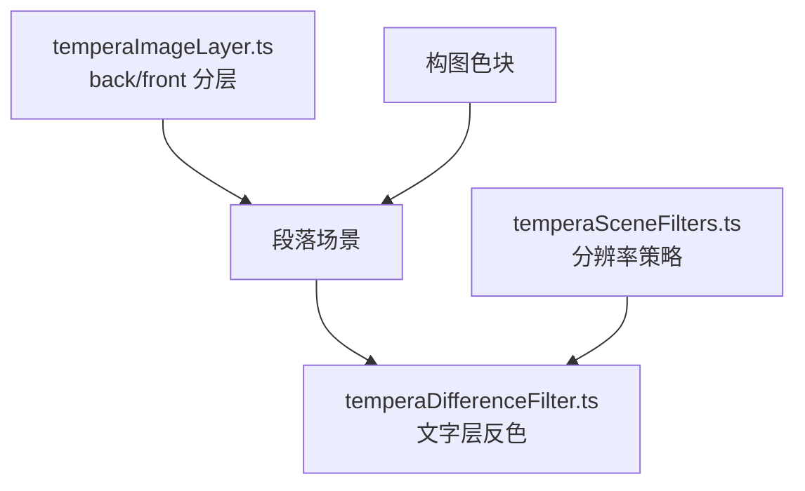
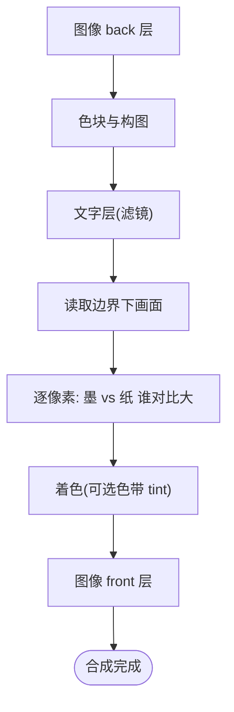
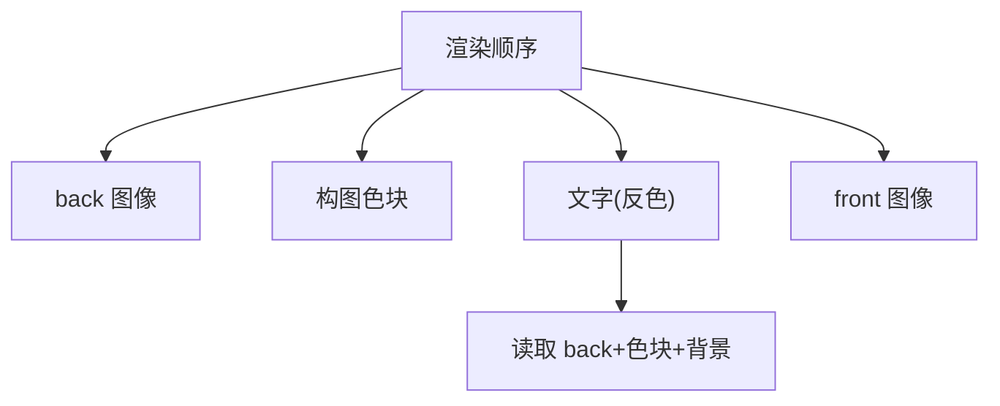
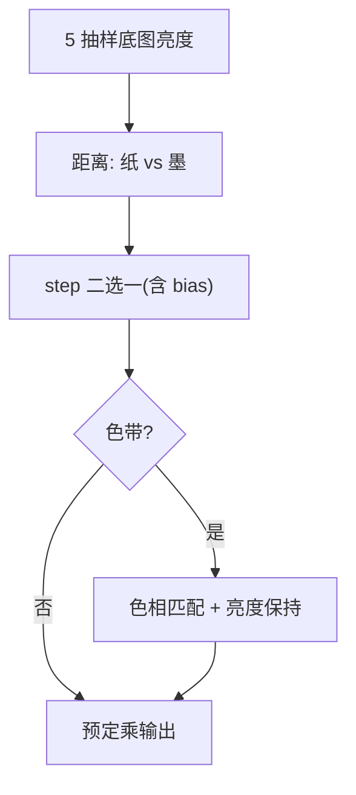
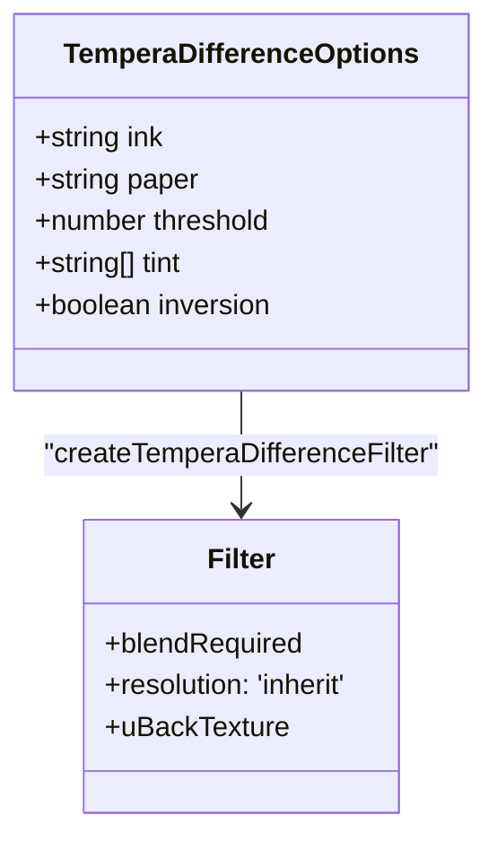
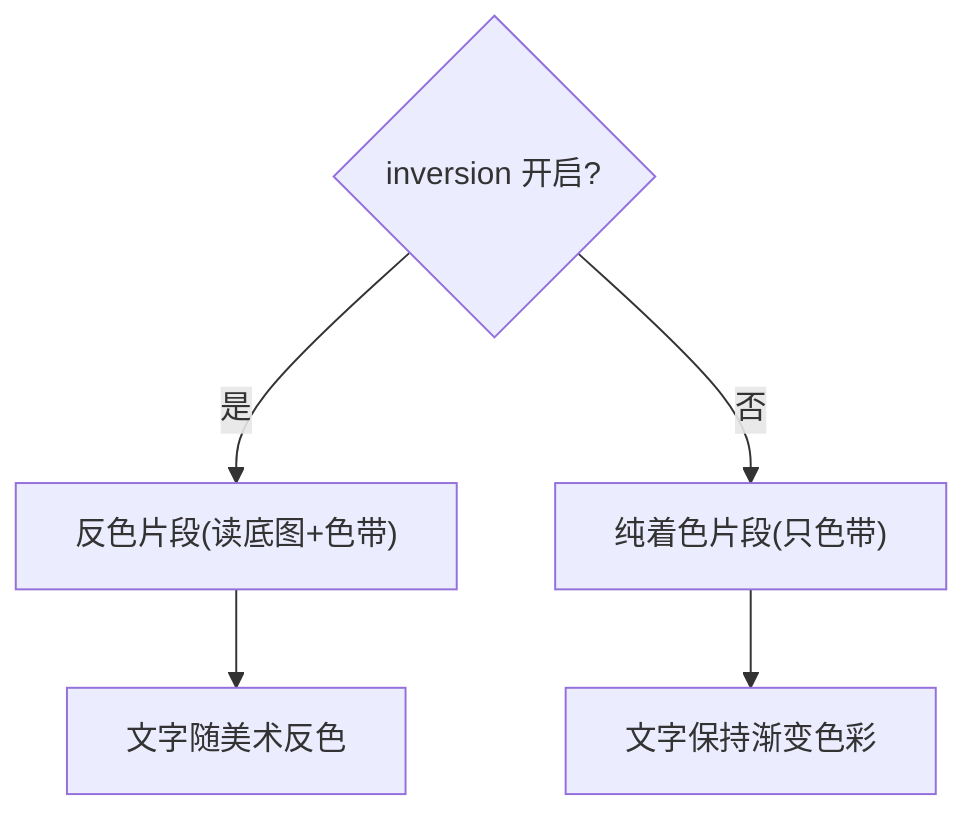
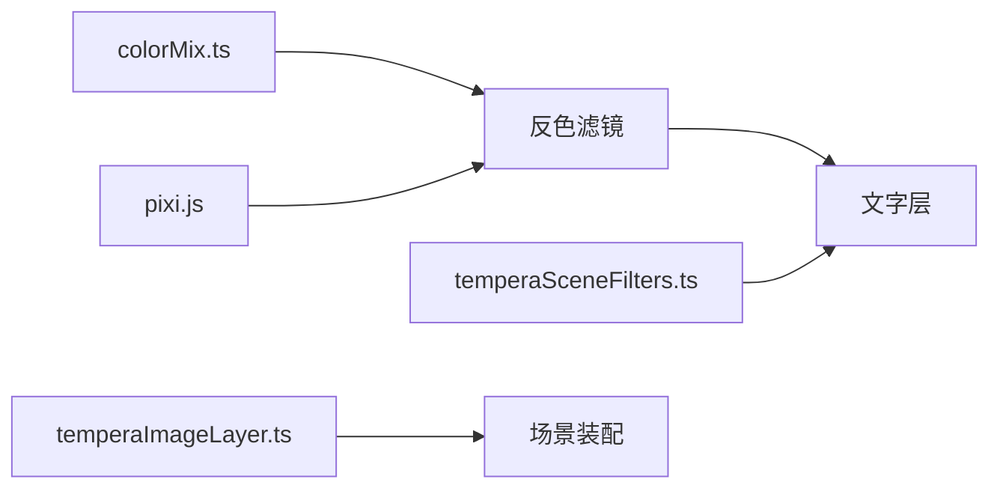

# 图像合成与混合模式

<cite>
**本文引用的文件**   
- [temperaDifferenceFilter.ts](file://src/components/visualizer/tempera/temperaDifferenceFilter.ts)
- [temperaImageLayer.ts](file://src/components/visualizer/tempera/temperaImageLayer.ts)
- [temperaSceneFilters.ts](file://src/components/visualizer/tempera/temperaSceneFilters.ts)
- [temperaProgram.ts](file://src/components/visualizer/tempera/temperaProgram.ts)
- [createTemperaPixiRuntime.ts](file://src/components/visualizer/tempera/createTemperaPixiRuntime.ts)
</cite>

## 目录
1. [引言](#引言)
2. [项目结构](#项目结构)
3. [核心组件](#核心组件)
4. [架构总览](#架构总览)
5. [详细组件分析](#详细组件分析)
6. [依赖关系分析](#依赖关系分析)
7. [性能考量](#性能考量)
8. [故障排查指南](#故障排查指南)
9. [结论](#结论)

## 引言
本文聚焦 Tempera 模式的图像合成与混合模式，围绕以下目标展开：
- 解释图层深度管理：back/front 双层的渲染顺序与 Z 轴语义。
- 说明混合算法：以墨/纸阈值反色（threshold inversion）替代传统 CSS 混合模式，采样底图、逐像素二选一。
- 阐述透明度与蒙版：alpha 合成、预定乘与 5 抽样平均。
- 解释渐变色带（tint ramp）与纯色形式的双形态滤镜。

## 项目结构
- temperaDifferenceFilter.ts：反色/着色滤镜——Tempera 文字与底图合成的唯一着色器。
- temperaImageLayer.ts：图像的 back/front 分层与精灵 alpha。
- temperaSceneFilters.ts：场景级滤镜分辨率与挂载策略（保证反色正确）。
- createTemperaPixiRuntime.ts：场景装配与滤镜销毁。

**图示来源**
- [temperaImageLayer.ts:85-99](file://src/components/visualizer/tempera/temperaImageLayer.ts#L85-L99)
- [temperaDifferenceFilter.ts:145-190](file://src/components/visualizer/tempera/temperaDifferenceFilter.ts#L145-L190)

**章节来源**
- [temperaDifferenceFilter.ts:4-12](file://src/components/visualizer/tempera/temperaDifferenceFilter.ts#L4-L12)

## 核心组件
- `createTemperaDifferenceFilter(pixi, options)`：构建反色或纯着色滤镜。
- `TemperaDifferenceOptions`：ink/paper 颜色、threshold（0.5 中性）、tint（4 站色带）、inversion（双形态开关）。
- 5 抽样底图亮度：中心 0.4 + 四对角 0.15×4，抑制细网线导致的翻转抖动。
- 预定乘还原：底图先 `rgb / max(a, 1e-4)` 再取亮度。
- `blendRequired`：反色形态声明该标志，Pixi 会把滤镜边界下已绘制的像素快照进 `uBackTexture`。

**章节来源**
- [temperaDifferenceFilter.ts:130-190](file://src/components/visualizer/tempera/temperaDifferenceFilter.ts#L130-L190)

## 架构总览
合成管线为：色块/图像（back 层）→ 文字层（应用反色滤镜）→ 图像（front 层）。反色滤镜不"混合"两层图像，而是**读取其边界下已渲染的画面（含图像、色块、背景）并逐像素为文字选择墨或纸中最对比的一种颜色**——这就是印刷套准（print-registration）观感的来源，也不需要为每种镜头手工挑填充色。

**图示来源**
- [temperaDifferenceFilter.ts:65-105](file://src/components/visualizer/tempera/temperaDifferenceFilter.ts#L65-L105)

**章节来源**
- [temperaDifferenceFilter.ts:4-12](file://src/components/visualizer/tempera/temperaDifferenceFilter.ts#L4-L12)

## 详细组件分析

### 图层深度与渲染顺序
图像层提供 `back` 与 `front` 两个容器：back 层置于文字之下，成为反色滤镜读取的美术内容的一部分——文字像切过色块一样切过它；front 层置于文字之上。Z 轴语义由容器父子顺序直接决定，不需要任何深度缓冲。精灵锚点统一 0.5、按高度归一缩放，透明度由放置参数与入场曲线乘得。

**图示来源**
- [temperaImageLayer.ts:85-99](file://src/components/visualizer/tempera/temperaImageLayer.ts#L85-L99)

**章节来源**
- [temperaImageLayer.ts:9-14](file://src/components/visualizer/tempera/temperaImageLayer.ts#L9-L14)

### 阈值反色：混合算法的实现
每个文字像素的处理分四步：
1. 采样底图亮度：`backLuminance` 用 5 抽样（中心 0.4、四对角各 0.15）平均，避免细网线让翻转决策逐像素闪烁；底图先解除预定乘（`rgb/a`）再按 REC709 取亮度；`a≈0` 处（无人绘制）回落到纸色亮度。
2. 对比选择：比较亮度到纸/墨的距离，`tone = mix(inkColor, paperColor, step(distanceToInk + bias, distanceToPaper))`——**永远选离底图更远的颜色，无论主题是暗底亮字还是亮底暗字**。bias 由 threshold - 0.5 提供，正值偏向墨。
3. 色带着色（可选）：`sampleTint` 在滤镜自身边界上扫过 4 站色带——色相来自 ramp，**亮度保留反色刚选出的那个**（把 tint 缩放到相同亮度），因为亮度是保证可读的唯一东西。
4. 输出：`finalColor = vec4(tone * front.a, front.a)`——保持预定乘约定。

**图示来源**
- [temperaDifferenceFilter.ts:68-104](file://src/components/visualizer/tempera/temperaDifferenceFilter.ts#L68-L104)

**章节来源**
- [temperaDifferenceFilter.ts:68-104](file://src/components/visualizer/tempera/temperaDifferenceFilter.ts#L68-L104)

### 透明度、预定乘与分辨率约束
- 预定乘：Pixi 渲染目标是预定乘的（premultiplied），滤镜在取亮度前必须除回 alpha，输出时再乘回——否则半透明边缘的亮度会失真。
- 混合来源：`blendRequired: inversion` 声明后，Pixi 自动把滤镜边界下已绘制像素快照为 `uBackTexture`；纯着色形态不读底图，因此不声明。
- 分辨率：滤镜 `resolution: 'inherit'` 是硬性要求——Pixi 的 `Filter` 默认分辨率 1 会让输入纹理与底图纹理尺寸不一致（底图始终跟随渲染目标分辨率），`vTextureCoord` 对两张纹理索引方式不同，底图会被从错误位置读取，在细网线上表现为大面积错误反色。纯着色形态虽无底图冲突，但固定 1 会把文字光栅化在画布分辨率之下再放大。

**图示来源**
- [temperaDifferenceFilter.ts:130-190](file://src/components/visualizer/tempera/temperaDifferenceFilter.ts#L130-L190)

**章节来源**
- [temperaDifferenceFilter.ts:174-190](file://src/components/visualizer/tempera/temperaDifferenceFilter.ts#L174-L190)

### 双形态：反色与纯着色
当用户关闭文字反色时，滤镜切换为"纯着色"片段着色器：同样的色带，但不读底图。原因：**渐变色带模式的颜色是搭反色的便车**（ramp 作为 tint 提供色相）；直接丢弃滤镜会把渐变模式的色彩一起丢掉、只剩平墨色文字——因此必须保留一个"只有色带、无底图"的形态。色带停靠点本身按纸色亮度 ±88 构建，保证它们单独使用时可读。

**图示来源**
- [temperaDifferenceFilter.ts:107-116](file://src/components/visualizer/tempera/temperaDifferenceFilter.ts#L107-L116)

**章节来源**
- [temperaDifferenceFilter.ts:107-143](file://src/components/visualizer/tempera/temperaDifferenceFilter.ts#L107-L143)

## 依赖关系分析
- 反色滤镜依赖 `parseColorChannels`（颜色解析）与 Pixi UniformGroup/GlProgram。
- 场景滤镜策略（temperaSceneFilters.ts）与反色滤镜强耦合：容器滤镜的挂载/摘除直接影响 `uBackTexture` 的采样原点（参见《过渡效果系统》）。
- 图像的 back/front 层由运行时按 depth 参数装配，与构图色块顺序固定。

**图示来源**
- [temperaDifferenceFilter.ts:1-2](file://src/components/visualizer/tempera/temperaDifferenceFilter.ts#L1-L2)

**章节来源**
- [temperaDifferenceFilter.ts:1-13](file://src/components/visualizer/tempera/temperaDifferenceFilter.ts#L1-L13)

## 性能考量
- 单通道单遍处理：反色与着色共用一个 pass，无边版采样链路。
- 5 抽样是小成本（4 次额外纹理采样）换来的稳定性提升。
- `resolution: 'inherit'` 保持与画布同分辨率采样，避免低分辨率输入放大导致的柔化（细网线与文字都受益）。
- 色带是一维插值（3 次 mix），无额外纹理。

**章节来源**
- [temperaDifferenceFilter.ts:79-85](file://src/components/visualizer/tempera/temperaDifferenceFilter.ts#L79-L85)

## 故障排查指南
- 文字颜色与底图"撞了"：检查 ink/paper 亮度是否相等（对比距离永远相等时 bias 决定结果）；调 threshold 改变偏向。
- 细网线上反色闪烁：底图采样被改成了单点采样；必须保留 5 抽样平均。
- 反色整体错位（与左上角关联）：`uBackTexture` 采样原点下溢——检查场景容器上是否有"挂载但禁用"的滤镜（参见 temperaSceneFilters 的说明）。
- 半透明边缘发灰：预定乘还原缺失；确认滤镜在取亮度前除以 alpha。
- 渐变模式关反色后变平墨：使用了完整反色滤镜而不是 tint-only 形态；关闭反色时应切换片段而非移除滤镜。
- 文字比画布模糊：`resolution` 被固定为 1；必须保持 `'inherit'`。

**章节来源**
- [temperaDifferenceFilter.ts:174-190](file://src/components/visualizer/tempera/temperaDifferenceFilter.ts#L174-L190)
- [temperaSceneFilters.ts:8-21](file://src/components/visualizer/tempera/temperaSceneFilters.ts#L8-L21)

## 结论
Tempera 的图像合成与混合模式并未采用传统的正片叠底/滤色体系，而是以"墨/纸阈值反色"为核心：读取文字边界下的全部已绘制内容（色块、back 层图像、背景），逐像素选择对比更大的颜色，并用可选色带着色。配合 back/front 深度分层、预定乘还原、5 抽样稳定化与 `blendRequired`/`inherit` 两个关键约定，这套机制实现了独特的印刷套准美学，同时把可读性与分辨率正确性焊死在实现里。
