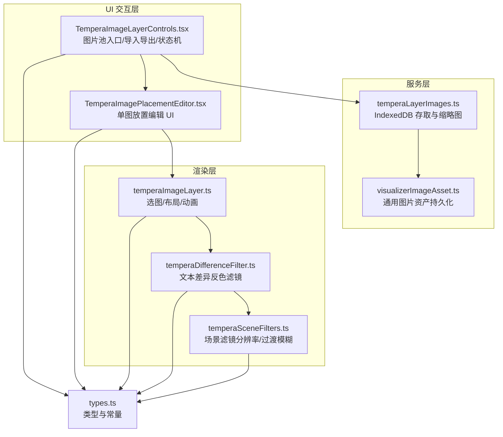
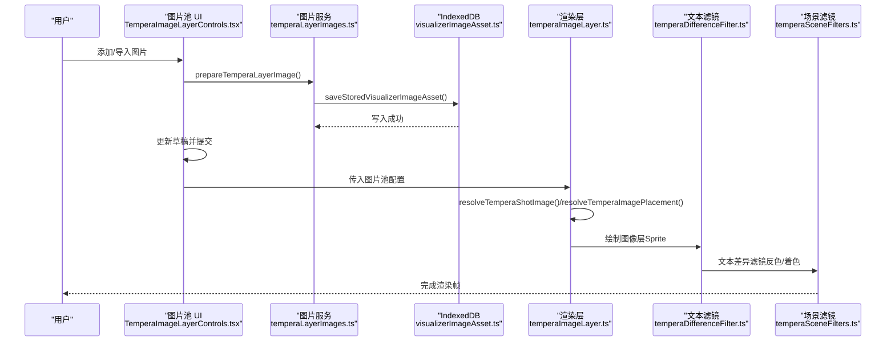
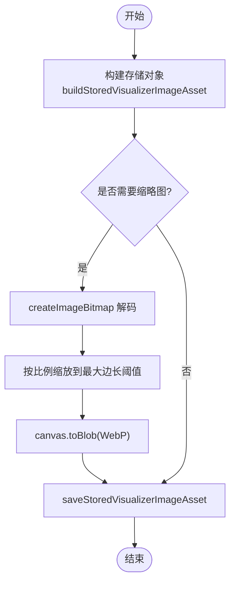
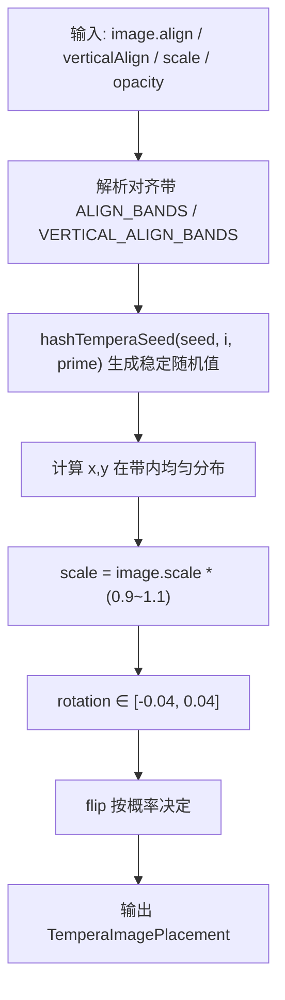
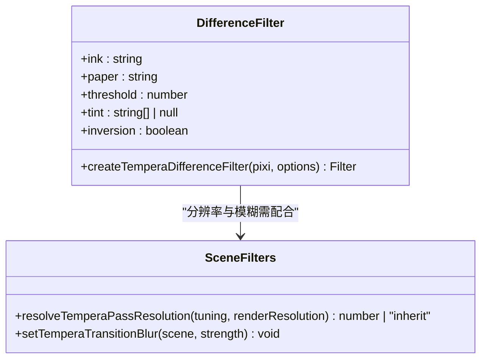
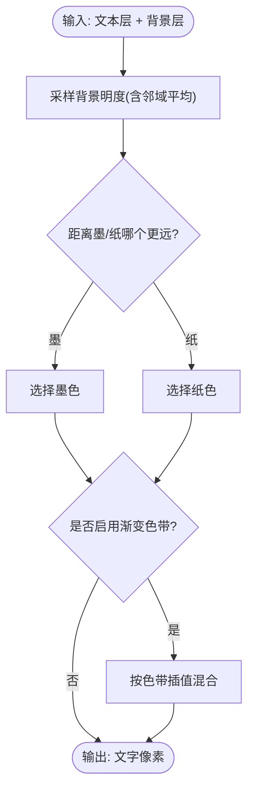
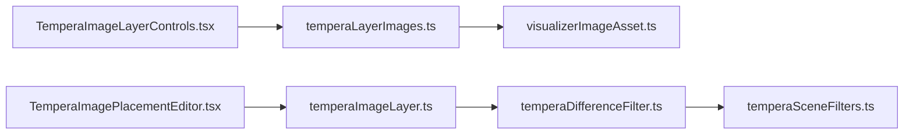

# 图像层管理系统

<cite>
**本文引用的文件**   
- [src/services/temperaLayerImages.ts](file://src/services/temperaLayerImages.ts)
- [src/services/visualizerImageAsset.ts](file://src/services/visualizerImageAsset.ts)
- [src/components/visualizer/tempera/TemperaImageLayerControls.tsx](file://src/components/visualizer/tempera/TemperaImageLayerControls.tsx)
- [src/components/visualizer/tempera/TemperaImagePlacementEditor.tsx](file://src/components/visualizer/tempera/TemperaImagePlacementEditor.tsx)
- [src/components/visualizer/tempera/temperaImageLayer.ts](file://src/components/visualizer/tempera/temperaImageLayer.ts)
- [src/components/visualizer/tempera/temperaDifferenceFilter.ts](file://src/components/visualizer/tempera/temperaDifferenceFilter.ts)
- [src/components/visualizer/tempera/temperaSceneFilters.ts](file://src/components/visualizer/tempera/temperaSceneFilters.ts)
- [src/components/visualizer/tempera/types.ts](file://src/components/visualizer/tempera/types.ts)
</cite>

## 目录
1. [简介](#简介)
2. [项目结构](#项目结构)
3. [核心组件](#核心组件)
4. [架构总览](#架构总览)
5. [详细组件分析](#详细组件分析)
6. [依赖关系分析](#依赖关系分析)
7. [性能考虑](#性能考虑)
8. [故障排查指南](#故障排查指南)
9. [结论](#结论)
10. [附录：API 使用示例与最佳实践](#附录api-使用示例与最佳实践)

## 简介
本技术文档聚焦于 Tempera 模式的图像层管理系统，围绕以下目标展开：
- 图像层的加载机制：IndexedDB 存储、Blob 对象处理与缩略图缓存策略。
- 图像放置编辑器：拖拽与网格对齐、位置计算与变换矩阵应用。
- 图层混合模式与蒙版技术：说明当前实现中的“差异反色”滤镜作为文本蒙版/对比选择方案，并解释其与场景滤镜链的关系。
- 图像处理管道：滤镜应用、透明度控制与边缘检测（通过差异采样近似）。
- API 使用示例与性能优化建议：面向扩展与二次开发。

Tempera 的图像层并非传统意义上的“图层混合模式（正片叠底、滤色等）”，而是以“池化随机选取 + 确定性布局 + 动画流移”的方式参与画面构图；文本层则通过自定义差异滤镜实现“基于背景明度的反色/着色”。

## 项目结构
本节梳理与图像层管理直接相关的代码组织与职责边界。

图表来源
- [src/services/temperaLayerImages.ts:1-119](file://src/services/temperaLayerImages.ts#L1-L119)
- [src/services/visualizerImageAsset.ts:1-46](file://src/services/visualizerImageAsset.ts#L1-L46)
- [src/components/visualizer/tempera/TemperaImageLayerControls.tsx:1-507](file://src/components/visualizer/tempera/TemperaImageLayerControls.tsx#L1-L507)
- [src/components/visualizer/tempera/TemperaImagePlacementEditor.tsx:1-217](file://src/components/visualizer/tempera/TemperaImagePlacementEditor.tsx#L1-L217)
- [src/components/visualizer/tempera/temperaImageLayer.ts:1-176](file://src/components/visualizer/tempera/temperaImageLayer.ts#L1-L176)
- [src/components/visualizer/tempera/temperaDifferenceFilter.ts:1-192](file://src/components/visualizer/tempera/temperaDifferenceFilter.ts#L1-L192)
- [src/components/visualizer/tempera/temperaSceneFilters.ts:1-96](file://src/components/visualizer/tempera/temperaSceneFilters.ts#L1-L96)
- [src/components/visualizer/tempera/types.ts:1-299](file://src/components/visualizer/tempera/types.ts#L1-L299)

章节来源
- [src/services/temperaLayerImages.ts:1-119](file://src/services/temperaLayerImages.ts#L1-L119)
- [src/components/visualizer/tempera/TemperaImageLayerControls.tsx:1-507](file://src/components/visualizer/tempera/TemperaImageLayerControls.tsx#L1-L507)

## 核心组件
- 图片池服务：负责 IndexedDB 读写、Blob 封装、缩略图生成与批量加载。
- 图片池 UI：提供添加、导入/导出、删除、批量提交与状态提示。
- 放置编辑器：在对话框中预览并调整单张图片的对齐倾向、缩放、透明度。
- 图像层渲染：根据种子与对齐带确定位置、旋转、翻转、缩放，并叠加入场与流移动画。
- 文本差异滤镜：基于背景明度为歌词选择“墨/纸”颜色，支持四段渐变色带。
- 场景滤镜：统一场景级滤镜分辨率与过渡模糊开关，避免反色错位。

章节来源
- [src/services/temperaLayerImages.ts:1-119](file://src/services/temperaLayerImages.ts#L1-L119)
- [src/components/visualizer/tempera/TemperaImageLayerControls.tsx:1-507](file://src/components/visualizer/tempera/TemperaImageLayerControls.tsx#L1-L507)
- [src/components/visualizer/tempera/TemperaImagePlacementEditor.tsx:1-217](file://src/components/visualizer/tempera/TemperaImagePlacementEditor.tsx#L1-L217)
- [src/components/visualizer/tempera/temperaImageLayer.ts:1-176](file://src/components/visualizer/tempera/temperaImageLayer.ts#L1-L176)
- [src/components/visualizer/tempera/temperaDifferenceFilter.ts:1-192](file://src/components/visualizer/tempera/temperaDifferenceFilter.ts#L1-L192)
- [src/components/visualizer/tempera/temperaSceneFilters.ts:1-96](file://src/components/visualizer/tempera/temperaSceneFilters.ts#L1-L96)

## 架构总览
下图展示从用户操作到最终渲染的关键路径：

图表来源
- [src/components/visualizer/tempera/TemperaImageLayerControls.tsx:180-251](file://src/components/visualizer/tempera/TemperaImageLayerControls.tsx#L180-L251)
- [src/services/temperaLayerImages.ts:47-82](file://src/services/temperaLayerImages.ts#L47-L82)
- [src/services/visualizerImageAsset.ts:23-45](file://src/services/visualizerImageAsset.ts#L23-L45)
- [src/components/visualizer/tempera/temperaImageLayer.ts:69-175](file://src/components/visualizer/tempera/temperaImageLayer.ts#L69-L175)
- [src/components/visualizer/tempera/temperaDifferenceFilter.ts:145-191](file://src/components/visualizer/tempera/temperaDifferenceFilter.ts#L145-L191)
- [src/components/visualizer/tempera/temperaSceneFilters.ts:51-95](file://src/components/visualizer/tempera/temperaSceneFilters.ts#L51-L95)

## 详细组件分析

### 图像层加载机制：IndexedDB、Blob 与缩略图缓存
- 数据模型
  - 存储记录包含 id、name、mimeType、blob，以及可选的 thumbnail（用于设置面板预览）。
  - key 前缀固定，便于隔离不同用途的图片资产。
- 写入流程
  - 构建存储对象时生成 id 与元信息，并将原始 File/Blob 存入。
  - 缩略图通过 createImageBitmap 解码后重绘到 canvas，再编码为 WebP Blob；若失败或无需缩放则不生成。
- 读取流程
  - 按 id 查询记录，返回 blob 或 null。
  - 批量加载接口返回 Map<id, Blob>，跳过缺失项。
- 缩略图加载
  - 优先使用 thumbnail，回退到 blob，避免大图解码开销。

图表来源
- [src/services/visualizerImageAsset.ts:40-45](file://src/services/visualizerImageAsset.ts#L40-L45)
- [src/services/temperaLayerImages.ts:56-82](file://src/services/temperaLayerImages.ts#L56-L82)

章节来源
- [src/services/temperaLayerImages.ts:1-119](file://src/services/temperaLayerImages.ts#L1-L119)
- [src/services/visualizerImageAsset.ts:1-46](file://src/services/visualizerImageAsset.ts#L1-L46)

### 图像放置编辑器：对齐、位置计算与变换矩阵
- 对齐系统
  - 水平/垂直方向均划分为若干“带”，如 left/center/right/free 对应不同的区间。
  - 使用确定性哈希将 seed 映射到区间内的坐标，保证回放一致性。
- 变换参数
  - scale：基于纹理高度与视口高度的比例换算。
  - rotation：小角度随机扰动。
  - flip：按概率翻转。
  - opacity：由用户配置决定。
- 编辑器 UI
  - 九宫格按钮快速切换对齐组合。
  - 滑块调节 scale 与 opacity。
  - 实时预览使用与渲染一致的 placement 计算结果。

图表来源
- [src/components/visualizer/tempera/temperaImageLayer.ts:19-63](file://src/components/visualizer/tempera/temperaImageLayer.ts#L19-L63)
- [src/components/visualizer/tempera/TemperaImagePlacementEditor.tsx:73-110](file://src/components/visualizer/tempera/TemperaImagePlacementEditor.tsx#L73-L110)

章节来源
- [src/components/visualizer/tempera/temperaImageLayer.ts:1-176](file://src/components/visualizer/tempera/temperaImageLayer.ts#L1-L176)
- [src/components/visualizer/tempera/TemperaImagePlacementEditor.tsx:1-217](file://src/components/visualizer/tempera/TemperaImagePlacementEditor.tsx#L1-L217)

### 图层混合模式与蒙版技术
- 混合模式
  - 当前实现未采用传统的正片叠底、滤色等混合模式；图像层以 Sprite 形式叠加，透明度由 placement.opacity 控制。
- 蒙版/反色
  - 文本层使用自定义差异滤镜：采样已渲染的背景，比较背景明度与“墨/纸”明度，选择对比更大的一方作为文字颜色。
  - 该滤镜支持四段渐变色带，可在关闭反色时仅做着色而不采样背景。
- 场景滤镜约束
  - 为保证反色正确，场景级滤镜必须仅在需要时挂载，且分辨率需保持 'inherit'，避免 uBackTexture 与 uTexture 像素尺寸不一致导致采样错位。

图表来源
- [src/components/visualizer/tempera/temperaDifferenceFilter.ts:145-191](file://src/components/visualizer/tempera/temperaDifferenceFilter.ts#L145-L191)
- [src/components/visualizer/tempera/temperaSceneFilters.ts:51-95](file://src/components/visualizer/tempera/temperaSceneFilters.ts#L51-L95)

章节来源
- [src/components/visualizer/tempera/temperaDifferenceFilter.ts:1-192](file://src/components/visualizer/tempera/temperaDifferenceFilter.ts#L1-L192)
- [src/components/visualizer/tempera/temperaSceneFilters.ts:1-96](file://src/components/visualizer/tempera/temperaSceneFilters.ts#L1-L96)

### 图像处理管道：滤镜、透明度与边缘检测
- 滤镜管线
  - 文本差异滤镜：根据背景明度选择墨/纸颜色，并可叠加渐变色带。
  - 场景滤镜：统一管理基础滤镜数组与过渡模糊，按需挂载以避免反色采样错误。
- 透明度控制
  - 图像层 Sprite.alpha 随入场进度变化，结合 flowAngle 与 creep 产生轻微位移。
- 边缘检测
  - 差异滤镜对背景进行多邻域采样平均，起到抗抖动作用；虽非严格边缘检测，但能稳定“墨/纸”决策。

图表来源
- [src/components/visualizer/tempera/temperaDifferenceFilter.ts:65-116](file://src/components/visualizer/tempera/temperaDifferenceFilter.ts#L65-L116)
- [src/components/visualizer/tempera/temperaImageLayer.ts:161-172](file://src/components/visualizer/tempera/temperaImageLayer.ts#L161-L172)

章节来源
- [src/components/visualizer/tempera/temperaDifferenceFilter.ts:1-192](file://src/components/visualizer/tempera/temperaDifferenceFilter.ts#L1-L192)
- [src/components/visualizer/tempera/temperaImageLayer.ts:1-176](file://src/components/visualizer/tempera/temperaImageLayer.ts#L1-L176)

## 依赖关系分析
- 组件耦合
  - UI 层（TemperaImageLayerControls）依赖服务层（temperaLayerImages）进行持久化与缩略图准备。
  - 编辑器（TemperaImagePlacementEditor）复用渲染层（temperaImageLayer）的 placement 算法以保证所见即所得。
  - 渲染层依赖 PixiJS 的 Texture/Sprite/Container，并通过差异滤镜与场景滤镜协作。
- 外部依赖
  - PixiJS：图形渲染、Filter、GlProgram、UniformGroup。
  - IndexedDB：通过通用缓存工具保存/读取 Blob。

图表来源
- [src/components/visualizer/tempera/TemperaImageLayerControls.tsx:1-507](file://src/components/visualizer/tempera/TemperaImageLayerControls.tsx#L1-L507)
- [src/services/temperaLayerImages.ts:1-119](file://src/services/temperaLayerImages.ts#L1-L119)
- [src/services/visualizerImageAsset.ts:1-46](file://src/services/visualizerImageAsset.ts#L1-L46)
- [src/components/visualizer/tempera/TemperaImagePlacementEditor.tsx:1-217](file://src/components/visualizer/tempera/TemperaImagePlacementEditor.tsx#L1-L217)
- [src/components/visualizer/tempera/temperaImageLayer.ts:1-176](file://src/components/visualizer/tempera/temperaImageLayer.ts#L1-L176)
- [src/components/visualizer/tempera/temperaDifferenceFilter.ts:1-192](file://src/components/visualizer/tempera/temperaDifferenceFilter.ts#L1-L192)
- [src/components/visualizer/tempera/temperaSceneFilters.ts:1-96](file://src/components/visualizer/tempera/temperaSceneFilters.ts#L1-L96)

章节来源
- [src/components/visualizer/tempera/TemperaImageLayerControls.tsx:1-507](file://src/components/visualizer/tempera/TemperaImageLayerControls.tsx#L1-L507)
- [src/services/temperaLayerImages.ts:1-119](file://src/services/temperaLayerImages.ts#L1-L119)

## 性能考虑
- 缩略图缓存
  - 为大图生成 WebP 缩略图，显著降低设置面板的解码压力；若浏览器不支持或无需缩放则跳过。
- 批处理与并发
  - 批量 prepare/save 使用 Promise.all，提高吞吐；同时通过 AbortController 取消未完成写入，避免脏数据。
- 资源生命周期
  - 渲染层直接使用 Blob 而非 object URL，避免 URL 生命周期管理；Pixi Assets 解析器按扩展名选择解析器，Blob 可绕过此限制。
- 滤镜分辨率
  - 场景滤镜默认继承画布分辨率，避免不必要的下采样；压缩模式下上限不超过画布分辨率，防止过度放大。
- 动画与布局
  - placement 计算纯函数且基于 seed，确保回放一致性与无随机开销；Sprite 的 enter/creep 运动轻量，避免重建场景。

[本节为通用性能指导，不直接分析具体文件]

## 故障排查指南
- 图片无法显示
  - 检查文件扩展名与 MIME 类型是否被识别；确认 IndexedDB 写入是否成功。
  - 若缩略图生成失败，会回退到原图；若原图也损坏，将无法显示。
- 导入/导出异常
  - 导入时若备份过大或损坏，会抛出特定错误；请检查压缩包完整性与大小。
  - 导出时若缺少原文件，会跳过该项并在提示中说明。
- 文本反色错乱
  - 确认场景级滤镜仅在过渡期间挂载；确保滤镜 resolution 为 'inherit'，避免 uBackTexture 与 uTexture 像素尺寸不一致。
- 重复图片问题
  - 图像层在选择下一张时会避开上一张的 id；若池子过小可能出现重复，建议增加图片数量或调高出现频率。

章节来源
- [src/components/visualizer/tempera/TemperaImageLayerControls.tsx:180-251](file://src/components/visualizer/tempera/TemperaImageLayerControls.tsx#L180-L251)
- [src/components/visualizer/tempera/temperaSceneFilters.ts:1-96](file://src/components/visualizer/tempera/temperaSceneFilters.ts#L1-L96)
- [src/components/visualizer/tempera/temperaDifferenceFilter.ts:145-191](file://src/components/visualizer/tempera/temperaDifferenceFilter.ts#L145-L191)

## 结论
Tempera 的图像层管理系统以“池化 + 确定性布局 + 轻量动画”为核心，配合差异滤镜实现文本与背景的自适应对比。其设计强调：
- 可预测性：所有布局与装饰均在编译期确定，回放一致。
- 可扩展性：图片池与滤镜管线解耦，便于后续扩展更多混合模式或蒙版效果。
- 高性能：缩略图缓存、批处理与分辨率策略共同保障流畅体验。

[本节为总结性内容，不直接分析具体文件]

## 附录：API 使用示例与最佳实践

### 常用 API 速查
- 图片服务
  - isSupportedTemperaLayerImageFile(file): 判断是否支持的图片文件。
  - buildStoredTemperaLayerImage(file): 构建存储对象。
  - prepareTemperaLayerImage(file): 构建存储对象并尝试生成缩略图。
  - saveTemperaLayerImage(image): 保存到 IndexedDB。
  - getTemperaLayerImage(id): 按 id 获取存储对象。
  - clearTemperaLayerImage(id): 删除存储对象。
  - loadTemperaLayerImageThumbnails(placements): 批量加载缩略图。
  - loadTemperaLayerImageBlobs(placements): 批量加载原图 Blob。
- 渲染层
  - resolveTemperaImagePlacement(image, seed): 计算单图位置与变换。
  - resolveTemperaShotImage(pool, frequency, seed, previousId): 为分镜选择图片。
  - buildTemperaImageLayer(pixi, options): 构建图像层视图（back/front 容器、updateTime、applyPool）。
- 滤镜
  - createTemperaDifferenceFilter(pixi, options): 创建文本差异滤镜。
  - resolveTemperaPassResolution(tuning, renderResolution): 计算场景滤镜分辨率。
  - setTemperaTransitionBlur(scene, strength): 控制过渡模糊。

章节来源
- [src/services/temperaLayerImages.ts:33-119](file://src/services/temperaLayerImages.ts#L33-L119)
- [src/components/visualizer/tempera/temperaImageLayer.ts:47-175](file://src/components/visualizer/tempera/temperaImageLayer.ts#L47-L175)
- [src/components/visualizer/tempera/temperaDifferenceFilter.ts:145-191](file://src/components/visualizer/tempera/temperaDifferenceFilter.ts#L145-L191)
- [src/components/visualizer/tempera/temperaSceneFilters.ts:51-95](file://src/components/visualizer/tempera/temperaSceneFilters.ts#L51-L95)

### 使用示例（步骤式）
- 添加图片到池
  1. 调用 isSupportedTemperaLayerImageFile 过滤文件。
  2. 调用 prepareTemperaLayerImage 构建记录并生成缩略图。
  3. 调用 saveTemperaLayerImage 持久化。
  4. 将 id/name 加入界面草稿，提交时更新全局配置。
- 在渲染中使用图片
  1. 调用 resolveTemperaShotImage 选择图片。
  2. 调用 resolveTemperaImagePlacement 计算位置与变换。
  3. 使用 buildTemperaImageLayer 创建 back/front 容器，并在每帧调用 updateTime。
- 文本反色/着色
  1. 使用 createTemperaDifferenceFilter 创建滤镜，传入 ink/paper/tint/threshold。
  2. 在场景滤镜链中按需挂载，并确保 resolution 为 'inherit'。

章节来源
- [src/components/visualizer/tempera/TemperaImageLayerControls.tsx:180-251](file://src/components/visualizer/tempera/TemperaImageLayerControls.tsx#L180-L251)
- [src/components/visualizer/tempera/temperaImageLayer.ts:69-175](file://src/components/visualizer/tempera/temperaImageLayer.ts#L69-L175)
- [src/components/visualizer/tempera/temperaDifferenceFilter.ts:145-191](file://src/components/visualizer/tempera/temperaDifferenceFilter.ts#L145-L191)

### 最佳实践
- 控制图片池大小：避免过多大图导致内存与解码压力。
- 合理使用缩略图：在设置面板优先使用缩略图，渲染时使用原图。
- 谨慎修改滤镜分辨率：保持 'inherit'，避免反色错位。
- 使用确定性 seed：保证回放一致性与调试可复现。
- 批量操作：使用 Promise.all 并行处理 IO，结合 AbortController 取消无效任务。

[本节为通用实践建议，不直接分析具体文件]