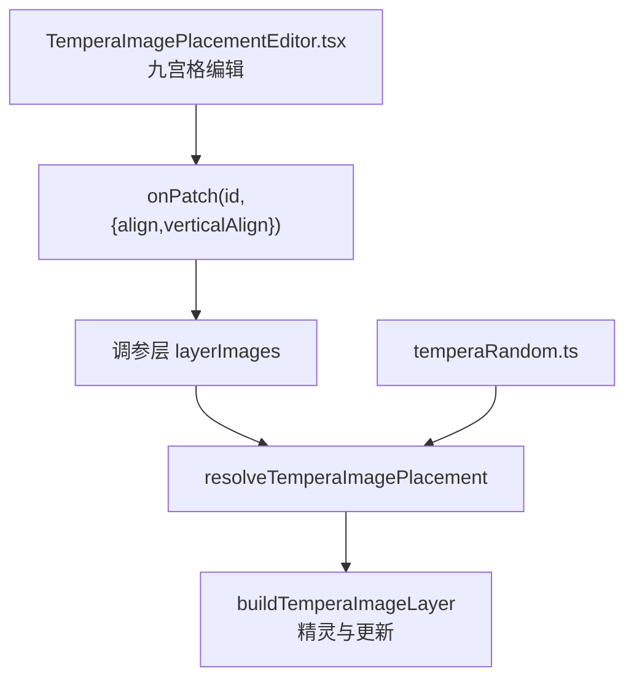
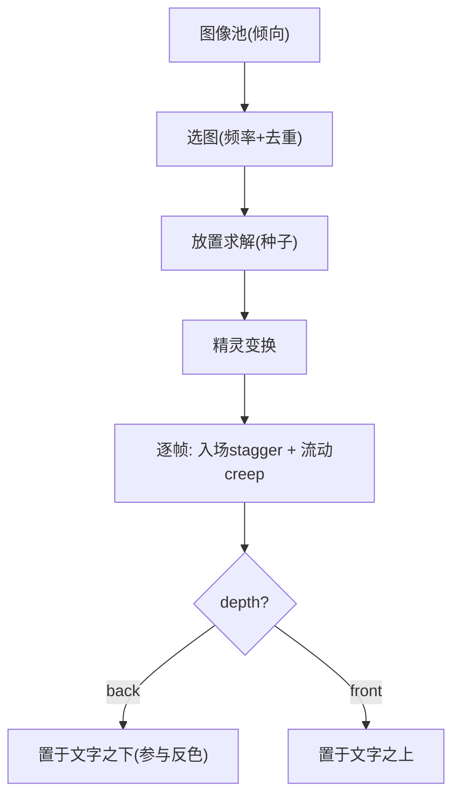
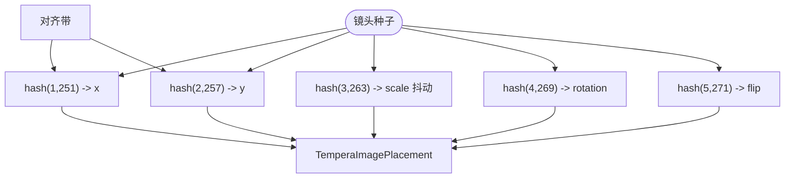
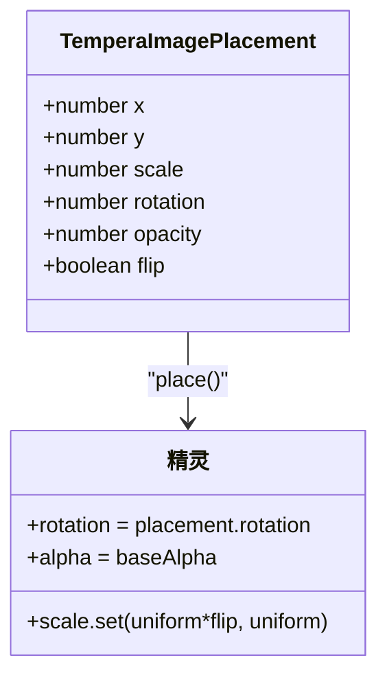
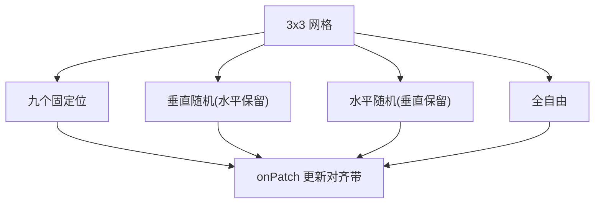
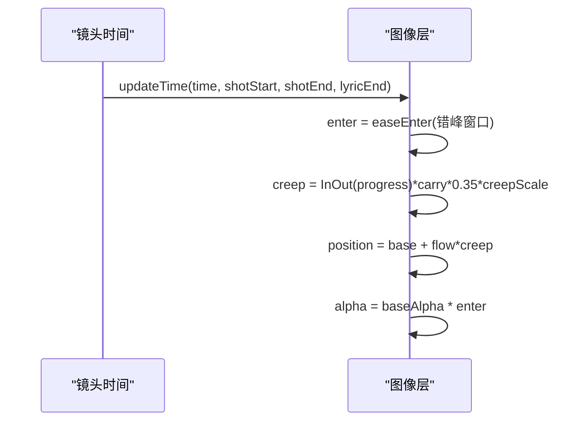
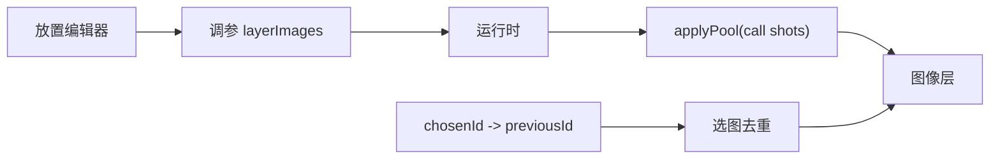

# 图像放置与变换系统

<cite>
**本文引用的文件**   
- [temperaImageLayer.ts](file://src/components/visualizer/tempera/temperaImageLayer.ts)
- [TemperaImagePlacementEditor.tsx](file://src/components/visualizer/tempera/TemperaImagePlacementEditor.tsx)
- [temperaRandom.ts](file://src/components/visualizer/tempera/temperaRandom.ts)
- [temperaMotion.ts](file://src/components/visualizer/tempera/temperaMotion.ts)
- [createTemperaPixiRuntime.ts](file://src/components/visualizer/tempera/createTemperaPixiRuntime.ts)
</cite>

## 目录
1. [引言](#引言)
2. [项目结构](#项目结构)
3. [核心组件](#核心组件)
4. [架构总览](#架构总览)
5. [详细组件分析](#详细组件分析)
6. [依赖关系分析](#依赖关系分析)
7. [性能考量](#性能考量)
8. [故障排查指南](#故障排查指南)
9. [结论](#结论)

## 引言
本文聚焦 Tempera 模式的图像放置与变换系统，围绕以下目标展开：
- 解释位置计算算法：水平/垂直对齐带的分布与确定性种子布局。
- 说明精灵变换：缩放（按高度归一）、旋转（±0.04 弧度）、翻转、透明度的合成方式。
- 阐述 3x3 网格选择器：九个固定位 + 自由/随机模式的交互设计。
- 解释图像与镜头运动的绑定：入场错峰（stagger）与流动蠕动（creep）。

## 项目结构
- temperaImageLayer.ts：放置求解（纯函数）+ 图像层构建（精灵创建与逐帧更新）。
- TemperaImagePlacementEditor.tsx：设置面板中的 3x3 放置编辑器（预览图 + 九宫格按钮 + 随机/自由模式）。
- temperaRandom.ts：哈希（`temperaHash01`）为放置提供确定性伪随机。
- temperaMotion.ts：提供入场与蠕动的缓动。
- createTemperaPixiRuntime.ts：`applyPool` 热更新调用方。

**图示来源**
- [temperaImageLayer.ts:34-63](file://src/components/visualizer/tempera/temperaImageLayer.ts#L34-L63)
- [TemperaImagePlacementEditor.tsx:117-135](file://src/components/visualizer/tempera/TemperaImagePlacementEditor.tsx#L117-L135)

**章节来源**
- [temperaImageLayer.ts:9-14](file://src/components/visualizer/tempera/temperaImageLayer.ts#L9-L14)

## 核心组件
- `ALIGN_BANDS` / `VERTICAL_ALIGN_BANDS`：水平与垂直对齐带（视口分数区间）。
- `resolveTemperaImagePlacement(image, seed)`：纯函数——由对齐带 + 五个哈希槽位生成完整放置。
- `resolveTemperaShotImage(pool, frequency, seed, previousId)`：选图（频率门限 + 相邻不重复）。
- `buildTemperaImageLayer`：创建精灵、按高度归一缩放、驱动入场与蠕动。
- 九宫格编辑器：九个固定位 + 水平随机 / 垂直随机 / 全自由三种模式。

**章节来源**
- [temperaImageLayer.ts:18-32](file://src/components/visualizer/tempera/temperaImageLayer.ts#L18-L32)

## 架构总览
图像放置遵循"倾向而非定点"的哲学：调参只给每个图像一个倾向（对齐带 + 大小 + 透明度），具体坐标由镜头种子在带内确定——为每张图手工定位会毁掉图像池的意义。精灵与构图共享同一套入场错峰与流动蠕动，因此裁切图属于镜头本身而非漂浮在其上。

**图示来源**
- [temperaImageLayer.ts:9-14](file://src/components/visualizer/tempera/temperaImageLayer.ts#L9-L14)
- [temperaImageLayer.ts:113-175](file://src/components/visualizer/tempera/temperaImageLayer.ts#L113-L175)

**章节来源**
- [temperaImageLayer.ts:9-14](file://src/components/visualizer/tempera/temperaImageLayer.ts#L9-L14)

## 详细组件分析

### 位置计算：对齐带与确定性布局
水平与垂直两套对齐带互为镜像，保证九个固定位读作一个真正的 3x3 布局：
- left/top：0.14-0.32；center：0.4-0.6；right/bottom：0.68-0.86；free：0.12-0.88。
放置求解在带内以哈希（盐值 251/257）取样位置；缩放为 `image.scale * (0.9 + hash*0.2)`（±10% 抖动）；旋转为 `(hash - 0.5) * 0.08`（±0.04 弧度）；翻转由哈希 > 0.5 决定。全部由种子驱动——**seek 会重绘完全相同的帧，同一首歌永远以同一方式构图**。

**图示来源**
- [temperaImageLayer.ts:47-63](file://src/components/visualizer/tempera/temperaImageLayer.ts#L47-L63)

**章节来源**
- [temperaImageLayer.ts:18-63](file://src/components/visualizer/tempera/temperaImageLayer.ts#L18-L63)

### 变换：按高度归一与合成
精灵缩放使用**高度归一**：`uniform = (height * placement.scale) / texture.height`——裁切图在任何视口下保持比例。翻转通过 `scale.x` 取负实现（与翻转标志相乘）；旋转直接写入 `sprite.rotation`；透明度取放置的 opacity。所有变换在 `place()` 中一次性应用，`applyPool` 复用同一函数保证热更新路径与初始构建完全一致。

**图示来源**
- [temperaImageLayer.ts:143-152](file://src/components/visualizer/tempera/temperaImageLayer.ts#L143-L152)

**章节来源**
- [temperaImageLayer.ts:143-159](file://src/components/visualizer/tempera/temperaImageLayer.ts#L143-L159)

### 3x3 网格选择器
编辑器提供三层交互：
1. 九宫格按钮：3x3 网格覆盖在图片预览上，点击即 `onPatch(image.id, { align, verticalAlign })`，同时切换对应的水平/垂直带。
2. 独立随机模式：垂直随机（水平仍固定）、水平随机（垂直仍固定）两种半自由模式。
3. 全自由：两个方向都随机（free/free）。
预览图带棋盘底纹（透明背景可见）与 i18n 标签（每个位置有完整的无障碍名称），并提供网格提示文案。

**图示来源**
- [TemperaImagePlacementEditor.tsx:117-190](file://src/components/visualizer/tempera/TemperaImagePlacementEditor.tsx#L117-L190)

**章节来源**
- [TemperaImagePlacementEditor.tsx:28-29](file://src/components/visualizer/tempera/TemperaImagePlacementEditor.tsx#L28-L29)

### 与镜头运动的绑定：stagger 与 creep
- 入场：`enter = easeTemperaEnter((time - shotStart - paceDuration*0.1) / (paceDuration*0.5))`——比构图略晚 10% 起步，形成错峰；alpha 由入场曲线控制，`enter > 0.001` 才可见。
- 蠕动：`creep = InOut(progress) * carry * 0.35 * creepScale`，`carry = max(width,height) * 0.09`，`creepScale` 由种子在 0.6-1.4 间取值。图像比色块蠕动的略慢——读作景深，而不是整帧作为一块板滑动。
- depth：`back` 层置于文字之下（参与反色滤镜读取），`front` 层置于文字之上。

**图示来源**
- [temperaImageLayer.ts:161-172](file://src/components/visualizer/tempera/temperaImageLayer.ts#L161-L172)

**章节来源**
- [temperaImageLayer.ts:161-172](file://src/components/visualizer/tempera/temperaImageLayer.ts#L161-L172)

## 依赖关系分析
- 放置求解依赖哈希与对齐带常量；层构建依赖缓动与 PixiJS Sprite。
- 编辑器只写调参（patch），不直接触碰运行时；热更新通过 `applyPool` 生效。
- `previousId` 机制：每个镜头报告自己选中的图片 id（`chosenId`），下一个镜头避免重复——池中有备选时相邻镜头不撞图。

**图示来源**
- [temperaImageLayer.ts:65-83](file://src/components/visualizer/tempera/temperaImageLayer.ts#L65-L83)

**章节来源**
- [temperaImageLayer.ts:65-99](file://src/components/visualizer/tempera/temperaImageLayer.ts#L65-L99)

## 性能考量
- 放置为纯函数，构建期一次求值；逐帧只更新位置与透明度。
- `applyPool` 热更新避免滑块拖动触发场景重建。
- 精灵数量上限受图像池上限约束（`TEMPERA_MAX_LAYER_IMAGES`），每镜头最多一个精灵。

**章节来源**
- [temperaImageLayer.ts:156-159](file://src/components/visualizer/tempera/temperaImageLayer.ts#L156-L159)

## 故障排查指南
- 固定位看起来不正：检查 `ALIGN_BANDS` 与 `VERTICAL_ALIGN_BANDS` 是否保持镜像对称。
- 图片比例被拉伸：缩放必须走高度归一公式；直接设 `scale.set(s, s)` 会丢失纵横比。
- 相邻镜头总是同一张图：`previousId` 链断了；检查 `chosenId` 是否被正确传递。
- 拖动滑块后图不变：`applyPool` 未找到该 id（图片被删除或 id 变更）。
- 随机位偶尔"贴边"：free 带范围为 0.12-0.88，贴边是带内抽样 + ±10% 缩放的正常表现。
- 翻转导致位置偏移：翻转通过 scale.x 负值实现，锚点 0.5 保证以中心镜像。

**章节来源**
- [temperaImageLayer.ts:47-63](file://src/components/visualizer/tempera/temperaImageLayer.ts#L47-L63)

## 结论
图像放置与变换系统以"倾向带 + 种子取样"的确定性模型实现了既用户可控又每次一致的图像摆位。高度归一缩放、中心翻转、错峰入场与慢速蠕动让图片真正成为镜头构图的成员；九宫格编辑器与自由/随机模式则以最低的交互成本覆盖了从精确排版到随性散布的全部需求。
