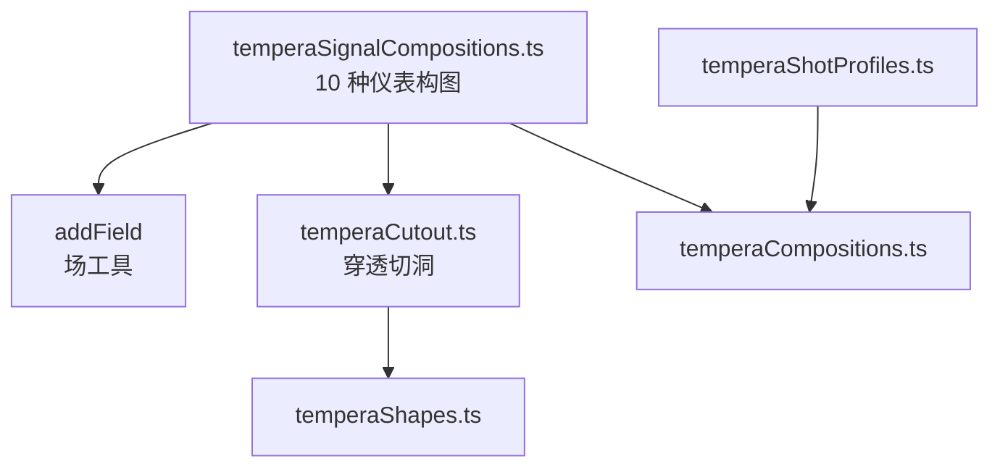
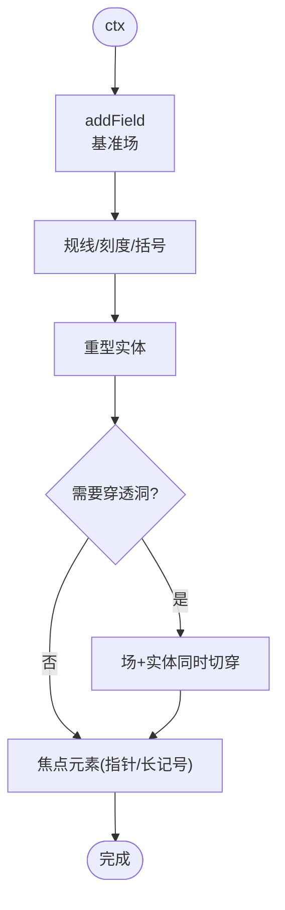
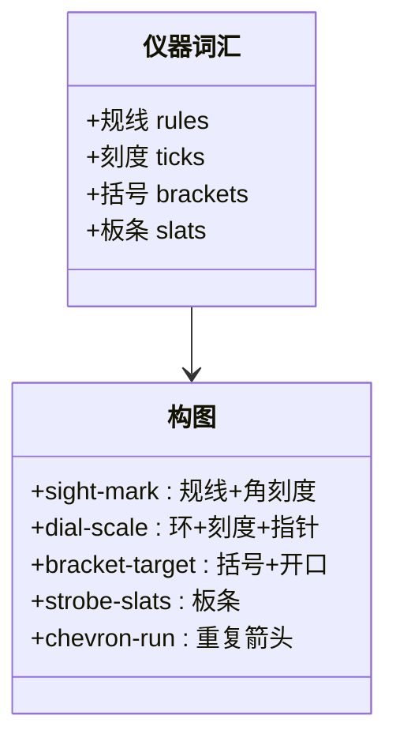
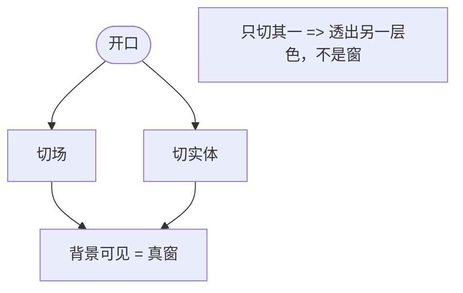
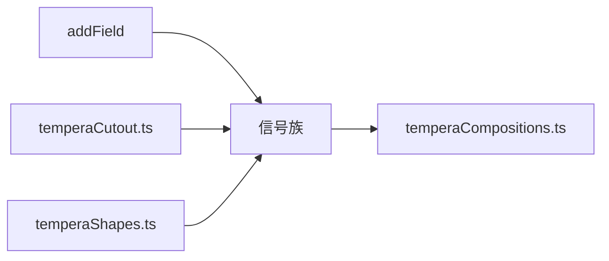

# 信号构图模式

<cite>
**本文引用的文件**   
- [temperaSignalCompositions.ts](file://src/components/visualizer/tempera/compositions/temperaSignalCompositions.ts)
- [temperaCutout.ts](file://src/components/visualizer/tempera/compositions/temperaCutout.ts)
- [temperaHatch.ts](file://src/components/visualizer/tempera/temperaHatch.ts)
- [temperaShapes.ts](file://src/components/visualizer/tempera/temperaShapes.ts)
- [temperaCompositions.ts](file://src/components/visualizer/tempera/temperaCompositions.ts)
- [temperaShotProfiles.ts](file://src/components/visualizer/tempera/temperaShotProfiles.ts)
</cite>

## 目录
1. [引言](#引言)
2. [项目结构](#项目结构)
3. [核心组件](#核心组件)
4. [架构总览](#架构总览)
5. [详细组件分析](#详细组件分析)
6. [依赖关系分析](#依赖关系分析)
7. [性能考量](#性能考量)
8. [故障排查指南](#故障排查指南)
9. [结论](#结论)

## 引言
信号构图模式（Signal 族）是 Tempera 的“仪表盘”家族：硬朗的几何装饰——规线、刻度、括号、重复板条——围绕一块文字共享画框的重型实体排布。装饰刻意保持“度量感”而非表现性，读起来像一张印刷的工程图；实体是画面中唯一被允许“大声”的东西。本文围绕以下目标展开：
- 解释信号处理的可视化语言：波形、刻度、准星与数据流的转译。
- 说明十种仪表构图的形态：准星、表盘、雪佛龙列、计数柱、网格焦点等。
- 阐述“随形体移动的开口”：为什么几种构图的洞口切穿实体而不是场。
- 提供编程接口与自定义扩展方法。

## 项目结构
- temperaSignalCompositions.ts：十种仪表构图，注册到 `TEMPERA_SIGNAL_COMPOSITIONS`；含 `addField` 场工具。
- temperaCutout.ts：切洞与安全区（`axis-caps`、`grid-focus` 等使用）。
- temperaHatch.ts / temperaShapes.ts：几何与绘制。
- temperaShotProfiles.ts：排版区域（实体上的文字位）。

**图示来源**
- [temperaSignalCompositions.ts:15-24](file://src/components/visualizer/tempera/compositions/temperaSignalCompositions.ts#L15-L24)

**章节来源**
- [temperaSignalCompositions.ts:16-23](file://src/components/visualizer/tempera/compositions/temperaSignalCompositions.ts#L16-L23)

## 核心组件
十种仪表构图（kind → 形态）：
- `sight-mark`：全出血规线 + 盒装中心 + 角刻度；交叉下方的实块是歌词站立处（角刻度单臂向内）。
- `dial-scale`：实心表盘环 + 刻度 + 一根重型指针；轮毂保持实心供文字使用（画的是环而不是“挖孔的盘”）。
- `chevron-run`：沿画面重复的雪佛龙箭头，其中一个反向——重复让交接不可见，唯一的异类让视线落点清晰。
- `tally-column`：贴着一边的计数柱，最长的一笔是焦点元素。
- `grid-focus`：发丝网格，一格填充、两格切穿。
- `axis-caps`：一根贯穿全长的重轴，中段钻孔、两端带帽块；洞口随轴移动而不是留在场里（孔同时切穿场与轴）。
- `strobe-slats`：交替宽度的板条——最宽的一条以浅色调绘制，作为文字位。
- `offset-plate`：三块同尺寸错位叠印的板（经典套印错位）；顶板带一个打穿整叠的登记孔。
- `radial-comb`：停靠在画外的轮毂射出一把光梳，其中一个实心扇区充当实体。
- `bracket-target`：取景器——低位开口周围环绕括号，文字站在上方的板上。

**章节来源**
- [temperaSignalCompositions.ts:34-280](file://src/components/visualizer/tempera/compositions/temperaSignalCompositions.ts#L34-L280)

## 架构总览
信号族的绘制顺序是“场 → 度量装饰 → 实体 → 穿透开洞 → 焦点元素”：先以 `addField` 铺一块基准场，再用规线/刻度建立坐标系，随后置入重型实体并让部分构图从实体与场同时切洞（如 `axis-caps` 的轴孔、`offset-plate` 的登记孔），最后安放指针、长记号等焦点元素。

**图示来源**
- [temperaSignalCompositions.ts:24-58](file://src/components/visualizer/tempera/compositions/temperaSignalCompositions.ts#L24-L58)
- [temperaSignalCompositions.ts:157-217](file://src/components/visualizer/tempera/compositions/temperaSignalCompositions.ts#L157-L217)

**章节来源**
- [temperaSignalCompositions.ts:16-23](file://src/components/visualizer/tempera/compositions/temperaSignalCompositions.ts#L16-L23)

## 详细组件分析

### 度量装饰语言
家族的装饰全部来自一套固定的“仪器词汇”：
- 规线（rules）：横贯画面的发丝线，建立轴线与基准。
- 刻度（ticks）：环上/线上的短划，标注度量。
- 括号（brackets）：围出取景或焦点区。
- 板条（slats）：重复的固体分割，制造机械节奏。
装饰遵守“度量而非表现”的原则：所有线条服从网格与轴线，不出现手绘感曲线。此约束让画面读作工程图，反衬出唯一“响亮”的重型实体。

**图示来源**
- [temperaSignalCompositions.ts:16-23](file://src/components/visualizer/tempera/compositions/temperaSignalCompositions.ts#L16-L23)

**章节来源**
- [temperaSignalCompositions.ts:16-23](file://src/components/visualizer/tempera/compositions/temperaSignalCompositions.ts#L16-L23)

### 随形体移动的开口
信号族有几种构图把开口切穿“实体本身”而非背后的场，让洞口随形体移动而不是坐在场后：
- `axis-caps`：轴孔同时切穿场与轴——只切轴会透出场色而不是背景，“洞只有背后什么都没有时才是窗”。
- `offset-plate`：登记孔笔直打穿整叠错位板——场与每一块板在同一位置获得相同的开口，才是真正的“透视”。
- `grid-focus`：两格被切净，一格填充——网格中的“洞与实”构成焦点。

**图示来源**
- [temperaSignalCompositions.ts:157-181](file://src/components/visualizer/tempera/compositions/temperaSignalCompositions.ts#L157-L181)
- [temperaSignalCompositions.ts:198-217](file://src/components/visualizer/tempera/compositions/temperaSignalCompositions.ts#L198-L217)

**章节来源**
- [temperaSignalCompositions.ts:22-23](file://src/components/visualizer/tempera/compositions/temperaSignalCompositions.ts#L22-L23)

### 指示元素与重复节奏
- `dial-scale` 的指针由种子决定角度，每次出现都不同；轮毂保持实心——画的是“画的环”而不是“挖孔的盘”，因为轮毂要承载文字。
- `chevron-run` 用“重复 + 一个反向”制造节奏：重复使镜头交接隐形，异类让视觉落点清晰。
- `tally-column` 以“最长的一笔”为焦点，模拟计数符号的累积感。
- `bracket-target` 把开口压低、文字上移，形成取景器的上重下轻构图。

**章节来源**
- [temperaSignalCompositions.ts:59-134](file://src/components/visualizer/tempera/compositions/temperaSignalCompositions.ts#L59-L134)
- [temperaSignalCompositions.ts:218-280](file://src/components/visualizer/tempera/compositions/temperaSignalCompositions.ts#L218-L280)

### 编程接口与自定义扩展
- 场：`addField(ctx, color, alpha = 0.92)` 铺基准场。
- 切洞：使用 temperaCutout 的 `addCutField` / `addHoleLip` 对场与实体做穿透切洞。
- 排版：区域定义在 `temperaShotProfiles.ts`，必须落在实心承载物（块、轮毂、板条）上。
扩展步骤：新增绘制函数 → 注册到 `TEMPERA_SIGNAL_COMPOSITIONS` → 同步 `types.ts` 与 profiles。

**章节来源**
- [temperaSignalCompositions.ts:24-31](file://src/components/visualizer/tempera/compositions/temperaSignalCompositions.ts#L24-L31)

## 依赖关系分析
- 信号族依赖 `addField`（本地）与 temperaCutout（穿透切洞）、temperaShapes（绘制）、temperaHatch（几何）。
- 与巨石族共享“重型实体 + 纤细记号”的构图哲学，但信号族的记号是“仪器语言”而非“建筑测量”。
- 排线使用较少，突出了工程图的干净感。

**图示来源**
- [temperaSignalCompositions.ts:1-14](file://src/components/visualizer/tempera/compositions/temperaSignalCompositions.ts#L1-L14)

**章节来源**
- [temperaCompositions.ts:117-123](file://src/components/visualizer/tempera/temperaCompositions.ts#L117-L123)

## 性能考量
- 刻度与规线数量级在几十条，全部为静态线段。
- 穿透切洞的孔数有限（1-2 个），不影响栅格化成本。
- 无网线大面积覆盖，绘制成本低于海报族。

**章节来源**
- [temperaSignalCompositions.ts:135-156](file://src/components/visualizer/tempera/compositions/temperaSignalCompositions.ts#L135-L156)

## 故障排查指南
- 洞透出的是场色而不是背景：开口只切了实体或只切了场；两处都要切。
- 表盘看起来是一个“带洞的盘”：应绘制实心环（annulus）而不是圆盘挖孔，否则轮毂上的文字会露底。
- 雪佛龙节奏紊乱：重复序列必须保持间距一致，仅允许一个反向元素。
- 文字没有落脚处：检查排版区域是否落在块/轮毂/板条上；信号族的文字不放在开口上。
- 装饰盖过实体：装饰的线宽与 alpha 需要保持“度量级”，实体是画面唯一响亮的部分。

**章节来源**
- [temperaSignalCompositions.ts:59-95](file://src/components/visualizer/tempera/compositions/temperaSignalCompositions.ts#L59-L95)
- [temperaSignalCompositions.ts:157-181](file://src/components/visualizer/tempera/compositions/temperaSignalCompositions.ts#L157-L181)

## 结论
信号构图模式把仪表与工程图的视觉语言引入 Tempera：以固定的仪器词汇构建装饰、以穿透切洞保证开口的真实性、以单个重型实体承担画面的全部音量。十种构图从准星到取景器覆盖了“测量”与“观察”的完整隐喻，是 Tempera 中理性气质最强、最接近印刷图纸的构图家族。
