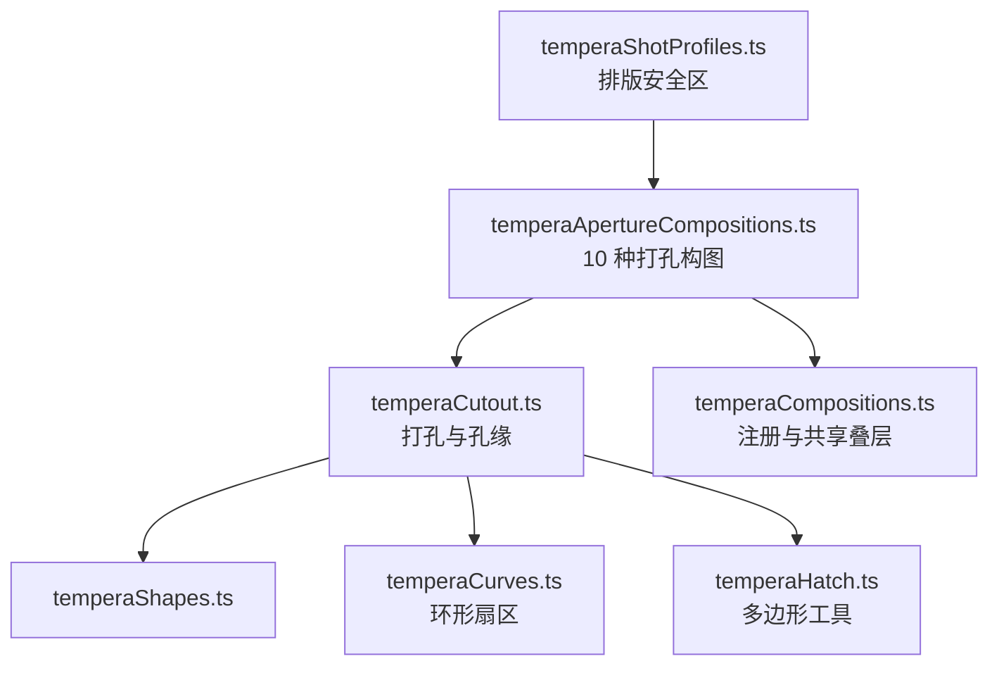
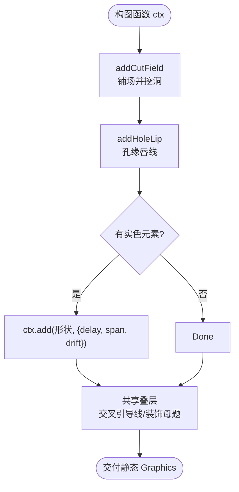
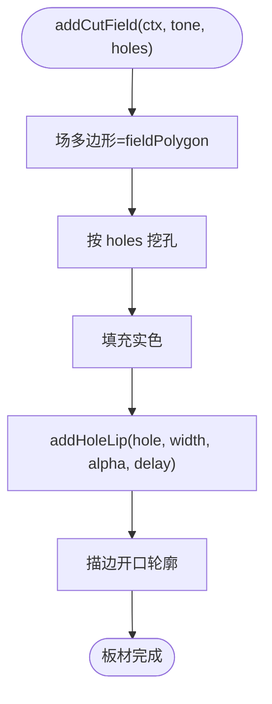
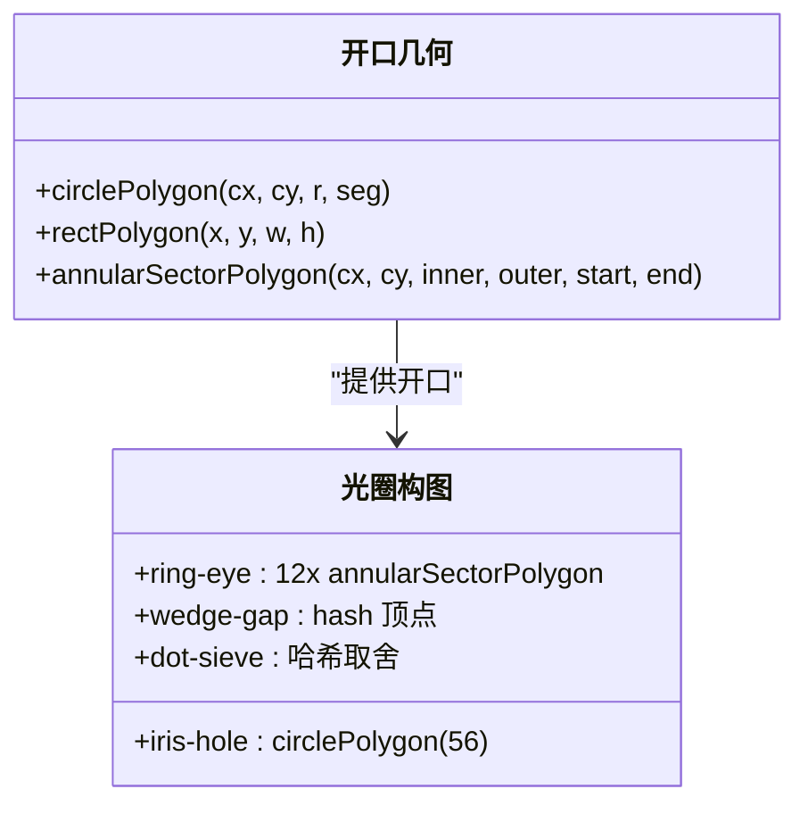
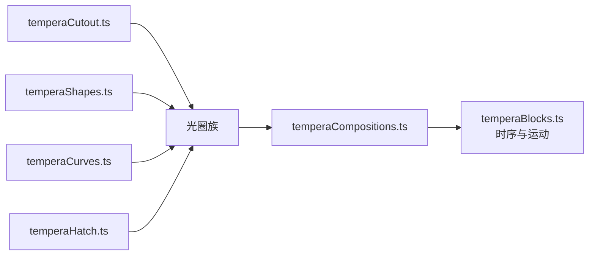

# 光圈构图模式

<cite>
**本文引用的文件**   
- [temperaApertureCompositions.ts](file://src/components/visualizer/tempera/compositions/temperaApertureCompositions.ts)
- [temperaCutout.ts](file://src/components/visualizer/tempera/compositions/temperaCutout.ts)
- [temperaShapes.ts](file://src/components/visualizer/tempera/temperaShapes.ts)
- [temperaHatch.ts](file://src/components/visualizer/tempera/temperaHatch.ts)
- [temperaCurves.ts](file://src/components/visualizer/tempera/temperaCurves.ts)
- [temperaCompositions.ts](file://src/components/visualizer/tempera/temperaCompositions.ts)
- [temperaShotProfiles.ts](file://src/components/visualizer/tempera/temperaShotProfiles.ts)
</cite>

## 目录
1. [引言](#引言)
2. [项目结构](#项目结构)
3. [核心组件](#核心组件)
4. [架构总览](#架构总览)
5. [详细组件分析](#详细组件分析)
6. [依赖关系分析](#依赖关系分析)
7. [性能考量](#性能考量)
8. [故障排查指南](#故障排查指南)
9. [结论](#结论)

## 引言
光圈构图模式（Aperture 族）是 Tempera 中“打孔板材”的构图家族：一整块平色板材上被干净地“切”出一个开口，让外壳的实时背景成为画面的主体。开口的形状就是整个构图，因此这批构图几乎不携带其他几何——被装饰过的板材会与自己的窗口竞争注意力。本文围绕以下目标展开：
- 解释光圈构图的开口设计原理：圆孔、缝槽、齿孔、闸门、十字通风孔等十种开口形态。
- 说明打孔的实现机制：`addCutField` 与 `addHoleLip` 如何构造“真空洞 + 孔缘唇线”。
- 阐述布局安全区：为什么排版区域必须坐在实色板材上而永不跨在开口上。
- 提供使用示例、配置参数与性能建议。

## 项目结构
- temperaApertureCompositions.ts：光圈族十个构图实现，全部注册到 `TEMPERA_APERTURE_COMPOSITIONS`。
- temperaCutout.ts：打孔基础设施（`addCutField`、`addHoleLip`、`fieldPolygon`、流向工具）。
- temperaShapes.ts / temperaCurves.ts / temperaHatch.ts：图形绘制、曲线多边形与网线规格。
- temperaCompositions.ts：总注册表与共享叠层（交叉引导线、装饰母题）。
- temperaShotProfiles.ts：每种构图的排版区域与相机档案（含 `sharedDecor` 开关）。

**图示来源**
- [temperaApertureCompositions.ts:1-12](file://src/components/visualizer/tempera/compositions/temperaApertureCompositions.ts#L1-L12)
- [temperaCutout.ts:33-58](file://src/components/visualizer/tempera/compositions/temperaCutout.ts#L33-L58)
- [temperaCompositions.ts:35-49](file://src/components/visualizer/tempera/temperaCompositions.ts#L35-L49)

**章节来源**
- [temperaApertureCompositions.ts:14-22](file://src/components/visualizer/tempera/compositions/temperaApertureCompositions.ts#L14-L22)

## 核心组件
光圈族共十个构图（kind → 形态）：
- `iris-hole`：一块 tone3 板材上切出 56 段圆的虹膜孔，孔位固定在 (0.68w, 0.42h)，半径 0.3 单位；一根从远端伸入的横条让开口显得“被安装”。
- `slot-rail`：横贯画面的信箱缝，上下厚块承载文字，开口读作地平线而非窗。
- `punch-row`：上下两排各 9 个齿孔（半径 0.028 单位），齿孔之间的画幅即照片。
- `film-gate`：电影片门——大矩形曝光窗 + 两侧 4 组传动孔。
- `cross-vent`：十字形通风口切在高处，下方留给文字。
- `louvre-slats`：六道带倾角的百叶缝，厚度向下递减。
- `ring-eye`：玫瑰窗——由 12 段环形扇区拼出圆环开口，辐条与轮毂仍是板材本身；文字骑在轮毂上（全家族唯一坐在开口内部的区域，因为轮毂从未被切）。
- `notch-stack`：沿右侧阶梯下行的四个方形开口，逐个变小。
- `wedge-gap`：从顶边楔入的三角开口，板材保留下半部供文字使用。
- `dot-sieve`：六行五列渐疏的小孔筛，背景像渐变的漏光一样透进来。

**章节来源**
- [temperaApertureCompositions.ts:23-195](file://src/components/visualizer/tempera/compositions/temperaApertureCompositions.ts#L23-L195)

## 架构总览
每个光圈构图遵循同一绘制协议：先由 `addCutField` 铺满一块实色“场”，再把开口多边形作为“洞”一次挖掉（始终挖穿整个场），然后由 `addHoleLip` 给开口描一圈内缘唇线；最后按需叠加少量实色元素（横条、引导线、圆环）。构图函数不持有任何时间状态——所有入场延迟、跨度与漂移都通过 `ctx.add` 的选项交给 temperaBlocks 处理。

**图示来源**
- [temperaApertureCompositions.ts:23-37](file://src/components/visualizer/tempera/compositions/temperaApertureCompositions.ts#L23-L37)
- [temperaCutout.ts:33-58](file://src/components/visualizer/tempera/compositions/temperaCutout.ts#L33-L58)
- [temperaCompositions.ts:117-123](file://src/components/visualizer/tempera/temperaCompositions.ts#L117-L123)

**章节来源**
- [temperaCompositionContext.ts:12-52](file://src/components/visualizer/tempera/temperaCompositionContext.ts#L12-L52)

## 详细组件分析

### 打孔机制：真空洞与孔缘
`addCutField` 接收一个实色 tone 与开口多边形数组，绘制“场减洞”的复合图形；`addHoleLip` 对开口轮廓描边，形成板材厚度的暗示（厚度、亮度与延迟可调）。由于洞是真正切穿的（多边形挖孔而非叠盖），背景在孔中连续可见——这也是光圈族敢于让背景当主角的前提。

**图示来源**
- [temperaCutout.ts:19-58](file://src/components/visualizer/tempera/compositions/temperaCutout.ts#L19-L58)

**章节来源**
- [temperaCutout.ts:33-58](file://src/components/visualizer/tempera/compositions/temperaCutout.ts#L33-L58)

### 开口几何库
- 圆形/多边形：`circlePolygon`（默认 28 段，虹膜孔用 56 段保证圆润）、`rectPolygon`、`diamondPolygon`。
- 环形扇区：`annularSectorPolygon`（`ring-eye` 的 12 段玫瑰窗由它拼装，段间留 0.03 弧度间隙形成辐条）。
- 十字/楔形：`cross-vent` 与 `wedge-gap` 使用手写顶点数组，楔形的顶点 x 由 `temperaHash01(seed, 3, 137)` 在 0.4-0.6 宽度间确定。
- 渐疏筛孔：`dot-sieve` 以 `1 - column/4.5` 的密度曲线 + 哈希判定逐孔取舍，孔半径随密度缩小。

**图示来源**
- [temperaApertureCompositions.ts:29-31](file://src/components/visualizer/tempera/compositions/temperaApertureCompositions.ts#L29-L31)
- [temperaApertureCompositions.ts:139-145](file://src/components/visualizer/tempera/compositions/temperaApertureCompositions.ts#L139-L145)
- [temperaCurves.ts:181-203](file://src/components/visualizer/tempera/temperaCurves.ts#L181-L203)

**章节来源**
- [temperaApertureCompositions.ts:23-195](file://src/components/visualizer/tempera/compositions/temperaApertureCompositions.ts#L23-L195)

### 排版安全区与配置参数
光圈族遵守 Tempera 的切洞安全规则：排版区域必须坐在实色板材上，永不跨在开口上（见 `temperaCutout.ts` 的说明）。因此：
- `ring-eye` 的文字选择轮毂——它是唯一“被有意保留”的开口内部区域。
- `cross-vent` 与 `wedge-gap` 把开口放高，把下半部实体留给文字。
- `dot-sieve` 只铺五列而不是九列，让渐疏在下半版面开始前衰减到零。
- 各构图的区域与相机参数定义在 `temperaShotProfiles.ts`，与几何解耦，可独立微调。

**章节来源**
- [temperaApertureCompositions.ts:14-22](file://src/components/visualizer/tempera/compositions/temperaApertureCompositions.ts#L14-L22)
- [temperaApertureCompositions.ts:184-190](file://src/components/visualizer/tempera/compositions/temperaApertureCompositions.ts#L184-L190)

### 使用示例与自定义配置
新增光圈构图的三步：
1. 在 `temperaApertureCompositions.ts` 中新增绘制函数，产出开口多边形并调用 `addCutField` / `addHoleLip`。
2. 在 `TEMPERA_APERTURE_COMPOSITIONS` 中注册 kind；同时在 `types.ts` 的 `TemperaShotKind` 与 `temperaShotProfiles.ts` 中补上排版区域与相机档案。
3. 运行注册表测试（断言无缺口）与快照更新流程。

**章节来源**
- [temperaCompositions.ts:51-54](file://src/components/visualizer/tempera/temperaCompositions.ts#L51-L54)

## 依赖关系分析
- 光圈族依赖 temperaCutout（打孔）、temperaShapes（绘制）、temperaCurves（环形扇区）、temperaHatch（多边形与网线规格）。
- 共享叠层由总入口 `drawTemperaComposition` 统一追加：交叉引导线（除纯栏位构图外）与装饰母题（`showDecor` 开启时）。
- 排版区域与相机由 `temperaShotProfiles.ts` 独立描述，本族不感知。

**图示来源**
- [temperaApertureCompositions.ts:1-12](file://src/components/visualizer/tempera/compositions/temperaApertureCompositions.ts#L1-L12)
- [temperaCompositions.ts:117-123](file://src/components/visualizer/tempera/temperaCompositions.ts#L117-L123)

**章节来源**
- [temperaBlocks.ts:57-90](file://src/components/visualizer/tempera/temperaBlocks.ts#L57-L90)

## 性能考量
- 开孔数量受控：最大孔数来自 `punch-row`（18 个圆）与 `dot-sieve`（最多 30 个），全部为静态 Graphics，不是每帧计算。
- 一次成型：`addCutField` 以单个 Graphics 承载“场 + 全部洞”，避免逐洞节点。
- 延迟与跨度通过块选项表达，入场动画由统一的块系统驱动，构图自身零时序成本。
- 高段数仅给必要处（56 段圆、12 段环），其余开口使用低段数多边形。

**章节来源**
- [temperaApertureCompositions.ts:55-70](file://src/components/visualizer/tempera/compositions/temperaApertureCompositions.ts#L55-L70)
- [temperaBlocks.ts:19-56](file://src/components/visualizer/tempera/temperaBlocks.ts#L19-L56)

## 故障排查指南
- 开口处透出错误颜色：检查洞是否真正切穿（`addCutField` 的 holes 是否包含该多边形），而不是用同色形状叠盖。
- 孔缘丢失：`addHoleLip` 需要独立的延迟参数与其所属板材配合；确认唇线没有被后续同色元素覆盖。
- 文字压在开口上：核对 `temperaShotProfiles.ts` 中该 kind 的区域定义，确保不落在 holes 的包围范围内。
- 背景滑动后露出边缘：全出血形状必须按 `ctx.bleed` 外扩——`iris-hole` 的横条与 `louvre` 的缝都依赖它。
- 楔形顶点不稳定：`wedge-gap` 顶点由 `temperaHash01(seed, 3, 137)` 决定，属确定性伪随机；不同种子下位置变化是预期行为。

**章节来源**
- [temperaApertureCompositions.ts:33-34](file://src/components/visualizer/tempera/compositions/temperaApertureCompositions.ts#L33-L34)
- [temperaCompositionContext.ts:34-39](file://src/components/visualizer/tempera/temperaCompositionContext.ts#L34-L39)

## 结论
光圈构图模式用“一块板 + 一个洞”的极简语法，把背景本身变成构图要素。打孔基础设施（切场、孔缘、安全区规则）保证了这种做法的视觉可信度与排版安全，而开口形态库（圆、缝、齿、闸、十几种变体）提供了足够的叙事变化。它是 Tempera “纸面切割”美学最纯粹的表达。
