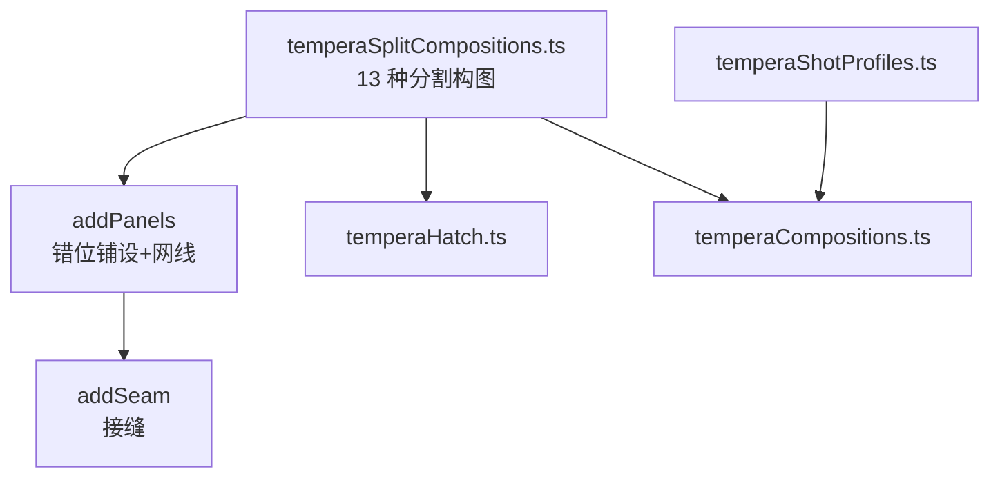
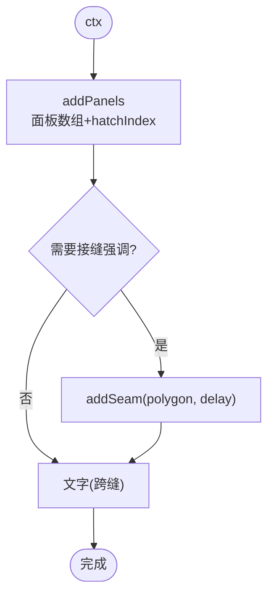
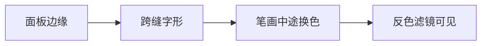
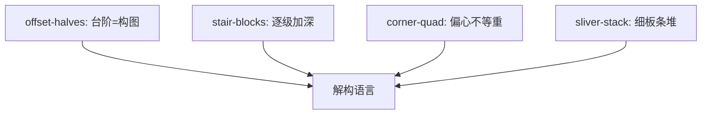
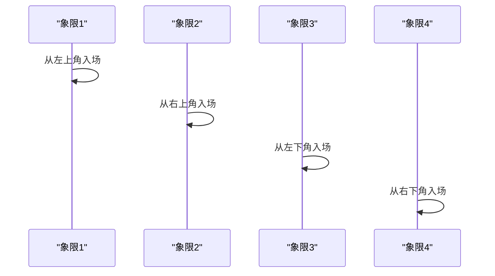
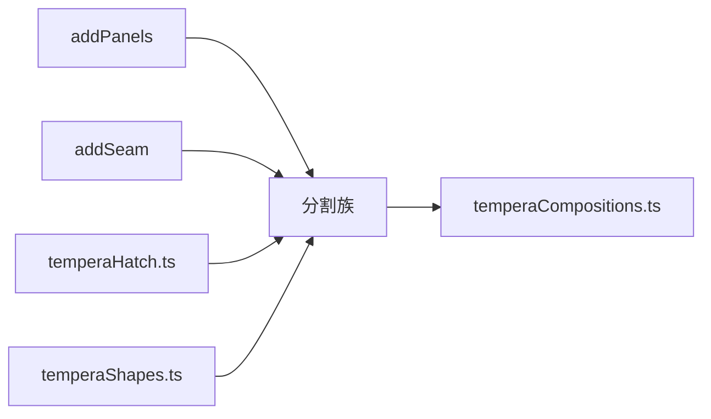

# 分割构图模式

<cite>
**本文引用的文件**   
- [temperaSplitCompositions.ts](file://src/components/visualizer/tempera/compositions/temperaSplitCompositions.ts)
- [temperaHatch.ts](file://src/components/visualizer/tempera/temperaHatch.ts)
- [temperaShapes.ts](file://src/components/visualizer/tempera/temperaShapes.ts)
- [temperaCompositions.ts](file://src/components/visualizer/tempera/temperaCompositions.ts)
- [temperaShotProfiles.ts](file://src/components/visualizer/tempera/temperaShotProfiles.ts)
- [temperaBlocks.ts](file://src/components/visualizer/tempera/temperaBlocks.ts)
</cite>

## 目录
1. [引言](#引言)
2. [项目结构](#项目结构)
3. [核心组件](#核心组件)
4. [架构总览](#架构总览)
5. [详细组件分析](#详细组件分析)
6. [依赖关系分析](#依赖关系分析)
7. [性能考量](#性能考量)
8. [故障排查指南](#故障排查指南)
9. [结论](#结论)

## 引言
分割构图模式（Split 族）是把画框切成平色面板的家族，也是反色滤镜反应最强烈的一族：一个跨在面板边缘的字形会在笔画中途翻转颜色。本文围绕以下目标展开：
- 解释分割构图的解构主义原理：碎片化重组、多重视角与时空交错。
- 说明十三种分割形态：双分、四分、三列、棋盘、错位半块、阶梯块等。
- 阐述分割线与面板的进入动画：各自的入场方向与错位节奏。
- 提供分割构图的创意应用与实验性使用方法。

## 项目结构
- temperaSplitCompositions.ts：十三种分割构图，注册到 `TEMPERA_SPLIT_COMPOSITIONS`；含 `addPanels`（面板铺设 + 单块网线）与 `addSeam`（接缝）工具。
- temperaHatch.ts：排线规格（防“平矢量感”）。
- temperaShapes.ts：绘制工具。
- temperaShotProfiles.ts：排版区域（跨缝文字位）。

**图示来源**
- [temperaSplitCompositions.ts:7-14](file://src/components/visualizer/tempera/compositions/temperaSplitCompositions.ts#L7-L14)

**章节来源**
- [temperaSplitCompositions.ts:7-9](file://src/components/visualizer/tempera/compositions/temperaSplitCompositions.ts#L7-L9)

## 核心组件
十三种分割构图（kind → 形态）：
- `duo-split`：双分面板——家族原型。
- `quad-split`：四块平色面板在文字下汇合，每个象限从各自的角落入场。
- `tri-column`：三列。
- `thirds-stack`：三层横叠。
- `checker-quad`：对角象限共享色调，文字穿越中心时交替变色。
- `corner-wedge`：角落楔形。
- `diagonal-halves`：对角两半。
- `cross-axis`：两条重轴把画框切成分区，文字坐在交叉点上。
- `offset-halves`：两半被推错位——它们错过的地方形成的台阶就是构图。
- `stair-blocks`：四块沿对角线行进的方块，每块深一级。
- `pillar-gap`：两团重体留下一条明亮的垂直缝，歌词站在缝里。
- `corner-quad`：两个轴上故意不等重的象限，偏心分割。
- `sliver-stack`：一叠细长的交替板条填满一侧。

**章节来源**
- [temperaSplitCompositions.ts:36-202](file://src/components/visualizer/tempera/compositions/temperaSplitCompositions.ts#L36-L202)

## 架构总览
分割族由两个共享工具驱动：`addPanels` 以错位方式铺设面板并给其中一块覆盖网线（“让分割永远不读作平矢量艺术”）；`addSeam` 在有意义的切口处添加接缝强调。各构图的差异在于面板数量、分割线方向与入场方向的组合。

**图示来源**
- [temperaSplitCompositions.ts:14-35](file://src/components/visualizer/tempera/compositions/temperaSplitCompositions.ts#L14-L35)

**章节来源**
- [temperaSplitCompositions.ts:12-35](file://src/components/visualizer/tempera/compositions/temperaSplitCompositions.ts#L12-L35)

## 详细组件分析

### 反色滤镜的主战场
分割族的构图逻辑直接服务于反色滤镜：面板边缘=字形翻转颜色的切点。设计规则因此是：
- 文字区域必须跨过至少一条分割线。
- 分割线的两侧收敛于不同 tone（对比越强，翻转越醒目）。
- `checker-quad` 把这一逻辑推到极致：对角象限同色，文字穿越中心时在四种底色上交替——一“句”之内数次变色。

**图示来源**
- [temperaSplitCompositions.ts:88-100](file://src/components/visualizer/tempera/compositions/temperaSplitCompositions.ts#L88-L100)

**章节来源**
- [temperaSplitCompositions.ts:7-9](file://src/components/visualizer/tempera/compositions/temperaSplitCompositions.ts#L7-L9)

### 错位、台阶与解构
- `offset-halves`：两半互相错过半步，形成台阶——“错过的地方就是构图”。
- `stair-blocks`：四块方块沿对角线逐级加深，是“楼梯”意象的纯几何表达。
- `corner-quad`：故意不等重的偏心分割，打破对称的机械感。
- `sliver-stack`：细板条交替填满一侧，形成密集的“百叶”边缘。

**图示来源**
- [temperaSplitCompositions.ts:139-151](file://src/components/visualizer/tempera/compositions/temperaSplitCompositions.ts#L139-L151)
- [temperaSplitCompositions.ts:152-164](file://src/components/visualizer/tempera/compositions/temperaSplitCompositions.ts#L152-L164)

**章节来源**
- [temperaSplitCompositions.ts:139-202](file://src/components/visualizer/tempera/compositions/temperaSplitCompositions.ts#L139-L202)

### 面板的进入动画
分割族继承了块系统的入场语言：每个象限/面板可以从“自己的角落”滑入（`quad-split`），两半可以互相错动（`offset-halves`），板条可以逐条生长。由于每个面板是独立节点，入场方向可以完全独立，构成“拼图落位”式的开场。

**图示来源**
- [temperaSplitCompositions.ts:53-67](file://src/components/visualizer/tempera/compositions/temperaSplitCompositions.ts#L53-L67)

**章节来源**
- [temperaSplitCompositions.ts:14-35](file://src/components/visualizer/tempera/compositions/temperaSplitCompositions.ts#L14-L35)

### 创意应用与实验性用法
- `pillar-gap` 的垂直亮缝是“分割中的留白”——两块重体之间的光缝由背景本身构成。
- `cross-axis` 让文字坐在十字交叉点上，是“把注意力钉在中心”的最强语法。
- `tri-column` 与 `thirds-stack` 提供三等分的稳定节奏，适合列表式的歌词堆叠。
- 实验方向：非正交分割（斜线、曲线）可以通过扩展 `addPanels` 的多边形数组实现，但需保持“文字跨缝”的构图规则。

**章节来源**
- [temperaSplitCompositions.ts:165-202](file://src/components/visualizer/tempera/compositions/temperaSplitCompositions.ts#L165-L202)

## 依赖关系分析
- 分割族依赖 `addPanels`/`addSeam`（本地工具）、temperaHatch（网线规格）、temperaShapes（绘制）。
- 与海报族的区别：分割族用平直切口制造纪律，海报族用倾斜制造动势；两族共享“面板切割”的底层语言。
- 排版区域必须与分割线位置精确协调。

**图示来源**
- [temperaSplitCompositions.ts:1-6](file://src/components/visualizer/tempera/compositions/temperaSplitCompositions.ts#L1-L6)

**章节来源**
- [temperaCompositions.ts:117-123](file://src/components/visualizer/tempera/temperaCompositions.ts#L117-L123)

## 性能考量
- 面板数量最大为四块 + 每块一个 Graphics；`sliver-stack` 的板条数最多，但仍为静态几何。
- 网线只覆盖一块面板（`hatchIndex`），成本受控。
- 接缝使用线条而非独立节点，开销极小。

**章节来源**
- [temperaSplitCompositions.ts:14-35](file://src/components/visualizer/tempera/compositions/temperaSplitCompositions.ts#L14-L35)

## 故障排查指南
- 文字没有变色：文字区域没有跨过分割线；调整区域或分割线位置。
- 分割“太平”：没有错位、网线或接缝强调；`addPanels` 的 hatchIndex 必须为其中之一。
- 象限入场方向混乱：每个面板的 enterDX/enterDY 应对应其所在角落的象限方向。
- 棋盘效果不明显：对角象限必须同色，相邻象限必须异色；检查 tone 分配。
- 亮缝被吞没：`pillar-gap` 的缝宽需要大于两侧实体的接近速度差，避免入场时被盖住。

**章节来源**
- [temperaSplitCompositions.ts:88-100](file://src/components/visualizer/tempera/compositions/temperaSplitCompositions.ts#L88-L100)
- [temperaSplitCompositions.ts:165-175](file://src/components/visualizer/tempera/compositions/temperaSplitCompositions.ts#L165-L175)

## 结论
分割构图模式是 Tempera 中与反色滤镜耦合最深的家族：面板切割直接定义了文字的颜色翻转点。以 `addPanels`/`addSeam` 两个工具、十三种形态与可独立入场的面板节点，它在纪律性的平直切口与错位解构之间取得了平衡，是构建“强节奏、强图形”段落的首选语法。
