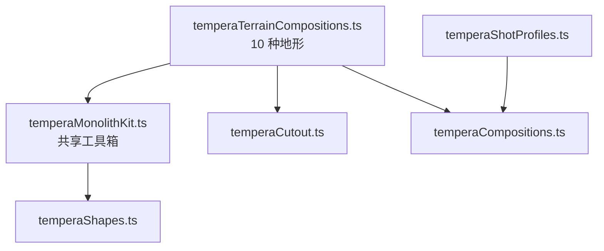
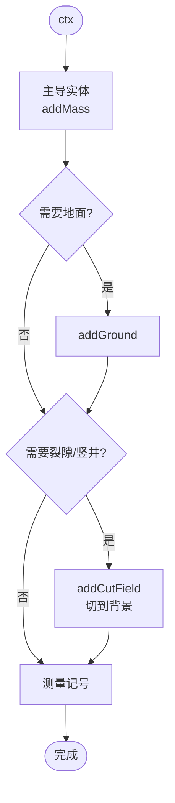
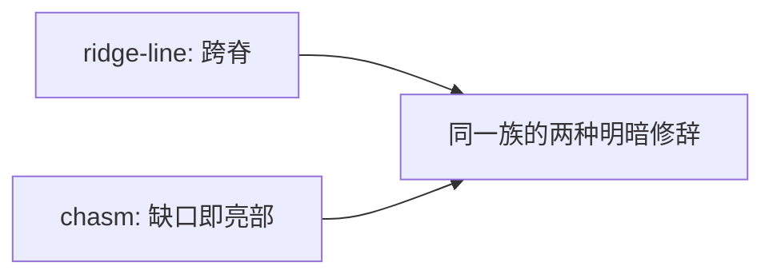
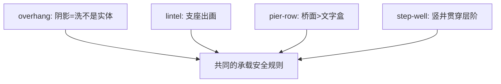
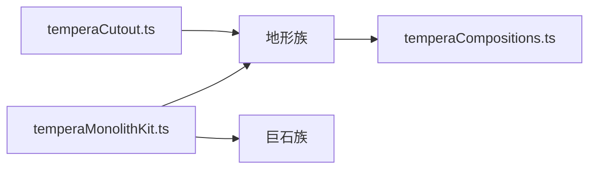

# 地形构图模式

<cite>
**本文引用的文件**   
- [temperaTerrainCompositions.ts](file://src/components/visualizer/tempera/compositions/temperaTerrainCompositions.ts)
- [temperaMonolithKit.ts](file://src/components/visualizer/tempera/compositions/temperaMonolithKit.ts)
- [temperaCutout.ts](file://src/components/visualizer/tempera/compositions/temperaCutout.ts)
- [temperaShapes.ts](file://src/components/visualizer/tempera/temperaShapes.ts)
- [temperaHatch.ts](file://src/components/visualizer/tempera/temperaHatch.ts)
- [temperaShotProfiles.ts](file://src/components/visualizer/tempera/temperaShotProfiles.ts)
</cite>

## 目录
1. [引言](#引言)
2. [项目结构](#项目结构)
3. [核心组件](#核心组件)
4. [架构总览](#架构总览)
5. [详细组件分析](#详细组件分析)
6. [依赖关系分析](#依赖关系分析)
7. [性能考量](#性能考量)
8. [故障排查指南](#故障排查指南)
9. [结论](#结论)

## 引言
地形构图模式（Terrain 族）是粗野主义套装的另一半：这里的实体读作“地面与结构”而不是“物体”——山脊、跨梁、桥墩、护坡。它遵循与巨石族相同的规则（一个主导实体、纤细测量记号、一切被画框裁切）；不同的是，这些实体构成的地平线不是被“观看”的对象，而是画框身处其中的空间。本文围绕以下目标展开：
- 解释地形生成的构成算法：山脊、裂隙、悬挑、井阶、墩列。
- 说明“画框之内”的透视关系与巨石族的区别。
- 阐述地形的动态潜力：投影、视差与深度感知的接入点。
- 提供程序化生成工具与创意开发指南。

## 项目结构
- temperaTerrainCompositions.ts：十种地形构图，注册到 `TEMPERA_TERRAIN_COMPOSITIONS`。
- temperaMonolithKit.ts：与巨石族共享的实体/记号工具箱。
- temperaCutout.ts：裂隙与开口的切穿。
- temperaShapes.ts / temperaHatch.ts：绘制与排线。

**图示来源**
- [temperaTerrainCompositions.ts:1-14](file://src/components/visualizer/tempera/compositions/temperaTerrainCompositions.ts#L1-L14)
- [temperaMonolithKit.ts:1-24](file://src/components/visualizer/tempera/compositions/temperaMonolithKit.ts#L1-L24)

**章节来源**
- [temperaTerrainCompositions.ts:1-14](file://src/components/visualizer/tempera/compositions/temperaTerrainCompositions.ts#L1-L14)

## 核心组件
十种地形构图（kind → 形态）：
- `ridge-line`：山脊本身就是构图，文字被安排跨在最高的脊段上。
- `chasm`：两块不相接的实体——它们之间的缝隙被切到背景，成为画框里唯一明亮的东西。
- `overhang`：从上方压下的顶板 + 它撞上的墙 + 它投下的阴影（阴影是淡洗，不是实体，不能独立承载文字）。
- `step-well`：阶井——层阶向心下沉，一口竖井贯穿每一层。
- `pier-row`：桥墩站在被打开的带里，桥面横跨其上（桥面必须比文字盒更深，因为它是开口带上唯一的实体）。
- `revetment`：带肋的护坡，两端出画。
- `tower-crop`：一座远大于画框的建筑的角落 + 大片虚无——本族表达尺度最安静的方式。
- `lintel`：两端支座都在画外的过梁——跨度即全部。
- `rubble-fan`：从画外一点扇出的破碎板块——同一实体在失效之后的形态。
- `gnomon`：日晷指针与它投下的阴影——两团体量，其中一团只是方向。

**章节来源**
- [temperaTerrainCompositions.ts:15-221](file://src/components/visualizer/tempera/compositions/temperaTerrainCompositions.ts#L15-L221)

## 架构总览
地形族与巨石族共享同一构建流程：先立主导实体（`addMass`，至少一侧出画），再按需开地面（`addGround`）、排受光面（`addFaceRuling`）、加测量记号（`addSurveyLines`/`addCornerTicks`）；裂隙与竖井通过 `addCutField` 把背景切开。透视感的建立不靠 3D，而靠“画框之内”的构图关系：地平线穿出画框、结构进入画框，观者被置于场景内部。

**图示来源**
- [temperaMonolithKit.ts:26-124](file://src/components/visualizer/tempera/compositions/temperaMonolithKit.ts#L26-L124)

**章节来源**
- [temperaTerrainCompositions.ts:1-14](file://src/components/visualizer/tempera/compositions/temperaTerrainCompositions.ts#L1-L14)

## 详细组件分析

### 山脊与裂隙：地形的两种极端
- `ridge-line` 把“脊”作为构图主体，文字跨脊放置——复制了巨石族“跨剪影”的排版手法，但对象换成了地平线。
- `chasm` 是相反的表达：两块实体互不相接，缝隙切到背景，成为画面中最亮的部分。它展示了地形族的核心修辞——**缺口即光源**。

**图示来源**
- [temperaTerrainCompositions.ts:15-58](file://src/components/visualizer/tempera/compositions/temperaTerrainCompositions.ts#L15-L58)

**章节来源**
- [temperaTerrainCompositions.ts:15-58](file://src/components/visualizer/tempera/compositions/temperaTerrainCompositions.ts#L15-L58)

### 结构与支撑：悬挑、过梁与桥墩
- `overhang` 的阴影被明确约束为“洗”（wash）而不是实体：它不能独立承载文字，只能作为明暗层次。
- `lintel` 的两端支座都在画外，跨度本身就是构图——与走廊族的“无端通道”异曲同工。
- `pier-row` 的桥面必须比文字盒更深：它是开口带上唯一的实体，任何悬出桥面的文字都会对着裸背景。
- `step-well` 让层阶向心下降，竖井贯穿所有层——实现了“向下进入”的动势。

**图示来源**
- [temperaTerrainCompositions.ts:59-120](file://src/components/visualizer/tempera/compositions/temperaTerrainCompositions.ts#L59-L120)

**章节来源**
- [temperaTerrainCompositions.ts:59-120](file://src/components/visualizer/tempera/compositions/temperaTerrainCompositions.ts#L59-L120)

### 尺度与方向：塔角、碎石与日晷
- `tower-crop`（塔角）与大片虚无组合，是本族表达“巨物”的最安静语法——不画出巨物，只画它的一角。
- `rubble-fan` 从画外一点扇出破碎板块，是同一实体在结构失效后的形态，提供了一种“时间性”的构图。
- `gnomon` 用一块实体与它投下的阴影构成方向——两团体量中一团只是方向，这种极简手法把光影抽象为几何。

**章节来源**
- [temperaTerrainCompositions.ts:145-221](file://src/components/visualizer/tempera/compositions/temperaTerrainCompositions.ts#L145-L221)

### 程序化生成与创意开发
地形族的“程序化”体现在三个层面：
1. 几何：多边形由 Kit 与 `rectPolygon` 等函数组合，参数由 `temperaHash01` 按种子确定。
2. 组合：族内构图可互相借用语言（脊 + 裂隙 + 扶壁），新构图通过组合现有词汇生成。
3. 时序：每个实体携带延迟，堆叠/下沉/扇出都表现为“建造过程”。
创意开发建议：新地形构图应先明确“画框在哪”——观者在场景内部还是外部；再选择承载文字的实体并确保其深度/面积足够。

**章节来源**
- [temperaMonolithKit.ts:1-15](file://src/components/visualizer/tempera/compositions/temperaMonolithKit.ts#L1-L15)

## 依赖关系分析
- 地形族与巨石族共享 `temperaMonolithKit.ts`——词汇统一是两族视觉同源的保证。
- 裂隙/竖井依赖 temperaCutout 的切穿能力与安全区规则。
- 排版区域在 `temperaShotProfiles.ts` 中独立维护（如跨脊、桥面、过梁）。

**图示来源**
- [temperaTerrainCompositions.ts:1-14](file://src/components/visualizer/tempera/compositions/temperaTerrainCompositions.ts#L1-L14)

**章节来源**
- [temperaMonolithKit.ts:1-24](file://src/components/visualizer/tempera/compositions/temperaMonolithKit.ts#L1-L24)

## 性能考量
- 每构图实体数量少（2-5 个大形状），且全部为静态几何。
- 无 3D 计算、无贴图；透视感完全由构图关系建立，运行成本与巨石族持平。
- 洗（阴影）使用单层低 alpha 多边形，不引入滤镜。

**章节来源**
- [temperaTerrainCompositions.ts:59-79](file://src/components/visualizer/tempera/compositions/temperaTerrainCompositions.ts#L59-L79)

## 故障排查指南
- 场景像“摆在纸上的模型”：实体没有被画框裁切；让至少一条边穿出画框。
- 裂隙不亮：缝隙没有切到背景（仍被残余色块覆盖）；确认 `addCutField` 的开口穿透了所有层。
- 文字悬在背景上：文字的承载实体深度不足（尤其桥面）；扩大实体或下移文字。
- 阴影把文字吞了：阴影是洗，不能作为承载；文字区域必须落在真实体上。
- 尺度感消失：装饰过多——粗野主义靠“少而大”建立尺度。

**章节来源**
- [temperaTerrainCompositions.ts:1-14](file://src/components/visualizer/tempera/compositions/temperaTerrainCompositions.ts#L1-L14)
- [temperaTerrainCompositions.ts:99-120](file://src/components/visualizer/tempera/compositions/temperaTerrainCompositions.ts#L99-L120)

## 结论
地形构图模式与巨石族共同构成 Tempera 的粗野主义套装：一个把实体读作物体（巨石），一个把实体读作所处的地面与结构（地形）。以“画框之内”的透视关系、缺口即光源的明暗修辞与共享的词汇工具箱，地形族为 Tempera 提供了最具空间纵深与建筑叙事的构图资源。
