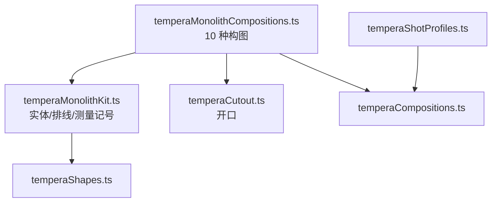
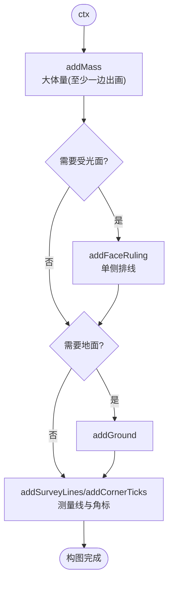
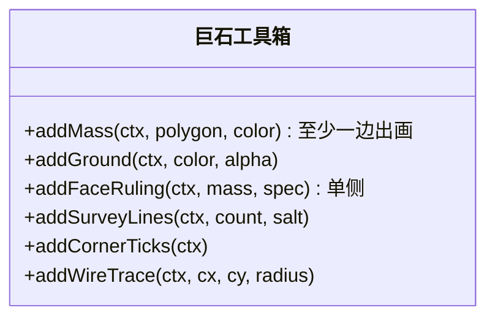
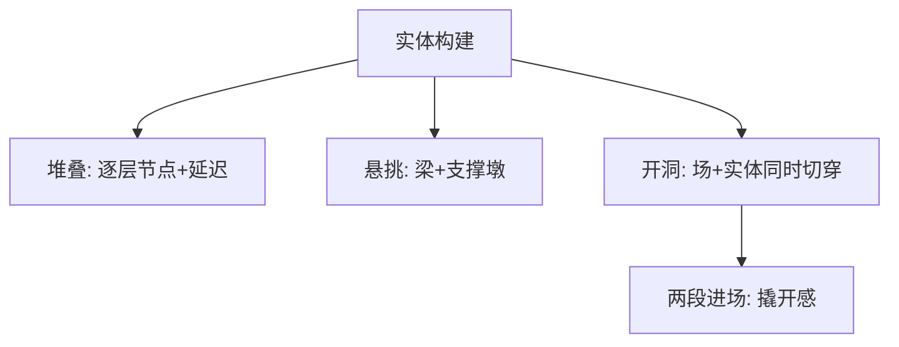
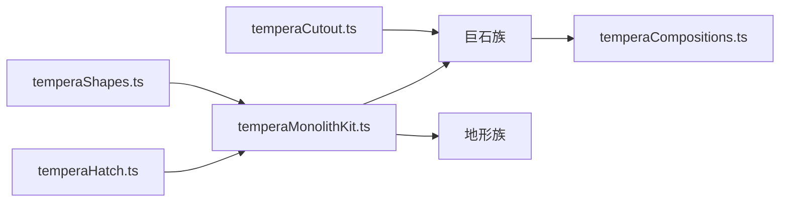

# 巨石构图模式

<cite>
**本文引用的文件**   
- [temperaMonolithCompositions.ts](file://src/components/visualizer/tempera/compositions/temperaMonolithCompositions.ts)
- [temperaMonolithKit.ts](file://src/components/visualizer/tempera/compositions/temperaMonolithKit.ts)
- [temperaCutout.ts](file://src/components/visualizer/tempera/compositions/temperaCutout.ts)
- [temperaShapes.ts](file://src/components/visualizer/tempera/temperaShapes.ts)
- [temperaHatch.ts](file://src/components/visualizer/tempera/temperaHatch.ts)
- [temperaShotProfiles.ts](file://src/components/visualizer/tempera/temperaShotProfiles.ts)
</cite>

## 目录
1. [引言](#引言)
2. [项目结构](#项目结构)
3. [核心组件](#核心组件)
4. [架构总览](#架构总览)
5. [详细组件分析](#详细组件分析)
6. [依赖关系分析](#依赖关系分析)
7. [性能考量](#性能考量)
8. [故障排查指南](#故障排查指南)
9. [结论](#结论)

## 引言
巨石构图模式（Monolith 族）是 Tempera 的“粗野主义”家族：一块巨大、哑光的实体被画框裁切，文字坐在它的剪影上。整个家族建立在一个动作上——一块画框容纳不下的体量——由 `temperaMonolithKit.ts` 提供赋予其尺度的纤细记号。本文围绕以下目标展开：
- 解释建筑学式的构图原理：结构稳定性、视觉重量与画框裁切。
- 说明十种巨石/地形构件的构建方式：顶点、堆叠、悬挑、孔洞。
- 阐述巨石工具箱（Kit）的用法：addMass、addFaceRuling、addSurveyLines 等。
- 提供建造工具与创意开发指南。

## 项目结构
- temperaMonolithCompositions.ts：十种巨石构图，注册到 `TEMPERA_MONOLITH_COMPOSITIONS`。
- temperaMonolithKit.ts：粗野主义词汇库——大实体（`addMass`）、地面（`addGround`）、面层排线（`addFaceRuling`）、测量线（`addSurveyLines`）、角标（`addCornerTicks`）、周线轨迹（`addWireTrace`）。
- temperaCutout.ts：开口安全区与流向工具（如 `bunker-slit`、`void-core` 的挖洞）。
- temperaHatch.ts / temperaShapes.ts：几何与绘制。

**图示来源**
- [temperaMonolithCompositions.ts:1-17](file://src/components/visualizer/tempera/compositions/temperaMonolithCompositions.ts#L1-L17)
- [temperaMonolithKit.ts:1-24](file://src/components/visualizer/tempera/compositions/temperaMonolithKit.ts#L1-L24)

**章节来源**
- [temperaMonolithCompositions.ts:1-16](file://src/components/visualizer/tempera/compositions/temperaMonolithCompositions.ts#L1-L16)

## 核心组件
十种巨石构图（kind → 形态）：
- `apex-mass`：单侧排线的巨体（两侧都排线会读成纹理而不是受光面）。
- `ziggurat`：阶梯山岳——每一层阶地是独立节点，从下往上构建。
- `slab-wall`：几乎填满画框的墙体，前缘一道深缝。
- `cantilever`：悬出虚空的梁 + 唯一的支撑短墩。
- `pylon-pair`：两座塔架 + 它们抬起的过梁；两塔之间的湾被从地面切穿，缺口是天空而不是纸面。
- `bunker-slit`：碉堡观察缝——缝从地面与实体同时切穿；实体以“两段从左右进场”的方式构建，让开口读作被撬开。
- `plinth-stack`：三层基座，层层内收。
- `buttress-run`：一排扶壁——地面开一条带，鳍片嵌入其中，天空在鳍片间可见而无需逐个开洞。
- `void-core`：被掏空中段的单体——全模式最大的开口，开口上方的带正是文字落脚处。
- `shear-block`：沿对角线剪断并错位的方块。

**章节来源**
- [temperaMonolithCompositions.ts:18-202](file://src/components/visualizer/tempera/compositions/temperaMonolithCompositions.ts#L18-L202)

## 架构总览
巨石族的每条实体都保证“至少一侧被画框裁切”：四条边都在画内的实体读作一张纸上的物体；被画框裁切的同一实体则读作一个过大之物——这就是全部效果所在。所有实体、排线、测量记号都通过 Kit 的工厂函数产出，构图层只负责组合顺序与参数。

**图示来源**
- [temperaMonolithKit.ts:26-124](file://src/components/visualizer/tempera/compositions/temperaMonolithKit.ts#L26-L124)
- [temperaMonolithCompositions.ts:1-16](file://src/components/visualizer/tempera/compositions/temperaMonolithCompositions.ts#L1-L16)

**章节来源**
- [temperaMonolithKit.ts:1-24](file://src/components/visualizer/tempera/compositions/temperaMonolithKit.ts#L1-L24)

## 详细组件分析

### 巨石工具箱（Kit）
Kit 提供的词汇与其设计约束：
- `addMass`：主体量；约束是“至少一侧出画”，并且注释明确“局部坐标须在定位组内”——因为 `drift` 会围绕节点自身原点缩放旋转，绝对坐标绘制的痕迹会绕画框原点公转。
- `addFaceRuling`：面层排线，只排在单侧——“两个侧面都排线会读成纹理而不是受光面”。
- `addGround`：地面色块（默认 alpha 0.94）。
- `addSurveyLines`：横贯全图的测量线（默认 3 条，盐值 211）。
- `addCornerTicks`：角标记号，强化工程图的语气。
- `addWireTrace`：围绕指定圆心的周线轨迹。

**图示来源**
- [temperaMonolithKit.ts:26-124](file://src/components/visualizer/tempera/compositions/temperaMonolithKit.ts#L26-L124)

**章节来源**
- [temperaMonolithKit.ts:1-124](file://src/components/visualizer/tempera/compositions/temperaMonolithKit.ts#L1-L124)

### 实体的构建方式：堆叠、悬挑与开洞
- 堆叠：`ziggurat` 与 `plinth-stack` 的每一层是独立节点，带各自延迟，向上/向内逐级构建。
- 悬挑：`cantilever` 用一个支撑短墩让长梁成立；`lintel`（地形族）用两端出画的过梁。
- 开洞：`bunker-slit` 与 `void-core` 的开口从地面与实体同时切穿（只切实体的话会透出纸面而不是背景）；`bunker-slit` 额外用“两段进场”让开口读作被撬开。

**图示来源**
- [temperaMonolithCompositions.ts:34-52](file://src/components/visualizer/tempera/compositions/temperaMonolithCompositions.ts#L34-L52)
- [temperaMonolithCompositions.ts:108-126](file://src/components/visualizer/tempera/compositions/temperaMonolithCompositions.ts#L108-L126)

**章节来源**
- [temperaMonolithCompositions.ts:67-126](file://src/components/visualizer/tempera/compositions/temperaMonolithCompositions.ts#L67-L126)

### 材质渲染与比例
巨石没有真实材质（贴图/法线），其“材质感”完全由三条印刷语言构成：
1. 单侧排线（受光面）。
2. 横贯测量线（工程氛围）。
3. 稀疏角标与小记号（比例参照）。
文字的放置规则：在背景是实色处，文字“跨”剪影放置（反色滤镜的最佳工作区）；在开口处，文字必须完全移到实体上，绝不骑洞。

**章节来源**
- [temperaMonolithCompositions.ts:1-16](file://src/components/visualizer/tempera/compositions/temperaMonolithCompositions.ts#L1-L16)

### 建造工具与创意开发指南
新增巨石构图的步骤：用 Kit 的组合函数编写绘制（先 `addMass`，再受光面、地面、测量记号）→ 注册到 `TEMPERA_MONOLITH_COMPOSITIONS` → 在 `types.ts` 与 `temperaShotProfiles.ts` 补 kind 与区域。创意要点：任何新实体都应展示“画框装不下”的尺度感；装饰总量保持克制——“被装饰包围的巨石就不再是石碑”。

**章节来源**
- [temperaMonolithKit.ts:1-15](file://src/components/visualizer/tempera/compositions/temperaMonolithKit.ts#L1-L15)

## 依赖关系分析
- 巨石族依赖 Kit（实体与记号）、temperaCutout（开口与安全区）、temperaShapes（绘制）与 temperaHatch（排线规格）。
- 地形族（terrain）复用同一套 Kit——两个家族共享粗野主义词汇，差异在于透视关系（见《地形构图模式》）。
- 排版区域独立在 `temperaShotProfiles.ts`。

**图示来源**
- [temperaMonolithKit.ts:1-24](file://src/components/visualizer/tempera/compositions/temperaMonolithKit.ts#L1-L24)

**章节来源**
- [temperaTerrainCompositions.ts:1-14](file://src/components/visualizer/tempera/compositions/temperaTerrainCompositions.ts#L1-L14)

## 性能考量
- 实体数量少而大：每构图 1-4 个主实体节点，绘制成本低。
- 排线由 `drawHatchFill` 成批生成，不产生逐线节点。
- 堆叠结构的每层用独立延迟实现“构建感”，无需运行时逻辑。
- 测量线与角标数量固定（3 条线、固定角标），构建期一次完成。

**章节来源**
- [temperaMonolithKit.ts:79-113](file://src/components/visualizer/tempera/compositions/temperaMonolithKit.ts#L79-L113)

## 故障排查指南
- 实体看起来像“页面上的一个矩形”：四条边都在画内——必须保证至少一侧被画框裁切。
- 排线读成纹理：两个侧面都排了线；只保留单侧。
- 开口透出纸面而非背景：洞只切了实体没切地面；两处都要挖。
- 节点绕画面原点公转：痕迹绘制在绝对坐标且节点未放入定位组；`drift` 以节点原点为枢轴。
- 文字压在开口上：`bunker-slit`、`void-core` 等开洞构图的文字区域必须完全落在实体上。

**章节来源**
- [temperaMonolithCompositions.ts:108-126](file://src/components/visualizer/tempera/compositions/temperaMonolithCompositions.ts#L108-L126)
- [temperaMonolithKit.ts:1-24](file://src/components/visualizer/tempera/compositions/temperaMonolithKit.ts#L1-L24)

## 结论
巨石构图模式把粗野主义建筑语言转化为一套可组合的平面词汇：超大实体、单侧受光、测量记号与开洞构件。以“画框裁切”为尺度的核心表达，配合 Kit 的工厂函数与开口安全规则，它在 Tempera 的纸面世界里建立起最有重量感的构图家族，并与地形族共享同一套词汇形成完整的“构筑”叙事。
