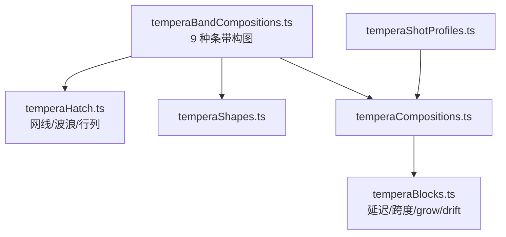
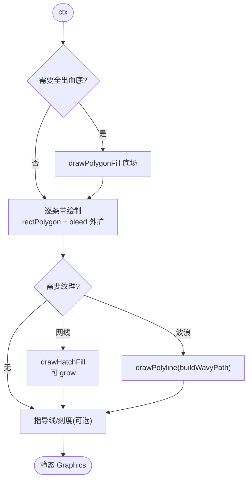
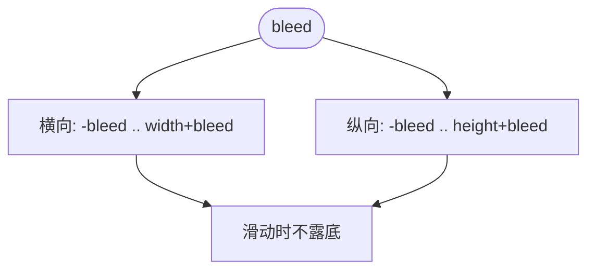
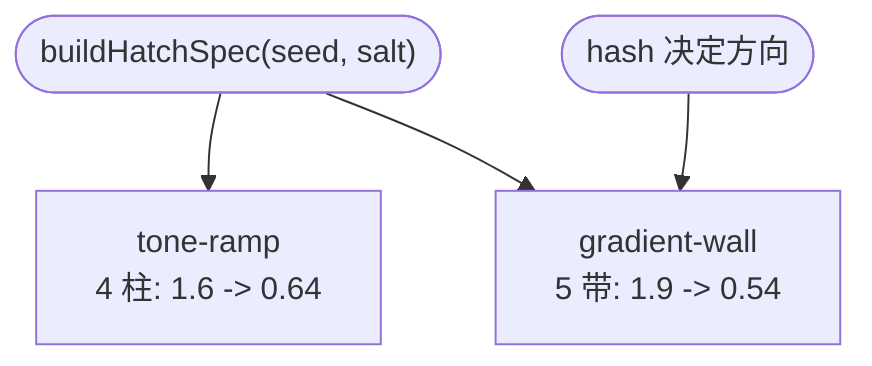
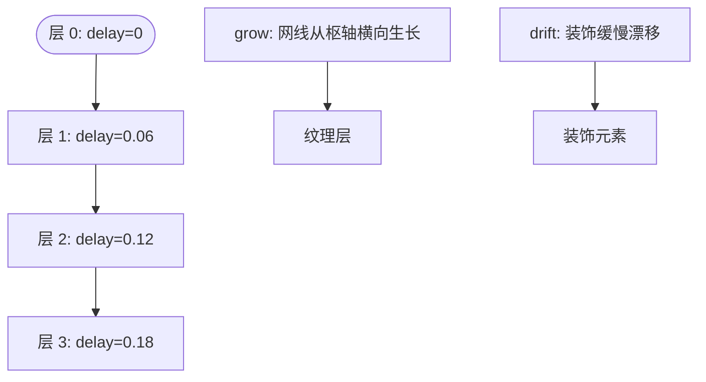
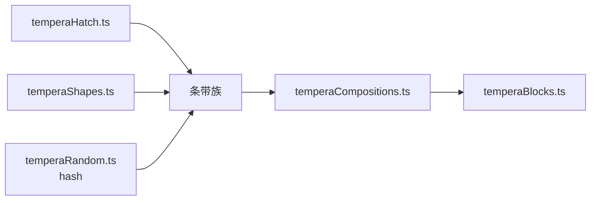

# 条带构图模式

<cite>
**本文引用的文件**   
- [temperaBandCompositions.ts](file://src/components/visualizer/tempera/compositions/temperaBandCompositions.ts)
- [temperaHatch.ts](file://src/components/visualizer/tempera/temperaHatch.ts)
- [temperaShapes.ts](file://src/components/visualizer/tempera/temperaShapes.ts)
- [temperaCompositions.ts](file://src/components/visualizer/tempera/temperaCompositions.ts)
- [temperaShotProfiles.ts](file://src/components/visualizer/tempera/temperaShotProfiles.ts)
- [temperaBlocks.ts](file://src/components/visualizer/tempera/temperaBlocks.ts)
</cite>

## 目录
1. [引言](#引言)
2. [项目结构](#项目结构)
3. [核心组件](#核心组件)
4. [架构总览](#架构总览)
5. [详细组件分析](#详细组件分析)
6. [依赖关系分析](#依赖关系分析)
7. [性能考量](#性能考量)
8. [故障排查指南](#故障排查指南)
9. [结论](#结论)

## 引言
条带构图模式（Band 族）是 Tempera 的“水平地层”家族：用横向条带切割画面，配合 Tempera 的纵向运镜（镜头沿画面上下穿行），条带读作深度——画面在下潜穿过一层层色带，接过场因此变成“下潜”而不是“硬切”。本文围绕以下目标展开：
- 解释九种条带构图的形态：水线、深潜、密度渐变、双轨、倾斜带、边轨、色调墙、梯田等。
- 说明条带的宽度、间距与对齐规则：全出血外扩、指导线贴边、网线密度步进。
- 阐述条带动画与响应式适配：入场延迟的阶梯、`grow` 生长与确定性漂移。
- 提供配置参数与使用建议。

## 项目结构
- temperaBandCompositions.ts：九种条带构图，全部注册到 `TEMPERA_BAND_COMPOSITIONS`。
- temperaHatch.ts：`buildHatchSpec`（网线规格）与 `buildWavyPath`（波浪路径）、`rectPolygon`、`buildCrossRow/buildDotRow`（装饰行列）。
- temperaShapes.ts：`drawPolygonFill`、`drawHatchFill`、`drawLines`、`drawPolyline` 等绘制工具。
- temperaCompositions.ts：注册表与共享叠层追加。
- temperaShotProfiles.ts：各 kind 的排版区域。

**图示来源**
- [temperaBandCompositions.ts:1-16](file://src/components/visualizer/tempera/compositions/temperaBandCompositions.ts#L1-L16)
- [temperaCompositions.ts:35-49](file://src/components/visualizer/tempera/temperaCompositions.ts#L35-L49)

**章节来源**
- [temperaBandCompositions.ts:160-170](file://src/components/visualizer/tempera/compositions/temperaBandCompositions.ts#L160-L170)

## 核心组件
九个条带构图（kind → 形态）：
- `band-strip`：画面 37%-67% 高度的一条 tone3 主带（从左侧滑入），两侧贴边指导线；装饰开启时附十字刻度与方点行。
- `horizon-band`：水线构图——上方 tone1 亮区、下方 tone3 密集区，交界处一条 30 段波浪测线（明暗对比的“水线”），下方叠角度为 0 的网线。
- `deep-dive`：四层地层（tone1→tone4），每层从下方依次入场，层间用波浪线分隔，是“下潜”语义最直白的构图。
- `tone-ramp`：不做离散层，而是四段同角度、递减间距的网线柱（间距系数 1.6→0.64），形成连续密度坡。
- `double-band`：上下两条轨道（tone3/tone4）从相反方向合拢，中间留出亮缝，歌词坐在缝里。
- `tilt-band`：一条倾角由 hash 在 0.14-0.28 高度间确定的斜带，横贯两端外出血，带面加垂直向网线。
- `edge-rails`：上下两条厚轨贴近边缘（厚度 0.16-0.22 高度），中部开阔；装饰开启时补两条内缘线。
- `gradient-wall`：一整面 tone2 全出血底，叠加五段递减间距的网线层，密度方向由 hash 决定——是一面“色调墙”。
- `terrace`：四层梯田，每层起点依次向右缩进 0.14 宽度，全部从左侧滑入。

**章节来源**
- [temperaBandCompositions.ts:17-158](file://src/components/visualizer/tempera/compositions/temperaBandCompositions.ts#L17-L158)

## 架构总览
条带构图的绘制遵循统一协议：底场（可选）→ 条带主体（全出血、按 `ctx.gradient` 决定平色或渐变）→ 网线/波浪纹理（`grow` 生长）→ 指导线或刻度（装饰开关）。入场全部通过块选项表达：`enterDX/enterDY` 决定滑入方向，阶梯式 `delay`（多为 0.05-0.07 步进）让层与层之间有顺序感。

**图示来源**
- [temperaBandCompositions.ts:50-63](file://src/components/visualizer/tempera/compositions/temperaBandCompositions.ts#L50-L63)
- [temperaBandCompositions.ts:123-143](file://src/components/visualizer/tempera/compositions/temperaBandCompositions.ts#L123-L143)

**章节来源**
- [temperaBandCompositions.ts:14-16](file://src/components/visualizer/tempera/compositions/temperaBandCompositions.ts#L14-L16)

## 详细组件分析

### 条带的布局与出血规则
所有条带都以 `-bleed` 为左界、`width + bleed * 2` 为宽，保证镜头沿流动方向滑动时不会在边缘露出背景；条带竖直方向同样向两端外扩（`deep-dive` 的层高按 `(height + bleed*2)/4` 计算）。这是条带族“深度感”成立的技术前提：没有出血的条带在滑动时会立刻暴露自己是贴在页面上的矩形。

**图示来源**
- [temperaBandCompositions.ts:21-22](file://src/components/visualizer/tempera/compositions/temperaBandCompositions.ts#L21-L22)
- [temperaCompositionContext.ts:34-39](file://src/components/visualizer/tempera/temperaCompositionContext.ts#L34-L39)

**章节来源**
- [temperaCompositionContext.ts:34-39](file://src/components/visualizer/tempera/temperaCompositionContext.ts#L34-L39)

### 网线密度与色调墙
`tone-ramp` 与 `gradient-wall` 展示了两条“连续色调”的路径：前者把画面分成四根竖柱，网线间距从 `spacing * 1.6` 递减到 `spacing * 0.64`；后者用五段横带，间距系数从 1.9 递减到 0.54，方向由 `temperaHash01(seed, 71, 59)` 决定向上或向下加密。网线全部复用同一 `buildHatchSpec(seed, salt)` 的角度，只调间距——同角度是“同一种印刷技法”的视觉语言。

**图示来源**
- [temperaBandCompositions.ts:66-77](file://src/components/visualizer/tempera/compositions/temperaBandCompositions.ts#L66-L77)
- [temperaBandCompositions.ts:124-143](file://src/components/visualizer/tempera/compositions/temperaBandCompositions.ts#L124-L143)

**章节来源**
- [temperaHatch.ts:34-41](file://src/components/visualizer/tempera/temperaHatch.ts#L34-L41)

### 入场时序：阶梯与漂移
条带族的入场节奏由 `delay` 阶梯控制：`deep-dive`/`tone-ramp`/`terrace`/`gradient-wall` 均以 0.05-0.06 的步进逐层入场，`doubleBand` 的两条轨道则反向滑入制造合拢感。网线纹理统一使用 `grow: true`，从枢轴横向生长；少量装饰元素（方点行）使用 `drift: true` 获得落地后的缓慢浮动。

**图示来源**
- [temperaBandCompositions.ts:55-62](file://src/components/visualizer/tempera/compositions/temperaBandCompositions.ts#L55-L62)
- [temperaCompositionContext.ts:12-23](file://src/components/visualizer/tempera/temperaCompositionContext.ts#L12-L23)

**章节来源**
- [temperaBlocks.ts:19-56](file://src/components/visualizer/tempera/temperaBlocks.ts#L19-L56)

### 配置参数
- `bandHeight/bandY`：主带的高度与位置（如 `band-strip` 为 0.37 高度处 0.3 高）。
- `lean`：`tilt-band` 的倾斜量，由 hash 在 0.14-0.28 间确定。
- `rail`：`edge-rails` 与 `double-band` 的轨道厚度。
- `waterline`：`horizon-band` 的分界高度，由 hash 在 0.5-0.62 高度间确定。
- `steps/tones`：密度坡与地层的层数。
所有参数均从画布尺寸派生（`width/height` 的比例式），因此在任意分辨率下比例一致。

**章节来源**
- [temperaBandCompositions.ts:36-48](file://src/components/visualizer/tempera/compositions/temperaBandCompositions.ts#L36-L48)
- [temperaBandCompositions.ts:91-106](file://src/components/visualizer/tempera/compositions/temperaBandCompositions.ts#L91-L106)

## 依赖关系分析
- 条带族依赖 temperaHatch（网线、波浪、行列工具）与 temperaShapes（绘制），无曲线依赖。
- 共享叠层（交叉引导线/母题）由总入口统一追加，条带自身不重复实现。
- 时序与运动完全外置到 temperaBlocks：构图层只声明 `delay/span/enterDX/enterDY/grow/drift`。

**图示来源**
- [temperaBandCompositions.ts:1-12](file://src/components/visualizer/tempera/compositions/temperaBandCompositions.ts#L1-L12)

**章节来源**
- [temperaCompositions.ts:117-123](file://src/components/visualizer/tempera/temperaCompositions.ts#L117-L123)

## 性能考量
- 条带数量固定（最多五层），每层一个 Graphics；网线由 `drawHatchFill` 一次成批生成，不产生逐线节点。
- 波浪路径为固定段数（24-30 段）的 polyline，成本可预期。
- 所有确定性 hash 在构建期求值，运行期零随机成本。
- 装饰元素受 `showDecor` 开关控制，默认流程即可关闭。

**章节来源**
- [temperaBandCompositions.ts:44-47](file://src/components/visualizer/tempera/compositions/temperaBandCompositions.ts#L44-L47)

## 故障排查指南
- 条带滑动露底：检查是否按 `bleed` 外扩；只按画布尺寸绘制会在运镜时穿帮。
- 层次顺序错乱：梯田/地层的 `delay` 阶梯应保持递增；顺序错乱时检查各层的 delay 参数。
- 网线方向不一致：`buildHatchSpec` 只应修改 `spacing`，角度需要显式覆盖时（如 `tilt-band` 的 `Math.PI/2`）要全层统一。
- 水线不动：`buildWavyPath` 是静态折线，没有逐帧动画；若希望波动，应走运行时块系统的漂移而不是修改构图。
- 装饰消失：`showDecor` 为 false 时所有装饰分支被跳过，检查该开关而非绘制代码。

**章节来源**
- [temperaBandCompositions.ts:29-33](file://src/components/visualizer/tempera/compositions/temperaBandCompositions.ts#L29-L33)

## 结论
条带构图模式以“水平地层 + 纵向运镜”的组合，将接过场转化为连续的下潜体验。九种变体覆盖了从单带到密度坡、从水线到梯田的完整语法，全部建立在出血外扩、统一网线角度与阶梯时序三条规则之上。它是 Tempera 空间叙事的重要组成，也是最容易通过参数微调产出新变体的家族之一。
