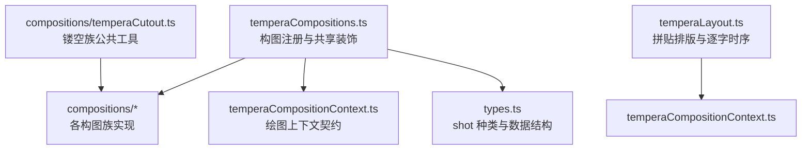
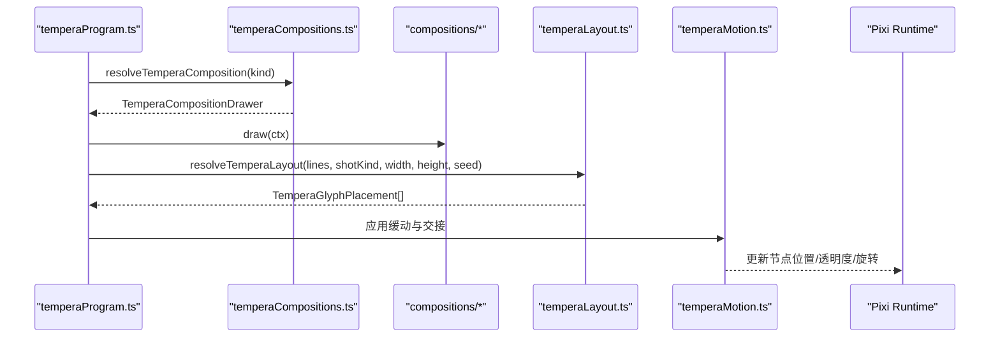
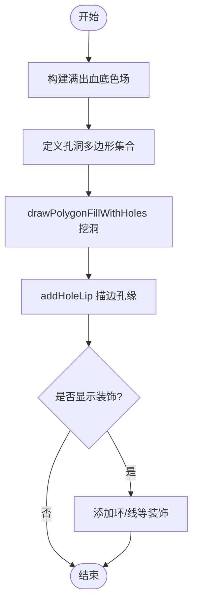
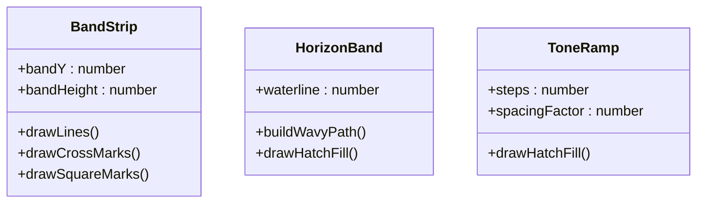
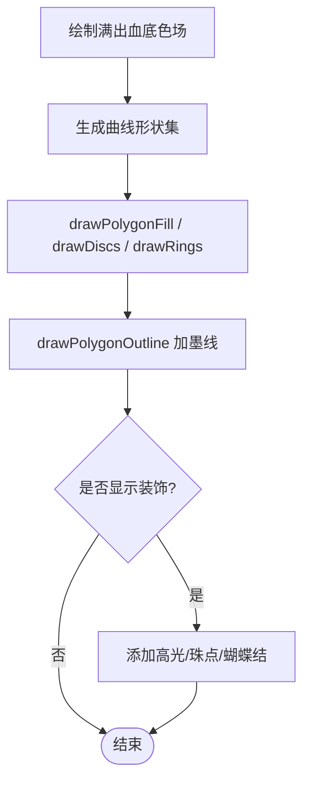
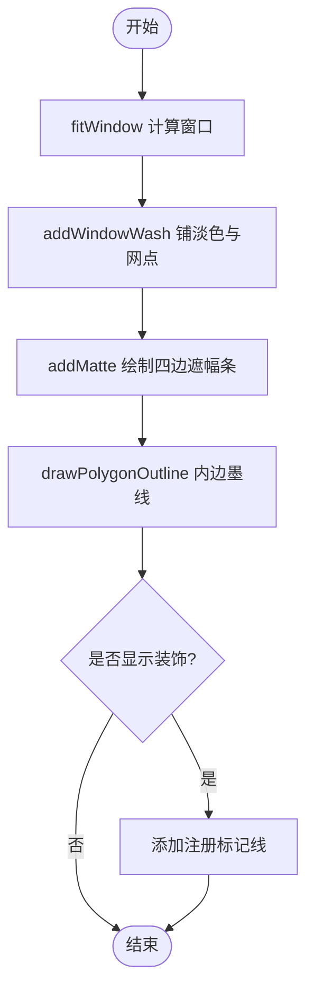
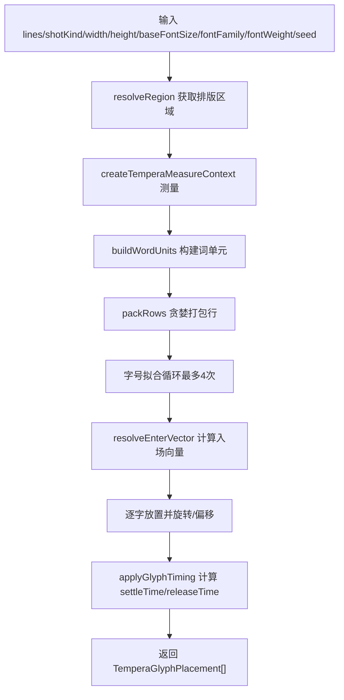
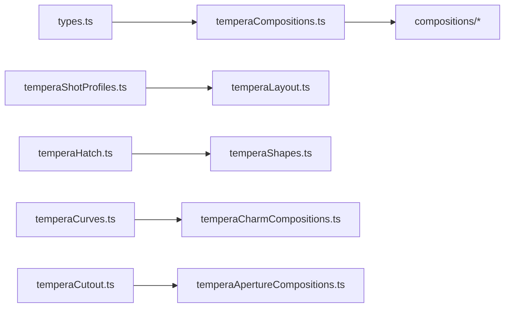

# 构图系统与布局算法

<cite>
**本文引用的文件**   
- [README.md](file://src/components/visualizer/tempera/README.md)
- [temperaCompositions.ts](file://src/components/visualizer/tempera/temperaCompositions.ts)
- [temperaCompositionContext.ts](file://src/components/visualizer/tempera/temperaCompositionContext.ts)
- [types.ts](file://src/components/visualizer/tempera/types.ts)
- [temperaLayout.ts](file://src/components/visualizer/tempera/temperaLayout.ts)
- [temperaCutout.ts](file://src/components/visualizer/tempera/compositions/temperaCutout.ts)
- [temperaApertureCompositions.ts](file://src/components/visualizer/tempera/compositions/temperaApertureCompositions.ts)
- [temperaBandCompositions.ts](file://src/components/visualizer/tempera/compositions/temperaBandCompositions.ts)
- [temperaCharmCompositions.ts](file://src/components/visualizer/tempera/compositions/temperaCharmCompositions.ts)
- [temperaCinemaCompositions.ts](file://src/components/visualizer/tempera/compositions/temperaCinemaCompositions.ts)
</cite>

## 目录
1. [引言](#引言)
2. [项目结构](#项目结构)
3. [核心组件](#核心组件)
4. [架构总览](#架构总览)
5. [详细组件分析](#详细组件分析)
6. [依赖关系分析](#依赖关系分析)
7. [性能与渲染特性](#性能与渲染特性)
8. [故障排查指南](#故障排查指南)
9. [结论](#结论)
10. [附录：自定义构图开发指南](#附录自定义构图开发指南)

## 引言
本文件面向 Tempera 模式的构图系统，系统性解释其数学原理、实现算法与工程组织。Tempera 是“网点图形”风格的逐字歌词 PV 模式，采用 Pixi runtime 与绝对时间驱动，将段落编译为 shot，再由构图族按 kind 绘制背景层与装饰层，文字通过反色滤镜与主题调色板获得可读性。文档覆盖以下目标：
- 各种构图模式（Aperture、Band、Charm、Cinema 等）的数学原理与实现算法
- 黄金分割布局、对称性检测与视觉焦点定位机制
- 响应式布局系统：视口适配、字体缩放与内容重排
- 构图参数系统：用户配置、预设模板与动态调整
- 构图动画：淡入淡出、滑入滑出与变形过渡
- 自定义构图模式的开发与最佳实践

## 项目结构
Tempera 的核心位于 `src/components/visualizer/tempera`，关键文件职责如下：
- 入口与说明：`README.md`
- 构图注册与共享装饰：`temperaCompositions.ts`
- 构图上下文契约：`temperaCompositionContext.ts`
- 类型与 shot 枚举：`types.ts`
- 拼贴排版与逐字时序：`temperaLayout.ts`
- 镂空族公共工具：`compositions/temperaCutout.ts`
- 各构图族实现：`compositions/temperaApertureCompositions.ts`、`temperaBandCompositions.ts`、`temperaCharmCompositions.ts`、`temperaCinemaCompositions.ts`

**图表来源**
- [temperaCompositions.ts:35-49](file://src/components/visualizer/tempera/temperaCompositions.ts#L35-L49)
- [temperaCompositionContext.ts:25-50](file://src/components/visualizer/tempera/temperaCompositionContext.ts#L25-L50)
- [types.ts:13-151](file://src/components/visualizer/tempera/types.ts#L13-L151)
- [temperaLayout.ts:16-20](file://src/components/visualizer/tempera/temperaLayout.ts#L16-L20)
- [temperaCutout.ts:6-16](file://src/components/visualizer/tempera/compositions/temperaCutout.ts#L6-L16)

**章节来源**
- [README.md:7-18](file://src/components/visualizer/tempera/README.md#L7-L18)
- [temperaCompositions.ts:29-49](file://src/components/visualizer/tempera/temperaCompositions.ts#L29-L49)
- [types.ts:13-151](file://src/components/visualizer/tempera/types.ts#L13-L151)

## 核心组件
- 构图注册器：聚合所有构图族，提供按 kind 解析绘制器的能力；同时负责每 shot 共享的贯穿线与角落 motif 叠加。
- 构图上下文：定义每个构图绘制的输入与输出契约，包括画布尺寸、调色板、seed、flowAngle、bleed、gradient 填充、以及 add/createGroup 方法。
- 类型系统：集中声明 TEMPERA_SHOT_KINDS、TEMPERA_TRANSITION_KINDS、TemperaShot/TemperaParagraph/TemperaProgram 等数据结构，确保编译期确定性。
- 排版引擎：基于 region 与 enter 向量进行拼贴排版，计算字号层级、行高、入场向量、缓动 settleTime 与 release 阶段字距扩展。
- 镂空族工具：提供挖洞、孔边描边、通道轴对齐、跨 flow 偏移等几何与布局工具，约束字不能压在洞上。

**章节来源**
- [temperaCompositions.ts:35-54](file://src/components/visualizer/tempera/temperaCompositions.ts#L35-L54)
- [temperaCompositionContext.ts:12-50](file://src/components/visualizer/tempera/temperaCompositionContext.ts#L12-L50)
- [types.ts:13-151](file://src/components/visualizer/tempera/types.ts#L13-L151)
- [temperaLayout.ts:16-20](file://src/components/visualizer/tempera/temperaLayout.ts#L16-L20)
- [temperaCutout.ts:6-16](file://src/components/visualizer/tempera/compositions/temperaCutout.ts#L6-L16)

## 架构总览
Tempera 的运行时由 React shell 与 Pixi scene 组成，编译期把段落拆成 shot，并按 kind 选择构图绘制器。构图族分为多组：分割/色带/框窗/海报/稀疏、cinema-shot、charm（圆滑族）、aperture/signal/corridor（镂空族）、monolith/terrain（巨构族）、monogatari-blank（留白卡）。构图绘制器只生成静态 Graphics，运动状态由 temperaBlocks 管理；文字排版在 layout 阶段完成，逐字时序由 motion 求解器驱动。

**图表来源**
- [temperaCompositions.ts:51-54](file://src/components/visualizer/tempera/temperaCompositions.ts#L51-L54)
- [temperaLayout.ts:258-376](file://src/components/visualizer/tempera/temperaLayout.ts#L258-L376)
- [README.md:20-22](file://src/components/visualizer/tempera/README.md#L20-L22)

## 详细组件分析

### Aperture 构图族（镂空铁板与孔洞）
Aperture 族以一张平涂铁板为基础，用 cut 真正挖空形成窗口，露出底层背景。每种构图对应一个 hole 形状或一组 holes，并通过 addHoleLip 添加墨线边缘，使反色滤镜有硬边可切。典型实现包括：
- iris-hole：偏心圆孔 + 远端横条 + 外圈环装饰
- slot-rail：横向长缝 + 跨越缝隙的重心块
- punch-row：两侧胶片齿孔 + 水平引导线
- film-gate：主矩形开口 + 传输孔 + 底部 hatch 纹理
- cross-vent：十字形通孔 + 外圈环装饰
- louvre-slats：倾斜百叶缝，厚度递减
- ring-eye：十二段环形扇区，中心轮毂未被切割，字骑在 hub 上
- notch-stack：阶梯方孔列
- wedge-gap：从顶部切入的楔形缺口
- dot-sieve：密度渐减的小孔阵列

数学要点：
- 孔洞多边形由 circlePolygon/rectPolygon/annularSectorPolygon 等构造
- 挖洞使用 drawPolygonFillWithHoles，遵循“单 fill 指令 + 独立 hole lip”的约束
- 字区域必须落在实心 tone 上，避免反色滤镜读到透明洞

**图表来源**
- [temperaApertureCompositions.ts:23-37](file://src/components/visualizer/tempera/compositions/temperaApertureCompositions.ts#L23-L37)
- [temperaApertureCompositions.ts:74-88](file://src/components/visualizer/tempera/compositions/temperaApertureCompositions.ts#L74-L88)
- [temperaApertureCompositions.ts:132-151](file://src/components/visualizer/tempera/compositions/temperaApertureCompositions.ts#L132-L151)
- [temperaCutout.ts:32-57](file://src/components/visualizer/tempera/compositions/temperaCutout.ts#L32-L57)

**章节来源**
- [temperaApertureCompositions.ts:14-22](file://src/components/visualizer/tempera/compositions/temperaApertureCompositions.ts#L14-L22)
- [temperaApertureCompositions.ts:23-195](file://src/components/visualizer/tempera/compositions/temperaApertureCompositions.ts#L23-L195)
- [temperaCutout.ts:6-16](file://src/components/visualizer/tempera/compositions/temperaCutout.ts#L6-L16)

### Band 构图族（水平地层与密度渐变）
Band 族以水平分层为主，配合垂直 flow 读作深度下潜。常见模式：
- band-strip：中间色带 + 上下引导线 + 角落标记
- horizon-band：水面分界 + 波浪路径 + 下部 hatch
- deepDive：多层密度递增的色带
- toneRamp：连续密度 ramp，间距逐步收紧
- doubleBand：双轨夹亮槽
- tiltBand：斜向色带 + hatch 面
- edgeRails：上下边缘重轨
- gradientWall：整幅色调墙 + hatch 密度梯度
- terrace：错步台阶式色带

数学要点：
- 色带高度与位置由 viewport 分数确定
- hatch 角度与间距通过 buildHatchSpec 控制
- 波浪路径由 buildWavyPath 生成折线

**图表来源**
- [temperaBandCompositions.ts:17-34](file://src/components/visualizer/tempera/compositions/temperaBandCompositions.ts#L17-L34)
- [temperaBandCompositions.ts:37-48](file://src/components/visualizer/tempera/compositions/temperaBandCompositions.ts#L37-L48)
- [temperaBandCompositions.ts:66-77](file://src/components/visualizer/tempera/compositions/temperaBandCompositions.ts#L66-L77)

**章节来源**
- [temperaBandCompositions.ts:14-170](file://src/components/visualizer/tempera/compositions/temperaBandCompositions.ts#L14-L170)

### Charm 构图族（圆滑族与贴纸感）
Charm 族保持底面整块平涂，曲线形状叠在上面，字读作印在贴纸上。包含气泡、云朵窗、心形、四芒星、花瓣扇、蕾丝波边、缎带蝴蝶结、圆角贴纸板、柔光放射等。关键规则：
- 保留 ink 描边，否则反色滤镜无硬边
- 不使用音频脉冲，统一走 drift 呼吸
- 非凸多边形只能填充和描边，不进入 hatch 裁剪

数学要点：
- 圆形/椭圆/心形/星形/波边/缎带等由 temperaCurves.ts 生成
- 大圆片作为单个 Graphics 节点，drift 原地呼吸
- 离中心远的形状放入 createGroup(x,y)，避免绕画面原点公转

**图表来源**
- [temperaCharmCompositions.ts:36-43](file://src/components/visualizer/tempera/compositions/temperaCharmCompositions.ts#L36-L43)
- [temperaCharmCompositions.ts:47-63](file://src/components/visualizer/tempera/compositions/temperaCharmCompositions.ts#L47-L63)
- [temperaCharmCompositions.ts:197-225](file://src/components/visualizer/tempera/compositions/temperaCharmCompositions.ts#L197-L225)

**章节来源**
- [temperaCharmCompositions.ts:25-35](file://src/components/visualizer/tempera/compositions/temperaCharmCompositions.ts#L25-L35)
- [temperaCharmCompositions.ts:47-276](file://src/components/visualizer/tempera/compositions/temperaCharmCompositions.ts#L47-L276)

### Cinema 构图族（遮幅窗口）
Cinema 族用 solid frame + 中间 window 的方式模拟电影遮幅。window 按真实像素比例 aspect-fit，保证“正方形”在任何显示比例下都是方的。实现包括：
- matte(aspect, fill)：通用遮幅，四边条 + 内边墨线 + 可选注册标记
- cinemaTwin：左右双窗，左宽右窄
- jitteredFill：seed 抖动填充率，避免固定布局重复

数学要点：
- fitWindow(width,height,aspect,fill) 计算居中窗口
- addMatte 用四个凸矩形条组合，便于各自 enter 动画
- addWindowWash 给窗口内部铺淡 tone + hatch

**图表来源**
- [temperaCinemaCompositions.ts:23-34](file://src/components/visualizer/tempera/compositions/temperaCinemaCompositions.ts#L23-L34)
- [temperaCinemaCompositions.ts:40-64](file://src/components/visualizer/tempera/compositions/temperaCinemaCompositions.ts#L40-L64)
- [temperaCinemaCompositions.ts:74-84](file://src/components/visualizer/tempera/compositions/temperaCinemaCompositions.ts#L74-L84)

**章节来源**
- [temperaCinemaCompositions.ts:7-10](file://src/components/visualizer/tempera/compositions/temperaCinemaCompositions.ts#L7-L10)
- [temperaCinemaCompositions.ts:74-124](file://src/components/visualizer/tempera/compositions/temperaCinemaCompositions.ts#L74-L124)

### 排版与布局算法
temperaLayout.ts 实现拼贴式排版：
- 分词用于字号层级，不影响字间距；CJK 边界仅留 0.035em 微距
- 每行 hero 词放大到 1.34~1.6×，其余压到 0.7~0.86×
- 行高 1.02~1.12，紧凑阅读
- 每字独立入场向量，按词选一种 enterStyle（slide/swing/stamp 等）
- 位移距离等比缩放，避免长距离飞入与单轴拉伸
- 有位移的字拖出两层 echoLayer（不参与反色）
- 关键字着色走 theme.wordColors，渲染到 keywordLayer（不挂 difference filter）

数学要点：
- packRows 贪婪打包，每行预算 = maxWidth × (0.72 + hash*0.28)
- applyGlyphTiming 计算 settleTime 与 releaseTime，release 阶段沿自身力臂扩展字距
- resolveTemperaLayout 返回 TemperaGlyphPlacement[]，含 x/y/rotation/settleTime/enterX/Y/S/R/releaseTime/trackingX/Y

**图表来源**
- [temperaLayout.ts:82-99](file://src/components/visualizer/tempera/temperaLayout.ts#L82-L99)
- [temperaLayout.ts:131-152](file://src/components/visualizer/tempera/temperaLayout.ts#L131-L152)
- [temperaLayout.ts:220-256](file://src/components/visualizer/tempera/temperaLayout.ts#L220-L256)
- [temperaLayout.ts:258-376](file://src/components/visualizer/tempera/temperaLayout.ts#L258-L376)

**章节来源**
- [temperaLayout.ts:16-20](file://src/components/visualizer/tempera/temperaLayout.ts#L16-L20)
- [temperaLayout.ts:110-127](file://src/components/visualizer/tempera/temperaLayout.ts#L110-L127)
- [temperaLayout.ts:154-175](file://src/components/visualizer/tempera/temperaLayout.ts#L154-L175)
- [temperaLayout.ts:177-256](file://src/components/visualizer/tempera/temperaLayout.ts#L177-L256)
- [temperaLayout.ts:258-376](file://src/components/visualizer/tempera/temperaLayout.ts#L258-L376)

### 构图参数系统与动态调整
- 构图族注册：temperaCompositions.ts 合并各族常量对象，resolveTemperaComposition 按 kind 返回绘制器
- 构图上下文：包含 pixi/kind/palette/decor/width/height/seed/showDecor/bleed/flowAngle/gradient/add/createGroup
- 装饰系统：共享贯穿线与角落 motif，motif 类型包括 diamonds/hatch-twin/band-cross/poster-doodle/doodle
- 用户 tuning：tuning 变化通过 runtime.setTuning 就地下发，不重建 runtime；图片 blob 加载按 id 集合触发
- 颜色模式：duo/mono/gradient；gradient 模式对封面取色并与主题色混合，ramp 作为 tint 传给 difference filter

**章节来源**
- [temperaCompositions.ts:35-49](file://src/components/visualizer/tempera/temperaCompositions.ts#L35-L49)
- [temperaCompositions.ts:56-123](file://src/components/visualizer/tempera/temperaCompositions.ts#L56-L123)
- [temperaCompositionContext.ts:25-50](file://src/components/visualizer/tempera/temperaCompositionContext.ts#L25-L50)
- [README.md:122-124](file://src/components/visualizer/tempera/README.md#L122-L124)

### 动画与过渡
- 入场样式：slide/from-left/right/above/below/swing/stamp，同词同手势，相邻词不同
- 缓动：cubic-bezier + 逐字 solver，settleTime 单调递减，release 阶段刚性中心外扩
- 交接：block-wipe/camera-pan/shape-carry，flowAngle 相邻 shot 小幅转向，读作接力而非硬切
- 色块进场节奏：delay/span 为 shot 时长比例，钳在 0~1.4s/0.7~2.6s
- 片尾卡：与 shot 相同语汇，圆心在画外的圆盘扫入，标题固定，底下形状持续缓慢推移

**章节来源**
- [README.md:24-30](file://src/components/visualizer/tempera/README.md#L24-L30)
- [README.md:32-35](file://src/components/visualizer/tempera/README.md#L32-L35)
- [README.md:44-50](file://src/components/visualizer/tempera/README.md#L44-L50)
- [README.md:52-55](file://src/components/visualizer/tempera/README.md#L52-L55)
- [README.md:96-99](file://src/components/visualizer/tempera/README.md#L96-L99)

### 黄金分割布局、对称性检测与视觉焦点定位
- 黄金分割：代码中未直接出现黄金分割常数；构图布局主要依赖 viewport 分数、region 数据与 seed 哈希扰动
- 对称性检测：未见显式对称检测算法；对称效果通过几何构造（如 ring-eye 的十二段环、cinema 双窗）实现
- 视觉焦点定位：hero 词放大、重心块（signal 族）与 hole 形状决定视觉重心；layout 的 centerX/centerY 与 trackingX/Y 用于 release 阶段的字距扩展

**章节来源**
- [temperaLayout.ts:110-127](file://src/components/visualizer/tempera/temperaLayout.ts#L110-L127)
- [temperaLayout.ts:240-253](file://src/components/visualizer/tempera/temperaLayout.ts#L240-L253)
- [temperaApertureCompositions.ts:132-151](file://src/components/visualizer/tempera/compositions/temperaApertureCompositions.ts#L132-L151)
- [temperaCinemaCompositions.ts:87-109](file://src/components/visualizer/tempera/compositions/temperaCinemaCompositions.ts#L87-L109)

### 响应式布局系统
- 视口适配：region 由 shot profile 提供 cx/cy/w/h/align/rotation/fontScale，layout 根据 width/height 换算像素
- 字体缩放：baseFontSize × fontScale，fit loop 最多四次缩小直到块高/行宽落入 region
- 内容重排：packRows 按行预算重新分配，leadingGap 区分真实空格与 CJK 边界
- 纹理分辨率：snapResolutionToTextureBudget 吸附到纹理池档位，避免 2 的幂浪费

**章节来源**
- [temperaLayout.ts:82-99](file://src/components/visualizer/tempera/temperaLayout.ts#L82-L99)
- [temperaLayout.ts:273-293](file://src/components/visualizer/tempera/temperaLayout.ts#L273-L293)
- [README.md:106-120](file://src/components/visualizer/tempera/README.md#L106-L120)

## 依赖关系分析
- 构图注册依赖各族导出对象，缺失 kind 会回退到 duo-split
- 排版依赖 shot profile 的 region/enter 数据
- 镂空族依赖 cutout 工具函数与 shapes 的 drawPolygonFillWithHoles
- 类型系统为所有模块提供稳定契约

**图表来源**
- [temperaCompositions.ts:14-26](file://src/components/visualizer/tempera/temperaCompositions.ts#L14-L26)
- [temperaLayout.ts:1-10](file://src/components/visualizer/tempera/temperaLayout.ts#L1-L10)
- [temperaCutout.ts:1-4](file://src/components/visualizer/tempera/compositions/temperaCutout.ts#L1-L4)

**章节来源**
- [temperaCompositions.ts:51-54](file://src/components/visualizer/tempera/temperaCompositions.ts#L51-L54)
- [temperaLayout.ts:1-10](file://src/components/visualizer/tempera/temperaLayout.ts#L1-L10)
- [temperaCutout.ts:1-4](file://src/components/visualizer/tempera/compositions/temperaCutout.ts#L1-L4)

## 性能与渲染特性
- 反色滤镜：difference filter 读取 uBackTexture，blendRequired=true，resolution 必须 'inherit'；禁用后处理时模糊不应挂在 scene 容器上
- 纹理池：nextPow2 档位计费，snapResolutionToTextureBudget 只降一档且不超过 25% 阈值
- 图片池：IndexedDB 存储，OBS 源通过 data URL 下发；runtime 创建 Texture.from，不用 Assets.load
- 调优开关：textInversion（默认开）、postProcessEnabled（默认开但早先 false）、textureResolution（默认 1.5）

**章节来源**
- [README.md:28-31](file://src/components/visualizer/tempera/README.md#L28-L31)
- [README.md:92-95](file://src/components/visualizer/tempera/README.md#L92-L95)
- [README.md:100-105](file://src/components/visualizer/tempera/README.md#L100-L105)
- [README.md:106-120](file://src/components/visualizer/tempera/README.md#L106-L120)

## 故障排查指南
- 反色错误：检查 difference filter 的 resolution 是否为 'inherit'；确认 textLayer bounds 最小化；disabled filter 不得停在栈上
- 洞上文字不可读：确保 region 不被 hole 覆盖；hole 必须打穿到底；单 fill 指令约束
- 纹理过糊：检查 textureResolution 与 snapResolutionToTextureBudget；确认 pass 的 resolution 来自 renderResolution 而非设置值
- 图片加载失败：OBS 源需 data URL；不要用 Assets.load；blob URL 无后缀会被拒绝

**章节来源**
- [README.md:92-95](file://src/components/visualizer/tempera/README.md#L92-L95)
- [temperaCutout.ts:11-16](file://src/components/visualizer/tempera/compositions/temperaCutout.ts#L11-L16)
- [README.md:106-120](file://src/components/visualizer/tempera/README.md#L106-L120)

## 结论
Tempera 的构图系统以 composition registry 为核心，结合 layout 与 motion 求解器，实现了从数据到图形的确定性管线。Aperture/Band/Charm/Cinema 等族通过几何构造与网点语言表达不同视觉风格；镂空族严格约束字与洞的关系，保障反色可读性；排版引擎通过 hero 词、行预算与入场向量营造拼贴感；性能方面通过纹理池与滤镜 resolution 策略优化渲染成本。该体系为自定义构图提供了清晰的契约与工具链。

## 附录：自定义构图开发指南
- 新增构图族：在 compositions/ 下新建文件，导出 Partial<Record<TemperaShotKind, TemperaCompositionDrawer>>，并在 temperaCompositions.ts 中合并
- 实现绘制器：接收 TemperaCompositionContext，使用 ctx.add(drawPolygonFill/drawLines/drawHatchFill...) 添加静态 Graphics，设置 delay/span/enterDX/enterDY/drift/grow
- 镂空族：使用 addCutField 与 addHoleLip，遵守“字不在洞上”“单 fill 指令”“孔边描边”四条约束；通道族使用 channelAxis/acrossFlow/acrossPoint/flowPoint
- 排版区域：在 temperaShotProfiles.ts 中为该 kind 提供 region/enter/camera/mood/sharedDecor
- 测试：确保 TEMPERA_SHOT_KINDS 全覆盖，registry 测试断言无缺口；cutout 族按采样点锁死 region 不透明约束

**章节来源**
- [temperaCompositions.ts:35-49](file://src/components/visualizer/tempera/temperaCompositions.ts#L35-L49)
- [temperaCompositionContext.ts:25-50](file://src/components/visualizer/tempera/temperaCompositionContext.ts#L25-L50)
- [temperaCutout.ts:32-57](file://src/components/visualizer/tempera/compositions/temperaCutout.ts#L32-L57)
- [temperaCutout.ts:82-119](file://src/components/visualizer/tempera/compositions/temperaCutout.ts#L82-L119)
- [types.ts:13-151](file://src/components/visualizer/tempera/types.ts#L13-L151)