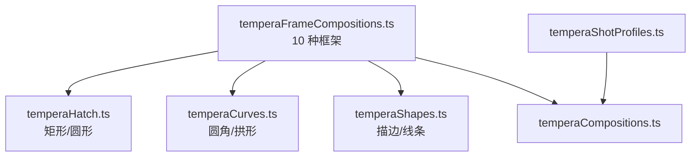
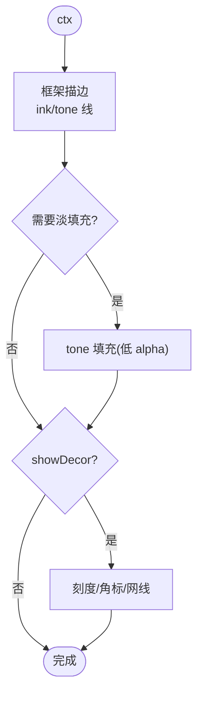
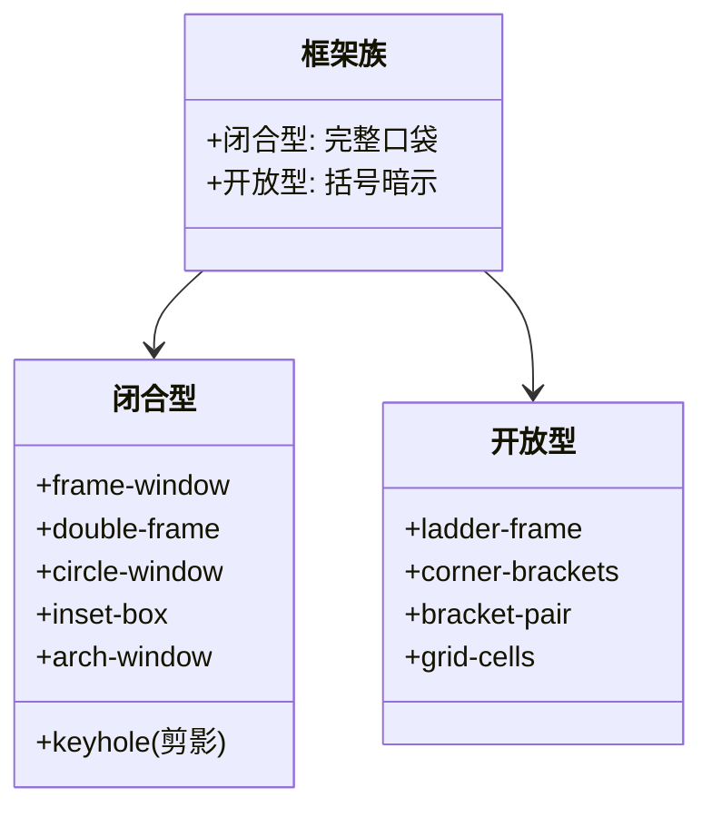
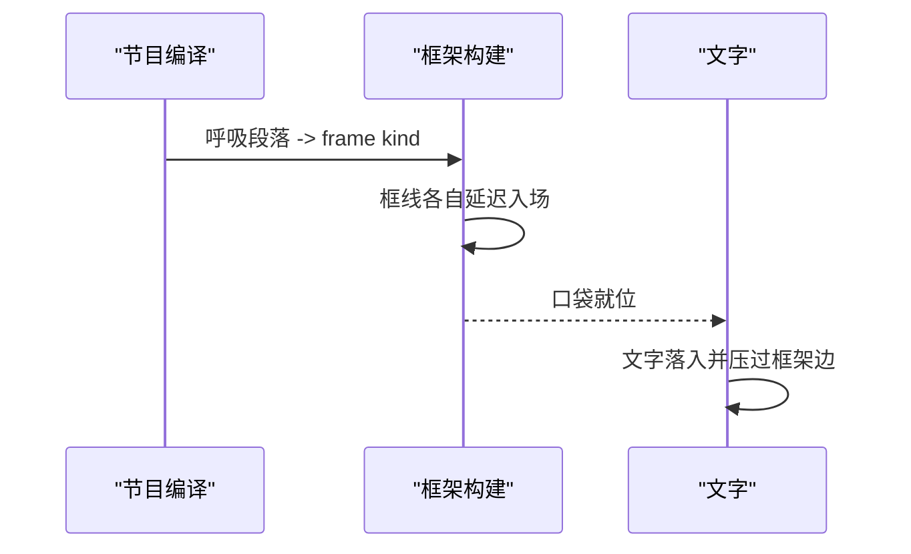
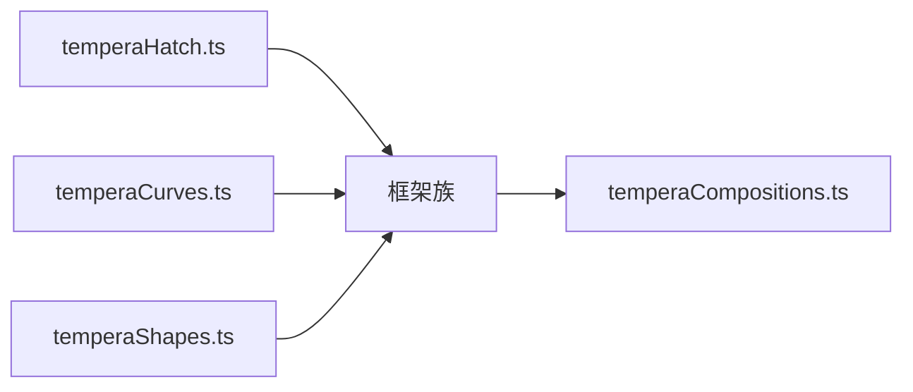

# 框架构图模式

<cite>
**本文引用的文件**   
- [temperaFrameCompositions.ts](file://src/components/visualizer/tempera/compositions/temperaFrameCompositions.ts)
- [temperaHatch.ts](file://src/components/visualizer/tempera/temperaHatch.ts)
- [temperaCurves.ts](file://src/components/visualizer/tempera/temperaCurves.ts)
- [temperaShapes.ts](file://src/components/visualizer/tempera/temperaShapes.ts)
- [temperaCompositions.ts](file://src/components/visualizer/tempera/temperaCompositions.ts)
- [temperaShotProfiles.ts](file://src/components/visualizer/tempera/temperaShotProfiles.ts)
</cite>

## 目录
1. [引言](#引言)
2. [项目结构](#项目结构)
3. [核心组件](#核心组件)
4. [架构总览](#架构总览)
5. [详细组件分析](#详细组件分析)
6. [依赖关系分析](#依赖关系分析)
7. [性能考量](#性能考量)
8. [故障排查指南](#故障排查指南)
9. [结论](#结论)

## 引言
框架构图模式（Frame 族）是 Tempera 的“描边窗户”家族：用线框把文字收进一个安静的口袋，让周围的色调去做表达。因此，当一段歌词需要“呼吸”时，导演选择的就是这个家族。本文围绕以下目标展开：
- 解释十种框架形态：单窗、双框、圆窗、阶梯括号、角括号、内嵌盒、对置括号、拱窗、网格格、钥匙孔。
- 说明框架的构图语言：闭合框 vs 开放括号、主次关系与视觉引导。
- 阐述框架的层级管理与入场机制：先框后文、框线独立延迟。
- 提供配置与扩展指南。

## 项目结构
- temperaFrameCompositions.ts：十种框架构图，注册到 `TEMPERA_FRAME_COMPOSITIONS`。
- temperaHatch.ts：`rectPolygon`、`circlePolygon` 与网线规格。
- temperaCurves.ts：`roundedRectPolygon`（拱窗与圆角框）。
- temperaShapes.ts：`drawPolygonOutline`、`drawLines`、`drawPolygonFill` 等。
- temperaShotProfiles.ts：排版区域（口袋内部）。

**图示来源**
- [temperaFrameCompositions.ts:22-25](file://src/components/visualizer/tempera/compositions/temperaFrameCompositions.ts#L22-L25)
- [temperaFrameCompositions.ts:1-20](file://src/components/visualizer/tempera/compositions/temperaFrameCompositions.ts#L1-L20)

**章节来源**
- [temperaFrameCompositions.ts:22-24](file://src/components/visualizer/tempera/compositions/temperaFrameCompositions.ts#L22-L24)

## 核心组件
十种框架构图（kind → 形态）：
- `frame-window`：斜置的矩形窗框，文字坐在框内。
- `double-frame`：两个错位矩形——文字坐在其中一个内并压过另一个的边缘。
- `circle-window`：圆形窗框。
- `ladder-frame`：单侧阶梯括号——读作页边规矩线而不是闭合盒子。
- `corner-brackets`：四个角括号围出开放的口袋。
- `inset-box`：内嵌矩形带淡填充——hold 住一句歌词的最安静方式。
- `bracket-pair`：两张面对面的括号（不是闭合盒），句子坐在“咬合口”之间。
- `arch-window`：圆顶窗——半圆盘骑在矩形上。
- `grid-cells`：发丝线 3x3 格网，歌词横穿中间一行。
- `keyhole`：窄柄上的圆盘——剪影读作色调中的一个钥匙孔。

**章节来源**
- [temperaFrameCompositions.ts:25-190](file://src/components/visualizer/tempera/compositions/temperaFrameCompositions.ts#L25-L190)

## 架构总览
框架族的绘制一律遵循“线优先、面其次”的顺序：先用 ink/tone 线绘制框架轮廓（`drawPolygonOutline`、`drawLines`），再按需补淡填充。框架入场时间略早于文字（框架先立于画面，文字再进入口袋），框线各自带独立延迟，形成手绘排版中“先打框、再写字”的节奏。

**图示来源**
- [temperaFrameCompositions.ts:41-51](file://src/components/visualizer/tempera/compositions/temperaFrameCompositions.ts#L41-L51)
- [temperaFrameCompositions.ts:109-117](file://src/components/visualizer/tempera/compositions/temperaFrameCompositions.ts#L109-L117)

**章节来源**
- [temperaFrameCompositions.ts:22-24](file://src/components/visualizer/tempera/compositions/temperaFrameCompositions.ts#L22-L24)

## 详细组件分析

### 闭合框与开放括号
框架族最重要的分类是“闭合”与“开放”：
- 闭合型（`frame-window`、`double-frame`、`circle-window`、`inset-box`、`arch-window`、`grid-cells` 的合并格）：给文字一个完整的口袋，安全感与静止感最强。
- 开放型（`ladder-frame`、`corner-brackets`、`bracket-pair`）：用括号与规矩线暗示边界，让文字与色调之间有开口——画面更松弛，适合呼吸段落。

**图示来源**
- [temperaFrameCompositions.ts:66-83](file://src/components/visualizer/tempera/compositions/temperaFrameCompositions.ts#L66-L83)
- [temperaFrameCompositions.ts:118-135](file://src/components/visualizer/tempera/compositions/temperaFrameCompositions.ts#L118-L135)

**章节来源**
- [temperaFrameCompositions.ts:22-24](file://src/components/visualizer/tempera/compositions/temperaFrameCompositions.ts#L22-L24)

### 嵌套与层级：双框与关键孔
- `double-frame` 展示了本族的层级管理：两个错位矩形，文字只占一个，但必压过另一个的边——两层框通过错位建立“印刷套版”的深度，文字主动跨过接缝以触发反色。
- `keyhole` 是剪影型框架：窄柄上的圆盘，其轮廓由色调场“留”出来，而不是由线画出来；文字走圆盘还是柄取决于区域定义。
- `ladder-frame` 用单侧阶梯括号替代闭合盒，梯级兼任度量记号。

**章节来源**
- [temperaFrameCompositions.ts:41-51](file://src/components/visualizer/tempera/compositions/temperaFrameCompositions.ts#L41-L51)
- [temperaFrameCompositions.ts:171-190](file://src/components/visualizer/tempera/compositions/temperaFrameCompositions.ts#L171-L190)

### 框架的入场与呼吸
- 框线延迟早于文字：框架通常以 `delay` 提前入场，文字随后落入口袋。
- 各框线独立时序：阶梯括号的每一级、角括号的每一角都可各自入场，形成“逐笔绘制”的感觉。
- 呼吸段落的选择：实现注释明确——框架族是段落在需要呼吸时的切出目标（“what a paragraph cuts to when it needs to breathe”），因此它常与 `monogatari` 卡片、`sparse` 稀疏族相邻出现，构成节奏上的缓急交替。

**图示来源**
- [temperaFrameCompositions.ts:22-24](file://src/components/visualizer/tempera/compositions/temperaFrameCompositions.ts#L22-L24)

**章节来源**
- [temperaShotProfiles.ts:54-90](file://src/components/visualizer/tempera/temperaShotProfiles.ts#L54-L90)

### 配置与扩展
新增框架构图的步骤如下：定义绘制函数（框线 + 可选填充）→ 注册到 `TEMPERA_FRAME_COMPOSITIONS` → 补充 `types.ts` 与 `temperaShotProfiles.ts` 的 kind 与区域。若引入新的框形（如多段弧），优先扩展 temperaCurves 的工厂。

**章节来源**
- [temperaCompositions.ts:35-49](file://src/components/visualizer/tempera/temperaCompositions.ts#L35-L49)

## 依赖关系分析
- 框架族主要依赖 temperaShapes（描边/线条）与 temperaHatch（矩形/圆）；拱窗与圆角依赖 temperaCurves。
- 与其他族共享总入口的叠层机制（交叉引导线与装饰母题），框架自身不追加叠层逻辑。
- 排版区域与框内几何在 `temperaShotProfiles.ts` 中独立维护。

**图示来源**
- [temperaFrameCompositions.ts:1-20](file://src/components/visualizer/tempera/compositions/temperaFrameCompositions.ts#L1-L20)

**章节来源**
- [temperaCompositions.ts:117-123](file://src/components/visualizer/tempera/temperaCompositions.ts#L117-L123)

## 性能考量
- 框架族以线为主，绘制成本低于面色块家族（线条数量在十几到几十条量级）。
- 3x3 格网（`grid-cells`）是线数最多的变体，仍为一次性静态几何。
- 淡填充使用低 alpha 的单个多边形，不引入滤镜。

**章节来源**
- [temperaFrameCompositions.ts:151-170](file://src/components/visualizer/tempera/compositions/temperaFrameCompositions.ts#L151-L170)

## 故障排查指南
- 框线过粗/过细导致“抢戏”：框架的美学是让位给色调；检查框线宽度与 alpha 是否使用了族内基准值。
- 文字没有压过框架边：`double-frame` 与闭合型框架的反色效果依赖文字跨界；检查区域定义。
- 开放型看起来像缺了一块：这是设计意图（括号与规矩线）；如需要闭合感应选择闭合型 kind。
- 阶梯括号的梯级不等距：`ladder-frame` 的梯级与 `buildHatchSpec` 无关联，需检查其自有的间距参数。
- 拱窗的拱顶不是半圆：拱顶由 `roundedRectPolygon`/半圆盘参数决定，半径必须等于窗宽的一半。

**章节来源**
- [temperaFrameCompositions.ts:136-150](file://src/components/visualizer/tempera/compositions/temperaFrameCompositions.ts#L136-L150)

## 结论
框架构图模式是 Tempera 的“安静语法”：闭合型提供完整口袋，开放型提供松弛边界，剪影型（钥匙孔）把框架变成色调的一部分。它以低成本线框实现精确的排版控制，是呼吸段落、旁白句与安静时刻的首选构图家族，与响亮的海报/信号族形成节奏互补。
