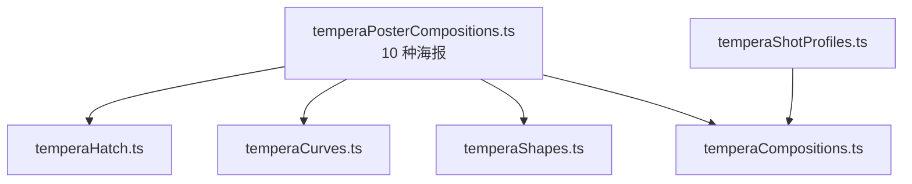
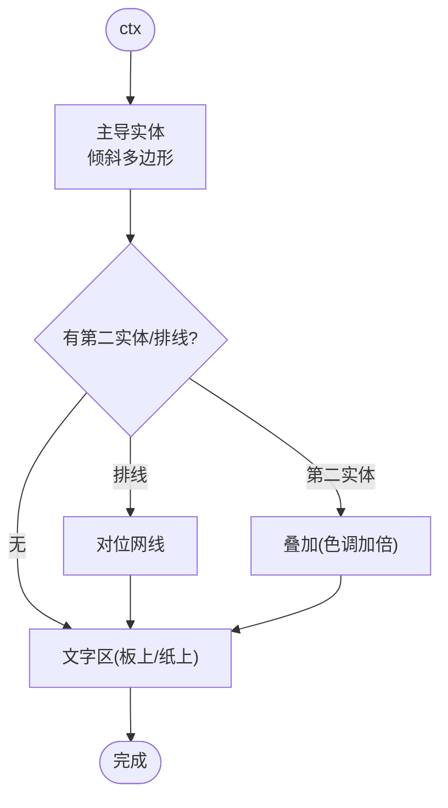
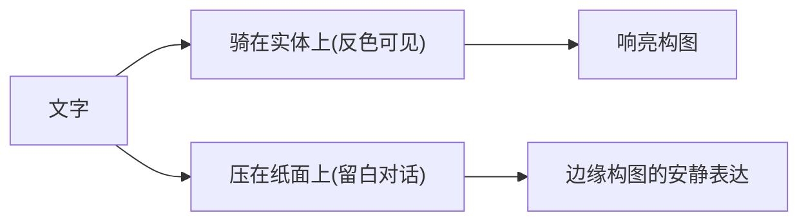
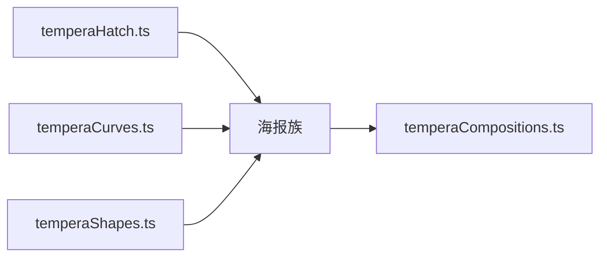

# 海报构图模式

<cite>
**本文引用的文件**   
- [temperaPosterCompositions.ts](file://src/components/visualizer/tempera/compositions/temperaPosterCompositions.ts)
- [temperaHatch.ts](file://src/components/visualizer/tempera/temperaHatch.ts)
- [temperaCurves.ts](file://src/components/visualizer/tempera/temperaCurves.ts)
- [temperaShapes.ts](file://src/components/visualizer/tempera/temperaShapes.ts)
- [temperaCompositions.ts](file://src/components/visualizer/tempera/temperaCompositions.ts)
- [temperaShotProfiles.ts](file://src/components/visualizer/tempera/temperaShotProfiles.ts)
</cite>

## 目录
1. [引言](#引言)
2. [项目结构](#项目结构)
3. [核心组件](#核心组件)
4. [架构总览](#架构总览)
5. [详细组件分析](#详细组件分析)
6. [依赖关系分析](#依赖关系分析)
7. [性能考量](#性能考量)
8. [故障排查指南](#故障排查指南)
9. [结论](#结论)

## 引言
海报构图模式（Poster 族）是 Tempera 的“响亮”家族：巨大的倾斜体量，一块主导的实色形状逼着文字与它较量——正是这种较量让反色滤镜变得可见。本文围绕以下目标展开：
- 解释海报设计的视觉传达原理：信息层级、视觉冲击力与主次较量。
- 说明十种海报版式的形态：面板、菱形堆、斜劈、山形楔、边缘推进、三角巨体等。
- 阐述倾斜与旋转在构图中的作用：角度即动势。
- 提供海报构图的实用配置与设计规范。

## 项目结构
- temperaPosterCompositions.ts：十种海报构图，注册到 `TEMPERA_POSTER_COMPOSITIONS`。
- temperaHatch.ts：`rectPolygon`、`diamondPolygon` 与网线规格（对位排线的来源）。
- temperaCurves.ts：圆盘（`half-disc` 的肩部）。
- temperaShapes.ts：绘制工具。
- temperaShotProfiles.ts：排版区域（板上与纸上的分工）。

**图示来源**
- [temperaPosterCompositions.ts:12-14](file://src/components/visualizer/tempera/compositions/temperaPosterCompositions.ts#L12-L14)

**章节来源**
- [temperaPosterCompositions.ts:12-14](file://src/components/visualizer/tempera/compositions/temperaPosterCompositions.ts#L12-L14)

## 核心组件
十种海报构图（kind → 形态）：
- `poster-panel`：大倾斜面板——家族的原型构图。
- `diamond-stack`：三块递减尺寸的实体列队出画，文字骑在最大的一块上。
- `slash-poster`：横贯画面的一道宽斜劈，对位角度排线反向运行。
- `arrow-wedge`：指向画面另一侧的山形楔（chevron），呼应参考艺术中的屋檐母题。
- `edge-bleed`：从一侧推入的单一实体，文字留在旁边暴露的纸面上。
- `triangle-mass`：锚在一条边上的三角形，占据画面大部分。
- `ribbon-cross`：两条倾斜缎带交叉——重叠处色调加倍。
- `half-disc`：一个巨大到只有肩部进画的圆盘。
- `stacked-slabs`：三块旋转板块错位堆叠，像桌子上落下的纸片。
- `wedge-pair`：两枚楔子从对边咬入，留下一个沙漏形的纸面。

**章节来源**
- [temperaPosterCompositions.ts:15-168](file://src/components/visualizer/tempera/compositions/temperaPosterCompositions.ts#L15-L168)

## 架构总览
海报族的绘制协议是“实体先行、排线随后、文字找架打”：先放一块主导实体（多数带旋转角），再按需铺对位排线或第二层实体，最后让文字骑在实体上或压在纸面上。倾斜是家族的签名——角度由画布参数与种子共同决定，使同一构图在不同镜头下有细微差异。

**图示来源**
- [temperaPosterCompositions.ts:32-46](file://src/components/visualizer/tempera/compositions/temperaPosterCompositions.ts#L32-L46)
- [temperaPosterCompositions.ts:115-131](file://src/components/visualizer/tempera/compositions/temperaPosterCompositions.ts#L115-L131)

**章节来源**
- [temperaPosterCompositions.ts:12-14](file://src/components/visualizer/tempera/compositions/temperaPosterCompositions.ts#L12-L14)

## 详细组件分析

### 主导实体与文字较量
海报族的核心设计目标就是让反色滤镜可见：文字必须与实体边缘相交。因此：
- `diamond-stack` 让文字骑在最大菱体上——跨边关系由构图保证。
- `edge-bleed` 反其道而行：实体推到一边，文字留在暴露的纸面——较量变成“留白与体量”的对话。
- `wedge-pair` 让两枚楔子从对边咬入，纸面被挤成沙漏——文字坐在沙漏的腰上。

**图示来源**
- [temperaPosterCompositions.ts:32-63](file://src/components/visualizer/tempera/compositions/temperaPosterCompositions.ts#L32-L63)

**章节来源**
- [temperaPosterCompositions.ts:12-14](file://src/components/visualizer/tempera/compositions/temperaPosterCompositions.ts#L12-L14)

### 倾斜、旋转与动势
- `slash-poster`：斜劈的角度与“反向运行的网线”构成对位节奏。
- `ribbon-cross`：两条缎带交叉，重叠区色调自动加倍（同一 tone 的 alpha 叠乘）——单色系统里的“撞色”。
- `stacked-slabs`：三块板块错位堆叠，模拟“纸片落桌”的瞬间冻结。
- `half-disc`：圆盘尺寸远超画框，只有肩部入画——与巨石族的“画框裁切”共享同一尺度语言。
- `arrow-wedge`：山形楔指向行进方向，为镜头流动提供方向指引。

**章节来源**
- [temperaPosterCompositions.ts:46-106](file://src/components/visualizer/tempera/compositions/temperaPosterCompositions.ts#L46-L106)
- [temperaPosterCompositions.ts:132-168](file://src/components/visualizer/tempera/compositions/temperaPosterCompositions.ts#L132-L168)

### 视觉层级与构图规范
海报族的“信息层级”由三层构成：实体（面积/明度）→ 排线（纹理）→ 文字（对比）。规范建议：
1. 每张海报只有一个主导实体，第二实体只能作为支撑。
2. 排线角度与实体角度保持对位或正交，不引入第三种角度。
3. 文字区域的对比度由实体的明度保证，不依赖滤镜。

**章节来源**
- [temperaPosterCompositions.ts:12-14](file://src/components/visualizer/tempera/compositions/temperaPosterCompositions.ts#L12-L14)

### 配置与模板
- `lean/rotation`：实体倾斜角，由尺寸与种子决定。
- `tone`：实体色阶（tone1-tone4）。
- `hatchSpec`：对位排线规格（`buildHatchSpec(seed, salt)`）。
扩展方式与其他族一致：新增绘制 → 注册 → 补 profiles。

**章节来源**
- [temperaCompositions.ts:51-54](file://src/components/visualizer/tempera/temperaCompositions.ts#L51-L54)

## 依赖关系分析
- 海报族依赖 temperaHatch（几何+排线）、temperaCurves（圆盘）、temperaShapes（绘制）。
- 与分割族（split）共享“面板切割”语言，但海报族用倾斜制造动势，分割族用平直切口制造纪律。
- 排版区域需与实体几何同步维护。

**图示来源**
- [temperaPosterCompositions.ts:1-11](file://src/components/visualizer/tempera/compositions/temperaPosterCompositions.ts#L1-L11)

**章节来源**
- [temperaCompositions.ts:117-123](file://src/components/visualizer/tempera/temperaCompositions.ts#L117-L123)

## 性能考量
- 实体以个位数量级存在（1-3 块），排线成批生成。
- 重叠区域的“色调加倍”由 alpha 叠加天然实现，无额外混合滤镜。
- 倾斜变换仅作用于多边形顶点，运行期为常规变换矩阵。

**章节来源**
- [temperaPosterCompositions.ts:115-131](file://src/components/visualizer/tempera/compositions/temperaPosterCompositions.ts#L115-L131)

## 故障排查指南
- 反色滤镜不可见：文字没有跨实体边缘；检查排版区域与实体的交叠关系。
- 画面“花”了：出现两枚以上的主导实体；海报族只允许一个主角。
- 排线与实体角度冲突：排线应对位或正交于实体角度；第三种角度会破坏秩序感。
- 重叠区没有变深：`ribbon-cross` 依赖相同 tone 的 alpha 叠加；检查两层是否使用了不同色阶。
- 圆盘看起来“悬在空中”：`half-disc` 的肩部应被画框裁切，未裁切会读作漂浮的圆。

**章节来源**
- [temperaPosterCompositions.ts:12-14](file://src/components/visualizer/tempera/compositions/temperaPosterCompositions.ts#L12-L14)

## 结论
海报构图模式是 Tempera 最具冲击力的家族：以倾斜巨体、对位排线与“文字 vs 实体”的较量，把反色滤镜的戏剧性推到前台。它的十种版式覆盖了从原型面板到沙漏挤压的完整版式谱系，既可作歌曲重音处的“呐喊”，也可通过 `edge-bleed` 式的留白表达安静的张力。
