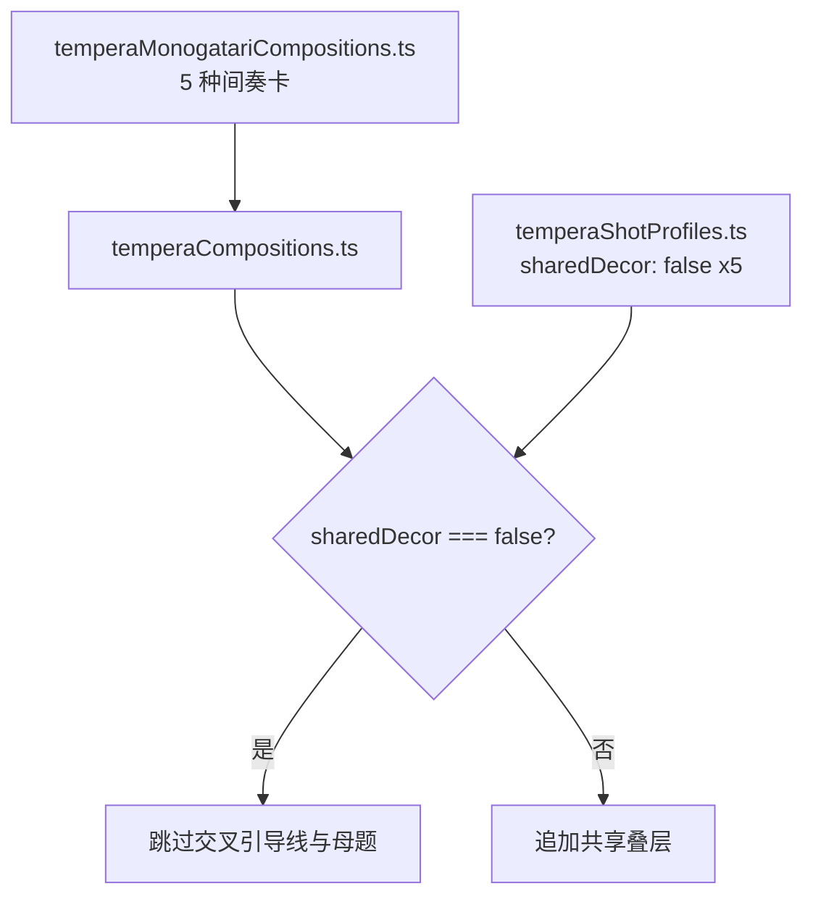
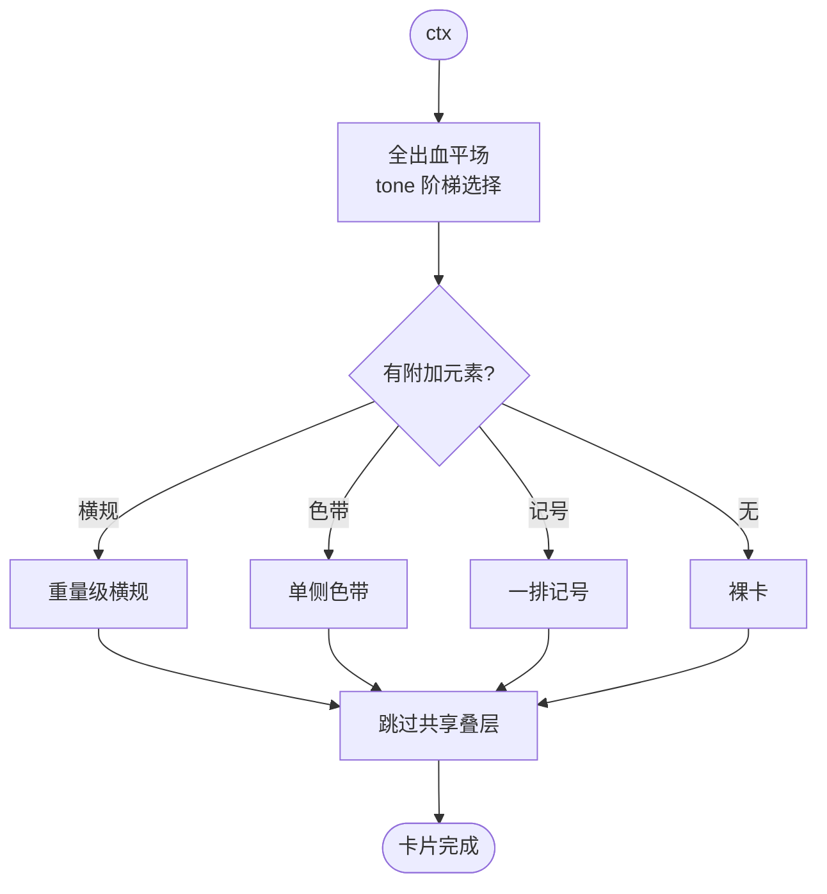
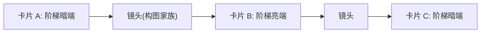
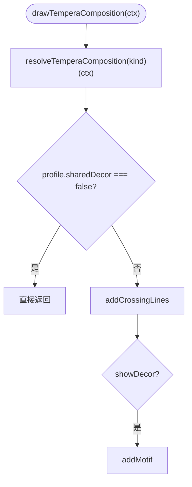
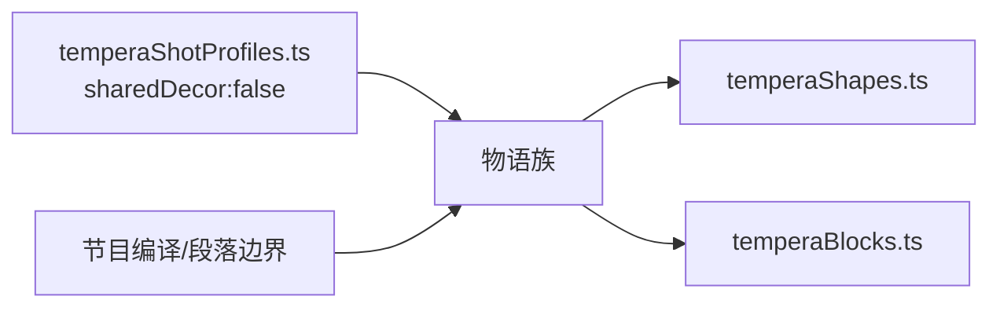

# 物语构图模式

<cite>
**本文引用的文件**   
- [temperaMonogatariCompositions.ts](file://src/components/visualizer/tempera/compositions/temperaMonogatariCompositions.ts)
- [temperaCompositions.ts](file://src/components/visualizer/tempera/temperaCompositions.ts)
- [temperaShotProfiles.ts](file://src/components/visualizer/tempera/temperaShotProfiles.ts)
- [temperaShapes.ts](file://src/components/visualizer/tempera/temperaShapes.ts)
- [temperaBlocks.ts](file://src/components/visualizer/tempera/temperaBlocks.ts)
</cite>

## 目录
1. [引言](#引言)
2. [项目结构](#项目结构)
3. [核心组件](#核心组件)
4. [架构总览](#架构总览)
5. [详细组件分析](#详细组件分析)
6. [依赖关系分析](#依赖关系分析)
7. [性能考量](#性能考量)
8. [故障排查指南](#故障排查指南)
9. [结论](#结论)

## 引言
物语构图模式（Monogatari 族）是 Tempera 的“间奏卡”家族：平场从边到边，文字就是整幅画面。这些卡片刻意几乎不带几何——前一个镜头和后一个镜头在演戏，卡片只是它们之间的一拍静默。本文围绕以下目标展开：
- 解释五种间奏卡的形态与设计思想。
- 说明“色调阶梯交替”的机制：连续卡片为什么读作剪辑而不是停滞。
- 阐述 `sharedDecor: false` 的例外处理：为什么间奏卡必须拒绝共享叠层。
- 提供创作方法论与配置指南。

## 项目结构
- temperaMonogatariCompositions.ts：五种间奏卡，注册到 `TEMPERA_MONOGATARI_COMPOSITIONS`。
- temperaCompositions.ts：共享叠层入口对间奏卡的例外短路。
- temperaShotProfiles.ts：五种卡片均声明 `sharedDecor: false`。
- temperaShapes.ts / temperaBlocks.ts：绘制与块时序。

**图示来源**
- [temperaCompositions.ts:117-123](file://src/components/visualizer/tempera/temperaCompositions.ts#L117-L123)
- [temperaShotProfiles.ts:787-815](file://src/components/visualizer/tempera/temperaShotProfiles.ts#L787-L815)

**章节来源**
- [temperaMonogatariCompositions.ts:10-16](file://src/components/visualizer/tempera/compositions/temperaMonogatariCompositions.ts#L10-L16)

## 核心组件
五种间奏卡（kind → 形态）：
- `monogatari-card`：裸卡——纯平场，别无他物，文字独自支撑画面（卡底可带一条发丝页脚线，像标题卡的页脚规矩线）。
- `monogatari-rule`：平场 + 文字下方一条重磅横规，把卡片一切为二。
- `monogatari-edge`：平场 + 单侧对比色带，像装订页的边缘。
- `monogatari-stack`：平场 + 狭窄文字列，卡片读作堆叠的字幕。
- `monogatari-flash`：最响亮的一张——色调阶梯的另一端 + 最大字号 + 一排记号。

**章节来源**
- [temperaMonogatariCompositions.ts:16-120](file://src/components/visualizer/tempera/compositions/temperaMonogatariCompositions.ts#L16-L120)

## 架构总览
间奏卡的绘制是 Tempera 全家族中最轻的：铺一个全出血平场（tone 阶梯的某一端）→ 可选的一条横规/色带/记号行 → 结束。文字由排版层直接放在场地上。由于卡片本身没有可切的边缘，反色滤镜在这里几乎不工作——这正是它们“静默”的来源。

**图示来源**
- [temperaMonogatariCompositions.ts:10-16](file://src/components/visualizer/tempera/compositions/temperaMonogatariCompositions.ts#L10-L16)
- [temperaCompositions.ts:117-123](file://src/components/visualizer/tempera/temperaCompositions.ts#L117-L123)

**章节来源**
- [temperaCompositions.ts:119-120](file://src/components/visualizer/tempera/temperaCompositions.ts#L119-L120)

## 详细组件分析

### 色调阶梯交替
家族的关键机制：平场在色调阶梯的两端之间交替取值，使一首歌里相邻的卡片读作“切换”而不是“重复”。与相机一起看，这形成了节奏：卡片 A（暗端）→ 镜头 → 卡片 B（亮端）之间是剪辑；同端卡片背靠背则是停滞。因此卡片选择必须由节目编译层考虑前后上下文，而非单卡独立决定。

**图示来源**
- [temperaMonogatariCompositions.ts:12-16](file://src/components/visualizer/tempera/compositions/temperaMonogatariCompositions.ts#L12-L16)

**章节来源**
- [temperaMonogatariCompositions.ts:10-16](file://src/components/visualizer/tempera/compositions/temperaMonogatariCompositions.ts#L10-L16)

### 裸卡与页脚线
`monogatari-card` 是家族乃至整个 Tempera 中最“空”的构图：没有任何开口、面板或纹理，仅保留可选的页脚发丝线（“the way a title card carries a footer rule”）。它在节目中的用法类似轻小说的章节间白页——承担呼吸、留白与情绪停顿，全部的表达都落在文字排版（字号、位置）与前后镜头的对比上。

**章节来源**
- [temperaMonogatariCompositions.ts:16-40](file://src/components/visualizer/tempera/compositions/temperaMonogatariCompositions.ts#L16-L40)

### 从横规到色带：四种轻装饰
- `monogatari-rule` 的重横规把卡片分成上下两半，文字居于其中一侧——是家族中唯一具有强水平分割的卡片。
- `monogatari-edge` 的单侧色带像装订边，给平场一个“装帧”的方向感。
- `monogatari-stack` 收窄文字列，形成“字幕堆”的阅读动势。
- `monogatari-flash` 用阶梯另一端的亮场 + 最大字号 + 记号行，作为连续安静卡片后的“一记重音”。

**章节来源**
- [temperaMonogatariCompositions.ts:40-120](file://src/components/visualizer/tempera/compositions/temperaMonogatariCompositions.ts#L40-L120)

### sharedDecor 例外与架构意义
`drawTemperaComposition` 在正常流程中会为每个构图追加交叉引导线与装饰母题，但读到 `resolveTemperaShotProfile(kind).sharedDecor === false` 时直接返回。间奏卡按定义是裸场——共享叠层会“毁掉”它们。这个例外展示了构图系统的分层设计：族注册（画什么）与共享叠层（统一追加什么）由数据开关而非特判代码控制。

**图示来源**
- [temperaCompositions.ts:117-123](file://src/components/visualizer/tempera/temperaCompositions.ts#L117-L123)

**章节来源**
- [temperaShotProfiles.ts:787-815](file://src/components/visualizer/tempera/temperaShotProfiles.ts#L787-L815)

## 依赖关系分析
- 物语族是依赖最少的构图家族：仅需 temperaShapes 的基础绘制与块时序。
- 与前后镜头的关系远比内部几何重要：卡片的价值由“切出/切入”决定，因此它常与节目编译的段落边界逻辑耦合。
- 五种卡片的区域定义在 `temperaShotProfiles.ts` 中，且全部携带 `sharedDecor: false`。

**图示来源**
- [temperaShotProfiles.ts:787-815](file://src/components/visualizer/tempera/temperaShotProfiles.ts#L787-L815)

**章节来源**
- [temperaCompositions.ts:117-123](file://src/components/visualizer/tempera/temperaCompositions.ts#L117-L123)

## 性能考量
- 家族是最低成本构图：每卡一到两个 Graphics。
- 无纹理、无网线、无开口，绘制与显存成本全局最低。
- 适合在长歌曲中高频出现，作为其他昂贵家族之间的“休止符”。

**章节来源**
- [temperaMonogatariCompositions.ts:10-16](file://src/components/visualizer/tempera/compositions/temperaMonogatariCompositions.ts#L10-L16)

## 故障排查指南
- 卡片上出现了引导线/母题：检查对应 kind 的 `sharedDecor` 是否被误改为 true；间奏卡必须为 false。
- 连续卡片读作停滞：色调阶梯没有交替；应由编译层在相邻卡片间切换阶梯端。
- 裸卡上文字判读困难：纯平场缺乏对比支撑，需要检查主题的纸/墨对比度与字号。
- 横规位置与文字重叠：`monogatari-rule` 的横规与文字区域需在 profiles 中协调。
- 卡片“太吵”：闪卡（flash）只应在长段安静之后作为重音使用，连续出现会削弱对比。

**章节来源**
- [temperaShotProfiles.ts:787-815](file://src/components/visualizer/tempera/temperaShotProfiles.ts#L787-L815)

## 结论
物语构图模式以极简的间奏卡实现 Tempera 的“呼吸”机制：空无一物的平场、文字即画面、色调阶梯交替制造剪辑感。它对共享叠层的定向拒绝（`sharedDecor: false`）是架构上的点睛之笔——证明统一叠层与例外控制可以共存于一个数据驱动的分层系统。作为最轻的家族，它为整部作品的节奏留出了必要的空白。
