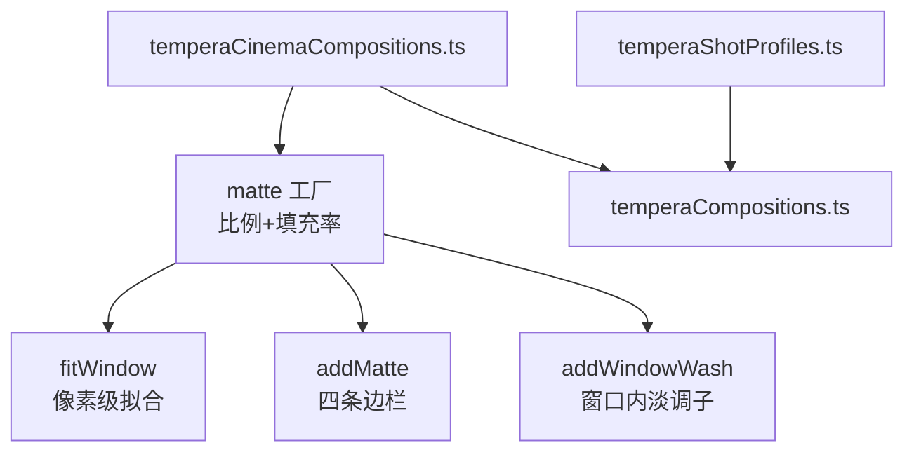
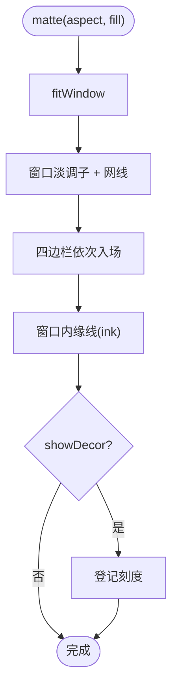
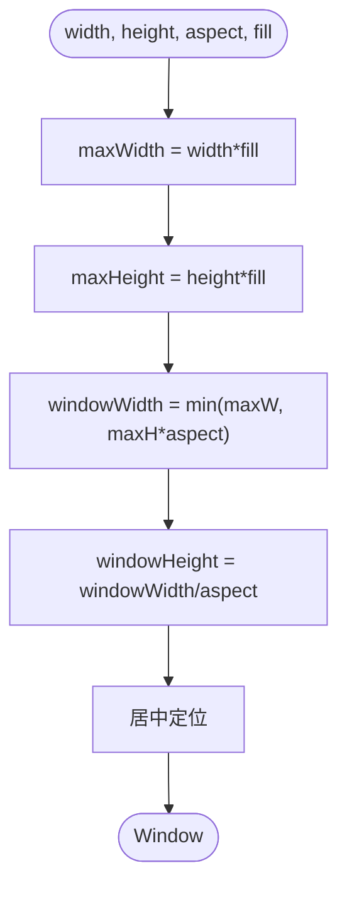
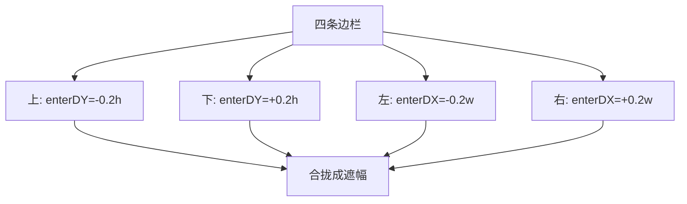
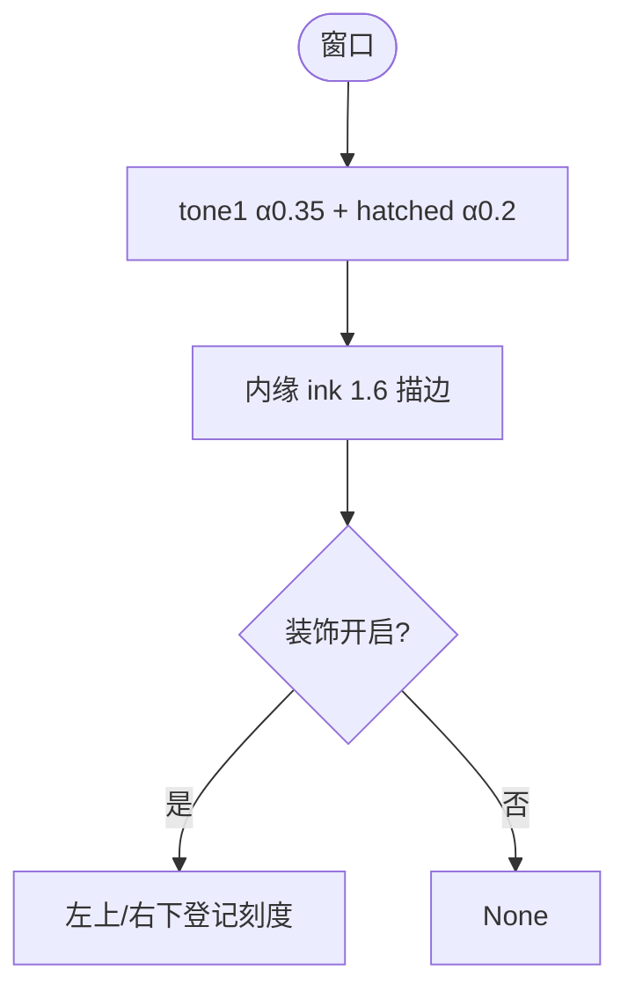
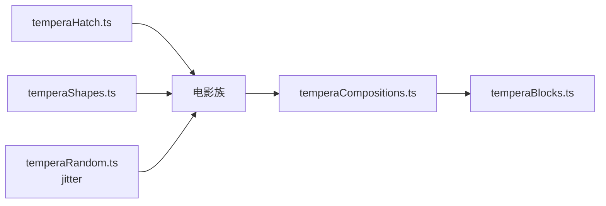

# 电影构图模式

<cite>
**本文引用的文件**   
- [temperaCinemaCompositions.ts](file://src/components/visualizer/tempera/compositions/temperaCinemaCompositions.ts)
- [temperaHatch.ts](file://src/components/visualizer/tempera/temperaHatch.ts)
- [temperaShapes.ts](file://src/components/visualizer/tempera/temperaShapes.ts)
- [temperaCompositions.ts](file://src/components/visualizer/tempera/temperaCompositions.ts)
- [temperaShotProfiles.ts](file://src/components/visualizer/tempera/temperaShotProfiles.ts)
- [temperaBlocks.ts](file://src/components/visualizer/tempera/temperaBlocks.ts)
</cite>

## 目录
1. [引言](#引言)
2. [项目结构](#项目结构)
3. [核心组件](#核心组件)
4. [架构总览](#架构总览)
5. [详细组件分析](#详细组件分析)
6. [依赖关系分析](#依赖关系分析)
7. [性能考量](#性能考量)
8. [故障排查指南](#故障排查指南)
9. [结论](#结论)

## 引言
电影构图模式（Cinema 族）是 Tempera 的“画幅遮罩”家族：一块实色遮罩中间挖出指定宽高比的窗口，窗口就是歌词所坐的位置，四周的色块因此读作遮幅而不是色块；同时遮幅的硬边为反色滤镜提供了切割文字的边界。本文围绕以下目标展开：
- 解释电影级画幅比例的配置系统：2.39、1.85、1.33、1、0.75、0.5625 六种比例与 twin 双窗。
- 说明遮幅的实现原理：为什么用四条边栏而不是“实形挖洞”。
- 阐述窗口适配算法：真实像素尺寸拟合（任何屏幕上“方形都必须是方的”）。
- 解释种子抖动（jitteredFill）与登记刻度等细节。

## 项目结构
- temperaCinemaCompositions.ts：`matte` 工厂 + 六个比例实例 + `cinemaTwin`。
- temperaHatch.ts：`rectPolygon` 与网线规格。
- temperaShapes.ts：`drawPolygonFill`、`drawPolygonOutline`、`drawLines`、`drawHatchFill`。
- temperaCompositions.ts：注册与共享叠层。
- temperaShotProfiles.ts：排版区域（窗口内）。

**图示来源**
- [temperaCinemaCompositions.ts:23-84](file://src/components/visualizer/tempera/compositions/temperaCinemaCompositions.ts#L23-L84)

**章节来源**
- [temperaCinemaCompositions.ts:7-17](file://src/components/visualizer/tempera/compositions/temperaCinemaCompositions.ts#L7-L17)

## 核心组件
- `fitWindow(width, height, aspect, fill)`：在画幅内拟合给定宽高比的窗口，使用真实像素尺寸而非视口分数。
- `addMatte`：以四条凸形边栏组成遮罩，每条边栏独立入场（上下沿 y 轴滑入、左右沿 x 轴滑入）。
- `addWindowWash`：给窗口铺一层淡色（tone1，alpha 0.35）与 20% 网线，让洞不至于“裸露”。
- `matte(aspect, fill, washAlpha)`：遮幅工厂，供六个比例复用。
- `jitteredFill`：用 `temperaHash01(seed, 157, 163)` 在 ±0.03 范围内抖动填充率。
- 六个内置比例：`cinema-scope` 2.39、`cinema-wide` 1.85、`cinema-academy` 1.33、`cinema-square` 1、`cinema-portrait` 0.75、`cinema-tall` 0.5625；另有 `cinema-twin` 双窗。

**章节来源**
- [temperaCinemaCompositions.ts:23-34](file://src/components/visualizer/tempera/compositions/temperaCinemaCompositions.ts#L23-L34)

## 架构总览
遮幅的绘制顺序是“先窗口内淡调子、再四条边栏、最后登记刻度”：窗口内容先画，遮罩随后从四边滑入合围，入场完成后画面呈现为一帧被定格的电影画面。四条边栏的 `delay` 以 0.04 步进依次到位，形成“遮框合拢”的仪式感。

**图示来源**
- [temperaCinemaCompositions.ts:74-84](file://src/components/visualizer/tempera/compositions/temperaCinemaCompositions.ts#L74-L84)

**章节来源**
- [temperaCinemaCompositions.ts:40-64](file://src/components/visualizer/tempera/compositions/temperaCinemaCompositions.ts#L40-L64)

## 详细组件分析

### 窗口拟合算法
`fitWindow` 先取画幅的 `fill` 比例作为最大宽高，再按目标宽高比计算窗口宽（取 `maxWidth` 与 `maxHeight * aspect` 的较小者），高度由宽高比反推，最后居中。关键设计是使用真实像素而不是视口分数：`aspect = 1` 的“方形窗”必须在任何屏幕比例上都是正方形。

**图示来源**
- [temperaCinemaCompositions.ts:19-34](file://src/components/visualizer/tempera/compositions/temperaCinemaCompositions.ts#L19-L34)

**章节来源**
- [temperaCinemaCompositions.ts:19-34](file://src/components/visualizer/tempera/compositions/temperaCinemaCompositions.ts#L19-L34)

### 四条边栏而非“挖洞”
实现刻意没有采用“实形挖洞”，而是把遮幅拆成上、下、左、右四条凸形矩形：
- 凸形是网线剪裁器的要求（阴影线只能填充凸形）。
- 每条边栏可以各自携带入场方向：顶部向下、底部向上、左侧右滑、右侧左滑，形成合拢动画。
- 四条边栏全部向 `bleed` 外扩，运镜时不会露边。

**图示来源**
- [temperaCinemaCompositions.ts:36-55](file://src/components/visualizer/tempera/compositions/temperaCinemaCompositions.ts#L36-L55)

**章节来源**
- [temperaCinemaCompositions.ts:36-64](file://src/components/visualizer/tempera/compositions/temperaCinemaCompositions.ts#L36-L64)

### 窗口内淡调子与登记刻度
- 窗口内铺 `tone1`（alpha 0.35）与低密度网线（alpha 0.2），避免洞内完全是裸背景；同时保持窗口与文字之间有足够的对比度。
- 装饰开启时，在窗口左上与右下角外侧绘制两段竖直登记刻度（paper 色，宽 2），对齐窗口边缘——这是印刷遮幅的“套准记号”。
- `cinemaTwin` 采用双窗：左窗更宽更亮（alpha 0.4），右窗更小并带 35% 网线，歌词取左窗；两窗分别从左右滑入。

**图示来源**
- [temperaCinemaCompositions.ts:66-84](file://src/components/visualizer/tempera/compositions/temperaCinemaCompositions.ts#L66-L84)

**章节来源**
- [temperaCinemaCompositions.ts:86-109](file://src/components/visualizer/tempera/compositions/temperaCinemaCompositions.ts#L86-L109)

### 配置参数
- `aspect`：画幅比（2.39 宽银幕 → 0.5625 竖幅）。
- `fill`：窗口占画幅的填充率（0.72-0.88，经种子抖动 ±0.03）。
- `washAlpha`：窗口内淡调子透明度（默认 0.35）。
- 抖动的意义：同一比例在不同镜头（不同种子）下窗口大小略有差异，避免完全相同的一帧重复出现。

**章节来源**
- [temperaCinemaCompositions.ts:111-124](file://src/components/visualizer/tempera/compositions/temperaCinemaCompositions.ts#L111-L124)

## 依赖关系分析
- 电影族依赖 temperaHatch（矩形与网线）与 temperaShapes（绘制），无曲线依赖。
- 排版区域依赖窗口几何：区域定义在 `temperaShotProfiles.ts` 中与窗口比例匹配，二者需要同步维护。
- 入场时序全部由块选项表达（`delay/span/enterDX/enterDY`）。

**图示来源**
- [temperaCinemaCompositions.ts:1-5](file://src/components/visualizer/tempera/compositions/temperaCinemaCompositions.ts#L1-L5)

**章节来源**
- [temperaCompositions.ts:117-123](file://src/components/visualizer/tempera/temperaCompositions.ts#L117-L123)

## 性能考量
- 每条遮幅只有四到五个 Graphics（四边栏 + 内缘线 + 可选刻度），批量一次性生成。
- 网线填充复用窗口多边形，`grow` 生长无额外节点。
- 无逐帧计算；种子抖动在构建期一次完成。

**章节来源**
- [temperaCinemaCompositions.ts:48-63](file://src/components/visualizer/tempera/compositions/temperaCinemaCompositions.ts#L48-L63)

## 故障排查指南
- “方形窗”在宽屏上变扁：检查 `fitWindow` 是否使用像素尺寸而非视口分数。
- 窗口滑动时边缘穿帮：四条边栏必须各自向 `bleed` 外扩，尤其左右边栏的宽度计算。
- 窗口内出现不该有的纹理：淡调子与网线的 alpha 过高会干扰文字；默认值为 0.35 / 0.2。
- 遮幅入场顺序错乱：四条边栏的 delay 以 0.04 步进（0/0.04/0.08/0.12），检查是否有层被调换。
- 双窗文字压到了右窗：歌词区域应对齐左窗；检查 `temperaShotProfiles.ts` 中 `cinema-twin` 的区域定义。

**章节来源**
- [temperaCinemaCompositions.ts:91-104](file://src/components/visualizer/tempera/compositions/temperaCinemaCompositions.ts#L91-L104)

## 结论
电影构图模式以“四边栏 + 像素级窗口拟合”的稳健实现，把六种经典画幅比例带入 Tempera 的画面语言。它既是构图工具也是叙事装置：遮幅合拢的入场、登记刻度与种子抖动让每一帧都像一次“曝光”。窗口内淡调子与硬边内缘线的组合，也为反色滤镜提供了最干净的切割边界。
