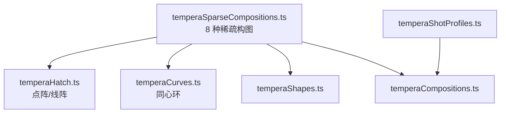
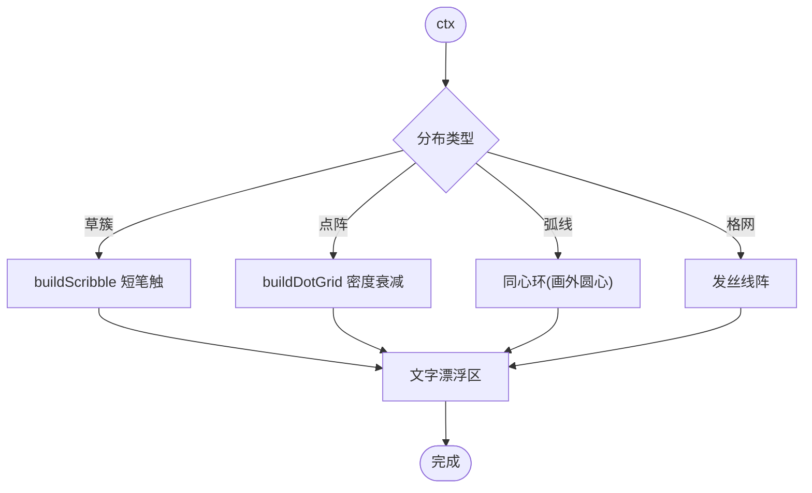
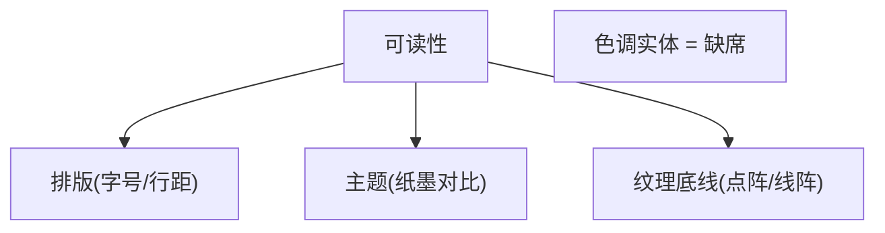
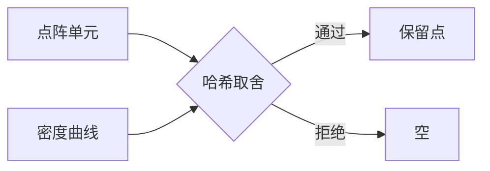
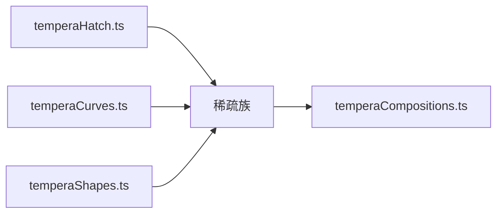

# 稀疏构图模式

<cite>
**本文引用的文件**   
- [temperaSparseCompositions.ts](file://src/components/visualizer/tempera/compositions/temperaSparseCompositions.ts)
- [temperaHatch.ts](file://src/components/visualizer/tempera/temperaHatch.ts)
- [temperaCurves.ts](file://src/components/visualizer/tempera/temperaCurves.ts)
- [temperaShapes.ts](file://src/components/visualizer/tempera/temperaShapes.ts)
- [temperaCompositions.ts](file://src/components/visualizer/tempera/temperaCompositions.ts)
- [temperaShotProfiles.ts](file://src/components/visualizer/tempera/temperaShotProfiles.ts)
</cite>

## 目录
1. [引言](#引言)
2. [项目结构](#项目结构)
3. [核心组件](#核心组件)
4. [架构总览](#架构总览)
5. [详细组件分析](#详细组件分析)
6. [依赖关系分析](#依赖关系分析)
7. [性能考量](#性能考量)
8. [故障排查指南](#故障排查指南)
9. [结论](#结论)

## 引言
稀疏构图模式（Sparse 族）是 Tempera 的“呼吸段落”家族：近乎空白的构图——发丝线、点阵与手绘笔触，几乎没有色调质量，让文字读作一句耳语。本文围绕以下目标展开：
- 解释稀疏设计的哲学：少即是多、留白艺术与简约美学。
- 说明八种稀疏构图的形态：草簇、点阵星野、涟漪、发丝格、边规、漂移点、弧扫、空白页。
- 阐述稀疏元素的分布算法：随机散布、密度衰减与自然聚集。
- 提供创作心法与审美指导。

## 项目结构
- temperaSparseCompositions.ts：八种稀疏构图，注册到 `TEMPERA_SPARSE_COMPOSITIONS`。
- temperaHatch.ts：`buildDotGrid`、`buildDotRow`、`buildHatchLines` 等点阵与线阵工具。
- temperaCurves.ts：同心环（`arc-sweep`、`ripple-lines` 的弧线）。
- temperaShapes.ts：绘制工具。
- temperaShotProfiles.ts：排版区域（漂浮的文字位置）。

**图示来源**
- [temperaSparseCompositions.ts:13-15](file://src/components/visualizer/tempera/compositions/temperaSparseCompositions.ts#L13-L15)

**章节来源**
- [temperaSparseCompositions.ts:13-15](file://src/components/visualizer/tempera/compositions/temperaSparseCompositions.ts#L13-L15)

## 核心组件
八种稀疏构图（kind → 形态）：
- `quiet-line`：草簇——从一个基线点扇出的短笔触。
- `starfield-dots`：向一侧渐疏的点阵；文字漂浮在稀疏的半边。
- `ripple-lines`：同心抖动线——从水面之下看到的水面。
- `hair-grid`：全出血发丝格网；句子漂浮其上。
- `margin-rule`：一条沿页边的重规线 + 少许登记记号。
- `dot-drift`：沿一条对角线渐疏的点阵。
- `arc-sweep`：圆心在画外的同心环——只有弧段穿过画面。
- `blank-page`：几乎空白的纸 + 一个小的登记记号——主歌之前的一次呼吸。

**章节来源**
- [temperaSparseCompositions.ts:16-150](file://src/components/visualizer/tempera/compositions/temperaSparseCompositions.ts#L16-L150)

## 架构总览
稀疏族的绘制协议最轻：铺可选的点阵/线阵/弧线 → 安放少量手绘笔触 → 结束。全族没有大面积 tone 实体、没有开口、没有网线填充。文字区域由“密度衰减的方向”决定——点阵在哪一侧变疏，文字就漂在哪一侧。

**图示来源**
- [temperaSparseCompositions.ts:16-40](file://src/components/visualizer/tempera/compositions/temperaSparseCompositions.ts#L16-L40)
- [temperaSparseCompositions.ts:41-54](file://src/components/visualizer/tempera/compositions/temperaSparseCompositions.ts#L41-L54)

**章节来源**
- [temperaSparseCompositions.ts:13-15](file://src/components/visualizer/tempera/compositions/temperaSparseCompositions.ts#L13-L15)

## 详细组件分析

### 留白的哲学：色调缺席
稀疏族的共同特征是“无色调质量”（almost no tone mass）：没有实色面板、没有遮幅、没有大块 tone。文字的可读性依靠：
- 足够的字号与合适的行距（排版层职责）。
- 主题的纸/墨对比度（主题层职责）。
- 点阵/线阵作为“可读的纹理底线”，而非对比来源。

**图示来源**
- [temperaSparseCompositions.ts:13-15](file://src/components/visualizer/tempera/compositions/temperaSparseCompositions.ts#L13-L15)

**章节来源**
- [temperaSparseCompositions.ts:13-15](file://src/components/visualizer/tempera/compositions/temperaSparseCompositions.ts#L13-L15)

### 分布算法：密度衰减与自然聚集
- 密度衰减：`starfield-dots` 与 `dot-drift` 的点阵向一侧/一条对角线渐疏（由单元格哈希与距离曲线控制取舍），稀疏的一侧留给文字。
- 自然聚集：`quiet-line` 的草簇从一个基线点扇形散开——模仿地面生草的聚集感；笔触角度与长度由确定性的 scribble 路径生成。
- 画外圆心：`arc-sweep` 与 `ripple-lines` 的同心环圆心在画面之外，画面内只呈现弧段——避免“靶心”式的居中构图。

**图示来源**
- [temperaSparseCompositions.ts:41-54](file://src/components/visualizer/tempera/compositions/temperaSparseCompositions.ts#L41-L54)
- [temperaSparseCompositions.ts:103-114](file://src/components/visualizer/tempera/compositions/temperaSparseCompositions.ts#L103-L114)

**章节来源**
- [temperaSparseCompositions.ts:16-114](file://src/components/visualizer/tempera/compositions/temperaSparseCompositions.ts#L16-L114)

### 呼吸感的营造：节奏与停顿
- `blank-page` 是“一页呼吸”：几乎空白的纸面上只有一个登记记号，用在主歌进入前的一拍停顿。
- `ripple-lines` 的抖动同心线提供“缓慢的表面运动”意象——虽然几何是静态的，但线与线的间距变化制造了时间的错觉。
- `margin-rule` 把重量压在页边，中央完全敞开——最像书籍排版的稀疏构图。
- `hair-grid` 提供“半透明的坐标纸”质感，句子像写在格纸上。

**章节来源**
- [temperaSparseCompositions.ts:55-150](file://src/components/visualizer/tempera/compositions/temperaSparseCompositions.ts#L55-L150)

### 创作心法与审美指导
- 克制：每条线、每个点都必须有意义；稀疏族的失败模式是“加得太满”。
- 方向性：密度必须有方向（向哪里稀疏），否则画面失去呼吸的开口。
- 弧线的位置：同心环的圆心永远在画外，避免将画面变成靶子。
- 与文字的对话：文字是画面中唯一的“重量”，构图的所有元素都要为它让路。

**章节来源**
- [temperaSparseCompositions.ts:13-15](file://src/components/visualizer/tempera/compositions/temperaSparseCompositions.ts#L13-L15)

## 依赖关系分析
- 稀疏族依赖 temperaHatch（点阵/线阵生成）、temperaCurves（同心环）、temperaShapes（绘制）。
- 是继物语族之后成本第二低的家族，常与物语卡、框架族共同承担“安静段落”的节奏。
- 排版区域与其他家族不同：文字不需要“承载物”遮挡，直接漂浮在稀疏纹理上。

**图示来源**
- [temperaSparseCompositions.ts:1-12](file://src/components/visualizer/tempera/compositions/temperaSparseCompositions.ts#L1-L12)

**章节来源**
- [temperaCompositions.ts:117-123](file://src/components/visualizer/tempera/temperaCompositions.ts#L117-L123)

## 性能考量
- 点阵数量由网格与取舍控制，无色调大面积填充。
- 草簇与弧线的点数有限，全部一次成型。
- 是全局最适合高频出现的低成本家族之一。

**章节来源**
- [temperaSparseCompositions.ts:41-54](file://src/components/visualizer/tempera/compositions/temperaSparseCompositions.ts#L41-L54)

## 故障排查指南
- 画面“空得发慌”：需要检查是否有至少一种纹理底线（点阵/线阵/弧线），完全真空会让画面失去方向。
- 点阵盖住了文字：密度衰减方向错了——稀疏的一侧必须留给文字。
- 草簇看起来像栅栏：笔触的角度范围过窄；草簇应扇形散开。
- 涟漪线像靶心：圆心跑进了画面；同心环圆心必须在画外。
- 呼吸段落不够“安静”：检查是否误加了共享母题或网线；稀疏族的 purity 依赖克制。

**章节来源**
- [temperaSparseCompositions.ts:55-71](file://src/components/visualizer/tempera/compositions/temperaSparseCompositions.ts#L55-L71)

## 结论
稀疏构图模式以“无色调质量”为设计前提，用点阵、发丝线与手绘笔触支起一片可呼吸的留白。八种构图从草簇到空白页，覆盖了从微风到屏息的完整安静光谱。它对密度方向、画外圆心与克制原则的坚持，使它成为 Tempera 节奏设计中最不可替代的“休止符”家族。
