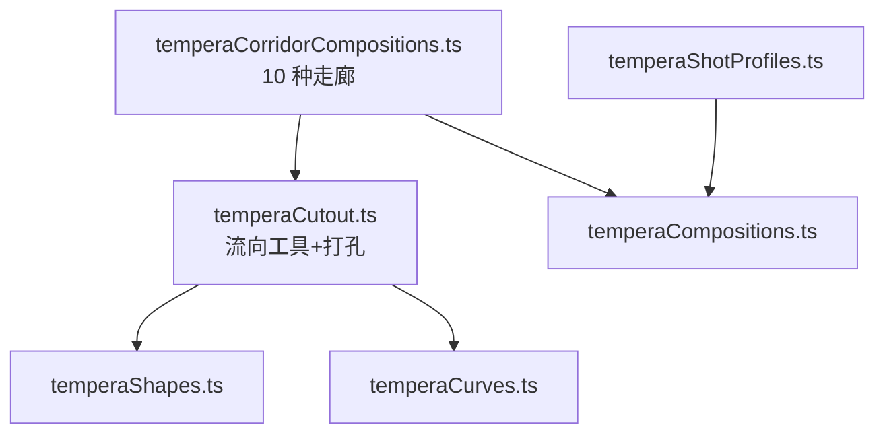
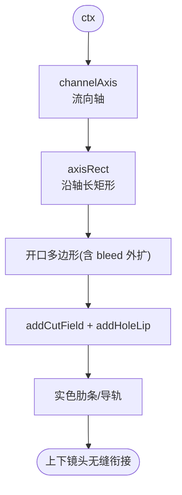
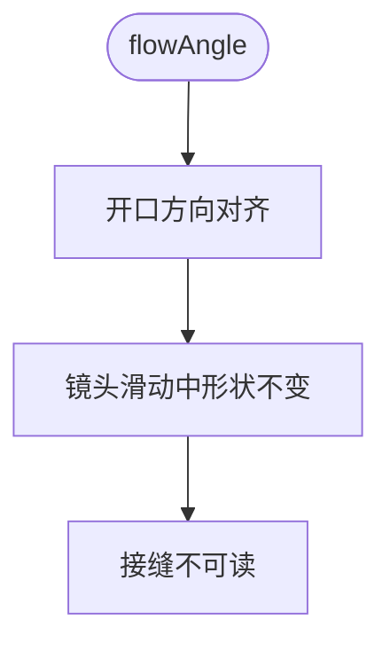
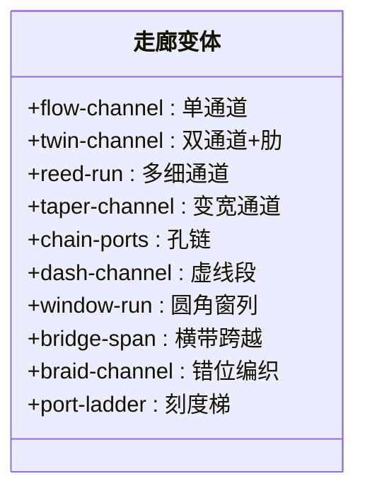
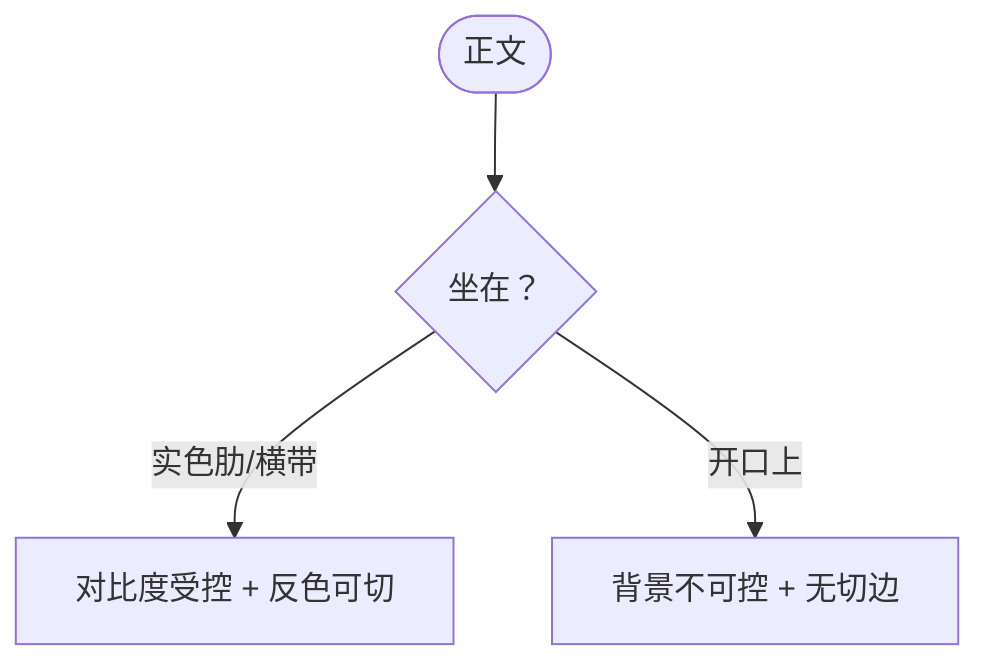
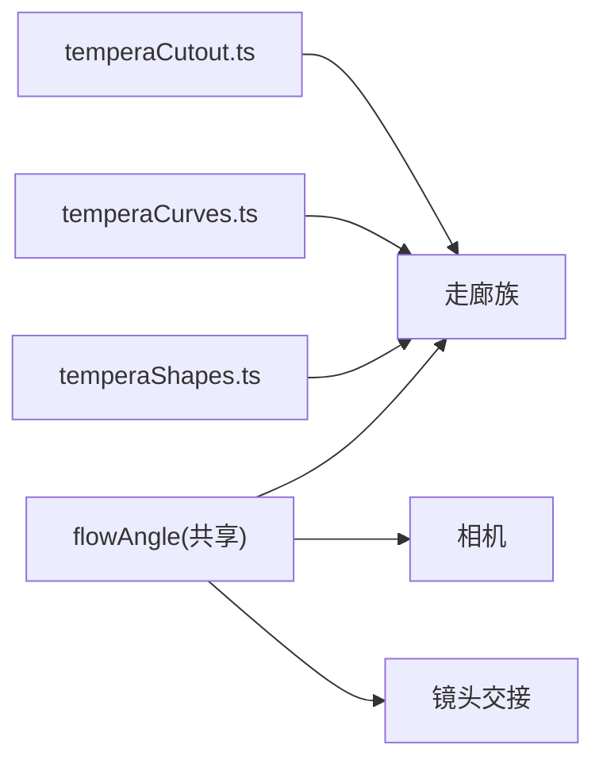

# 走廊构图模式

<cite>
**本文引用的文件**   
- [temperaCorridorCompositions.ts](file://src/components/visualizer/tempera/compositions/temperaCorridorCompositions.ts)
- [temperaCutout.ts](file://src/components/visualizer/tempera/compositions/temperaCutout.ts)
- [temperaCurves.ts](file://src/components/visualizer/tempera/temperaCurves.ts)
- [temperaShapes.ts](file://src/components/visualizer/tempera/temperaShapes.ts)
- [temperaCompositions.ts](file://src/components/visualizer/tempera/temperaCompositions.ts)
- [temperaShotProfiles.ts](file://src/components/visualizer/tempera/temperaShotProfiles.ts)
</cite>

## 目录
1. [引言](#引言)
2. [项目结构](#项目结构)
3. [核心组件](#核心组件)
4. [架构总览](#架构总览)
5. [详细组件分析](#详细组件分析)
6. [依赖关系分析](#依赖关系分析)
7. [性能考量](#性能考量)
8. [故障排查指南](#故障排查指南)
9. [结论](#结论)

## 引言
走廊构图模式（Corridor 族）是 Tempera 中为“接过场”而生的家族：开口沿镜头运动方向切割。相邻镜头沿流动矢量相互滑过时，平行于流动方向的走廊在移动中依然像同一条走廊，两个镜头之间的接缝因此不再读作剪辑；背景也通过移动的开口持续可见，而不是随每次剪辑出现和消失。本文围绕以下目标展开：
- 解释十种走廊构图的形态与设计意图。
- 说明“流动对齐”机制：开口平行于 flow 矢量、两端锚定在画外。
- 阐述排版规则：文字永远骑在开口旁的实色肋条上，从不坐在开口本身。
- 解释流向工具（`channelAxis`、`flowPoint`、`acrossFlow`）的用法。

## 项目结构
- temperaCorridorCompositions.ts：十种走廊构图，注册到 `TEMPERA_CORRIDOR_COMPOSITIONS`。
- temperaCutout.ts：流向几何工具（`channelAxis`、`axisRect`、`flowPoint`、`acrossPoint`、`acrossFlow`、`flowSpan`）与打孔（`addCutField`/`addHoleLip`）。
- temperaCurves.ts：圆角开口（`roundedRectPolygon`）。
- temperaShapes.ts：绘制工具。
- temperaShotProfiles.ts：排版区域（骑在肋条上）。

**图示来源**
- [temperaCorridorCompositions.ts:1-25](file://src/components/visualizer/tempera/compositions/temperaCorridorCompositions.ts#L1-L25)
- [temperaCutout.ts:60-118](file://src/components/visualizer/tempera/compositions/temperaCutout.ts#L60-L118)

**章节来源**
- [temperaCorridorCompositions.ts:10-25](file://src/components/visualizer/tempera/compositions/temperaCorridorCompositions.ts#L10-L25)

## 核心组件
十种走廊构图（kind → 形态）：
- `flow-channel`：一条宽阔走廊贴着画面一侧，双缘带导轨。
- `twin-channel`：两条走廊，文字站在中间的实色肋上。
- `reed-run`：外侧三分区内多条发丝走廊（“芦苇”），中列保持通透。
- `taper-channel`：运行时收窄的走廊——全家族唯一开口不是平移不变的构图，因此读作“走廊到达了某处”。
- `chain-ports`：沿行进线排列的孔洞，由发丝线串成链。
- `dash-channel`：被切成虚线的走廊，虚段之间保留实色系梁。
- `window-run`：车厢窗——圆角开口以固定间距依次经过。
- `bridge-span`：全家族最宽的走廊，被一条实色横带跨越；文字骑在横带上，镜头读作“横跨背景的桥”。
- `braid-channel`：两条走廊各自在对方贯通处中断（半间距错位），读作编织而非双槽。
- `port-ladder`：双轨带刻度的走廊——走廊即一把量尺。

**章节来源**
- [temperaCorridorCompositions.ts:26-460](file://src/components/visualizer/tempera/compositions/temperaCorridorCompositions.ts#L26-L460)

## 架构总览
走廊构图全部建立在同一个流向坐标系上：由 `channelAxis` 得到走廊轴（角度与原点），`axisRect` 沿轴生成细长矩形，`flowPoint` / `acrossPoint` 在“沿流”与“横流”两个方向上取点，`flowSpan` 取对角线长度的 1.6 倍作为“无限长”参考。由此，任何开口都可以被构造成“两端锚定在画外”的通道，同时与相机的流向保持一致。

**图示来源**
- [temperaCutout.ts:60-118](file://src/components/visualizer/tempera/compositions/temperaCutout.ts#L60-L118)
- [temperaCorridorCompositions.ts:10-25](file://src/components/visualizer/tempera/compositions/temperaCorridorCompositions.ts#L10-L25)

**章节来源**
- [temperaCutout.ts:82-118](file://src/components/visualizer/tempera/compositions/temperaCutout.ts#L82-L118)

## 详细组件分析

### 流动对齐与“无端走廊”
走廊族的核心约束是两条：
1. 开口必须在两端锚定到画外（永不露出端头）——有端头的走廊是一个“形状”，形状会出卖剪辑点。
2. 开口方向必须与 `flowAngle` 平行——平行于流动的槽在滑动中保持为槽，相邻镜头看起来像同一条走廊的延续。

**图示来源**
- [temperaCompositionContext.ts:40-45](file://src/components/visualizer/tempera/temperaCompositionContext.ts#L40-L45)

**章节来源**
- [temperaCompositionContext.ts:40-45](file://src/components/visualizer/tempera/temperaCompositionContext.ts#L40-L45)

### 开口的变体语法
- 直线走廊：`flow-channel`、`twin-channel`、`reed-run` 是最基础的平行开口。
- 非平移不变：`taper-channel` 的开口宽度沿流变化，是唯一有“方向感”的走廊。
- 被分割的开口：`dash-channel` 与 `braid-channel` 在通道上留下实色系梁；`braid-channel` 的两条通道错位半个间距，互相在对方贯通处搭梁。
- 孔洞序列：`chain-ports`、`window-run`、`port-ladder` 把通道转化为重复节奏（串珠、车窗外景、刻度梯）。
- 承载结构：`bridge-span` 用一条刻意加厚的横带跨过最宽的走廊——带比文字所需更厚，因为倾斜的带在自己的两端会损失高度，文字需要安全余量。

**图示来源**
- [temperaCorridorCompositions.ts:26-460](file://src/components/visualizer/tempera/compositions/temperaCorridorCompositions.ts#L26-L460)

**章节来源**
- [temperaCorridorCompositions.ts:10-25](file://src/components/visualizer/tempera/compositions/temperaCorridorCompositions.ts#L10-L25)

### 排版规则：文字骑肋不骑洞
走廊族的文字永远坐在开口旁或跨越开口的实色肋条上，从不坐在开口本身上。原因是双重的：排版安全（开口背后是实时背景，文字对比度不可控）与反色滤镜（文字需要与实色边界相交才能产生双色切分）。`bridge-span` 的横带、`twin-channel` 的中肋、`flow-channel` 的侧肋都是为此服务。

**图示来源**
- [temperaCorridorCompositions.ts:10-25](file://src/components/visualizer/tempera/compositions/temperaCorridorCompositions.ts#L10-L25)

**章节来源**
- [temperaCorridorCompositions.ts:10-25](file://src/components/visualizer/tempera/compositions/temperaCorridorCompositions.ts#L10-L25)

### 流向工具详解
- `channelAxis(ctx)`：由 `flowAngle` 与画面中心算出走廊轴。
- `axisRect`：沿轴生成指定宽度、横跨长度的矩形（开口的基础形状）。
- `flowPoint(ctx, distance, offset)` / `acrossPoint(ctx, offset)`：在沿流/横流方向定位。
- `acrossFlow(angle)`：把角度旋转 90°（横流方向）。
- `flowSpan(ctx)`：`hypot(width, height) * 1.6`，保证任何流向下的“无限长”。

**章节来源**
- [temperaCutout.ts:82-118](file://src/components/visualizer/tempera/compositions/temperaCutout.ts#L82-L118)

## 依赖关系分析
- 走廊族依赖 temperaCutout 的流向工具与打孔、temperaCurves 的圆角多边形、temperaShapes 的绘制。
- 与相机的关系比其他族更紧密：`flowAngle` 同时供构图、相机和交接使用，三者共享同一方向。
- 排版区域在 `temperaShotProfiles.ts` 中按肋条位置定义。

**图示来源**
- [temperaCompositionContext.ts:40-45](file://src/components/visualizer/tempera/temperaCompositionContext.ts#L40-L45)

**章节来源**
- [temperaCutout.ts:82-118](file://src/components/visualizer/tempera/compositions/temperaCutout.ts#L82-L118)

## 性能考量
- `reed-run` 与 `window-run` 是点数量最大的两个变体（多条细通道 / 序列圆角窗），但仍为一次性静态几何。
- 开口与肋条复用同一套流向工具，无重复三角化。
- 无逐帧几何，移动完全由镜头块变换承担。

**章节来源**
- [temperaCutout.ts:82-118](file://src/components/visualizer/tempera/compositions/temperaCutout.ts#L82-L118)

## 故障排查指南
- 走廊出现端头：开口必须延伸到 `flowSpan` 之外；检查 `axisRect` 的长度参数是否带 `bleed`。
- 接缝在滑动时“跳”：开口方向与 `flowAngle` 不一致；走廊必须平行于流动。
- 文字背景忽明忽暗：文字跑到开口上了；把它移回肋条或横带。
- 编织效果不对：`braid-channel` 依赖两条通道半个间距的错位；检查错位量。
- 桥带高度不够：`bridge-span` 的横带需要比文字所需更厚（倾斜损失高度）。

**章节来源**
- [temperaCorridorCompositions.ts:10-25](file://src/components/visualizer/tempera/compositions/temperaCorridorCompositions.ts#L10-L25)

## 结论
走廊构图模式是 Tempera 对“无缝接过场”给出的结构性答案：把开口对齐到流动方向、把端头藏到画外、把文字安置在实色肋条上。十种变体在遵守这三条规则的前提下探索了通道的节奏（虚线、串珠、刻度、车窗）与结构（桥、编织、收窄），使接缝在滑动中消失，背景保持连续可见，是 Tempera 空间连续性叙事的核心家族。
