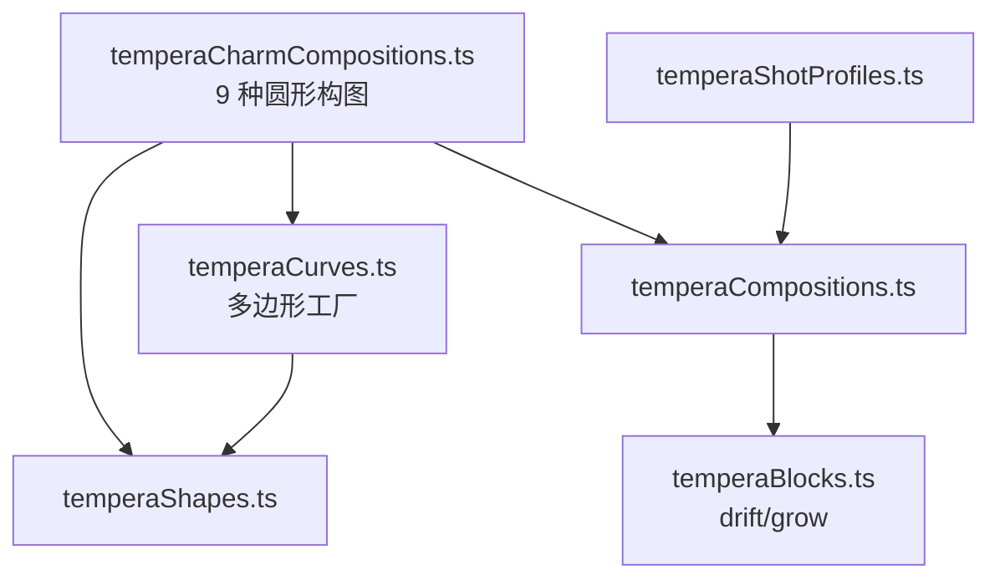
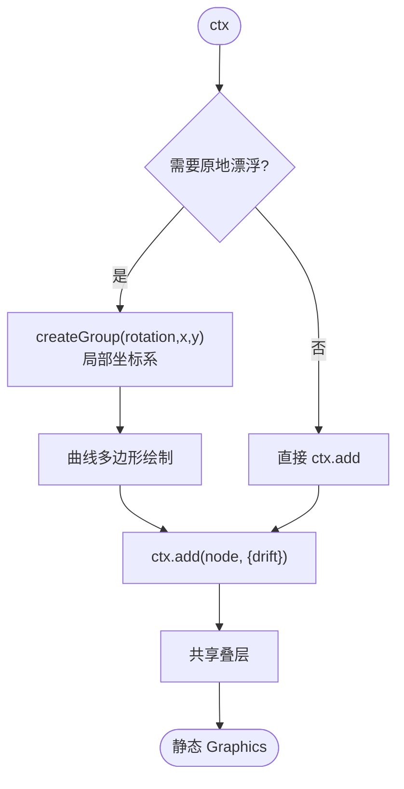
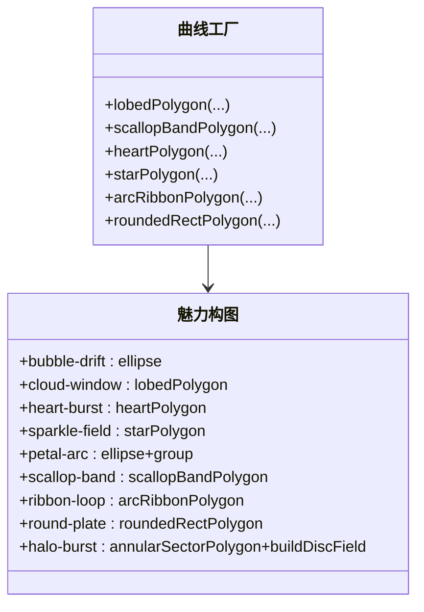
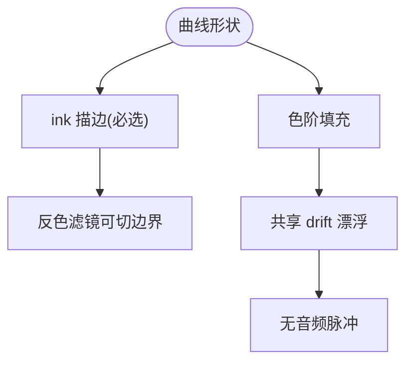
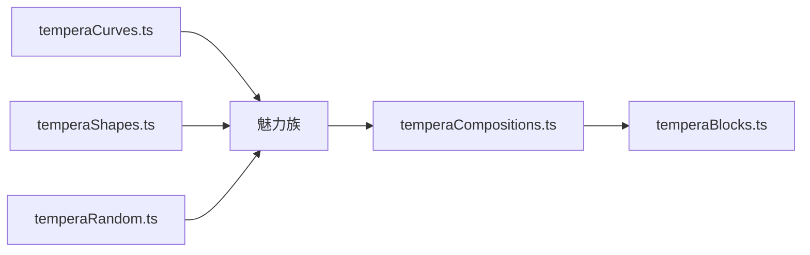

# 魅力构图模式

<cite>
**本文引用的文件**   
- [temperaCharmCompositions.ts](file://src/components/visualizer/tempera/compositions/temperaCharmCompositions.ts)
- [temperaCurves.ts](file://src/components/visualizer/tempera/temperaCurves.ts)
- [temperaShapes.ts](file://src/components/visualizer/tempera/temperaShapes.ts)
- [temperaCompositions.ts](file://src/components/visualizer/tempera/temperaCompositions.ts)
- [temperaShotProfiles.ts](file://src/components/visualizer/tempera/temperaShotProfiles.ts)
- [temperaBlocks.ts](file://src/components/visualizer/tempera/temperaBlocks.ts)
</cite>

## 目录
1. [引言](#引言)
2. [项目结构](#项目结构)
3. [核心组件](#核心组件)
4. [架构总览](#架构总览)
5. [详细组件分析](#详细组件分析)
6. [依赖关系分析](#依赖关系分析)
7. [性能考量](#性能考量)
8. [故障排查指南](#故障排查指南)
9. [结论](#结论)

## 引言
魅力构图模式（Charm 族）是 Tempera 的“圆形家族”，取自视觉小说宣传 PV 的动效设计语言：气泡、花边、爱心、闪光与贴纸板。与其他用直边切割画面的家族不同，魅力族把曲线形状“放在”平坦的场地上，让文字读起来像印在贴纸上，而不是骑在面板接缝上。本文围绕以下目标展开：
- 解释九种圆形构图的形态与设计意图。
- 说明曲线几何的来源：`temperaCurves.ts` 的多边形工厂与凸形网线规则。
- 阐述该家族的两条硬规则：墨线描边必须保留、不得有音频脉冲（漂浮统一使用确定性 drift）。
- 提供配置参数与扩展方法。

## 项目结构
- temperaCharmCompositions.ts：九种圆形构图，注册到 `TEMPERA_CHARM_COMPOSITIONS`。
- temperaCurves.ts：曲线多边形工厂（`lobedPolygon`、`scallopBandPolygon`、`heartPolygon`、`starPolygon`、`arcRibbonPolygon`、`roundedRectPolygon` 等）与 `buildDiscField`。
- temperaShapes.ts：绘制工具（含 `drawDiscs` 等圆形族专用绘制）。
- temperaCompositions.ts：注册与共享叠层。
- temperaShotProfiles.ts：排版区域与相机档案。

**图示来源**
- [temperaCharmCompositions.ts:1-24](file://src/components/visualizer/tempera/compositions/temperaCharmCompositions.ts#L1-L24)
- [temperaCurves.ts:23-281](file://src/components/visualizer/tempera/temperaCurves.ts#L23-L281)

**章节来源**
- [temperaCharmCompositions.ts:14-24](file://src/components/visualizer/tempera/compositions/temperaCharmCompositions.ts#L14-L24)

## 核心组件
九个圆形构图（kind → 形态）：
- `bubble-drift`：大小分层的上升气泡群（大层级承载文字色调，小层级飘过其上），两个主气泡带高光点。
- `cloud-window`：裂瓣奖章形云朵窗（宣传 PV 中放一行旁白的云框），附两个“掉落的气泡”作尾。
- `heart-burst`：三种尺寸的爱心列队出画，最大的心承载文字；带偏移的第二印次爱心（mis-register 效果）。
- `sparkle-field`：两档四角星（kirakira）散落在近乎空旷的场地上；收腰造型让星读作“闪光”而非“十字”。
- `petal-arc`：从画外轮毂甩出的花瓣扇 + 花结本体；另一侧有已落瓣。
- `scallop-band`：两条花边带从两侧合拢，歌词坐在中间的亮缝里；珠点钉在相邻凸起的交界处。
- `ribbon-loop`：一条横跨画面的缎带 + 打结蝴蝶结（结刻意落在文字区下方，供反色滤镜切出双色词）。
- `round-plate`：贴纸板——圆角面板、双线框、四颗图钉，是全家族最安静的一张卡。
- `halo-burst`：偏心轮毂的宽径向楔形光环，上叠圆盘与圆环；只画隔一个的楔形以保持柔和。

**章节来源**
- [temperaCharmCompositions.ts:24-460](file://src/components/visualizer/tempera/compositions/temperaCharmCompositions.ts#L24-L460)

## 架构总览
魅力族的绘制协议：先在需要处放置“定位组”（`createGroup(rotation, x, y)`），在组的局部坐标系内绘制形状，再通过 `ctx.add` 的 `drift` 让节点围绕自身原点缓慢缩放/旋转。这样即使是偏心的形状（花瓣、缎带结）也能“原地漂浮”而不是绕画面原点公转——这是实现确定性的关键细节。

**图示来源**
- [temperaCharmCompositions.ts:14-24](file://src/components/visualizer/tempera/compositions/temperaCharmCompositions.ts#L14-L24)
- [temperaCompositionContext.ts:48-49](file://src/components/visualizer/tempera/temperaCompositionContext.ts#L48-L49)

**章节来源**
- [temperaCompositionContext.ts:12-23](file://src/components/visualizer/tempera/temperaCompositionContext.ts#L12-L23)

## 详细组件分析

### 曲线几何工厂
魅力族的全部形状来自 `temperaCurves.ts` 的工厂函数：
- `lobedPolygon`：裂瓣多边形（云朵窗）。
- `scallopBandPolygon`：花边带（扇贝边）。
- `heartPolygon`：爱心。
- `starPolygon`：四角星（收腰）。
- `arcRibbonPolygon`：弧形缎带。
- `roundedRectPolygon`：圆角矩形（贴纸板）。
- `annularSectorPolygon`：环带扇区（光环楔形）。
- `buildDiscField`：圆盘工场（光环的圆盘与圆环；圆环由它生成，使其绕环心枢轴而非画面原点呼吸）。

**图示来源**
- [temperaCurves.ts:83-138](file://src/components/visualizer/tempera/temperaCurves.ts#L83-L138)
- [temperaCurves.ts:181-280](file://src/components/visualizer/tempera/temperaCurves.ts#L181-L280)

**章节来源**
- [temperaCurves.ts:1-15](file://src/components/visualizer/tempera/temperaCurves.ts#L1-L15)

### 两条硬规则
家族注释明确了两条贯穿规则：
1. 墨线描边必须保留：没有描边的柔形会溶进场地，也会让反色滤镜失去可切的边界。因此每个形状都配有 ink 描边层。
2. 不得有音频脉冲：全家族没有随音频驱动的缩放，唯一的“呼吸”来自共享的确定性 `drift` 块。这样魅力族的节奏完全由镜头时序控制，不受音乐动态影响。

**图示来源**
- [temperaCharmCompositions.ts:14-24](file://src/components/visualizer/tempera/compositions/temperaCharmCompositions.ts#L14-L24)

**章节来源**
- [temperaCharmCompositions.ts:14-24](file://src/components/visualizer/tempera/compositions/temperaCharmCompositions.ts#L14-L24)

### 局部坐标与漂浮细节
- 花瓣：每片花瓣先在轮毂位置构建，再整体绕轮毂旋转，保证无论种子选中哪个角，扇形都保持扇形；落瓣单独绘制在另一侧。
- 高光：两个主气泡附高光圆点，没有高光的圆盘会读作平面圆点而非气泡。
- 珠点：`scallop-band` 的珠子按凸起间距（而非均匀分数）钉在交界处，读作“缝在花边上”。
- 缎带结与反色：蝴蝶结刻意落在文字区下方，让歌词跨过它时触发反色双色效果。
- 圆角矩形：因为圆角矩形是凸形，网线剪裁器可直接填充；裂瓣等凹形则不参与网线。

**章节来源**
- [temperaCharmCompositions.ts:24-460](file://src/components/visualizer/tempera/compositions/temperaCharmCompositions.ts#L24-L460)

### 配置与扩展
扩展魅力族的步骤与其他族一致：新增绘制函数 → 注册到 `TEMPERA_CHARM_COMPOSITIONS` → 在 `types.ts` 与 `temperaShotProfiles.ts` 补 kind 与区域。新增曲线形状时优先扩充 `temperaCurves.ts` 的工厂函数，保持“形状来自统一工厂”的约定。

**章节来源**
- [temperaCompositions.ts:51-54](file://src/components/visualizer/tempera/temperaCompositions.ts#L51-L54)

## 依赖关系分析
- 魅力族依赖 temperaCurves（形状）、temperaShapes（绘制）、temperaRandom（分布取舍）。
- `drift` 的语义依赖节点原点：使用 `createGroup` 定位的形状才能原地漂浮。
- 与共享叠层的关系与其他族一致，由总入口统一追加。

**图示来源**
- [temperaCharmCompositions.ts:1-12](file://src/components/visualizer/tempera/compositions/temperaCharmCompositions.ts#L1-L12)

**章节来源**
- [temperaCompositions.ts:117-123](file://src/components/visualizer/tempera/temperaCompositions.ts#L117-L123)

## 性能考量
- 形状均为一次性多边形，点数由工厂参数控制（星形收腰、爱心贝塞尔采样），无高频细分。
- 光环的圆环由 `buildDiscField` 生成（不透明度环），避免为圆环单独构建描边多边形。
- 漂浮由块系统的统一变换驱动，不引入逐帧几何重建。
- 尺寸分布由哈希在构建期决定，运行期零成本。

**章节来源**
- [temperaCurves.ts:204-280](file://src/components/visualizer/tempera/temperaCurves.ts#L204-L280)

## 故障排查指南
- 形状围绕画面原点公转而不是原地漂浮：该形状没有放在 `createGroup` 的局部坐标系中；`drift` 按节点原点缩放/旋转。
- 柔形“消失”在场地里：该形状缺少墨线描边；魅力族的硬规则不允许无描边的柔形。
- 反色滤镜没有生效：文字没有跨过任何实色边界；检查文字区域与缎带结/面板的相对位置。
- 花瓣扇方向怪异：花瓣必须先贴合轮毂构建再整体旋转，直接按绝对角度绘制会在某些种子下散开。
- 光环显得眩晕：光环只应画隔一个的楔形；检查楔形枚举步长。

**章节来源**
- [temperaCharmCompositions.ts:14-24](file://src/components/visualizer/tempera/compositions/temperaCharmCompositions.ts#L14-L24)
- [temperaCompositionContext.ts:12-23](file://src/components/visualizer/tempera/temperaCompositionContext.ts#L12-L23)

## 结论
魅力构图模式为 Tempera 提供了唯一的“柔和语言”：气泡、花边、爱心与贴纸板把宣传 PV 的甜美气质引入纸张世界。统一曲线工厂、局部坐标漂浮与两条硬规则（墨线、无脉冲）让这个家族在保持甜美观感的同时，依然融入 Tempera 的确定性体系与反色滤镜机制，是构图系统中最具亲和力的部分。
