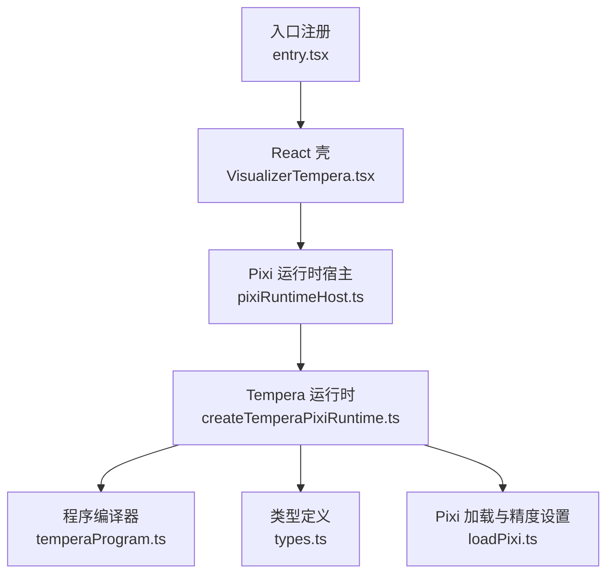
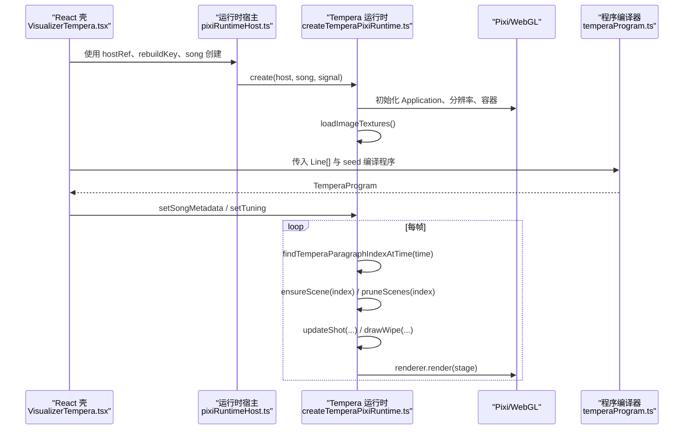
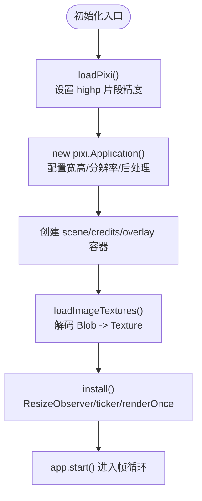
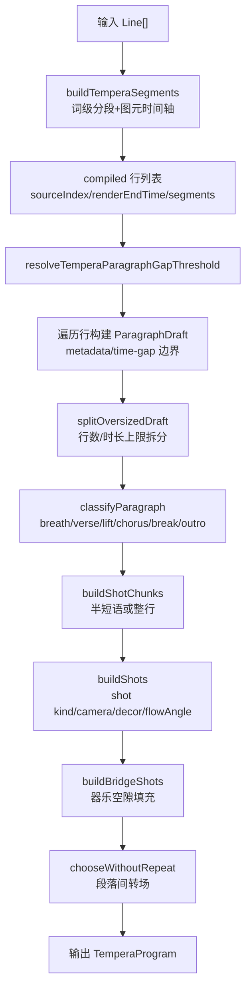
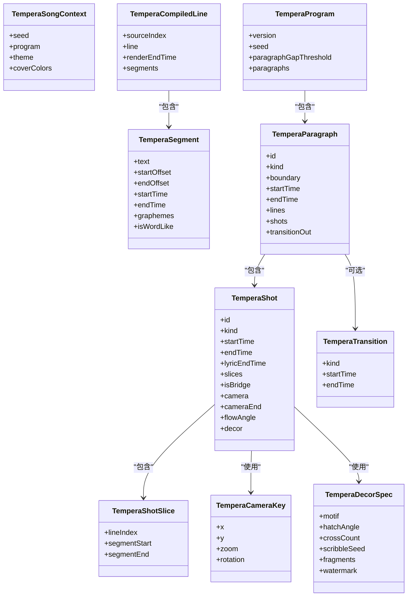
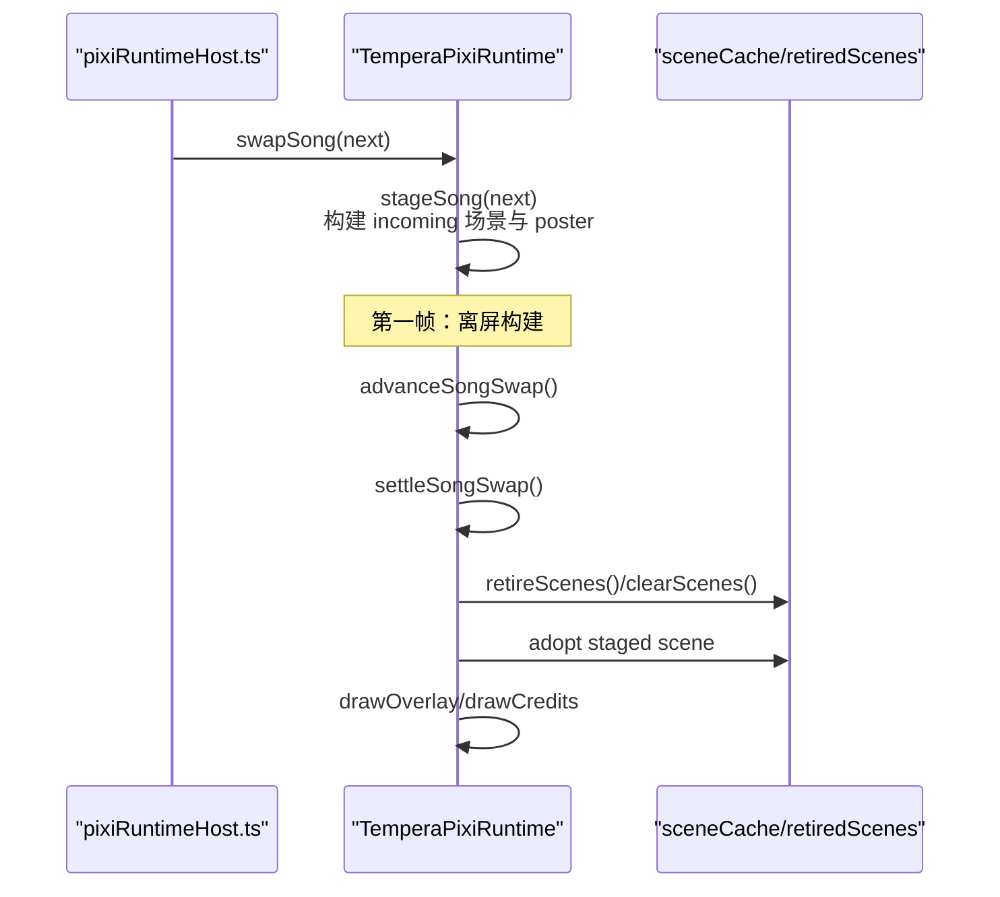
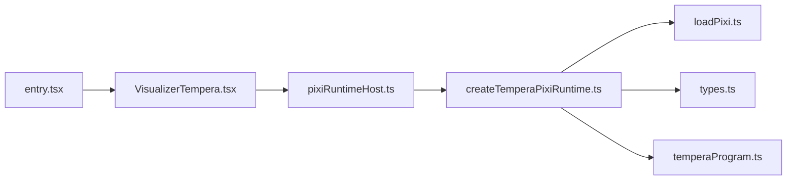

# 核心架构与渲染引擎

<cite>
**本文引用的文件**   
- [createTemperaPixiRuntime.ts](file://src/components/visualizer/tempera/createTemperaPixiRuntime.ts)
- [temperaProgram.ts](file://src/components/visualizer/tempera/temperaProgram.ts)
- [types.ts](file://src/components/visualizer/tempera/types.ts)
- [pixiRuntimeHost.ts](file://src/components/visualizer/pixiRuntimeHost.ts)
- [loadPixi.ts](file://src/components/visualizer/loadPixi.ts)
- [VisualizerTempera.tsx](file://src/components/visualizer/tempera/VisualizerTempera.tsx)
- [entry.tsx](file://src/components/visualizer/tempera/entry.tsx)
- [README.md](file://src/components/visualizer/tempera/README.md)
</cite>

## 目录
1. [引言](#引言)
2. [项目结构](#项目结构)
3. [核心组件](#核心组件)
4. [架构总览](#架构总览)
5. [详细组件分析](#详细组件分析)
6. [依赖关系分析](#依赖关系分析)
7. [性能考量](#性能考量)
8. [故障排查指南](#故障排查指南)
9. [结论](#结论)

## 引言
本文面向 Tempera 模式的核心架构，聚焦以下目标：
- 解释 TemperaPixiRuntime 的初始化流程，包括 WebGL 上下文管理、纹理池分配和着色器精度设置。
- 说明 temperaProgram 的编译过程：歌词文本解析、段落划分、段落内镜头（shot）生成、转场与装饰数据构建。
- 梳理类型系统：TemperaSongContext、TemperaTuning 以及各类几何与图形数据结构。
- 阐述运行时状态管理：歌曲切换机制、资源生命周期管理与内存优化策略。
- 总结性能监控与错误处理机制的实现细节。

## 项目结构
Tempera 模式位于可视化子系统下，采用“入口注册 + React 壳 + Pixi 运行时 + 编译期程序”的分层组织：
- 入口注册：定义可视化模式、默认 tuning、设置面板等。
- React 壳：负责将宿主容器、主题、歌词字体缩放、静态模式等参数注入运行时。
- Pixi 运行时：拥有 Pixi Application、场景树、图片纹理池、帧循环与换歌逻辑。
- 编译期程序：将原始歌词行编译为可寻址、可回放、确定性的段落与镜头时间线。

**图表来源**
- [entry.tsx:1-28](file://src/components/visualizer/tempera/entry.tsx#L1-L28)
- [VisualizerTempera.tsx:181-209](file://src/components/visualizer/tempera/VisualizerTempera.tsx#L181-L209)
- [pixiRuntimeHost.ts:1-144](file://src/components/visualizer/pixiRuntimeHost.ts#L1-L144)
- [createTemperaPixiRuntime.ts:224-266](file://src/components/visualizer/tempera/createTemperaPixiRuntime.ts#L224-L266)
- [temperaProgram.ts:515-632](file://src/components/visualizer/tempera/temperaProgram.ts#L515-L632)
- [types.ts:1-299](file://src/components/visualizer/tempera/types.ts#L1-L299)
- [loadPixi.ts:1-36](file://src/components/visualizer/loadPixi.ts#L1-L36)

**章节来源**
- [entry.tsx:1-28](file://src/components/visualizer/tempera/entry.tsx#L1-L28)
- [README.md:1-20](file://src/components/visualizer/tempera/README.md#L1-L20)

## 核心组件
- TemperaPixiRuntime：管理 Pixi Application、场景缓存、图片纹理池、帧循环、换歌交接、tuning 更新与销毁。
- TemperaProgram 编译器：将 Line[] 编译为 TemperaProgram，包含段落、镜头、转场、装饰等确定性数据。
- VisualizerTempera：React 侧桥接宿主容器、主题、歌词字体缩放、静态模式等，并创建/复用运行时。
- pixiRuntimeHost：通用 Pixi 运行时宿主，保证 WebGL 上下文与纹理池在换歌时不被重建。
- loadPixi：确保在首次编译着色器前提升 fragment shader 精度到 highp，避免 fp16 溢出导致的黑边。

**章节来源**
- [createTemperaPixiRuntime.ts:173-266](file://src/components/visualizer/tempera/createTemperaPixiRuntime.ts#L173-L266)
- [temperaProgram.ts:515-632](file://src/components/visualizer/tempera/temperaProgram.ts#L515-L632)
- [VisualizerTempera.tsx:181-209](file://src/components/visualizer/tempera/VisualizerTempera.tsx#L181-L209)
- [pixiRuntimeHost.ts:1-144](file://src/components/visualizer/pixiRuntimeHost.ts#L1-L144)
- [loadPixi.ts:1-36](file://src/components/visualizer/loadPixi.ts#L1-L36)

## 架构总览
Tempera 的运行链路如下：
- React 通过 useVisualizerPixiHost 创建一次 Pixi 运行时，并在换歌时调用 swapSong 进行无重建切换。
- TemperaPixiRuntime.create 中加载 Pixi、初始化 Application、计算渲染分辨率、挂载场景容器、加载用户图片纹理、安装帧循环。
- 每帧根据当前时间查找段落索引，按需构建或预取相邻段落场景，更新镜头运动、转场与片尾字幕。
- 编译期由 compileTemperaProgram 生成段落与镜头时间线，运行时仅消费该时间线与视图数据。

**图表来源**
- [VisualizerTempera.tsx:181-209](file://src/components/visualizer/tempera/VisualizerTempera.tsx#L181-L209)
- [pixiRuntimeHost.ts:66-143](file://src/components/visualizer/pixiRuntimeHost.ts#L66-L143)
- [createTemperaPixiRuntime.ts:224-266](file://src/components/visualizer/tempera/createTemperaPixiRuntime.ts#L224-L266)
- [temperaProgram.ts:515-632](file://src/components/visualizer/tempera/temperaProgram.ts#L515-L632)

## 详细组件分析

### TemperaPixiRuntime 初始化与 WebGL 上下文管理
- 初始化步骤：
  - 通过 loadPixi 动态导入 Pixi，并将 GlProgram.defaultOptions.preferredFragmentPrecision 设置为 highp，避免 NVIDIA Linux ANGLE 环境下 mediump 为真实 fp16 导致的噪声滤镜溢出黑边。
  - 创建 pixi.Application，按宿主尺寸与 textureResolution 计算渲染分辨率，启用抗锯齿、自动密度、禁用共享 ticker、优先高性能 GPU、开启 back buffer 以支持 difference filter。
  - 创建 sceneContainer、creditsContainer、overlayContainer，并按段落顺序排序 children。
  - 加载用户放置的图片纹理，建立 imageTextures 映射，供所有段落场景共享。
  - 安装 ResizeObserver、ticker，并立即渲染一帧；若未暂停则启动 app.start。
- WebGL 上下文与纹理池：
  - 纹理池由 runtime.imageTextures 持有，跨段落场景共享，避免重复解码与 GPU 抖动。
  - 渲染分辨率通过 snapResolutionToTexturePool 对齐到纹理池边界，减少固定分辨率滤镜的重分配。
  - destroy 时显式释放 ImageBitmap、Texture、Graphics Context 与过滤器，防止 GPU 缓冲泄漏。

**图表来源**
- [loadPixi.ts:1-36](file://src/components/visualizer/loadPixi.ts#L1-L36)
- [createTemperaPixiRuntime.ts:224-266](file://src/components/visualizer/tempera/createTemperaPixiRuntime.ts#L224-L266)
- [createTemperaPixiRuntime.ts:429-444](file://src/components/visualizer/tempera/createTemperaPixiRuntime.ts#L429-L444)

**章节来源**
- [loadPixi.ts:1-36](file://src/components/visualizer/loadPixi.ts#L1-L36)
- [createTemperaPixiRuntime.ts:224-266](file://src/components/visualizer/tempera/createTemperaPixiRuntime.ts#L224-L266)
- [createTemperaPixiRuntime.ts:429-444](file://src/components/visualizer/tempera/createTemperaPixiRuntime.ts#L429-L444)
- [createTemperaPixiRuntime.ts:1046-1070](file://src/components/visualizer/tempera/createTemperaPixiRuntime.ts#L1046-L1070)

### temperaProgram 编译过程：歌词解析、段落布局与渲染指令
- 歌词分段与图元时间轴：
  - buildTemperaSegments 将 Line.fullText 切分为词级 segment，并与 graphemeTiming 对齐，标点粘附合并，保证块不会悬空符号。
- 段落划分：
  - resolveTemperaParagraphGapThreshold 基于相邻行的 renderEndTime 与 startTime 的中位数自适应阈值。
  - metadataChanged 检测 blockIndex/songPart 变化触发段落边界；时间间隙超过阈值也触发。
  - splitOversizedDraft 将过长草稿拆分为多个段落，限制最大行数与时长。
- 段落分类与镜头生成：
  - classifyParagraph 根据副歌标记、间奏标记、结尾、时长与标点密度分类为 breath/verse/lift/chorus/break/outro。
  - buildShotChunks 将段落内的 segments 切分为镜头块，默认半短语大小，wholeLineLyrics 模式下整行一个镜头。
  - buildShots 为每个镜头选择 shot kind、flowAngle、camera keyframes、decor spec，并拼接 bridge shots 填充段落间器乐空隙。
- 转场与预滚动：
  - chooseWithoutRepeat 从 TEMPERA_TRANSITION_KINDS 中选择转场，避免相邻段落重复。
  - 对非 block-wipe 的转场，提前预滚动下一段落的第一个镜头，避免过渡滑出到空白背景。

**图表来源**
- [temperaProgram.ts:61-113](file://src/components/visualizer/tempera/temperaProgram.ts#L61-L113)
- [temperaProgram.ts:45-50](file://src/components/visualizer/tempera/temperaProgram.ts#L45-L50)
- [temperaProgram.ts:120-144](file://src/components/visualizer/tempera/temperaProgram.ts#L120-L144)
- [temperaProgram.ts:146-156](file://src/components/visualizer/tempera/temperaProgram.ts#L146-L156)
- [temperaProgram.ts:181-243](file://src/components/visualizer/tempera/temperaProgram.ts#L181-L243)
- [temperaProgram.ts:358-447](file://src/components/visualizer/tempera/temperaProgram.ts#L358-L447)
- [temperaProgram.ts:458-513](file://src/components/visualizer/tempera/temperaProgram.ts#L458-L513)
- [temperaProgram.ts:515-632](file://src/components/visualizer/tempera/temperaProgram.ts#L515-L632)

**章节来源**
- [temperaProgram.ts:61-113](file://src/components/visualizer/tempera/temperaProgram.ts#L61-L113)
- [temperaProgram.ts:45-50](file://src/components/visualizer/tempera/temperaProgram.ts#L45-L50)
- [temperaProgram.ts:120-144](file://src/components/visualizer/tempera/temperaProgram.ts#L120-L144)
- [temperaProgram.ts:146-156](file://src/components/visualizer/tempera/temperaProgram.ts#L146-L156)
- [temperaProgram.ts:181-243](file://src/components/visualizer/tempera/temperaProgram.ts#L181-L243)
- [temperaProgram.ts:358-447](file://src/components/visualizer/tempera/temperaProgram.ts#L358-L447)
- [temperaProgram.ts:458-513](file://src/components/visualizer/tempera/temperaProgram.ts#L458-L513)
- [temperaProgram.ts:515-632](file://src/components/visualizer/tempera/temperaProgram.ts#L515-L632)

### 类型系统设计：TemperaSongContext、TemperaTuning 与几何数据结构
- TemperaSongContext：封装一首歌的运行时上下文，包括 seed、program、theme、coverColors。seed 变化才视为真正换歌，其余字段变化应静默替换。
- TemperaTuning：运行时可调参数集合，影响颜色模式、纹理分辨率、入场节奏、区块/装饰显示、文字反色、转场开关、后处理强度与压缩、图层图像深度/频率/位置等。requiresSceneRebuild 决定是否需要重建场景。
- 几何与图形数据结构：
  - TemperaSegment/TemperaCompiledLine：词级分段与编译后的行。
  - TemperaCameraKey：相机关键帧（平移、缩放、旋转）。
  - TemperaDecorSpec/Motif/Fragment/Watermark：网点装饰规格、随机碎片与大字水印。
  - TemperaShotSlice/Shot：镜头切片与完整镜头，含时间、流角度、相机关键帧、装饰。
  - TemperaTransition/Paragraph/Program：段落转场、段落与节目结构。

**图表来源**
- [types.ts:164-299](file://src/components/visualizer/tempera/types.ts#L164-L299)
- [createTemperaPixiRuntime.ts:50-90](file://src/components/visualizer/tempera/createTemperaPixiRuntime.ts#L50-L90)

**章节来源**
- [types.ts:1-299](file://src/components/visualizer/tempera/types.ts#L1-L299)
- [createTemperaPixiRuntime.ts:50-90](file://src/components/visualizer/tempera/createTemperaPixiRuntime.ts#L50-L90)

### 运行时状态管理：歌曲切换、资源生命周期与内存优化
- 歌曲切换机制：
  - pixiRuntimeHost 维护 runtimeRef、appliedSongRef、signalRef，drainSong 循环向最新 song 推进，避免频繁重建 WebGL。
  - TemperaPixiRuntime.swapSong 实现两帧交接：第一帧离屏构建 incoming 场景与片尾海报，第二帧直接 commit，不产生卡顿。
  - advanceSongSwap 控制 prepared 与 settle，abort 信号可立即结束交接。
- 资源生命周期：
  - sceneCache 缓存当前及相邻段落场景；retiredScenes 延迟销毁，逐帧释放，避免换歌帧抖动。
  - destroyScene 逐节点销毁 Graphics 与 filters，避免 GPU 缓冲泄漏。
  - imageTextures 在 destroy 时显式关闭 ImageBitmap 与 Texture。
- 内存优化策略：
  - requiresSceneRebuild 精确判断哪些 tuning 字段需要重建场景，其他字段就地更新 sprite 属性。
  - 渲染分辨率按 viewport 与 textureResolution 对齐到纹理池，避免固定分辨率滤镜重分配。
  - 图片 blob 解码失败时跳过，不阻塞整体加载；对象 URL 及时释放。

**图表来源**
- [pixiRuntimeHost.ts:66-143](file://src/components/visualizer/pixiRuntimeHost.ts#L66-L143)
- [createTemperaPixiRuntime.ts:863-985](file://src/components/visualizer/tempera/createTemperaPixiRuntime.ts#L863-L985)
- [createTemperaPixiRuntime.ts:455-495](file://src/components/visualizer/tempera/createTemperaPixiRuntime.ts#L455-L495)

**章节来源**
- [pixiRuntimeHost.ts:66-143](file://src/components/visualizer/pixiRuntimeHost.ts#L66-L143)
- [createTemperaPixiRuntime.ts:863-985](file://src/components/visualizer/tempera/createTemperaPixiRuntime.ts#L863-L985)
- [createTemperaPixiRuntime.ts:455-495](file://src/components/visualizer/tempera/createTemperaPixiRuntime.ts#L455-L495)
- [createTemperaPixiRuntime.ts:993-1033](file://src/components/visualizer/tempera/createTemperaPixiRuntime.ts#L993-L1033)

## 依赖关系分析
- React 壳依赖 entry.tsx 注册的可视化模式，并通过 useVisualizerPixiHost 管理运行时生命周期。
- 运行时依赖 loadPixi 确保着色器精度，依赖 types.ts 提供数据结构，依赖 temperaProgram.ts 提供编译结果。
- 运行时内部依赖 pixiDisplayResources、pixiTextureBudget、temperaSceneBuilder、temperaMotion、temperaPalette 等模块完成场景构建与动画求解。

**图表来源**
- [entry.tsx:1-28](file://src/components/visualizer/tempera/entry.tsx#L1-L28)
- [VisualizerTempera.tsx:181-209](file://src/components/visualizer/tempera/VisualizerTempera.tsx#L181-L209)
- [pixiRuntimeHost.ts:1-144](file://src/components/visualizer/pixiRuntimeHost.ts#L1-L144)
- [createTemperaPixiRuntime.ts:224-266](file://src/components/visualizer/tempera/createTemperaPixiRuntime.ts#L224-L266)
- [temperaProgram.ts:515-632](file://src/components/visualizer/tempera/temperaProgram.ts#L515-L632)
- [types.ts:1-299](file://src/components/visualizer/tempera/types.ts#L1-L299)
- [loadPixi.ts:1-36](file://src/components/visualizer/loadPixi.ts#L1-L36)

**章节来源**
- [entry.tsx:1-28](file://src/components/visualizer/tempera/entry.tsx#L1-L28)
- [VisualizerTempera.tsx:181-209](file://src/components/visualizer/tempera/VisualizerTempera.tsx#L181-L209)
- [pixiRuntimeHost.ts:1-144](file://src/components/visualizer/pixiRuntimeHost.ts#L1-L144)
- [createTemperaPixiRuntime.ts:224-266](file://src/components/visualizer/tempera/createTemperaPixiRuntime.ts#L224-L266)
- [temperaProgram.ts:515-632](file://src/components/visualizer/tempera/temperaProgram.ts#L515-L632)
- [types.ts:1-299](file://src/components/visualizer/tempera/types.ts#L1-L299)
- [loadPixi.ts:1-36](file://src/components/visualizer/loadPixi.ts#L1-L36)

## 性能考量
- 着色器精度：loadPixi 将 preferredFragmentPrecision 设为 highp，避免 NVIDIA Linux ANGLE 上 mediump fp16 导致噪声滤镜溢出黑边。
- 纹理池与分辨率：snapResolutionToTexturePool 对齐渲染分辨率，减少固定分辨率滤镜重分配；imageTextures 跨场景共享。
- 场景缓存与延迟销毁：sceneCache 仅缓存当前与相邻段落；retiredScenes 逐帧释放，避免换歌帧抖动。
- 调优路径：requiresSceneRebuild 区分内容型与动画型 tuning 变化，后者就地更新 sprite 属性，避免重建。
- 帧循环优先级：每帧先释放 retired scenes，再预取邻居段落，避免边界卡顿。

[本节为通用性能指导，不直接分析具体文件]

## 故障排查指南
- 初始化失败：
  - pixiRuntimeHost 捕获 create 异常并记录日志，同时通知 onFailedChange 以便回退到文本提示。
  - 若 AbortError，忽略错误并中止后续 drain。
- 换歌失败：
  - swapSong 在异常时保留上一首歌画面，避免帧空洞；console.error 记录 handover failed。
- 图片解码失败：
  - decodeImageBlob 捕获 createImageBitmap 失败，回退到 Image 元素；失败时跳过该 placement，不影响整体加载。
- 资源泄漏：
  - destroy 显式释放 ImageBitmap、Texture、Graphics Context 与 filters；destroyScene 逐节点销毁，避免 GPU 缓冲残留。

**章节来源**
- [pixiRuntimeHost.ts:87-95](file://src/components/visualizer/pixiRuntimeHost.ts#L87-L95)
- [pixiRuntimeHost.ts:120-124](file://src/components/visualizer/pixiRuntimeHost.ts#L120-L124)
- [createTemperaPixiRuntime.ts:429-444](file://src/components/visualizer/tempera/createTemperaPixiRuntime.ts#L429-L444)
- [createTemperaPixiRuntime.ts:1046-1070](file://src/components/visualizer/tempera/createTemperaPixiRuntime.ts#L1046-L1070)

## 结论
Tempera 模式通过 React 壳、Pixi 运行时与编译期程序的清晰分层，实现了高确定性的歌词 PV 渲染。其核心优势在于：
- 初始化阶段严格管理 WebGL 上下文与着色器精度，避免平台差异导致的视觉缺陷。
- 编译期将歌词解析、段落划分、镜头生成与装饰数据全部确定性化，运行时仅消费时间线与视图数据。
- 运行时状态管理通过两帧换歌、场景缓存与延迟销毁，显著降低换歌与调参的卡顿与内存压力。
- 类型系统明确区分运行时上下文、几何结构与装饰规格，便于扩展与维护。

未来可在以下方面继续优化：
- 进一步细化 requiresSceneRebuild 的判断条件，减少不必要的场景重建。
- 引入更细粒度的性能探针，监控每帧构建与销毁成本。
- 扩展装饰与镜头种类，保持选择算法的多样性与连续性。