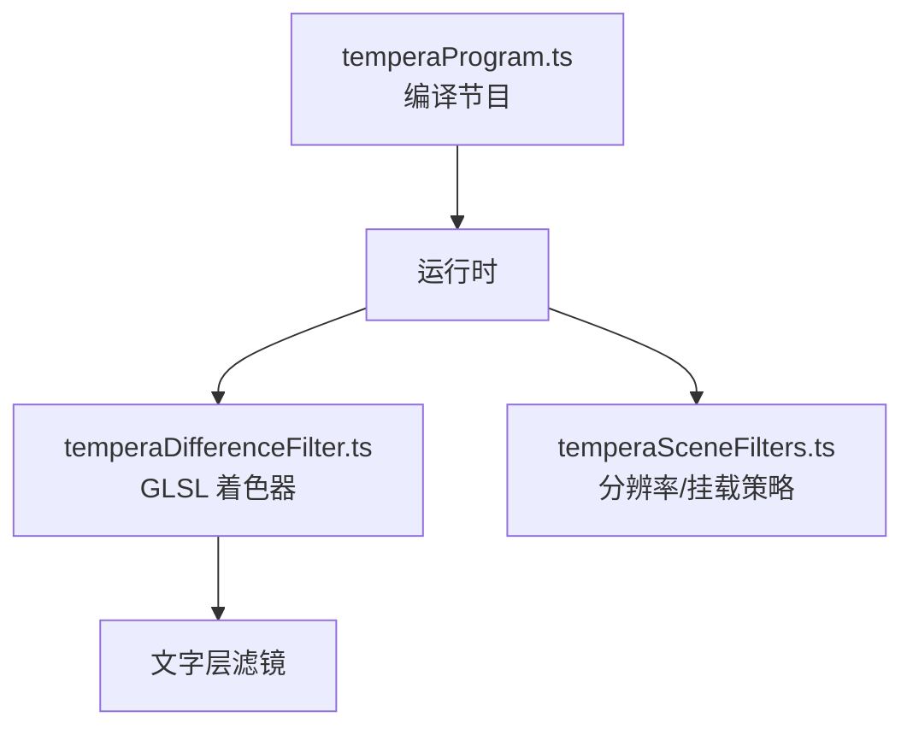
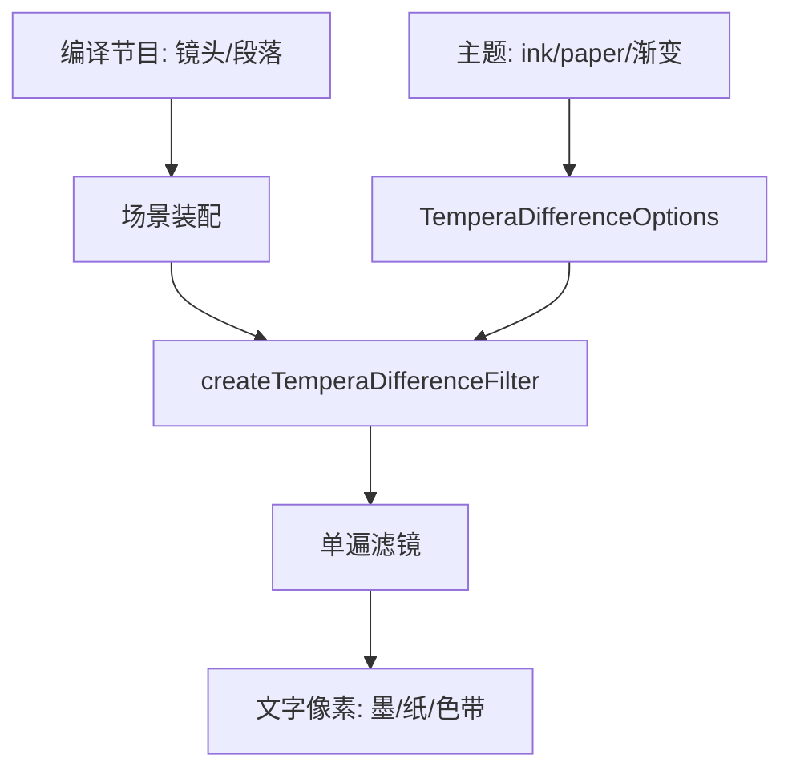
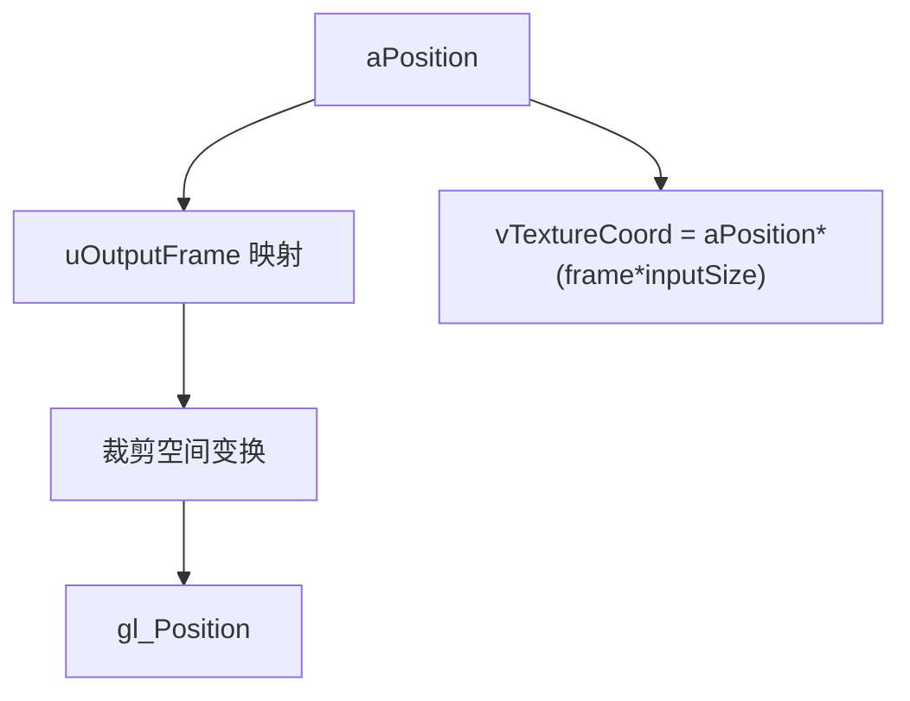
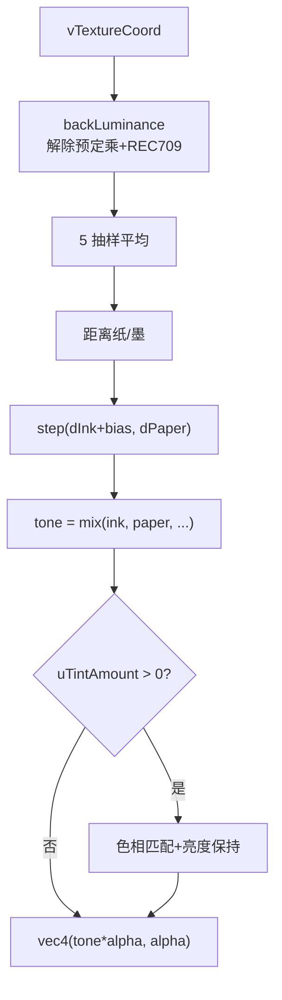
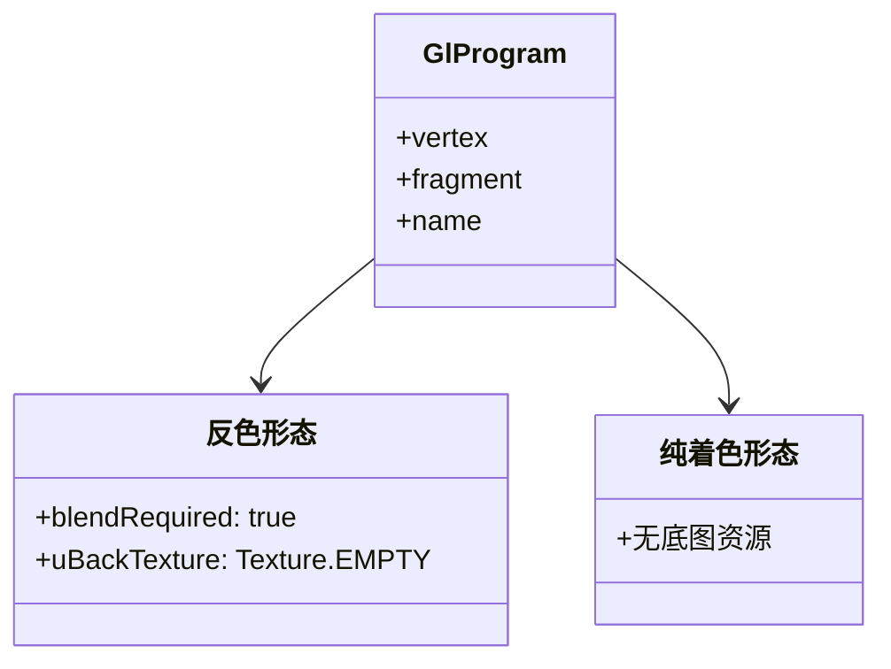
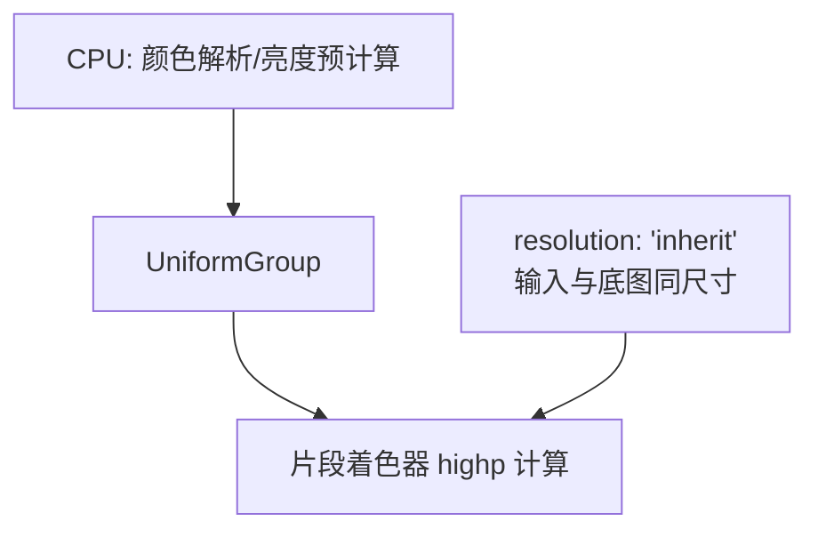
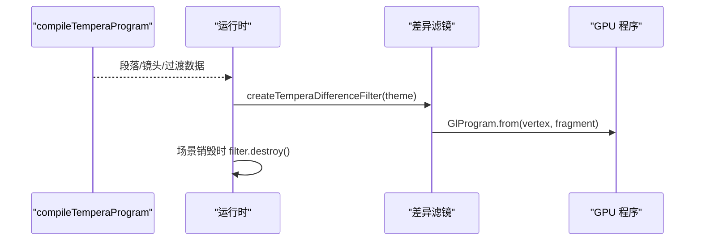
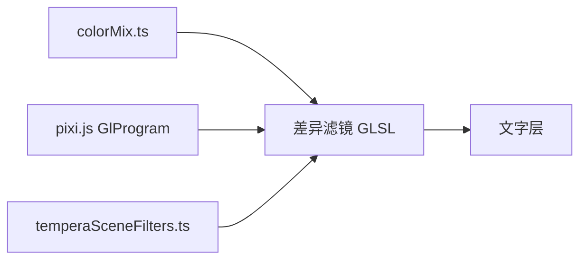

# GLSL着色器实现

<cite>
**本文引用的文件**   
- [temperaDifferenceFilter.ts](file://src/components/visualizer/tempera/temperaDifferenceFilter.ts)
- [temperaProgram.ts](file://src/components/visualizer/tempera/temperaProgram.ts)
- [temperaSceneFilters.ts](file://src/components/visualizer/tempera/temperaSceneFilters.ts)
- [types.ts](file://src/components/visualizer/tempera/types.ts)
- [createTemperaPixiRuntime.ts](file://src/components/visualizer/tempera/createTemperaPixiRuntime.ts)
</cite>

## 目录
1. [引言](#引言)
2. [项目结构](#项目结构)
3. [核心组件](#核心组件)
4. [架构总览](#架构总览)
5. [详细组件分析](#详细组件分析)
6. [依赖关系分析](#依赖关系分析)
7. [性能考量](#性能考量)
8. [故障排查指南](#故障排查指南)
9. [结论](#结论)

## 引言
本文聚焦 Tempera 模式的 GLSL 着色器实现，围绕以下目标展开：
- 解释 Tempera 的着色器版图：整个模式只有一条自定义着色器管线——文字层的差异反色滤镜。
- 说明顶点/片段着色器的实现：坐标变换、纹理采样、预定乘还原与阈值选择。
- 阐述 uniform 管理：`UniformGroup`、Pixi 8 滤镜约定（`uInputSize`/`uOutputFrame`/`uOutputTexture`）。
- 解释着色器编译流程与双形态（反色/纯着色）的片段切换。

## 项目结构
- temperaDifferenceFilter.ts：唯一的 GLSL 着色器源——顶点着色器 + 两套片段着色器（inversion / tint-only）。
- temperaProgram.ts：节目编译器（时间线/镜头/过渡），为着色器提供参数化上下文（主题墨/纸色、渐变带、开关的间接来源）。
- temperaSceneFilters.ts：滤镜的分辨率与挂载策略（着色器正确性的运行时保障）。
- createTemperaPixiRuntime.ts：滤镜的创建、装配与销毁。

**图示来源**
- [temperaDifferenceFilter.ts:15-105](file://src/components/visualizer/tempera/temperaDifferenceFilter.ts#L15-L105)
- [temperaProgram.ts:30-31](file://src/components/visualizer/tempera/temperaProgram.ts#L30-L31)

**章节来源**
- [temperaDifferenceFilter.ts:1-13](file://src/components/visualizer/tempera/temperaDifferenceFilter.ts#L1-L13)

## 核心组件
- 顶点着色器 `vertex`：Pixi 8 滤镜标准模板——输出帧映射到裁剪空间、计算纹理坐标。
- 片段着色器 `inversionFragment`：读取底图（`uBackTexture`）与文字输入（`uTexture`），执行阈值反色与可选色带着色。
- 片段着色器 `tintOnlyFragment`：不读底图的纯着色形态。
- `createTemperaDifferenceFilter`：构建 `GlProgram` 与 `UniformGroup`，声明 `blendRequired` 与 `resolution: 'inherit'`。
- 渐变四站色带：`uTintA-D` + `uTintAmount`，`sampleTint` 在滤镜边界上扫过整行。

**章节来源**
- [temperaDifferenceFilter.ts:130-190](file://src/components/visualizer/tempera/temperaDifferenceFilter.ts#L130-L190)

## 架构总览
Tempera 的着色策略是"极简单遍"：所有构图几何（色块、网线、实体）都是矢量绘制，不进着色器；唯一需要 GPU 逐像素计算的是文字与底图的合成关系。因此整条自定义着色器管线只有一个 pass，挂在文字层上。它由主题与调参提供 uniform，由 `temperaProgram.ts` 编译出的镜头/段落数据间接决定它何时出现在哪些场景里。

**图示来源**
- [temperaDifferenceFilter.ts:130-171](file://src/components/visualizer/tempera/temperaDifferenceFilter.ts#L130-L171)

**章节来源**
- [temperaDifferenceFilter.ts:4-12](file://src/components/visualizer/tempera/temperaDifferenceFilter.ts#L4-L12)

## 详细组件分析

### 顶点着色器与坐标变换
顶点着色器遵循 Pixi 8 滤镜约定：把 `aPosition` 经 `uOutputFrame` 映射到输出帧空间，再按 `uOutputTexture` 翻转裁剪空间；纹理坐标 `vTextureCoord` 由 `aPosition * (uOutputFrame.zw * uInputSize.zw)` 计算。这三个 uniform 由 Pixi 运行时自动填充，着色器不感知画布尺寸。

**图示来源**
- [temperaDifferenceFilter.ts:15-30](file://src/components/visualizer/tempera/temperaDifferenceFilter.ts#L15-L30)

**章节来源**
- [temperaDifferenceFilter.ts:15-30](file://src/components/visualizer/tempera/temperaDifferenceFilter.ts#L15-L30)

### 反色片段：阈值选择算法
核心算法（片段着色器 `inversionFragment`）：
1. `backLuminance`：采样 `uBackTexture`，解除预定乘（`rgb/a`），按 REC709 亮度加权；alpha≈0 处回落到纸色亮度（"没有绘制的地方透出的是外壳背景，也就是纸"）。
2. 5 抽样平均：中心权重 0.4 + 四个对角偏移 0.15，**抑制细网线导致的逐像素翻转闪烁**。
3. 阈值选择：比较到纸/墨的亮度距离，选择更远的一方；`uBias = threshold - 0.5` 提供偏向调节。
4. 色带：`sampleTint` 按 `tintPosition`（以滤镜自身边界归一化）扫过 4 站；着色时**匹配色相但保持反色选出的亮度**（`tint * toneLuminance/tintLuminance`），保证可读性不被色带破坏。
5. 输出预定乘颜色 `vec4(tone * front.a, front.a)`。

**图示来源**
- [temperaDifferenceFilter.ts:65-105](file://src/components/visualizer/tempera/temperaDifferenceFilter.ts#L65-L105)

**章节来源**
- [temperaDifferenceFilter.ts:65-105](file://src/components/visualizer/tempera/temperaDifferenceFilter.ts#L65-L105)

### 纯着色片段与双形态切换
`tintOnlyFragment` 与反色片段共享 `fragmentHead`（uniform 声明与色带采样），差异只有"是否读底图"与"颜色决策"。构建时按 `options.inversion` 选择片段与资源：
- 反色形态：`blendRequired: true`，资源含 `uBackTexture: Texture.EMPTY` 占位（Pixi 会把已绘制像素快照进它）。
- 纯着色形态：不声明 `blendRequired`，资源不含底图占位。
程序名也按形态区分（`tempera-difference-inversion` / `tempera-text-tint`），便于调试器识别。

**图示来源**
- [temperaDifferenceFilter.ts:145-190](file://src/components/visualizer/tempera/temperaDifferenceFilter.ts#L145-L190)

**章节来源**
- [temperaDifferenceFilter.ts:107-116](file://src/components/visualizer/tempera/temperaDifferenceFilter.ts#L107-L116)

### Uniform 管理与数值精度
`UniformGroup` 显式声明类型（`vec3<f32>`、`f32`），颜色以 `Float32Array` 传入归一化 RGB；`uInkLuminance`/`uPaperLuminance`/`uBias` 在 CPU 侧预先计算。着色器内部大量使用 `highp` 精度声明，避免低精度浮点在阈值比较处的抖动。分辨率必须 `'inherit'`：Pixi 默认分辨率 1 会让输入纹理与底图纹理尺寸不一致，`vTextureCoord` 对两张纹理索引方式不同，底图会被从错误位置读取。

**图示来源**
- [temperaDifferenceFilter.ts:155-166](file://src/components/visualizer/tempera/temperaDifferenceFilter.ts#L155-L166)

**章节来源**
- [temperaDifferenceFilter.ts:182-189](file://src/components/visualizer/tempera/temperaDifferenceFilter.ts#L182-L189)

### 着色器编译与生命周期
`TemperaProgram` 编译的是"节目时间线"（段落/镜头/过渡/装饰规格），它不包含 GLSL——着色器的实际编译发生在滤镜构建时（`GlProgram.from`），由运行时在场景装配阶段调用。滤镜对象的生命周期与场景绑定：场景销毁时 `postProcessFilters.forEach(filter => filter.destroy())` 统一释放着色器程序与 GPU 资源。

**图示来源**
- [temperaProgram.ts:515-533](file://src/components/visualizer/tempera/temperaProgram.ts#L515-L533)
- [createTemperaPixiRuntime.ts:485-494](file://src/components/visualizer/tempera/createTemperaPixiRuntime.ts#L485-L494)

**章节来源**
- [createTemperaPixiRuntime.ts:47-47](file://src/components/visualizer/tempera/createTemperaPixiRuntime.ts#L47-L47)

## 依赖关系分析
- 着色器依赖 `parseColorChannels`（颜色的 CPU 侧解析）与 Pixi 8 的 `GlProgram`/`UniformGroup`/`Filter` API。
- 与场景滤镜策略耦合：`resolution` 与 `blendRequired` 的正确性依赖 `temperaSceneFilters.ts` 的挂载纪律。
- 与节目编译解耦：GLSL 不知道时间线，只处理"文字像素 vs 底图像素"的合成。

**图示来源**
- [temperaDifferenceFilter.ts:1-2](file://src/components/visualizer/tempera/temperaDifferenceFilter.ts#L1-L2)

**章节来源**
- [temperaDifferenceFilter.ts:1-13](file://src/components/visualizer/tempera/temperaDifferenceFilter.ts#L1-L13)

## 性能考量
- 单遍、单纹理对（输入 + 底图）：每个文字像素 5 次纹理采样，无多级模糊链。
- 色带是一维插值的 3 次 `mix`，无额外纹理查询。
- 亮度与 bias 在 CPU 预算，着色器内避免除法与分支（除一处 tint 分支）。
- 分辨率 inherit 保证一次光栅化恰好在画布分辨率上，无额外上下采样。

**章节来源**
- [temperaDifferenceFilter.ts:79-102](file://src/components/visualizer/tempera/temperaDifferenceFilter.ts#L79-L102)

## 故障排查指南
- 反色在细网线上闪烁：5 抽样被简化；恢复中心 0.4 + 四角 0.15 的平均。
- 反色读取位置错乱（疑似读了左上角）：底图快照边界异常——检查场景容器是否存在"挂载但禁用"的滤镜；`resolution` 必须为 `'inherit'`。
- 文字比画布模糊：`resolution` 被固定为 1，输入在低分辨率下光栅化后再放大。
- 色带关闭后文字变平墨：`uTintAmount` 未正确置 0 / 色带停靠点被改；停靠点必须保持与纸色亮度差约 88。
- 半透明文字边缘发灰：`backLuminance` 未解除预定乘（缺 `rgb / max(a,1e-4)`）。
- 程序名不可识别：修改了片段的 `name` 字段；保持形态名以便调试器区分。

**章节来源**
- [temperaDifferenceFilter.ts:68-75](file://src/components/visualizer/tempera/temperaDifferenceFilter.ts#L68-L75)
- [temperaDifferenceFilter.ts:174-189](file://src/components/visualizer/tempera/temperaDifferenceFilter.ts#L174-L189)

## 结论
Tempera 的 GLSL 实现体现了"把 GPU 留给唯一需要它的地方"的设计哲学：整个模式只有一条单遍差异反色着色器，却承担了文字与美术的合成、可读性保障与渐变着色的全部职责。顶点模板、双形态片段、UniformGroup 类型化与 `blendRequired`/`inherit` 两个关键约定共同构成了这条管线，而节目编译器与场景滤镜策略分别从"何时使用"与"如何正确挂载"两侧为其护航。
