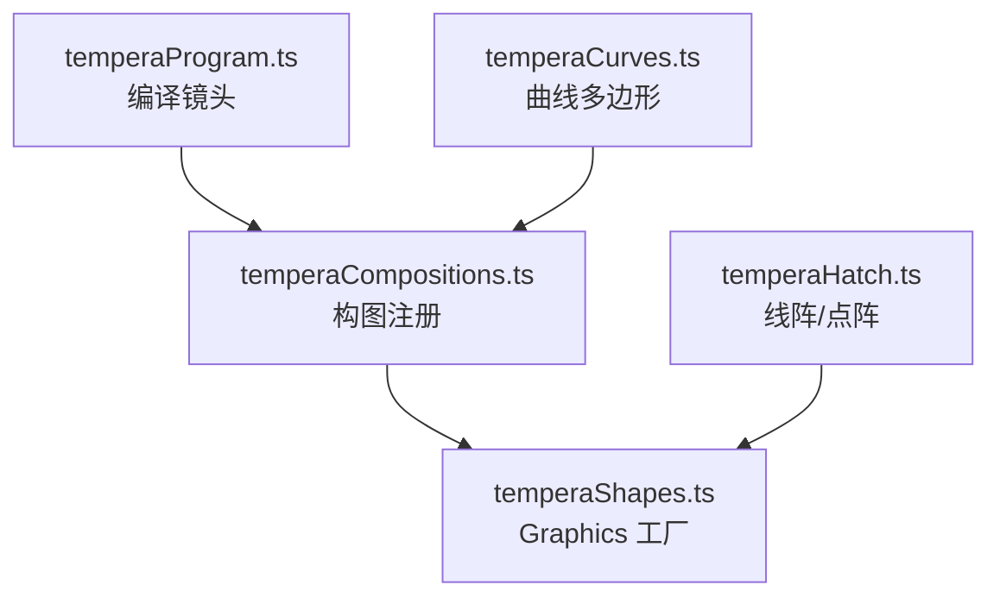
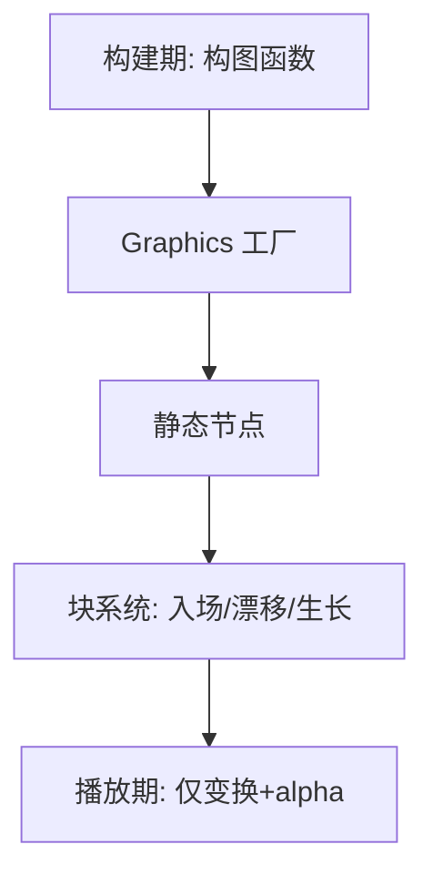
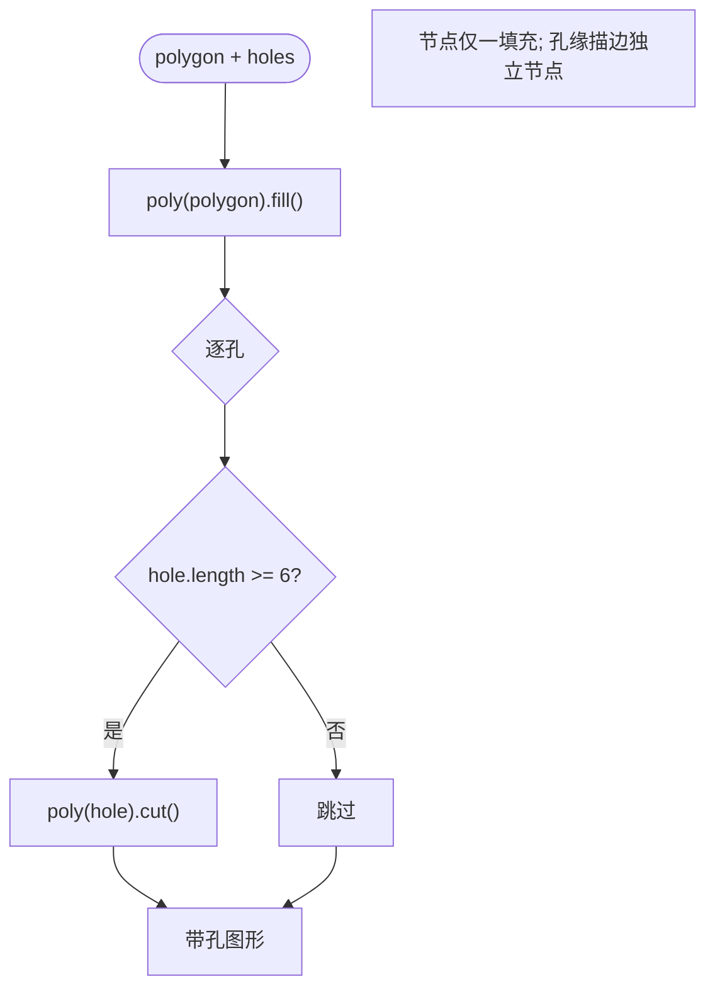
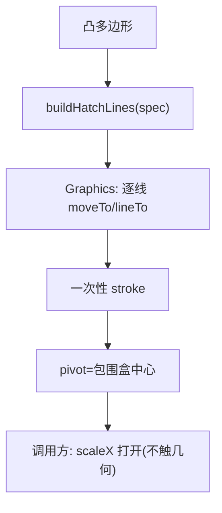
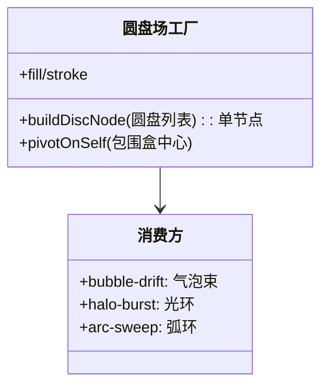
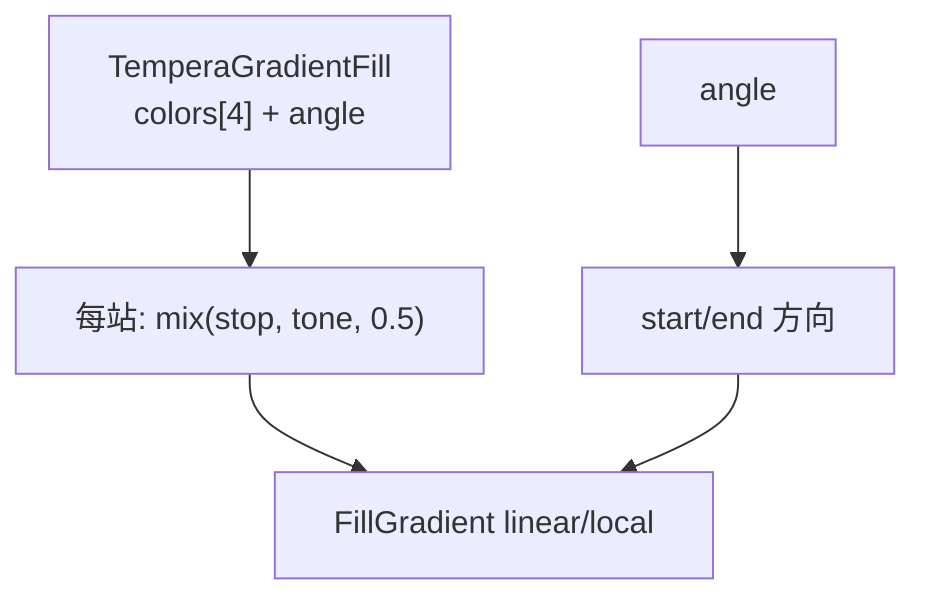
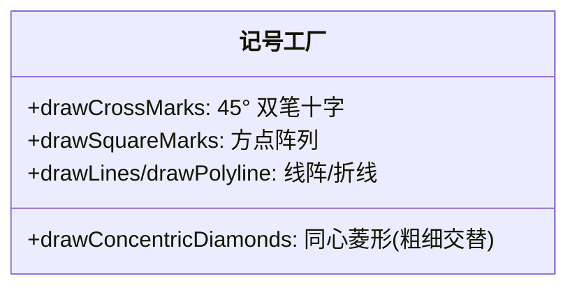
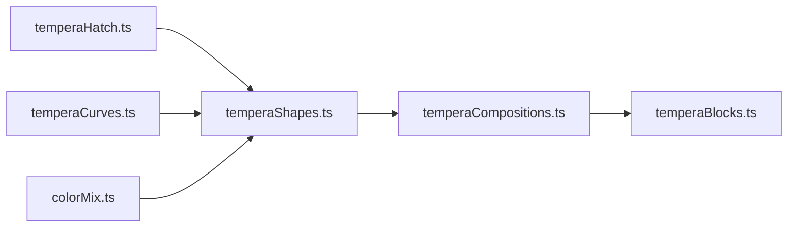

# 几何图形生成系统

<cite>
**本文引用的文件**   
- [temperaShapes.ts](file://src/components/visualizer/tempera/temperaShapes.ts)
- [temperaHatch.ts](file://src/components/visualizer/tempera/temperaHatch.ts)
- [temperaCurves.ts](file://src/components/visualizer/tempera/temperaCurves.ts)
- [temperaProgram.ts](file://src/components/visualizer/tempera/temperaProgram.ts)
- [temperaCompositions.ts](file://src/components/visualizer/tempera/temperaCompositions.ts)
</cite>

## 目录
1. [引言](#引言)
2. [项目结构](#项目结构)
3. [核心组件](#核心组件)
4. [架构总览](#架构总览)
5. [详细组件分析](#详细组件分析)
6. [依赖关系分析](#依赖关系分析)
7. [性能考量](#性能考量)
8. [故障排查指南](#故障排查指南)
9. [结论](#结论)

## 引言
本文聚焦 Tempera 模式的几何图形生成系统，围绕以下目标展开：
- 解释 Pixi Graphics 工厂体系：填充、描边、网线、圆盘、线条、记号。
- 说明基础几何的生成算法：多边形顶点、孔洞裁剪、同心菱形、十字标记。
- 阐述网线填充与渐变填充的实现：凸形约束、枢轴约定与四色坡道。
- 解释几何生成与节目编译的配合：几何在构建期一次生成，播放期只写变换。

## 项目结构
- temperaShapes.ts：Pixi Graphics 工厂——每一种都返回"完成品、静态节点"。
- temperaHatch.ts：网线规格与线阵生成（`buildHatchSpec`、`buildHatchLines`、点阵/记号构建器）。
- temperaCurves.ts：曲线多边形工厂（圆盘、圆角矩形、心形、星形等）。
- temperaProgram.ts：节目编译——决定哪些镜头使用哪些几何（通过 shot kind → 构图函数）。
- temperaCompositions.ts：构图注册表——几何的最终调用方。

**图示来源**
- [temperaShapes.ts:10-12](file://src/components/visualizer/tempera/temperaShapes.ts#L10-L12)
- [temperaCompositions.ts:35-49](file://src/components/visualizer/tempera/temperaCompositions.ts#L35-L49)

**章节来源**
- [temperaShapes.ts:10-12](file://src/components/visualizer/tempera/temperaShapes.ts#L10-L12)

## 核心组件
工厂清单（全部返回静态 Graphics）：
- `drawPolygonFill`：多边形填充（可选渐变）。
- `drawPolygonFillWithHoles`：带真空孔的多边形填充。
- `drawPolygonOutline`：多边形描边。
- `drawHatchFill`：凸多边形网线填充（枢轴居中）。
- `drawDiscs` / `drawRings`：圆盘场/圆环场（整场一个节点）。
- `drawLines` / `drawPolyline`：批量线段/折线。
- `drawConcentricDiamonds`：同心 45° 菱形框（粗细交替）。
- `drawCrossMarks` / `drawSquareMarks`：十字与方点记号。
- `toPixiColor`：颜色字符串 → Pixi 数值色。
- `TemperaGradientFill` + `buildGradientFill`：四色线性坡道。

**章节来源**
- [temperaShapes.ts:16-294](file://src/components/visualizer/tempera/temperaShapes.ts#L16-L294)

## 架构总览
几何系统的核心信条写在文件头上：**"每个工厂都返回完成品、静态节点：播放只写变换与 alpha，绝不再碰几何。"** 构图函数在场景构建期一次性生成全部几何；运行期逐帧只更新容器变换与透明度，因此几何生成的正确性可以完全依靠构建期测试。

**图示来源**
- [temperaShapes.ts:10-12](file://src/components/visualizer/tempera/temperaShapes.ts#L10-L12)

**章节来源**
- [temperaShapes.ts:10-12](file://src/components/visualizer/tempera/temperaShapes.ts#L10-L12)

## 详细组件分析

### 多边形填充与孔洞裁剪
`drawPolygonFillWithHoles` 利用 Pixi 8 `GraphicsContext.cut` 实现真空孔：先 `poly(polygon).fill(...)` 绘制填充，再对每个孔 `poly(hole).cut()`。三条关键约束：
1. **一个节点必须恰好持有一条填充指令**：`cut` 会回walk最后两条指令并"采集"后续的孔——同一节点上的第二条填充或描边会静默地把孔也收集走。孔缘描边因此必须是独立节点。
2. 孔是真实透明的：Pixi 画布以 `backgroundAlpha: 0` 运行，孔中透出的是外壳实时背景层（经每段落的纸色洗罩）。
3. 顶点数对齐：`hole.length >= 6` 才执行裁切（至少三个点）。

**图示来源**
- [temperaShapes.ts:75-104](file://src/components/visualizer/tempera/temperaShapes.ts#L75-L104)

**章节来源**
- [temperaShapes.ts:75-104](file://src/components/visualizer/tempera/temperaShapes.ts#L75-L104)

### 网线填充与枢轴约定
`drawHatchFill` 把凸多边形填充为平行线段：`buildHatchLines(polygon, spec)` 生成线段列表，逐个 `moveTo/lineTo` 后一次性 `stroke`。**凸形约束**来自网线剪裁算法（凹形无法直接裁剪）；节点以包围盒中心为枢轴（`pivot` + `position` 同点），使调用方可以用水平缩放"打开"网线（`grow` 入场）而不触碰几何。同样的枢轴约定贯穿 `drawDiscs`/`drawRings`/`drawConcentricDiamonds`——**偏心的形状必须被放在自己的中心枢轴上，否则 `drift` 会让它绕画面原点公转。**

**图示来源**
- [temperaShapes.ts:116-137](file://src/components/visualizer/tempera/temperaShapes.ts#L116-L137)

**章节来源**
- [temperaShapes.ts:116-137](file://src/components/visualizer/tempera/temperaShapes.ts#L116-L137)

### 圆盘场与整节点策略
`drawDiscs` 把整个圆盘场（气泡簇、涟漪环）构建为**一个节点**：几十个圆共享一个 Graphics——否则每个气泡一个节点会把十多个条目塞进块动画器。场以包围盒中心为枢轴，`drift` 因此读作"呼吸"而不是"滑动"。`drawRings` 是同场的描边版本。

**图示来源**
- [temperaShapes.ts:139-200](file://src/components/visualizer/tempera/temperaShapes.ts#L139-L200)

**章节来源**
- [temperaShapes.ts:139-200](file://src/components/visualizer/tempera/temperaShapes.ts#L139-L200)

### 渐变填充：四色坡道
渐变模式下，形状不再用单一 tone 填充，而是使用整个四色坡道：`buildGradientFill` 把每个色站**向构图要求的 tone 拉近一半**（`mixColors(stop, color, 0.5)`）——坡道携带封面的色相，形状保持它在构图中的亮度位置。坡道以 `angle` 决定线性轴，`textureSpace: 'local'` 使渐变跟随节点局部坐标。其余几何（线条、网线）则改用坡道色作为其 stroke/fill 颜色，由运行时统一决定。

**图示来源**
- [temperaShapes.ts:34-60](file://src/components/visualizer/tempera/temperaShapes.ts#L34-L60)

**章节来源**
- [temperaShapes.ts:34-60](file://src/components/visualizer/tempera/temperaShapes.ts#L34-L60)

### 记号与装饰几何
- `drawLines`：线段数组 → 单节点描边（规线、指导线、刻度）。
- `drawPolyline`：折线路径（波浪线、涂鸦）。
- `drawConcentricDiamonds`：45° 同心菱形框，外圈最粗（3.5）、其余 1.4 交替，节点绕中心旋转对称。
- `drawCrossMarks`：旋转 45° 的双笔十字（每标记两笔），用于角刻度与套准记号。
- `drawSquareMarks`：方点阵列填充。

**图示来源**
- [temperaShapes.ts:235-294](file://src/components/visualizer/tempera/temperaShapes.ts#L235-L294)

**章节来源**
- [temperaShapes.ts:235-294](file://src/components/visualizer/tempera/temperaShapes.ts#L235-L294)

## 依赖关系分析
- 工厂依赖 temperaHatch（线/点/记号数据）与 temperaCurves（曲线多边形）以及 `mixColors`（渐变混色）。
- 构图注册表（temperaCompositions.ts）是几何的唯一调用入口；节目编译器只决定"哪个镜头用哪个构图"。
- 块系统（temperaBlocks）接收工厂输出的节点，负责全部时序。

**图示来源**
- [temperaShapes.ts:1-8](file://src/components/visualizer/tempera/temperaShapes.ts#L1-L8)

**章节来源**
- [temperaShapes.ts:1-8](file://src/components/visualizer/tempera/temperaShapes.ts#L1-L8)

## 性能考量
- 大批量合并：网线、线段、圆盘场全部合并为单节点，块动画器条目数与"视觉元素个数"解耦。
- 静态几何：构建期一次性生成，播放期零几何成本。
- 渐变是插值填充而非纹理，无额外纹理上传。
- 枢轴约定使 `grow`/`drift` 靠变换实现，不需要重建几何。

**章节来源**
- [temperaShapes.ts:155-157](file://src/components/visualizer/tempera/temperaShapes.ts#L155-L157)

## 故障排查指南
- 孔洞被"填回"或孔缘描边异常：同一节点上出现了第二条填充/描边指令——`cut` 会把它们也采集掉；孔缘必须独立节点。
- `grow` 入场时形状"飞出去"：节点枢轴不在包围盒中心；所有工厂都应以 `pivotOnSelf`/`boundsCenter` 设置枢轴。
- 网线填充不进凹形：凸形约束；凹形需要拆分为凸形子形状或用其他表现。
- 渐变颜色偏灰：每个色站被拉向 tone 一半是设计行为；若要更饱和的坡道，应调整 tone 而非去掉混合。
- 十字记号角度不对：记号自带 45° 旋转基准（`rotation + PI/4`）；传入的 rotation 是相对值。
- 线条节点为空：`drawLines`/`drawPolyline` 对空数组/顶点数不足的情况会返回空节点（不描边），属正常保护。

**章节来源**
- [temperaShapes.ts:81-84](file://src/components/visualizer/tempera/temperaShapes.ts#L81-L84)
- [temperaShapes.ts:227-227](file://src/components/visualizer/tempera/temperaShapes.ts#L227-L227)

## 结论
几何图形生成系统以一套"完成品、静态、枢轴正确"的 Pixi Graphics 工厂，把 Tempera 的版画语言（色块、网线、圆盘、记号、渐变）沉淀为可组合的绘制原语。它的三条纪律——单节点单填充、凸形网线、包围盒枢轴——分别守护了孔洞裁剪、纹理裁剪与漂浮动画的正确性，是构图系统（十三个家族）得以在高抽象层上自由组合的底层保障。
