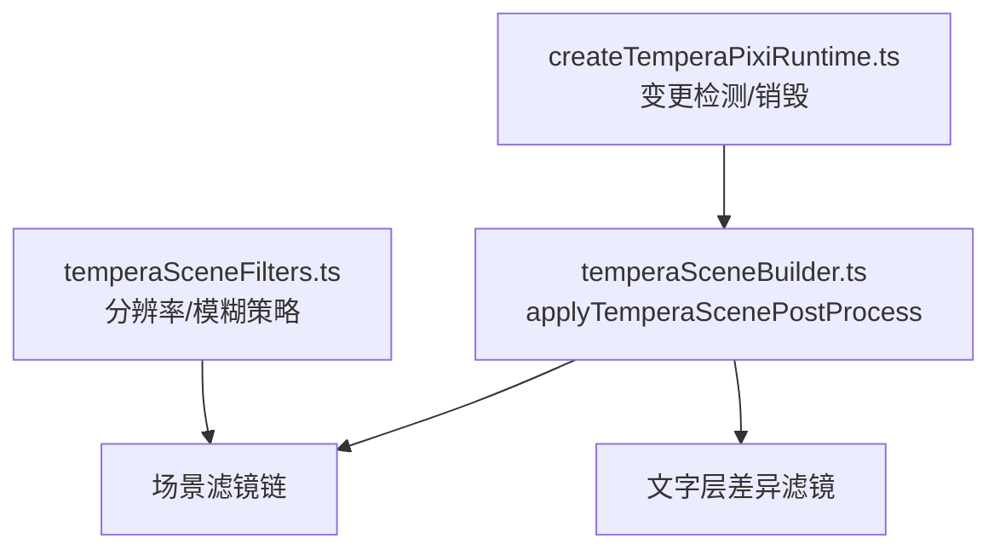
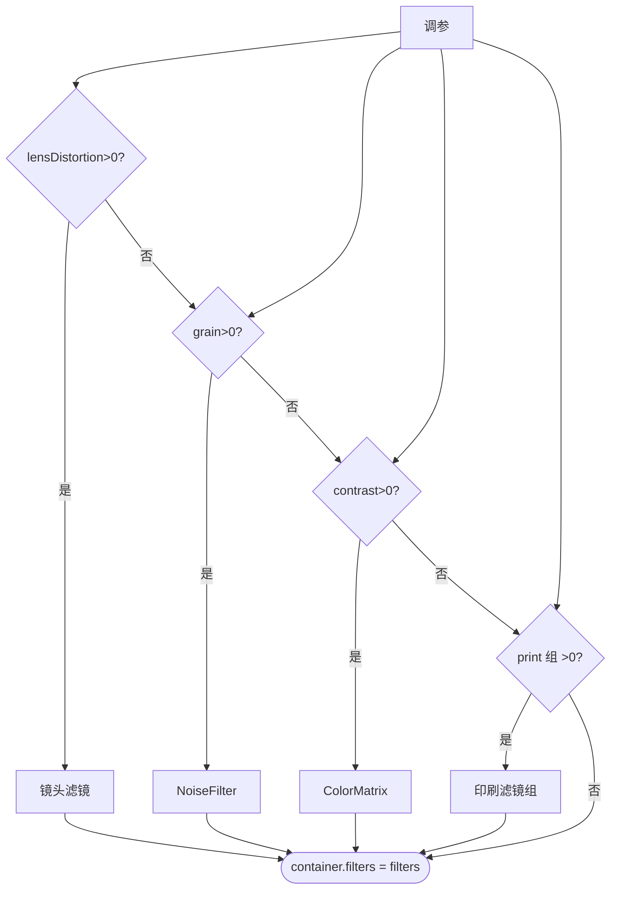
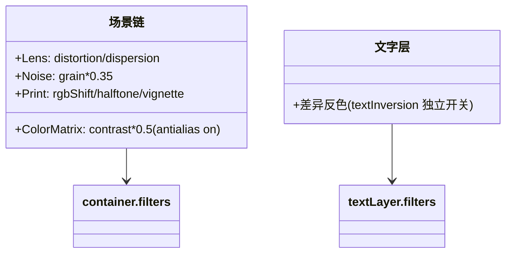
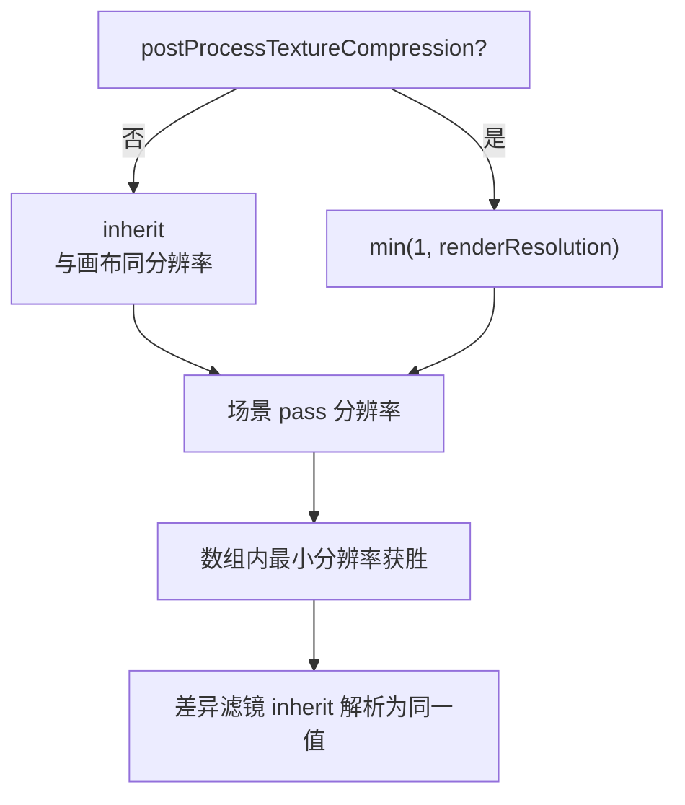
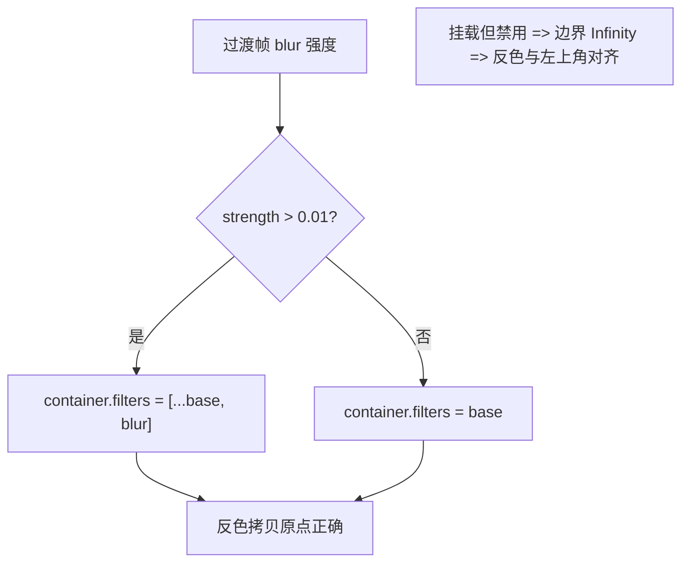
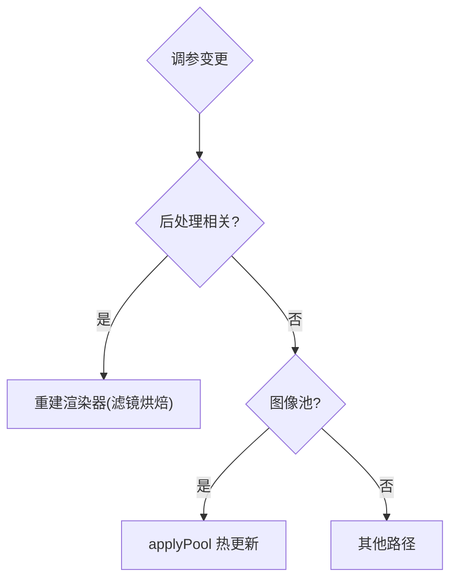
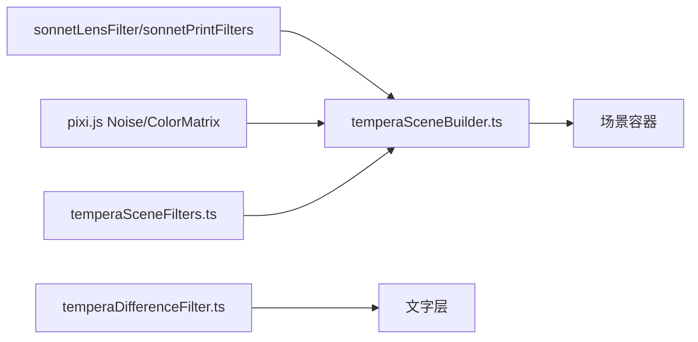

# 图形滤镜与后处理效果

<cite>
**本文引用的文件**   
- [temperaSceneFilters.ts](file://src/components/visualizer/tempera/temperaSceneFilters.ts)
- [temperaSceneBuilder.ts](file://src/components/visualizer/tempera/temperaSceneBuilder.ts)
- [temperaProgram.ts](file://src/components/visualizer/tempera/temperaProgram.ts)
- [createTemperaPixiRuntime.ts](file://src/components/visualizer/tempera/createTemperaPixiRuntime.ts)
- [temperaDifferenceFilter.ts](file://src/components/visualizer/tempera/temperaDifferenceFilter.ts)
</cite>

## 目录
1. [引言](#引言)
2. [项目结构](#项目结构)
3. [核心组件](#核心组件)
4. [架构总览](#架构总览)
5. [详细组件分析](#详细组件分析)
6. [依赖关系分析](#依赖关系分析)
7. [性能考量](#性能考量)
8. [故障排查指南](#故障排查指南)
9. [结论](#结论)

## 引言
本文聚焦 Tempera 模式的图形滤镜与后处理效果，围绕以下目标展开：
- 解释场景后处理链的组成：镜头畸变、颗粒、对比度与印刷组（RGB 位移、半调、暗角）。
- 说明滤镜分辨率的统一策略：`inherit` 与压缩开关的取舍，以及反色滤镜对分辨率的敏感性。
- 阐述过渡模糊的"上-下"纪律：为什么模糊滤镜必须随用随挂、用完即摘。
- 解释调参变化如何触发渲染器重建。

## 项目结构
- temperaSceneFilters.ts：分辨率策略（`resolveTemperaPassResolution`）与过渡模糊挂载（`setTemperaTransitionBlur`）。
- temperaSceneBuilder.ts：`applyTemperaScenePostProcess`——后处理链的实际装配点。
- temperaDifferenceFilter.ts：文字层反色滤镜（详见《图像合成与混合模式》《GLSL着色器实现》）。
- createTemperaPixiRuntime.ts：调参变更检测与滤镜销毁。

**图示来源**
- [temperaSceneBuilder.ts:346-388](file://src/components/visualizer/tempera/temperaSceneBuilder.ts#L346-L388)
- [temperaSceneFilters.ts:51-72](file://src/components/visualizer/tempera/temperaSceneFilters.ts#L51-L72)

**章节来源**
- [temperaSceneBuilder.ts:346-388](file://src/components/visualizer/tempera/temperaSceneBuilder.ts#L346-L388)

## 核心组件
- 场景链（按装配顺序）：`createSonnetLensFilter`（畸变/色散）→ `NoiseFilter`（颗粒，`postProcessGrain * 0.35`）→ `ColorMatrixFilter`（对比度，`postProcessContrast * 0.5`）→ `createSonnetPrintFilters`（RGB 位移/半调/暗角）。
- 文字层滤镜：差异反色（`textInversion` 开关独立于后处理总开关）。
- 过渡模糊：`BlurFilter`，强度 > 0.01 才挂载。
- 分辨率：`resolveTemperaPassResolution(tuning, renderResolution)`——压缩开启时取 `min(1, renderResolution)`，否则 `'inherit'`。

**章节来源**
- [temperaSceneBuilder.ts:353-378](file://src/components/visualizer/tempera/temperaSceneBuilder.ts#L353-L378)

## 架构总览
Tempera 的后处理采用"逐项可选、全部默认关闭"的策略：每个效果都由独立调参滑块控制（> 0 才构建），且全部在**场景构建期**一次性装配——调参改变会触发渲染器重建，而不是运行时热推。文字层滤镜独立于后处理开关：反色与渐变着色由 `textInversion` 单独管理。

**图示来源**
- [temperaSceneBuilder.ts:353-388](file://src/components/visualizer/tempera/temperaSceneBuilder.ts#L353-L388)

**章节来源**
- [temperaSceneBuilder.ts:346-388](file://src/components/visualizer/tempera/temperaSceneBuilder.ts#L346-L388)

## 详细组件分析

### 场景后处理链：共享 Sonnet 的滤镜实现
Tempera 的后处理复用了 Sonnet 的镜头滤镜与印刷滤镜工厂（`createSonnetLensFilter`、`createSonnetPrintFilters`），并在其上使用 Pixi 内建的 `NoiseFilter` 与 `ColorMatrixFilter`：
- 颗粒：`noise: postProcessGrain * 0.35`——折扣系数让颗粒保持"微妙"（细网线与字形不能被噪点吃掉）。
- 对比度：`contrast(postProcessContrast * 0.5, false)` 并强制 `antialias = 'on'`——对比度滤镜会暴露纤细背景描边的锯齿，抗锯齿必须打开。
- 印刷组：RGB 位移、半调、暗角全部走同一个 `postProcessEnabled` 总开关之下的独立滑块。

**图示来源**
- [temperaSceneBuilder.ts:353-378](file://src/components/visualizer/tempera/temperaSceneBuilder.ts#L353-L378)

**章节来源**
- [temperaSceneBuilder.ts:346-388](file://src/components/visualizer/tempera/temperaSceneBuilder.ts#L346-L388)

### 分辨率统一：inherit 与压缩开关
`resolveTemperaPassResolution` 决定场景容器上所有滤镜的运行分辨率：
- 默认 `'inherit'`：与画布同分辨率。原因（文件注释详述）：Pixi 的 `Filter` 默认分辨率是硬编码的 1，会让整张构图按每 CSS 像素一个设备像素光栅化后再放大到画布（`textureResolution` 默认 1.5）——细网线、半调纹理与文字全部变软；"最锐的东西替颗粒买了单"。
- 压缩开关（`postProcessTextureCompression`）：弱 GPU 的退路，取 `min(1, renderResolution)` 降档。
- 反色滤镜的敏感性：Pixi 取滤镜数组中**最小**分辨率作为整个 pass 的值；文字层的差异滤镜声明 `'inherit'`（解析为该 pass 的分辨率），其 `uBackTexture` 从同一表面、同一分辨率拷贝——输入与底图尺寸恒等，一个 `vTextureCoord` 同时索引两张纹理。要守护的规则：**永远不要给文字层滤镜固定分辨率，也不要指望在同一数组中混合固定分辨率——最小值获胜**。
- `renderResolution` 是画布实际运行的分辨率（`textureResolution` 经纹理池吸附后的值），而不是设置值——吸附降档时用设置值会让 pass 请求一张比目标表面更大的纹理。

**图示来源**
- [temperaSceneFilters.ts:27-59](file://src/components/visualizer/tempera/temperaSceneFilters.ts#L27-L59)

**章节来源**
- [temperaSceneFilters.ts:27-72](file://src/components/visualizer/tempera/temperaSceneFilters.ts#L27-L72)

### 过渡模糊的挂载纪律
`setTemperaTransitionBlur` 只在 `strength > 0.01` 时把模糊滤镜挂到场景容器上，一旦低于阈值立即摘除（`container.filters = baseFilters`）。这不是微观优化，而是反色正确性的前提：被挂载但禁用的容器滤镜仍会被 Pixi 压入滤镜栈（作为 skipped entry），而 skipped entry 从未运行 `_calculateFilterArea`、边界保持 `Infinity`——文字层差异滤镜的 `uBackTexture` 拷贝原点会下溢到 (0,0)，导致每个字形与画面左上角做反色。历史现象：后处理开启时问题被真实的场景滤镜掩盖，关闭后（默认态）就会暴露。
模糊的分辨率恒定为 pass 的一半：`resolveTemperaTransitionBlurResolution` = pass 分辨率 × 0.5——它本来就在模糊，且只在过渡期存在；"硬件 0.5"会在 pass 不再是 1 时把整场景突然降四分之三。

**图示来源**
- [temperaSceneFilters.ts:82-95](file://src/components/visualizer/tempera/temperaSceneFilters.ts#L82-L95)

**章节来源**
- [temperaSceneFilters.ts:82-95](file://src/components/visualizer/tempera/temperaSceneFilters.ts#L82-L95)

### 调参变更与渲染器重建
运行时的变更检测把后处理相关调参列为"渲染器级"变更：`postProcessEnabled`、`postProcessTextureCompression`、`postProcessGrain`、`postProcessContrast`、`postProcessRgbShift`、`postProcessVignette`、`postProcessLensDistortion` 任一变化都会触发重建（注释：这些参数在构建期被烘焙进每个滤镜，无法就地推送）。反之，图像池的 `applyPool` 是热路径（不重建）。这构成了 Tempera 调参的两档响应：滤镜参数 = 重建；图像放置 = 热更新。

**图示来源**
- [createTemperaPixiRuntime.ts:146-168](file://src/components/visualizer/tempera/createTemperaPixiRuntime.ts#L146-L168)

**章节来源**
- [createTemperaPixiRuntime.ts:146-168](file://src/components/visualizer/tempera/createTemperaPixiRuntime.ts#L146-L168)

## 依赖关系分析
- 场景链复用 Sonnet 的滤镜工厂（镜头、印刷），保持两个模式的后处理词汇一致。
- 文字滤镜（差异反色）独立于场景链，拥有自己的开关与分辨率规则。
- 所有滤镜对象被收集进 `postProcessFilters`，随场景销毁统一释放。

**图示来源**
- [temperaSceneBuilder.ts:40-41](file://src/components/visualizer/tempera/temperaSceneBuilder.ts#L40-L41)

**章节来源**
- [temperaSceneBuilder.ts:346-388](file://src/components/visualizer/tempera/temperaSceneBuilder.ts#L346-L388)

## 性能考量
- 默认全关：所有后处理滑块默认 0，常规播放只有文字层差异滤镜（单遍）与必要的矢量绘制。
- 每开一项 = 一次全屏采样链的增长；逐项数值已做折扣（颗粒 ×0.35、对比度 ×0.5）。
- 模糊只活在过渡窗口；`resolution` 减半进一步降低成本。
- 变更检测让滤镜重建只发生在必要时。

**章节来源**
- [temperaSceneFilters.ts:61-72](file://src/components/visualizer/tempera/temperaSceneFilters.ts#L61-L72)

## 故障排查指南
- 开启后处理后画面变软：检查是否为 `resolution: 1` 的旧式固定值；默认必须 `'inherit'`。
- 关后处理后文字反色整体错位：场景容器上残留"禁用模糊"；确认 `setTemperaTransitionBlur` 在强度归零时把自己从 `container.filters` 数组中移除。
- 过渡开始时画面突然降清晰度：模糊分辨率被写成固定 0.5；应使用 `resolveTemperaTransitionBlurResolution` 派生。
- 半调纹理闪烁：颗粒/半调数值过大或对比度滤镜关闭了抗锯齿；对比度滤镜必须 `antialias: 'on'`。
- 拖动滤镜滑块无即时变化：后处理参数是构建期烘焙，需要重建路径生效——检查变更检测清单是否包含该参数。
- 细网线看起来模糊：压缩开关被打开（`postProcessTextureCompression`）；关闭它恢复继承分辨率。

**章节来源**
- [temperaSceneFilters.ts:61-72](file://src/components/visualizer/tempera/temperaSceneFilters.ts#L61-L72)
- [createTemperaPixiRuntime.ts:155-162](file://src/components/visualizer/tempera/createTemperaPixiRuntime.ts#L155-L162)

## 结论
Tempera 的图形滤镜与后处理以"极简默认 + 逐项可选 + 构建期烘焙"为架构原则，复用了 Sonnet 的滤镜词汇而把复杂度控制在可控范围内。分辨率统一策略（inherit 优先）与过渡模糊的挂载纪律是这套系统中两处经过实战淬炼的关键约定——前者守护清晰度，后者守护反色正确性。理解这两条约定与"滤镜重建 / 图像热更"的双档响应，就掌握了 Tempera 后处理的全部要义。
