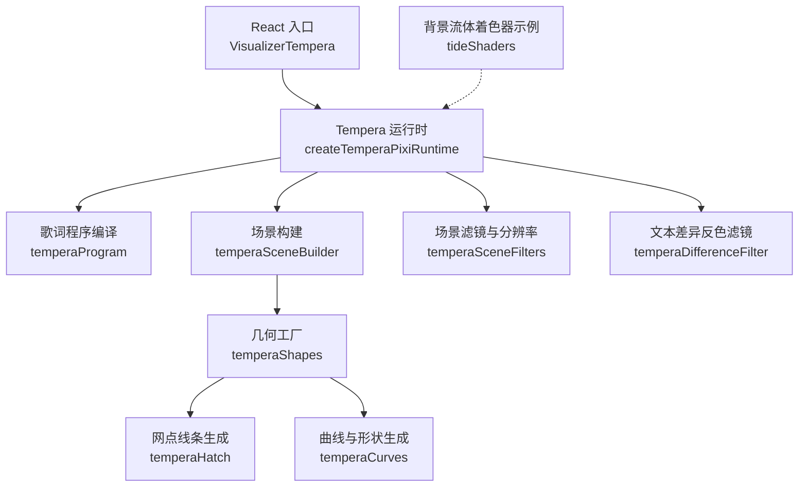
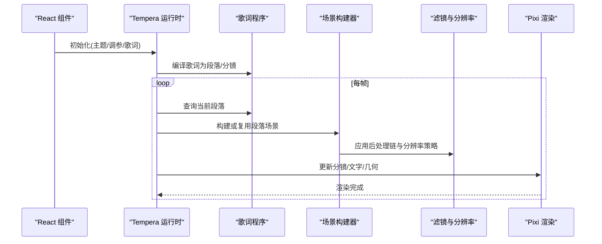
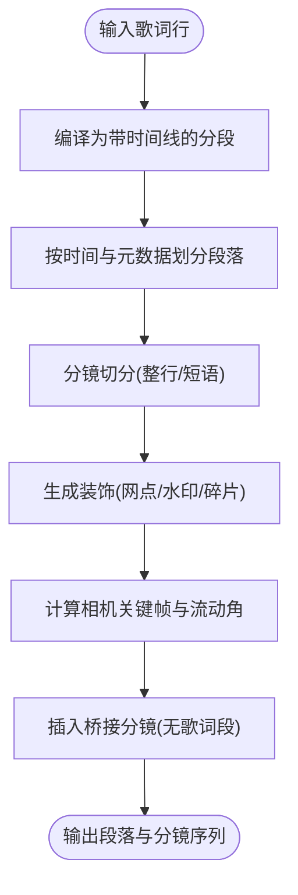
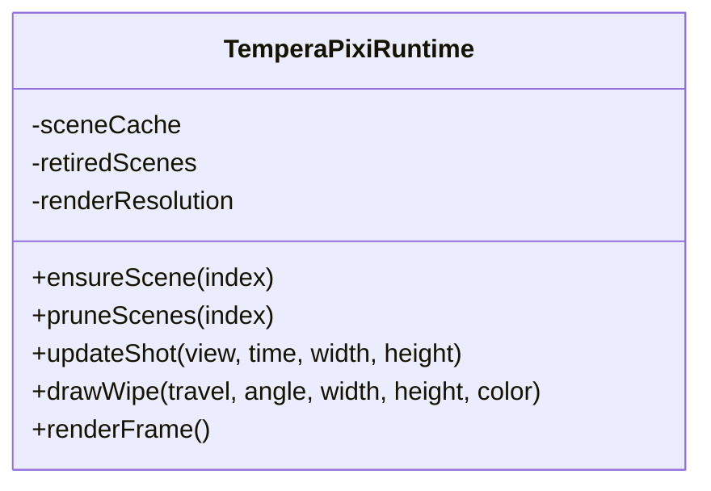
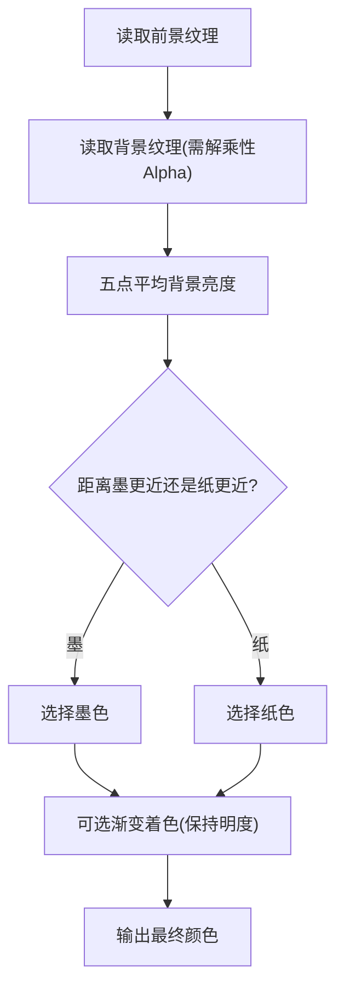
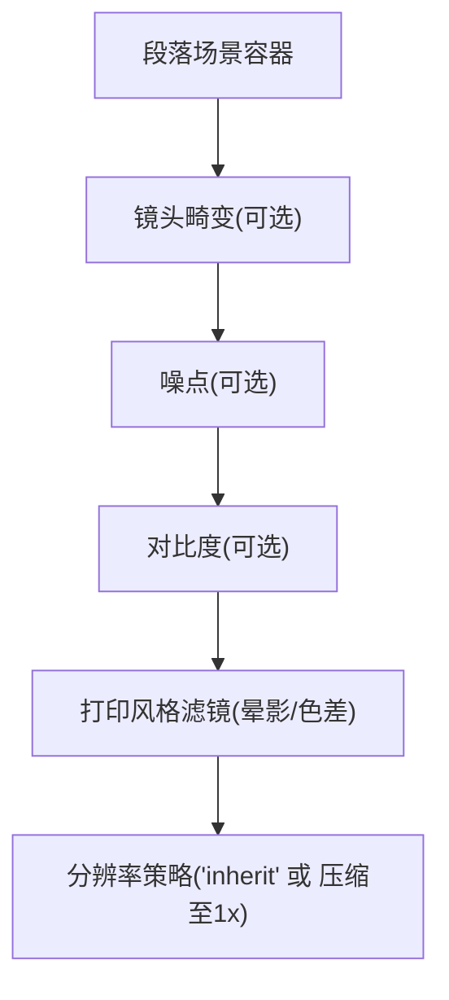
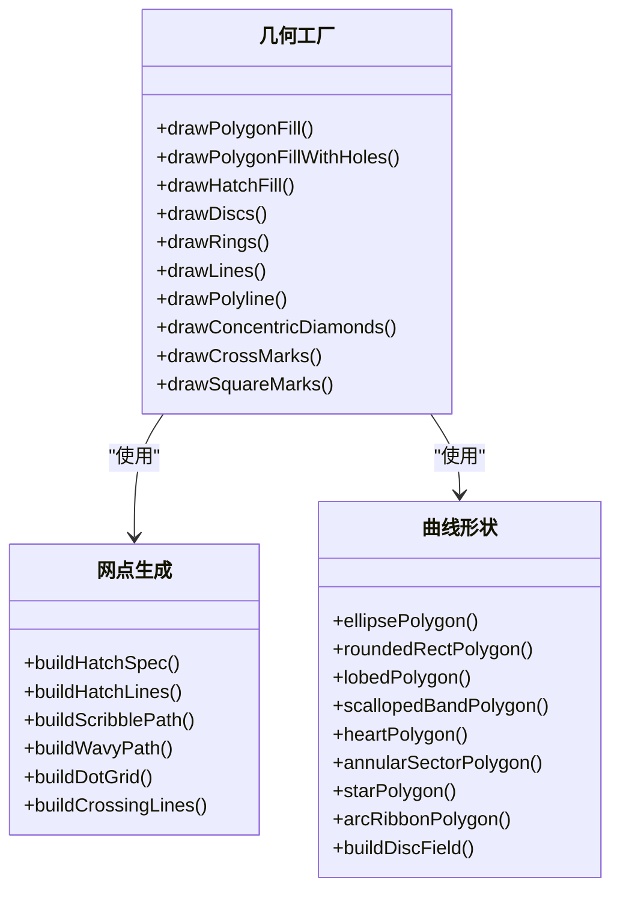
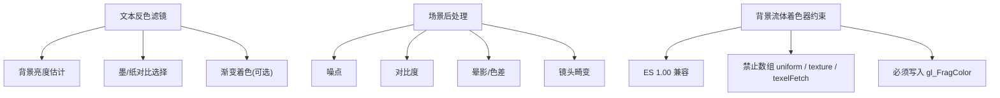
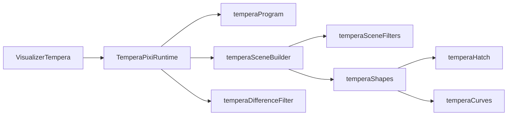

# 着色器程序与图形效果

<cite>
**本文引用的文件**   
- [VisualizerTempera.tsx](file://src/components/visualizer/tempera/VisualizerTempera.tsx)
- [createTemperaPixiRuntime.ts](file://src/components/visualizer/tempera/createTemperaPixiRuntime.ts)
- [temperaProgram.ts](file://src/components/visualizer/tempera/temperaProgram.ts)
- [temperaSceneFilters.ts](file://src/components/visualizer/tempera/temperaSceneFilters.ts)
- [temperaDifferenceFilter.ts](file://src/components/visualizer/tempera/temperaDifferenceFilter.ts)
- [temperaShapes.ts](file://src/components/visualizer/tempera/temperaShapes.ts)
- [temperaHatch.ts](file://src/components/visualizer/tempera/temperaHatch.ts)
- [temperaCurves.ts](file://src/components/visualizer/tempera/temperaCurves.ts)
- [temperaSceneBuilder.ts](file://src/components/visualizer/tempera/temperaSceneBuilder.ts)
- [appearanceCodec.ts](file://src/utils/appearanceCodec.ts)
- [visualizerSettingsPersistence.ts](file://src/stores/visualizerSettingsPersistence.ts)
- [tideShaders.ts](file://src/components/visualizer/backgrounds/tide/tideShaders.ts)
- [temperaDifferenceFilter.test.ts](file://test/unit/visualizer/temperaDifferenceFilter.test.ts)
- [temperaSceneFilters.test.ts](file://test/unit/visualizer/temperaSceneFilters.test.ts)
</cite>

## 目录
1. [引言](#引言)
2. [项目结构](#项目结构)
3. [核心组件](#核心组件)
4. [架构总览](#架构总览)
5. [详细组件分析](#详细组件分析)
6. [依赖关系分析](#依赖关系分析)
7. [性能考虑](#性能考虑)
8. [故障排查指南](#故障排查指南)
9. [结论](#结论)
10. [附录](#附录)

## 引言
本技术文档围绕 Tempera 模式的可视化渲染系统，系统性梳理其基于 PixiJS 的实时渲染管线、几何图形生成、图形滤镜系统与着色器相关实现。文档重点包括：
- 歌词与场景的编译、分镜与过渡控制
- 几何形状与网点线条等“版画语言”的纯函数式生成
- 文本反色对比滤镜与后处理链（噪点、对比度、晕影、色差、镜头畸变）
- 分辨率策略、纹理压缩与 GPU 内存管理
- 自定义着色器的约束、调试与优化建议

## 项目结构
Tempera 模式位于可视化子系统下，采用“运行时 + 构建期 + 视图层”的分层组织：
- 运行时：负责 Pixi 应用生命周期、视口缩放、段落与分镜切换、资源释放
- 构建期：将歌词时间线编译为段落、分镜、装饰元素与相机轨迹
- 视图层：使用 Pixi Graphics 绘制几何、网点、文字与图层图像
- 滤镜与着色器：文本差异反色滤镜、场景级后处理链、背景流体 GLSL（非 Tempera 主路径但体现着色器约束）

**图表来源**
- [VisualizerTempera.tsx:26-218](file://src/components/visualizer/tempera/VisualizerTempera.tsx#L26-L218)
- [createTemperaPixiRuntime.ts:224-266](file://src/components/visualizer/tempera/createTemperaPixiRuntime.ts#L224-L266)
- [temperaProgram.ts:515-632](file://src/components/visualizer/tempera/temperaProgram.ts#L515-L632)
- [temperaSceneBuilder.ts:345-379](file://src/components/visualizer/tempera/temperaSceneBuilder.ts#L345-L379)
- [temperaSceneFilters.ts:51-72](file://src/components/visualizer/tempera/temperaSceneFilters.ts#L51-L72)
- [temperaDifferenceFilter.ts:145-191](file://src/components/visualizer/tempera/temperaDifferenceFilter.ts#L145-L191)
- [temperaShapes.ts:10-18](file://src/components/visualizer/tempera/temperaShapes.ts#L10-L18)
- [temperaHatch.ts:1-13](file://src/components/visualizer/tempera/temperaHatch.ts#L1-L13)
- [temperaCurves.ts:1-13](file://src/components/visualizer/tempera/temperaCurves.ts#L1-L13)
- [tideShaders.ts:1-5](file://src/components/visualizer/backgrounds/tide/tideShaders.ts#L1-L5)

**章节来源**
- [VisualizerTempera.tsx:26-218](file://src/components/visualizer/tempera/VisualizerTempera.tsx#L26-L218)
- [createTemperaPixiRuntime.ts:224-266](file://src/components/visualizer/tempera/createTemperaPixiRuntime.ts#L224-L266)

## 核心组件
- 可视化入口组件：负责挂载 Pixi 宿主、加载歌词与主题、传递调参与状态到运行时
- 运行时类：管理 Pixi Application、视口与分辨率、段落缓存、分镜更新、转场擦除块、资源销毁
- 歌词程序编译器：将歌词行切分为段落、分镜、装饰元素，并计算相机轨迹与过渡
- 场景构建器：组装场景后处理链、噪声、对比度、晕影、色差、镜头畸变等滤镜
- 文本差异反色滤镜：根据背景亮度选择墨或纸色，保持歌词可读性；支持渐变着色
- 几何与网点生成：纯函数式生成多边形、圆环、心形、星形、网点线条等
- 背景流体着色器：GLSL ES 1.00 流体求解器片段与顶点着色器（参考着色器约束）

**章节来源**
- [VisualizerTempera.tsx:26-218](file://src/components/visualizer/tempera/VisualizerTempera.tsx#L26-L218)
- [createTemperaPixiRuntime.ts:173-266](file://src/components/visualizer/tempera/createTemperaPixiRuntime.ts#L173-L266)
- [temperaProgram.ts:515-632](file://src/components/visualizer/tempera/temperaProgram.ts#L515-L632)
- [temperaSceneBuilder.ts:345-379](file://src/components/visualizer/tempera/temperaSceneBuilder.ts#L345-L379)
- [temperaDifferenceFilter.ts:145-191](file://src/components/visualizer/tempera/temperaDifferenceFilter.ts#L145-L191)
- [temperaShapes.ts:10-18](file://src/components/visualizer/tempera/temperaShapes.ts#L10-L18)
- [temperaHatch.ts:1-13](file://src/components/visualizer/tempera/temperaHatch.ts#L1-L13)
- [temperaCurves.ts:1-13](file://src/components/visualizer/tempera/temperaCurves.ts#L1-L13)
- [tideShaders.ts:1-5](file://src/components/visualizer/backgrounds/tide/tideShaders.ts#L1-L5)

## 架构总览
Tempera 渲染流程从 React 组件开始，创建并复用 Pixi 运行时，按当前播放时间选择段落与分镜，驱动几何与文字动画，并在必要时应用后处理滤镜。

**图表来源**
- [VisualizerTempera.tsx:181-218](file://src/components/visualizer/tempera/VisualizerTempera.tsx#L181-L218)
- [createTemperaPixiRuntime.ts:674-800](file://src/components/visualizer/tempera/createTemperaPixiRuntime.ts#L674-L800)
- [temperaProgram.ts:515-632](file://src/components/visualizer/tempera/temperaProgram.ts#L515-L632)
- [temperaSceneBuilder.ts:345-379](file://src/components/visualizer/tempera/temperaSceneBuilder.ts#L345-L379)
- [temperaSceneFilters.ts:51-72](file://src/components/visualizer/tempera/temperaSceneFilters.ts#L51-L72)

## 详细组件分析

### 歌词程序编译与分镜
- 将歌词行切分为段落，依据时间间隔与元数据变化划分边界
- 将段落拆分为分镜，支持整行歌词模式与短语切分
- 为每个分镜计算相机起止关键帧、流动角度与装饰元素（网点、水印、碎片字符）
- 在段落之间插入桥接分镜以填充无歌词间隙，保证视觉连续性

**图表来源**
- [temperaProgram.ts:515-632](file://src/components/visualizer/tempera/temperaProgram.ts#L515-L632)

**章节来源**
- [temperaProgram.ts:515-632](file://src/components/visualizer/tempera/temperaProgram.ts#L515-L632)

### 运行时与段落/分镜管理
- 维护段落缓存与相邻预取，避免段落切换卡顿
- 视口尺寸变化时重新计算渲染分辨率并清理缓存
- 分镜进入/退出通过手递手重叠推进，形成连续运动
- 擦除块用于歌曲切换时的遮挡过渡

**图表来源**
- [createTemperaPixiRuntime.ts:173-266](file://src/components/visualizer/tempera/createTemperaPixiRuntime.ts#L173-L266)
- [createTemperaPixiRuntime.ts:526-542](file://src/components/visualizer/tempera/createTemperaPixiRuntime.ts#L526-L542)
- [createTemperaPixiRuntime.ts:557-633](file://src/components/visualizer/tempera/createTemperaPixiRuntime.ts#L557-L633)
- [createTemperaPixiRuntime.ts:637-672](file://src/components/visualizer/tempera/createTemperaPixiRuntime.ts#L637-L672)
- [createTemperaPixiRuntime.ts:674-800](file://src/components/visualizer/tempera/createTemperaPixiRuntime.ts#L674-L800)

**章节来源**
- [createTemperaPixiRuntime.ts:173-266](file://src/components/visualizer/tempera/createTemperaPixiRuntime.ts#L173-L266)
- [createTemperaPixiRuntime.ts:526-542](file://src/components/visualizer/tempera/createTemperaPixiRuntime.ts#L526-L542)
- [createTemperaPixiRuntime.ts:557-633](file://src/components/visualizer/tempera/createTemperaPixiRuntime.ts#L557-L633)
- [createTemperaPixiRuntime.ts:637-672](file://src/components/visualizer/tempera/createTemperaPixiRuntime.ts#L637-L672)
- [createTemperaPixiRuntime.ts:674-800](file://src/components/visualizer/tempera/createTemperaPixiRuntime.ts#L674-L800)

### 文本差异反色滤镜
- 采样已渲染的背景像素，计算亮度并与墨/纸亮度比较，选择对比更大的颜色
- 对背景进行五邻域平均以避免细网点闪烁
- 支持四段渐变色带沿行方向扫掠，同时保留反色决定的明度
- 必须设置 `blendRequired` 与 `resolution: 'inherit'`，确保输入与背景纹理坐标一致

**图表来源**
- [temperaDifferenceFilter.ts:65-116](file://src/components/visualizer/tempera/temperaDifferenceFilter.ts#L65-L116)
- [temperaDifferenceFilter.ts:145-191](file://src/components/visualizer/tempera/temperaDifferenceFilter.ts#L145-L191)

**章节来源**
- [temperaDifferenceFilter.ts:65-116](file://src/components/visualizer/tempera/temperaDifferenceFilter.ts#L65-L116)
- [temperaDifferenceFilter.ts:145-191](file://src/components/visualizer/tempera/temperaDifferenceFilter.ts#L145-L191)
- [temperaDifferenceFilter.test.ts:42-64](file://test/unit/visualizer/temperaDifferenceFilter.test.ts#L42-L64)

### 场景后处理与分辨率策略
- 后处理链包含镜头畸变、噪点、对比度、晕影、色差等
- 默认使用 `'inherit'` 分辨率以保持与画布一致；可开启纹理压缩降至 1x
- 过渡模糊仅在活跃强度阈值以上附加，避免污染文本反色滤镜的 backdrop 拷贝

**图表来源**
- [temperaSceneBuilder.ts:345-379](file://src/components/visualizer/tempera/temperaSceneBuilder.ts#L345-L379)
- [temperaSceneFilters.ts:51-72](file://src/components/visualizer/tempera/temperaSceneFilters.ts#L51-L72)
- [temperaSceneFilters.ts:85-95](file://src/components/visualizer/tempera/temperaSceneFilters.ts#L85-L95)

**章节来源**
- [temperaSceneBuilder.ts:345-379](file://src/components/visualizer/tempera/temperaSceneBuilder.ts#L345-L379)
- [temperaSceneFilters.ts:51-72](file://src/components/visualizer/tempera/temperaSceneFilters.ts#L51-L72)
- [temperaSceneFilters.ts:85-95](file://src/components/visualizer/tempera/temperaSceneFilters.ts#L85-L95)
- [temperaSceneFilters.test.ts:34-49](file://test/unit/visualizer/temperaSceneFilters.test.ts#L34-L49)

### 几何图形与网点生成
- 多边形填充、带孔多边形、平行网点线条、同心菱形、十字标记、方块标记
- 圆形、椭圆、圆角矩形、波浪边、心形、星形、环形扇区、弧线缎带等曲线形状
- 所有几何均为纯函数式生成，不依赖随机源，便于确定性回放与测试

**图表来源**
- [temperaShapes.ts:62-137](file://src/components/visualizer/tempera/temperaShapes.ts#L62-L137)
- [temperaShapes.ts:172-294](file://src/components/visualizer/tempera/temperaShapes.ts#L172-L294)
- [temperaHatch.ts:34-41](file://src/components/visualizer/tempera/temperaHatch.ts#L34-L41)
- [temperaHatch.ts:124-179](file://src/components/visualizer/tempera/temperaHatch.ts#L124-L179)
- [temperaHatch.ts:182-329](file://src/components/visualizer/tempera/temperaHatch.ts#L182-L329)
- [temperaCurves.ts:23-37](file://src/components/visualizer/tempera/temperaCurves.ts#L23-L37)
- [temperaCurves.ts:40-64](file://src/components/visualizer/tempera/temperaCurves.ts#L40-L64)
- [temperaCurves.ts:83-102](file://src/components/visualizer/tempera/temperaCurves.ts#L83-L102)
- [temperaCurves.ts:109-132](file://src/components/visualizer/tempera/temperaCurves.ts#L109-L132)
- [temperaCurves.ts:138-174](file://src/components/visualizer/tempera/temperaCurves.ts#L138-L174)
- [temperaCurves.ts:181-201](file://src/components/visualizer/tempera/temperaCurves.ts#L181-L201)
- [temperaCurves.ts:204-220](file://src/components/visualizer/tempera/temperaCurves.ts#L204-L220)
- [temperaCurves.ts:226-250](file://src/components/visualizer/tempera/temperaCurves.ts#L226-L250)
- [temperaCurves.ts:256-282](file://src/components/visualizer/tempera/temperaCurves.ts#L256-L282)

**章节来源**
- [temperaShapes.ts:62-137](file://src/components/visualizer/tempera/temperaShapes.ts#L62-L137)
- [temperaShapes.ts:172-294](file://src/components/visualizer/tempera/temperaShapes.ts#L172-L294)
- [temperaHatch.ts:34-41](file://src/components/visualizer/tempera/temperaHatch.ts#L34-L41)
- [temperaHatch.ts:124-179](file://src/components/visualizer/tempera/temperaHatch.ts#L124-L179)
- [temperaHatch.ts:182-329](file://src/components/visualizer/tempera/temperaHatch.ts#L182-L329)
- [temperaCurves.ts:23-37](file://src/components/visualizer/tempera/temperaCurves.ts#L23-L37)
- [temperaCurves.ts:40-64](file://src/components/visualizer/tempera/temperaCurves.ts#L40-L64)
- [temperaCurves.ts:83-102](file://src/components/visualizer/tempera/temperaCurves.ts#L83-L102)
- [temperaCurves.ts:109-132](file://src/components/visualizer/tempera/temperaCurves.ts#L109-L132)
- [temperaCurves.ts:138-174](file://src/components/visualizer/tempera/temperaCurves.ts#L138-L174)
- [temperaCurves.ts:181-201](file://src/components/visualizer/tempera/temperaCurves.ts#L181-L201)
- [temperaCurves.ts:204-220](file://src/components/visualizer/tempera/temperaCurves.ts#L204-L220)
- [temperaCurves.ts:226-250](file://src/components/visualizer/tempera/temperaCurves.ts#L226-L250)
- [temperaCurves.ts:256-282](file://src/components/visualizer/tempera/temperaCurves.ts#L256-L282)

### 着色器与图形滤镜系统
- 文本差异反色滤镜：基于背景亮度的墨/纸选择与渐变着色
- 场景后处理：噪点、对比度、晕影、色差、镜头畸变
- 背景流体着色器（参考）：GLSL ES 1.00，限定无数组 uniform、无 texture/texelFetch、无 out/in 变量声明，强制 gl_FragColor 输出

**图表来源**
- [temperaDifferenceFilter.ts:65-116](file://src/components/visualizer/tempera/temperaDifferenceFilter.ts#L65-L116)
- [temperaSceneBuilder.ts:345-379](file://src/components/visualizer/tempera/temperaSceneBuilder.ts#L345-L379)
- [tideShaders.ts:1-5](file://src/components/visualizer/backgrounds/tide/tideShaders.ts#L1-L5)

**章节来源**
- [temperaDifferenceFilter.ts:65-116](file://src/components/visualizer/tempera/temperaDifferenceFilter.ts#L65-L116)
- [temperaSceneBuilder.ts:345-379](file://src/components/visualizer/tempera/temperaSceneBuilder.ts#L345-L379)
- [tideShaders.ts:1-5](file://src/components/visualizer/backgrounds/tide/tideShaders.ts#L1-L5)

## 依赖关系分析
- VisualizerTempera 作为 React 入口，负责创建 TemperaPixiRuntime 并注入主题、歌词、调参与媒体信息
- TemperaPixiRuntime 依赖歌词程序编译结果与场景构建器，管理段落缓存与分镜更新
- 场景构建器依赖后处理滤镜与分辨率策略，组合 Pixi Filter 链
- 几何工厂依赖网点与曲线生成模块，提供静态几何节点
- 文本差异反色滤镜依赖 Pixi Filter API 与 UniformGroup

**图表来源**
- [VisualizerTempera.tsx:181-218](file://src/components/visualizer/tempera/VisualizerTempera.tsx#L181-L218)
- [createTemperaPixiRuntime.ts:224-266](file://src/components/visualizer/tempera/createTemperaPixiRuntime.ts#L224-L266)
- [temperaProgram.ts:515-632](file://src/components/visualizer/tempera/temperaProgram.ts#L515-L632)
- [temperaSceneBuilder.ts:345-379](file://src/components/visualizer/tempera/temperaSceneBuilder.ts#L345-L379)
- [temperaSceneFilters.ts:51-72](file://src/components/visualizer/tempera/temperaSceneFilters.ts#L51-L72)
- [temperaDifferenceFilter.ts:145-191](file://src/components/visualizer/tempera/temperaDifferenceFilter.ts#L145-L191)
- [temperaShapes.ts:10-18](file://src/components/visualizer/tempera/temperaShapes.ts#L10-L18)
- [temperaHatch.ts:1-13](file://src/components/visualizer/tempera/temperaHatch.ts#L1-L13)
- [temperaCurves.ts:1-13](file://src/components/visualizer/tempera/temperaCurves.ts#L1-L13)

**章节来源**
- [VisualizerTempera.tsx:181-218](file://src/components/visualizer/tempera/VisualizerTempera.tsx#L181-L218)
- [createTemperaPixiRuntime.ts:224-266](file://src/components/visualizer/tempera/createTemperaPixiRuntime.ts#L224-L266)
- [temperaProgram.ts:515-632](file://src/components/visualizer/tempera/temperaProgram.ts#L515-L632)
- [temperaSceneBuilder.ts:345-379](file://src/components/visualizer/tempera/temperaSceneBuilder.ts#L345-L379)
- [temperaSceneFilters.ts:51-72](file://src/components/visualizer/tempera/temperaSceneFilters.ts#L51-L72)
- [temperaDifferenceFilter.ts:145-191](file://src/components/visualizer/tempera/temperaDifferenceFilter.ts#L145-L191)
- [temperaShapes.ts:10-18](file://src/components/visualizer/tempera/temperaShapes.ts#L10-L18)
- [temperaHatch.ts:1-13](file://src/components/visualizer/tempera/temperaHatch.ts#L1-L13)
- [temperaCurves.ts:1-13](file://src/components/visualizer/tempera/temperaCurves.ts#L1-L13)

## 性能考虑
- 渲染分辨率与纹理池对齐：使用 `snapResolutionToTexturePool` 将渲染分辨率对齐到纹理池边界，减少显存浪费
- 后处理纹理压缩：开启后可将场景级滤镜运算降至 1x，降低 GPU 压力与显存占用
- 段落缓存与邻居预取：仅缓存当前段落及其相邻段落，避免全量重建
- 资源延迟释放：歌曲切换时将旧段落移出屏幕并逐帧释放，避免卡顿
- 文本反色滤镜分辨率继承：使用 `'inherit'` 确保输入与背景纹理像素尺寸一致，避免错位与上采样
- 几何与网点生成：纯函数式生成，避免运行时随机与重复分配

**章节来源**
- [createTemperaPixiRuntime.ts:224-266](file://src/components/visualizer/tempera/createTemperaPixiRuntime.ts#L224-L266)
- [createTemperaPixiRuntime.ts:284-310](file://src/components/visualizer/tempera/createTemperaPixiRuntime.ts#L284-L310)
- [createTemperaPixiRuntime.ts:455-495](file://src/components/visualizer/tempera/createTemperaPixiRuntime.ts#L455-L495)
- [temperaSceneFilters.ts:51-72](file://src/components/visualizer/tempera/temperaSceneFilters.ts#L51-L72)
- [temperaDifferenceFilter.ts:168-191](file://src/components/visualizer/tempera/temperaDifferenceFilter.ts#L168-L191)

## 故障排查指南
- 文本反色错位或颜色异常
  - 检查滤镜是否启用 `blendRequired` 与 `resolution: 'inherit'`
  - 确认背景纹理与输入纹理坐标一致，避免 Pixi Filter 默认硬编码 1x 导致的尺寸不一致
- 后处理导致画面模糊
  - 检查是否误用固定分辨率而非 `'inherit'`
  - 若开启纹理压缩，确认压缩后的 pass 不超过画布分辨率
- 过渡模糊影响文本反色
  - 确保过渡模糊仅在活跃强度阈值以上附加，避免空过滤器条目污染 backdrop 拷贝
- 着色器编译失败
  - 遵循 GLSL ES 1.00 约束：无数组 uniform、无 texture/texelFetch、无 out/in 变量声明，必须写入 gl_FragColor

**章节来源**
- [temperaDifferenceFilter.test.ts:42-64](file://test/unit/visualizer/temperaDifferenceFilter.test.ts#L42-L64)
- [temperaSceneFilters.test.ts:34-49](file://test/unit/visualizer/temperaSceneFilters.test.ts#L34-L49)
- [temperaSceneFilters.ts:85-95](file://src/components/visualizer/tempera/temperaSceneFilters.ts#L85-L95)
- [tideShaders.ts:1-5](file://src/components/visualizer/backgrounds/tide/tideShaders.ts#L1-L5)

## 结论
Tempera 模式通过严格的编译期与运行期分工，实现了高确定性与高性能的歌词可视化。其几何与网点生成完全由纯函数驱动，文本反色滤镜保障可读性，场景后处理链提供丰富的视觉风格。配合分辨率策略与纹理压缩，系统在复杂视觉效果与性能之间取得平衡。对于自定义着色器，应遵循 GLSL ES 1.00 约束，并通过单元测试与可视化探针验证行为。

## 附录
- 配置压缩与持久化
  - 压缩键名映射：cameraIntensity、glyphMotion、wholeLineLyrics、colorMode、showBlocks、showDecor、showCornerMarks、textInversion、layerImages、textureResolution、postProcessEnabled、postProcessTextureCompression、postProcessGrain、postProcessContrast、postProcessRgbShift、postProcessVignette、postProcessLensDistortion
  - 持久化解析：对布尔与数值字段进行类型校验与范围限制

**章节来源**
- [appearanceCodec.ts:465-496](file://src/utils/appearanceCodec.ts#L465-L496)
- [visualizerSettingsPersistence.ts:488-507](file://src/stores/visualizerSettingsPersistence.ts#L488-L507)