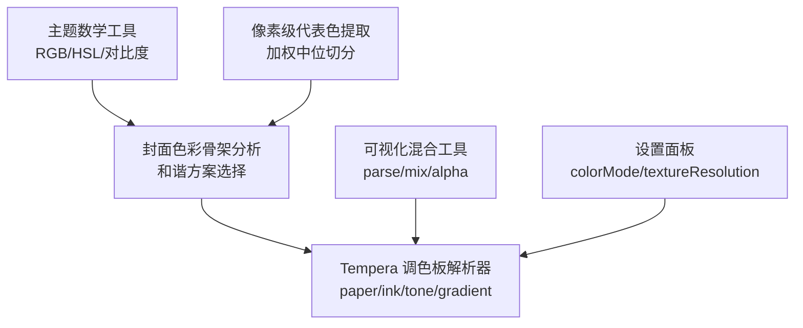
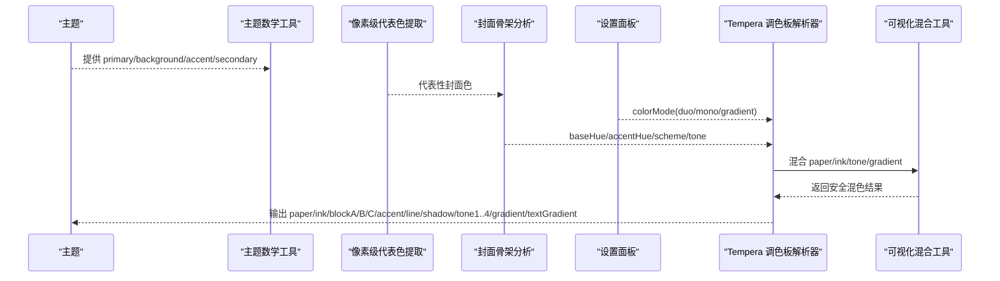
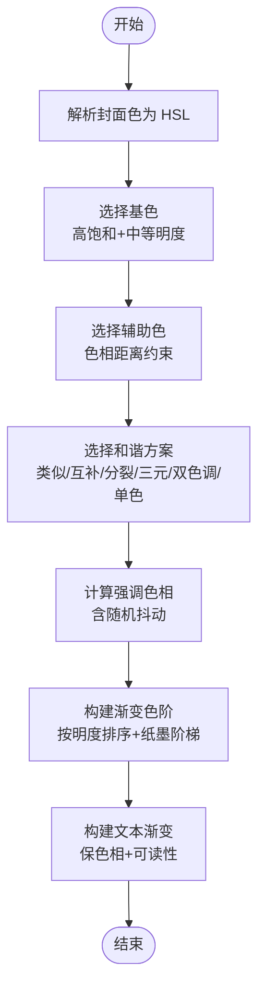
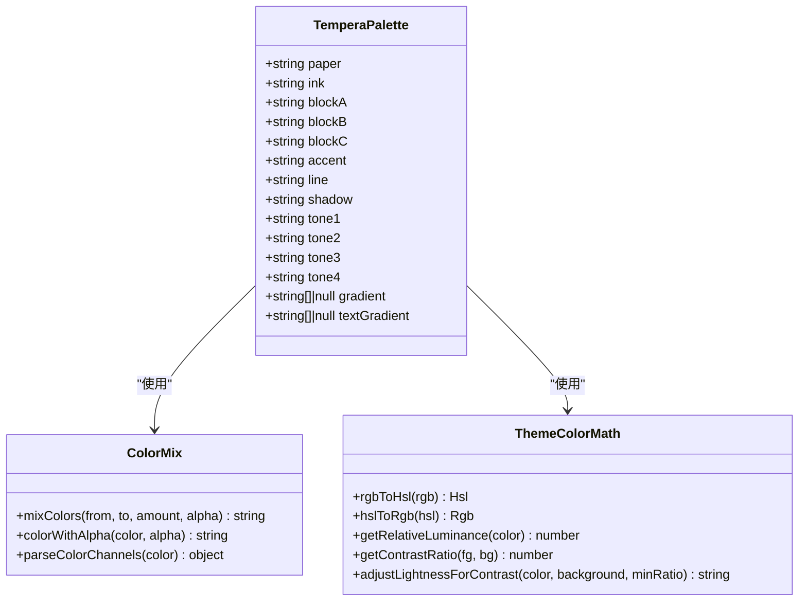
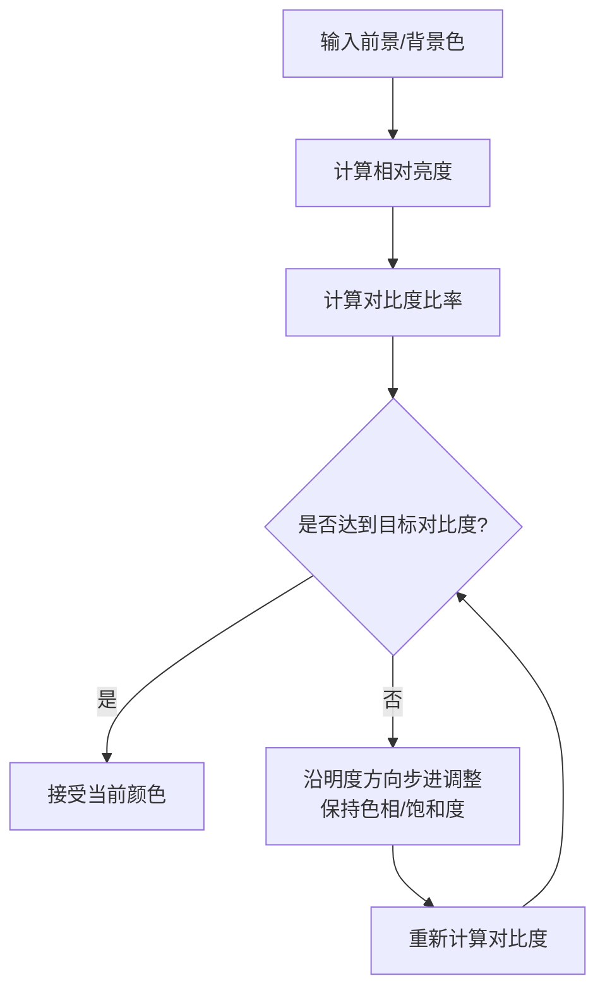
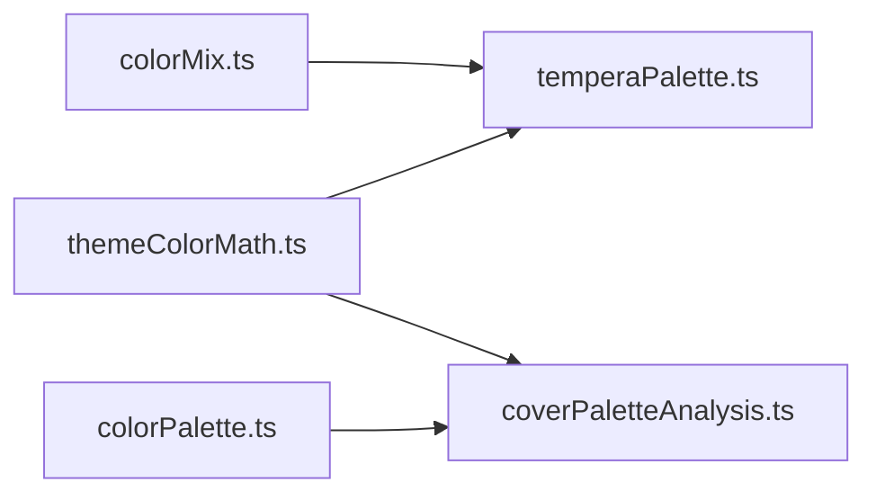

# 色彩系统与调色板

<cite>
**本文引用的文件**   
- [temperaPalette.ts](file://src/components/visualizer/tempera/temperaPalette.ts)
- [colorMix.ts](file://src/components/visualizer/colorMix.ts)
- [themeColorMath.ts](file://src/utils/themeColorMath.ts)
- [colorPalette.ts](file://src/utils/colorPalette.ts)
- [colorExtractor.ts](file://src/utils/colorExtractor.ts)
- [coverPaletteAnalysis.ts](file://src/utils/builtinTheme/coverPaletteAnalysis.ts)
- [TemperaSettingsPanel.tsx](file://src/components/visualizer/tempera/TemperaNSettingsPanel.tsx)
</cite>

## 目录
1. [引言](#引言)
2. [项目结构](#项目结构)
3. [核心组件](#核心组件)
4. [架构总览](#架构总览)
5. [详细组件分析](#详细组件分析)
6. [依赖关系分析](#依赖关系分析)
7. [性能考量](#性能考量)
8. [故障排查指南](#故障排查指南)
9. [结论](#结论)
10. [附录：最佳实践与自定义调色板](#附录最佳实践与自定义调色板)

## 引言
本文面向 Tempera 模式的色彩系统，系统性说明其调色板生成算法、色彩模式、色彩空间转换、对比度与无障碍策略，以及如何在可视化中应用色彩心理学。文档同时给出可操作的自定义调色板创建方法与配置最佳实践，帮助开发者在保持可读性与主题一致性的前提下，构建高质量的音乐可视化体验。

## 项目结构
Tempera 的色彩系统由“主题数学工具”“像素级代表色提取”“封面色彩骨架分析”“Tempera 调色板解析器”和“可视化混合工具”共同组成。整体职责划分如下：
- 主题数学工具：负责 RGB/HSL 转换、相对亮度、对比度计算、色相距离与明度调整。
- 像素级代表色提取：从图像像素中提取有代表性的颜色集合。
- 封面色彩骨架分析：根据封面主色与辅助色选择和谐方案（类似、互补、分裂、三元、双色调、单色）。
- Tempera 调色板解析器：基于主题侧与封面色，输出纸张、墨水、色阶、渐变、文本渐变等字段。
- 可视化混合工具：提供安全的颜色解析、混合与透明度封装。
- 设置面板：暴露三色模式（双色、黑白灰、封面渐变）与纹理分辨率等选项。

**图表来源**
- [themeColorMath.ts:11-182](file://src/utils/themeColorMath.ts#L11-L182)
- [colorPalette.ts:16-142](file://src/utils/colorPalette.ts#L16-L142)
- [coverPaletteAnalysis.ts:19-132](file://src/utils/builtinTheme/coverPaletteAnalysis.ts#L19-L132)
- [temperaPalette.ts:37-224](file://src/components/visualizer/tempera/temperaPalette.ts#L37-L224)
- [colorMix.ts:13-101](file://src/components/visualizer/colorMix.ts#L13-L101)
- [TemperaSettingsPanel.tsx:27-31](file://src/components/visualizer/tempera/TemperaNSettingsPanel.tsx#L27-L31)

**章节来源**
- [themeColorMath.ts:11-182](file://src/utils/themeColorMath.ts#L11-L182)
- [colorPalette.ts:16-142](file://src/utils/colorPalette.ts#L16-L142)
- [coverPaletteAnalysis.ts:19-132](file://src/utils/builtinTheme/coverPaletteAnalysis.ts#L19-L132)
- [temperaPalette.ts:37-224](file://src/components/visualizer/tempera/temperaPalette.ts#L37-L224)
- [colorMix.ts:13-101](file://src/components/visualizer/colorMix.ts#L13-L101)
- [TemperaSettingsPanel.tsx:27-31](file://src/components/visualizer/tempera/TemperaNSettingsPanel.tsx#L27-L31)

## 核心组件
- 主题数学工具：实现 RGB↔HSL 转换、十六进制互转、相对亮度与 WCAG 对比度、色相距离、按背景自动调亮度的求解器。
- 像素级代表色提取：使用加权中位切分算法，对图像像素进行量化、桶分割与权重平均，得到代表性颜色。
- 封面色彩骨架分析：从封面色中选择基色与辅助色，决定和谐方案与色调倾向，为内置主题生成提供骨架。
- Tempera 调色板解析器：将主题与封面色映射到 paper/ink/tone/gradient/textGradient 等语义化字段，支持 mono/duo/gradient 三种模式。
- 可视化混合工具：安全解析 hex/rgb/rgba，线性混合通道值，并统一处理透明度。
- 设置面板：暴露 colorMode（duo/mono/gradient）、纹理分辨率、场景开关等参数。

**章节来源**
- [themeColorMath.ts:11-182](file://src/utils/themeColorMath.ts#L11-L182)
- [colorPalette.ts:16-142](file://src/utils/colorPalette.ts#L16-L142)
- [coverPaletteAnalysis.ts:19-132](file://src/utils/builtinTheme/coverPaletteAnalysis.ts#L19-L132)
- [temperaPalette.ts:37-224](file://src/components/visualizer/tempera/temperaPalette.ts#L37-L224)
- [colorMix.ts:13-101](file://src/components/visualizer/colorMix.ts#L13-L101)
- [TemperaSettingsPanel.tsx:27-31](file://src/components/visualizer/tempera/TemperaNSettingsPanel.tsx#L27-L31)

## 架构总览
下图展示从主题与封面到最终调色板的完整数据流：主题数学工具提供基础能力；像素级代表色提取与封面骨架分析共同产出封面色与和谐方案；Tempera 调色板解析器结合用户选择的 colorMode 输出最终调色板；可视化混合工具贯穿所有颜色操作。

**图表来源**
- [themeColorMath.ts:11-182](file://src/utils/themeColorMath.ts#L11-L182)
- [colorPalette.ts:16-142](file://src/utils/colorPalette.ts#L16-L142)
- [coverPaletteAnalysis.ts:19-132](file://src/utils/builtinTheme/coverPaletteAnalysis.ts#L19-L132)
- [temperaPalette.ts:156-224](file://src/components/visualizer/tempera/temperaPalette.ts#L156-L224)
- [colorMix.ts:13-101](file://src/components/visualizer/colorMix.ts#L13-L101)
- [TemperaSettingsPanel.tsx:27-31](file://src/components/visualizer/tempera/TemperaNSettingsPanel.tsx#L27-L31)

## 详细组件分析

### 调色板生成算法
- 主题色提取与和谐方案选择
  - 从封面色中挑选高饱和度且中等明度的“基色”，再寻找满足色相距离约束的“辅助色”。
  - 根据基色饱和度与随机性选择和谐方案：类似、互补、分裂、三元、双色调或单色。
  - 计算强调色相，考虑随机抖动以增强多样性。
- 互补色与渐变色生成
  - 互补色通过色相距离与方案规则推导，而非简单 180° 翻转，避免极端不协调。
  - 渐变色按明度排序后映射到固定纸墨阶梯，保证视觉层次稳定。
- 文本渐变与可读性保障
  - 文本渐变保留封面色相，仅强制与纸张的明度差阈值，避免被压成灰阶。
  - 当主题主色与背景对比不足时，墨水会被推向相反端并保持少量主题色相。

**图表来源**
- [coverPaletteAnalysis.ts:19-132](file://src/utils/builtinTheme/coverPaletteAnalysis.ts#L19-L132)
- [temperaPalette.ts:109-154](file://src/components/visualizer/tempera/temperaPalette.ts#L109-L154)

**章节来源**
- [coverPaletteAnalysis.ts:19-132](file://src/utils/builtinTheme/coverPaletteAnalysis.ts#L19-L132)
- [temperaPalette.ts:109-154](file://src/components/visualizer/tempera/temperaPalette.ts#L109-L154)

### 色彩模式：纯色填充、渐变填充、纹理填充与动态色彩变化
- 纯色填充
  - 双色模式（duo）下，blockA/B/C 由 paper 与主题强调/次强调色混合而成，保持稳定的明度阶梯。
  - 黑白灰模式（mono）将所有步骤压缩为灰阶，确保色相不泄漏。
- 渐变填充
  - 封面渐变模式（gradient）下，四色渐变按明度排序，并与主题色混合，保留封面主导的同时体现用户主题。
  - 形状填充读取 gradient 字段构建线性渐变，而非纯色。
- 纹理填充
  - tone1..tone4 作为网点密度映射的阶梯，配合纹理分辨率控制渲染质量与性能。
- 动态色彩变化
  - 文字动态反色开关可在不同背景下切换前景/背景，提升可读性。
  - 场景转场开关允许在不同构图间平滑过渡，配合相机强度与字形运动增强动感。

**图表来源**
- [temperaPalette.ts:7-32](file://src/components/visualizer/tempera/temperaPalette.ts#L7-L32)
- [colorMix.ts:13-101](file://src/components/visualizer/colorMix.ts#L13-L101)
- [themeColorMath.ts:11-182](file://src/utils/themeColorMath.ts#L11-L182)

**章节来源**
- [temperaPalette.ts:156-224](file://src/components/visualizer/tempera/temperaPalette.ts#L156-L224)
- [TemperaSettingsPanel.tsx:27-31](file://src/components/visualizer/tempera/TemperaNSettingsPanel.tsx#L27-L31)

### 色彩空间转换：RGB、HSL、LAB
- 已实现
  - RGB↔HSL 转换、十六进制互转、相对亮度与对比度计算、色相距离与明度调整。
- 未实现
  - LAB 颜色空间转换在当前仓库中未发现实现。若需 LAB，建议引入标准转换库或在 themeColorMath.ts 中扩展 rgbToLab/labToRgb/hslToLab/labToHsl 等方法，并在 coverPaletteAnalysis.ts 与 temperaPalette.ts 中按需调用。

**章节来源**
- [themeColorMath.ts:11-182](file://src/utils/themeColorMath.ts#L11-L182)

### 色彩心理学在可视化中的应用
- 情绪表达
  - 类似与双色调方案适合温暖、柔和的情绪；互补与分裂方案更具张力与戏剧性；单色方案强调结构与节奏。
- 视觉层次
  - 通过 paper/ink/tone1..4 的明度阶梯建立清晰的层级，确保图形与文字的可读性。
- 信息传达
  - 渐变模式让封面色承载主要信息，而主题色维持品牌一致性；文本渐变在保色的同时保证可读性。

[本节为概念性内容，不直接分析具体文件]

### 色彩一致性检查：对比度验证、无障碍访问与色彩盲友好设计
- 对比度验证
  - 使用相对亮度与 WCAG 对比度公式评估前景与背景的对比度。
  - 当主题主色与背景对比不足时，墨水会被推至相反端并保留少量主题色相，确保可读性。
- 无障碍访问
  - 黑白灰模式确保色盲用户也能感知层次；文本动态反色进一步提升在不同背景下的可读性。
- 色彩盲友好设计
  - 避免仅依赖单一色相区分信息；通过明度阶梯与纹理密度传递额外维度。

**图表来源**
- [themeColorMath.ts:111-181](file://src/utils/themeColorMath.ts#L111-L181)
- [temperaPalette.ts:62-67](file://src/components/visualizer/tempera/temperaPalette.ts#L62-L67)

**章节来源**
- [themeColorMath.ts:111-181](file://src/utils/themeColorMath.ts#L111-L181)
- [temperaPalette.ts:62-67](file://src/components/visualizer/tempera/temperaPalette.ts#L62-L67)

## 依赖关系分析
- 模块耦合
  - temperaPalette.ts 依赖 colorMix.ts 与 themeColorMath.ts，用于安全混色与对比度/明度计算。
  - coverPaletteAnalysis.ts 依赖 themeColorMath.ts，用于 HSL 与色相距离计算。
  - colorPalette.ts 独立于其他模块，提供像素级代表色提取。
- 外部依赖
  - 无第三方颜色库依赖，全部为原生 JS 实现。
- 潜在循环依赖
  - 当前依赖方向清晰，未见循环依赖。

**图表来源**
- [temperaPalette.ts:1-3](file://src/components/visualizer/tempera/temperaPalette.ts#L1-L3)
- [coverPaletteAnalysis.ts:1-2](file://src/utils/builtinTheme/coverPaletteAnalysis.ts#L1-L2)
- [colorPalette.ts:1-2](file://src/utils/colorPalette.ts#L1-L2)

**章节来源**
- [temperaPalette.ts:1-3](file://src/components/visualizer/tempera/temperaPalette.ts#L1-L3)
- [coverPaletteAnalysis.ts:1-2](file://src/utils/builtinTheme/coverPaletteAnalysis.ts#L1-L2)
- [colorPalette.ts:1-2](file://src/utils/colorPalette.ts#L1-L2)

## 性能考量
- 像素采样优化
  - 图像加载后缩放到 50×50 以降低内存与计算压力。
  - 加权中位切分算法按桶权重与通道范围选择分割轴，减少不必要的细分。
- 纹理分辨率
  - 纹理分辨率越高，细节越丰富但性能开销越大；建议在移动端或低配设备上降低该值。
- 对比度调整步长
  - 明度调整采用固定步长与最大步数限制，避免无限循环。

**章节来源**
- [colorExtractor.ts:11-41](file://src/utils/colorExtractor.ts#L11-L41)
- [colorPalette.ts:76-142](file://src/utils/colorPalette.ts#L76-L142)
- [TemperaSettingsPanel.tsx:85-99](file://src/components/visualizer/tempera/TemperaNSettingsPanel.tsx#L85-L99)
- [themeColorMath.ts:142-181](file://src/utils/themeColorMath.ts#L142-L181)

## 故障排查指南
- 主题主色与背景对比不足
  - 现象：歌词或关键元素不可读。
  - 处理：墨水会被推至相反端并保留少量主题色相；若仍不足，请检查主题配置或启用黑白灰模式。
- 文本渐变可读性差
  - 现象：文本渐变与背景接近导致难以辨认。
  - 处理：系统会强制文本渐变与纸张的明度差阈值；若仍不理想，可开启文字动态反色。
- 渐变顺序错乱
  - 现象：渐变未按明度排序导致视觉跳跃。
  - 处理：系统会对源色按明度排序后再映射到纸墨阶梯；检查输入色是否包含无效值。
- 性能问题
  - 现象：帧率下降或卡顿。
  - 处理：降低纹理分辨率；减少覆盖色数量；关闭不必要的装饰元素。

**章节来源**
- [temperaPalette.ts:62-67](file://src/components/visualizer/tempera/temperaPalette.ts#L62-L67)
- [temperaPalette.ts:126-135](file://src/components/visualizer/tempera/temperaPalette.ts#L126-L135)
- [temperaPalette.ts:109-118](file://src/components/visualizer/tempera/temperaPalette.ts#L109-L118)
- [TemperaSettingsPanel.tsx:85-99](file://src/components/visualizer/tempera/TemperaNSettingsPanel.tsx#L85-L99)

## 结论
Tempera 的色彩系统以主题数学工具为基础，结合像素级代表色提取与封面骨架分析，输出语义化的调色板。通过三色模式（双色、黑白灰、封面渐变），系统在保真主题与封面色的同时，确保可读性与无障碍访问。对比度验证与明度调整机制保障了视觉一致性，而纹理与动态效果增强了表现力。未来可扩展 LAB 空间以提升色彩科学精度。

[本节为总结性内容，不直接分析具体文件]

## 附录：最佳实践与自定义调色板
- 自定义调色板创建方法
  - 准备主题：定义 backgroundColor、primaryColor、accentColor、secondaryColor。
  - 提取封面色：使用 extractRepresentativeColors 或 extractColors 获取代表性颜色。
  - 选择和谐方案：依据封面基色与辅助色选择类似/互补/分裂/三元/双色调/单色。
  - 生成调色板：调用 resolveTemperaPalette，传入主题、colorMode 与封面色。
- 配置最佳实践
  - 始终验证对比度：使用 getContrastRatio 与 adjustLightnessForContrast 确保可读性。
  - 合理使用渐变：在 gradient 模式下优先使用封面色承载信息，主题色维持品牌一致性。
  - 控制纹理分辨率：根据设备性能调整 textureResolution，平衡细节与流畅度。
  - 关注无障碍：启用黑白灰模式与文字动态反色，提升色盲用户与复杂背景下的可读性。

**章节来源**
- [colorExtractor.ts:108-119](file://src/utils/colorExtractor.ts#L108-L119)
- [temperaPalette.ts:156-224](file://src/components/visualizer/tempera/temperaPalette.ts#L156-L224)
- [themeColorMath.ts:111-181](file://src/utils/themeColorMath.ts#L111-L181)
- [TemperaSettingsPanel.tsx:27-31](file://src/components/visualizer/tempera/TemperaNSettingsPanel.tsx#L27-L31)