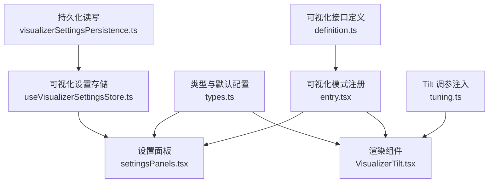
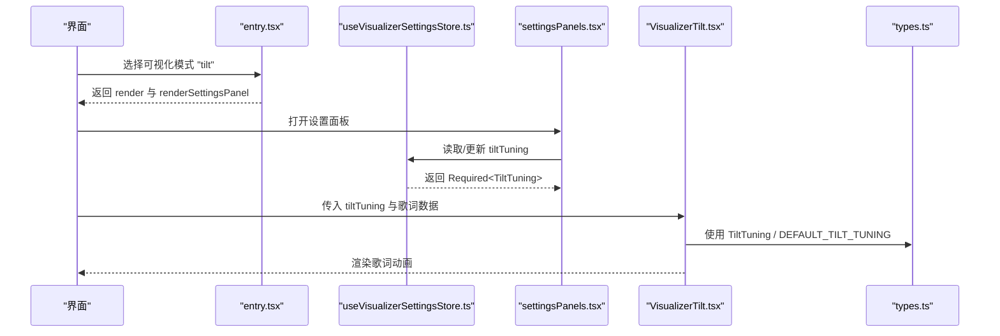
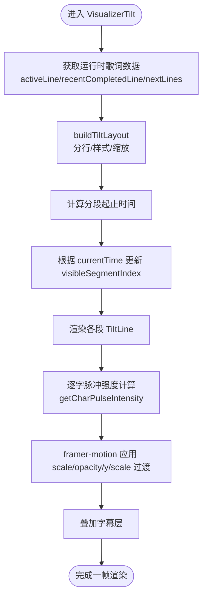
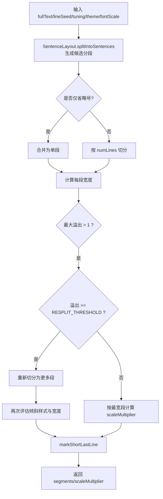
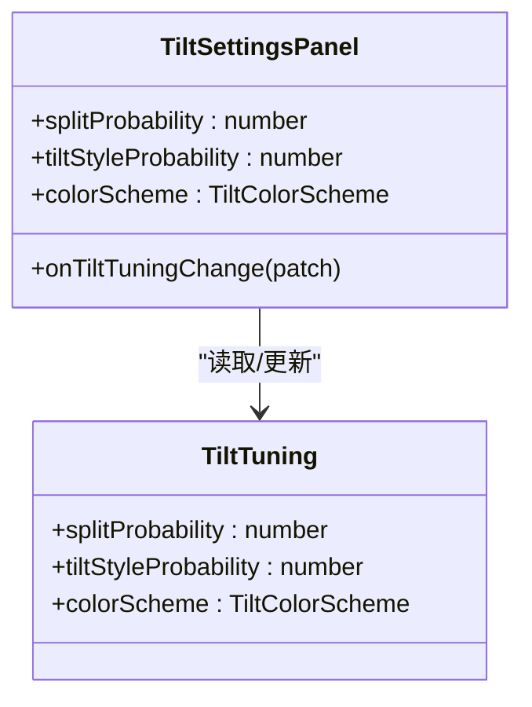
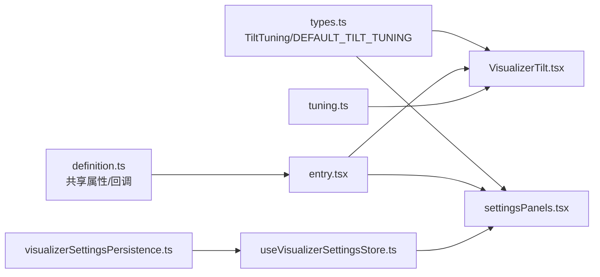
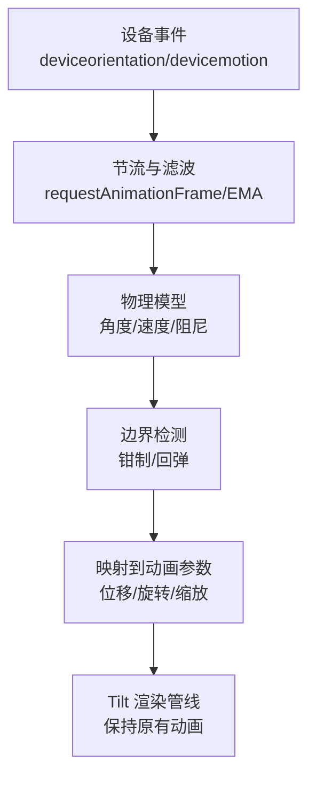

# Tilt模式实现

<cite>
**本文引用的文件**   
- [VisualizerTilt.tsx](file://src/components/visualizer/tilt/VisualizerTilt.tsx)
- [entry.tsx](file://src/components/visualizer/tilt/entry.tsx)
- [tuning.ts](file://src/components/visualizer/tilt/tuning.ts)
- [settingsPanels.tsx](file://src/components/visualizer/settingsPanels.tsx)
- [types.ts](file://src/types.ts)
- [definition.ts](file://src/components/visualizer/definition.ts)
- [useVisualizerSettingsStore.ts](file://src/stores/useVisualizerSettingsStore.ts)
- [visualizerSettingsPersistence.ts](file://src/stores/visualizerSettingsPersistence.ts)
</cite>

## 目录
1. [简介](#简介)
2. [项目结构](#项目结构)
3. [核心组件](#核心组件)
4. [架构总览](#架构总览)
5. [详细组件分析](#详细组件分析)
6. [依赖关系分析](#依赖关系分析)
7. [性能与移动端适配](#性能与移动端适配)
8. [故障排查](#故障排查)
9. [结论](#结论)
10. [附录：自定义开发指南](#附录自定义开发指南)

## 简介
本文件为“Tilt”可视化模式的完整技术文档。Tilt 是一个以歌词排版为核心的视觉模式，通过概率化分行、样式选择、逐字缩放脉冲和时序入场动画，营造富有节奏感的歌词呈现效果。需要特别说明的是：当前仓库中的 Tilt 模式并非基于设备陀螺仪或加速度计的物理倾斜驱动；其“倾斜”体现在文本排版与动画风格上，而非真实物理模拟。因此，本文在解释“物理模拟、惯性计算、重力感应”等概念时，会明确区分“实际实现”与“扩展建议”，避免误导。

## 项目结构
Tilt 模式位于可视化子系统下，采用“模式入口 + 渲染组件 + 调参面板 + 类型定义”的分层组织方式：

**图表来源**
- [entry.tsx:9-22](file://src/components/visualizer/tilt/entry.tsx#L9-L22)
- [VisualizerTilt.tsx:1-15](file://src/components/visualizer/tilt/VisualizerTilt.tsx#L1-L15)
- [settingsPanels.tsx:805-820](file://src/components/visualizer/settingsPanels.tsx#L805-L820)
- [types.ts:486-498](file://src/types.ts#L486-L498)
- [definition.ts:86-129](file://src/components/visualizer/definition.ts#L86-L129)
- [useVisualizerSettingsStore.ts:10-44](file://src/stores/useVisualizerSettingsStore.ts#L10-L44)
- [visualizerSettingsPersistence.ts:561-577](file://src/stores/visualizerSettingsPersistence.ts#L561-L577)
- [tuning.ts:1-4](file://src/components/visualizer/tilt/tuning.ts#L1-L4)

**章节来源**
- [entry.tsx:1-23](file://src/components/visualizer/tilt/entry.tsx#L1-L23)
- [VisualizerTilt.tsx:1-702](file://src/components/visualizer/tilt/VisualizerTilt.tsx#L1-L702)
- [settingsPanels.tsx:805-820](file://src/components/visualizer/settingsPanels.tsx#L805-L820)
- [types.ts:486-498](file://src/types.ts#L486-L498)
- [definition.ts:86-129](file://src/components/visualizer/definition.ts#L86-L129)
- [useVisualizerSettingsStore.ts:10-44](file://src/stores/useVisualizerSettingsStore.ts#L10-L44)
- [visualizerSettingsPersistence.ts:561-577](file://src/stores/visualizerSettingsPersistence.ts#L561-L577)
- [tuning.ts:1-4](file://src/components/visualizer/tilt/tuning.ts#L1-L4)

## 核心组件
- 模式入口 entry.tsx：将 Tilt 注册到可视化系统，指定渲染函数、设置面板、重置逻辑与预览参数。
- 渲染组件 VisualizerTilt.tsx：负责歌词布局、分段显示、逐字动画、颜色方案与字幕叠加。
- 设置面板 settingsPanels.tsx：提供 splitProbability、tiltStyleProbability、colorScheme 的滑块与下拉控制。
- 类型与默认配置 types.ts：定义 TiltTuning、TiltColorScheme 与 DEFAULT_TILT_TUNING。
- 可视化接口 definition.ts：声明共享属性、回调与重置能力，确保各模式统一接入。
- 设置存储 useVisualizerSettingsStore.ts：集中管理可视化模式与调参状态。
- 持久化 visualizerSettingsPersistence.ts：读写本地存储的 Tilt 调参。
- 调参注入 tuning.ts：将 tiltTuning 注入到渲染属性中。

**章节来源**
- [entry.tsx:9-22](file://src/components/visualizer/tilt/entry.tsx#L9-L22)
- [VisualizerTilt.tsx:540-702](file://src/components/visualizer/tilt/VisualizerTilt.tsx#L540-L702)
- [settingsPanels.tsx:805-820](file://src/components/visualizer/settingsPanels.tsx#L805-L820)
- [types.ts:486-498](file://src/types.ts#L486-L498)
- [definition.ts:86-129](file://src/components/visualizer/definition.ts#L86-L129)
- [useVisualizerSettingsStore.ts:10-44](file://src/stores/useVisualizerSettingsStore.ts#L10-L44)
- [visualizerSettingsPersistence.ts:561-577](file://src/stores/visualizerSettingsPersistence.ts#L561-L577)
- [tuning.ts:1-4](file://src/components/visualizer/tilt/tuning.ts#L1-L4)

## 架构总览
Tilt 模式遵循可视化子系统的标准接入流程：

**图表来源**
- [entry.tsx:9-22](file://src/components/visualizer/tilt/entry.tsx#L9-L22)
- [settingsPanels.tsx:805-820](file://src/components/visualizer/settingsPanels.tsx#L805-L820)
- [useVisualizerSettingsStore.ts:10-44](file://src/stores/useVisualizerSettingsStore.ts#L10-L44)
- [VisualizerTilt.tsx:540-702](file://src/components/visualizer/tilt/VisualizerTilt.tsx#L540-L702)
- [types.ts:486-498](file://src/types.ts#L486-L498)

## 详细组件分析

### 渲染组件 VisualizerTilt.tsx
该组件是 Tilt 的核心，承担以下职责：
- 歌词行解析与时间线同步：从运行时获取 activeLine、recentCompletedLine、nextLines，并依据 getLineRenderEndTime 确定行渲染结束时间。
- 布局算法：根据 fullText、lineSeed、tiltTuning、theme、lyricsFontScale 构建 TiltLayout，决定分行数量、是否启用倾斜样式、缩放比例与短尾行标记。
- 分段可见性：按 segmentTimings 与 currentTime 推进 visibleSegmentIndex，实现段落顺序入场。
- 逐字动画：对每个 grapheme 计算字符级脉冲强度，使用 MotionValue 驱动 scale 变化，形成节拍感。
- 颜色方案：支持 default、swap、accentAll、primaryAll 四种配色策略。
- 字幕叠加：通过 VisualizerSubtitleOverlay 展示翻译与下一行提示。

关键处理流程如下：

**图表来源**
- [VisualizerTilt.tsx:565-627](file://src/components/visualizer/tilt/VisualizerTilt.tsx#L565-L627)
- [VisualizerTilt.tsx:378-429](file://src/components/visualizer/tilt/VisualizerTilt.tsx#L378-L429)
- [VisualizerTilt.tsx:631-697](file://src/components/visualizer/tilt/VisualizerTilt.tsx#L631-L697)

#### 布局与分行算法
- 分行数量由 determineLineCount 决定，基于字符数对数归一化、随机抖动与 splitProbability 综合评分，输出 1-4 行。
- 倾斜样式选择：按 tiltStyleProbability 随机挑选一段作为倾斜样式（斜体、更大字号、交错上下偏移）。
- 溢出处理：若最宽段超过可用宽度，则触发重分或缩放，保证不越界；存在最小缩放下限（正常模式与倾斜模式不同）。
- 短尾行标记：最后一段若明显短于前一段且非倾斜样式，标记 isShortLastLine，用于字体放大补偿。

**图表来源**
- [VisualizerTilt.tsx:20-28](file://src/components/visualizer/tilt/VisualizerTilt.tsx#L20-L28)
- [VisualizerTilt.tsx:211-332](file://src/components/visualizer/tilt/VisualizerTilt.tsx#L211-L332)

**章节来源**
- [VisualizerTilt.tsx:20-28](file://src/components/visualizer/tilt/VisualizerTilt.tsx#L20-L28)
- [VisualizerTilt.tsx:211-332](file://src/components/visualizer/tilt/VisualizerTilt.tsx#L211-L332)
- [VisualizerTilt.tsx:334-538](file://src/components/visualizer/tilt/VisualizerTilt.tsx#L334-L538)
- [VisualizerTilt.tsx:540-702](file://src/components/visualizer/tilt/VisualizerTilt.tsx#L540-L702)

### 设置面板与调参
Tilt 的设置面板暴露三个可调参数：
- splitProbability：控制分行概率，值越高越容易多行。
- tiltStyleProbability：控制某段被选为倾斜样式的概率。
- colorScheme：default、swap、accentAll、primaryAll 四种配色。

面板内部会将传入的 Partial<TiltTuning> 规范化为 Required<TiltTuning>，并对数值进行边界钳制。

**图表来源**
- [settingsPanels.tsx:805-820](file://src/components/visualizer/settingsPanels.tsx#L805-L820)
- [types.ts:486-498](file://src/types.ts#L486-L498)

**章节来源**
- [settingsPanels.tsx:805-820](file://src/components/visualizer/settingsPanels.tsx#L805-L820)
- [types.ts:486-498](file://src/types.ts#L486-L498)

### 类型与默认配置
- TiltTuning：包含 splitProbability、tiltStyleProbability、colorScheme。
- DEFAULT_TILT_TUNING：默认值为 splitProbability=0.75、tiltStyleProbability=0.35、colorScheme='default'。
- TiltColorScheme：'default' | 'swap' | 'accentAll' | 'primaryAll'。

这些类型贯穿设置面板、渲染组件与持久化模块，确保类型安全与一致性。

**章节来源**
- [types.ts:486-498](file://src/types.ts#L486-L498)

### 模式注册与调参注入
- entry.tsx 使用 defineVisualizer 注册 Tilt，指定 mode、order、labelKey、previewSeed、render、renderSettingsPanel、resetSettings。
- tuning.ts 使用 defineVisualizerTuning 将 tiltTuning 注入到渲染属性中，键名为 tiltTuning，setter 为 handleSetTiltTuning。

**章节来源**
- [entry.tsx:9-22](file://src/components/visualizer/tilt/entry.tsx#L9-L22)
- [tuning.ts:1-4](file://src/components/visualizer/tilt/tuning.ts#L1-L4)

## 依赖关系分析
Tilt 模式依赖可视化子系统的通用基础设施：

**图表来源**
- [types.ts:486-498](file://src/types.ts#L486-L498)
- [definition.ts:86-129](file://src/components/visualizer/definition.ts#L86-L129)
- [entry.tsx:9-22](file://src/components/visualizer/tilt/entry.tsx#L9-L22)
- [settingsPanels.tsx:805-820](file://src/components/visualizer/settingsPanels.tsx#L805-L820)
- [useVisualizerSettingsStore.ts:10-44](file://src/stores/useVisualizerSettingsStore.ts#L10-L44)
- [visualizerSettingsPersistence.ts:561-577](file://src/stores/visualizerSettingsPersistence.ts#L561-L577)
- [tuning.ts:1-4](file://src/components/visualizer/tilt/tuning.ts#L1-L4)

**章节来源**
- [definition.ts:86-129](file://src/components/visualizer/definition.ts#L86-L129)
- [entry.tsx:9-22](file://src/components/visualizer/tilt/entry.tsx#L9-L22)
- [settingsPanels.tsx:805-820](file://src/components/visualizer/settingsPanels.tsx#L805-L820)
- [useVisualizerSettingsStore.ts:10-44](file://src/stores/useVisualizerSettingsStore.ts#L10-L44)
- [visualizerSettingsPersistence.ts:561-577](file://src/stores/visualizerSettingsPersistence.ts#L561-L577)
- [tuning.ts:1-4](file://src/components/visualizer/tilt/tuning.ts#L1-L4)

## 性能与移动端适配
- 动画系统：使用 framer-motion 的 motionValue 与 transition 曲线 [0.25, 0.46, 0.45, 0.94]，配合延迟与时长控制，实现平滑的逐字与段落入场。
- 字符级脉冲：通过 getCharPulseIntensity 计算正弦包络与余晖衰减，限制持续时间范围，避免极端值导致抖动。
- 布局测量：measureAtSize 使用 prepareWithSegments 与 layoutWithLines 估算文本宽度，结合可用宽度动态缩放，减少换行与溢出。
- 移动端适配：
  - 可用宽度取 window.innerWidth 的 85%，并设置最小宽度 320。
  - 字号使用 clamp 响应式单位，兼顾小屏与大屏。
  - 倾斜样式行采用 italic、更轻字重与更大字间距，提升可读性。
- 电池与帧率：Tilt 本身为 DOM/CSS 动画，不涉及 WebGL 或高频传感器采样；如需进一步节能，可在外层容器降低刷新频率或使用 requestAnimationFrame 节流。

[本节为通用指导，不直接分析具体代码文件]

## 故障排查
- 歌词未显示：检查 activeLine 是否为空；确认 useVisualizerRuntime 已正确传入 currentTime/currentLineIndex/lines/getLineRenderEndTime。
- 分段未按序出现：检查 segmentTimings 与 visibleSegmentIndex 更新逻辑，确认 currentTime.on('change') 订阅未被提前取消。
- 文字溢出或过小：调整 splitProbability 与 tiltStyleProbability；必要时增大 lyricsFontScale 或减小 colorScheme 对比度。
- 设置未持久化：确认 useVisualizerSettingsStore 与 visualizerSettingsPersistence 的读写路径正常，且 readStoredTiltTuning 返回默认值时的字段齐全。

**章节来源**
- [VisualizerTilt.tsx:565-627](file://src/components/visualizer/tilt/VisualizerTilt.tsx#L565-L627)
- [settingsPanels.tsx:805-820](file://src/components/visualizer/settingsPanels.tsx#L805-L820)
- [visualizerSettingsPersistence.ts:561-577](file://src/stores/visualizerSettingsPersistence.ts#L561-L577)

## 结论
Tilt 模式是一个以歌词排版与动画为核心的可视化模式，强调概率化分行、样式选择与逐字脉冲，整体实现简洁、可配置性强，并与可视化子系统的设置与持久化机制无缝集成。它不依赖设备物理传感器，而是通过时间与布局算法驱动视觉效果。对于希望引入真实物理倾斜的用户，可在现有基础上扩展传感器输入与物理模型，但需谨慎处理节流、边界与性能问题。

[本节为总结性内容，不直接分析具体代码文件]

## 附录：自定义开发指南

### 扩展物理模拟与设备交互
虽然当前 Tilt 不使用陀螺仪或加速度计，但可按以下步骤扩展：
- 添加传感器节流：
  - 使用 requestAnimationFrame 或固定间隔（如 16ms）采样 deviceorientation/devicemotion。
  - 对原始数据进行低通滤波（例如指数移动平均），避免抖动。
- 计算角度与位置：
  - 从设备事件提取 alpha/beta/gamma 或加速度向量，转换为屏幕坐标系下的倾斜角。
  - 使用 smoothDamp 或二阶弹簧模型计算目标角度与速度，限制最大变化速率。
- 边界检测：
  - 将角度映射到 [-π/2, π/2] 或自定义区间，超出时回弹或钳制。
  - 对位置偏移做视口边界约束，防止元素移出屏幕。
- 与 Tilt 动画耦合：
  - 将物理角度映射为文本位移、旋转或缩放参数。
  - 保持原有逐字脉冲与分段入场的时序，避免冲突。

[此图为概念流程图，不对应具体源码文件]

### 新增调参项
- 在 types.ts 扩展 TiltTuning，增加新字段（如 physicsStrength、sensorSensitivity）。
- 在 settingsPanels.tsx 的 TiltSettingsPanel 中添加对应控件，并在 Required<TiltTuning> 中提供默认值。
- 在 VisualizerTilt.tsx 的 buildTiltLayout 或 TiltLine 中使用新参数影响布局或动画。
- 在 visualizerSettingsPersistence.ts 的 readStoredTiltTuning 中兼容旧版本 JSON。

**章节来源**
- [types.ts:486-498](file://src/types.ts#L486-L498)
- [settingsPanels.tsx:805-820](file://src/components/visualizer/settingsPanels.tsx#L805-L820)
- [VisualizerTilt.tsx:211-332](file://src/components/visualizer/tilt/VisualizerTilt.tsx#L211-L332)
- [visualizerSettingsPersistence.ts:561-577](file://src/stores/visualizerSettingsPersistence.ts#L561-L577)