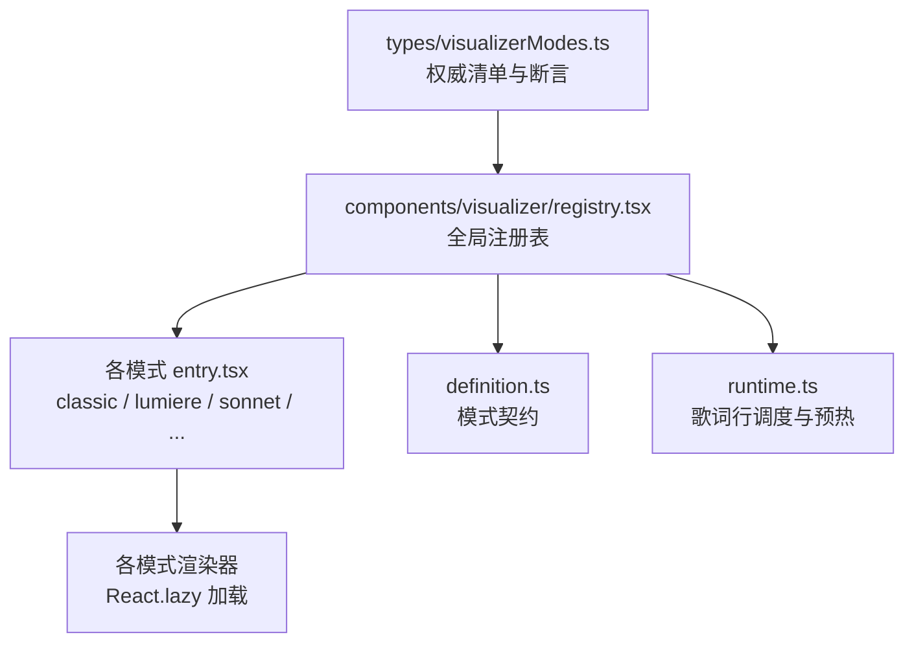
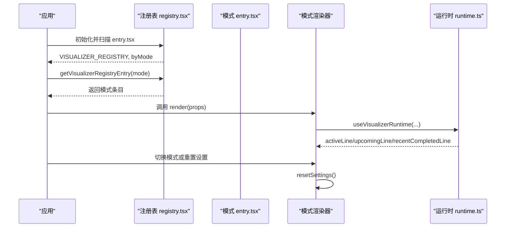
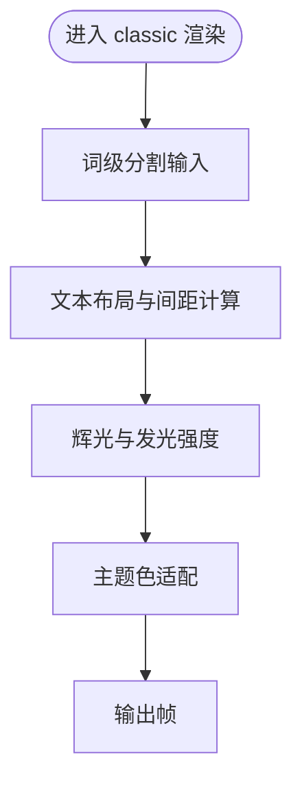
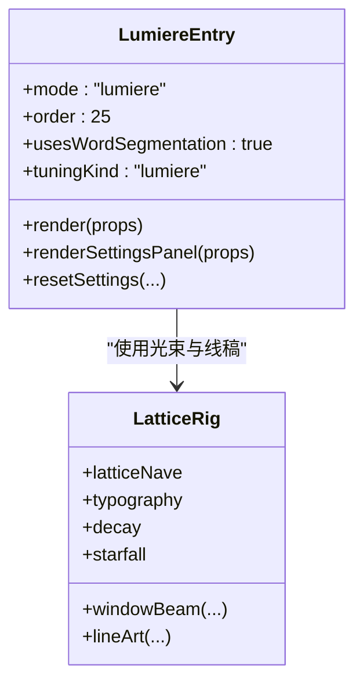
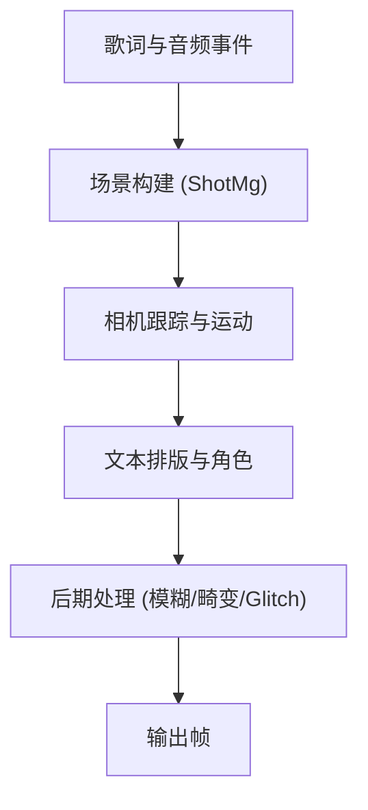
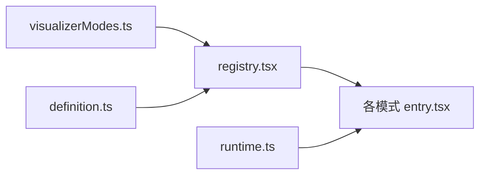

# 可视化模式实现

<cite>
**本文引用的文件**   
- [src/types/visualizerModes.ts](file://src/types/visualizerModes.ts)
- [src/components/visualizer/registry.tsx](file://src/components/visualizer/registry.tsx)
- [src/components/visualizer/definition.ts](file://src/components/visualizer/definition.ts)
- [src/components/visualizer/runtime.ts](file://src/components/visualizer/runtime.ts)
- [src/components/visualizer/classic/entry.tsx](file://src/components/visualizer/classic/entry.tsx)
- [src/components/visualizer/lumiere/entry.tsx](file://src/components/visualizer/lumiere/entry.tsx)
- [src/components/visualizer/sonnet/entry.tsx](file://src/components/visualizer/sonnet/entry.tsx)
- [src/components/visualizer/tempera/entry.tsx](file://src/components/visualizer/tempera/entry.tsx)
- [src/components/visualizer/diorama/entry.tsx](file://src/components/visualizer/diorama/entry.tsx)
- [src/components/visualizer/fume/entry.tsx](file://src/components/visualizer/fume/entry.tsx)
- [src/components/visualizer/pendolo/entry.tsx](file://src/components/visualizer/pendolo/entry.tsx)
- [src/components/visualizer/monet/entry.tsx](file://src/components/visualizer/monet/entry.tsx)
- [src/components/visualizer/cappella/entry.tsx](file://src/components/visualizer/cappella/entry.tsx)
- [src/components/visualizer/claddagh/entry.tsx](file://src/components/visualizer/claddagh/entry.tsx)
- [src/components/visualizer/partita/entry.tsx](file://src/components/visualizer/partita/entry.tsx)
- [src/components/visualizer/tilt/entry.tsx](file://src/components/visualizer/tilt/entry.tsx)
- [src/components/visualizer/still/entry.tsx](file://src/components/visualizer/still/entry.tsx)
- [src/components/visualizer/lumiere/rigs/lattice.ts](file://src/components/visualizer/lumiere/rigs/lattice.ts)
</cite>

## 目录
1. [简介](#简介)
2. [项目结构](#项目结构)
3. [核心组件](#核心组件)
4. [架构总览](#架构总览)
5. [详细组件分析](#详细组件分析)
6. [依赖关系分析](#依赖关系分析)
7. [性能考虑](#性能考虑)
8. [故障排查指南](#故障排查指南)
9. [结论](#结论)
10. [附录](#附录)

## 简介
本文件为 13 种内置可视化模式的实现技术文档，覆盖 classic、lumiere、sonnet、tempera、diorama、fume、pendolo、monet、cappella、claddagh、partita、tilt、still。文档聚焦以下目标：
- 解释每种模式的独特视觉特性与渲染管线（几何体生成、纹理映射、光照计算、后期处理）。
- 说明可视化模式的注册机制、参数配置、主题适配与性能调优。
- 阐述模式切换逻辑、过渡动画与状态管理。
- 给出自定义参数接口、性能基准与优化策略，以及开发新模式的完整指南。

## 项目结构
可视化子系统采用“按模式分目录 + 统一注册表”的组织方式：
- 每个模式位于 src/components/visualizer/<mode>/entry.tsx，通过 defineVisualizer 声明模式元数据与渲染入口。
- registry.tsx 使用 import.meta.glob 自动发现所有 entry.tsx，构建运行时注册表，并断言与权威清单一致。
- types/visualizerModes.ts 维护内建模式 ID 的权威清单，提供类型判定与一致性校验。
- definition.ts 定义 VisualizerRegistryEntry、设置面板与重置回调等公共契约。
- runtime.ts 提供歌词行调度、预热窗口等通用运行时辅助。

**图示来源**
- [src/types/visualizerModes.ts:15-30](file://src/types/visualizerModes.ts#L15-L30)
- [src/components/visualizer/registry.tsx:17-44](file://src/components/visualizer/registry.tsx#L17-L44)
- [src/components/visualizer/definition.ts:152-171](file://src/components/visualizer/definition.ts#L152-L171)
- [src/components/visualizer/runtime.ts:124-157](file://src/components/visualizer/runtime.ts#L124-L157)

**章节来源**
- [src/types/visualizerModes.ts:15-30](file://src/types/visualizerModes.ts#L15-L30)
- [src/components/visualizer/registry.tsx:17-44](file://src/components/visualizer/registry.tsx#L17-L44)

## 核心组件
- 权威清单与断言：集中声明内建模式 ID，并在注册阶段校验目录与清单的一致性，避免“静默缺失”。
- 注册表：负责发现、去重、排序、查询模式；支持运行时追加与移除 mod 投稿的模式。
- 模式契约：定义 mode、order、labelKey、previewSeed、tuningKind、usesWordSegmentation、render、renderSettingsPanel、resetSettings 等字段。
- 运行时辅助：提供当前行、即将行、最近完成行的选择与预热窗口判断，帮助渲染器在播放过程中高效准备下一帧。

**章节来源**
- [src/types/visualizerModes.ts:45-74](file://src/types/visualizerModes.ts#L45-L74)
- [src/components/visualizer/registry.tsx:19-40](file://src/components/visualizer/registry.tsx#L19-L40)
- [src/components/visualizer/definition.ts:152-171](file://src/components/visualizer/definition.ts#L152-L171)
- [src/components/visualizer/runtime.ts:35-120](file://src/components/visualizer/runtime.ts#L35-L120)

## 架构总览
可视化系统的关键流程如下：
- 启动时，registry.tsx 扫描 components/visualizer/*/entry.tsx，构建 VISUALIZER_REGISTRY 与 byMode 索引。
- 初始化断言 assertBuiltinModeList 确保清单与实际目录一致。
- 播放器或 UI 通过 getVisualizerRegistryEntry 获取当前模式渲染器，并通过 render 函数挂载 React 组件。
- 模式切换时，UI 层可触发 resetSettings 以恢复默认调参；部分模式通过 key={props.seed} 强制重建以重置内部状态。
- 运行时 runtime.ts 暴露 useVisualizerRuntime，供各模式消费当前行、即将行与最近完成行，配合预热窗口减少卡顿。

**图示来源**
- [src/components/visualizer/registry.tsx:17-44](file://src/components/visualizer/registry.tsx#L17-L44)
- [src/components/visualizer/registry.tsx:56-77](file://src/components/visualizer/registry.tsx#L56-L77)
- [src/components/visualizer/runtime.ts:124-157](file://src/components/visualizer/runtime.ts#L124-L157)

## 详细组件分析

### 经典模式（classic）
- 定位：基础歌词可视化模式，强调词级分割与经典发光排版。
- 注册特征：
  - mode: 'classic'
  - order: 30
  - usesWordSegmentation: true
  - labelKey: 'ui.visualizerClassic'
  - previewSeed: 'classic'
  - tuningKind: 'classic'
- 渲染管线要点：
  - 基于词级分割进行文本布局与辉光效果。
  - 通过 settingsPanels 提供 ClassicSettingsPanel 用于调节字距、呼吸浮动等参数。
- 主题适配：
  - 继承全局主题颜色与明暗模式，文字辉光强度随主题对比度调整。
- 性能考量：
  - 词级分割开销可控；建议在高密度歌词场景下降低辉光半径与采样次数。

**章节来源**
- [src/components/visualizer/classic/entry.tsx:9-23](file://src/components/visualizer/classic/entry.tsx#L9-L23)

### 绘光模式（lumiere）
- 定位：舞台灯光导演风格，体积光、雾效、线稿与光束照明歌词。
- 注册特征：
  - mode: 'lumiere'
  - order: 25
  - usesWordSegmentation: true
  - labelKey: 'ui.visualizerLumiere'
  - previewSeed: 'lumiere'
  - tuningKind: 'lumiere'
- 渲染管线要点：
  - 体积光与烟雾层叠加，光束角度与扩散控制空间感。
  - lineArt 与 typography 组合营造殿堂式光影。
  - 使用 createLumierePixiRuntime 管理 Pixi 资源与着色程序。
- 主题适配：
  - 明暗主题影响光束强度、烟雾密度与背景衰减。
- 性能考量：
  - 体积光与后处理较重，需根据设备能力降低粒子数量与模糊半径。

**图示来源**
- [src/components/visualizer/lumiere/entry.tsx:11-28](file://src/components/visualizer/lumiere/entry.tsx#L11-L28)
- [src/components/visualizer/lumiere/rigs/lattice.ts:174-195](file://src/components/visualizer/lumiere/rigs/lattice.ts#L174-L195)

**章节来源**
- [src/components/visualizer/lumiere/entry.tsx:11-28](file://src/components/visualizer/lumiere/entry.tsx#L11-L28)
- [src/components/visualizer/lumiere/rigs/lattice.ts:174-195](file://src/components/visualizer/lumiere/rigs/lattice.ts#L174-L195)

### 商籁模式（sonnet）
- 定位：确定性日本 MG 歌词 PV 导演，镜头运动、转场与字体排印丰富。
- 注册特征：
  - mode: 'sonnet'
  - order: 10
  - usesWordSegmentation: true
  - labelKey: 'ui.visualizerSonnet'
  - previewSeed: 'sonnet'
  - tuningKind: 'sonnet'
  - foliumTunables: cameraScale/motionScale/breathScale/parallaxScale/mgSwimScale/driftScale/caScale/ghostScale/transitionMotionScale/transitionBlurScale/transitionGlitchScale
- 渲染管线要点：
  - 多类 ShotMg（植物、天体、工艺、海洋、风景、音乐等）组合场景。
  - 相机跟踪、景深、镜头畸变与 Glitch 滤镜增强电影感。
  - 文本角色与排版布局由 sonnetTextViewBuilder 与 sonnetTypographyLayout 驱动。
- 主题适配：
  - 主题色彩影响背景装饰、边框与印刷滤镜。
- 性能考量：
  - 转场与后处理较多，建议降低 transitionBlurScale 与 transitionGlitchScale 以提升帧率。

**章节来源**
- [src/components/visualizer/sonnet/entry.tsx:13-45](file://src/components/visualizer/sonnet/entry.tsx#L13-L45)

### 凝彩模式（tempera）
- 定位：确定性块构图歌词 PV 导演，强调色块与纹理拼贴。
- 注册特征：
  - mode: 'tempera'
  - order: 20
  - usesWordSegmentation: true
  - labelKey: 'ui.visualizerTempera'
  - previewSeed: 'tempera'
  - tuningKind: 'tempera'
- 渲染管线要点：
  - 纹理池与图层图像归档（temperaImageArchive）管理资源。
  - 块状构图与纹理映射形成油画质感。
- 主题适配：
  - 主题色影响色块混合与纹理亮度。
- 性能考量：
  - 纹理分辨率与图层数量需平衡；建议在低配设备上降低 textureResolution。

**章节来源**
- [src/components/visualizer/tempera/entry.tsx:10-28](file://src/components/visualizer/tempera/entry.tsx#L10-L28)

### 镜台模式（diorama）
- 定位：程序化 3D 歌词飞行穿越，带电影级镜头运动与粒子系统。
- 注册特征：
  - mode: 'diorama'
  - order: 120
  - labelKey: 'ui.visualizerDiorama'
  - previewSeed: 'diorama'
  - tuningKind: 'diorama'
- 渲染管线要点：
  - 几何体可见性与粒子系统可调（geometryVisibility、showParticles）。
  - 背景粒子周长与径向分布可定制。
- 主题适配：
  - 主题影响几何体材质与粒子颜色。
- 性能考量：
  - 3D 几何与粒子开销大，建议关闭不必要的粒子与降低几何复杂度。

**章节来源**
- [src/components/visualizer/diorama/entry.tsx:10-23](file://src/components/visualizer/diorama/entry.tsx#L10-L23)

### 烟雾模式（fume）
- 定位：烟雾与辉光主导的抽象歌词可视化。
- 注册特征：
  - mode: 'fume'
  - order: 60
  - labelKey: 'ui.visualizerFume'
  - previewSeed: 'fume'
  - previewStartOffset: 18.4
  - tuningKind: 'fume'
- 渲染管线要点：
  - 背景对象透明度、相机速度与辉光强度可调。
  - Hero 缩放与文本保持比例影响视觉重心。
- 主题适配：
  - 主题影响烟雾颜色与辉光强度。
- 性能考量：
  - 辉光与背景对象较多，建议降低 glowIntensity 与 backgroundObjectOpacity。

**章节来源**
- [src/components/visualizer/fume/entry.tsx:10-24](file://src/components/visualizer/fume/entry.tsx#L10-L24)

### 摆钟模式（pendolo）
- 定位：以节拍驱动的摆动节奏可视化。
- 注册特征：
  - mode: 'pendolo'
  - order: 100
  - labelKey: 'ui.visualizerPendolo'
  - previewSeed: 'pendolo'
  - tuningKind: 'pendolo'
  - render: props => <VisualizerPendolo key={props.seed} {...props} />
- 渲染管线要点：
  - 歌曲级种子重置歌词轨道状态，保证每首歌独立表现。
- 主题适配：
  - 主题影响摆动幅度与颜色。
- 性能考量：
  - 关键在节拍检测与动画频率，建议降低动画更新频率。

**章节来源**
- [src/components/visualizer/pendolo/entry.tsx:10-25](file://src/components/visualizer/pendolo/entry.tsx#L10-L25)

### 莫奈模式（monet）
- 定位：海报风格的歌词可视化，融合肖像与背景模糊。
- 注册特征：
  - mode: 'monet'
  - order: 90
  - labelKey: 'ui.visualizerMonet'
  - previewSeed: 'monet'
  - tuningKind: 'monet'
  - render: 合并 monetTuning.fontScale 与 lyricsFontScale
- 渲染管线要点：
  - 肖像偏移与样式（square 等）可调。
  - 可关闭 showAudioVisualization 以降低负载。
- 主题适配：
  - 主题影响背景模糊与色调。
- 性能考量：
  - 背景模糊与肖像处理较重，建议降低 backgroundBlurPx。

**章节来源**
- [src/components/visualizer/monet/entry.tsx:10-35](file://src/components/visualizer/monet/entry.tsx#L10-L35)

### 合唱模式（cappella）
- 定位：聊天风格的歌词可视化，强调对话气泡与头像。
- 注册特征：
  - mode: 'cappella'
  - order: 110
  - labelKey: 'ui.visualizerCappella'
  - previewSeed: 'cappella'
  - tuningKind: 'cappella'
- 渲染管线要点：
  - 头像源与表情包由服务层注入。
- 主题适配：
  - 主题影响气泡颜色与边框。
- 性能考量：
  - 气泡数量与动画频率需控制。

**章节来源**
- [src/components/visualizer/cappella/entry.tsx:9-22](file://src/components/visualizer/cappella/entry.tsx#L9-L22)

### 克拉达模式（claddagh）
- 定位：环形与椭圆几何结合的歌词可视化。
- 注册特征：
  - mode: 'claddagh'
  - order: 80
  - labelKey: 'ui.visualizerCladdagh'
  - previewSeed: 'claddagh'
  - tuningKind: 'claddagh'
- 渲染管线要点：
  - focusScaleRatio、radiusScale、ellipseTiltDeg、letterSpacingOffset 可调。
  - showAxisLine 可选显示轴线。
- 主题适配：
  - 主题影响环形颜色与辉光。
- 性能考量：
  - 几何变换与字母间距计算开销中等，建议降低 ellipseTiltDeg 变化幅度。

**章节来源**
- [src/components/visualizer/claddagh/entry.tsx:10-24](file://src/components/visualizer/claddagh/entry.tsx#L10-L24)

### 帕蒂塔模式（partita）
- 定位：节奏切分与交错排列的歌词可视化。
- 注册特征：
  - mode: 'partita'
  - order: 未在当前片段展示，但存在于权威清单中。
- 渲染管线要点：
  - 交错延迟（stagger）可调，影响节奏感。
- 主题适配：
  - 主题影响颜色与阴影。
- 性能考量：
  - 交错动画频率需控制。

**章节来源**
- [src/types/visualizerModes.ts:15-30](file://src/types/visualizerModes.ts#L15-L30)

### 倾斜模式（tilt）
- 定位：倾斜视角与透视变化的歌词可视化。
- 注册特征：
  - mode: 'tilt'
  - order: 未在当前片段展示，但存在于权威清单中。
- 渲染管线要点：
  - 倾斜角度与透视深度可调。
- 主题适配：
  - 主题影响背景渐变与高光。
- 性能考量：
  - 透视矩阵计算开销中等。

**章节来源**
- [src/types/visualizerModes.ts:15-30](file://src/types/visualizerModes.ts#L15-L30)

### 静止模式（still）
- 定位：静态或极简动画的歌词可视化。
- 注册特征：
  - mode: 'still'
  - order: 未在当前片段展示，但存在于权威清单中。
- 渲染管线要点：
  - 基本文本与背景静态呈现。
- 主题适配：
  - 主题影响背景与文字颜色。
- 性能考量：
  - 极低开销，适合低端设备。

**章节来源**
- [src/types/visualizerModes.ts:15-30](file://src/types/visualizerModes.ts#L15-L30)

## 依赖关系分析
- 注册表依赖权威清单：assertBuiltinModeList 在初始化时比较 glob 发现的模式与 BUILTIN_VISUALIZER_MODES，不一致即抛错。
- 模式 entry 依赖 definition 契约：defineVisualizer 要求提供 mode、order、labelKey、previewSeed、tuningKind、usesWordSegmentation、render、renderSettingsPanel、resetSettings。
- 运行时依赖歌词数据结构：useVisualizerRuntime 提供 activeLine、upcomingLine、recentCompletedLine 给渲染器。

**图示来源**
- [src/types/visualizerModes.ts:45-74](file://src/types/visualizerModes.ts#L45-L74)
- [src/components/visualizer/registry.tsx:17-44](file://src/components/visualizer/registry.tsx#L17-L44)
- [src/components/visualizer/definition.ts:152-171](file://src/components/visualizer/definition.ts#L152-L171)
- [src/components/visualizer/runtime.ts:124-157](file://src/components/visualizer/runtime.ts#L124-L157)

**章节来源**
- [src/types/visualizerModes.ts:45-74](file://src/types/visualizerModes.ts#L45-L74)
- [src/components/visualizer/registry.tsx:17-44](file://src/components/visualizer/registry.tsx#L17-L44)

## 性能考虑
- 通用策略：
  - 使用预热窗口 shouldPreheatLine 提前准备下一行，减少首帧延迟。
  - 限制预览与过渡阶段的粒子数量与模糊半径。
  - 对高开销模式（lumiere、sonnet、tempera、diorama）提供降级选项（如关闭粒子、降低纹理分辨率）。
- 模式特定优化：
  - lumiere：降低体积光采样与烟雾密度。
  - sonnet：降低 transitionBlurScale 与 transitionGlitchScale。
  - tempera：降低 textureResolution 与图层数量。
  - diorama：关闭不必要的几何体与粒子。
  - fume：降低 glowIntensity 与 backgroundObjectOpacity。
  - pendolo：降低动画更新频率。
  - monet：降低 backgroundBlurPx。
- 内存与帧率：
  - 使用纹理预算与资源池（如 sonnetTexturePool、temperaImageArchive）避免重复分配。
  - 在长会话中定期清理不再使用的纹理与几何体。

[本节为通用指导，不直接分析具体文件]

## 故障排查指南
- 模式清单不一致：
  - 现象：应用启动时报错提示清单与目录不一致。
  - 原因：新增或删除模式后未同步 src/types/visualizerModes.ts。
  - 解决：更新 BUILTIN_VISUALIZER_MODES 数组，确保与 entry.tsx 目录一致。
- 模式重复注册：
  - 现象：报错提示 Duplicate visualizer mode。
  - 原因：多个 entry.tsx 声明相同 mode。
  - 解决：检查并修正 mode 字段。
- 模式未显示：
  - 现象：UI 中找不到某模式。
  - 原因：glob 未发现 entry.tsx 或未导出 default。
  - 解决：确认 entry.tsx 存在且导出 default。
- 模式切换空白帧：
  - 现象：切换模式时短暂黑屏。
  - 原因：某些模式（sonnet、tempera、lumiere）刻意不基于 seed 重建以避免 WebGL 上下文丢失。
  - 解决：遵循模式注释中的 in-place 换轨约定，避免额外 remount。

**章节来源**
- [src/types/visualizerModes.ts:60-74](file://src/types/visualizerModes.ts#L60-L74)
- [src/components/visualizer/registry.tsx:20-35](file://src/components/visualizer/registry.tsx#L20-L35)
- [src/components/visualizer/sonnet/entry.tsx:36-39](file://src/components/visualizer/sonnet/entry.tsx#L36-L39)
- [src/components/visualizer/tempera/entry.tsx:19-22](file://src/components/visualizer/tempera/entry.tsx#L19-L22)
- [src/components/visualizer/lumiere/entry.tsx:20-22](file://src/components/visualizer/lumiere/entry.tsx#L20-L22)

## 结论
该可视化子系统通过权威清单与动态注册表实现了严格的模式治理，既保证了内建模式的稳定性，又为 mod 投稿提供了扩展通道。各模式在统一的契约下实现差异化视觉效果，并通过运行时辅助提升歌词同步与预热效率。开发者在新增模式时应遵循定义契约、参与清单断言，并根据模式特性提供合适的性能降级选项与主题适配。

[本节为总结性内容，不直接分析具体文件]

## 附录

### 可视化模式注册机制
- 模式定义：
  - mode：唯一标识符。
  - order：排序权重。
  - labelKey/labelFallback：国际化标签。
  - previewSeed/previewStartOffset：预览随机种子与起始偏移。
  - tuningKind：调参类别。
  - usesWordSegmentation：是否启用词级分割。
  - render/renderSettingsPanel/resetSettings：渲染与设置面板。
- 参数配置：
  - 各模式 entry.tsx 通过 DEFAULT_*_TUNING 提供默认值，并在 resetSettings 中回写。
  - 部分模式（sonnet）声明 foliumTunables 以暴露可调乘数。
- 主题适配：
  - 模式渲染器读取全局主题，调整颜色、辉光与背景。
- 性能调优：
  - 提供可开关的后处理与粒子系统。
  - 针对高开销模式提供降级参数。

**章节来源**
- [src/components/visualizer/definition.ts:152-171](file://src/components/visualizer/definition.ts#L152-L171)
- [src/components/visualizer/sonnet/entry.tsx:22-35](file://src/components/visualizer/sonnet/entry.tsx#L22-L35)

### 模式切换逻辑、过渡动画与状态管理
- 切换逻辑：
  - UI 层通过 getVisualizerRegistryEntry 获取渲染器并挂载。
  - 部分模式通过 key={props.seed} 强制重建以重置内部状态（如 pendolo）。
- 过渡动画：
  - sonnet 与 tempera 等模式在换轨时保持 WebGL 上下文，避免黑屏。
- 状态管理：
  - 使用 songHandover 与 pixiRuntimeHost 进行在轨换态。
  - 模式设置通过 resetSettings 与 setDraft* 回调管理草稿与持久化。

**章节来源**
- [src/components/visualizer/pendolo/entry.tsx:18-19](file://src/components/visualizer/pendolo/entry.tsx#L18-L19)
- [src/components/visualizer/sonnet/entry.tsx:36-39](file://src/components/visualizer/sonnet/entry.tsx#L36-L39)
- [src/components/visualizer/tempera/entry.tsx:19-22](file://src/components/visualizer/tempera/entry.tsx#L19-L22)

### 渲染管线概览
- 几何体生成：
  - diorama 与 claddagh 使用几何体与环形布局。
- 纹理映射：
  - tempera 与 sonnet 使用纹理池与图层图像归档。
- 光照计算：
  - lumiere 使用体积光与光束角度。
- 后期处理：
  - sonnet 与 lumiere 使用模糊、畸变与 Glitch 滤镜。

**章节来源**
- [src/components/visualizer/diorama/entry.tsx:10-23](file://src/components/visualizer/diorama/entry.tsx#L10-L23)
- [src/components/visualizer/claddagh/entry.tsx:10-24](file://src/components/visualizer/claddagh/entry.tsx#L10-L24)
- [src/components/visualizer/tempera/entry.tsx:10-28](file://src/components/visualizer/tempera/entry.tsx#L10-L28)
- [src/components/visualizer/sonnet/entry.tsx:13-45](file://src/components/visualizer/sonnet/entry.tsx#L13-L45)
- [src/components/visualizer/lumiere/entry.tsx:11-28](file://src/components/visualizer/lumiere/entry.tsx#L11-L28)

### 自定义参数接口
- 用户可调节属性：
  - classic：字距、呼吸浮动倍数。
  - lumiere：光束强度、烟雾密度、线稿样式。
  - sonnet：cameraScale、motionScale、breathScale、parallaxScale、mgSwimScale、driftScale、caScale、ghostScale、transitionMotionScale、transitionBlurScale、transitionGlitchScale。
  - tempera：textureResolution、图层图像列表。
  - diorama：geometryVisibility、showParticles、backgroundParticleCircumference、backgroundParticleRadial。
  - fume：backgroundObjectOpacity、cameraSpeed、glowIntensity、heroScale、textHoldRatio。
  - pendolo：节拍相关参数（由运行时驱动）。
  - monet：portraitOffsetX、portraitStyle、showAudioVisualization、fontScale。
  - cappella：头像源与表情包。
  - claddagh：focusScaleRatio、radiusScale、ellipseTiltDeg、letterSpacingOffset、showAxisLine。
  - partita：stagger。
  - tilt：倾斜角度与透视深度。
  - still：静态参数。
- 动画速度与响应灵敏度：
  - 通过 motionScale、transitionMotionScale、cameraScale 等乘数控制。
  - 各模式提供对应 SettingsPanel 以实时调节。

**章节来源**
- [src/components/visualizer/sonnet/entry.tsx:22-35](file://src/components/visualizer/sonnet/entry.tsx#L22-L35)
- [src/components/visualizer/tempera/entry.tsx:10-28](file://src/components/visualizer/tempera/entry.tsx#L10-L28)
- [src/components/visualizer/diorama/entry.tsx:10-23](file://src/components/visualizer/diorama/entry.tsx#L10-L23)
- [src/components/visualizer/fume/entry.tsx:10-24](file://src/components/visualizer/fume/entry.tsx#L10-L24)
- [src/components/visualizer/monet/entry.tsx:10-35](file://src/components/visualizer/monet/entry.tsx#L10-L35)
- [src/components/visualizer/claddagh/entry.tsx:10-24](file://src/components/visualizer/claddagh/entry.tsx#L10-L24)

### 性能基准测试与优化策略
- 基准维度：
  - 帧率（FPS）、GPU 占用、纹理内存、几何体数量、粒子数量。
- 优化策略：
  - 降低后处理强度（blur/glitch）。
  - 控制粒子与几何体数量。
  - 使用纹理池与资源归档。
  - 按需预热线路与行。
- 监控工具：
  - 使用 dev probes 与浏览器性能面板采集指标。

[本节为通用指导，不直接分析具体文件]

### 开发新可视化模式指南
- 步骤：
  1. 在 src/components/visualizer/<newMode>/ 创建 entry.tsx。
  2. 使用 defineVisualizer 声明模式元数据与渲染入口。
  3. 在 src/types/visualizerModes.ts 的 BUILTIN_VISUALIZER_MODES 中添加 newMode。
  4. 如需设置面板，实现 renderSettingsPanel 与 resetSettings。
  5. 若需要词级分割，设置 usesWordSegmentation: true。
  6. 运行应用，确保 assertBuiltinModeList 断言通过。
- 最佳实践：
  - 遵循模式契约，避免重复 mode。
  - 提供合理的默认调参与降级选项。
  - 对高开销效果提供开关与阈值。
  - 在换轨时保持 WebGL 上下文稳定，避免黑屏。

**章节来源**
- [src/components/visualizer/registry.tsx:17-44](file://src/components/visualizer/registry.tsx#L17-L44)
- [src/types/visualizerModes.ts:15-30](file://src/types/visualizerModes.ts#L15-L30)
- [src/components/visualizer/definition.ts:152-171](file://src/components/visualizer/definition.ts#L152-L171)