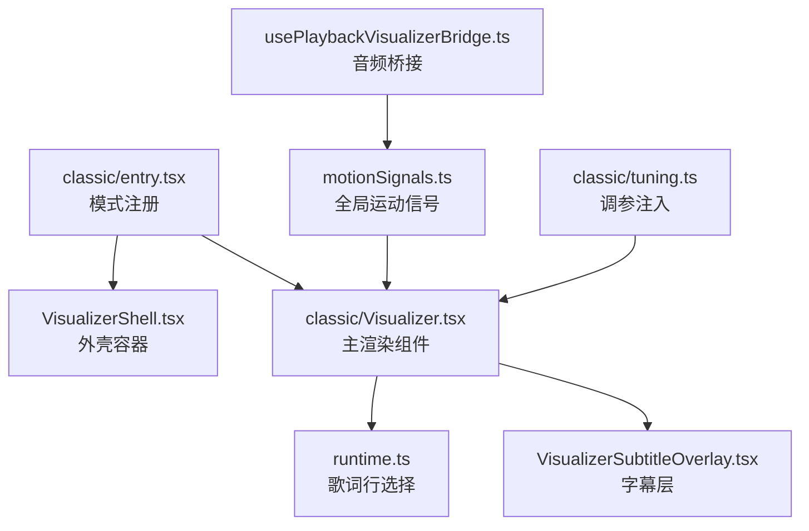
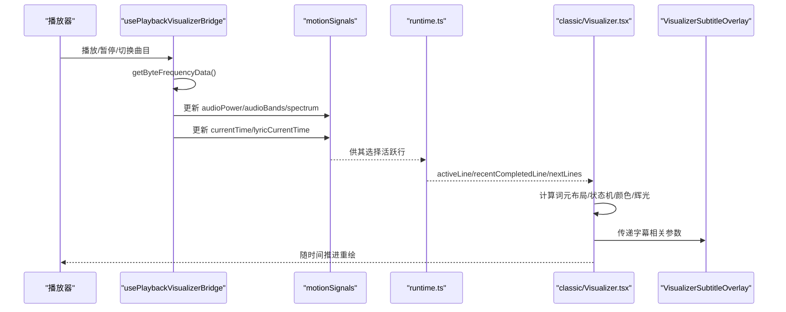
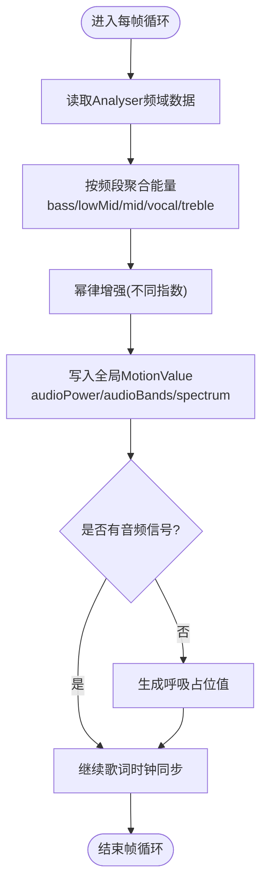
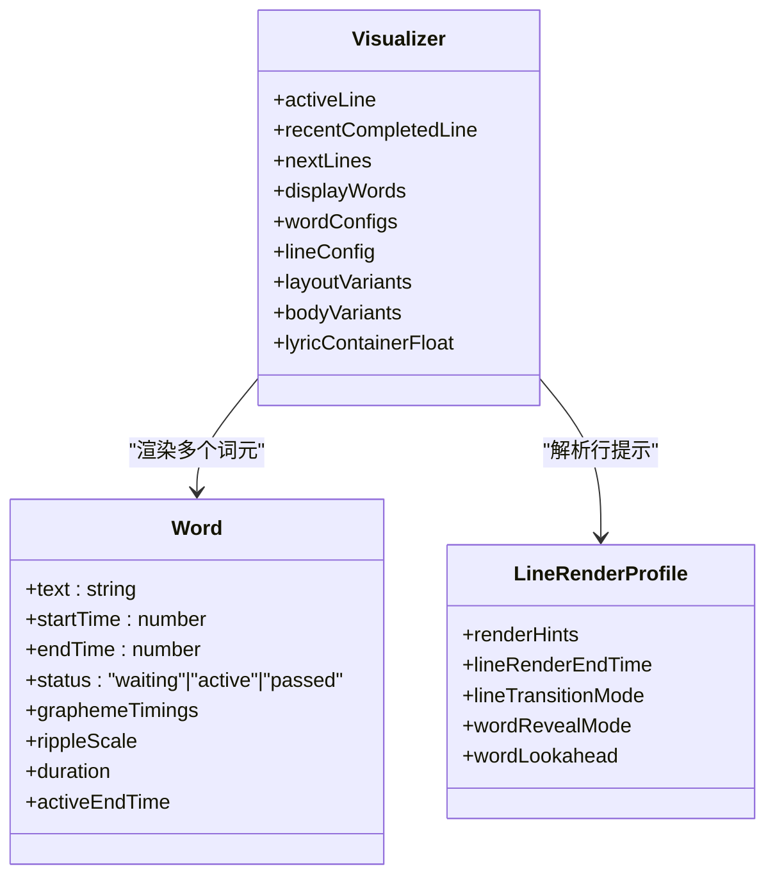
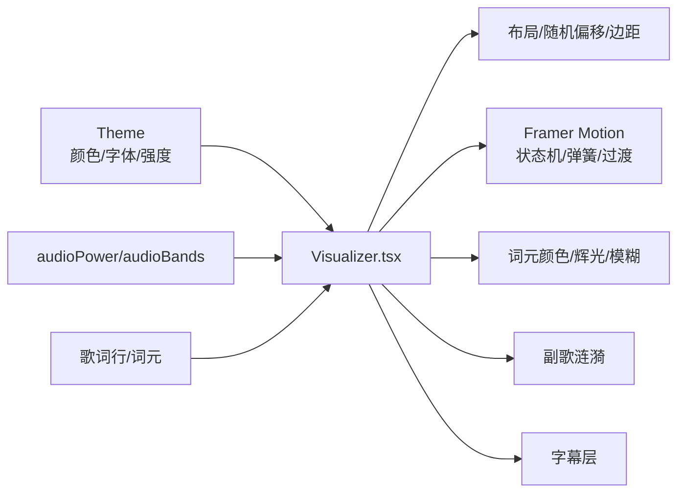
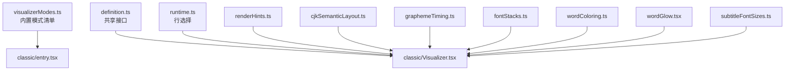
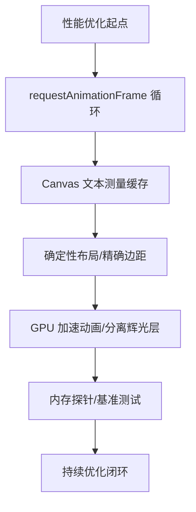

# 经典模式实现

<cite>
**本文引用的文件**   
- [src/components/visualizer/classic/entry.tsx](file://src/components/visualizer/classic/entry.tsx)
- [src/components/visualizer/classic/Visualizer.tsx](file://src/components/visualizer/classic/Visualizer.tsx)
- [src/components/visualizer/classic/tuning.ts](file://src/components/visualizer/classic/tuning.ts)
- [src/hooks/usePlaybackVisualizerBridge.ts](file://src/hooks/usePlaybackVisualizerBridge.ts)
- [src/types.ts](file://src/types.ts)
- [src/types/visualizerModes.ts](file://src/types/visualizerModes.ts)
- [src/components/visualizer/runtime.ts](file://src/components/visualizer/runtime.ts)
- [src/components/visualizer/definition.ts](file://src/components/visualizer/definition.ts)
- [src/components/visualizer/VisualizerShell.tsx](file://src/components/visualizer/VisualizerShell.tsx)
- [src/components/visualizer/VisualizerSubtitleOverlay.tsx](file://src/components/visualizer/VisualizerSubtitleOverlay.tsx)
- [src/utils/lyrics/renderHints.ts](file://src/utils/lyrics/renderHints.ts)
- [src/utils/lyrics/cjkSemanticLayout.ts](file://src/utils/lyrics/cjkSemanticLayout.ts)
- [src/utils/lyrics/graphemeTiming.ts](file://src/utils/lyrics/graphemeTiming.ts)
- [src/components/visualizer/wordColoring.ts](file://src/components/visualizer/wordColoring.ts)
- [src/components/visualizer/wordGlow.tsx](file://src/components/visualizer/wordGlow.tsx)
- [src/components/visualizer/subtitleFontSizes.ts](file://src/components/visualizer/subtitleFontSizes.ts)
- [src/utils/fontStacks.ts](file://src/utils/fontStacks.ts)
- [src/stores/motionSignals.ts](file://src/stores/motionSignals.ts)
- [dev/probes/visualizerMemory.probe.tsx](file://dev/probes/visualizerMemory.probe.tsx)
</cite>

## 目录
1. [简介](#简介)
2. [项目结构](#项目结构)
3. [核心组件](#核心组件)
4. [架构总览](#架构总览)
5. [详细组件分析](#详细组件分析)
6. [依赖关系分析](#依赖关系分析)
7. [性能与内存优化](#性能与内存优化)
8. [故障排查指南](#故障排查指南)
9. [结论](#结论)
10. [附录：参数调优与自定义示例](#附录参数调优与自定义示例)

## 简介
本文件为“经典模式”可视化模式的完整技术文档。该模式以歌词为核心视觉载体，通过音频响应驱动歌词词元（Word）的入场、高亮、余晖和涟漪等动画；同时提供字幕层、主题适配与可调节的参数体系。它不依赖 WebGL 着色器管线，而是基于 React + Framer Motion 的 DOM 动画与 Canvas 文本测量，配合全局运动信号（MotionValue）完成帧级同步。

## 项目结构
经典模式位于可视化子系统内，采用“模式注册 + 渲染组件 + 调参注入”的分层组织方式：
- 模式注册入口：定义模式标识、预览种子、是否使用分词、渲染函数与设置面板。
- 主渲染组件：负责歌词行选择、词元布局、状态机（等待/活跃/已过）、颜色与辉光、涟漪效果与字幕叠加。
- 调参注入：将 ClassicTuning 类型化地注入到渲染属性中。
- 音频桥接：从 Web Audio AnalyserNode 提取频谱能量，聚合为低频段与整体能量，并写入全局 MotionValue。
- 运行时辅助：根据当前时间与歌词数据计算活跃行、最近完成行与下一行。

**图示来源**
- [src/components/visualizer/classic/entry.tsx:9-23](file://src/components/visualizer/classic/entry.tsx#L9-L23)
- [src/components/visualizer/classic/Visualizer.tsx:287-323](file://src/components/visualizer/classic/Visualizer.tsx#L287-L323)
- [src/components/visualizer/VisualizerShell.tsx](file://src/components/visualizer/VisualizerShell.tsx)
- [src/components/visualizer/VisualizerSubtitleOverlay.tsx](file://src/components/visualizer/VisualizerSubtitleOverlay.tsx)
- [src/components/visualizer/runtime.ts](file://src/components/visualizer/runtime.ts)
- [src/hooks/usePlaybackVisualizerBridge.ts:77-131](file://src/hooks/usePlaybackVisualizerBridge.ts#L77-L131)
- [src/stores/motionSignals.ts](file://src/stores/motionSignals.ts)
- [src/components/visualizer/classic/tuning.ts:1-5](file://src/components/visualizer/classic/tuning.ts#L1-L5)

**章节来源**
- [src/components/visualizer/classic/entry.tsx:1-24](file://src/components/visualizer/classic/entry.tsx#L1-L24)
- [src/components/visualizer/classic/Visualizer.tsx:1-664](file://src/components/visualizer/classic/Visualizer.tsx#L1-L664)
- [src/components/visualizer/classic/tuning.ts:1-5](file://src/components/visualizer/classic/tuning.ts#L1-L5)

## 核心组件
- 模式注册（entry.tsx）
  - 声明模式 id、排序、标签、预览种子、调参种类、是否启用分词、渲染函数与设置面板。
- 主渲染组件（Visualizer.tsx）
  - 歌词行生命周期：获取活跃行、最近完成行、下一行。
  - 词元布局：支持语义化 CJK 布局或旧版布局；按行生成确定性随机布局（位置、旋转、缩放、边距）。
  - 词元状态机：waiting → active → passed，分别控制透明度、缩放、位移、旋转、模糊与颜色过渡。
  - 辉光与主体分层：辉光层独立于主体层，避免高亮影响可读性。
  - 副歌涟漪：在 chorus 行活跃时触发圆形扩散动画。
  - 整行呼吸浮动：可选的轻微上下浮动与缩放，增强画面活力。
  - 字幕叠加：复用通用字幕层，支持翻译、罗马音、未来歌词模糊等。
- 调参注入（tuning.ts）
  - 将 ClassicTuning 类型化注入 props，包含词元旋转、呼吸浮动倍数、旧版布局开关、词间距等。
- 音频桥接（usePlaybackVisualizerBridge.ts）
  - 从 AnalyserNode 读取频率域数据，按频段（低音、低中、中、人声、高音）聚合能量，并进行幂律增强后写入全局 MotionValue。
  - 无音频信号时提供“呼吸”占位值，保证 UI 始终动态。
  - 同步 currentTime 与当前歌词行索引。

**章节来源**
- [src/components/visualizer/classic/entry.tsx:9-23](file://src/components/visualizer/classic/entry.tsx#L9-L23)
- [src/components/visualizer/classic/Visualizer.tsx:68-143](file://src/components/visualizer/classic/Visualizer.tsx#L68-L143)
- [src/components/visualizer/classic/Visualizer.tsx:165-285](file://src/components/visualizer/classic/Visualizer.tsx#L165-L285)
- [src/components/visualizer/classic/Visualizer.tsx:336-471](file://src/components/visualizer/classic/Visualizer.tsx#L336-L471)
- [src/components/visualizer/classic/Visualizer.tsx:545-572](file://src/components/visualizer/classic/Visualizer.tsx#L545-L572)
- [src/components/visualizer/classic/tuning.ts:1-5](file://src/components/visualizer/classic/tuning.ts#L1-L5)
- [src/hooks/usePlaybackVisualizerBridge.ts:77-131](file://src/hooks/usePlaybackVisualizerBridge.ts#L77-L131)

## 架构总览
经典模式的数据流由“播放源 → 音频桥接 → 全局运动信号 → 渲染组件 → 子图层”构成。歌词行选择由运行时辅助完成，主题与字体栈由工具模块解析，词元颜色由配色工具决定。

**图示来源**
- [src/hooks/usePlaybackVisualizerBridge.ts:77-131](file://src/hooks/usePlaybackVisualizerBridge.ts#L77-L131)
- [src/components/visualizer/runtime.ts](file://src/components/visualizer/runtime.ts)
- [src/components/visualizer/classic/Visualizer.tsx:287-323](file://src/components/visualizer/classic/Visualizer.tsx#L287-L323)
- [src/components/visualizer/VisualizerSubtitleOverlay.tsx](file://src/components/visualizer/VisualizerSubtitleOverlay.tsx)

## 详细组件分析

### 音频响应算法
- 频谱采样
  - 从 AnalyserNode.frequencyBinCount 读取 Uint8Array 频域数据。
  - 按频段区间（20–150Hz、150–400Hz、400–1200Hz、1000–3500Hz、3500Hz+）聚合平均能量。
  - 对每个频段进行幂律增强（不同指数），提升动态范围与对比度。
  - 将 bass/lowMid/mid/vocal/treble 与 spectrum 写入全局 MotionValue，供各可视化模式消费。
- 能量聚合
  - 整体能量 audioPower 取低音与低中频的平均，并使用更高指数增强，使鼓点与低频冲击更明显。
- 无信号回退
  - 当无音频信号时，使用正弦呼吸曲线填充所有频段，保持界面有生命感。

**图示来源**
- [src/hooks/usePlaybackVisualizerBridge.ts:87-131](file://src/hooks/usePlaybackVisualizerBridge.ts#L87-L131)

**章节来源**
- [src/hooks/usePlaybackVisualizerBridge.ts:87-131](file://src/hooks/usePlaybackVisualizerBridge.ts#L87-L131)
- [src/types.ts:1481-1488](file://src/types.ts#L1481-L1488)

### 歌词行与词元处理
- 行选择与提示
  - 通过运行时辅助获取活跃行、最近完成行与下一行。
  - 从歌词行中提取 renderHints，决定行过渡模式（normal/fast/none）与词元揭示模式（normal/fast/instant）。
- 词元布局
  - 支持语义化 CJK 布局（buildPostLyricLayoutUnits/buildDisplayWordsFromLayoutUnits）或旧版布局。
  - 为每行生成确定性随机布局（seed=startTime），包括 x/y 偏移、旋转、缩放、marginRight、alignSelf。
  - 非旧版布局下，根据相邻词元宽度与缩放溢出计算精确 margin，避免重叠。
- 词元状态机
  - waiting：未激活，半透明、缩放较小、带旋转与模糊。
  - active：激活态，全透明、放大、清晰、颜色切换为主题强调色。
  - passed：已过态，保留余晖与缓慢旋转，避免行突然消失。
- 辉光与主体分层
  - 辉光层独立绘制，避免高亮导致文字不可读。
  - 主体层负责颜色与模糊清理，并在 transitionEnd 中确保最终 filter 归零。
- 副歌涟漪
  - 当行标记为 isChorus 且处于 active 时，触发圆形边框扩散动画。

**图示来源**
- [src/components/visualizer/classic/Visualizer.tsx:68-143](file://src/components/visualizer/classic/Visualizer.tsx#L68-L143)
- [src/components/visualizer/classic/Visualizer.tsx:165-285](file://src/components/visualizer/classic/Visualizer.tsx#L165-L285)
- [src/components/visualizer/classic/Visualizer.tsx:336-471](file://src/components/visualizer/classic/Visualizer.tsx#L336-L471)

**章节来源**
- [src/components/visualizer/classic/Visualizer.tsx:68-143](file://src/components/visualizer/classic/Visualizer.tsx#L68-L143)
- [src/components/visualizer/classic/Visualizer.tsx:165-285](file://src/components/visualizer/classic/Visualizer.tsx#L165-L285)
- [src/components/visualizer/classic/Visualizer.tsx:336-471](file://src/components/visualizer/classic/Visualizer.tsx#L336-L471)
- [src/utils/lyrics/renderHints.ts](file://src/utils/lyrics/renderHints.ts)
- [src/utils/lyrics/cjkSemanticLayout.ts](file://src/utils/lyrics/cjkSemanticLayout.ts)
- [src/utils/lyrics/graphemeTiming.ts](file://src/utils/lyrics/graphemeTiming.ts)

### 渲染管线与视觉效果
- 渲染管线
  - 外层壳 VisualizerShell 接收 theme/audioPower/audioBands/sharedProps，统一上下文。
  - 主容器使用 motion.div 包裹歌词行，AnimatePresence 管理行切换动画。
  - 词元使用 framer-motion 的 variants 与 useMotionValueEvent 监听 currentTime，驱动状态机。
  - 文本测量使用 Canvas 2D measureText，缓存全局 canvas 实例以减少开销。
- 视觉效果
  - 频谱柱状图：经典模式本身不直接绘制频谱柱，但通过 audioBands 与 audioPower 驱动词元缩放、颜色与辉光强度。
  - 波形动画：通过整行呼吸浮动（y/scale 循环）与词元弹性弹簧过渡模拟波形律动。
  - 粒子系统：不使用粒子系统；副歌涟漪以 CSS 圆环扩散替代，降低 GPU/CPU 压力。
- 主题与字体
  - 主题颜色用于主体色、强调色、背景色与词元高亮色。
  - 字体栈与字重由工具模块解析，确保跨平台一致性。

**图示来源**
- [src/components/visualizer/classic/Visualizer.tsx:287-323](file://src/components/visualizer/classic/Visualizer.tsx#L287-L323)
- [src/components/visualizer/classic/Visualizer.tsx:473-543](file://src/components/visualizer/classic/Visualizer.tsx#L473-L543)
- [src/components/visualizer/classic/Visualizer.tsx:574-659](file://src/components/visualizer/classic/Visualizer.tsx#L574-L659)
- [src/utils/fontStacks.ts](file://src/utils/fontStacks.ts)
- [src/components/visualizer/wordColoring.ts](file://src/components/visualizer/wordColoring.ts)

**章节来源**
- [src/components/visualizer/classic/Visualizer.tsx:473-543](file://src/components/visualizer/classic/Visualizer.tsx#L473-L543)
- [src/components/visualizer/classic/Visualizer.tsx:574-659](file://src/components/visualizer/classic/Visualizer.tsx#L574-L659)

### 参数调优机制
- ClassicTuning 字段
  - enableWordRotation：是否启用词元旋转。
  - breathingFloatMultiplier：整行呼吸浮动幅度倍数（钳制到 0–2）。
  - useLegacyLayout：是否使用旧版布局（跳过语义化 CJK 布局）。
  - wordSpacing：词间距乘数（钳制到 0–2）。
- 灵敏度调节
  - 通过 audioPower 与 audioBands 的幂律增强系数调整敏感度；可在桥接层修改指数以改变低频冲击与高频细腻度。
- 颜色主题适配
  - 主题 primaryColor/accentColor/secondaryColor 控制主体、强调与次要元素；词元颜色由 resolveWordColor 决定。
- 性能优化选项
  - 关闭词元旋转可减少 transform 计算。
  - 使用旧版布局减少 CJK 语义布局开销。
  - 降低 breathingFloatMultiplier 减少整行动画复杂度。
  - 合理设置 wordSpacing 避免频繁 reflow。

**章节来源**
- [src/types.ts:389-394](file://src/types.ts#L389-L394)
- [src/components/visualizer/classic/Visualizer.tsx:53-63](file://src/components/visualizer/classic/Visualizer.tsx#L53-L63)
- [src/components/visualizer/classic/Visualizer.tsx:336-471](file://src/components/visualizer/classic/Visualizer.tsx#L336-L471)
- [src/hooks/usePlaybackVisualizerBridge.ts:110-120](file://src/hooks/usePlaybackVisualizerBridge.ts#L110-L120)

## 依赖关系分析
- 模式注册与清单
  - visualizerModes.ts 维护内置模式清单，classic 在其中声明；registry 初始化时会断言清单与 entry 目录一致。
- 运行时与定义
  - definition.ts 定义 VisualizerSharedProps 等共享接口；runtime.ts 提供歌词行选择逻辑。
- 工具与样式
  - renderHints.ts 提供行渲染提示；cjkSemanticLayout.ts 与 graphemeTiming.ts 提供 CJK 语义布局与字素时序。
  - fontStacks.ts 解析字体栈与字重；wordColoring.ts 决定词元颜色；wordGlow.tsx 提供辉光变体。
  - subtitleFontSizes.ts 计算字幕字号。

**图示来源**
- [src/types/visualizerModes.ts:15-30](file://src/types/visualizerModes.ts#L15-L30)
- [src/components/visualizer/classic/entry.tsx:9-23](file://src/components/visualizer/classic/entry.tsx#L9-L23)
- [src/components/visualizer/classic/Visualizer.tsx:1-16](file://src/components/visualizer/classic/Visualizer.tsx#L1-L16)

**章节来源**
- [src/types/visualizerModes.ts:15-30](file://src/types/visualizerModes.ts#L15-L30)
- [src/components/visualizer/classic/entry.tsx:9-23](file://src/components/visualizer/classic/entry.tsx#L9-L23)
- [src/components/visualizer/classic/Visualizer.tsx:1-16](file://src/components/visualizer/classic/Visualizer.tsx#L1-L16)

## 性能与内存优化
- 帧循环与调度
  - 使用 requestAnimationFrame 驱动音频桥接与歌词时钟，避免阻塞主线程。
  - 在无音频信号时使用轻量呼吸曲线，避免空转开销。
- 文本测量缓存
  - 全局缓存 Canvas 实例与 measureText 结果，减少重复创建与测量成本。
- 布局稳定性
  - 使用确定性随机（seed=startTime）避免每次重排改变几何，仅时间驱动动画。
  - 非旧版布局下精确计算 marginRight，防止缩放与位移导致的重叠与重排。
- 动画优化
  - 使用 will-change-transform 与 spring 过渡，利用 GPU 加速。
  - 辉光层与主体层分离，避免过度 blur 带来的重绘压力。
- 内存监控探针
  - dev/probes/visualizerMemory.probe.tsx 提供可视化内存探针，合成频谱起伏以驱动依赖音频的图层分支，便于评估不同模式下的内存占用与 GC 行为。

**图示来源**
- [src/hooks/usePlaybackVisualizerBridge.ts:230-268](file://src/hooks/usePlaybackVisualizerBridge.ts#L230-L268)
- [src/components/visualizer/classic/Visualizer.tsx:145-163](file://src/components/visualizer/classic/Visualizer.tsx#L145-L163)
- [src/components/visualizer/classic/Visualizer.tsx:473-543](file://src/components/visualizer/classic/Visualizer.tsx#L473-L543)
- [dev/probes/visualizerMemory.probe.tsx:250-286](file://dev/probes/visualizerMemory.probe.tsx#L250-L286)

**章节来源**
- [src/hooks/usePlaybackVisualizerBridge.ts:230-268](file://src/hooks/usePlaybackVisualizerBridge.ts#L230-L268)
- [src/components/visualizer/classic/Visualizer.tsx:145-163](file://src/components/visualizer/classic/Visualizer.tsx#L145-L163)
- [src/components/visualizer/classic/Visualizer.tsx:473-543](file://src/components/visualizer/classic/Visualizer.tsx#L473-L543)
- [dev/probes/visualizerMemory.probe.tsx:250-286](file://dev/probes/visualizerMemory.probe.tsx#L250-L286)

## 故障排查指南
- 歌词行不切换
  - 检查 currentTime 与 lyricCurrentTime 是否正确更新；确认 findLatestActiveLineIndex 返回有效索引。
  - 核对 lyrics.lines 是否加载成功，以及 lyricTimelineOffsetMs 偏移是否合理。
- 词元布局重叠
  - 若使用非旧版布局，检查 wordSpacing 与相邻词元宽度计算；必要时增大 spacing 或关闭 enableWordRotation。
- 动画卡顿
  - 降低 animationIntensity 至 calm；减少 breathingFloatMultiplier；关闭词元旋转。
  - 避免过多 blur 与复杂滤镜；确认 will-change-transform 生效。
- 颜色异常
  - 检查 theme.primaryColor/accentColor 是否被覆盖；确认 resolveWordColor 返回值符合预期。
- 无音频信号时的表现
  - 确认 bridge 的呼吸占位值已启用；若仍静止，检查 analyserRef 与 audioRef 是否正确挂载。

**章节来源**
- [src/hooks/usePlaybackVisualizerBridge.ts:133-228](file://src/hooks/usePlaybackVisualizerBridge.ts#L133-L228)
- [src/components/visualizer/classic/Visualizer.tsx:336-471](file://src/components/visualizer/classic/Visualizer.tsx#L336-L471)
- [src/components/visualizer/classic/Visualizer.tsx:473-543](file://src/components/visualizer/classic/Visualizer.tsx#L473-L543)

## 结论
经典模式以歌词为中心，通过音频桥接提供的频段能量与整体能量驱动词元状态机与动画，结合主题系统与字体工具实现一致的视觉体验。其优势在于实现简洁、性能可控、易于扩展；劣势是不直接使用 WebGL 着色器，复杂图形能力受限。对于需要高性能 3D 或粒子系统的场景，建议结合其他可视化模式（如 fume、lumiere）或使用外部渲染后端。

## 附录：参数调优与自定义示例
- 自定义 ClassicTuning
  - 在设置面板或配置对象中传入 classicTuning，启用/禁用词元旋转、调整呼吸浮动倍数、切换旧版布局、调节词间距。
  - 示例路径参考：[src/components/visualizer/classic/tuning.ts:1-5](file://src/components/visualizer/classic/tuning.ts#L1-L5)
- 调整音频灵敏度
  - 在桥接层修改幂律增强指数，以提升低频冲击或高频细腻度。
  - 示例路径参考：[src/hooks/usePlaybackVisualizerBridge.ts:110-120](file://src/hooks/usePlaybackVisualizerBridge.ts#L110-L120)
- 集成其他可视化组件
  - 通过 VisualizerShell 与 VisualizerSubtitleOverlay 与其他模式共享主题、音频信号与字幕层。
  - 示例路径参考：[src/components/visualizer/VisualizerShell.tsx](file://src/components/visualizer/VisualizerShell.tsx)、[src/components/visualizer/VisualizerSubtitleOverlay.tsx](file://src/components/visualizer/VisualizerSubtitleOverlay.tsx)
- 性能基准与内存报告
  - 使用 dev/probes/visualizerMemory.probe.tsx 运行内存探针，观察不同参数组合下的内存占用与 GC 行为。
  - 示例路径参考：[dev/probes/visualizerMemory.probe.tsx:250-286](file://dev/probes/visualizerMemory.probe.tsx#L250-L286)

**章节来源**
- [src/components/visualizer/classic/tuning.ts:1-5](file://src/components/visualizer/classic/tuning.ts#L1-L5)
- [src/hooks/usePlaybackVisualizerBridge.ts:110-120](file://src/hooks/usePlaybackVisualizerBridge.ts#L110-L120)
- [src/components/visualizer/VisualizerShell.tsx](file://src/components/visualizer/VisualizerShell.tsx)
- [src/components/visualizer/VisualizerSubtitleOverlay.tsx](file://src/components/visualizer/VisualizerSubtitleOverlay.tsx)
- [dev/probes/visualizerMemory.probe.tsx:250-286](file://dev/probes/visualizerMemory.probe.tsx#L250-L286)