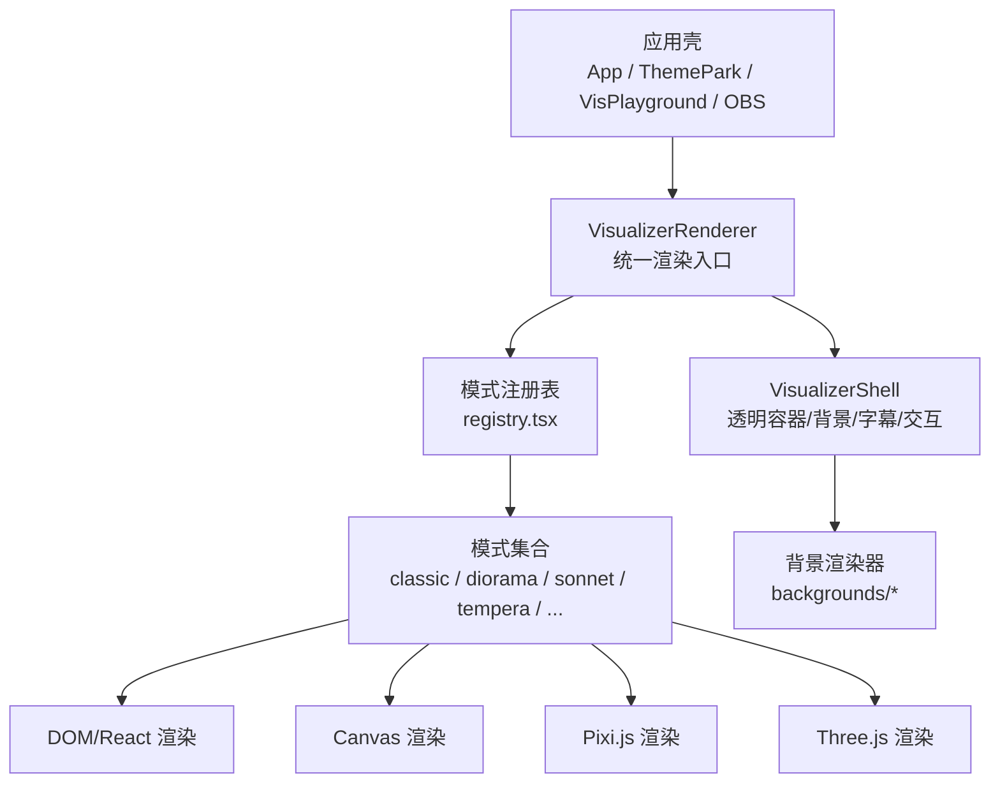
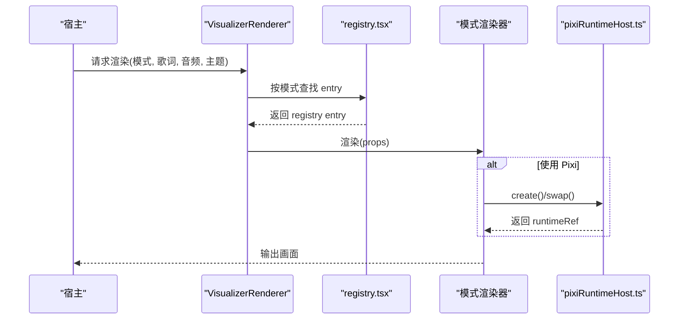
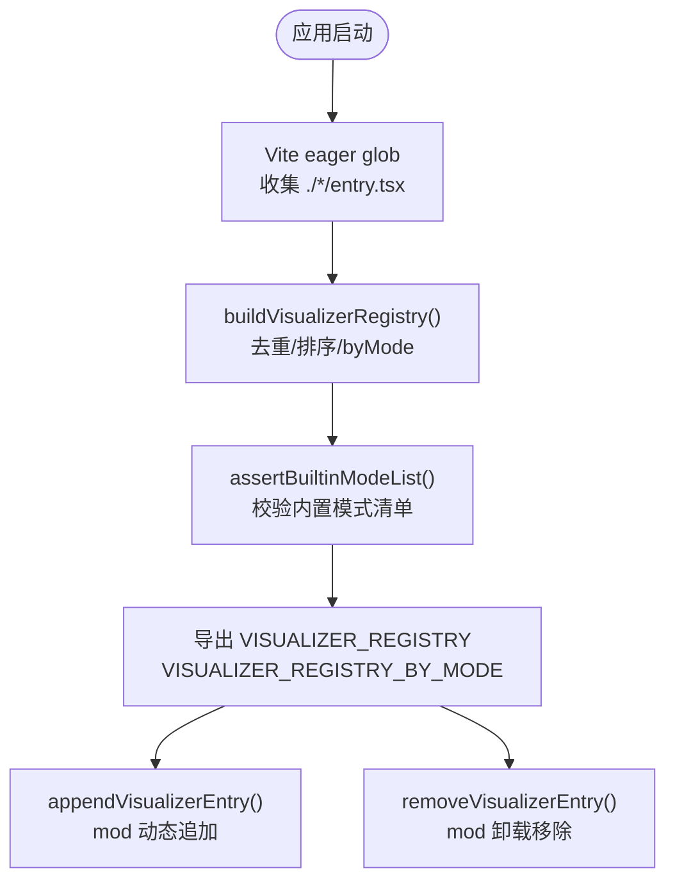
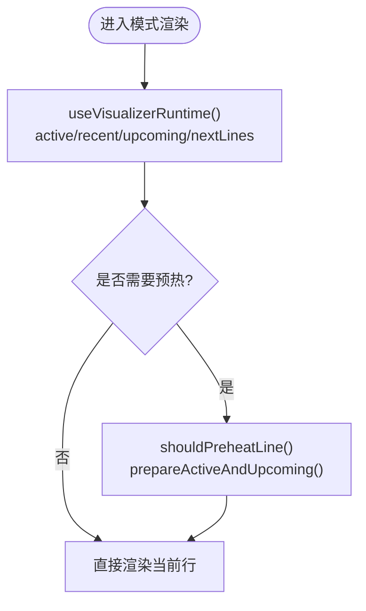
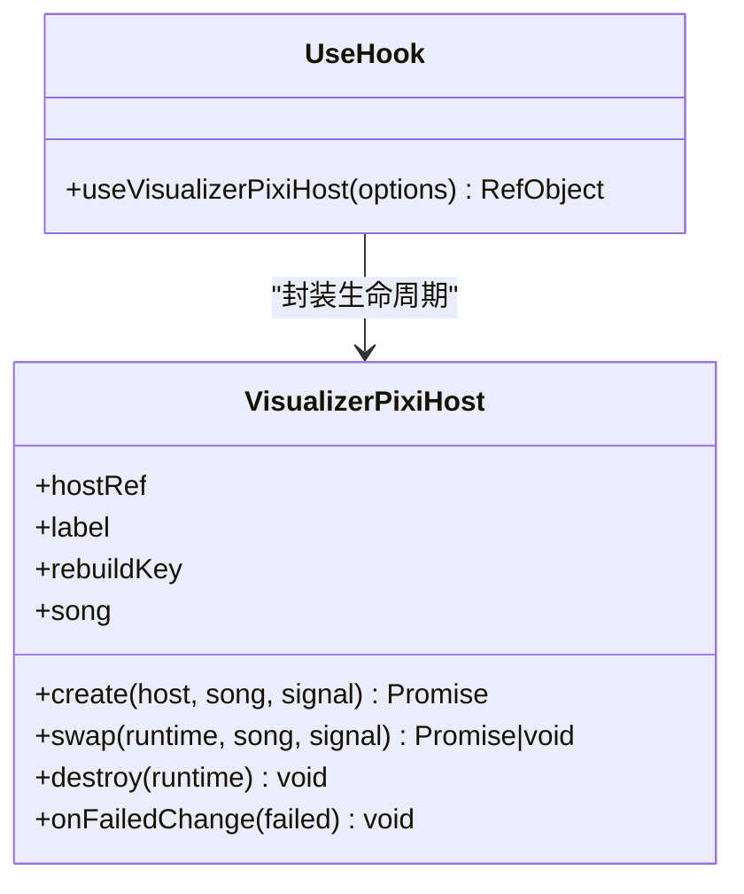
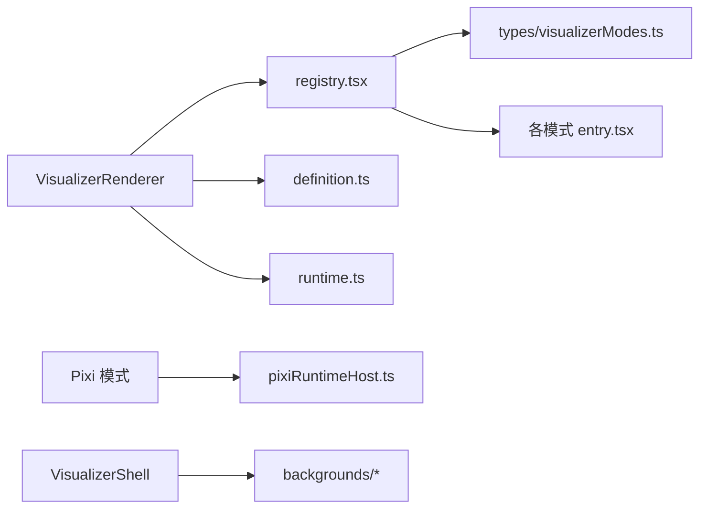

# 可视化渲染系统

<cite>
**本文引用的文件**   
- [README.md](file://src/components/visualizer/README.md)
- [definition.ts](file://src/components/visualizer/definition.ts)
- [runtime.ts](file://src/components/visualizer/runtime.ts)
- [registry.tsx](file://src/components/visualizer/registry.tsx)
- [pixiRuntimeHost.ts](file://src/components/visualizer/pixiRuntimeHost.ts)
- [entry.tsx（classic）](file://src/components/visualizer/classic/entry.tsx)
- [entry.tsx（cappella）](file://src/components/visualizer/cappella/entry.tsx)
- [entry.tsx（diorama）](file://src/components/visualizer/diorama/entry.tsx)
- [entry.tsx（sonnet）](file://src/components/visualizer/sonnet/entry.tsx)
- [entry.tsx（tempera）](file://src/components/visualizer/tempera/entry.tsx)
</cite>

## 目录
1. [引言](#引言)
2. [项目结构](#项目结构)
3. [核心组件](#核心组件)
4. [架构总览](#架构总览)
5. [详细组件分析](#详细组件分析)
6. [依赖关系分析](#依赖关系分析)
7. [性能与优化](#性能与优化)
8. [故障排查指南](#故障排查指南)
9. [结论](#结论)
10. [附录：内置可视化模式速查](#附录内置可视化模式速查)

## 引言
本技术文档聚焦 Folia Major 的可视化渲染系统，围绕以下目标展开：
- 解释 Three.js 与 Pixi.js 在可视化系统中的混合使用场景。
- 梳理 13 种内置可视化模式的职责、实现要点与生命周期管理。
- 说明着色器编程与 GLSL 的使用位置、优化思路与约束。
- 阐述实时音频数据的提取与分析路径，包括频域、时域与节拍检测。
- 给出自定义可视化效果的开发接口、注册机制、参数配置与性能调优建议。
- 提供 GPU 加速、帧率优化、内存管理等策略，以及调试与性能监控方法。

该系统的核心思想是“统一外壳 + 可发现模式 + 共享运行时契约”：所有可视化模式通过统一的 registry 注册，由 VisualizerRenderer 驱动；模式内部可选择 DOM、Canvas、Pixi.js 或 Three.js 进行渲染，并通过共享 props 获取歌词、主题、音频分析与背景等数据。

## 项目结构
可视化子系统位于 `src/components/visualizer`，采用“共享 shell/runtime/registry + 多模式子目录”的组织方式：
- 共享层：定义模式契约、运行时辅助、Pixi 宿主、资源预算与纹理池等。
- 模式层：每个模式一个目录，包含 entry.tsx、主渲染器、tuning、布局与特效文件。
- 背景层：backgrounds 目录提供通用与主题化背景渲染。
- 宿主层：App、ThemePark、VisPlayground、OBS 等复用同一渲染入口。

图表来源
- [README.md:5-17](file://src/components/visualizer/README.md#L5-L17)
- [registry.tsx:16-44](file://src/components/visualizer/registry.tsx#L16-L44)

章节来源
- [README.md:1-184](file://src/components/visualizer/README.md#L1-L184)

## 核心组件
- 模式契约与共享属性：`definition.ts` 定义了 `VisualizerSharedProps`、`VisualizerRegistryEntry`、`FoliumTunable` 等类型，作为所有模式必须遵守的统一输入与扩展点。
- 运行时辅助：`runtime.ts` 提供当前行、上一句、下一句、预热窗口等轻量计算，避免各模式重复扫描歌词。
- 模式注册表：`registry.tsx` 通过 Vite `import.meta.glob('./*/entry.tsx', { eager: true })` 自动发现模式，并维护排序、查找、预览种子、默认模式等能力。
- Pixi 宿主：`pixiRuntimeHost.ts` 为需要 Pixi.js 的模式提供“创建一次、就地交接歌曲”的生命周期，避免 WebGL 上下文频繁重建。

章节来源
- [definition.ts:31-99](file://src/components/visualizer/definition.ts#L31-L99)
- [definition.ts:173-219](file://src/components/visualizer/definition.ts#L173-L219)
- [runtime.ts:5-31](file://src/components/visualizer/runtime.ts#L5-L31)
- [runtime.ts:35-157](file://src/components/visualizer/runtime.ts#L35-L157)
- [registry.tsx:16-50](file://src/components/visualizer/registry.tsx#L16-L50)
- [pixiRuntimeHost.ts:1-28](file://src/components/visualizer/pixiRuntimeHost.ts#L1-L28)

## 架构总览
可视化渲染的整体流程如下：
1. 宿主（App/ThemePark/VisPlayground/OBS）调用统一渲染器。
2. 渲染器根据当前模式从 registry 找到对应 entry，并加载 lazy 渲染器。
3. 渲染器注入共享 props（时间、歌词、主题、音频、背景、字幕等）。
4. 模式内部选择 DOM/Canvas/Pixi/Three 进行绘制，并可叠加字幕与和声覆盖层。
5. 对于 Pixi 模式，使用 pixiRuntimeHost 管理 WebGL 上下文与歌曲切换。

图表来源
- [README.md:5-17](file://src/components/visualizer/README.md#L5-L17)
- [registry.tsx:16-44](file://src/components/visualizer/registry.tsx#L16-L44)
- [pixiRuntimeHost.ts:37-143](file://src/components/visualizer/pixiRuntimeHost.ts#L37-L143)

## 详细组件分析

### 模式注册与发现机制
- 每个模式通过 `entry.tsx` 调用 `defineVisualizer` 注册，声明 mode、order、labelKey、previewSeed、tuningKind、render、settingsPanel 等元信息。
- registry 使用 eager glob 收集所有 entry，构建 byMode 映射与排序 entries，并在启动时校验内置模式清单是否一致。
- 支持运行时追加与移除 mod 提供的可视化模式，但不会覆盖内置模式。

图表来源
- [registry.tsx:16-50](file://src/components/visualizer/registry.tsx#L16-L50)
- [registry.tsx:79-112](file://src/components/visualizer/registry.tsx#L79-L112)

章节来源
- [registry.tsx:16-50](file://src/components/visualizer/registry.tsx#L16-L50)
- [registry.tsx:56-77](file://src/components/visualizer/registry.tsx#L56-L77)
- [registry.tsx:79-112](file://src/components/visualizer/registry.tsx#L79-L112)

### 共享运行时与歌词管线
- `runtime.ts` 提供：
  - `getRecentCompletedLine`：无活跃行时回退到最近完成的歌词行。
  - `getUpcomingLine` / `getUpcomingLines`：预测下一句/多句。
  - `shouldPreheatLine`：基于领先时间的预热窗口判断。
  - `prepareActiveAndUpcoming`：准备当前行与预热下一行的通用流程。
  - `useVisualizerRuntime`：组合上述能力的轻量 hook。
- 歌词管线不解析原始歌词文件，而是消费已解析的 `LyricData` / `Line` / `Word`，并由 `utils/lyrics` 下的工具负责解析、语义分组、逐字时序等。

图表来源
- [runtime.ts:35-157](file://src/components/visualizer/runtime.ts#L35-L157)

章节来源
- [runtime.ts:5-31](file://src/components/visualizer/runtime.ts#L5-L31)
- [runtime.ts:35-157](file://src/components/visualizer/runtime.ts#L35-L157)
- [README.md:76-89](file://src/components/visualizer/README.md#L76-L89)

### Pixi.js 宿主与生命周期
- `pixiRuntimeHost.ts` 为 Pixi 模式提供：
  - 一次性创建 WebGL 上下文与 scene cache。
  - 歌曲切换时通过 `swap()` 就地交接，避免重建 WebGL。
  - 失败时保留上一首歌画面，避免闪烁。
  - 清理时销毁 runtime 并替换 host 节点。
- 典型使用：Sonnet、Tempera、Lumiere 等 Pixi 模式。

图表来源
- [pixiRuntimeHost.ts:11-28](file://src/components/visualizer/pixiRuntimeHost.ts#L11-L28)
- [pixiRuntimeHost.ts:37-143](file://src/components/visualizer/pixiRuntimeHost.ts#L37-L143)

章节来源
- [pixiRuntimeHost.ts:1-28](file://src/components/visualizer/pixiRuntimeHost.ts#L1-L28)
- [pixiRuntimeHost.ts:37-143](file://src/components/visualizer/pixiRuntimeHost.ts#L37-L143)

### 内置可视化模式概览
根据 README 与 entry 注册信息，系统内置 13 种可视化模式，涵盖 DOM、Canvas、Pixi.js 与 Three.js 多种渲染后端：
- still：静止模式，不挂载共享背景层。
- classic：Luminous，经典歌词可视化。
- cadenza：Mindscape，测量与布局敏感。
- partita：云阶，顺序布局、缓存与预热。
- fume：Fume，文章级布局与缓存。
- cappella：群唱头像、表情与歌词呈现。
- tilt：Tilt。
- claddagh：Claddagh，有限 ring lines 与有界动画。
- monet：Monet，图像资源与背景 pipeline。
- diorama：镜台，Three.js 3D 歌词飞行、粒子、相机与文字光栅化。
- pendolo：Pendolo，时钟机械 canvas 与几何布局。
- sonnet：商籁，Pixi.js 确定性 MG 歌词 PV。
- tempera：凝彩，Pixi.js 分镜拼贴排版与调色。
- lumiere：绘光，Pixi.js 舞台光式歌词 PV。

章节来源
- [README.md:31-52](file://src/components/visualizer/README.md#L31-L52)
- [README.md:90-153](file://src/components/visualizer/README.md#L90-L153)
- [entry.tsx（classic）:9-23](file://src/components/visualizer/classic/entry.tsx#L9-L23)
- [entry.tsx（cappella）:9-22](file://src/components/visualizer/cappella/entry.tsx#L9-L22)
- [entry.tsx（diorama）:10-23](file://src/components/visualizer/diorama/entry.tsx#L10-L23)
- [entry.tsx（sonnet）:13-45](file://src/components/visualizer/sonnet/entry.tsx#L13-L45)
- [entry.tsx（tempera）:10-28](file://src/components/visualizer/tempera/entry.tsx#L10-L28)

### Three.js 与 Pixi.js 的混合使用
- Three.js：主要用于 diorama 的 3D 场景、粒子、相机与文字光栅化。
- Pixi.js：用于 sonnet、tempera、lumiere 等高性能 2D 图形与后期处理。
- 混合原则：
  - 将 WebGL 上下文创建与销毁交给 pixiRuntimeHost 或模式自身生命周期管理。
  - 连续播放时间优先使用 MotionValue、ref、CSS/Motion、canvas 或 Pixi draw loop，避免每帧写 React state。
  - 高频更新必须有相等保护与 cleanup。

章节来源
- [README.md:119-153](file://src/components/visualizer/README.md#L119-L153)
- [README.md:167-173](file://src/components/visualizer/README.md#L167-L173)

### 着色器编程与 GLSL
- GLSL 着色器通常位于具体模式的 shader 文件中，例如 diorama 的粒子着色器、sonnet/tempera/lumiere 的后处理 filter。
- 优化要点：
  - 控制片段着色器复杂度，减少分支与高精度运算。
  - 合理设置纹理分辨率与采样次数。
  - 对滤镜链进行批处理与降采样（如 Lumiere 的画质档 full/balanced/low）。
  - 避免在每帧重新编译着色器，尽量复用 program。
- 约束与注意事项：
  - 不同模式对 GLSL 的依赖不同，修改前应阅读模式 README 中的约束。
  - 确保着色器在不同设备上的兼容性（精度、纹理格式、WebGL 版本）。

章节来源
- [README.md:119-153](file://src/components/visualizer/README.md#L119-L153)

### 可视化模式的生命周期管理
- 模式注册：entry.tsx 通过 defineVisualizer 声明模式元信息与渲染函数。
- 模式发现：registry.tsx 使用 eager glob 收集 entry，构建 byMode 映射。
- 模式渲染：VisualizerRenderer 根据当前模式加载 lazy 渲染器并注入 props。
- 资源加载：模式内按需加载图片、字体、纹理等资源，并使用纹理池与缓存。
- 内存释放：
  - Pixi 模式通过 pixiRuntimeHost 在卸载时销毁 runtime 并清理 host。
  - RAF、ResizeObserver、MotionValueEvent 等高频回调需 cleanup。
  - 连续场景数据不要提升到 React state，避免不必要的重渲染。

章节来源
- [README.md:167-173](file://src/components/visualizer/README.md#L167-L173)
- [pixiRuntimeHost.ts:125-134](file://src/components/visualizer/pixiRuntimeHost.ts#L125-L134)

### 实时音频数据的提取与分析
- 共享 props 中包含 `audioPower` 与 `audioBands`，供模式消费。
- 频域分析：audioBands 提供频段能量分布，可用于频谱可视化。
- 时域分析：audioPower 提供整体音量强度，可用于波形或脉冲效果。
- 节拍检测：部分模式（如 Cappella、Claddagh）可能结合 onset 检测与节奏响应。
- 注意：Tempera 渲染层不消费音频，仅传给共享背景层。

章节来源
- [definition.ts:40-41](file://src/components/visualizer/definition.ts#L40-L41)
- [README.md:139-150](file://src/components/visualizer/README.md#L139-L150)

### 自定义可视化效果开发接口
- 注册机制：
  - 在 `src/components/visualizer/<mode>/entry.tsx` 中调用 `defineVisualizer`。
  - 声明 mode、order、labelKey、labelFallback、previewSeed、previewStartOffset、tuningKind、render、renderSettingsPanel、resetSettings。
- 参数配置：
  - 通过 `VisualizerSharedProps` 传入 theme、lines、audioPower/audioBands、background、subtitle 等。
  - 通过 tuning 字段（如 sonnetTuning、temperaTuning、lumiereTuning）提供模式专属参数。
  - 可通过 `foliumTunables` 暴露可调参数给 mods。
- 性能调优：
  - 使用 `useVisualizerRuntime` 获取当前行与预热窗口。
  - 避免每帧写 React state，使用 ref/MotionValue/CSS/Motion。
  - 布局 cache key 包含歌词内容、主题、最终字重、窗口尺寸与 mode tuning。
  - 对 Pixi 模式使用 pixiRuntimeHost 避免 WebGL 重建。

章节来源
- [definition.ts:33-99](file://src/components/visualizer/definition.ts#L33-L99)
- [definition.ts:173-219](file://src/components/visualizer/definition.ts#L173-L219)
- [README.md:167-173](file://src/components/visualizer/README.md#L167-L173)

## 依赖关系分析
可视化子系统的关键依赖关系如下：
- VisualizerRenderer 依赖 registry 与 shell。
- registry 依赖 types/visualizerModes 与所有模式的 entry.tsx。
- 模式依赖 definition.ts 的共享契约与 runtime.ts 的辅助函数。
- Pixi 模式依赖 pixiRuntimeHost 管理生命周期。
- 背景层依赖 backgrounds/registry 与 backgrounds/definition。

图表来源
- [registry.tsx:16-50](file://src/components/visualizer/registry.tsx#L16-L50)
- [definition.ts:31-99](file://src/components/visualizer/definition.ts#L31-L99)
- [pixiRuntimeHost.ts:11-28](file://src/components/visualizer/pixiRuntimeHost.ts#L11-L28)

章节来源
- [registry.tsx:16-50](file://src/components/visualizer/registry.tsx#L16-L50)
- [definition.ts:31-99](file://src/components/visualizer/definition.ts#L31-L99)
- [pixiRuntimeHost.ts:11-28](file://src/components/visualizer/pixiRuntimeHost.ts#L11-L28)

## 性能与优化
- GPU 加速：
  - 使用 Pixi.js 与 Three.js 的 WebGL 后端进行高效渲染。
  - 对滤镜链进行批处理与降采样，避免过度消耗 GPU。
- 帧率优化：
  - 高频更新使用 MotionValue、ref、CSS/Motion、canvas 或 Pixi draw loop。
  - 避免每帧写 React state，减少重渲染。
  - 使用预热窗口提前准备下一行，减少首帧延迟。
- 内存管理：
  - Pixi 模式通过 pixiRuntimeHost 管理 WebGL 上下文与纹理池。
  - 清理 RAF、ResizeObserver、MotionValueEvent 等高频回调。
  - 连续场景数据不要提升到 React state。
- 资源加载：
  - 使用纹理池与缓存，避免重复加载。
  - 对大图与复杂纹理进行压缩与分级加载。

章节来源
- [README.md:167-173](file://src/components/visualizer/README.md#L167-L173)
- [pixiRuntimeHost.ts:37-143](file://src/components/visualizer/pixiRuntimeHost.ts#L37-L143)

## 故障排查指南
- 模式未显示：
  - 检查 entry.tsx 是否正确调用 defineVisualizer。
  - 检查 registry.tsx 是否成功收集 entry。
  - 检查 types/visualizerModes 是否包含该模式。
- WebGL 上下文丢失：
  - 检查 Pixi 模式是否使用 pixiRuntimeHost。
  - 检查是否在歌曲切换时重建 WebGL。
- 性能问题：
  - 检查是否每帧写 React state。
  - 检查滤镜链是否过于复杂。
  - 检查纹理分辨率与采样次数。
- 音频无响应：
  - 检查 audioPower 与 audioBands 是否正确传入。
  - 检查模式是否消费音频数据。

章节来源
- [registry.tsx:16-50](file://src/components/visualizer/registry.tsx#L16-L50)
- [pixiRuntimeHost.ts:37-143](file://src/components/visualizer/pixiRuntimeHost.ts#L37-L143)
- [definition.ts:40-41](file://src/components/visualizer/definition.ts#L40-L41)

## 结论
Folia Major 的可视化渲染系统通过统一契约、可发现模式与共享运行时，实现了高度模块化与可扩展的可视化架构。系统支持 DOM、Canvas、Pixi.js 与 Three.js 多种渲染后端，并提供完善的生命周期管理、资源加载与内存释放机制。开发者可通过 entry.tsx 注册新可视化模式，并通过 tuning 与 foliumTunables 提供参数配置与性能调优。在实际使用中，应遵循性能优化最佳实践，合理使用 GPU 加速与帧率优化策略，确保流畅的用户体验。

## 附录：内置可视化模式速查
- still：静止模式，不挂载共享背景层。
- classic：Luminous，经典歌词可视化。
- cadenza：Mindscape，测量与布局敏感。
- partita：云阶，顺序布局、缓存与预热。
- fume：Fume，文章级布局与缓存。
- cappella：群唱头像、表情与歌词呈现。
- tilt：Tilt。
- claddagh：Claddagh，有限 ring lines 与有界动画。
- monet：Monet，图像资源与背景 pipeline。
- diorama：镜台，Three.js 3D 歌词飞行、粒子、相机与文字光栅化。
- pendolo：Pendolo，时钟机械 canvas 与几何布局。
- sonnet：商籁，Pixi.js 确定性 MG 歌词 PV。
- tempera：凝彩，Pixi.js 分镜拼贴排版与调色。
- lumiere：绘光，Pixi.js 舞台光式歌词 PV。

章节来源
- [README.md:31-52](file://src/components/visualizer/README.md#L31-L52)
- [README.md:90-153](file://src/components/visualizer/README.md#L90-L153)