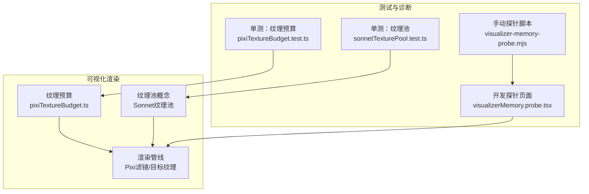
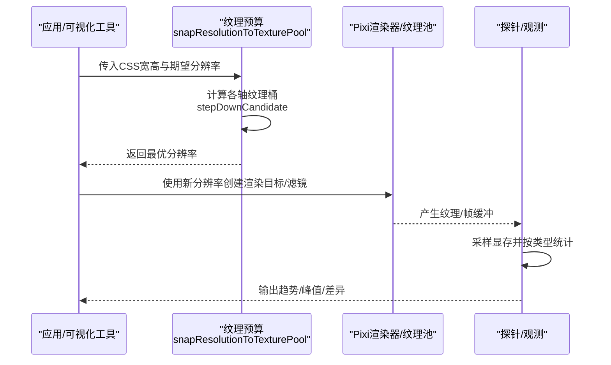
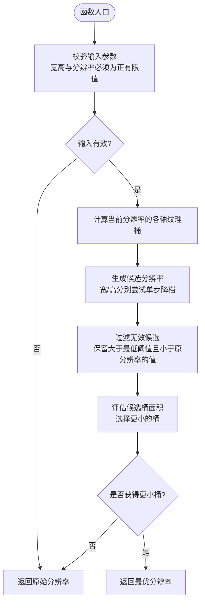
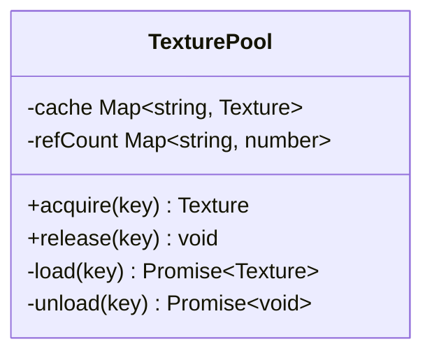
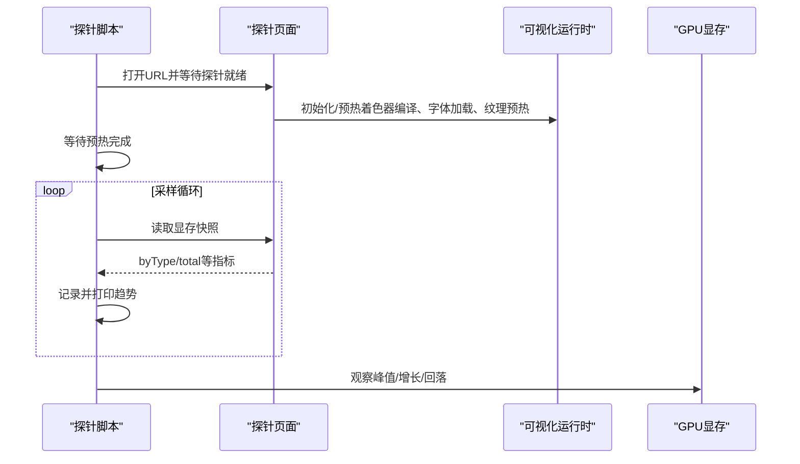
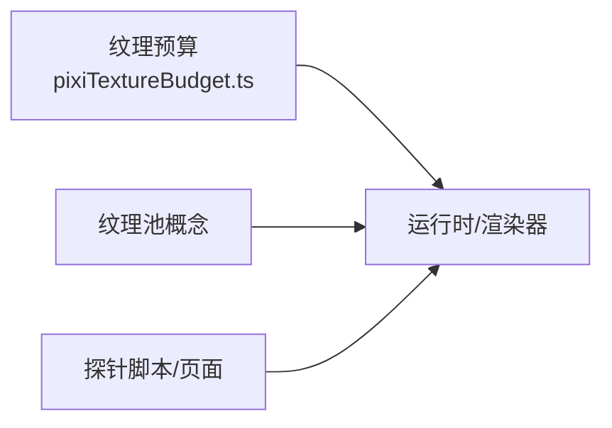

# GPU内存优化

<cite>
**本文引用的文件**   
- [pixiTextureBudget.ts](file://src/components/visualizer/pixiTextureBudget.ts)
- [sonnetTexturePool.test.ts](file://test/unit/visualizer/sonnetTexturePool.test.ts)
- [pixiTextureBudget.test.ts](file://test/unit/visualizer/pixiTextureBudget.test.ts)
- [visualizer-memory-probe.mjs](file://test/manual/visualizer-memory-probe.mjs)
- [visualizerMemory.probe.tsx](file://dev/probes/visualizerMemory.probe.tsx)
</cite>

## 目录
1. [简介](#简介)
2. [项目结构](#项目结构)
3. [核心组件](#核心组件)
4. [架构总览](#架构总览)
5. [详细组件分析](#详细组件分析)
6. [依赖关系分析](#依赖关系分析)
7. [性能考量](#性能考量)
8. [故障排查指南](#故障排查指南)
9. [结论](#结论)
10. [附录](#附录)

## 简介
本技术文档围绕可视化渲染系统的GPU内存优化展开，重点覆盖以下方面：
- 纹理预算管理机制：纹理池分配策略、显存使用监控与自动回收。
- 纹理分辨率自适应算法：像素精度控制、纹理尺寸优化与内存占用平衡。
- GPU资源生命周期管理：纹理创建、缓存、复用与销毁机制。
- 平台差异处理：移动端显存优化与桌面端高性能配置思路。
- GPU内存泄漏检测与修复：内存分析工具与调试技巧。

该文档以仓库中可视化子系统为核心，结合单元测试与探针脚本，给出可操作的优化方案与排障流程。

## 项目结构
与GPU内存优化直接相关的代码集中在可视化组件层与测试探针：
- 纹理预算与分辨率自适应：位于可视化模块的纹理预算实现与对应单测。
- 纹理池与引用计数：通过Sonnet纹理池的单测体现共享加载与延迟释放策略。
- 显存观测与压测：手动探针脚本与开发探针页面用于采样与对比不同场景下的显存变化。

**图表来源**
- [pixiTextureBudget.ts:1-114](file://src/components/visualizer/pixiTextureBudget.ts#L1-L114)
- [pixiTextureBudget.test.ts:1-27](file://test/unit/visualizer/pixiTextureBudget.test.ts#L1-L27)
- [sonnetTexturePool.test.ts:1-31](file://test/unit/visualizer/sonnetTexturePool.test.ts#L1-L31)
- [visualizer-memory-probe.mjs:124-157](file://test/manual/visualizer-memory-probe.mjs#L124-L157)
- [visualizerMemory.probe.tsx:148-158](file://dev/probes/visualizerMemory.probe.tsx#L148-L158)

**章节来源**
- [pixiTextureBudget.ts:1-114](file://src/components/visualizer/pixiTextureBudget.ts#L1-L114)
- [pixiTextureBudget.test.ts:1-27](file://test/unit/visualizer/pixiTextureBudget.test.ts#L1-L27)
- [sonnetTexturePool.test.ts:1-31](file://test/unit/visualizer/sonnetTexturePool.test.ts#L1-L31)
- [visualizer-memory-probe.mjs:124-157](file://test/manual/visualizer-memory-probe.mjs#L124-L157)
- [visualizerMemory.probe.tsx:148-158](file://dev/probes/visualizerMemory.probe.tsx#L148-L158)

## 核心组件
- 纹理预算与分辨率自适应
  - 目标：避免为“空像素”付费，将渲染目标对齐到纹理池的2次幂桶，减少浪费。
  - 关键能力：计算每个轴在给定分辨率下落入的纹理桶；在允许的最大分辨率下降范围内寻找能进入更小桶的最优分辨率。
  - 约束：保守策略，仅考虑单步降档，且受最大分辨率下降比例限制。
- Sonnet纹理池（概念）
  - 目标：共享纹理加载，引用计数，延迟最终卸载，避免多运行时互相卸载未释放资源。
  - 行为：acquire返回共享实例；release累积引用；当引用归零后延迟触发unload。
- 显存观测与压测
  - 手动探针脚本：周期性读取显存快照，按类型汇总并输出趋势，便于定位峰值与泄漏。
  - 开发探针页面：提供冻结帧、隐藏文本、重载模式等开关，辅助逐像素比对与最坏情况压测。

**章节来源**
- [pixiTextureBudget.ts:1-114](file://src/components/visualizer/pixiTextureBudget.ts#L1-L114)
- [sonnetTexturePool.test.ts:1-31](file://test/unit/visualizer/sonnetTexturePool.test.ts#L1-L31)
- [visualizer-memory-probe.mjs:124-157](file://test/manual/visualizer-memory-probe.mjs#L124-L157)
- [visualizerMemory.probe.tsx:148-158](file://dev/probes/visualizerMemory.probe.tsx#L148-L158)

## 架构总览
下图展示从应用请求渲染到纹理池与预算决策的关键交互路径，以及探针如何介入观测显存。

**图表来源**
- [pixiTextureBudget.ts:52-113](file://src/components/visualizer/pixiTextureBudget.ts#L52-L113)
- [visualizer-memory-probe.mjs:124-157](file://test/manual/visualizer-memory-probe.mjs#L124-L157)

## 详细组件分析

### 纹理预算与分辨率自适应（pixiTextureBudget）
- 设计要点
  - 精确复现2次幂桶计算逻辑，避免引入外部依赖导致打包膨胀。
  - 对每个轴计算当前分辨率对应的纹理桶大小。
  - 在允许的下降范围内尝试单步降档，选择使桶面积更小的候选分辨率。
  - 若边界很远或无更低桶，则保持原分辨率，避免过度软化。
- 复杂度
  - 时间复杂度：O(1)，候选数量固定（宽/高两个）。
  - 空间复杂度：O(1)。
- 错误处理
  - 输入非正数或非有限值时直接返回原分辨率，保证鲁棒性。
- 优化机会
  - 可将候选评估结果缓存于视图尺寸不变时复用。
  - 针对极端长宽比场景，可预计算常见分辨率边界表加速查找。

**图表来源**
- [pixiTextureBudget.ts:52-113](file://src/components/visualizer/pixiTextureBudget.ts#L52-L113)

**章节来源**
- [pixiTextureBudget.ts:1-114](file://src/components/visualizer/pixiTextureBudget.ts#L1-L114)
- [pixiTextureBudget.test.ts:1-27](file://test/unit/visualizer/pixiTextureBudget.test.ts#L1-L27)

### Sonnet纹理池（概念）
- 设计要点
  - 共享加载：相同键的纹理只加载一次，多次acquire返回同一实例。
  - 引用计数：每次release递减引用；只有引用归零后才安排卸载。
  - 延迟卸载：避免在同一运行时装载期间被其他运行时提前释放。
- 典型流程
  - acquire(key) → 命中则返回共享纹理；未命中则load(key)并缓存。
  - release(key) → 引用计数减一；若为0则启动延迟定时器触发unload(key)。
- 复杂度
  - 时间复杂度：acquire/release近似O(1)（哈希表访问）。
  - 空间复杂度：与缓存纹理数量线性相关。

**图表来源**
- [sonnetTexturePool.test.ts:11-31](file://test/unit/visualizer/sonnetTexturePool.test.ts#L11-L31)

**章节来源**
- [sonnetTexturePool.test.ts:1-31](file://test/unit/visualizer/sonnetTexturePool.test.ts#L1-L31)

### 显存观测与压测（探针）
- 手动探针脚本
  - 打开可视化探针页面，等待预热阶段结束。
  - 周期采样显存快照，按类型汇总MB，打印总显存与各类型变化。
  - 支持不同视口尺寸、DPR、headed/headless等参数组合进行压力测试。
- 开发探针页面
  - 提供冻结帧、隐藏文本、重载模式等开关，帮助定位具体图层或装饰对显存的影响。
  - 可用于逐像素比对改动前后渲染结果，确保视觉质量不降级。

**图表来源**
- [visualizer-memory-probe.mjs:124-157](file://test/manual/visualizer-memory-probe.mjs#L124-L157)
- [visualizerMemory.probe.tsx:148-158](file://dev/probes/visualizerMemory.probe.tsx#L148-L158)

**章节来源**
- [visualizer-memory-probe.mjs:124-157](file://test/manual/visualizer-memory-probe.mjs#L124-L157)
- [visualizerMemory.probe.tsx:148-158](file://dev/probes/visualizerMemory.probe.tsx#L148-L158)

## 依赖关系分析
- 纹理预算模块独立于Pixi运行时，避免打包膨胀；仅在需要时动态加载Pixi。
- 纹理池由上层运行时（如Sonnet）维护，预算模块与其解耦，通过分辨率适配间接影响纹理池分配。
- 探针脚本与页面作为观测层，不改变渲染逻辑，仅采集数据。

**图表来源**
- [pixiTextureBudget.ts:1-114](file://src/components/visualizer/pixiTextureBudget.ts#L1-L114)
- [sonnetTexturePool.test.ts:1-31](file://test/unit/visualizer/sonnetTexturePool.test.ts#L1-L31)
- [visualizer-memory-probe.mjs:124-157](file://test/manual/visualizer-memory-probe.mjs#L124-L157)

**章节来源**
- [pixiTextureBudget.ts:1-114](file://src/components/visualizer/pixiTextureBudget.ts#L1-L114)
- [sonnetTexturePool.test.ts:1-31](file://test/unit/visualizer/sonnetTexturePool.test.ts#L1-L31)
- [visualizer-memory-probe.mjs:124-157](file://test/manual/visualizer-memory-probe.mjs#L124-L157)

## 性能考量
- 纹理池桶化带来的阶跃成本
  - 全视口滤镜通道会按2次幂桶计费，而非实际画面像素。
  - 窗口尺寸微小跨越边界可能导致纹理桶翻倍，显存显著上升。
- 分辨率自适应的收益
  - 在允许范围内降低分辨率，换取更小的纹理桶，提升每字节像素密度。
  - 保守策略避免过度软化，只在跨边界时让步。
- 共享纹理与延迟释放
  - 减少重复加载与频繁销毁，降低抖动与峰值显存。
- 观测与回归
  - 使用探针脚本在不同视口/DPR下进行压测，关注byType分布与总显存趋势。
  - 冻结帧与重载模式有助于定位异常增长的具体图层或装饰。

[本节为通用指导，无需特定文件来源]

## 故障排查指南
- 显存持续增长
  - 检查是否存在未调用的release或未正确管理的引用计数。
  - 使用探针脚本持续采样，观察byType中哪类纹理持续增长。
- 峰值显存异常
  - 确认是否因视口尺寸跨越纹理桶边界导致翻倍。
  - 调整分辨率或使用预算模块的自适应分辨率，观察峰值是否回落。
- 视觉质量退化
  - 检查分辨率下降是否超出允许范围，必要时放宽TEXTURE_POOL_MAX_RESOLUTION_DROP。
  - 使用冻结帧与重载模式对比渲染结果，确保关键细节未被过度软化。
- 多运行时冲突
  - 确保纹理池采用引用计数与延迟卸载，避免一个运行时卸载另一个仍持有的纹理。

**章节来源**
- [sonnetTexturePool.test.ts:11-31](file://test/unit/visualizer/sonnetTexturePool.test.ts#L11-L31)
- [pixiTextureBudget.test.ts:1-27](file://test/unit/visualizer/pixiTextureBudget.test.ts#L1-L27)
- [visualizer-memory-probe.mjs:124-157](file://test/manual/visualizer-memory-probe.mjs#L124-L157)
- [visualizerMemory.probe.tsx:148-158](file://dev/probes/visualizerMemory.probe.tsx#L148-L158)

## 结论
通过将渲染目标对齐到纹理池的2次幂桶并结合保守的分辨率自适应，可在不牺牲整体画质的前提下显著降低GPU显存占用。配合共享纹理池与延迟卸载策略，进一步减少重复加载与销毁抖动。借助探针脚本与开发探针页面的观测能力，可以系统化地定位显存问题并进行回归验证。建议在移动端优先启用更严格的分辨率下降策略，在桌面端根据设备能力适度放宽，以获得更好的性能与画质平衡。

[本节为总结性内容，无需特定文件来源]

## 附录
- 术语
  - 纹理池：按2次幂桶组织纹理分配的机制。
  - 分辨率自适应：在保证视觉质量的前提下，动态调整渲染分辨率以匹配更小的纹理桶。
  - 引用计数：跟踪共享对象被多少使用者持有，归零后触发释放。
- 实践清单
  - 始终使用纹理预算模块计算渲染分辨率。
  - 对共享纹理使用引用计数与延迟卸载。
  - 在CI或本地压测中加入探针脚本，监控byType与总显存趋势。
  - 针对不同平台设置合理的最大分辨率下降比例。

[本节为补充说明，无需特定文件来源]