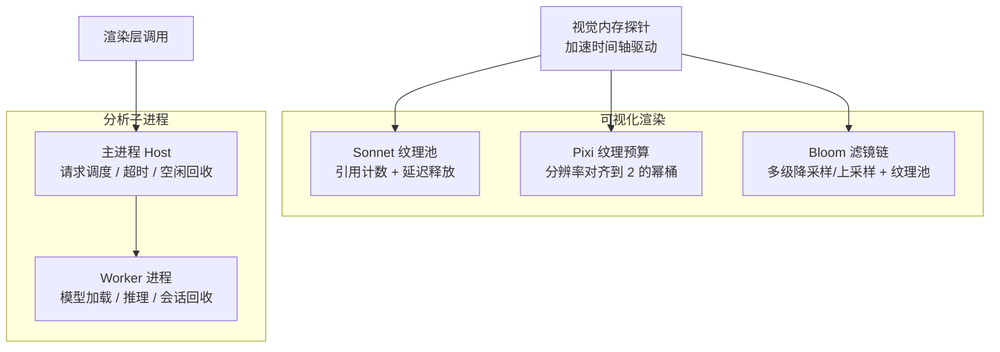
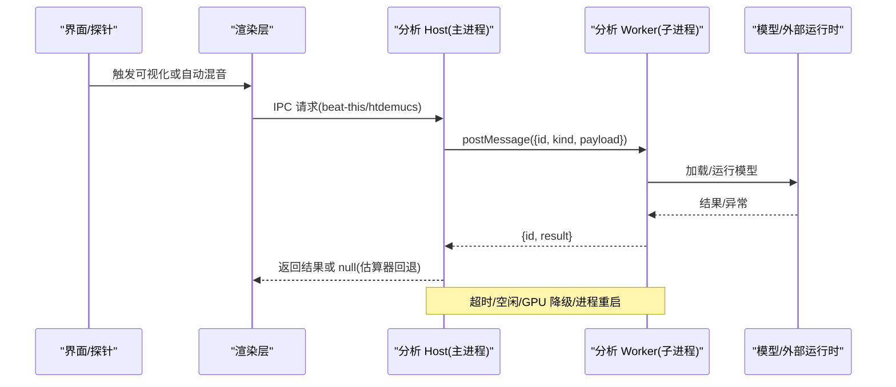
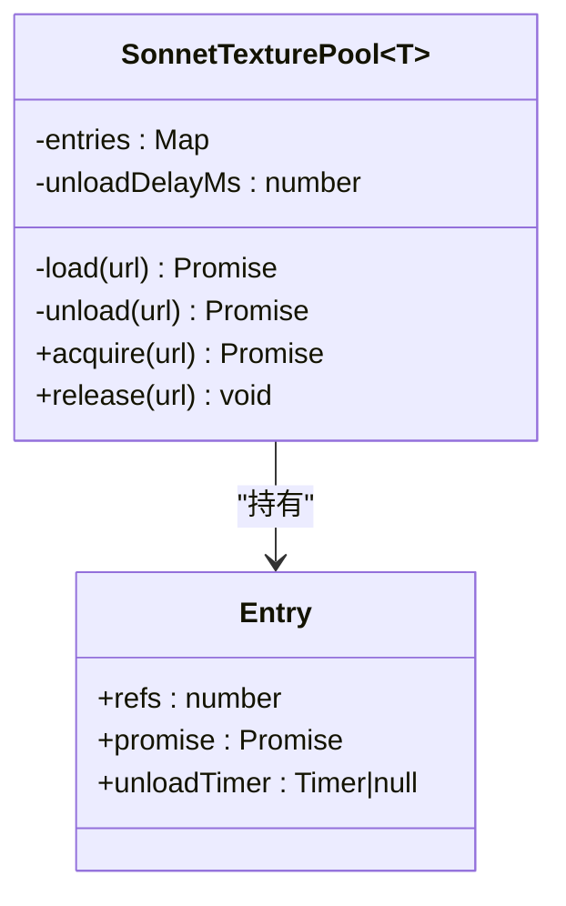
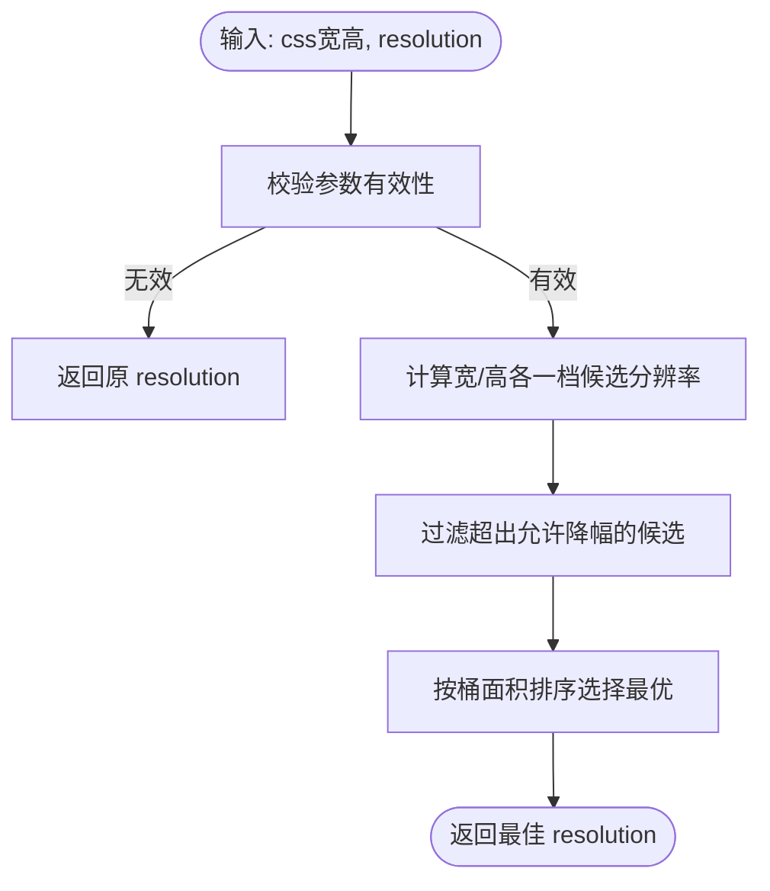
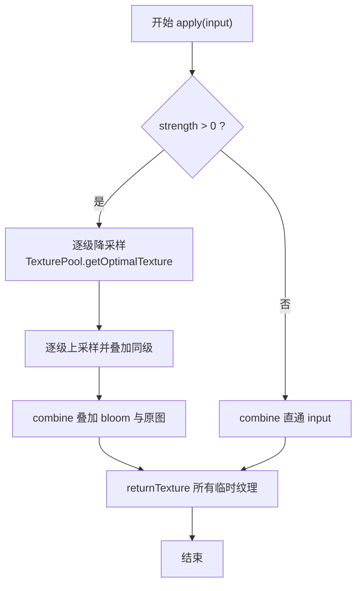
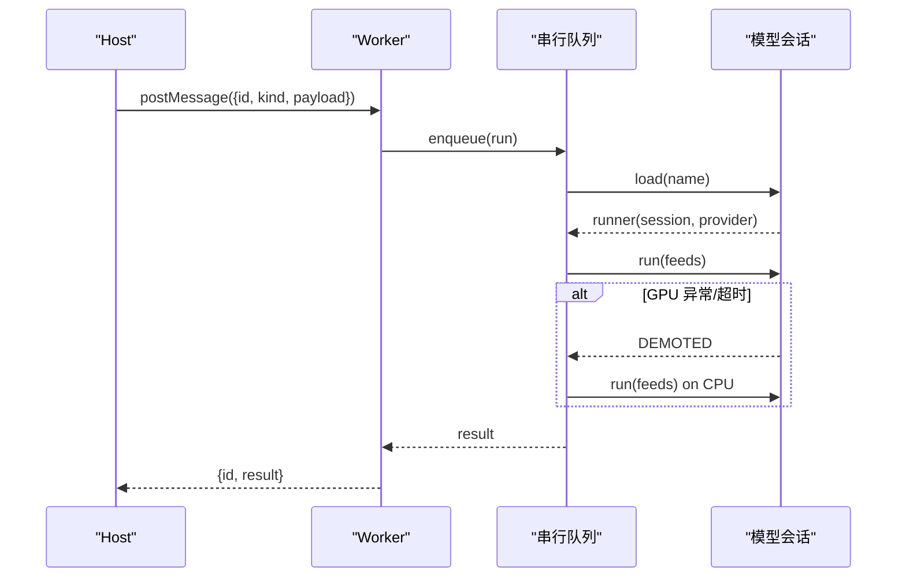
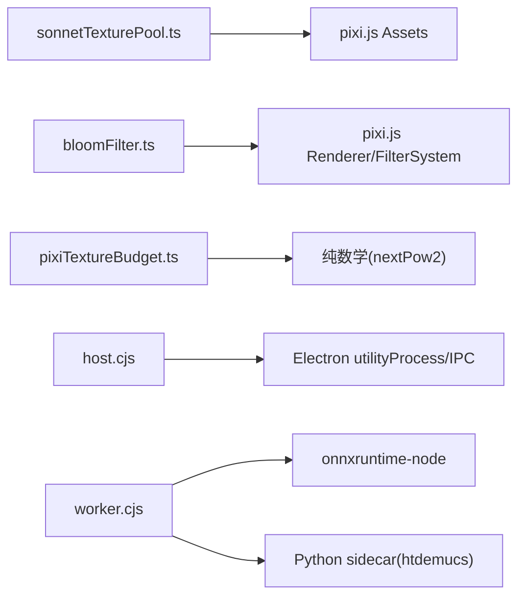

# 内存管理策略

<cite>
**本文引用的文件**   
- [electron/analysis/host.cjs](file://electron/analysis/host.cjs)
- [electron/analysis/worker.cjs](file://electron/analysis/worker.cjs)
- [src/components/visualizer/sonnet/sonnetTexturePool.ts](file://src/components/visualizer/sonnet/sonnetTexturePool.ts)
- [src/components/visualizer/pixiTextureBudget.ts](file://src/components/visualizer/pixiTextureBudget.ts)
- [src/components/visualizer/lumiere/light/bloomFilter.ts](file://src/components/visualizer/lumiere/light/bloomFilter.ts)
- [dev/probes/visualizerMemory.probe.tsx](file://dev/probes/visualizerMemory.probe.tsx)
- [test/manual/visualizer-memory-probe.mjs](file://test/manual/visualizer-memory-probe.mjs)
- [test/unit/services/debugMemorySamples.test.ts](file://test/unit/services/debugMemorySamples.test.ts)
- [test/unit/electron/debugModule.test.ts](file://test/unit/electron/debugModule.test.ts)
- [test/unit/automix/analysisHostDeadline.test.ts](file://test/unit/automix/analysisHostDeadline.test.ts)
</cite>

## 目录
1. [引言](#引言)
2. [项目结构](#项目结构)
3. [核心组件](#核心组件)
4. [架构总览](#架构总览)
5. [详细组件分析](#详细组件分析)
6. [依赖关系分析](#依赖关系分析)
7. [性能与内存特性](#性能与内存特性)
8. [故障排查指南](#故障排查指南)
9. [结论](#结论)
10. [附录](#附录)

## 引言
本文件面向可视化渲染系统与自动化混音分析子系统，系统化梳理其内存管理策略。重点覆盖：
- 对象池化与资源复用：纹理池、运行时资产缓存、延迟释放与引用计数。
- 垃圾回收优化：弱引用、循环引用避免、及时释放原则。
- 工作线程内存隔离：主进程与 worker 通信、数据序列化、GPU/CPU 执行提供者切换与超时保护。
- 大对象处理：分块输入、流式处理、临时对象清理。
- 内存泄漏检测：探针、采样脚本、DevTools 使用与泄漏模式识别。

## 项目结构
本项目在可视化渲染与分析两条路径上分别实现了精细的内存控制：
- 可视化渲染侧通过 Pixi 纹理预算、Bloom 滤镜链和 Sonnet 纹理池，控制 GPU 纹理分配与复用。
- 自动化混音分析侧通过 Electron utilityProcess 将重型模型推理移出主线程，配合超时、空闲释放与 GPU 降级策略，避免主线程阻塞与内存膨胀。

**图表来源**
- [src/components/visualizer/sonnet/sonnetTexturePool.ts:9-51](file://src/components/visualizer/sonnet/sonnetTexturePool.ts#L9-L51)
- [src/components/visualizer/pixiTextureBudget.ts:86-113](file://src/components/visualizer/pixiTextureBudget.ts#L86-L113)
- [src/components/visualizer/lumiere/light/bloomFilter.ts:187-245](file://src/components/visualizer/lumiere/light/bloomFilter.ts#L187-L245)
- [electron/analysis/host.cjs:50-171](file://electron/analysis/host.cjs#L50-L171)
- [electron/analysis/worker.cjs:240-284](file://electron/analysis/worker.cjs#L240-L284)

**章节来源**
- [dev/probes/visualizerMemory.probe.tsx:10-19](file://dev/probes/visualizerMemory.probe.tsx#L10-L19)
- [electron/analysis/host.cjs:5-14](file://electron/analysis/host.cjs#L5-L14)

## 核心组件
- Sonnet 纹理池：对 Pixi 资产进行全局引用计数与延迟卸载，跨重叠运行时重建共享资源，避免重复加载与过早释放。
- Pixi 纹理预算：将渲染分辨率“对齐”到 Pixi 纹理池的 2 的幂桶，减少全屏 pass 的无效像素占用。
- Bloom 滤镜链：多级降采样/上采样，严格从 TexturePool 获取并归还临时纹理，避免帧内纹理泄漏。
- 分析 Host：负责 spawn/kill worker、请求 ID 关联、超时熔断、空闲回收与 CPU/GPU 提供者标记。
- 分析 Worker：串行队列、会话生命周期、GPU 异常降级、按模型空闲释放、RSS 日志。

**章节来源**
- [src/components/visualizer/sonnet/sonnetTexturePool.ts:9-51](file://src/components/visualizer/sonnet/sonnetTexturePool.ts#L9-L51)
- [src/components/visualizer/pixiTextureBudget.ts:1-27](file://src/components/visualizer/pixiTextureBudget.ts#L1-L27)
- [src/components/visualizer/lumiere/light/bloomFilter.ts:187-245](file://src/components/visualizer/lumiere/light/bloomFilter.ts#L187-L245)
- [electron/analysis/host.cjs:50-171](file://electron/analysis/host.cjs#L50-L171)
- [electron/analysis/worker.cjs:215-238](file://electron/analysis/worker.cjs#L215-L238)

## 架构总览
可视化渲染与分析子系统采用“渲染侧轻量 + 计算侧隔离”的架构：
- 渲染侧聚焦于纹理预算与池化，确保 GPU 纹理按需分配、及时归还。
- 分析侧通过独立进程承载重型模型，避免阻塞主线程；同时提供超时、空闲释放与 GPU 降级等健壮性机制。

**图表来源**
- [electron/analysis/host.cjs:128-171](file://electron/analysis/host.cjs#L128-L171)
- [electron/analysis/worker.cjs:410-456](file://electron/analysis/worker.cjs#L410-L456)

## 详细组件分析

### 对象池化与资源复用
- Sonnet 纹理池
  - 引用计数：acquire/release 维护 refs，支持跨运行时重建共享同一资源。
  - 延迟卸载：release 后设置定时器，若期间再次 acquire 则取消卸载，避免竞态。
  - 错误恢复：load 失败时删除条目，防止脏状态残留。
  - 全局缓存：WeakMap 绑定 Pixi Assets，避免多实例重复创建池。

**图表来源**
- [src/components/visualizer/sonnet/sonnetTexturePool.ts:9-51](file://src/components/visualizer/sonnet/sonnetTexturePool.ts#L9-L51)

**章节来源**
- [src/components/visualizer/sonnet/sonnetTexturePool.ts:18-51](file://src/components/visualizer/sonnet/sonnetTexturePool.ts#L18-L51)
- [src/components/visualizer/sonnet/sonnetTexturePool.ts:55-67](file://src/components/visualizer/sonnet/sonnetTexturePool.ts#L55-L67)

- Pixi 纹理预算
  - 目标：将渲染分辨率对齐到 Pixi 纹理池的 2 的幂桶，避免全屏 pass 为未绘制像素付费。
  - 策略：仅考虑单步下降一档，限制最大分辨率降幅，平衡清晰度与显存。
  - 收益：在常见桌面视口下可将 2048x2048 桶降到 1024x1024，纹理内存降至四分之一。

**图表来源**
- [src/components/visualizer/pixiTextureBudget.ts:86-113](file://src/components/visualizer/pixiTextureBudget.ts#L86-L113)

**章节来源**
- [src/components/visualizer/pixiTextureBudget.ts:1-27](file://src/components/visualizer/pixiTextureBudget.ts#L1-L27)
- [src/components/visualizer/pixiTextureBudget.ts:86-113](file://src/components/visualizer/pixiTextureBudget.ts#L86-L113)

- Bloom 滤镜链
  - 多级降采样/上采样：每级通过 TexturePool.getOptimalTexture 获取临时纹理，并在完成后 returnTexture。
  - 统一 UV 映射：根据源/目标纹理尺寸计算 UV 缩放与 clamp，保证不同层级正确叠加。
  - 零强度短路：strength<=0 时直接跳过中间链，减少无谓分配。

**图表来源**
- [src/components/visualizer/lumiere/light/bloomFilter.ts:187-245](file://src/components/visualizer/lumiere/light/bloomFilter.ts#L187-L245)

**章节来源**
- [src/components/visualizer/lumiere/light/bloomFilter.ts:142-176](file://src/components/visualizer/lumiere/light/bloomFilter.ts#L142-L176)
- [src/components/visualizer/lumiere/light/bloomFilter.ts:187-245](file://src/components/visualizer/lumiere/light/bloomFilter.ts#L187-L245)

### 垃圾回收优化策略
- 弱引用
  - Sonnet 纹理池通过 WeakMap 绑定 Pixi Assets，避免池本身阻止 Pixi 模块被 GC。
- 循环引用避免
  - 池条目以 URL 为键，Entry 不反向持有池实例；Promise 与 unloadTimer 在合适时机清理。
- 及时释放原则
  - release 后立即安排延迟卸载；若期间再次 acquire 则取消卸载，避免竞态导致的提前释放。
  - Bloom 滤镜链在每帧结束后立即归还所有临时纹理，避免跨帧累积。

**章节来源**
- [src/components/visualizer/sonnet/sonnetTexturePool.ts:55-67](file://src/components/visualizer/sonnet/sonnetTexturePool.ts#L55-L67)
- [src/components/visualizer/sonnet/sonnetTexturePool.ts:41-51](file://src/components/visualizer/sonnet/sonnetTexturePool.ts#L41-L51)
- [src/components/visualizer/lumiere/light/bloomFilter.ts:244-245](file://src/components/visualizer/lumiere/light/bloomFilter.ts#L244-L245)

### 工作线程内存隔离与通信
- 主进程 Host
  - 请求调度：为每个请求生成唯一 id，维护 pending map，确保 reply 与 deadline 任一到达都能 settle。
  - 超时熔断：针对特定任务（如 beat-this）设置硬上限，超时时 kill worker 并标记 forceCpu，重试走 CPU。
  - 空闲回收：无请求时启动 idle timer，停止 worker 释放全部字节。
- Worker 进程
  - 串行队列：running 计数器与 queue 保证同一时刻只有一个推理任务，避免并发放大内存。
  - 会话管理：按模型维护 session，记录 usedAt；sweep 定时释放长时间空闲的会话。
  - GPU 降级：捕获异常或耗时超过阈值时 demote 到 CPU，并重试一次请求。
  - RSS 日志：每次完成输出耗时与 RSS，便于定位异常增长。

**图表来源**
- [electron/analysis/host.cjs:128-171](file://electron/analysis/host.cjs#L128-L171)
- [electron/analysis/worker.cjs:410-456](file://electron/analysis/worker.cjs#L410-L456)
- [electron/analysis/worker.cjs:181-204](file://electron/analysis/worker.cjs#L181-L204)

**章节来源**
- [electron/analysis/host.cjs:50-171](file://electron/analysis/host.cjs#L50-L171)
- [electron/analysis/worker.cjs:215-238](file://electron/analysis/worker.cjs#L215-L238)
- [electron/analysis/worker.cjs:240-284](file://electron/analysis/worker.cjs#L240-L284)
- [electron/analysis/worker.cjs:410-456](file://electron/analysis/worker.cjs#L410-L456)

### 大对象处理策略
- 分块输入
  - beat_this 将频谱切分为 frames 块，限制 MAX_CHUNK_FRAMES，避免一次性过大张量导致原生崩溃。
  - htdemucs 限制单次样本数 MAX_SAMPLES，避免传输与处理峰值过高。
- 流式处理
  - 对 spectrogram 逐 chunk 推理，输出拷贝为 Float32Array，避免传递原生 Tensor 缓冲区。
- 临时对象清理
  - Bloom 滤镜链每帧结束后归还所有临时纹理，避免跨帧累积。
  - Worker 中 running 计数器与 sweep 定时器协同，确保长任务不被误判为空闲。

**章节来源**
- [electron/analysis/worker.cjs:292-337](file://electron/analysis/worker.cjs#L292-L337)
- [electron/analysis/worker.cjs:348-393](file://electron/analysis/worker.cjs#L348-L393)
- [src/components/visualizer/lumiere/light/bloomFilter.ts:244-245](file://src/components/visualizer/lumiere/light/bloomFilter.ts#L244-L245)
- [electron/analysis/worker.cjs:215-238](file://electron/analysis/worker.cjs#L215-L238)

## 依赖关系分析
- 渲染侧依赖
  - Sonnet 纹理池依赖 Pixi Assets 的 load/unload。
  - Bloom 滤镜依赖 Pixi 的 FilterSystem、GlProgram、TexturePool。
  - 纹理预算模块独立实现 nextPow2，避免引入完整 Pixi 渲染器。
- 分析侧依赖
  - Host 依赖 Electron utilityProcess 与 IPC。
  - Worker 依赖 onnxruntime-node 与 Python sidecar（htdemucs）。

**图表来源**
- [src/components/visualizer/sonnet/sonnetTexturePool.ts:55-67](file://src/components/visualizer/sonnet/sonnetTexturePool.ts#L55-L67)
- [src/components/visualizer/lumiere/light/bloomFilter.ts:142-166](file://src/components/visualizer/lumiere/light/bloomFilter.ts#L142-L166)
- [src/components/visualizer/pixiTextureBudget.ts:28-45](file://src/components/visualizer/pixiTextureBudget.ts#L28-L45)
- [electron/analysis/host.cjs:85-102](file://electron/analysis/host.cjs#L85-L102)
- [electron/analysis/worker.cjs:258-284](file://electron/analysis/worker.cjs#L258-L284)

**章节来源**
- [src/components/visualizer/sonnet/sonnetTexturePool.ts:55-67](file://src/components/visualizer/sonnet/sonnetTexturePool.ts#L55-L67)
- [src/components/visualizer/lumiere/light/bloomFilter.ts:142-166](file://src/components/visualizer/lumiere/light/bloomFilter.ts#L142-L166)
- [src/components/visualizer/pixiTextureBudget.ts:28-45](file://src/components/visualizer/pixiTextureBudget.ts#L28-L45)
- [electron/analysis/host.cjs:85-102](file://electron/analysis/host.cjs#L85-L102)
- [electron/analysis/worker.cjs:258-284](file://electron/analysis/worker.cjs#L258-L284)

## 性能与内存特性
- 纹理预算
  - 在常见视口下可将纹理桶从 2048x2048 降到 1024x1024，纹理内存降至四分之一，同时保持较高填充率。
- Bloom 滤镜
  - 通过 TexturePool 复用临时纹理，避免每帧分配新对象；strength=0 时短路，减少无谓开销。
- 分析子进程
  - 串行队列避免并发放大内存；按模型空闲释放会话；GPU 异常自动降级到 CPU；RSS 日志辅助定位。
- 探针与采样
  - visualizerMemory 探针以加速时间轴驱动单个 visualizer，配合手动脚本周期性采样 Chromium 各进程工作集，用于横向对比与稳态观测。

**章节来源**
- [src/components/visualizer/pixiTextureBudget.ts:1-27](file://src/components/visualizer/pixiTextureBudget.ts#L1-L27)
- [src/components/visualizer/lumiere/light/bloomFilter.ts:187-245](file://src/components/visualizer/lumiere/light/bloomFilter.ts#L187-L245)
- [electron/analysis/worker.cjs:215-238](file://electron/analysis/worker.cjs#L215-L238)
- [electron/analysis/worker.cjs:436-447](file://electron/analysis/worker.cjs#L436-L447)
- [dev/probes/visualizerMemory.probe.tsx:10-19](file://dev/probes/visualizerMemory.probe.tsx#L10-L19)
- [test/manual/visualizer-memory-probe.mjs:124-157](file://test/manual/visualizer-memory-probe.mjs#L124-L157)

## 故障排查指南
- 超时与卡死
  - Host 对 beat-this 设置 90 秒硬上限；超时会 kill worker 并标记 forceCpu，重试走 CPU。
  - 测试用例验证了“杀死挂起 worker、有界回答、强制 CPU 重试、恢复服务”的闭环。
- 内存泄漏检测
  - 使用 visualizerMemory 探针与 manual 脚本采集各进程工作集，观察稳态趋势与类型分布。
  - 调试模块测试覆盖了内存历史边界条件、缺失字段处理、进程排序与 fd 计数提取。
- DevTools 建议
  - 结合 Chrome DevTools 的 Memory 面板进行快照对比，关注 JS Heap、DOM Nodes、Canvas 与 GPU 资源。
  - 关注 rendererHeapUsedMB 与 workingSet 的差异：堆稳定但工作集上升通常指向原生/GPU 资源。

**章节来源**
- [electron/analysis/host.cjs:128-171](file://electron/analysis/host.cjs#L128-L171)
- [test/unit/automix/analysisHostDeadline.test.ts:66-91](file://test/unit/automix/analysisHostDeadline.test.ts#L66-L91)
- [test/manual/visualizer-memory-probe.mjs:124-157](file://test/manual/visualizer-memory-probe.mjs#L124-L157)
- [test/unit/services/debugMemorySamples.test.ts:1-38](file://test/unit/services/debugMemorySamples.test.ts#L1-L38)
- [test/unit/electron/debugModule.test.ts:56-170](file://test/unit/electron/debugModule.test.ts#L56-L170)

## 结论
该代码库在可视化渲染与分析两条路径上均实现了稳健的内存管理：
- 渲染侧通过纹理预算与池化，严格控制 GPU 纹理分配与复用，避免帧内/跨帧泄漏。
- 分析侧通过独立进程、串行队列、会话回收与 GPU 降级，确保主线程响应性与内存可控。
- 探针与测试为长期稳定性提供了可观测性与回归保障。

## 附录
- 关键配置项速览
  - 纹理预算最大降幅：TEXTURE_POOL_MAX_RESOLUTION_DROP = 0.25
  - 分析超时：DEADLINE_MS['beat-this'] = 90_000ms
  - 分析空闲回收：IDLE_MS = 120_000ms
  - Worker 扫描间隔：10_000ms
  - 最大分块帧数：MAX_CHUNK_FRAMES = 1500
  - 最大样本数：MAX_SAMPLES = 40 * 44100

**章节来源**
- [src/components/visualizer/pixiTextureBudget.ts:64](file://src/components/visualizer/pixiTextureBudget.ts#L64)
- [electron/analysis/host.cjs:23-39](file://electron/analysis/host.cjs#L23-L39)
- [electron/analysis/worker.cjs:215-238](file://electron/analysis/worker.cjs#L215-L238)
- [electron/analysis/worker.cjs:292-356](file://electron/analysis/worker.cjs#L292-L356)