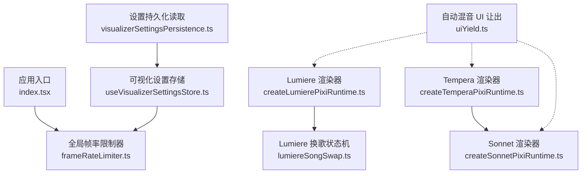
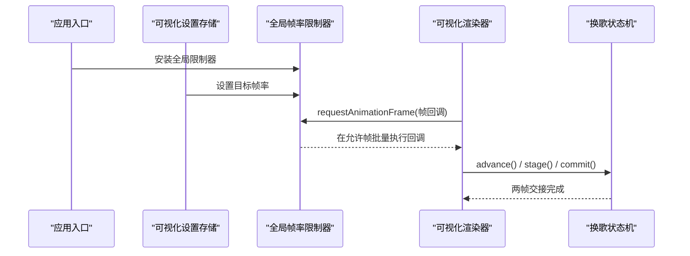
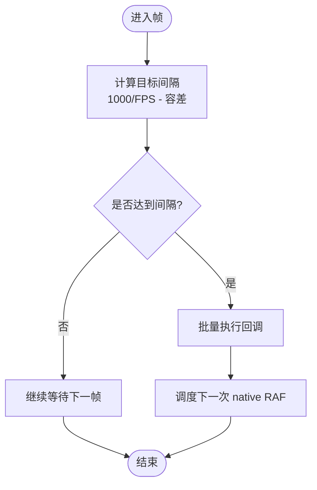
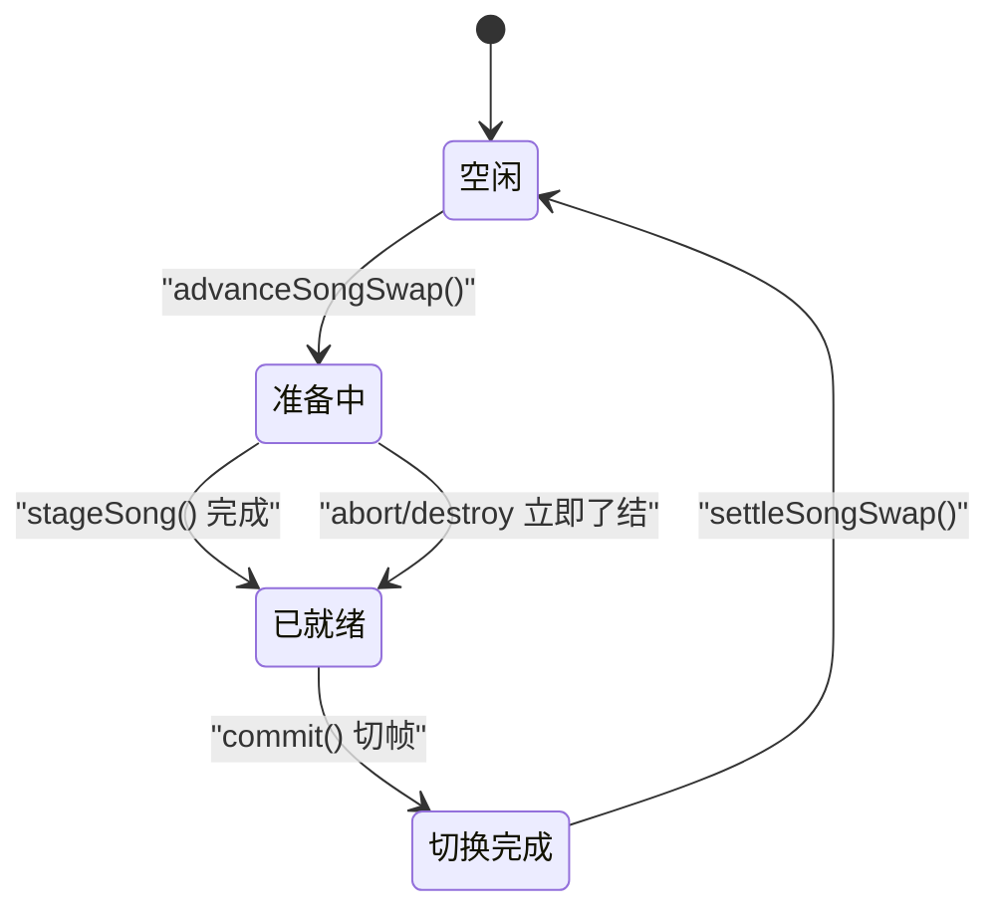
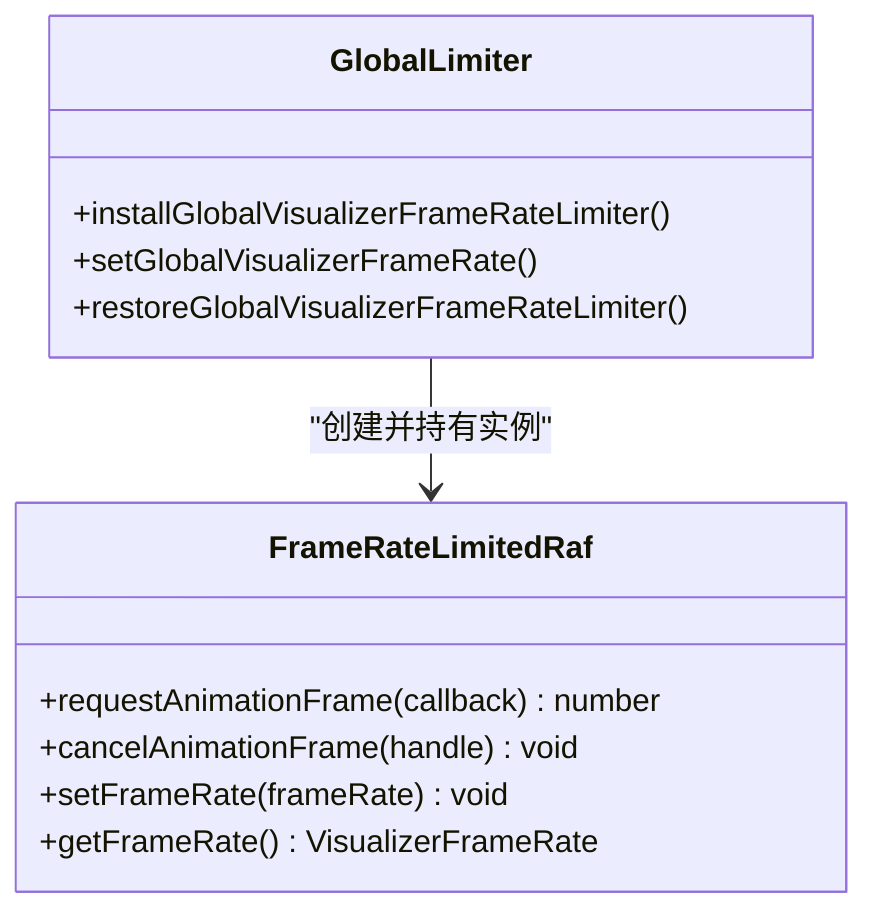
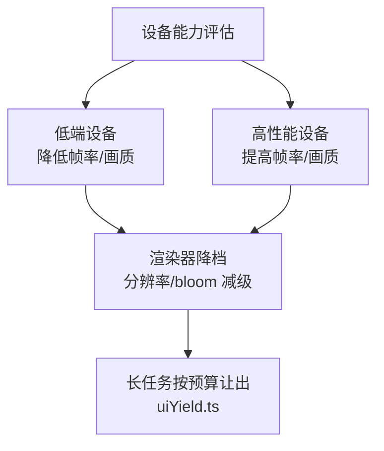
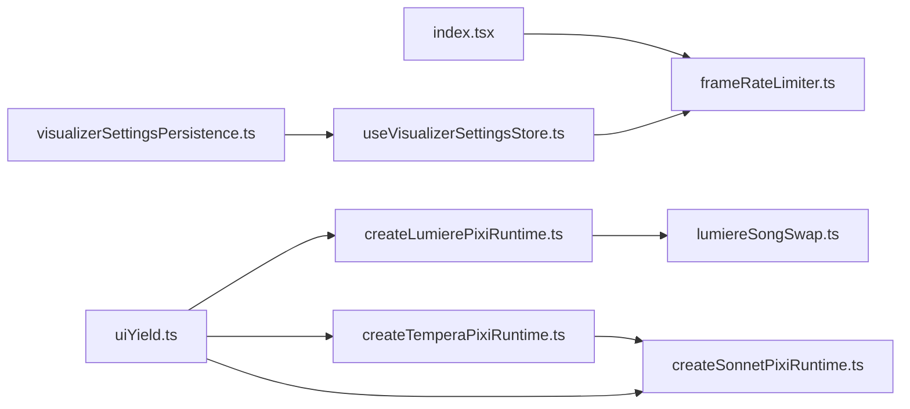

# 帧率优化

<cite>
**本文引用的文件**   
- [frameRateLimiter.ts](file://src/utils/frameRateLimiter.ts)
- [useVisualizerSettingsStore.ts](file://src/stores/useVisualizerSettingsStore.ts)
- [visualizerSettingsPersistence.ts](file://src/stores/visualizerSettingsPersistence.ts)
- [index.tsx](file://src/index.tsx)
- [createLumierePixiRuntime.ts](file://src/components/visualizer/lumiere/createLumierePixiRuntime.ts)
- [lumiereSongSwap.ts](file://src/components/visualizer/lumiere/lumiereSongSwap.ts)
- [createTemperaPixiRuntime.ts](file://src/components/visualizer/tempera/createTemperaPixiRuntime.ts)
- [createSonnetPixiRuntime.ts](file://src/components/visualizer/sonnet/createSonnetPixiRuntime.ts)
- [uiYield.ts](file://src/services/automix/uiYield.ts)
- [frameRateLimiter.test.ts](file://test/unit/utils/frameRateLimiter.test.ts)
</cite>

## 目录
1. [简介](#简介)
2. [项目结构](#项目结构)
3. [核心组件](#核心组件)
4. [架构总览](#架构总览)
5. [详细组件分析](#详细组件分析)
6. [依赖关系分析](#依赖关系分析)
7. [性能考量](#性能考量)
8. [故障排查指南](#故障排查指南)
9. [结论](#结论)
10. [附录](#附录)

## 简介
本文件面向可视化渲染系统的帧率优化，系统性说明以下方面：
- 帧率限制器的工作原理：目标 FPS、动态切换与全局节流。
- 歌曲切换时的渲染优化：场景过渡、资源预加载与状态同步。
- 渲染循环优化：requestAnimationFrame 使用、批量更新与渲染节流。
- 不同设备的调优策略：低端设备降级与高性能设备增强。
- 帧率监控与分析工具：瓶颈识别与优化建议。

## 项目结构
围绕帧率优化的关键代码分布在以下位置：
- 全局帧率限制器与 RAF 拦截：utils/frameRateLimiter.ts
- 设置持久化与 UI 驱动：stores/visualizerSettingsPersistence.ts、stores/useVisualizerSettingsStore.ts
- 应用启动时安装全局限制器：index.tsx
- 具体渲染器的帧调度与换歌优化：components/visualizer/lumiere、tempera、sonnet
- 长任务分片与主线程让出：services/automix/uiYield.ts

**图示来源** 
- [index.tsx:2-23](file://src/index.tsx#L2-L23)
- [frameRateLimiter.ts:166-196](file://src/utils/frameRateLimiter.ts#L166-L196)
- [useVisualizerSettingsStore.ts:117-126](file://src/stores/useVisualizerSettingsStore.ts#L117-L126)
- [visualizerSettingsPersistence.ts:120-126](file://src/stores/visualizerSettingsPersistence.ts#L120-L126)
- [createLumierePixiRuntime.ts:191-212](file://src/components/visualizer/lumiere/createLumierePixiRuntime.ts#L191-L212)
- [lumiereSongSwap.ts:1-36](file://src/components/visualizer/lumiere/lumiereSongSwap.ts#L1-L36)
- [createTemperaPixiRuntime.ts:674-692](file://src/components/visualizer/tempera/createTemperaPixiRuntime.ts#L674-L692)
- [createSonnetPixiRuntime.ts:950-977](file://src/components/visualizer/sonnet/createSonnetPixiRuntime.ts#L950-L977)
- [uiYield.ts:1-18](file://src/services/automix/uiYield.ts#L1-L18)

**章节来源**
- [index.tsx:2-23](file://src/index.tsx#L2-L23)
- [frameRateLimiter.ts:1-197](file://src/utils/frameRateLimiter.ts#L1-L197)
- [useVisualizerSettingsStore.ts:117-316](file://src/stores/useVisualizerSettingsStore.ts#L117-L316)
- [visualizerSettingsPersistence.ts:117-150](file://src/stores/visualizerSettingsPersistence.ts#L117-L150)
- [createLumierePixiRuntime.ts:191-316](file://src/components/visualizer/lumiere/createLumierePixiRuntime.ts#L191-L316)
- [lumiereSongSwap.ts:1-36](file://src/components/visualizer/lumiere/lumiereSongSwap.ts#L1-L36)
- [createTemperaPixiRuntime.ts:674-985](file://src/components/visualizer/tempera/createTemperaPixiRuntime.ts#L674-L985)
- [createSonnetPixiRuntime.ts:950-977](file://src/components/visualizer/sonnet/createSonnetPixiRuntime.ts#L950-L977)
- [uiYield.ts:1-18](file://src/services/automix/uiYield.ts#L1-L18)

## 核心组件
- 帧率限制器模块
  - 提供解析、判断、创建受限 RAF、全局安装/恢复等能力。
  - 支持关闭、60/90/120 FPS 档位；通过时间间隔判定是否处理当前帧。
  - 将多个回调在允许帧上批量执行，避免抖动。
- 可视化设置存储
  - 负责从本地存储读取帧率配置，并在用户更改时写入并触发全局限制器更新。
- 设置持久化
  - 提供统一的读取接口，保证跨环境安全访问 localStorage。
- 渲染器帧调度与换歌优化
  - Lumiere/Tempera/Sonnet 各自实现每帧工作分配、场景缓存与相邻段落预构建。
  - 换歌采用两帧交接：第一帧离屏构建，第二帧切到，切帧不做重活。
- 自动混音 UI 让出
  - 将长任务按时间预算切分，避免阻塞动画帧。

**章节来源**
- [frameRateLimiter.ts:22-54](file://src/utils/frameRateLimiter.ts#L22-L54)
- [frameRateLimiter.ts:63-129](file://src/utils/frameRateLimiter.ts#L63-L129)
- [useVisualizerSettingsStore.ts:250-256](file://src/stores/useVisualizerSettingsStore.ts#L250-L256)
- [visualizerSettingsPersistence.ts:120-126](file://src/stores/visualizerSettingsPersistence.ts#L120-L126)
- [createLumierePixiRuntime.ts:271-316](file://src/components/visualizer/lumiere/createLumierePixiRuntime.ts#L271-L316)
- [createTemperaPixiRuntime.ts:674-692](file://src/components/visualizer/tempera/createTemperaPixiRuntime.ts#L674-L692)
- [createSonnetPixiRuntime.ts:950-977](file://src/components/visualizer/sonnet/createSonnetPixiRuntime.ts#L950-L977)
- [uiYield.ts:1-18](file://src/services/automix/uiYield.ts#L1-L18)

## 架构总览
下图展示从应用启动到渲染循环的帧率控制路径：应用入口安装全局限制器，设置层读写帧率配置，渲染器通过受限 RAF 执行每帧逻辑，换歌流程在两帧内完成交接。

**图示来源**
- [index.tsx:2-23](file://src/index.tsx#L2-L23)
- [frameRateLimiter.ts:166-196](file://src/utils/frameRateLimiter.ts#L166-L196)
- [useVisualizerSettingsStore.ts:250-256](file://src/stores/useVisualizerSettingsStore.ts#L250-L256)
- [createLumierePixiRuntime.ts:271-316](file://src/components/visualizer/lumiere/createLumierePixiRuntime.ts#L271-L316)
- [lumiereSongSwap.ts:1-36](file://src/components/visualizer/lumiere/lumiereSongSwap.ts#L1-L36)

## 详细组件分析

### 帧率限制器工作原理
- 目标 FPS 设置
  - 支持 off、60、90、120；off/auto/null 均视为关闭限制。
  - 通过 shouldProcessFrameAtRate 基于时间间隔决定是否处理当前帧。
- 动态帧率调整
  - setGlobalVisualizerFrameRate 可动态切换或恢复原生 RAF。
  - createFrameRateLimitedRaf 暴露 setFrameRate/getFrameRate，内部重置上次处理时间并重新调度。
- 性能自适应机制
  - 全局安装时从 localStorage 读取初始帧率；若为 off 则直接恢复原生函数。
  - 所有在该帧注册的回调会在允许帧上一次性 flush，减少多次 RAF 调用开销。

**图示来源**
- [frameRateLimiter.ts:42-54](file://src/utils/frameRateLimiter.ts#L42-L54)
- [frameRateLimiter.ts:63-129](file://src/utils/frameRateLimiter.ts#L63-L129)

**章节来源**
- [frameRateLimiter.ts:22-54](file://src/utils/frameRateLimiter.ts#L22-L54)
- [frameRateLimiter.ts:63-129](file://src/utils/frameRateLimiter.ts#L63-L129)
- [frameRateLimiter.ts:131-196](file://src/utils/frameRateLimiter.ts#L131-L196)
- [frameRateLimiter.test.ts:1-27](file://test/unit/utils/frameRateLimiter.test.ts#L1-L27)

### 歌曲切换时的渲染优化策略
- 场景过渡动画
  - Lumiere/Tempera/Sonnet 均采用“两帧交接”模式：第一帧离屏构建新场景，第二帧切到新场景；切帧不执行重活，避免卡顿。
- 资源预加载
  - 渲染器在空闲帧优先释放旧场景，其次预构建下一段或上一段，降低切换时的突发负载。
- 状态同步
  - 换歌状态机维护 pending/staged/prepared/settle 等状态，确保取消或销毁时能立即了结，避免挂起 drain 循环。

**图示来源**
- [lumiereSongSwap.ts:1-36](file://src/components/visualizer/lumiere/lumiereSongSwap.ts#L1-L36)
- [createTemperaPixiRuntime.ts:956-985](file://src/components/visualizer/tempera/createTemperaPixiRuntime.ts#L956-L985)
- [createSonnetPixiRuntime.ts:950-977](file://src/components/visualizer/sonnet/createSonnetPixiRuntime.ts#L950-L977)

**章节来源**
- [createLumierePixiRuntime.ts:271-316](file://src/components/visualizer/lumiere/createLumierePixiRuntime.ts#L271-L316)
- [createTemperaPixiRuntime.ts:674-692](file://src/components/visualizer/tempera/createTemperaPixiRuntime.ts#L674-L692)
- [createTemperaPixiRuntime.ts:956-985](file://src/components/visualizer/tempera/createTemperaPixiRuntime.ts#L956-L985)
- [createSonnetPixiRuntime.ts:950-977](file://src/components/visualizer/sonnet/createSonnetPixiRuntime.ts#L950-L977)
- [lumiereSongSwap.ts:1-36](file://src/components/visualizer/lumiere/lumiereSongSwap.ts#L1-L36)

### 渲染循环优化技术
- requestAnimationFrame 使用
  - 通过全局限制器替换 window.requestAnimationFrame/cancelAnimationFrame，统一节流。
- 批量更新
  - 同一允许帧内的所有回调被收集并一次性执行，减少多次 RAF 调度。
- 渲染节流
  - 根据目标 FPS 计算间隔，未到间隔则跳过处理，避免无效绘制。

**图示来源**
- [frameRateLimiter.ts:63-129](file://src/utils/frameRateLimiter.ts#L63-L129)
- [frameRateLimiter.ts:131-196](file://src/utils/frameRateLimiter.ts#L131-L196)

**章节来源**
- [frameRateLimiter.ts:63-129](file://src/utils/frameRateLimiter.ts#L63-L129)
- [frameRateLimiter.ts:131-196](file://src/utils/frameRateLimiter.ts#L131-L196)

### 不同设备上的帧率调优策略
- 低端设备降级
  - 通过设置 store 将帧率设为 off 或较低值（如 60），减少 GPU/CPU 压力。
  - 渲染器侧可通过画质档与视口分辨率联动降低图形组分辨率与 bloom 等级。
- 高性能设备增强
  - 开启 90/120 FPS，配合高质量渲染参数，获得更流畅体验。
- 自动混音长任务让出
  - 使用 uiYield.ts 的时间预算（例如 8ms）切分扫描任务，避免阻塞动画帧。

**图示来源**
- [useVisualizerSettingsStore.ts:250-256](file://src/stores/useVisualizerSettingsStore.ts#L250-L256)
- [createLumierePixiRuntime.ts:191-212](file://src/components/visualizer/lumiere/createLumierePixiRuntime.ts#L191-L212)
- [uiYield.ts:1-18](file://src/services/automix/uiYield.ts#L1-L18)

**章节来源**
- [useVisualizerSettingsStore.ts:250-256](file://src/stores/useVisualizerSettingsStore.ts#L250-L256)
- [createLumierePixiRuntime.ts:191-212](file://src/components/visualizer/lumiere/createLumierePixiRuntime.ts#L191-L212)
- [uiYield.ts:1-18](file://src/services/automix/uiYield.ts#L1-L18)

## 依赖关系分析
- 设置层依赖 frameRateLimiter 以应用帧率变更。
- 应用入口在安装阶段注入全局限制器。
- 各渲染器通过受限 RAF 执行帧逻辑，并通过换歌状态机协调两帧交接。
- 自动混音模块通过时间预算让出主线程，避免与渲染循环竞争。

**图示来源**
- [index.tsx:2-23](file://src/index.tsx#L2-L23)
- [frameRateLimiter.ts:166-196](file://src/utils/frameRateLimiter.ts#L166-L196)
- [useVisualizerSettingsStore.ts:117-126](file://src/stores/useVisualizerSettingsStore.ts#L117-L126)
- [visualizerSettingsPersistence.ts:120-126](file://src/stores/visualizerSettingsPersistence.ts#L120-L126)
- [createLumierePixiRuntime.ts:191-316](file://src/components/visualizer/lumiere/createLumierePixiRuntime.ts#L191-L316)
- [lumiereSongSwap.ts:1-36](file://src/components/visualizer/lumiere/lumiereSongSwap.ts#L1-L36)
- [createTemperaPixiRuntime.ts:674-985](file://src/components/visualizer/tempera/createTemperaPixiRuntime.ts#L674-L985)
- [createSonnetPixiRuntime.ts:950-977](file://src/components/visualizer/sonnet/createSonnetPixiRuntime.ts#L950-L977)
- [uiYield.ts:1-18](file://src/services/automix/uiYield.ts#L1-L18)

**章节来源**
- [index.tsx:2-23](file://src/index.tsx#L2-L23)
- [frameRateLimiter.ts:166-196](file://src/utils/frameRateLimiter.ts#L166-L196)
- [useVisualizerSettingsStore.ts:117-126](file://src/stores/useVisualizerSettingsStore.ts#L117-L126)
- [visualizerSettingsPersistence.ts:120-126](file://src/stores/visualizerSettingsPersistence.ts#L120-L126)
- [createLumierePixiRuntime.ts:191-316](file://src/components/visualizer/lumiere/createLumierePixiRuntime.ts#L191-L316)
- [lumiereSongSwap.ts:1-36](file://src/components/visualizer/lumiere/lumiereSongSwap.ts#L1-L36)
- [createTemperaPixiRuntime.ts:674-985](file://src/components/visualizer/tempera/createTemperaPixiRuntime.ts#L674-L985)
- [createSonnetPixiRuntime.ts:950-977](file://src/components/visualizer/sonnet/createSonnetPixiRuntime.ts#L950-L977)
- [uiYield.ts:1-18](file://src/services/automix/uiYield.ts#L1-L18)

## 性能考量
- 帧率限制器
  - 使用固定间隔判定，避免频繁 RAF 调用；错误回调隔离，防止单点失败影响后续帧。
- 渲染器
  - 每帧只做一件昂贵操作（释放旧场景、预建邻居、构建片尾卡），降低峰值负载。
  - 场景缓存与裁剪，仅保留活跃及邻近段落，减少内存占用。
- 自动混音
  - 按时间预算切分任务，避免长任务阻塞 UI 线程。

[本节为通用性能指导，不直接分析具体文件]

## 故障排查指南
- 帧率未生效
  - 检查是否已安装全局限制器；确认设置层是否正确调用 setGlobalVisualizerFrameRate。
  - 验证 localStorage 中的键值是否被正确解析为 off 或数字。
- 帧率切换后卡顿
  - 确认 setFrameRate 是否重置 lastProcessedTimestamp 并重新调度 native RAF。
  - 检查回调中是否有异常抛出导致后续帧中断。
- 换歌卡顿
  - 确认两帧交接逻辑是否按预期执行：先 stage 再 commit。
  - 检查是否在切帧前完成了必要的资源预构建。

**章节来源**
- [frameRateLimiter.ts:131-196](file://src/utils/frameRateLimiter.ts#L131-L196)
- [frameRateLimiter.test.ts:29-129](file://test/unit/utils/frameRateLimiter.test.ts#L29-L129)
- [createLumierePixiRuntime.ts:271-316](file://src/components/visualizer/lumiere/createLumierePixiRuntime.ts#L271-L316)
- [createTemperaPixiRuntime.ts:674-692](file://src/components/visualizer/tempera/createTemperaPixiRuntime.ts#L674-L692)

## 结论
该可视化渲染系统通过全局帧率限制器、渲染器帧调度与两帧换歌交接，实现了稳定流畅的视觉体验。设置层与持久化层协同管理帧率配置，自动混音模块通过时间预算让出主线程，进一步保障动画帧的连续性。针对不同设备，系统支持动态降级与增强，结合场景缓存与预构建策略，有效平衡性能与画质。

[本节为总结性内容，不直接分析具体文件]

## 附录
- 关键 API 与常量
  - VISUALIZER_FRAME_RATE_OPTIONS：支持的帧率选项。
  - VISUALIZER_FRAME_RATE_STORAGE_KEY：localStorage 键名。
  - parseVisualizerFrameRate：解析帧率字符串。
  - shouldProcessFrameAtRate：判断是否处理当前帧。
  - createFrameRateLimitedRaf：创建受限 RAF。
  - installGlobalVisualizerFrameRateLimiter：安装全局限制器。
  - setGlobalVisualizerFrameRate：设置全局帧率。
  - restoreGlobalVisualizerFrameRateLimiter：恢复原生 RAF。

**章节来源**
- [frameRateLimiter.ts:22-54](file://src/utils/frameRateLimiter.ts#L22-L54)
- [frameRateLimiter.ts:63-129](file://src/utils/frameRateLimiter.ts#L63-L129)
- [frameRateLimiter.ts:131-196](file://src/utils/frameRateLimiter.ts#L131-L196)