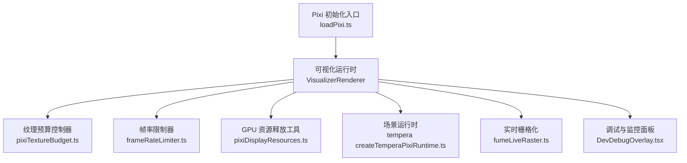
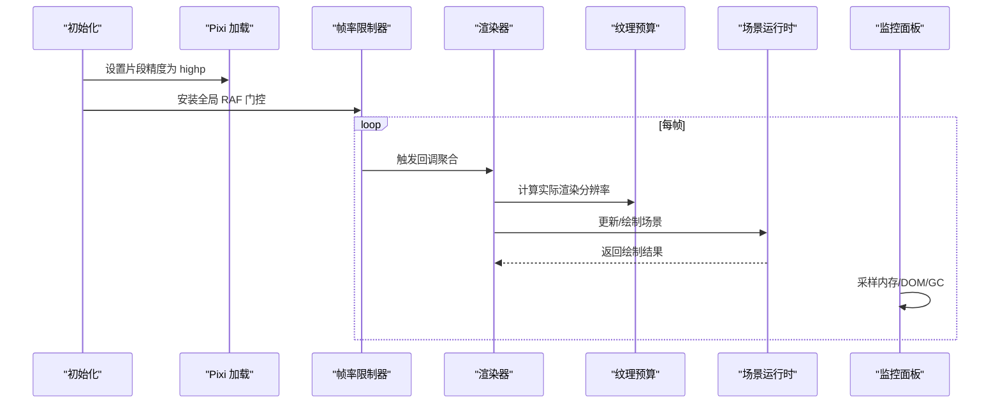
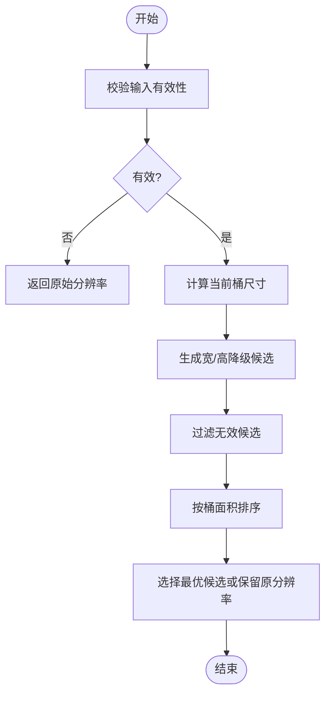
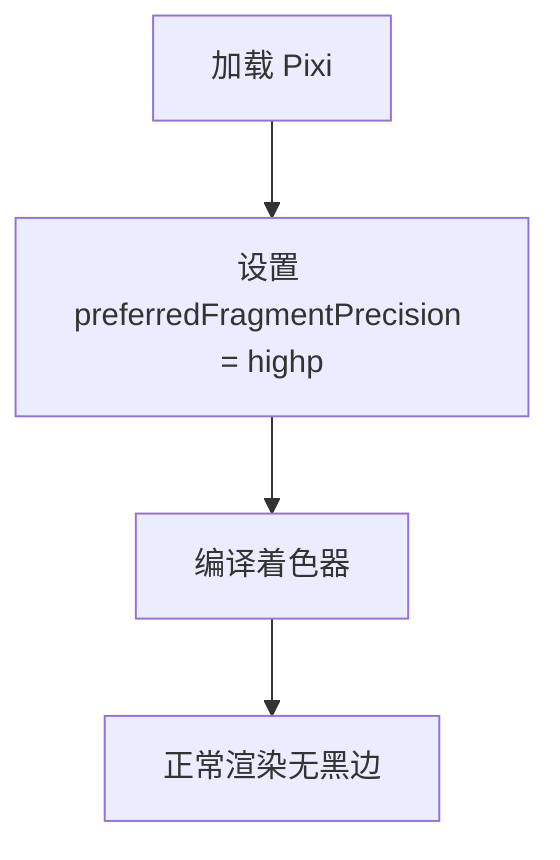
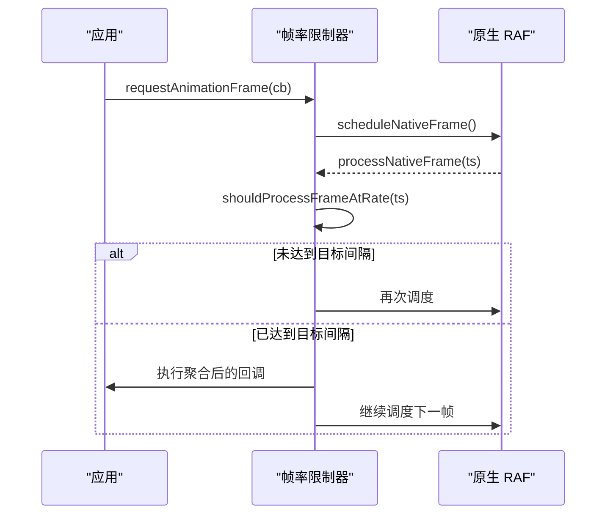
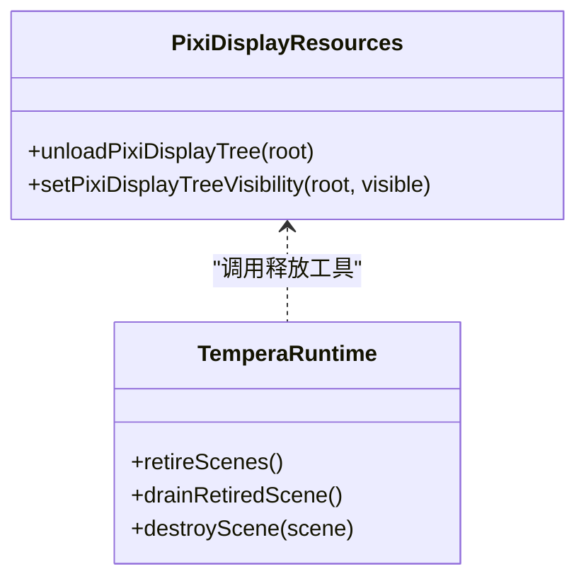
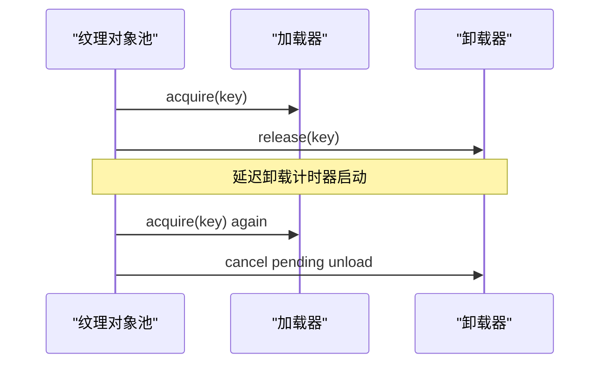
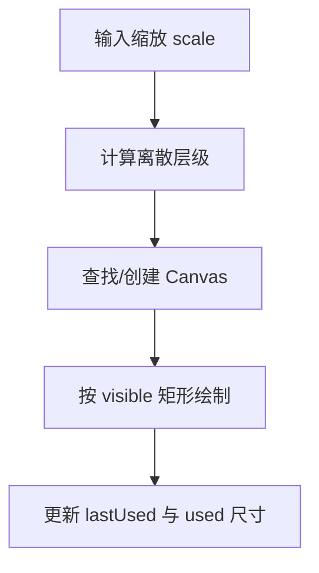
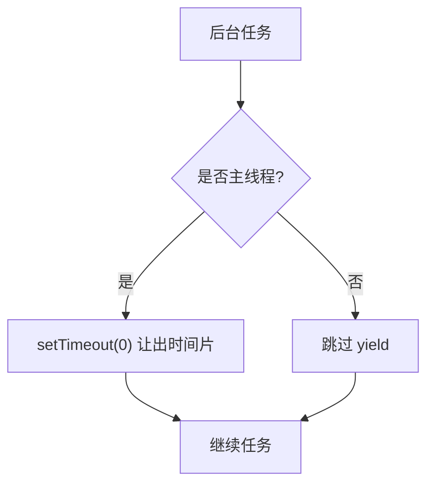
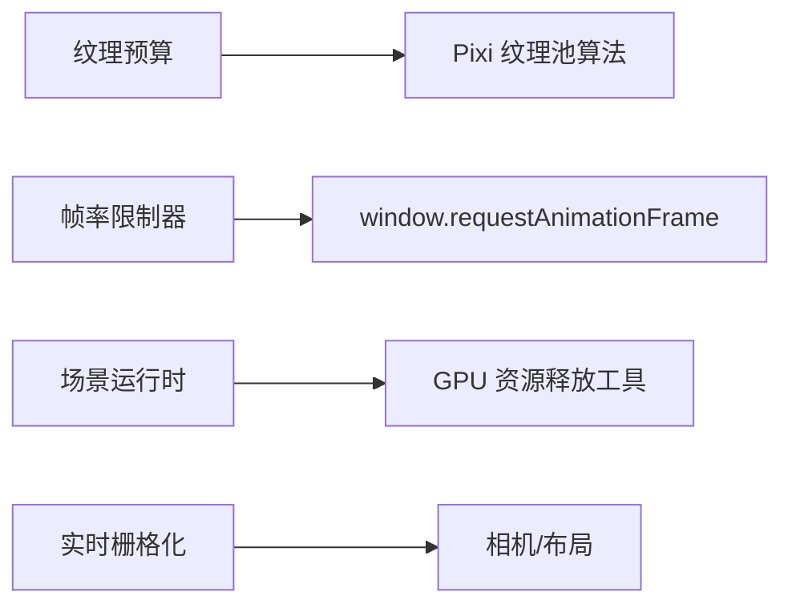

# 性能优化策略

<cite>
**本文引用的文件**   
- [pixiTextureBudget.ts](file://src/components/visualizer/pixiTextureBudget.ts)
- [loadPixi.ts](file://src/components/visualizer/loadPixi.ts)
- [frameRateLimiter.ts](file://src/utils/frameRateLimiter.ts)
- [DevDebugOverlay.tsx](file://src/components/DevDebugOverlay.tsx)
- [pixiDisplayResources.ts](file://src/components/visualizer/pixiDisplayResources.ts)
- [createTemperaPixiRuntime.ts](file://src/components/visualizer/tempera/createTemperaPixiRuntime.ts)
- [fumeLiveRaster.ts](file://src/components/visualizer/fume/fumeLiveRaster.ts)
- [uiYield.ts](file://src/services/automix/uiYield.ts)
- [lattice-performance run.ts](file://dev/probes/lattice-performance/run.ts)
- [sonnetTexturePool.test.ts](file://test/unit/visualizer/sonnetTexturePool.test.ts)
- [pixiGpuRelease.test.ts](file://test/unit/visualizer/pixiGpuRelease.test.ts)
- [debugMemorySamples.test.ts](file://test/unit/services/debugMemorySamples.test.ts)
</cite>

## 目录
1. [引言](#引言)
2. [项目结构](#项目结构)
3. [核心组件](#核心组件)
4. [架构总览](#架构总览)
5. [详细组件分析](#详细组件分析)
6. [依赖关系分析](#依赖关系分析)
7. [性能考量](#性能考量)
8. [故障排查指南](#故障排查指南)
9. [结论](#结论)
10. [附录](#附录)

## 引言
本技术文档围绕可视化渲染系统的性能优化，聚焦以下方面：GPU 资源管理（纹理预算、显存分配与对象池复用）、帧率优化（渲染节流、批量绘制、视锥剔除与 LOD）、内存管理最佳实践（生命周期、垃圾回收与泄漏防护）、多线程处理（工作线程、Web Worker 通信与任务调度）、渲染管道优化（批处理、状态最小化与绘制调用减少），以及性能监控工具与跨平台调优。文中所有实现细节均基于仓库现有代码与测试用例进行归纳与图示化说明。

## 项目结构
本项目在可视化子系统内实现了多项关键性能优化能力：
- 纹理预算控制：通过像素级分辨率“对齐”到 Pixi 的 2 次幂纹理池桶，避免整屏滤镜通道浪费显存。
- 着色器精度统一：在首次加载 Pixi 前提升默认片段精度，规避 Linux + NVIDIA 驱动下的 fp16 溢出黑边问题。
- 全局帧率限制：以 requestAnimationFrame 为入口的统一节流门控，支持 60/90/120 档与关闭模式。
- GPU 资源释放：对 Pixi Display Tree 中的 GraphicsContext 等 GPU 缓冲进行显式卸载与销毁，避免 GC 延迟导致的显存膨胀。
- 场景与对象池：场景缓存、退役队列与延迟销毁；纹理对象池的获取/释放与取消卸载逻辑。
- 实时栅格化：Fume 的 Live Raster 按缩放级别离散化，复用 Canvas 并记录使用区域。
- 主线程协作：UI Yield 在非主线程中避免无意义的 setTimeout(0) 开销。
- 性能监控：JS Heap、DOM 节点数、GC 次数统计与图表展示。

**图示来源** 
- [pixiTextureBudget.ts:1-114](file://src/components/visualizer/pixiTextureBudget.ts#L1-L114)
- [frameRateLimiter.ts:1-197](file://src/utils/frameRateLimiter.ts#L1-L197)
- [pixiDisplayResources.ts:1-29](file://src/components/visualizer/pixiDisplayResources.ts#L1-L29)
- [createTemperaPixiRuntime.ts:463-495](file://src/components/visualizer/tempera/createTemperaPixiRuntime.ts#L463-L495)
- [fumeLiveRaster.ts:23-56](file://src/components/visualizer/fume/fumeLiveRaster.ts#L23-L56)
- [DevDebugOverlay.tsx:650-849](file://src/components/DevDebugOverlay.tsx#L650-L849)
- [loadPixi.ts:1-37](file://src/components/visualizer/loadPixi.ts#L1-L37)

**章节来源**
- [pixiTextureBudget.ts:1-114](file://src/components/visualizer/pixiTextureBudget.ts#L1-L114)
- [frameRateLimiter.ts:1-197](file://src/utils/frameRateLimiter.ts#L1-L197)
- [pixiDisplayResources.ts:1-29](file://src/components/visualizer/pixiDisplayResources.ts#L1-L29)
- [createTemperaPixiRuntime.ts:463-495](file://src/components/visualizer/tempera/createTemperaPixiRuntime.ts#L463-L495)
- [fumeLiveRaster.ts:23-56](file://src/components/visualizer/fume/fumeLiveRaster.ts#L23-L56)
- [DevDebugOverlay.tsx:650-849](file://src/components/DevDebugOverlay.tsx#L650-L849)
- [loadPixi.ts:1-37](file://src/components/visualizer/loadPixi.ts#L1-L37)

## 核心组件
- 纹理预算控制器：将渲染分辨率向下取整至能落入更小纹理池桶的值，从而降低显存占用并保持画面质量可接受。
- 帧率限制器：提供全局 RAF 门控，聚合同帧回调，支持动态切换目标帧率。
- GPU 资源释放工具：遍历 Display Tree，调用 GraphicsContext.unload 与 unload/destroy，避免大缓冲滞留。
- 场景运行时：场景缓存、退役与延迟销毁，分离 UI 与 GPU 清理阶段，避免卡顿。
- 实时栅格化：按缩放级别选择离散层级，复用 Canvas 并记录设备像素使用范围。
- 调试监控面板：周期性采样 JS Heap、DOM 节点数，计算峰值、增量与 GC 次数，并提供图表。

**章节来源**
- [pixiTextureBudget.ts:1-114](file://src/components/visualizer/pixiTextureBudget.ts#L1-L114)
- [frameRateLimiter.ts:1-197](file://src/utils/frameRateLimiter.ts#L1-L197)
- [pixiDisplayResources.ts:1-29](file://src/components/visualizer/pixiDisplayResources.ts#L1-L29)
- [createTemperaPixiRuntime.ts:463-495](file://src/components/visualizer/tempera/createTemperaPixiRuntime.ts#L463-L495)
- [fumeLiveRaster.ts:23-56](file://src/components/visualizer/fume/fumeLiveRaster.ts#L23-L56)
- [DevDebugOverlay.tsx:650-849](file://src/components/DevDebugOverlay.tsx#L650-L849)

## 架构总览
可视化渲染管线由多个子系统协同完成：
- 初始化阶段：优先设置 Pixi 片段精度，确保后续着色器编译使用 highp。
- 渲染循环：受全局帧率限制器控制，聚合每帧回调，统一执行更新与绘制。
- 纹理与显存：根据当前视口与分辨率计算最优纹理桶，必要时降低分辨率以换取更小的桶。
- 资源生命周期：场景进入可见时构建，离开时先移除显示树再延迟销毁，释放 GPU 缓冲。
- 实时栅格：按缩放级别选择离散层级，复用 Canvas，减少频繁创建销毁。
- 监控与诊断：周期采样内存与 DOM，统计 GC 次数，辅助定位泄漏与峰值。

**图示来源**
- [loadPixi.ts:1-37](file://src/components/visualizer/loadPixi.ts#L1-L37)
- [frameRateLimiter.ts:1-197](file://src/utils/frameRateLimiter.ts#L1-L197)
- [pixiTextureBudget.ts:1-114](file://src/components/visualizer/pixiTextureBudget.ts#L1-L114)
- [createTemperaPixiRuntime.ts:463-495](file://src/components/visualizer/tempera/createTemperaPixiRuntime.ts#L463-L495)
- [DevDebugOverlay.tsx:650-849](file://src/components/DevDebugOverlay.tsx#L650-L849)

## 详细组件分析

### 纹理预算与显存优化
- 原理：Pixi 的 TexturePool 按 2 次幂桶分配纹理，整屏滤镜通道会按桶计费而非按像素计费。通过计算每个轴能落入更小桶的最大分辨率，保守地降低分辨率，使桶面积下降，从而显著减少显存占用。
- 关键点：
  - 仅考虑单步降级，且限制最大降级比例，避免过度模糊。
  - 分别评估宽/高轴的候选分辨率，选择桶面积最小的方案。
  - 对边界情况（如接近 1.0 分辨率）保持谨慎，不盲目降级。

**图示来源**
- [pixiTextureBudget.ts:1-114](file://src/components/visualizer/pixiTextureBudget.ts#L1-L114)

**章节来源**
- [pixiTextureBudget.ts:1-114](file://src/components/visualizer/pixiTextureBudget.ts#L1-L114)

### 着色器精度与平台差异
- 背景：不同平台对 GLSL ES mediump/highp 的支持不同，Linux + NVIDIA 下 mediump 可能退化为真实 fp16，导致噪声滤镜在大坐标处溢出产生黑边。
- 解决：在首次加载 Pixi 时将默认片段精度设置为 highp，保证着色器编译使用更高精度，避免溢出。

**图示来源**
- [loadPixi.ts:1-37](file://src/components/visualizer/loadPixi.ts#L1-L37)

**章节来源**
- [loadPixi.ts:1-37](file://src/components/visualizer/loadPixi.ts#L1-L37)

### 帧率限制与渲染节流
- 功能：提供全局 RAF 门控，支持 60/90/120 档与关闭模式；同一允许帧内的回调被聚合后一次性执行，减少抖动与重复调度。
- 行为：
  - shouldProcessFrameAtRate 判断是否达到目标间隔。
  - createFrameRateLimitedRaf 维护回调队列与原生 RAF 句柄。
  - installGlobalVisualizerFrameRateLimiter 替换 window.requestAnimationFrame/cancelAnimationFrame。
  - setGlobalVisualizerFrameRate 动态调整目标帧率。

**图示来源**
- [frameRateLimiter.ts:1-197](file://src/utils/frameRateLimiter.ts#L1-L197)

**章节来源**
- [frameRateLimiter.ts:1-197](file://src/utils/frameRateLimiter.ts#L1-L197)

### GPU 资源释放与对象生命周期
- 问题：Pixi 8 的 destroy({ children: true }) 不会销毁 Graphics 自建的 GraphicsContext，导致大量 WebGL 缓冲滞留，显存增长。
- 解决：
  - unloadPixiDisplayTree 遍历节点，调用 context.unload 与 node.unload，释放批数据与缓冲。
  - destroyPixiDisplayTree 在场景离开可见集时精确销毁子树，避免共享 context 误销毁。
  - Tempera 运行时将场景从显示树移除后放入退役队列，空闲帧逐步 drainRetiredScene 销毁。

**图示来源**
- [pixiDisplayResources.ts:1-29](file://src/components/visualizer/pixiDisplayResources.ts#L1-L29)
- [createTemperaPixiRuntime.ts:463-495](file://src/components/visualizer/tempera/createTemperaPixiRuntime.ts#L463-L495)

**章节来源**
- [pixiDisplayResources.ts:1-29](file://src/components/visualizer/pixiDisplayResources.ts#L1-L29)
- [createTemperaPixiRuntime.ts:463-495](file://src/components/visualizer/tempera/createTemperaPixiRuntime.ts#L463-L495)
- [pixiGpuRelease.test.ts:1-17](file://test/unit/visualizer/pixiGpuRelease.test.ts#L1-L17)

### 纹理对象池与复用机制
- 行为：纹理对象池在 acquire/release 之间维持引用计数与延迟卸载；当新 acquire 发生时，取消待卸载任务，避免重复加载。
- 测试覆盖：验证取消 pending unload 的行为，确保资源复用正确。

**图示来源**
- [sonnetTexturePool.test.ts:33-48](file://test/unit/visualizer/sonnetTexturePool.test.ts#L33-L48)

**章节来源**
- [sonnetTexturePool.test.ts:33-48](file://test/unit/visualizer/sonnetTexturePool.test.ts#L33-L48)

### 实时栅格化与视锥剔除
- 缩放级别离散化：resolveLiveRasterScale 将连续缩放映射到离散层级，减少中间态计算。
- Canvas 复用：FumeLiveRaster 使用 Map 缓存 Canvas，记录 lastUsed 与 usedWidth/usedHeight，按需清空并重绘。
- 视锥剔除：visible 矩形用于限定绘制区域，避免绘制屏幕外内容。

**图示来源**
- [fumeLiveRaster.ts:23-56](file://src/components/visualizer/fume/fumeLiveRaster.ts#L23-L56)

**章节来源**
- [fumeLiveRaster.ts:23-56](file://src/components/visualizer/fume/fumeLiveRaster.ts#L23-L56)

### 多线程与任务调度
- UI Yield：在非主线程环境中跳过 setTimeout(0)，避免无意义阻塞；在主线程中作为异步协作点。
- 性能探针：lattice-performance 探针使用 requestAnimationFrame 驱动动画与滚动事件，模拟交互负载。

**图示来源**
- [uiYield.ts:20-34](file://src/services/automix/uiYield.ts#L20-L34)
- [lattice-performance run.ts:60-83](file://dev/probes/lattice-performance/run.ts#L60-L83)

**章节来源**
- [uiYield.ts:20-34](file://src/services/automix/uiYield.ts#L20-L34)
- [lattice-performance run.ts:60-83](file://dev/probes/lattice-performance/run.ts#L60-L83)

## 依赖关系分析
- 纹理预算控制器依赖 Pixi 的纹理池算法（nextPow2）与配置常量，独立于渲染器以避免引入完整 Pixi 包。
- 帧率限制器依赖 window.requestAnimationFrame/cancelAnimationFrame，并通过全局注入方式接管。
- GPU 资源释放工具与场景运行时解耦：运行时负责业务生命周期，工具负责底层 GPU 缓冲释放。
- 实时栅格化与相机/布局模块耦合，但通过接口隔离，便于替换与扩展。

**图示来源**
- [pixiTextureBudget.ts:1-114](file://src/components/visualizer/pixiTextureBudget.ts#L1-L114)
- [frameRateLimiter.ts:1-197](file://src/utils/frameRateLimiter.ts#L1-L197)
- [pixiDisplayResources.ts:1-29](file://src/components/visualizer/pixiDisplayResources.ts#L1-L29)
- [fumeLiveRaster.ts:23-56](file://src/components/visualizer/fume/fumeLiveRaster.ts#L23-L56)

**章节来源**
- [pixiTextureBudget.ts:1-114](file://src/components/visualizer/pixiTextureBudget.ts#L1-L114)
- [frameRateLimiter.ts:1-197](file://src/utils/frameRateLimiter.ts#L1-L197)
- [pixiDisplayResources.ts:1-29](file://src/components/visualizer/pixiDisplayResources.ts#L1-L29)
- [fumeLiveRaster.ts:23-56](file://src/components/visualizer/fume/fumeLiveRaster.ts#L23-L56)

## 性能考量
- 纹理预算：在常见桌面视口下，适度降低分辨率可显著减少纹理桶面积，提高“每字节清晰度”。
- 帧率限制：在高刷新率显示器上启用 90/120 档可降低 CPU/GPU 压力；在低端设备上建议关闭或降至 60。
- GPU 释放：及时卸载 GraphicsContext 与销毁 Display Tree，避免显存累积；结合场景退役与延迟销毁，平滑峰值。
- 实时栅格：按缩放级别离散化可减少重绘频率；复用 Canvas 降低分配开销。
- 多线程：后台任务避免无意义 yield，主线程协作点合理分布，防止长任务阻塞 UI。
- 监控：定期采样内存与 DOM，观察 GC 次数与峰值，辅助定位泄漏与异常增长。

[本节为通用指导，无需具体文件分析]

## 故障排查指南
- 显存泄漏迹象：
  - 现象：长时间运行后显存持续增长，伴随帧率下降。
  - 排查：检查场景退役与销毁流程是否正确调用；确认 GraphicsContext.unload 是否被执行。
  - 参考：场景退役与销毁逻辑、GPU 资源释放工具。
- 黑边或噪点异常：
  - 现象：Linux + NVIDIA 出现斜线黑边。
  - 排查：确认 Pixi 初始化时已将片段精度设为 highp。
  - 参考：loadPixi.ts。
- 内存波动与 GC 频繁：
  - 现象：JS Heap 频繁大幅回落，GC 计数上升。
  - 排查：查看监控面板的 heap 曲线与 GC 计数；关注 DOM 节点增量。
  - 参考：DevDebugOverlay.tsx 的内存采样与统计。
- 帧率不稳定：
  - 现象：帧率波动大，回调执行不一致。
  - 排查：检查全局 RAF 门控是否安装；确认目标帧率设置与回调聚合逻辑。
  - 参考：frameRateLimiter.ts。

**章节来源**
- [createTemperaPixiRuntime.ts:463-495](file://src/components/visualizer/tempera/createTemperaPixiRuntime.ts#L463-L495)
- [pixiDisplayResources.ts:1-29](file://src/components/visualizer/pixiDisplayResources.ts#L1-L29)
- [loadPixi.ts:1-37](file://src/components/visualizer/loadPixi.ts#L1-L37)
- [DevDebugOverlay.tsx:650-849](file://src/components/DevDebugOverlay.tsx#L650-L849)
- [frameRateLimiter.ts:1-197](file://src/utils/frameRateLimiter.ts#L1-L197)

## 结论
该可视化渲染系统在纹理预算、帧率限制、GPU 资源释放、对象池复用、实时栅格化与多线程协作等方面提供了系统化的性能优化方案。通过精确的纹理桶对齐、统一的着色器精度、全局 RAF 门控与显式 GPU 缓冲释放，项目在复杂场景下仍能保持稳定的帧率与可控的显存占用。配合监控面板与测试用例，开发者可快速定位瓶颈并进行针对性调优。

[本节为总结性内容，无需具体文件分析]

## 附录
- 性能基准与探针：
  - lattice-performance 探针用于模拟交互与滚动，收集运动与稳定期指标。
  - 手动脚本可输出各模式的解码/传输/显存/渲染占用统计，便于横向对比。
- 平台差异注意事项：
  - Linux + NVIDIA 需确保 highp 精度；Windows 与 Intel/Mesa 通常无额外成本。
  - 移动端建议关闭或降低帧率限制，并结合纹理预算与实时栅格优化。

**章节来源**
- [lattice-performance run.ts:60-83](file://dev/probes/lattice-performance/run.ts#L60-L83)
- [debugMemorySamples.test.ts:37-54](file://test/unit/services/debugMemorySamples.test.ts#L37-L54)