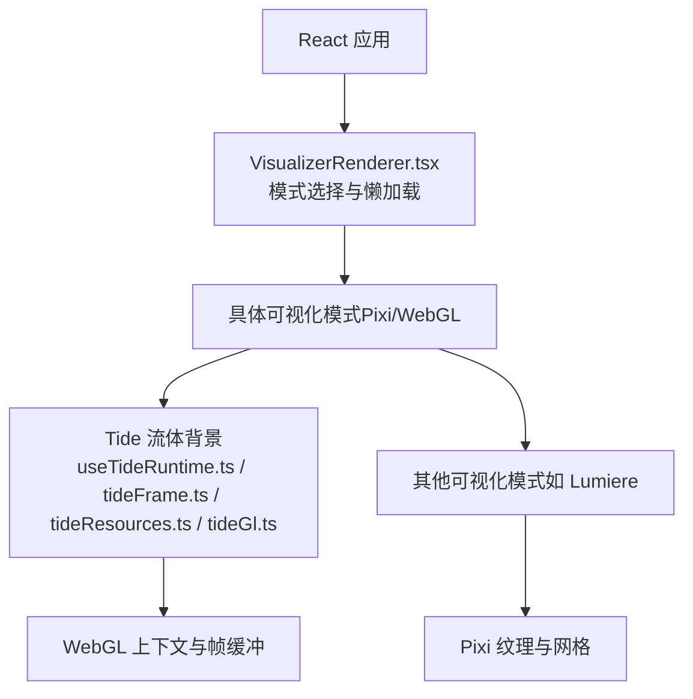
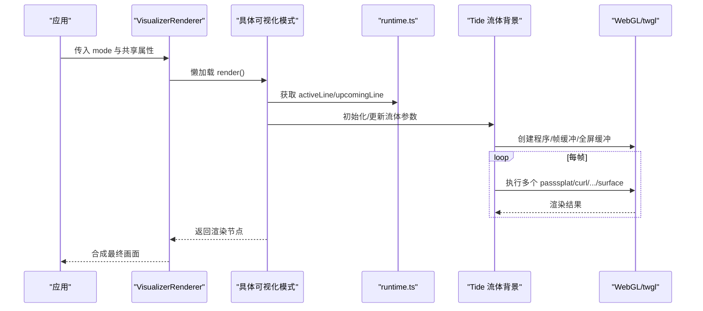
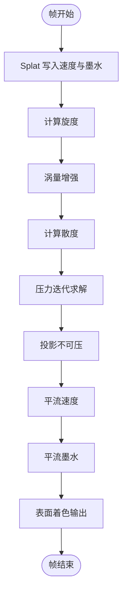
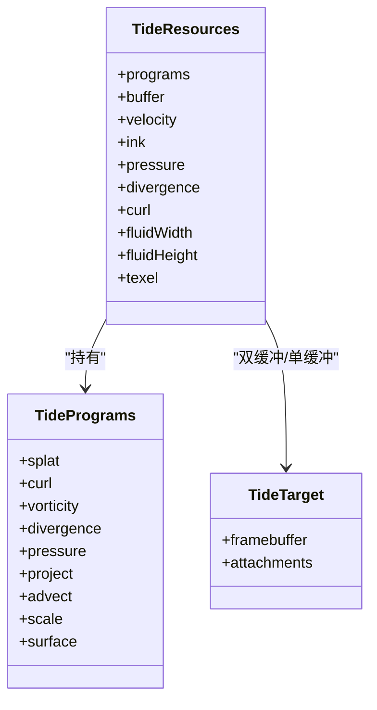
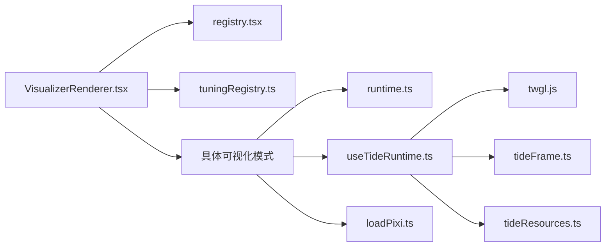

# 渲染管道优化

<cite>
**本文引用的文件**   
- [VisualizerRenderer.tsx](file://src/components/visualizer/VisualizerRenderer.tsx)
- [runtime.ts](file://src/components/visualizer/runtime.ts)
- [useTideRuntime.ts](file://src/components/visualizer/backgrounds/tide/useTideRuntime.ts)
- [tideGl.ts](file://src/components/visualizer/backgrounds/tide/tideGl.ts)
- [tideFrame.ts](file://src/components/visualizer/backgrounds/tide/tideFrame.ts)
- [tideResources.ts](file://src/components/visualizer/backgrounds/tide/tideResources.ts)
- [loadPixi.ts](file://src/components/visualizer/loadPixi.ts)
- [lumiereGpuRelease.test.ts](file://test/unit/visualizer/lumiere/lumiereGpuRelease.test.ts)
</cite>

## 目录
1. [引言](#引言)
2. [项目结构](#项目结构)
3. [核心组件](#核心组件)
4. [架构总览](#架构总览)
5. [详细组件分析](#详细组件分析)
6. [依赖关系分析](#依赖关系分析)
7. [性能考量](#性能考量)
8. [故障排查指南](#故障排查指南)
9. [结论](#结论)

## 引言
本技术文档聚焦可视化渲染系统的渲染管道优化，围绕以下目标展开：
- 解释渲染管线架构与阶段划分、状态管理与绘制调用优化。
- 阐述批处理渲染技术：几何体合并、材质统一与渲染状态最小化。
- 说明视锥剔除与 LOD 系统：可见性检测、细节层次管理与距离优化。
- 解释 WebGL 状态优化：上下文切换减少、着色器程序复用与缓冲区优化。
- 提供渲染性能分析方法：GPU 时间统计、绘制调用计数与带宽利用率分析。

仓库中的可视化子系统以 React 为上层编排，底层使用 PixiJS 与原生 WebGL（通过 twgl.js）进行高性能渲染；流体背景 Tide 采用多 pass 的流体求解器，配合半浮点帧缓冲实现高质量水面效果。

## 项目结构
可视化渲染相关代码主要位于 src/components/visualizer 及其子模块中，关键路径如下：
- 顶层渲染入口与模式调度：VisualizerRenderer.tsx
- 运行时辅助与歌词行预热：runtime.ts
- 流体背景 Tide 的运行时、GL 封装、帧循环与资源管理：
  - useTideRuntime.ts
  - tideGl.ts
  - tideFrame.ts
  - tideResources.ts
- Pixi 精度与初始化：loadPixi.ts
- GPU 资源释放测试用例：lumiereGpuRelease.test.ts

图表来源
- [VisualizerRenderer.tsx:13-33](file://src/components/visualizer/VisualizerRenderer.tsx#L13-L33)
- [useTideRuntime.ts:49-102](file://src/components/visualizer/backgrounds/tide/useTideRuntime.ts#L49-L102)
- [tideFrame.ts:175-250](file://src/components/visualizer/backgrounds/tide/tideFrame.ts#L175-L250)
- [tideResources.ts:96-140](file://src/components/visualizer/backgrounds/tide/tideResources.ts#L96-L140)

章节来源
- [VisualizerRenderer.tsx:13-33](file://src/components/visualizer/VisualizerRenderer.tsx#L13-L33)
- [runtime.ts:124-157](file://src/components/visualizer/runtime.ts#L124-L157)

## 核心组件
- VisualizerRenderer：按模式懒加载具体渲染器，并注入统一的调和字幕叠加层。
- runtime：提供歌词行活跃/即将出现行的计算与预热窗口逻辑，帮助各模式提前准备数据。
- Tide 流体背景：
  - useTideRuntime：生命周期管理、RAF 循环、静态模式、上下文丢失恢复、尺寸变化与 DPR 适配。
  - tideGl：twgl 封装，创建全屏三角形缓冲、帧缓冲目标与 draw pass。
  - tideFrame：单帧渲染流程，包含 splat、curl、vorticity、divergence、pressure、project、advect、surface 等 pass。
  - tideResources：管理 9 个着色器程序、全屏缓冲与流体场（速度、墨水、压力、散度、涡量）的双缓冲帧缓冲。

章节来源
- [VisualizerRenderer.tsx:13-33](file://src/components/visualizer/VisualizerRenderer.tsx#L13-L33)
- [runtime.ts:35-120](file://src/components/visualizer/runtime.ts#L35-L120)
- [useTideRuntime.ts:49-102](file://src/components/visualizer/backgrounds/tide/useTideRuntime.ts#L49-L102)
- [tideGl.ts:22-80](file://src/components/visualizer/backgrounds/tide/tideGl.ts#L22-L80)
- [tideFrame.ts:175-250](file://src/components/visualizer/backgrounds/tide/tideFrame.ts#L175-L250)
- [tideResources.ts:27-56](file://src/components/visualizer/backgrounds/tide/tideResources.ts#L27-L56)

## 架构总览
可视化渲染管道的整体流程如下：
- React 层根据当前模式选择具体渲染器，并通过 Suspense 懒加载。
- 运行时层计算当前行与下一行，供渲染器进行布局与预热。
- 具体渲染器可能使用 PixiJS 或原生 WebGL：
  - Pixi 侧负责纹理、网格与批量绘制。
  - WebGL 侧（Tide）通过多 pass 流体求解器生成水面，再输出到屏幕。

图表来源
- [VisualizerRenderer.tsx:13-33](file://src/components/visualizer/VisualizerRenderer.tsx#L13-L33)
- [runtime.ts:124-157](file://src/components/visualizer/runtime.ts#L124-L157)
- [useTideRuntime.ts:146-290](file://src/components/visualizer/backgrounds/tide/useTideRuntime.ts#L146-L290)
- [tideFrame.ts:175-250](file://src/components/visualizer/backgrounds/tide/tideFrame.ts#L175-L250)

## 详细组件分析

### 渲染阶段划分与状态管理
- 阶段划分：
  - 输入阶段：歌词行、音频频段、主题颜色、相机与锚点采样。
  - 流体求解阶段：splat -> curl -> vorticity -> divergence -> pressure(迭代) -> project -> advect(速度/墨水)。
  - 表面渲染阶段：将流体场合成为最终水面图像。
- 状态管理：
  - 双缓冲帧缓冲对（velocity、ink、pressure），通过 swapTidePair 交换读写端。
  - 全局资源对象集中管理程序、全屏缓冲与流体场尺寸。
  - 上下文丢失与恢复：监听 webglcontextlost/restored，重建资源并重置流体。

图表来源
- [tideFrame.ts:105-173](file://src/components/visualizer/backgrounds/tide/tideFrame.ts#L105-L173)
- [tideFrame.ts:175-250](file://src/components/visualizer/backgrounds/tide/tideFrame.ts#L175-L250)

章节来源
- [tideFrame.ts:105-173](file://src/components/visualizer/backgrounds/tide/tideFrame.ts#L105-L173)
- [tideFrame.ts:175-250](file://src/components/visualizer/backgrounds/tide/tideFrame.ts#L175-L250)
- [useTideRuntime.ts:124-141](file://src/components/visualizer/backgrounds/tide/useTideRuntime.ts#L124-L141)

### 批处理渲染技术
- 几何体合并：
  - Tide 使用单一全屏三角形缓冲，所有 pass 复用同一 bufferInfo，避免频繁创建与绑定几何体。
- 材质统一：
  - 每个 pass 对应一个着色器程序，但通过 drawTidePass 统一设置 uniforms 与帧缓冲，减少状态切换。
- 渲染状态最小化：
  - 在 useTideRuntime 中显式禁用深度测试与混合，避免不必要的状态开销。
  - 资源对象集中管理程序与缓冲，resize 时仅重建必要的帧缓冲。

图表来源
- [tideResources.ts:27-56](file://src/components/visualizer/backgrounds/tide/tideResources.ts#L27-L56)
- [tideGl.ts:32-66](file://src/components/visualizer/backgrounds/tide/tideGl.ts#L32-L66)

章节来源
- [tideGl.ts:68-80](file://src/components/visualizer/backgrounds/tide/tideGl.ts#L68-L80)
- [useTideRuntime.ts:90-91](file://src/components/visualizer/backgrounds/tide/useTideRuntime.ts#L90-L91)
- [tideResources.ts:96-140](file://src/components/visualizer/backgrounds/tide/tideResources.ts#L96-L140)

### 视锥剔除与 LOD 系统
- 可视性检测：
  - 歌词锚点采样与相机跟随用于控制视觉焦点，间接影响可见区域与扰动强度。
- 细节层次管理：
  - 通过 tuning 参数（如 flow、waveScale、glintStrength、perspective、fog）动态调整水面复杂度与视觉效果。
- 距离优化：
  - 流体场尺寸与 DPR 自适应，避免在高 DPI 下过度采样；静默时关闭流体步进，降低 GPU 负载。

章节来源
- [useTideRuntime.ts:176-223](file://src/components/visualizer/backgrounds/tide/useTideRuntime.ts#L176-L223)
- [tideFrame.ts:200-249](file://src/components/visualizer/backgrounds/tide/tideFrame.ts#L200-L249)

### WebGL 状态优化
- 上下文切换减少：
  - 使用 drawTidePass 统一设置 program、buffers、uniforms 与 framebuffer，减少多次 gl 调用。
- 着色器程序复用：
  - 一次性创建 9 个程序并缓存于 TideResources，避免重复编译与链接。
- 缓冲区优化：
  - 全屏三角形缓冲复用；流体场使用双缓冲帧缓冲，swap 指针而非复制数据。
  - 半浮点帧缓冲（HALF_FLOAT）提升数值精度，同时按需降级。

章节来源
- [tideGl.ts:22-80](file://src/components/visualizer/backgrounds/tide/tideGl.ts#L22-L80)
- [tideResources.ts:96-140](file://src/components/visualizer/backgrounds/tide/tideResources.ts#L96-L140)
- [useTideRuntime.ts:70-88](file://src/components/visualizer/backgrounds/tide/useTideRuntime.ts#L70-L88)

### 渲染性能分析方法
- GPU 时间统计：
  - 使用浏览器开发者工具的 Performance/GPU 面板记录帧时间与 GPU 占用。
- 绘制调用计数：
  - 关注每帧 draw call 数量，Tide 通过单缓冲与多 pass 控制调用次数。
- 带宽利用率分析：
  - 监控纹理上传与帧缓冲大小，避免高分辨率下的不必要带宽消耗。
- 内存与资源释放：
  - 参考测试用例验证 GPU 资源（缓冲、程序）随对象销毁而释放。

章节来源
- [lumiereGpuRelease.test.ts:88-96](file://test/unit/visualizer/lumiere/lumiereGpuRelease.test.ts#L88-L96)

## 依赖关系分析
- VisualizerRenderer 依赖 registry 与 tuningRegistry，按模式懒加载渲染器。
- runtime 提供歌词行计算，被各模式复用。
- Tide 运行时依赖 twgl.js 进行 GL 封装，依赖 tideFrame 与 tideResources 完成帧循环与资源管理。
- loadPixi 确保 Pixi 初始化时的精度设置，避免 fp16 溢出问题。

图表来源
- [VisualizerRenderer.tsx:13-33](file://src/components/visualizer/VisualizerRenderer.tsx#L13-L33)
- [runtime.ts:124-157](file://src/components/visualizer/runtime.ts#L124-L157)
- [useTideRuntime.ts:1-11](file://src/components/visualizer/backgrounds/tide/useTideRuntime.ts#L1-L11)
- [loadPixi.ts:1-18](file://src/components/visualizer/loadPixi.ts#L1-L18)

章节来源
- [VisualizerRenderer.tsx:13-33](file://src/components/visualizer/VisualizerRenderer.tsx#L13-L33)
- [runtime.ts:124-157](file://src/components/visualizer/runtime.ts#L124-L157)
- [useTideRuntime.ts:1-11](file://src/components/visualizer/backgrounds/tide/useTideRuntime.ts#L1-L11)
- [loadPixi.ts:1-18](file://src/components/visualizer/loadPixi.ts#L1-L18)

## 性能考量
- 流体求解器复杂度：
  - 每帧包含多个 pass，压力迭代次数固定（PRESSURE_STEPS=16），需权衡精度与性能。
- 分辨率与 DPR：
  - 流体场尺寸与 DPR 自适应，避免高 DPI 下的过度采样。
- 静默优化：
  - 当无声音或歌词驱动时，关闭流体步进，仅保留基础滚动，降低 GPU 负载。
- 资源生命周期：
  - 确保上下文丢失后重建资源，并在卸载时释放所有 GL 对象，防止内存泄漏。

[本节为通用指导，不直接分析具体文件]

## 故障排查指南
- WebGL 上下文丢失：
  - 监听 webglcontextlost 事件，暂停渲染并提示用户；webglcontextrestored 后重建资源。
- 着色器编译失败：
  - 若 createTideProgram 返回 null，应降级为静态背景，避免黑屏。
- 半浮点不支持：
  - 检查 EXT_color_buffer_float/half_float 扩展，不支持时跳过流体背景。
- 尺寸变化导致闪烁：
  - 在 resizeTideResources 中重建帧缓冲并清空流体场，确保一致性。

章节来源
- [useTideRuntime.ts:124-141](file://src/components/visualizer/backgrounds/tide/useTideRuntime.ts#L124-L141)
- [tideResources.ts:96-118](file://src/components/visualizer/backgrounds/tide/tideResources.ts#L96-L118)
- [useTideRuntime.ts:82-88](file://src/components/visualizer/backgrounds/tide/useTideRuntime.ts#L82-L88)
- [tideResources.ts:142-170](file://src/components/visualizer/backgrounds/tide/tideResources.ts#L142-L170)

## 结论
该可视化渲染系统通过 React 模式调度、运行时歌词预热与 Tide 流体背景的精细 pass 控制，实现了高质量的视觉表现与良好的性能平衡。关键优化点包括：
- 多 pass 流体求解器的状态最小化与程序复用。
- 双缓冲帧缓冲与全屏三角形缓冲的几何合并。
- 上下文丢失恢复与资源生命周期管理。
- 分辨率与 DPR 自适应，以及静默场景的性能降级。

建议在实际项目中结合浏览器性能工具持续监控 GPU 时间、绘制调用与带宽利用率，并根据设备能力动态调整流体复杂度与分辨率，以获得最佳用户体验。