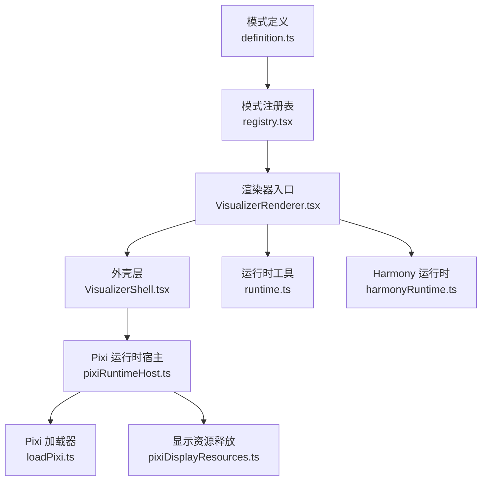
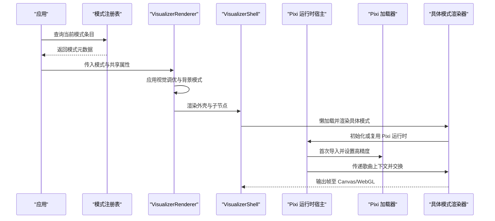
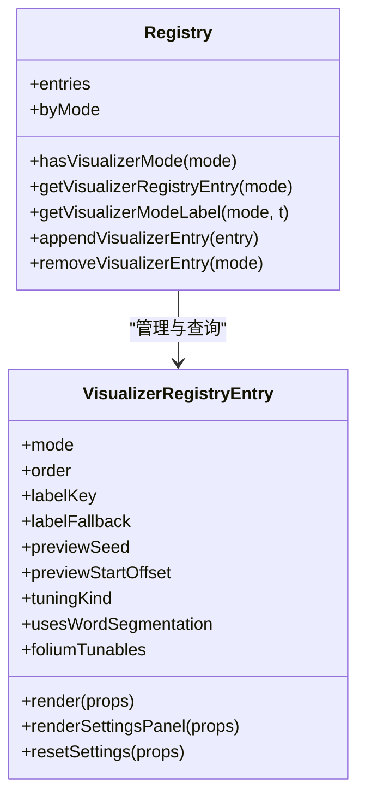
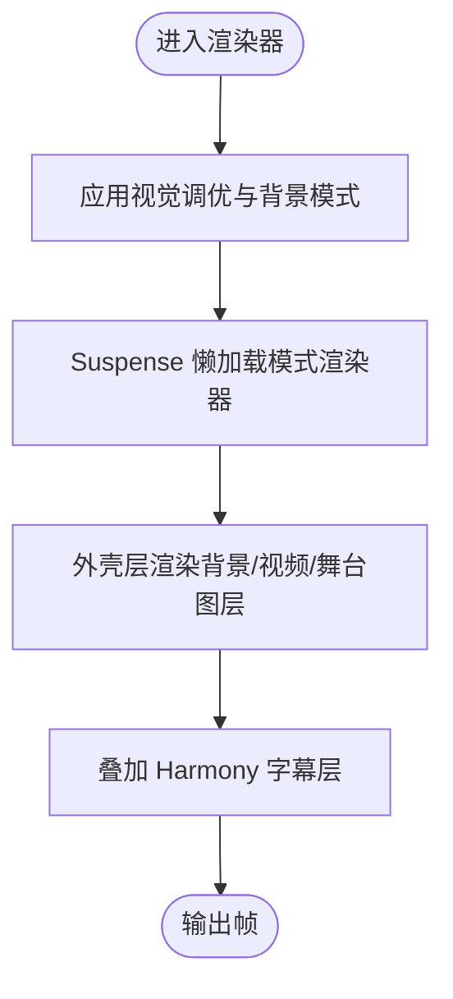
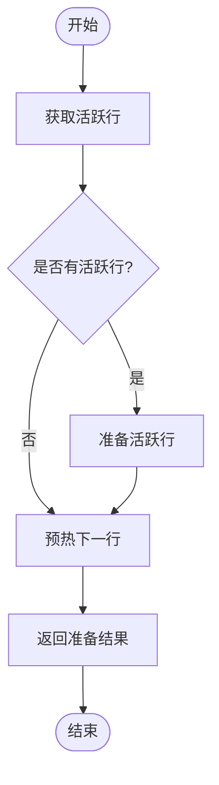
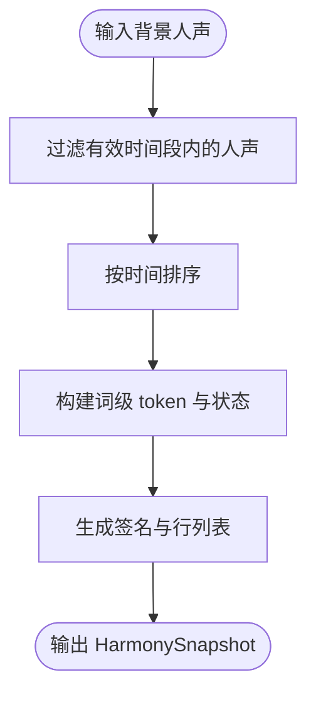
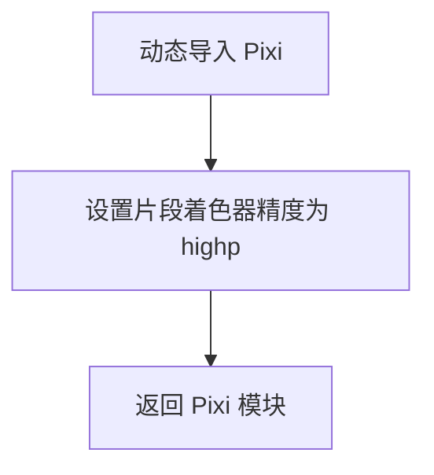
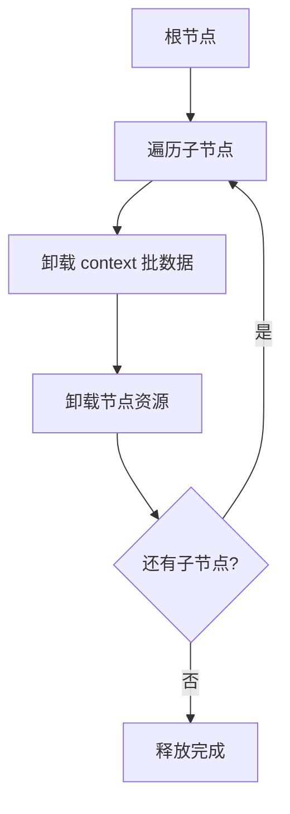
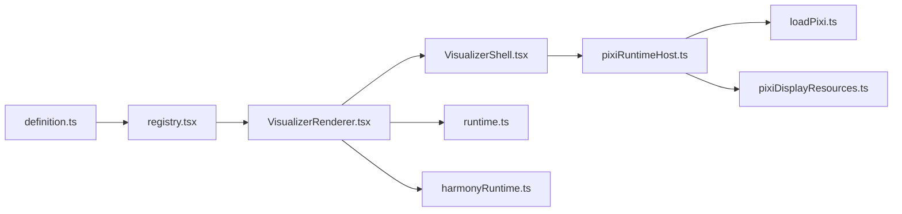

# 渲染架构设计

<cite>
**本文引用的文件**   
- [src/components/visualizer/definition.ts](file://src/components/visualizer/definition.ts)
- [src/components/visualizer/registry.tsx](file://src/components/visualizer/registry.tsx)
- [src/components/visualizer/VisualizerRenderer.tsx](file://src/components/visualizer/VisualizerRenderer.tsx)
- [src/components/visualizer/VisualizerShell.tsx](file://src/components/visualizer/VisualizerShell.tsx)
- [src/components/visualizer/runtime.ts](file://src/components/visualizer/runtime.ts)
- [src/components/visualizer/harmonyRuntime.ts](file://src/components/visualizer/harmonyRuntime.ts)
- [src/components/visualizer/pixiRuntimeHost.ts](file://src/components/visualizer/pixiRuntimeHost.ts)
- [src/components/visualizer/loadPixi.ts](file://src/components/visualizer/loadPixi.ts)
- [src/components/visualizer/pixiDisplayResources.ts](file://src/components/visualizer/pixiDisplayResources.ts)
</cite>

## 目录
1. [引言](#引言)
2. [项目结构](#项目结构)
3. [核心组件](#核心组件)
4. [架构总览](#架构总览)
5. [详细组件分析](#详细组件分析)
6. [依赖关系分析](#依赖关系分析)
7. [性能与精度优化](#性能与精度优化)
8. [故障排查与异常恢复](#故障排查与异常恢复)
9. [结论](#结论)

## 引言
本文件面向可视化渲染系统的核心架构，重点解释 Three.js 与 Pixi.js 的混合渲染组织方式、运行时生命周期管理、Harmony 运行时状态同步机制，以及 Pixi 加载器在着色器精度与跨平台兼容性上的处理。文档同时给出从音频数据输入到最终帧输出的完整渲染管线视图，并包含错误处理、异常恢复和资源泄漏防护策略，帮助开发者快速理解整体设计思路与关键实现点。

## 项目结构
可视化子系统位于 src/components/visualizer 下，采用“模式注册 + 共享外壳 + 运行时宿主”的分层组织：
- 定义与注册：定义可视化模式的契约、默认值、设置面板接口，并通过 glob 发现各模式的 entry 模块，构建集中式注册表。
- 渲染入口：根据当前模式解析渲染函数，应用调优参数，并以 React.Suspense 懒加载具体渲染器。
- 外壳层：统一背景层、字体注入、返回按钮、舞台图层插槽等通用 UI 与布局。
- 运行时：歌词行选择、预热窗口、Harmony 和弦副歌快照等与时间轴相关的轻量计算。
- Pixi 宿主：为基于 Pixi 的模式提供一次挂载、歌曲切换复用、销毁清理的生命周期封装。
- Pixi 加载器：在首次导入 Pixi 时提升片段着色器精度，避免不同驱动下的数值溢出问题。
- 显示资源释放：对保留的 Pixi 显示树进行可见性变化时的批量卸载，避免 GPU 内存泄漏。



**图表来源** 
- [src/components/visualizer/definition.ts:173-219](file://src/components/visualizer/definition.ts#L173-L219)
- [src/components/visualizer/registry.tsx:17-50](file://src/components/visualizer/registry.tsx#L17-L50)
- [src/components/visualizer/VisualizerRenderer.tsx:13-33](file://src/components/visualizer/VisualizerRenderer.tsx#L13-L33)
- [src/components/visualizer/VisualizerShell.tsx:58-83](file://src/components/visualizer/VisualizerShell.tsx#L58-L83)
- [src/components/visualizer/runtime.ts:124-157](file://src/components/visualizer/runtime.ts#L124-L157)
- [src/components/visualizer/harmonyRuntime.ts:95-117](file://src/components/visualizer/harmonyRuntime.ts#L95-L117)
- [src/components/visualizer/pixiRuntimeHost.ts:37-96](file://src/components/visualizer/pixiRuntimeHost.ts#L37-L96)
- [src/components/visualizer/loadPixi.ts:32-35](file://src/components/visualizer/loadPixi.ts#L32-L35)
- [src/components/visualizer/pixiDisplayResources.ts:12-29](file://src/components/visualizer/pixiDisplayResources.ts#L12-L29)

**章节来源**
- [src/components/visualizer/definition.ts:1-219](file://src/components/visualizer/definition.ts#L1-L219)
- [src/components/visualizer/registry.tsx:1-113](file://src/components/visualizer/registry.tsx#L1-L113)
- [src/components/visualizer/VisualizerRenderer.tsx:1-53](file://src/components/visualizer/VisualizerRenderer.tsx#L1-L53)
- [src/components/visualizer/VisualizerShell.tsx:1-253](file://src/components/visualizer/VisualizerShell.tsx#L1-L253)

## 核心组件
- 模式定义与注册：通过 VisualizerRegistryEntry 描述每个可视化模式的元数据、渲染函数、设置面板与重置逻辑；registry 使用 eager glob 收集所有 entry 模块，去重并按 order 排序，同时校验内置模式清单一致性。
- 渲染器入口：VisualizerRenderer 负责应用视觉调优（applyVisualizerTuning），将背景模式合并到 props，再以 Suspense 懒加载具体渲染器，并叠加 Harmony 字幕层。
- 外壳层：VisualizerShell 统一管理背景层、视频层、Folium 舞台图层插槽、字体样式、返回按钮与触摸引导热点，使各渲染器专注歌词时序与布局。
- 运行时工具：runtime.ts 提供当前行、最近完成行、下一行、预热窗口判断与 prepareActiveAndUpcoming 通用准备流程，供各渲染器复用。
- Harmony 运行时：harmonyRuntime.ts 根据歌词背景人声生成离散状态快照，按时间切分词级 token，用于顶部和弦字幕叠加层。
- Pixi 运行时宿主：pixiRuntimeHost.ts 封装 create/swap/destroy 生命周期，保证 WebGL 上下文与纹理池在歌曲切换时不重建，仅在必要配置变化时重建。
- Pixi 加载器：loadPixi.ts 在首次动态导入 Pixi 后设置 preferredFragmentPrecision 为 highp，避免部分驱动上 mediump 导致的数值溢出。
- 显示资源释放：pixiDisplayResources.ts 提供对保留的 Pixi 显示树的遍历卸载，避免 GPU 缓冲泄漏。

**章节来源**
- [src/components/visualizer/definition.ts:173-219](file://src/components/visualizer/definition.ts#L173-L219)
- [src/components/visualizer/registry.tsx:17-50](file://src/components/visualizer/registry.tsx#L17-L50)
- [src/components/visualizer/VisualizerRenderer.tsx:13-47](file://src/components/visualizer/VisualizerRenderer.tsx#L13-L47)
- [src/components/visualizer/VisualizerShell.tsx:58-245](file://src/components/visualizer/VisualizerShell.tsx#L58-L245)
- [src/components/visualizer/runtime.ts:35-120](file://src/components/visualizer/runtime.ts#L35-L120)
- [src/components/visualizer/harmonyRuntime.ts:26-117](file://src/components/visualizer/harmonyRuntime.ts#L26-L117)
- [src/components/visualizer/pixiRuntimeHost.ts:37-143](file://src/components/visualizer/pixiRuntimeHost.ts#L37-L143)
- [src/components/visualizer/loadPixi.ts:32-35](file://src/components/visualizer/loadPixi.ts#L32-L35)
- [src/components/visualizer/pixiDisplayResources.ts:12-29](file://src/components/visualizer/pixiDisplayResources.ts#L12-L29)

## 架构总览
可视化系统以 React 为编排层，Three.js 与 Pixi.js 作为底层图形后端：
- Three.js 主要用于三维场景（例如 diorama 模式），由对应模式的渲染器按需创建与销毁。
- Pixi.js 用于高性能 2D 渲染与后期滤镜（tempera、sonnet、lumiere 等模式），通过 pixiRuntimeHost 管理生命周期，避免频繁重建 WebGL 上下文。
- 模式注册表解耦了 UI 与渲染器实现，支持运行时扩展（mods）追加新模式。
- 外壳层统一背景、字体、舞台图层与交互热点，确保多模式一致的用户体验。
- Harmony 运行时提供与时间轴对齐的和弦字幕状态，供顶层叠加层消费。



**图表来源**
- [src/components/visualizer/registry.tsx:17-50](file://src/components/visualizer/registry.tsx#L17-L50)
- [src/components/visualizer/VisualizerRenderer.tsx:13-47](file://src/components/visualizer/VisualizerRenderer.tsx#L13-L47)
- [src/components/visualizer/VisualizerShell.tsx:203-245](file://src/components/visualizer/VisualizerShell.tsx#L203-L245)
- [src/components/visualizer/pixiRuntimeHost.ts:98-136](file://src/components/visualizer/pixiRuntimeHost.ts#L98-L136)
- [src/components/visualizer/loadPixi.ts:32-35](file://src/components/visualizer/loadPixi.ts#L32-L35)

## 详细组件分析

### 模式定义与注册
- 契约：VisualizerSharedProps 定义所有模式共享的属性，包括时间轴、主题、音频带、歌词、种子、透明度、背景配置、字幕选项、暂停状态、调音包等。
- 注册：registry.ts 使用 import.meta.glob 收集 ./*/entry.tsx，构建 entries 与 byMode 映射，校验重复模式与内置模式清单一致性，并提供 hasVisualizerMode、getVisualizerRegistryEntry、getVisualizerModeLabel 等查询方法。
- 扩展：appendVisualizerEntry/removeVisualizerEntry 允许运行时追加或移除 mod 提供的模式，且内置模式不可被覆盖。



**图表来源**
- [src/components/visualizer/definition.ts:173-219](file://src/components/visualizer/definition.ts#L173-L219)
- [src/components/visualizer/registry.tsx:17-113](file://src/components/visualizer/registry.tsx#L17-L113)

**章节来源**
- [src/components/visualizer/definition.ts:33-99](file://src/components/visualizer/definition.ts#L33-L99)
- [src/components/visualizer/registry.tsx:17-113](file://src/components/visualizer/registry.tsx#L17-L113)

### 渲染器入口与外壳层
- VisualizerRenderer：应用视觉调优（applyVisualizerTuning），合并背景模式，Suspense 懒加载具体渲染器，并叠加 Harmony 字幕层。
- VisualizerShell：统一背景层、视频层、Folium 舞台图层插槽、字体样式、返回按钮与触摸引导热点；对外暴露 stageRef 供背景采样歌词 DOM。



**图表来源**
- [src/components/visualizer/VisualizerRenderer.tsx:13-47](file://src/components/visualizer/VisualizerRenderer.tsx#L13-L47)
- [src/components/visualizer/VisualizerShell.tsx:203-245](file://src/components/visualizer/VisualizerShell.tsx#L203-L245)

**章节来源**
- [src/components/visualizer/VisualizerRenderer.tsx:13-47](file://src/components/visualizer/VisualizerRenderer.tsx#L13-L47)
- [src/components/visualizer/VisualizerShell.tsx:58-245](file://src/components/visualizer/VisualizerShell.tsx#L58-L245)

### 运行时工具与歌词预热
- runtime.ts 提供：
  - getRecentCompletedLine：在无活跃行时返回最近完成的歌词行，便于字幕过渡。
  - getUpcomingLine/getUpcomingLines：获取下一行或多行，用于预取与预热。
  - shouldPreheatLine：基于 lead time 窗口判断是否预热下一行。
  - prepareActiveAndUpcoming：通用准备流程，先准备活跃行，再预热下一行。
  - useVisualizerRuntime：React Hook 聚合 currentTimeValue、activeLine、recentCompletedLine、upcomingLine、nextLines。



**图表来源**
- [src/components/visualizer/runtime.ts:35-120](file://src/components/visualizer/runtime.ts#L35-L120)

**章节来源**
- [src/components/visualizer/runtime.ts:35-157](file://src/components/visualizer/runtime.ts#L35-L157)

### Harmony 运行时与状态同步
- harmonyRuntime.ts 负责：
  - 提取歌词背景人声（单条或数组）。
  - 解析替代文本与字幕内容模式。
  - 构建词级 token，标记 waiting/active/passed/static 状态。
  - 生成 HarmonySnapshot，包含 signature 与 lines，供上层叠加层做最小化更新。



**图表来源**
- [src/components/visualizer/harmonyRuntime.ts:26-117](file://src/components/visualizer/harmonyRuntime.ts#L26-L117)

**章节来源**
- [src/components/visualizer/harmonyRuntime.ts:26-117](file://src/components/visualizer/harmonyRuntime.ts#L26-L117)

### Pixi 运行时宿主与生命周期
- pixiRuntimeHost.ts 提供 useVisualizerPixiHost：
  - 一次性创建运行时，歌曲切换通过 swap 原地替换，避免重建 WebGL 上下文。
  - drainSong 防抖队列，快速跳过时只保留最新目标。
  - 错误处理区分 AbortError，失败时保留上一首歌画面，避免闪烁。
  - 清理阶段 abort 信号、销毁运行时、清空 host 容器。

```mermaid
sequenceDiagram
participant Mode as "模式渲染器"
participant Host as "Pixi 运行时宿主"
participant Create as "create(runtime)"
participant Swap as "swap(runtime, song)"
participant Destroy as "destroy(runtime)"
Mode->>Host : 调用 useVisualizerPixiHost
Host->>Create : 异步创建运行时
Create-->>Host : 返回运行时实例
Host->>Swap : 歌曲变更时原地交换
Swap-->>Host : 交换完成
Mode->>Host : 组件卸载
Host->>Destroy : 销毁运行时并清理
```

**图表来源**
- [src/components/visualizer/pixiRuntimeHost.ts:37-143](file://src/components/visualizer/pixiRuntimeHost.ts#L37-L143)

**章节来源**
- [src/components/visualizer/pixiRuntimeHost.ts:37-143](file://src/components/visualizer/pixiRuntimeHost.ts#L37-L143)

### Pixi 加载器与精度配置
- loadPixi.ts：
  - 首次动态导入 pixi.js。
  - 设置 GlProgram.defaultOptions.preferredFragmentPrecision 为 'highp'，避免 NVIDIA Linux 驱动上 mediump 导致噪声滤镜溢出。
  - 注释说明 GLSL ES 3.00 要求 fragment highp，Pixi 8 仅支持 WebGL2/WebGPU，ensurePrecision 降级行为保持不变。



**图表来源**
- [src/components/visualizer/loadPixi.ts:32-35](file://src/components/visualizer/loadPixi.ts#L32-L35)

**章节来源**
- [src/components/visualizer/loadPixi.ts:1-37](file://src/components/visualizer/loadPixi.ts#L1-L37)

### 显示资源释放与内存保护
- pixiDisplayResources.ts：
  - unloadPixiDisplayTree：递归遍历显示树，调用 Graphics.context.unload 与 node.unload，释放批数据与顶点/索引缓冲。
  - setPixiDisplayTreeVisibility：当显示树离开可视集时触发卸载，避免 GPU 内存泄漏。



**图表来源**
- [src/components/visualizer/pixiDisplayResources.ts:12-29](file://src/components/visualizer/pixiDisplayResources.ts#L12-L29)

**章节来源**
- [src/components/visualizer/pixiDisplayResources.ts:1-29](file://src/components/visualizer/pixiDisplayResources.ts#L1-L29)

## 依赖关系分析
- 模式定义与注册：definition.ts 提供类型与契约，registry.tsx 负责发现与校验。
- 渲染器入口：VisualizerRenderer.tsx 依赖 registry 与 tuningRegistry，并组合 VisualizerShell 与 Harmony 字幕层。
- 外壳层：VisualizerShell.tsx 依赖背景渲染器、视频层与 Folium 舞台图层插槽。
- 运行时：runtime.ts 与 harmonyRuntime.ts 提供时间轴与和弦字幕状态。
- Pixi 宿主：pixiRuntimeHost.ts 被多个 Pixi 模式（tempera、sonnet、lumiere）复用。
- Pixi 加载器：loadPixi.ts 被宿主在首次初始化时调用。
- 显示资源释放：pixiDisplayResources.ts 被宿主或模式在可见性变化时调用。



**图表来源**
- [src/components/visualizer/definition.ts:173-219](file://src/components/visualizer/definition.ts#L173-L219)
- [src/components/visualizer/registry.tsx:17-113](file://src/components/visualizer/registry.tsx#L17-L113)
- [src/components/visualizer/VisualizerRenderer.tsx:13-47](file://src/components/visualizer/VisualizerRenderer.tsx#L13-L47)
- [src/components/visualizer/VisualizerShell.tsx:203-245](file://src/components/visualizer/VisualizerShell.tsx#L203-L245)
- [src/components/visualizer/runtime.ts:124-157](file://src/components/visualizer/runtime.ts#L124-L157)
- [src/components/visualizer/harmonyRuntime.ts:95-117](file://src/components/visualizer/harmonyRuntime.ts#L95-L117)
- [src/components/visualizer/pixiRuntimeHost.ts:98-143](file://src/components/visualizer/pixiRuntimeHost.ts#L98-L143)
- [src/components/visualizer/loadPixi.ts:32-35](file://src/components/visualizer/loadPixi.ts#L32-L35)
- [src/components/visualizer/pixiDisplayResources.ts:12-29](file://src/components/visualizer/pixiDisplayResources.ts#L12-L29)

**章节来源**
- [src/components/visualizer/definition.ts:173-219](file://src/components/visualizer/definition.ts#L173-L219)
- [src/components/visualizer/registry.tsx:17-113](file://src/components/visualizer/registry.tsx#L17-L113)
- [src/components/visualizer/VisualizerRenderer.tsx:13-47](file://src/components/visualizer/VisualizerRenderer.tsx#L13-L47)
- [src/components/visualizer/VisualizerShell.tsx:203-245](file://src/components/visualizer/VisualizerShell.tsx#L203-L245)
- [src/components/visualizer/runtime.ts:124-157](file://src/components/visualizer/runtime.ts#L124-L157)
- [src/components/visualizer/harmonyRuntime.ts:95-117](file://src/components/visualizer/harmonyRuntime.ts#L95-L117)
- [src/components/visualizer/pixiRuntimeHost.ts:98-143](file://src/components/visualizer/pixiRuntimeHost.ts#L98-L143)
- [src/components/visualizer/loadPixi.ts:32-35](file://src/components/visualizer/loadPixi.ts#L32-L35)
- [src/components/visualizer/pixiDisplayResources.ts:12-29](file://src/components/visualizer/pixiDisplayResources.ts#L12-L29)

## 性能与精度优化
- 着色器精度：通过 loadPixi.ts 设置 preferredFragmentPrecision 为 highp，避免 NVIDIA Linux 驱动上 mediump 导致的噪声滤镜溢出与黑三角现象。
- 懒加载与 Suspense：模式渲染器通过 lazy 包裹，减少初始包体积与冷启动开销。
- 运行时复用：pixiRuntimeHost.ts 保证 WebGL 上下文与纹理池在歌曲切换时不重建，降低重建成本。
- 显示资源卸载：pixiDisplayResources.ts 在显示树不可见时批量卸载，避免 GPU 内存泄漏。
- 预热窗口：runtime.ts 的 shouldPreheatLine 与 prepareActiveAndUpcoming 提前准备下一行，减少首帧延迟。

[本节为通用性能讨论，不直接分析具体文件]

## 故障排查与异常恢复
- Pixi 初始化失败：pixiRuntimeHost.ts 捕获非 AbortError 的异常并记录日志，同时通知 onFailedChange，以便模式回退到文本提示。
- 歌曲切换失败：drainSong 在 swap 失败时保留上一首歌画面，避免帧空洞；AbortError 被忽略，防止误报。
- 资源泄漏：setPixiDisplayTreeVisibility 在节点不可见时触发 unload，确保 Graphics.context 与节点资源被释放。
- 精度问题：若出现黑三角或噪点异常，确认已在首次导入 Pixi 前调用 loadPixi 并设置 highp。

**章节来源**
- [src/components/visualizer/pixiRuntimeHost.ts:87-124](file://src/components/visualizer/pixiRuntimeHost.ts#L87-L124)
- [src/components/visualizer/pixiDisplayResources.ts:12-29](file://src/components/visualizer/pixiDisplayResources.ts#L12-L29)
- [src/components/visualizer/loadPixi.ts:32-35](file://src/components/visualizer/loadPixi.ts#L32-L35)

## 结论
该可视化渲染系统通过模式注册与共享外壳实现了 Three.js 与 Pixi.js 的混合渲染组织，借助 pixiRuntimeHost 保障 WebGL 上下文与纹理池的稳定复用，配合 loadPixi.ts 的精度配置与 pixiDisplayResources.ts 的资源卸载策略，提升了跨平台兼容性与内存安全性。Harmony 运行时与 runtime.ts 提供了稳定的时间轴状态与预热能力，使歌词与和弦字幕能够平滑同步。整体架构清晰、可扩展性强，适合持续演进与多模式并行开发。