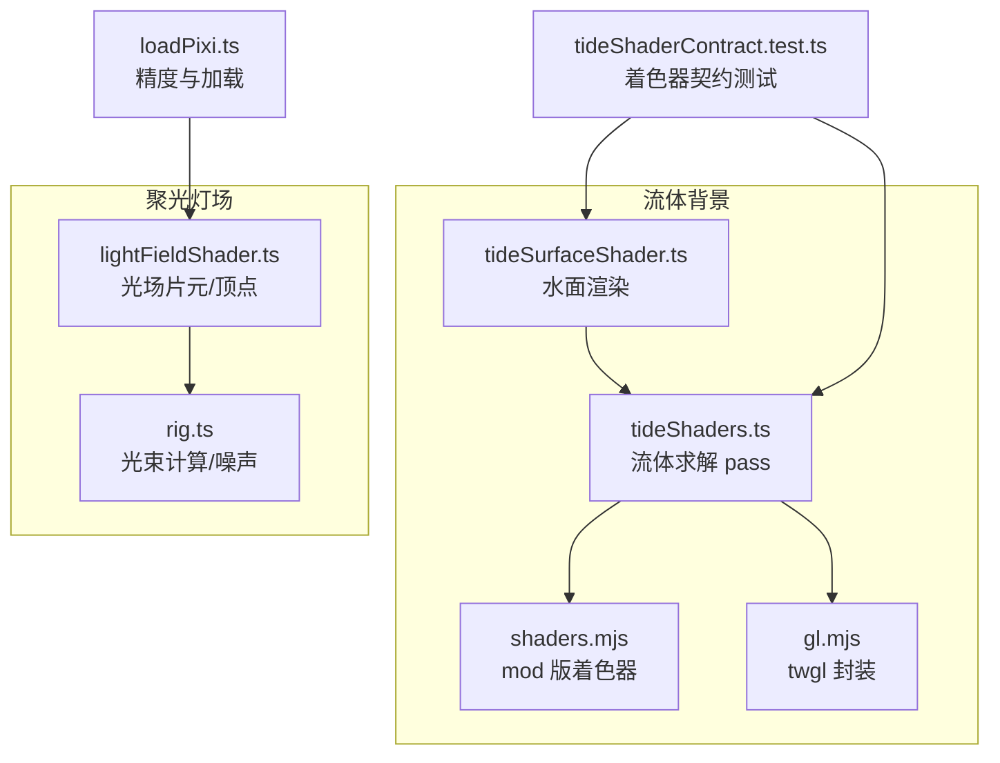
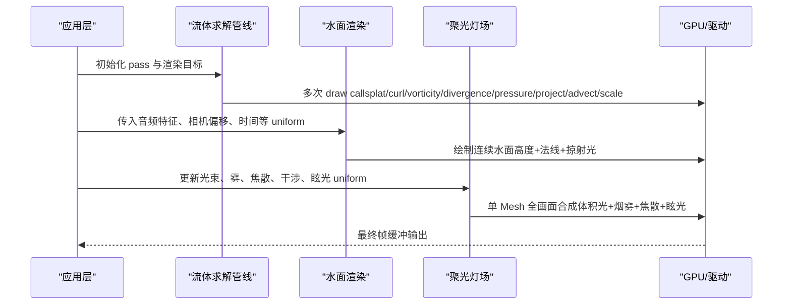
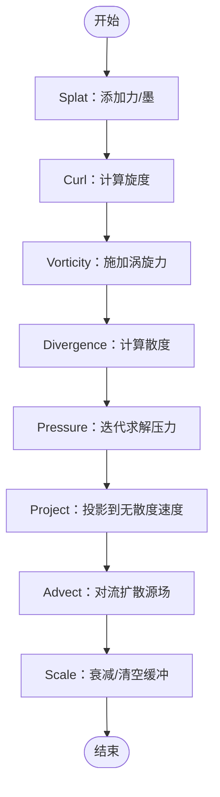
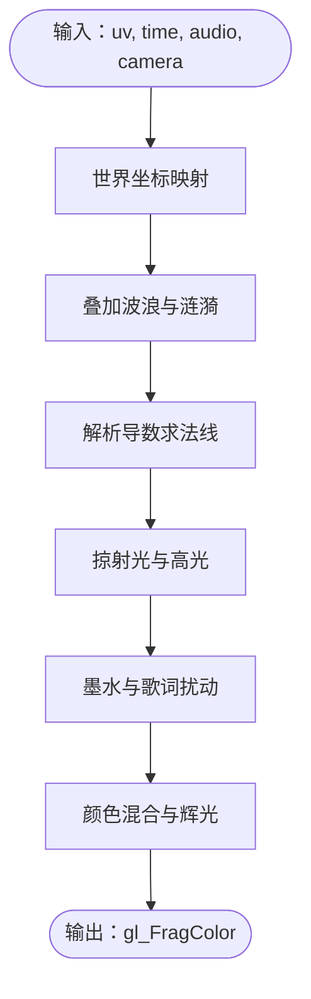
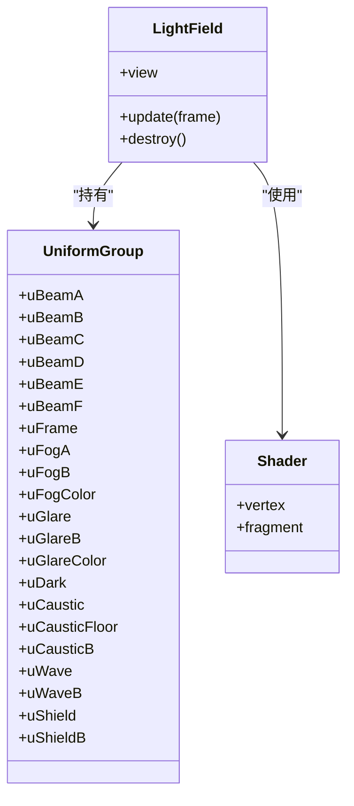
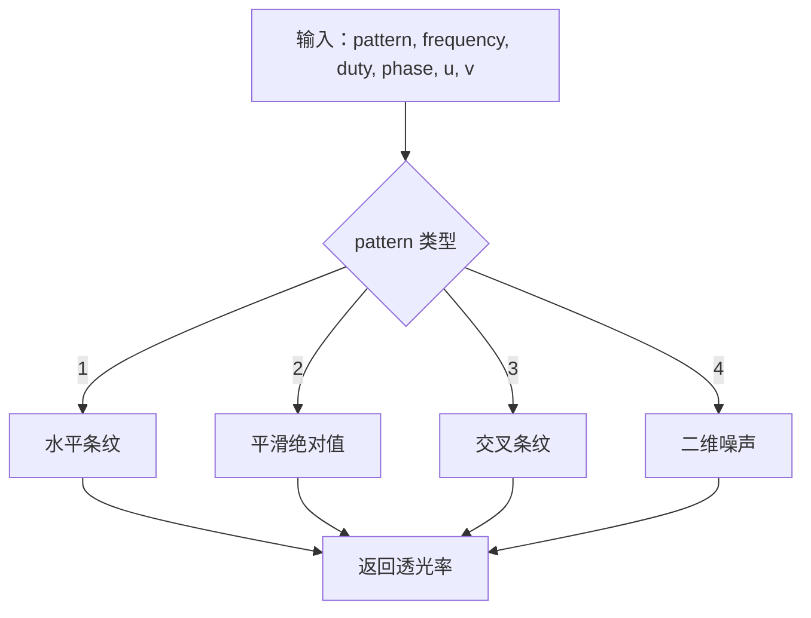
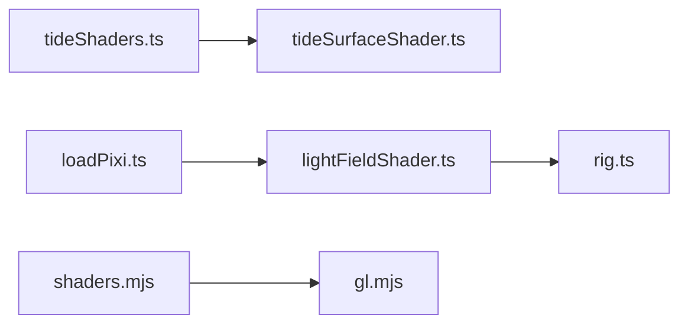

# 着色器编程

<cite>
**本文引用的文件**   
- [tideShaders.ts](file://src/components/visualizer/backgrounds/tide/tideShaders.ts)
- [tideSurfaceShader.ts](file://src/components/visualizer/backgrounds/tide/tideSurfaceShader.ts)
- [shaders.mjs](file://dist-mods/tide-background/tide/shaders.mjs)
- [gl.mjs](file://dist-mods/tide-background/tide/gl.mjs)
- [lightFieldShader.ts](file://src/components/visualizer/lumiere/light/lightFieldShader.ts)
- [rig.ts](file://src/components/visualizer/lumiere/light/rig.ts)
- [loadPixi.ts](file://src/components/visualizer/loadPixi.ts)
- [tideShaderContract.test.ts](file://test/unit/visualizer/tideShaderContract.test.ts)
- [dioramaGeometry.test.ts](file://test/unit/visualizer/dioramaGeometry.test.ts)
- [lumiereGpuRelease.test.ts](file://test/unit/visualizer/lumiere/lumiereGpuRelease.test.ts)
- [tideUniforms.test.ts](file://test/unit/visualizer/tideUniforms.test.ts)
</cite>

## 目录
1. [引言](#引言)
2. [项目结构](#项目结构)
3. [核心组件](#核心组件)
4. [架构总览](#架构总览)
5. [详细组件分析](#详细组件分析)
6. [依赖关系分析](#依赖关系分析)
7. [性能与优化](#性能与优化)
8. [故障排查指南](#故障排查指南)
9. [结论](#结论)
10. [附录：常用模板与基准要点](#附录常用模板与基准要点)

## 引言
本技术文档围绕仓库中的 GLSL 着色器实现，系统梳理顶点与片段着色器的编写规范、程序生命周期管理（编译、链接、参数传递与动态更新）、典型效果实现（噪声、颜色渐变、几何变换、流体模拟、体积光场），以及跨平台兼容性、精度控制、调试方法与优化策略。重点覆盖两类子系统：
- 潮汐流体背景：基于 WebGL 的流体求解与水面渲染管线。
- 聚光灯场：基于 Pixi 的光束、烟雾、焦散与眩光合成。

## 项目结构
本项目将 GLSL 源码以字符串形式嵌入 TypeScript/JavaScript 中，并通过运行时创建 WebGL 程序或 Pixi Shader/GlProgram 进行编译与使用。关键组织方式如下：
- 流体着色器定义位于 tideShaders.ts，包含多个 pass 的顶点与片段着色器。
- 水面渲染着色器位于 tideSurfaceShader.ts，负责连续水面的高度、法线、掠射高光与歌词扰动。
- 聚光灯场着色器位于 lightFieldShader.ts，包含光束掩码、噪声、FBM、焦散、干涉条纹等复杂片元逻辑。
- dist-mods 下的 shaders.mjs 是主仓库着色器的精简移植版本，用于 mod 环境。
- gl.mjs 提供 twgl 薄封装，统一处理渲染目标与纹理绑定。
- loadPixi.ts 在应用启动时设置全局高精度精度偏好，避免框架注入 mediump 导致精度不足。
- 测试用例对着色器契约（GLSL ES 1.00、ASCII、uniform 数组限制、输出变量）进行断言。

**图示来源**
- [tideShaders.ts:1-145](file://src/components/visualizer/backgrounds/tide/tideShaders.ts#L1-L145)
- [tideSurfaceShader.ts:1-206](file://src/components/visualizer/backgrounds/tide/tideSurfaceShader.ts#L1-L206)
- [shaders.mjs:1-269](file://dist-mods/tide-background/tide/shaders.mjs#L1-L269)
- [gl.mjs:1-20](file://dist-mods/tide-background/tide/gl.mjs#L1-L20)
- [lightFieldShader.ts:1-439](file://src/components/visualizer/lumiere/light/lightFieldShader.ts#L1-L439)
- [rig.ts:262-299](file://src/components/visualizer/lumiere/light/rig.ts#L262-L299)
- [loadPixi.ts:18-36](file://src/components/visualizer/loadPixi.ts#L18-L36)
- [tideShaderContract.test.ts:32-66](file://test/unit/visualizer/tideShaderContract.test.ts#L32-L66)

**章节来源**
- [tideShaders.ts:1-145](file://src/components/visualizer/backgrounds/tide/tideShaders.ts#L1-L145)
- [tideSurfaceShader.ts:1-206](file://src/components/visualizer/backgrounds/tide/tideSurfaceShader.ts#L1-L206)
- [shaders.mjs:1-269](file://dist-mods/tide-background/tide/shaders.mjs#L1-L269)
- [gl.mjs:1-20](file://dist-mods/tide-background/tide/gl.mjs#L1-L20)
- [lightFieldShader.ts:1-439](file://src/components/visualizer/lumiere/light/lightFieldShader.ts#L1-L439)
- [rig.ts:262-299](file://src/components/visualizer/lumiere/light/rig.ts#L262-L299)
- [loadPixi.ts:18-36](file://src/components/visualizer/loadPixi.ts#L18-L36)
- [tideShaderContract.test.ts:32-66](file://test/unit/visualizer/tideShaderContract.test.ts#L32-L66)

## 核心组件
- 流体求解管线（tideShaders.ts）
  - 顶点着色器：全屏四边形/三角形输入，计算 UV 与邻接采样点。
  - 片段着色器：按顺序实现 splat、curl、vorticity、divergence、pressure、project、advect、scale 等 pass，全部为 GLSL ES 1.00，不依赖 uniform 数组。
  - 精度：声明 highp float，确保浮点运算稳定。
- 水面渲染（tideSurfaceShader.ts）
  - 通过多组波浪函数叠加生成浪脊与细节涟漪；解析导数构造法线，掠射光产生亮边。
  - 支持歌词脉冲与焦点区域，使文字附近的水面隆起并泛光。
  - 相机平移世界坐标而非采样 uv，避免边缘翻折与接缝。
- 聚光灯场（lightFieldShader.ts）
  - 顶点着色器：根据投影与世界矩阵计算屏幕位置，透传 alpha。
  - 片元着色器：多束体积光 × 烟雾密度（丁达尔）、焦散、干涉条纹、光源眩光、暗场底合成；输出预乘颜色。
  - 噪声与 FBM：valueNoise1/2、hash11/12、fbm 生成烟雾与条纹细节。
  - 窗影（gobo）：多种图案（条纹、渐变、噪声）与透光率控制。
  - 动态更新：每帧填充 uBeamA/B/C/D/E/F 等 uniform 数组，更新帧尺寸、时间、雾参数、眩光、焦散、干涉与文字区遮罩。
- 精度与加载（loadPixi.ts）
  - 启动时设置 GlProgram.defaultOptions.preferredFragmentPrecision = 'highp'，避免框架默认注入 mediump。
- Mod 移植（shaders.mjs、gl.mjs）
  - 保持 ES 1.00 兼容；gl.mjs 封装 twgl，解决 framebuffer-info 对象到纹理附件的转换问题。

**章节来源**
- [tideShaders.ts:1-145](file://src/components/visualizer/backgrounds/tide/tideShaders.ts#L1-L145)
- [tideSurfaceShader.ts:1-206](file://src/components/visualizer/backgrounds/tide/tideSurfaceShader.ts#L1-L206)
- [lightFieldShader.ts:1-439](file://src/components/visualizer/lumiere/light/lightFieldShader.ts#L1-L439)
- [loadPixi.ts:18-36](file://src/components/visualizer/loadPixi.ts#L18-L36)
- [shaders.mjs:1-269](file://dist-mods/tide-background/tide/shaders.mjs#L1-L269)
- [gl.mjs:1-20](file://dist-mods/tide-background/tide/gl.mjs#L1-L20)

## 架构总览
下图展示流体背景与聚光灯场的整体数据流与控制流：

**图示来源**
- [tideShaders.ts:1-145](file://src/components/visualizer/backgrounds/tide/tideShaders.ts#L1-L145)
- [tideSurfaceShader.ts:1-206](file://src/components/visualizer/backgrounds/tide/tideSurfaceShader.ts#L1-L206)
- [lightFieldShader.ts:1-439](file://src/components/visualizer/lumiere/light/lightFieldShader.ts#L1-L439)

## 详细组件分析

### 流体求解管线（tideShaders.ts）
- 设计模式
  - Pass 化管线：每个片段着色器对应一个物理步骤（curl、vorticity、divergence、pressure、project、advect）。
  - 无 uniform 数组：所有采样点通过 varying 传递，避免 ES 1.00 的限制。
- 关键流程
  - Splat：向速度场或墨水场添加高斯力/墨。
  - Curl/Vorticity：计算旋度并施加涡旋力，增强流动细节。
  - Divergence/Pressure：求解压力场，保证不可压缩性。
  - Project：从速度场减去压力梯度，得到无散度速度。
  - Advect：沿速度场对流扩散源场，带时间衰减。
  - Scale：乘以常数，用于压力衰减与缓冲清空。
- 复杂度
  - 每 pass 一次全屏采样，局部算术运算；总体 O(N_pixels × passes)。
- 错误处理
  - 边界条件通过 v_left/right/top/bottom 判断与回退值处理。
  - 数值稳定性：clamp 速度范围，避免溢出。

**图示来源**
- [tideShaders.ts:41-145](file://src/components/visualizer/backgrounds/tide/tideShaders.ts#L41-L145)

**章节来源**
- [tideShaders.ts:1-145](file://src/components/visualizer/backgrounds/tide/tideShaders.ts#L1-L145)

### 水面渲染（tideSurfaceShader.ts）
- 数学模型
  - 波浪函数：多组参考涌浪与涟漪叠加，解析导数给出法线。
  - 掠射光：法线与光照方向点积，产生浪脊亮线。
  - 歌词扰动：脉冲环与焦点区域提升高度与发光。
- 相机与视口
  - 相机平移 world 坐标，避免 uv 越界导致的纹理环绕与接缝。
- 音频响应
  - 低频提升涌浪幅度，高频锐化涟漪；呼吸量整体抬升水面。

**图示来源**
- [tideSurfaceShader.ts:50-206](file://src/components/visualizer/backgrounds/tide/tideSurfaceShader.ts#L50-L206)

**章节来源**
- [tideSurfaceShader.ts:1-206](file://src/components/visualizer/backgrounds/tide/tideSurfaceShader.ts#L1-L206)

### 聚光灯场（lightFieldShader.ts）
- 数据结构与接口
  - LightFieldFrame：包含光束数组、rig、时间、雾倍率、颜色、眩光倍率、暗场底、octaves、文字区等。
  - createLightField：创建 Pixi Geometry、UniformGroup、Shader 与 Mesh，并提供 update 与 destroy。
- 片元逻辑
  - 噪声：hash11/12、valueNoise1/2、fbm 生成烟雾密度。
  - 窗影：band/goboPattern/goboMask 控制透光率。
  - 光束掩码：beamMask 计算强度与截面位置，支持色散与射程。
  - 焦散：经典迭代公式，连续不接缝。
  - 干涉：圆形区域内条纹，支持双缝与衍射模式。
  - 眩光：亮核+柔光+横向拉丝。
  - 输出：预乘颜色，alpha=通道最大值，近似 screen 混合。
- 动态更新
  - 每帧填充 uBeamA/B/C/D/E/F 等 uniform 数组，更新帧尺寸、时间、雾参数、眩光、焦散、干涉与文字区遮罩。

**图示来源**
- [lightFieldShader.ts:289-439](file://src/components/visualizer/lumiere/light/lightFieldShader.ts#L289-L439)

**章节来源**
- [lightFieldShader.ts:1-439](file://src/components/visualizer/lumiere/light/lightFieldShader.ts#L1-L439)

### 噪声与窗影（rig.ts）
- valueNoise2：二维值噪声，用于窗影噪声图案。
- band：透光条函数，fract(x) 落在 [0, duty) 内为 1，边缘柔化。
- goboMask/goboPattern：与 lightFieldShader.ts 保持一致，保证 JS 与 GLSL 结果一致。

**图示来源**
- [rig.ts:262-299](file://src/components/visualizer/lumiere/light/rig.ts#L262-L299)

**章节来源**
- [rig.ts:262-299](file://src/components/visualizer/lumiere/light/rig.ts#L262-L299)

## 依赖关系分析
- 模块耦合
  - tideShaders.ts 与 tideSurfaceShader.ts 共享流体概念（velocity、ink、texel），但独立编译。
  - lightFieldShader.ts 依赖 rig.ts 的光束计算与噪声函数，确保 JS/GLSL 一致性。
  - shaders.mjs 与 gl.mjs 是 dist-mods 的轻量实现，依赖 twgl 与 shaders.mjs。
- 外部依赖
  - Pixi.js：用于 Shader、GlProgram、Geometry、Mesh 等对象。
  - twgl：在 mod 环境中简化 WebGL 程序与纹理绑定。
- 潜在循环依赖
  - 无直接循环；JS 侧仅调用 GLSL 字符串，不反向依赖。

**图示来源**
- [tideShaders.ts:1-145](file://src/components/visualizer/backgrounds/tide/tideShaders.ts#L1-L145)
- [tideSurfaceShader.ts:1-206](file://src/components/visualizer/backgrounds/tide/tideSurfaceShader.ts#L1-L206)
- [lightFieldShader.ts:1-439](file://src/components/visualizer/lumiere/light/lightFieldShader.ts#L1-L439)
- [rig.ts:262-299](file://src/components/visualizer/lumiere/light/rig.ts#L262-L299)
- [shaders.mjs:1-269](file://dist-mods/tide-background/tide/shaders.mjs#L1-L269)
- [gl.mjs:1-20](file://dist-mods/tide-background/tide/gl.mjs#L1-L20)
- [loadPixi.ts:18-36](file://src/components/visualizer/loadPixi.ts#L18-L36)

**章节来源**
- [tideShaders.ts:1-145](file://src/components/visualizer/backgrounds/tide/tideShaders.ts#L1-L145)
- [tideSurfaceShader.ts:1-206](file://src/components/visualizer/backgrounds/tide/tideSurfaceShader.ts#L1-L206)
- [lightFieldShader.ts:1-439](file://src/components/visualizer/lumiere/light/lightFieldShader.ts#L1-L439)
- [rig.ts:262-299](file://src/components/visualizer/lumiere/light/rig.ts#L262-L299)
- [shaders.mjs:1-269](file://dist-mods/tide-background/tide/shaders.mjs#L1-L269)
- [gl.mjs:1-20](file://dist-mods/tide-background/tide/gl.mjs#L1-L20)
- [loadPixi.ts:18-36](file://src/components/visualizer/loadPixi.ts#L18-L36)

## 性能与优化
- 指令精简
  - 流体 pass 避免 uniform 数组，改用 varying 传递邻接采样点，减少分支与索引开销。
  - 水面渲染使用解析导数与简单三角函数，避免复杂迭代。
- 分支预测
  - 使用 smoothstep 与 clamp 替代硬分支，提高并行效率。
  - 光束掩码中 early return 仅在无效区域，减少无用计算。
- 纹理采样优化
  - 流体 pass 复用同一纹理布局，减少绑定切换。
  - gl.mjs 将 framebuffer-info 解包为颜色附件，避免采样黑色导致的“冻结”现象。
- GPU 缓存利用
  - 全屏四边形/三角形批处理，减少状态切换。
  - 聚光灯场单 Mesh 全画面合成，降低 draw call 数量。
- 精度控制
  - loadPixi.ts 设置 preferredFragmentPrecision = 'highp'，避免框架注入 mediump。
  - 所有片段着色器显式声明 precision highp float，确保跨设备一致性。

**章节来源**
- [tideShaders.ts:1-145](file://src/components/visualizer/backgrounds/tide/tideShaders.ts#L1-L145)
- [tideSurfaceShader.ts:1-206](file://src/components/visualizer/backgrounds/tide/tideSurfaceShader.ts#L1-L206)
- [lightFieldShader.ts:1-439](file://src/components/visualizer/lumiere/light/lightFieldShader.ts#L1-L439)
- [gl.mjs:1-20](file://dist-mods/tide-background/tide/gl.mjs#L1-L20)
- [loadPixi.ts:18-36](file://src/components/visualizer/loadPixi.ts#L18-L36)

## 故障排查指南
- 着色器契约检查
  - 纯 ASCII：避免 ANGLE 翻译失败。
  - 禁止 uniform 数组：ES 1.00 限制。
  - GLSL ES 1.00：无 #version、texture(非 texture2D)、texelFetch、out/in vecN。
  - 必须写入 gl_FragColor，且声明 precision highp float。
- 资源释放
  - 聚光灯场销毁时需同时销毁几何与索引缓冲，避免内存泄漏。
- 纹理绑定
  - gl.mjs 中 tideTargetTexture 提取 attachments[0]，确保 twgl 能正确采样。
- 调试建议
  - 使用浏览器开发者工具的 WebGL 面板检查程序编译与链接错误。
  - 分 pass 输出中间结果（如 curl、pressure）到屏幕，验证物理合理性。
  - 在 lightFieldShader.ts 中临时禁用某些效果（如 caustic、wave）定位瓶颈。

**章节来源**
- [tideShaderContract.test.ts:32-66](file://test/unit/visualizer/tideShaderContract.test.ts#L32-L66)
- [lumiereGpuRelease.test.ts:88-97](file://test/unit/visualizer/lumiere/lumiereGpuRelease.test.ts#L88-L97)
- [gl.mjs:1-20](file://dist-mods/tide-background/tide/gl.mjs#L1-L20)

## 结论
本项目的 GLSL 着色器实现遵循严格的 ES 1.00 约束，通过 pass 化管线与单 Mesh 合成实现高性能流体与体积光效果。精度控制、纹理绑定与资源释放均有明确策略，测试用例保障着色器契约与内存安全。建议在扩展新效果时：
- 保持 ES 1.00 兼容，避免 uniform 数组与高级语法。
- 优先使用解析数学与 smoothstep 替代分支。
- 通过测试用例验证着色器契约与资源释放。
- 结合浏览器 WebGL 工具进行性能分析与错误诊断。

## 附录：常用模板与基准要点
- 流体求解模板
  - 顶点着色器：全屏四边形，计算 UV 与邻接采样点。
  - 片段着色器：按物理步骤拆分 pass，避免 uniform 数组。
- 水面渲染模板
  - 波浪叠加 + 解析导数 + 掠射光 + 歌词扰动。
- 聚光灯场模板
  - 噪声 + FBM + 窗影 + 光束掩码 + 焦散 + 干涉 + 眩光。
- 基准测试要点
  - 帧率：统计各 pass 耗时，识别瓶颈。
  - 内存：监控纹理与几何缓冲释放。
  - 精度：对比 highp 与 mediump 输出差异。

**章节来源**
- [tideShaders.ts:1-145](file://src/components/visualizer/backgrounds/tide/tideShaders.ts#L1-L145)
- [tideSurfaceShader.ts:1-206](file://src/components/visualizer/backgrounds/tide/tideSurfaceShader.ts#L1-L206)
- [lightFieldShader.ts:1-439](file://src/components/visualizer/lumiere/light/lightFieldShader.ts#L1-L439)