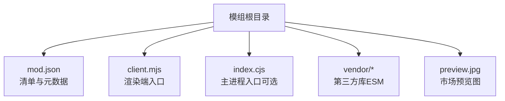
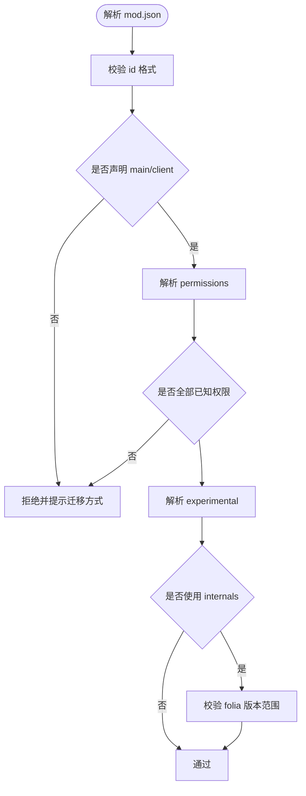
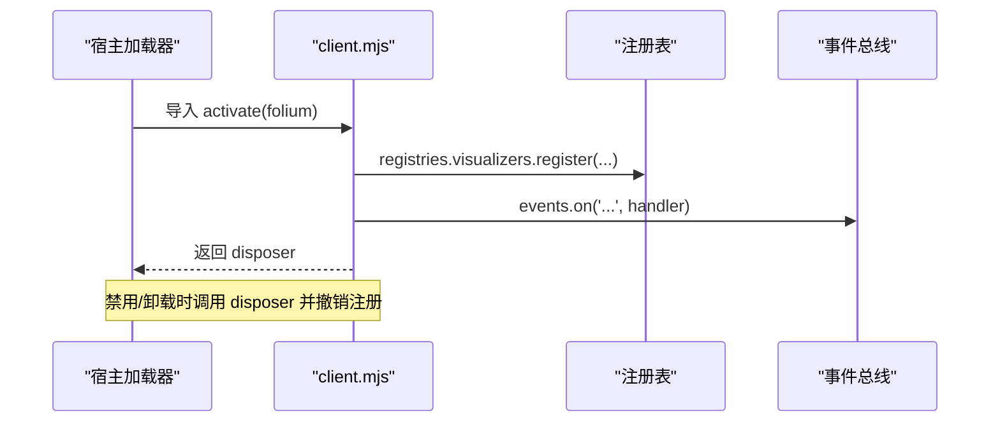
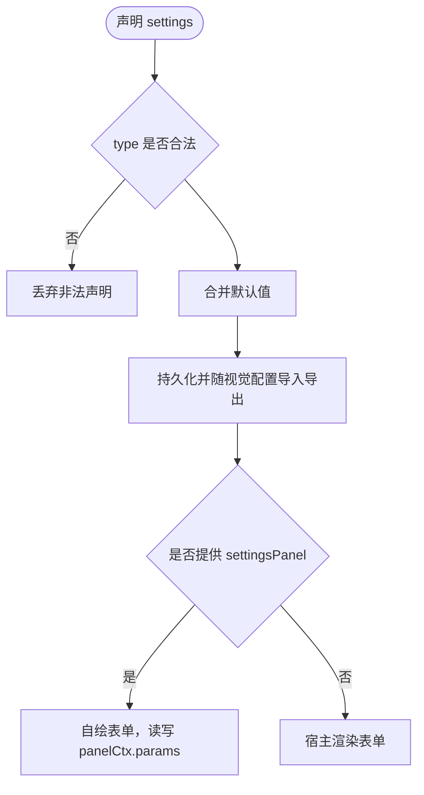
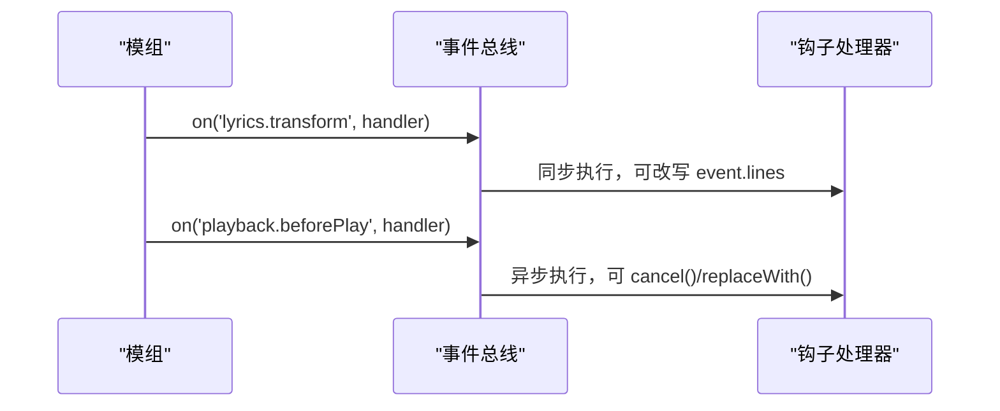
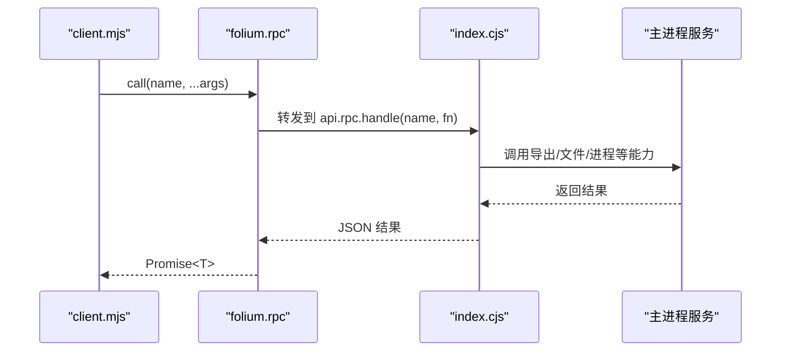
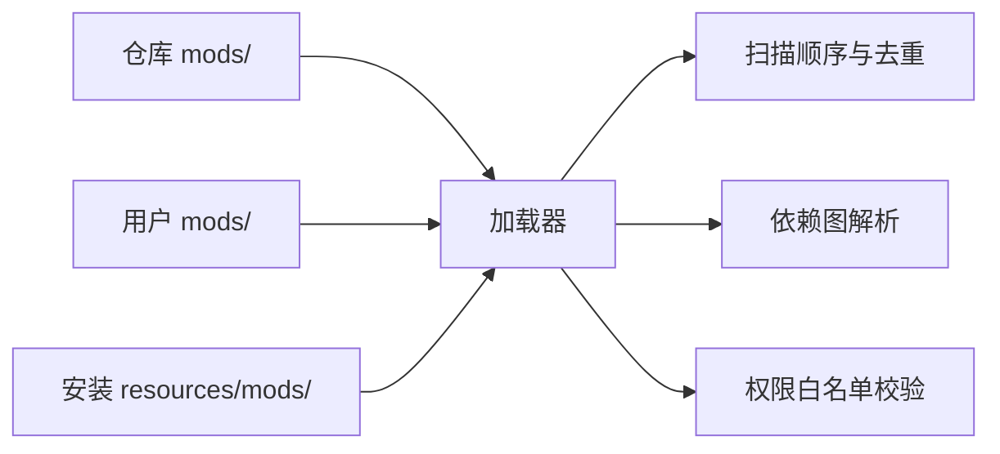
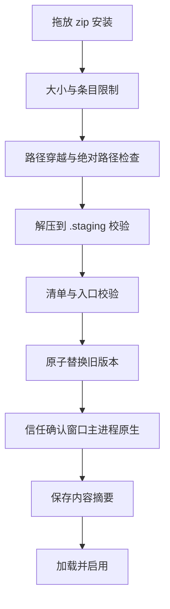

# 自定义可视化开发

<cite>
**本文引用的文件**   
- [mods/README.md](file://mods/README.md)
- [docs/folium/api.md](file://docs/folium/api.md)
- [docs/folium/contributing.md](file://docs/folium/contributing.md)
- [src/mods/folium/contract.ts](file://src/mods/folium/contract.ts)
- [electron/modSystem/modApi.cjs](file://electron/modSystem/modApi.cjs)
- [electron/modSystem/manifest.cjs](file://electron/modSystem/manifest.cjs)
- [mods/sample-aurora-visualizer/client.mjs](file://mods/sample-aurora-visualizer/client.mjs)
- [mods/sample-aurora-visualizer/mod.json](file://mods/sample-aurora-visualizer/mod.json)
- [mods/visualizer52hz/client.mjs](file://mods/visualizer52hz/client.mjs)
- [mods/visualizer52hz/mod.json](file://mods/visualizer52hz/mod.json)
</cite>

## 目录
1. [引言](#引言)
2. [项目结构](#项目结构)
3. [核心组件](#核心组件)
4. [架构总览](#架构总览)
5. [详细组件分析](#详细组件分析)
6. [依赖关系分析](#依赖关系分析)
7. [性能与渲染要点](#性能与渲染要点)
8. [调试与测试](#调试与测试)
9. [安全与沙箱机制](#安全与沙箱机制)
10. [发布与分发最佳实践](#发布与分发最佳实践)
11. [常见问题与排错](#常见问题与排错)
12. [结论](#结论)

## 引言
本指南面向希望为 Folia 的 Folium 模组系统开发“自定义可视化效果”的开发者。内容覆盖：
- 模组结构与清单定义
- 注册表、API 契约与生命周期钩子
- 可视化模组的完整开发流程（从初始化到打包发布）
- 自定义可视化组件集成方法（React、Three.js、Pixi.js 等）
- 模组与主应用通信（IPC、状态同步、事件处理）
- 安全模型与权限边界
- 调试、测试与性能优化
- 版本管理、依赖处理与用户安装指南

Folium 当前稳定契约为 1.3，运行时通过 `folium.host.folium.minor` 做能力探测；所有公开类型以 `src/mods/folium/contract.ts` 为准，文档由该契约自动生成。

**章节来源**
- [docs/folium/api.md:1-24](file://docs/folium/api.md#L1-L24)
- [src/mods/folium/contract.ts:1-10](file://src/mods/folium/contract.ts#L1-L10)

## 项目结构
一个最小可用的可视化模组包含：
- `mod.json`：模组清单（id、版本、入口、预览图、权限、实验接口等）
- `client.mjs`：渲染端入口，导出 `activate(folium)`
- 可选 `index.cjs`：主进程入口，用于 Node 侧能力（如导出、文件、进程）

仓库内样例：
- `mods/sample-aurora-visualizer`：纯 client 歌词动画
- `mods/visualizer52hz`：基于 PixiJS 的歌词动画，含设置、音频分析与思索教程



**图表来源**
- [mods/sample-aurora-visualizer/mod.json:1-11](file://mods/sample-aurora-visualizer/mod.json#L1-L11)
- [mods/visualizer52hz/mod.json:1-14](file://mods/visualizer52hz/mod.json#L1-L14)

**章节来源**
- [mods/README.md:88-107](file://mods/README.md#L88-L107)
- [mods/sample-aurora-visualizer/mod.json:1-11](file://mods/sample-aurora-visualizer/mod.json#L1-L11)
- [mods/visualizer52hz/mod.json:1-14](file://mods/visualizer52hz/mod.json#L1-L14)

## 核心组件
- 模组清单 `mod.json`：声明 id、版本、入口、预览、依赖、权限、嵌入源、实验接口与宿主版本范围
- 客户端 API `folium`：提供注册表、事件总线、服务（播放、UI、网络、存储）、RPC、歌词与主题工具
- 注册表：可视化模式、背景、舞台图层、设置分区、命令、面板标签、进度条控件与样式
- 生命周期：`activate` 返回清理函数；每个 mount 可返回 dispose；宿主在停用/卸载时自动回收
- 事件总线：通知型事件与钩子类事件（歌词改写、播放前拦截、Omni 扩展）
- 服务：playback、ui、net、storage、rpc
- 契约类型：`FoliumLine`、`FoliumTheme`、`FoliumStageContext`、`FoliumParam` 等

**章节来源**
- [mods/README.md:109-154](file://mods/README.md#L109-L154)
- [docs/folium/api.md:25-109](file://docs/folium/api.md#L25-L109)
- [docs/folium/api.md:111-373](file://docs/folium/api.md#L111-L373)
- [docs/folium/api.md:375-522](file://docs/folium/api.md#L375-L522)
- [docs/folium/api.md:523-641](file://docs/folium/api.md#L523-L641)
- [docs/folium/api.md:643-740](file://docs/folium/api.md#L643-L740)
- [docs/folium/api.md:742-794](file://docs/folium/api.md#L742-L794)
- [docs/folium/api.md:796-800](file://docs/folium/api.md#L796-L800)
- [src/mods/folium/contract.ts:245-303](file://src/mods/folium/contract.ts#L245-L303)
- [src/mods/folium/contract.ts:305-466](file://src/mods/folium/contract.ts#L305-L466)
- [src/mods/folium/contract.ts:468-726](file://src/mods/folium/contract.ts#L468-L726)

## 架构总览
Folium 将“模组代码”与“宿主能力”解耦：
- 模组通过 `registries.*` 向宿主注册 UI 或行为
- 通过 `events.on` 订阅或拦截宿主事件
- 通过 `playback/ui/net/storage/rpc` 调用受控能力
- main 与 client 之间通过 IPC 通道（JSON 序列化）通信

```mermaid
graph TB
subgraph "模组"
M_Client["client.mjs<br/>渲染端"]
M_Main["index.cjs<br/>主进程"]
end
subgraph "宿主"
H_Registry["注册表<br/>visualizers/backgrounds/stageLayers/..."]
H_Events["事件总线<br/>通知 + 钩子"]
H_Services["服务<br/>playback/ui/net/storage/rpc"]
H_Contract["契约类型<br/>contract.ts"]
end
M_Client --> H_Registry
M_Client --> H_Events
M_Client --> H_Services
M_Main --> H_Services
M_Client < --> |"RPC (JSON)"| M_Main
H_Registry --- H_Contract
H_Services --- H_Contract
```

**图表来源**
- [docs/folium/api.md:25-109](file://docs/folium/api.md#L25-L109)
- [docs/folium/api.md:111-373](file://docs/folium/api.md#L111-L373)
- [docs/folium/api.md:523-641](file://docs/folium/api.md#L523-L641)
- [docs/folium/api.md:643-740](file://docs/folium/api.md#L643-L740)
- [src/mods/folium/contract.ts:468-726](file://src/mods/folium/contract.ts#L468-L726)

## 详细组件分析

### 模组清单与权限
- `folium`：平台 major 版本（必须为 1）
- `id`：全局唯一，小写字母数字与连字符
- `version`：语义化版本
- `main` / `client`：可选，至少一个
- `permissions`：功能开关集合（未知权限直接拒绝）
- `embedOrigins`：允许嵌入的外部 origin（需 `net.embed`）
- `experimental`：显式启用实验接口
- `folia`：宿主版本范围（使用 internals 时必填）



**图表来源**
- [mods/README.md:109-154](file://mods/README.md#L109-L154)
- [electron/modSystem/manifest.cjs:1-32](file://electron/modSystem/manifest.cjs#L1-L32)

**章节来源**
- [mods/README.md:109-154](file://mods/README.md#L109-L154)
- [electron/modSystem/manifest.cjs:1-32](file://electron/modSystem/manifest.cjs#L1-L32)

### 客户端入口与生命周期
- `client.mjs` 默认导出 `activate(folium)`
- 可返回 disposer；宿主在停用/重载/卸载时先调用它，再撤销注册
- 错误隔离：activate、事件处理器、mount 各自错误边界
- 运行环境：`folium.env.context` 为 `'main'` 或 `'export'`



**图表来源**
- [mods/README.md:155-189](file://mods/README.md#L155-L189)
- [docs/folium/api.md:101-109](file://docs/folium/api.md#L101-L109)

**章节来源**
- [mods/README.md:155-189](file://mods/README.md#L155-L189)
- [docs/folium/api.md:101-109](file://docs/folium/api.md#L101-L109)

### 可视化模式（Visualizer）
- 通过 `registries.visualizers.register({ id, label, order, mount, settings, settingsPanel, hostLayers })` 注册
- `mount(container, ctx)` 中：
  - `ctx.lines` / `ctx.song` 在挂载周期内不变
  - 当前行通过 `ctx.getLineIndex()` 读取
  - 时间通过 `ctx.currentTime.get()` 或 `on('change')`
  - 主题、显示设置、封面、字幕主题等通过 getter 与 `subscribe`
  - `ctx.audio`（1.2）提供频谱与频段能量
  - `ctx.getSurface().transparent` / `hostBackground` 控制透明与背景让位

```mermaid
classDiagram
class FoliumVisualizerDef {
+string id
+FoliumLabel label
+number order
+mount(container, ctx)
+FoliumParam[] settings
+mount(settingsPanel)
+{ background? : boolean; subtitles? : boolean } hostLayers
}
class FoliumStageContext {
+readonly lines
+readonly song
+readonly staticMode
+readonly staticLineIndex
+readonly seed
+readonly isPreview
+currentTime
+getLineIndex()
+isPaused()
+getTheme()
+getSubtitleTheme()
+getCoverUrl()
+getDisplay()
+getSettings()
+getSurface()
+subscribe(listener)
+audio
}
FoliumVisualizerDef --> FoliumStageContext : "mount 参数"
```

**图表来源**
- [docs/folium/api.md:115-129](file://docs/folium/api.md#L115-L129)
- [docs/folium/api.md:494-522](file://docs/folium/api.md#L494-L522)
- [src/mods/folium/contract.ts:470-489](file://src/mods/folium/contract.ts#L470-L489)
- [src/mods/folium/contract.ts:421-466](file://src/mods/folium/contract.ts#L421-L466)

**章节来源**
- [docs/folium/api.md:115-129](file://docs/folium/api.md#L115-L129)
- [docs/folium/api.md:494-522](file://docs/folium/api.md#L494-L522)
- [src/mods/folium/contract.ts:470-489](file://src/mods/folium/contract.ts#L470-L489)
- [src/mods/folium/contract.ts:421-466](file://src/mods/folium/contract.ts#L421-L466)

### 设置与参数 Schema
- 统一使用 `FoliumParam` 声明字段（number/text/boolean/select）
- 值已合并默认值；写入按 schema 校验（未知键丢弃、数值夹取、select 白名单）
- 支持分组、步长、占位符、选项列表
- 可通过 `settingsPanel` 自绘表单，但值仍由 schema 管理



**图表来源**
- [mods/README.md:223-237](file://mods/README.md#L223-L237)
- [docs/folium/api.md:796-800](file://docs/folium/api.md#L796-L800)
- [src/mods/folium/contract.ts:245-303](file://src/mods/folium/contract.ts#L245-L303)

**章节来源**
- [mods/README.md:223-237](file://mods/README.md#L223-L237)
- [docs/folium/api.md:796-800](file://docs/folium/api.md#L796-L800)
- [src/mods/folium/contract.ts:245-303](file://src/mods/folium/contract.ts#L245-L303)

### 事件与钩子
- 通知型事件：只读、事后发出（歌曲变化、播放状态、跳转、歌词就绪、视图切换、主题变化、喜爱状态变化）
- 钩子类事件：同一事件对象依次经过处理器，可修改（歌词改写、播放前拦截、Omni 扩展）
- 优先级：highest/high/normal/low/lowest，同级按注册顺序



**图表来源**
- [docs/folium/api.md:523-641](file://docs/folium/api.md#L523-L641)

**章节来源**
- [docs/folium/api.md:523-641](file://docs/folium/api.md#L523-L641)

### 服务与 IPC 通信
- playback：播放控制（需 `playback.control`），包括 seekToLyricTime（歌词时间）
- ui：提示、面板、导航、文件选择、嵌入网页、图标
- net：经主进程发起 http(s) 请求（需 `net.fetch`）
- storage：JSON 序列化数据（需 `filesystem.data`，上限 1MB）
- rpc：client 调用 main 注册的函数（参数与返回值 JSON 序列化）



**图表来源**
- [docs/folium/api.md:643-740](file://docs/folium/api.md#L643-L740)
- [electron/modSystem/modApi.cjs:158-192](file://electron/modSystem/modApi.cjs#L158-L192)

**章节来源**
- [docs/folium/api.md:643-740](file://docs/folium/api.md#L643-L740)
- [electron/modSystem/modApi.cjs:158-192](file://electron/modSystem/modApi.cjs#L158-L192)

### 示例：虹光歌词动画
- 纯 client 模组，注册 visualizer
- 使用 `folium.theme.resolveFontStack` 与 `lyricsFontScale` 适配主题与字号
- 逐字扫光效果，基于词/字的起止时间计算透明度与位移

**章节来源**
- [mods/sample-aurora-visualizer/client.mjs:1-128](file://mods/sample-aurora-visualizer/client.mjs#L1-L128)
- [mods/sample-aurora-visualizer/mod.json:1-11](file://mods/sample-aurora-visualizer/mod.json#L1-L11)

### 示例：52Hz（Pixi.js 歌词动画）
- 使用 Pixi.js（通过 vendor 引入）
- 声明 settings（扩散速度、节拍灵敏度、响度灵敏度、不透明度、字号）
- 使用 `ctx.audio`（Folium 1.2）获取音频能量驱动波纹
- 注册 ponder.targets（实验接口）

**章节来源**
- [mods/visualizer52hz/client.mjs:1-84](file://mods/visualizer52hz/client.mjs#L1-L84)
- [mods/visualizer52hz/mod.json:1-14](file://mods/visualizer52hz/mod.json#L1-L14)

## 依赖关系分析
- 模组扫描顺序：开发版先仓库 `mods/`，再用户目录 `mods/`，最后安装目录 `resources/mods`；同 id 只认最先扫描到的
- 依赖解析：`depends` 支持 `id@^x.y.z`（仅 `^` 与 `*`），缺失/版本不符/成环/未启用则跳过相关子图
- 权限白名单：未知权限直接拒绝，fail closed



**图表来源**
- [mods/README.md:105-107](file://mods/README.md#L105-L107)
- [mods/README.md:139-154](file://mods/README.md#L139-L154)
- [electron/modSystem/manifest.cjs:14-25](file://electron/modSystem/manifest.cjs#L14-L25)

**章节来源**
- [mods/README.md:105-107](file://mods/README.md#L105-L107)
- [mods/README.md:139-154](file://mods/README.md#L139-L154)
- [electron/modSystem/manifest.cjs:14-25](file://electron/modSystem/manifest.cjs#L14-L25)

## 性能与渲染要点
- 歌词动画只在歌词、歌曲、staticMode 或静态预览行变化时重新挂载；换行不重挂载
- 暂停时时钟不走，通过 `ctx.subscribe` 感知主题、设置、显示设置变化
- `ctx.audio.getBands()` 每次返回同一对象，原地刷新，需要保留读数请复制
- 在帧循环中调用 getter 无问题，但不要因此触发 React/DOM 布局
- 透明表面（OBS、透明导出）下不要画不透明底；宿主背景存在时应让位

**章节来源**
- [mods/README.md:238-274](file://mods/README.md#L238-L274)
- [docs/folium/contributing.md:156-168](file://docs/folium/contributing.md#L156-L168)

## 调试与测试
- 开发环境：源码运行桌面版，把模组放入仓库 `mods/<你的模组>/` 即可加载
- 打开模组面板：命令面板执行「模组」
- 调试循环：
  - 开发版：首次启用确认，之后改代码只需“重载”，无需重新确认
  - 安装版/用户目录：改代码后“重载”，指纹变化会撤销确认并禁用，需重新启用并确认
- 错误展示：`folium.log.error` 与抛出的错误显示在模组面板该模组的“界面代码出错”下
- 单元测试：仓库包含模组系统相关单测（如 registry、modApi）

**章节来源**
- [docs/folium/contributing.md:25-59](file://docs/folium/contributing.md#L25-L59)
- [test/unit/mod-system/foliumRegistry.test.ts:1-25](file://test/unit/mod-system/foliumRegistry.test.ts#L1-L25)
- [test/unit/mod-system/modApi.test.ts:1-36](file://test/unit/mod-system/modApi.test.ts#L1-L36)

## 安全与沙箱机制
- 模组是可信代码，不是沙箱：
  - `main` 拥有完整 Node.js 权限
  - `client` 能读写界面一切
- 权限是功能开关约定，非安全边界；未声明 API 调用 fail closed
- 两道开关：实验室总开关 + 单个模组二次确认
- 确认绑定到内容摘要（sha256），任何文件变化使授权失效
- 官方签名仅标识审查通过且未被改动，不改变权限
- 安装限制：压缩包大小、解压大小、单文件大小、条目数、路径穿越防护、原子安装



**图表来源**
- [mods/README.md:32-48](file://mods/README.md#L32-L48)
- [mods/README.md:50-86](file://mods/README.md#L50-L86)
- [mods/README.md:567-574](file://mods/README.md#L567-L574)

**章节来源**
- [mods/README.md:32-48](file://mods/README.md#L32-L48)
- [mods/README.md:50-86](file://mods/README.md#L50-L86)
- [mods/README.md:567-574](file://mods/README.md#L567-L574)

## 发布与分发最佳实践
- 准备：
  - 公开 https 仓库，模组可在根目录或子目录
  - `mod.json` 通过校验，id 唯一
  - 提供 preview 图片（推荐 1280×720，≤1MB）
  - 打 tag，不包含 `.git`、`node_modules`、`folium.sig.json`，最多 300 文件、16MB
  - 第三方库附许可证
- 提交：
  - 在 folium-compound 开“模组提交”issue，填写 id、仓库、版本、目录、说明、权限与许可证
  - CI 检查并回复通过/未通过
- 审查与签名：
  - 维护者通读 main/client 及 vendor 第三方库
  - 通过后 `/sign <commit>`，CI 复制、签名并发布
- 更新：
  - 提升 version，打新 tag，开“模组更新”issue
  - 维护者审查差异后签名，新版本替换旧版本

**章节来源**
- [docs/folium/contributing.md:195-247](file://docs/folium/contributing.md#L195-L247)

## 常见问题与排错
- 改了代码没有生效？
  - 先在模组面板点“重载”并重新启用
  - 确认用户模组目录没有同 id 旧副本（同 id 只认最先扫描到的）
- 为什么改完代码要重新确认？
  - 启用确认绑定到内容摘要，任何文件变化都会失效
  - 开发版仓库 `mods/` 目录有豁免，只需第一次确认
- 模组出错会影响应用吗？
  - 不会；activate、事件处理器、mount 各自错误边界
- 网页版能用模组吗？
  - 不能，仅在桌面版可用

**章节来源**
- [docs/folium/contributing.md:249-265](file://docs/folium/contributing.md#L249-L265)

## 结论
Folium 为 Folia 提供了稳定可扩展的可视化模组体系。通过清晰的契约、注册表与事件机制，开发者可以安全地扩展歌词动画、背景、舞台图层与播放器 UI，并通过 IPC 与主进程协作完成复杂任务。遵循清单规范、权限声明与生命周期约定，结合样例模组与调试流程，可以快速构建高质量的自定义可视化效果，并按规范发布到模组市场获得官方认证。