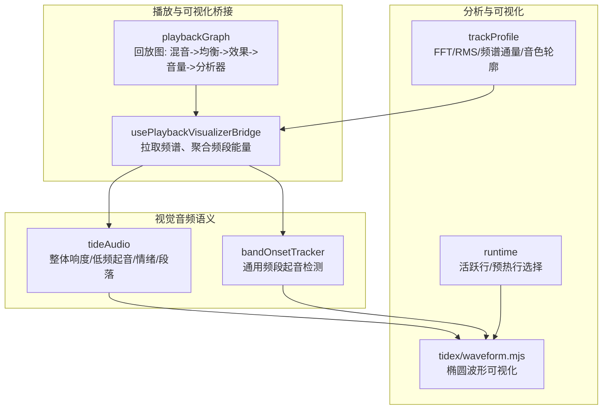
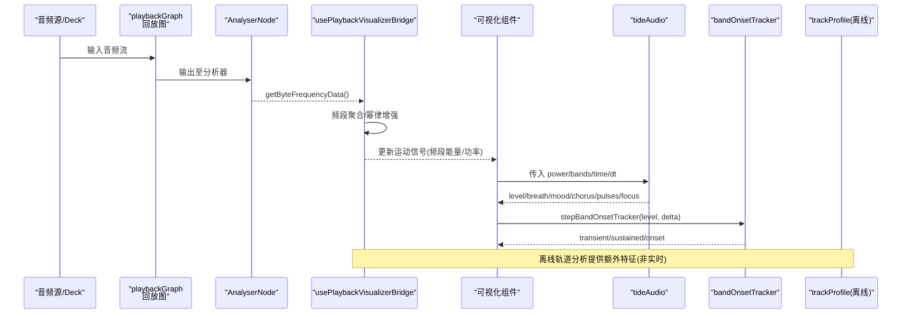
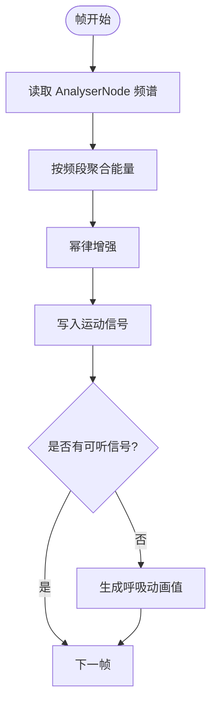
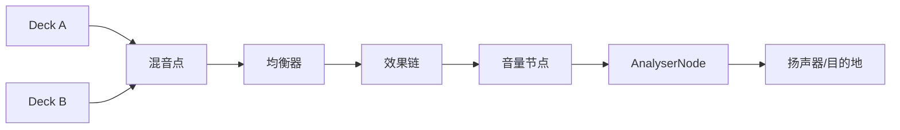
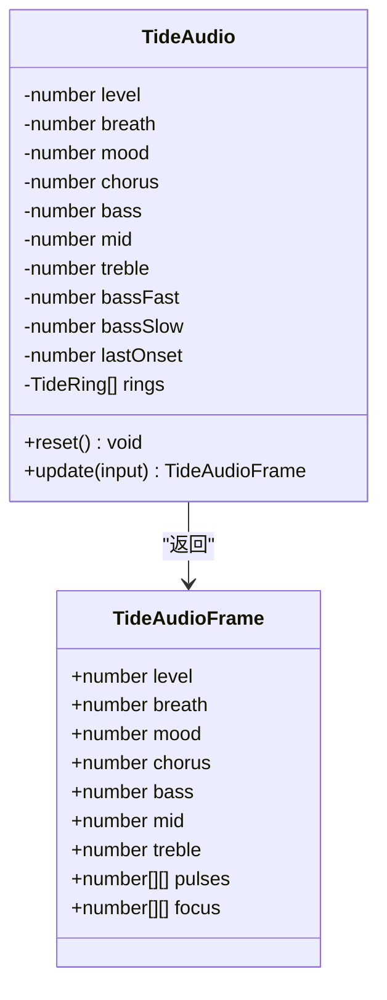
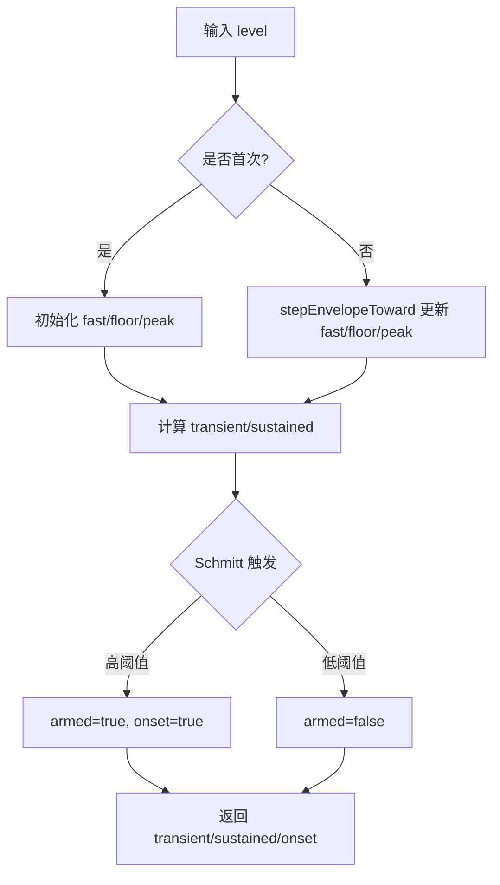
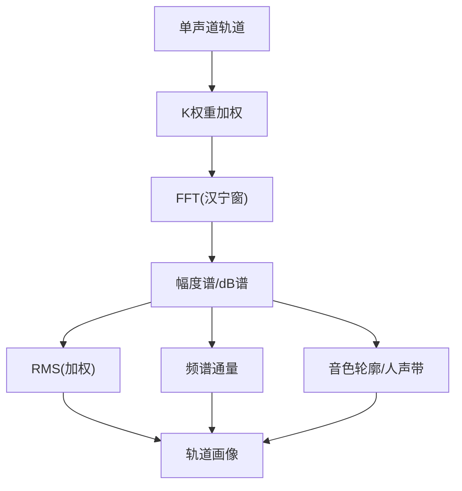
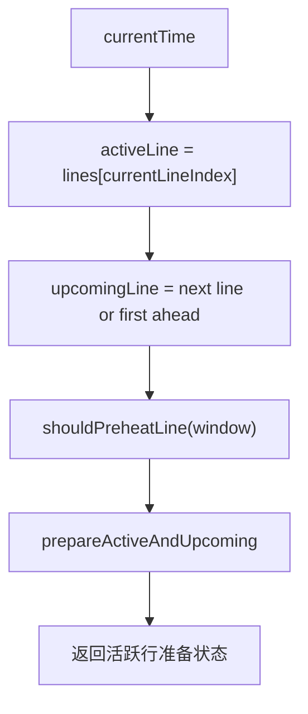
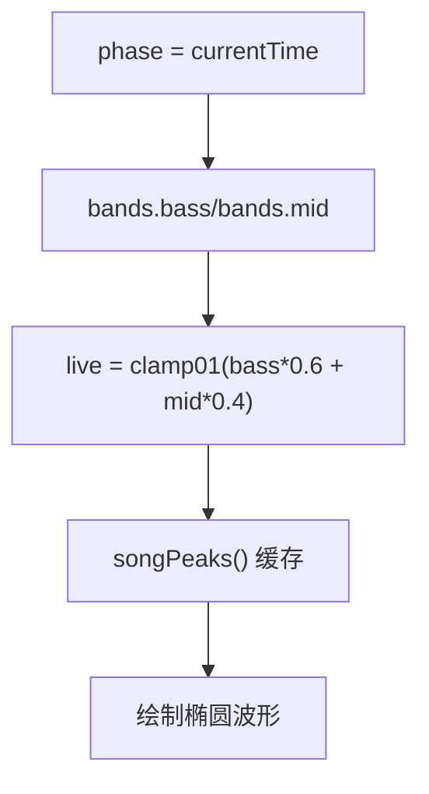
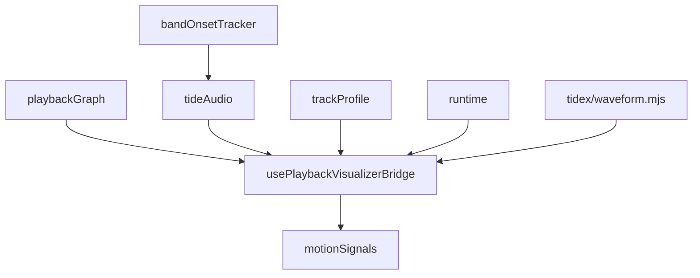

# 时域分析

<cite>
**本文引用的文件**   
- [usePlaybackVisualizerBridge.ts](file://src/hooks/usePlaybackVisualizerBridge.ts)
- [playbackGraph.ts](file://src/services/playbackGraph.ts)
- [tideAudio.ts](file://src/components/visualizer/backgrounds/tide/tideAudio.ts)
- [bandOnsetTracker.ts](file://src/components/visualizer/bandOnsetTracker.ts)
- [trackProfile.ts](file://src/services/automix/trackProfile.ts)
- [runtime.ts](file://src/components/visualizer/runtime.ts)
- [waveform.mjs](file://dist-mods/tidex/waveform.mjs)
</cite>

## 目录
1. [引言](#引言)
2. [项目结构](#项目结构)
3. [核心组件](#核心组件)
4. [架构总览](#架构总览)
5. [详细组件分析](#详细组件分析)
6. [依赖关系分析](#依赖关系分析)
7. [性能考虑](#性能考虑)
8. [故障排查指南](#故障排查指南)
9. [结论](#结论)
10. [附录](#附录)

## 引言
本技术文档面向“时域音频分析系统”，聚焦以下目标：
- 原始音频样本的读取与播放链路中的频域采样桥接。
- 波形包络跟踪、振幅统计与能量估计。
- 过零检测与节奏分析（起音检测）用于节拍与音调线索。
- 时域特征提取：RMS 能量、峰值检测、动态范围分析。
- 预处理：降噪、滤波与增益控制。
- 时域数据到可视化效果的映射：波形显示、振幅指示器、动态效果触发。
- 实时性能优化：缓冲区管理与计算效率。
- 时域分析与频域分析的协同机制。

本项目在浏览器 Web Audio API 基础上，通过 AnalyserNode 获取频谱数据，并在 React 渲染循环中驱动可视化；同时提供通用的频段起音检测器与背景水波视觉的音频语义层，以及离线轨道级频域分析工具。

## 项目结构
围绕时域分析的关键代码分布在以下位置：
- 播放链路与可视化桥接：hooks 层从 AnalyserNode 拉取频谱并聚合为频段能量，写入运动信号供可视化消费。
- 回放图构建：将均衡器、效果链、音量节点与分析器按固定顺序连接，确保可视化看到的是最终输出。
- 视觉音频语义层：对整体响度、低频起音、情绪与段落进行平滑与状态化，输出给水面等视觉效果。
- 通用频段起音检测：为任意 visualizer 提供瞬态/持续能量与带迟滞的 onset 事件。
- 轨道级频域分析：使用 FFT 计算 RMS、频谱通量、音色轮廓等，辅助自动混音与曲目画像。
- 可视化运行时：根据当前时间与歌词行索引，决定活跃行与预热的下一行。
- 扩展波形插件：基于当前时钟与频段能量绘制椭圆波形。

**图示来源**
- [usePlaybackVisualizerBridge.ts:77-131](file://src/hooks/usePlaybackVisualizerBridge.ts#L77-L131)
- [playbackGraph.ts:31-97](file://src/services/playbackGraph.ts#L31-L97)
- [tideAudio.ts:131-224](file://src/components/visualizer/backgrounds/tide/tideAudio.ts#L131-L224)
- [bandOnsetTracker.ts:90-119](file://src/components/visualizer/bandOnsetTracker.ts#L90-L119)
- [trackProfile.ts:684-774](file://src/services/automix/trackProfile.ts#L684-L774)
- [runtime.ts:124-157](file://src/components/visualizer/runtime.ts#L124-L157)
- [waveform.mjs:88-116](file://dist-mods/tidex/waveform.mjs#L88-L116)

**章节来源**
- [usePlaybackVisualizerBridge.ts:77-131](file://src/hooks/usePlaybackVisualizerBridge.ts#L77-L131)
- [playbackGraph.ts:31-97](file://src/services/playbackGraph.ts#L31-L97)
- [tideAudio.ts:131-224](file://src/components/visualizer/backgrounds/tide/tideAudio.ts#L131-L224)
- [bandOnsetTracker.ts:90-119](file://src/components/visualizer/bandOnsetTracker.ts#L90-L119)
- [trackProfile.ts:684-774](file://src/services/automix/trackProfile.ts#L684-L774)
- [runtime.ts:124-157](file://src/components/visualizer/runtime.ts#L124-L157)
- [waveform.mjs:88-116](file://dist-mods/tidex/waveform.mjs#L88-L116)

## 核心组件
- 可视化桥接层：从 AnalyserNode 读取频率数据，按频段求和得到低频、低中频、中频、人声、高频能量，并进行幂律增强后写入运动信号，供可视化消费。无信号时回退到呼吸动画。
- 回放图构建：将双 Deck 混音、均衡器、效果链、音量节点与分析器串联，保证可视化看到的是最终输出，包括监听者设置的音量。
- 视觉音频语义层：对整体响度、低频快慢跟随器、鼓点起音、呼吸包络、秒级情绪与段落状态进行平滑与迟滞处理，输出给水面等视觉效果。
- 通用频段起音检测：分离瞬态与持续能量，提供带迟滞的 onset 事件，避免稳态被误判为背景。
- 轨道级频域分析：使用 FFT 窗口与汉宁窗，计算 RMS、频谱通量、音色轮廓、人声带能量等，用于曲目画像与自动混音策略。
- 可视化运行时：根据当前时间与歌词行索引，确定活跃行与即将出现的行，支持预热窗口。
- 扩展波形插件：基于当前时间相位与频段能量绘制椭圆波形，结合歌曲峰值缓存提升稳定性。

**章节来源**
- [usePlaybackVisualizerBridge.ts:77-131](file://src/hooks/usePlaybackVisualizerBridge.ts#L77-L131)
- [playbackGraph.ts:31-97](file://src/services/playbackGraph.ts#L31-L97)
- [tideAudio.ts:131-224](file://src/components/visualizer/backgrounds/tide/tideAudio.ts#L131-L224)
- [bandOnsetTracker.ts:90-119](file://src/components/visualizer/bandOnsetTracker.ts#L90-L119)
- [trackProfile.ts:684-774](file://src/services/automix/trackProfile.ts#L684-L774)
- [runtime.ts:124-157](file://src/components/visualizer/runtime.ts#L124-L157)
- [waveform.mjs:88-116](file://dist-mods/tidex/waveform.mjs#L88-L116)

## 架构总览
下图展示从音频源到可视化的完整路径，强调时域与频域的协作：
- 播放链：Deck -> Mix -> Equalizer -> Effects -> Volume -> Analyser -> Destination。
- 可视化桥：Analyser -> 频段聚合 -> 运动信号 -> 视觉组件。
- 视觉语义：整体响度、低频起音、情绪与段落 -> 水面/波纹/呼吸。
- 通用起音：频段能量序列 -> 瞬态/持续/onset -> 各 visualizer 复用。
- 轨道分析：离线 FFT -> RMS/频谱通量/音色 -> 自动混音决策。

**图示来源**
- [playbackGraph.ts:31-97](file://src/services/playbackGraph.ts#L31-L97)
- [usePlaybackVisualizerBridge.ts:77-131](file://src/hooks/usePlaybackVisualizerBridge.ts#L77-L131)
- [tideAudio.ts:131-224](file://src/components/visualizer/backgrounds/tide/tideAudio.ts#L131-L224)
- [bandOnsetTracker.ts:90-119](file://src/components/visualizer/bandOnsetTracker.ts#L90-L119)
- [trackProfile.ts:684-774](file://src/services/automix/trackProfile.ts#L684-L774)

## 详细组件分析

### 可视化桥接层：频段能量与振幅指示
- 功能要点：
  - 从 AnalyserNode 读取 Uint8Array 频谱数据。
  - 按频率区间聚合能量：低频、低中频、中频、人声、高频。
  - 对每个频段应用幂律增强，使弱信号更明显。
  - 无信号时回退到正弦呼吸动画，保持界面不“死掉”。
- 关键流程：
  - requestAnimationFrame 循环内读取频谱。
  - 计算各频段平均能量并归一化到 0..255。
  - 写入全局运动信号，供可视化组件订阅。

**图示来源**
- [usePlaybackVisualizerBridge.ts:77-131](file://src/hooks/usePlaybackVisualizerBridge.ts#L77-L131)

**章节来源**
- [usePlaybackVisualizerBridge.ts:77-131](file://src/hooks/usePlaybackVisualizerBridge.ts#L77-L131)

### 回放图构建：增益控制与可视化一致性
- 功能要点：
  - 将两个 Deck 接入共享混音点，确保均衡器与分析器只存在一份。
  - 均衡器之后接入效果链，最后经音量节点输出到 Analyser。
  - 保证可视化看到的是最终输出，包括监听者设置的音量。
- 设计动机：
  - 某些效果是绝对而非相对（如黑胶噪声、比特压缩、压缩阈值），音量节点必须放在效果链之后，否则会影响效果行为本身。

**图示来源**
- [playbackGraph.ts:31-97](file://src/services/playbackGraph.ts#L31-L97)

**章节来源**
- [playbackGraph.ts:31-97](file://src/services/playbackGraph.ts#L31-L97)

### 视觉音频语义层：包络跟踪、鼓点与段落
- 功能要点：
  - 整体响度 level 与频段 bass/mid/treble 使用指数平滑。
  - 低频快慢跟随器比较产生鼓点起音，限制最小间隔避免连发。
  - 鼓点命中时吸满呼吸包络，随后缓慢呼出；持续低频保留微小底噪。
  - 秒级情绪主线与段落状态（主歌/副歌）采用迟滞二值化与平滑过渡。
  - 输出 pulses（环）与 focus（歌词焦点）供水面等效果使用。
- 关键点：
  - normalizeAudio 兼容双刻度（0..1 与 0..255）。
  - approach 实现指数趋近，tau 控制时间常数。
  - 段落切换有进入/退出门槛，避免抖动。

**图示来源**
- [tideAudio.ts:113-224](file://src/components/visualizer/backgrounds/tide/tideAudio.ts#L113-L224)

**章节来源**
- [tideAudio.ts:55-104](file://src/components/visualizer/backgrounds/tide/tideAudio.ts#L55-L104)
- [tideAudio.ts:131-224](file://src/components/visualizer/backgrounds/tide/tideAudio.ts#L131-L224)

### 通用频段起音检测：瞬态/持续能量与迟滞触发
- 功能要点：
  - 对单频段能量序列维护 fast、floor、peak 三个包络。
  - fast 快速上升/下降捕捉瞬态；floor 缓慢上升/快速下降代表谷值；peak 缓慢下降代表歌曲整体响度记忆。
  - transient = (fast - floor) / range，normalized 瞬态强度。
  - sustained = fast / peak，持续能量相对歌曲响度。
  - Schmitt trigger 提供 armed 状态与 onset 事件，避免连发。
- 适用场景：
  - 任何需要“跟着鼓点动”的 visualizer，统一口径，避免各自实现导致不一致。

**图示来源**
- [bandOnsetTracker.ts:90-119](file://src/components/visualizer/bandOnsetTracker.ts#L90-L119)

**章节来源**
- [bandOnsetTracker.ts:11-18](file://src/components/visualizer/bandOnsetTracker.ts#L11-L18)
- [bandOnsetTracker.ts:90-119](file://src/components/visualizer/bandOnsetTracker.ts#L90-L119)

### 轨道级频域分析：RMS、频谱通量与音色轮廓
- 功能要点：
  - 使用 FFT_SIZE=2048、HOP=512 的窗口与步长。
  - 汉宁窗减少频谱泄漏，利于 chroma 与音色分析。
  - 计算每帧 RMS（加权）、频谱通量、音色边缘、人声带能量。
  - 基于帧级别谱线计算 dB 谱，配合 flux 数学模型。
- 用途：
  - 轨道画像、自动混音策略、段落/节奏线索（离线分析）。

**图示来源**
- [trackProfile.ts:684-774](file://src/services/automix/trackProfile.ts#L684-L774)

**章节来源**
- [trackProfile.ts:37-58](file://src/services/automix/trackProfile.ts#L37-L58)
- [trackProfile.ts:684-774](file://src/services/automix/trackProfile.ts#L684-L774)

### 可视化运行时：活跃行与预热行
- 功能要点：
  - 根据 currentTime 与 currentLineIndex 确定 activeLine。
  - 若无活跃行，查找最近已完成行或即将到来的行。
  - 提供 shouldPreheatLine 与 prepareActiveAndUpcoming 帮助函数，减少渲染卡顿。
- 价值：
  - 将歌词时序逻辑与具体渲染解耦，便于不同 visualizer 复用。

**图示来源**
- [runtime.ts:35-120](file://src/components/visualizer/runtime.ts#L35-L120)
- [runtime.ts:124-157](file://src/components/visualizer/runtime.ts#L124-L157)

**章节来源**
- [runtime.ts:35-120](file://src/components/visualizer/runtime.ts#L35-L120)
- [runtime.ts:124-157](file://src/components/visualizer/runtime.ts#L124-L157)

### 扩展波形插件：椭圆波形与频段能量映射
- 功能要点：
  - 基于 ctx.currentTime.get() 作为相位，暂停不动、跳转即跳。
  - 从 audio.getBands() 获取频段能量，组合低频与中频作为 live 指标。
  - 使用 songPeaks() 缓存峰值，稳定波形形状。
- 价值：
  - 将时域/频域能量映射为几何波形，直观反映音乐动态。

**图示来源**
- [waveform.mjs:88-116](file://dist-mods/tidex/waveform.mjs#L88-L116)

**章节来源**
- [waveform.mjs:88-116](file://dist-mods/tidex/waveform.mjs#L88-L116)

## 依赖关系分析
- 耦合关系：
  - usePlaybackVisualizerBridge 依赖 AnalyserNode 与全局 motionSignals。
  - playbackGraph 定义节点顺序，确保可视化一致性。
  - tideAudio 依赖外部传入 bands/power/time/dt，不直接操作图形。
  - bandOnsetTracker 是纯函数+可变状态对象，可被多个 visualizer 复用。
  - trackProfile 独立于实时链路，用于离线分析。
  - runtime 仅处理歌词时序，与音频无关。
  - tidex/waveform.mjs 依赖 bridge 提供的 bands 与 currentTime。

**图示来源**
- [usePlaybackVisualizerBridge.ts:77-131](file://src/hooks/usePlaybackVisualizerBridge.ts#L77-L131)
- [playbackGraph.ts:31-97](file://src/services/playbackGraph.ts#L31-L97)
- [tideAudio.ts:131-224](file://src/components/visualizer/backgrounds/tide/tideAudio.ts#L131-L224)
- [bandOnsetTracker.ts:90-119](file://src/components/visualizer/bandOnsetTracker.ts#L90-L119)
- [trackProfile.ts:684-774](file://src/services/automix/trackProfile.ts#L684-L774)
- [runtime.ts:124-157](file://src/components/visualizer/runtime.ts#L124-L157)
- [waveform.mjs:88-116](file://dist-mods/tidex/waveform.mjs#L88-L116)

**章节来源**
- [usePlaybackVisualizerBridge.ts:77-131](file://src/hooks/usePlaybackVisualizerBridge.ts#L77-L131)
- [playbackGraph.ts:31-97](file://src/services/playbackGraph.ts#L31-L97)
- [tideAudio.ts:131-224](file://src/components/visualizer/backgrounds/tide/tideAudio.ts#L131-L224)
- [bandOnsetTracker.ts:90-119](file://src/components/visualizer/bandOnsetTracker.ts#L90-L119)
- [trackProfile.ts:684-774](file://src/services/automix/trackProfile.ts#L684-L774)
- [runtime.ts:124-157](file://src/components/visualizer/runtime.ts#L124-L157)
- [waveform.mjs:88-116](file://dist-mods/tidex/waveform.mjs#L88-L116)

## 性能考虑
- 缓冲区管理：
  - AnalyserNode.frequencyBinCount 决定频谱数组长度，避免频繁分配新数组，尽量复用或按需创建。
  - 频段聚合使用简单累加与计数，O(n) 但 n 较小（按 Hz 区间映射 bin）。
- 计算效率：
  - 幂律增强与指数平滑均为轻量数学运算，适合每帧执行。
  - 通用起音检测使用不对称包络与迟滞触发，避免复杂阈值搜索。
  - 轨道级 FFT 分析仅在离线场景运行，不阻塞实时链路。
- 渲染优化：
  - 可视化运行时仅提供活跃行与预热行，减少不必要的布局计算。
  - 波形插件使用相位驱动，避免重绘抖动。

[本节为一般性指导，无需特定文件引用]

## 故障排查指南
- 可视化数值冻结或抽搐：
  - 检查 normalizeAudio 是否正确区分 0..1 与 0..255 双刻度，避免全压成 1。
  - 确认 usePlaybackVisualizerBridge 的 process 幂律增强未过度放大导致饱和。
- 鼓点检测失效：
  - 检查 tideAudio 的 ONSET_MARGIN、ONSET_FLOOR、ONSET_MIN_GAP 参数是否合理。
  - 验证 bandOnsetTracker 的 TRIGGER_HIGH/TRIGGER_LOW 迟滞是否合适。
- 音量控制无效：
  - 确认 playbackGraph 中 gainNode 位于效果链之后，且 analyser 在 gainNode 之后。
- 安静段水面不停：
  - 调整 BREATH_BASS_FLOOR，避免持续低频托起过多呼吸。
- 歌词行同步异常：
  - 检查 usePlaybackVisualizerBridge 中 lyricTimelineOffsetMs 偏移设置。
  - 确认 runtime.ts 的 getRecentCompletedLine/getUpcomingLine 逻辑与歌词时间戳一致。

**章节来源**
- [tideAudio.ts:93-104](file://src/components/visualizer/backgrounds/tide/tideAudio.ts#L93-L104)
- [usePlaybackVisualizerBridge.ts:110-131](file://src/hooks/usePlaybackVisualizerBridge.ts#L110-L131)
- [bandOnsetTracker.ts:77-88](file://src/components/visualizer/bandOnsetTracker.ts#L77-L88)
- [playbackGraph.ts:54-86](file://src/services/playbackGraph.ts#L54-L86)
- [runtime.ts:35-73](file://src/components/visualizer/runtime.ts#L35-L73)

## 结论
本系统以 Web Audio API 为基础，通过 AnalyserNode 获取频谱数据，并在可视化桥接层聚合为频段能量，驱动多种视觉效果。视觉音频语义层对整体响度、低频起音、情绪与段落进行平滑与状态化，提供稳定的视觉反馈。通用频段起音检测器为各 visualizer 提供一致的瞬态/持续能量与 onset 事件。轨道级频域分析用于离线画像与自动混音策略。回放图构建确保可视化看到的是最终输出，包括音量控制。整体架构清晰、职责分离，兼顾实时性能与可扩展性。

[本节为总结性内容，无需特定文件引用]

## 附录
- 术语说明：
  - 时域：随时间变化的音频样本序列。
  - 频域：通过 FFT 转换得到的频率分量表示。
  - RMS：均方根能量，衡量信号强度。
  - 起音（Onset）：声音事件的起始时刻，常用于节拍检测。
  - 包络：信号幅度的时间变化曲线。
- 最佳实践：
  - 始终对输入值进行归一化与钳制，避免溢出或抖动。
  - 使用指数平滑与迟滞触发，提高鲁棒性。
  - 将离线分析与实时链路解耦，避免阻塞。
  - 在回放图中明确节点顺序，确保可视化一致性。

[本节为概念性内容，无需特定文件引用]