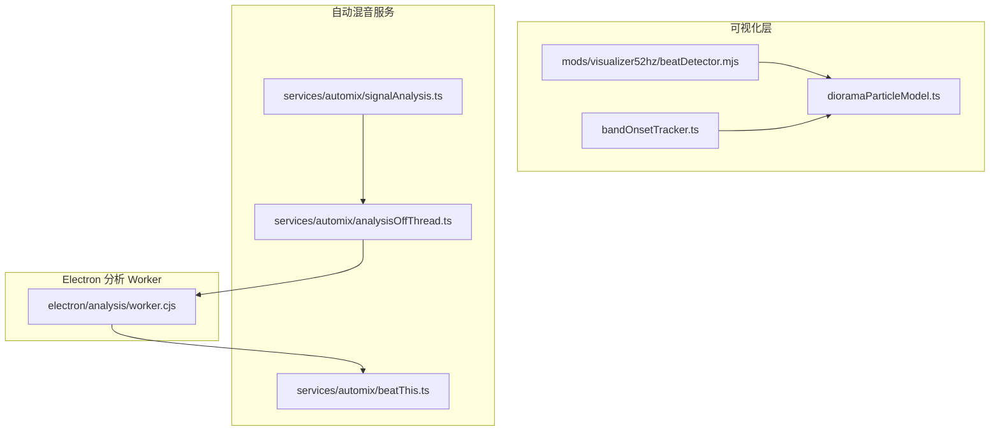
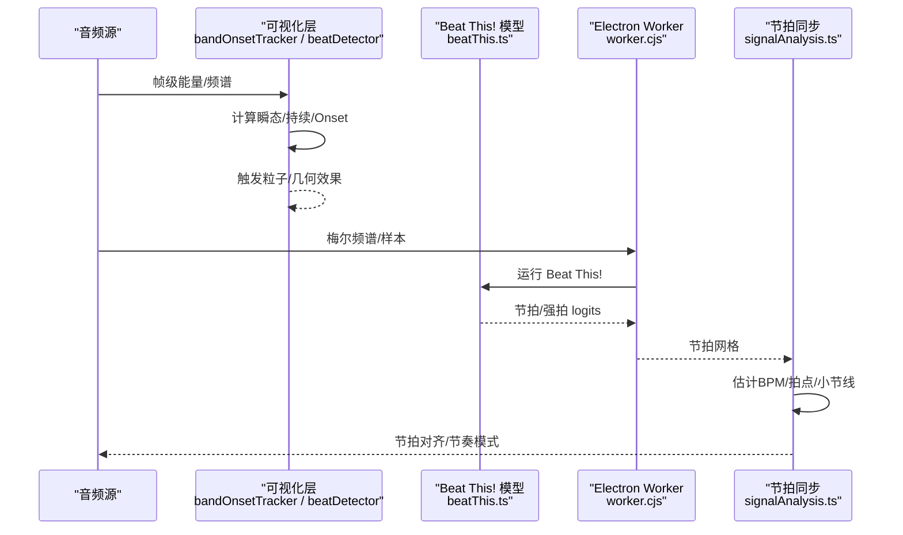
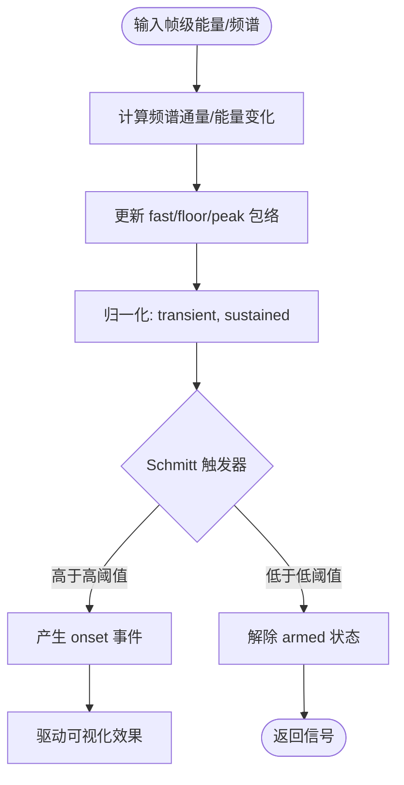
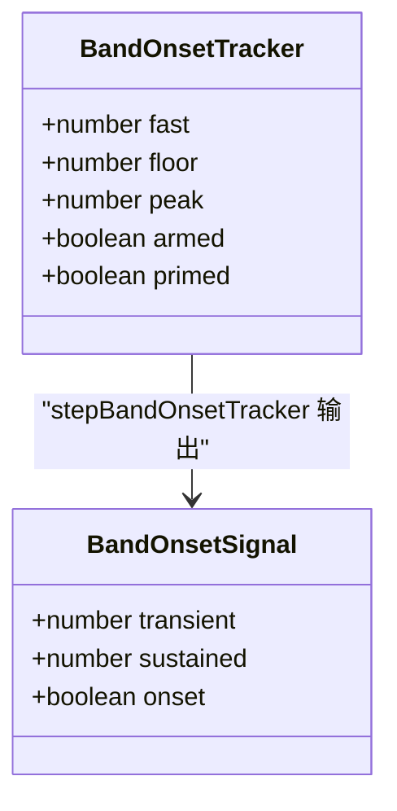
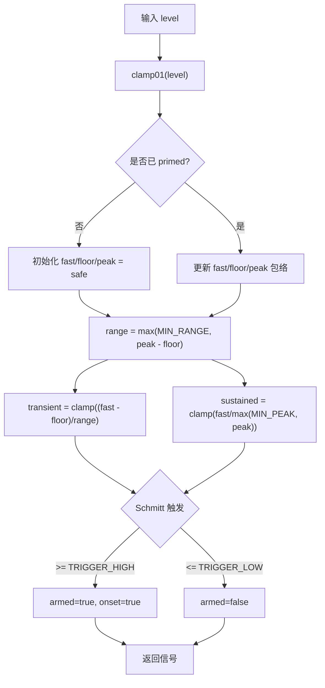
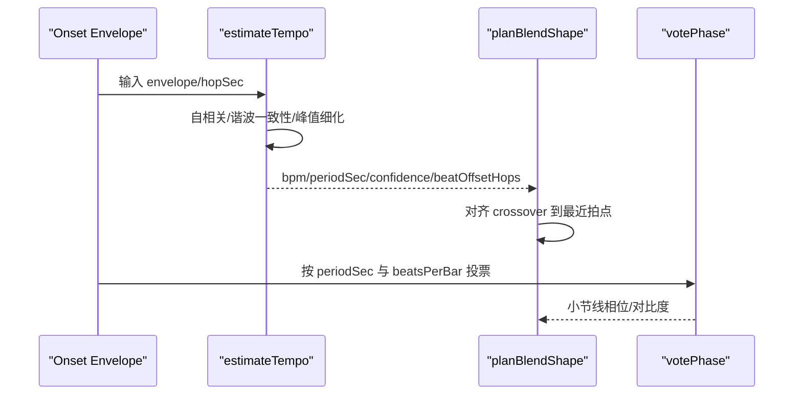
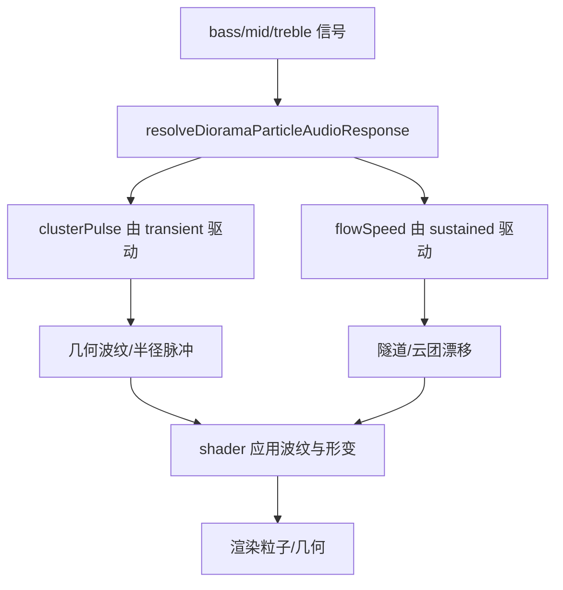
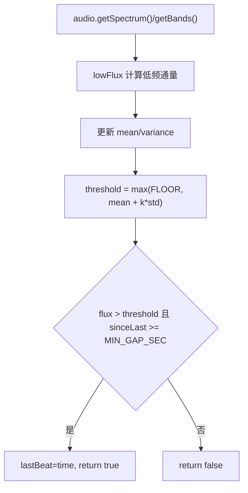
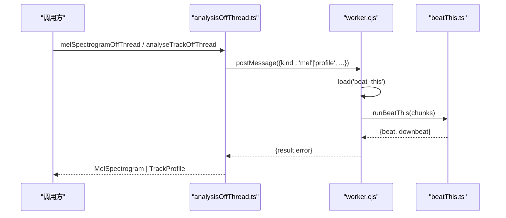
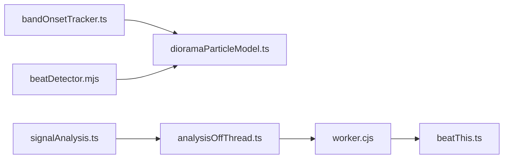

# 节拍检测

<cite>
**本文引用的文件**   
- [bandOnsetTracker.ts](file://src/components/visualizer/bandOnsetTracker.ts)
- [beatDetector.mjs](file://mods/visualizer52hz/beatDetector.mjs)
- [dioramaParticleModel.ts](file://src/components/visualizer/diorama/dioramaParticleModel.ts)
- [signalAnalysis.ts](file://src/services/automix/signalAnalysis.ts)
- [analysisOffThread.ts](file://src/services/automix/analysisOffThread.ts)
- [worker.cjs](file://electron/analysis/worker.cjs)
- [beatThis.ts](file://src/services/automix/beatThis.ts)
</cite>

## 目录
1. [简介](#简介)
2. [项目结构](#项目结构)
3. [核心组件](#核心组件)
4. [架构总览](#架构总览)
5. [详细组件分析](#详细组件分析)
6. [依赖关系分析](#依赖关系分析)
7. [性能与优化](#性能与优化)
8. [故障排查](#故障排查)
9. [结论](#结论)
10. [附录：调优参数与配置](#附录：调优参数与配置)

## 简介
本技术文档聚焦于仓库中的“节拍检测系统”，覆盖以下关键主题：
- onset detection（起音检测）算法原理：能量变化检测、频谱通量计算与瞬态识别。
- bandOnsetTracker 的实现机制：fast、floor、peak 三个信号的处理逻辑，以及 Schmitt trigger（迟滞比较器）。
- 节拍强度计算：transient（瞬态）与 sustained（持续）信号的分离、归一化与阈值判定。
- 节拍同步机制：tempo 估计、拍点对齐与节奏模式识别。
- 可视化应用：粒子效果触发、几何变形与颜色变化。
- 性能优化策略：异步处理、工作线程与内存优化。
- 调优参数与自定义配置方法。

## 项目结构
节拍检测相关代码分布在可视化层、自动混音服务与 Electron 侧的离线分析模块中：
- 可视化层提供通用的单频段起音检测器 bandOnsetTracker，并被 diorama 粒子模型复用。
- mods/visualizer52hz 提供一个轻量级低频频谱通量节拍检测器，用于该 mod 的涟漪效果。
- services/automix 提供基于自相关的 tempo 估计、拍点相位对齐与小节线识别。
- electron/analysis 与 src/services/automix 协作，将重型模型推理卸载到 worker 线程。

**图表来源**
- [bandOnsetTracker.ts:1-120](file://src/components/visualizer/bandOnsetTracker.ts#L1-L120)
- [dioramaParticleModel.ts:1-415](file://src/components/visualizer/diorama/dioramaParticleModel.ts#L1-L415)
- [beatDetector.mjs:1-74](file://mods/visualizer52hz/beatDetector.mjs#L1-L74)
- [signalAnalysis.ts:1-800](file://src/services/automix/signalAnalysis.ts#L1-L800)
- [analysisOffThread.ts:75-108](file://src/services/automix/analysisOffThread.ts#L75-L108)
- [worker.cjs:286-337](file://electron/analysis/worker.cjs#L286-L337)
- [beatThis.ts:160-449](file://src/services/automix/beatThis.ts#L160-L449)

**章节来源**
- [bandOnsetTracker.ts:1-120](file://src/components/visualizer/bandOnsetTracker.ts#L1-L120)
- [beatDetector.mjs:1-74](file://mods/visualizer52hz/beatDetector.mjs#L1-L74)
- [dioramaParticleModel.ts:1-415](file://src/components/visualizer/diorama/dioramaParticleModel.ts#L1-L415)
- [signalAnalysis.ts:1-800](file://src/services/automix/signalAnalysis.ts#L1-L800)
- [analysisOffThread.ts:75-108](file://src/services/automix/analysisOffThread.ts#L75-L108)
- [worker.cjs:286-337](file://electron/analysis/worker.cjs#L286-L337)
- [beatThis.ts:160-449](file://src/services/automix/beatThis.ts#L160-L449)

## 核心组件
- 通用单频段起音检测器：bandOnsetTracker，输出 transient、sustained 与 onset 事件。
- 轻量低频频谱通量节拍检测器：mods/visualizer52hz/beatDetector.mjs。
- 节拍同步与节奏模式识别：services/automix/signalAnalysis.ts。
- 模型驱动节拍网格：services/automix/beatThis.ts + electron/analysis/worker.cjs。
- 可视化响应：dioramaParticleModel.ts 使用 transient/sustained 驱动粒子运动与几何形变。

**章节来源**
- [bandOnsetTracker.ts:1-120](file://src/components/visualizer/bandOnsetTracker.ts#L1-L120)
- [beatDetector.mjs:1-74](file://mods/visualizer52hz/beatDetector.mjs#L1-L74)
- [signalAnalysis.ts:1-800](file://src/services/automix/signalAnalysis.ts#L1-L800)
- [beatThis.ts:160-449](file://src/services/automix/beatThis.ts#L160-L449)
- [dioramaParticleModel.ts:1-415](file://src/components/visualizer/diorama/dioramaParticleModel.ts#L1-L415)

## 架构总览
节拍检测在系统中分为两条路径：
- 实时可视化路径：对音频频带或低频 FFT 做能量变化检测，得到 onset 事件，驱动粒子与几何效果。
- 离线同步路径：对整轨进行频谱分析与节拍网格估计，得到 BPM、拍点与小节线，供自动混音与节奏对齐使用。

**图表来源**
- [bandOnsetTracker.ts:1-120](file://src/components/visualizer/bandOnsetTracker.ts#L1-L120)
- [beatDetector.mjs:1-74](file://mods/visualizer52hz/beatDetector.mjs#L1-L74)
- [beatThis.ts:160-449](file://src/services/automix/beatThis.ts#L160-L449)
- [worker.cjs:286-337](file://electron/analysis/worker.cjs#L286-L337)
- [signalAnalysis.ts:1-800](file://src/services/automix/signalAnalysis.ts#L1-L800)

## 详细组件分析

### 1. Onset Detection 算法原理
本节解释能量变化检测、频谱通量与瞬态识别如何在不同层级实现。

- 能量变化检测（bandOnsetTracker）
  - 通过 fast、floor、peak 三个非对称指数包络跟踪单频段能量。
  - transient = (fast - floor) / (peak - floor)，对动态范围归一化，保持响度不变性。
  - sustained = fast / peak，表示该频段在当前歌曲中的相对存在感。
  - onset 由 Schmitt trigger 产生：超过高阈值触发，回落到低阈值才重新准备。

- 频谱通量（spectral flux）
  - 仅统计上升部分，避免衰减拖尾造成 onset 被 sustain 掩盖。
  - 在 signalAnalysis.ts 中为整轨分析提供基础特征；在 beatDetector.mjs 中用于低频段实时节拍检测。

- 瞬态识别
  - bandOnsetTracker 通过 floor 缓慢上升、快速下降的特性，使瞬态高度稳定，不受稳态鼓点影响。
  - mods/visualizer52hz/beatDetector.mjs 使用低频 FFT 通量与自适应均值/方差阈值，结合最小间隔与最大间隔填充，保证安静段落也有节拍提示。

**图表来源**
- [bandOnsetTracker.ts:1-120](file://src/components/visualizer/bandOnsetTracker.ts#L1-L120)
- [signalAnalysis.ts:95-111](file://src/services/automix/signalAnalysis.ts#L95-L111)
- [beatDetector.mjs:24-73](file://mods/visualizer52hz/beatDetector.mjs#L24-L73)

**章节来源**
- [bandOnsetTracker.ts:1-120](file://src/components/visualizer/bandOnsetTracker.ts#L1-L120)
- [signalAnalysis.ts:95-111](file://src/services/automix/signalAnalysis.ts#L95-L111)
- [beatDetector.mjs:1-74](file://mods/visualizer52hz/beatDetector.mjs#L1-L74)

### 2. bandOnsetTracker 实现机制
bandOnsetTracker 是通用单频段起音检测器，核心包括：
- 非对称指数包络 stepEnvelopeToward：attack/release 速率不同，目标高于当前用 attack，否则 release。
- fast：快速响应瞬时能量变化。
- floor：缓慢上升、快速下降，捕捉谷值，避免被瞬态拉高。
- peak：快速上升、慢速下降，适应歌曲整体响度。
- transient 与 sustained 归一化：分别表达“这一击有多重”和“这个频段现在有多响”。
- Schmitt trigger：armed 状态在 transient >= TRIGGER_HIGH 时置位，在 transient <= TRIGGER_LOW 时复位，确保一次鼓点只触发一次 onset。

**图表来源**
- [bandOnsetTracker.ts:47-88](file://src/components/visualizer/bandOnsetTracker.ts#L47-L88)
- [bandOnsetTracker.ts:90-119](file://src/components/visualizer/bandOnsetTracker.ts#L90-L119)

**章节来源**
- [bandOnsetTracker.ts:1-120](file://src/components/visualizer/bandOnsetTracker.ts#L1-L120)

### 3. 节拍强度计算：transient 与 sustained 分离、归一化与阈值判定
- transient 计算：(fast - floor) / (peak - floor)，分母受 MIN_RANGE 保护，防止近静音频段放大噪声。
- sustained 计算：fast / MAX(MIN_PEAK, peak)，表示该频段相对于歌曲的整体存在感。
- 阈值判定：TRIGGER_HIGH 与 TRIGGER_LOW 构成迟滞区间，避免连发与抖动。
- 初始化：primed 标志确保首帧不出现全幅瞬态尖峰。

**图表来源**
- [bandOnsetTracker.ts:90-119](file://src/components/visualizer/bandOnsetTracker.ts#L90-L119)

**章节来源**
- [bandOnsetTracker.ts:1-120](file://src/components/visualizer/bandOnsetTracker.ts#L1-L120)

### 4. 节拍同步机制：tempo 估计、拍点对齐与节奏模式识别
- tempo 估计（estimateTempo）
  - 基于 onset-strength envelope 的自相关，搜索候选周期并加权谐波一致性。
  - 使用 tempoPrior 偏向常见 BPM（如 120），避免半倍/双倍误判。
  - 通过抛物线拟合与多倍周期细分提高周期精度。
  - 输出 bpm、periodSec、confidence 与 beatOffsetHops。

- 拍点对齐
  - 在 planBlendShape 中根据 nextBeatIn 与 periodSec 将 crossover 对齐到最近拍点。
  - BEAT_SNAP_TOLERANCE 允许一定容差范围。

- 节奏模式识别（小节线投票）
  - votePhase 对每个候选相位收集证据，使用中位数稳健估计。
  - DOWNBEAT_WINDOW_BARS 限制窗口长度，避免外推误差累积。
  - 对比度与绝对高度双重守卫，拒绝无意义结果。

**图表来源**
- [signalAnalysis.ts:165-309](file://src/services/automix/signalAnalysis.ts#L165-L309)
- [signalAnalysis.ts:371-391](file://src/services/automix/signalAnalysis.ts#L371-L391)
- [signalAnalysis.ts:687-788](file://src/services/automix/signalAnalysis.ts#L687-L788)

**章节来源**
- [signalAnalysis.ts:1-800](file://src/services/automix/signalAnalysis.ts#L1-L800)

### 5. 可视化应用：粒子效果触发、几何变形与颜色变化
- 粒子漂移与脉冲
  - resolveDioramaParticleAudioResponse 将 bass.sustained 映射为 flowSpeed，bass.transient/mid.transient 映射为 clusterPulse。
  - 脉冲幅度较小，避免整体缩放掩盖波场运动。

- 几何形变
  - RIPPLE_BANDS 定义不同频段的波纹强度、速度与波长请求。
  - shader 根据实际 lattice spacing 限制最高波数，避免混叠。

- 颜色变化
  - 其他可视化组件（如 GeometricBackground、Claddagh）根据能量与 onsets 调整颜色与透明度。

**图表来源**
- [dioramaParticleModel.ts:306-357](file://src/components/visualizer/diorama/dioramaParticleModel.ts#L306-L357)
- [dioramaParticleModel.ts:377-381](file://src/components/visualizer/diorama/dioramaParticleModel.ts#L377-L381)

**章节来源**
- [dioramaParticleModel.ts:1-415](file://src/components/visualizer/diorama/dioramaParticleModel.ts#L1-L415)

### 6. 轻量节拍检测器（mods/visualizer52hz）
- 低频频谱通量 lowFlux：优先使用 FFT 低频 bins，回退到 bands.bass/lowMid。
- 自适应阈值：mean + k * std，k 随 sensitivity 调整。
- 最小间隔 MIN_GAP_SEC 与最大间隔 MAX_GAP_SEC：控制最快节拍与最长静默填充。
- reset/step 接口：支持外部循环调用。

**图表来源**
- [beatDetector.mjs:24-73](file://mods/visualizer52hz/beatDetector.mjs#L24-L73)

**章节来源**
- [beatDetector.mjs:1-74](file://mods/visualizer52hz/beatDetector.mjs#L1-L74)

### 7. 模型驱动节拍网格（Beat This!）
- 离线分析流程：melSpectrogram -> splitForModel -> runBeatThis -> analyseBeatGrid。
- worker.cjs 负责加载 ONNX 模型、校验 chunk 形状、执行推理并返回 beat/downbeat logits。
- beatThis.ts 负责 logits 转节拍网格：局部峰值选择、去重、downbeat 子集提取。

**图表来源**
- [analysisOffThread.ts:75-108](file://src/services/automix/analysisOffThread.ts#L75-L108)
- [worker.cjs:286-337](file://electron/analysis/worker.cjs#L286-L337)
- [beatThis.ts:160-449](file://src/services/automix/beatThis.ts#L160-L449)

**章节来源**
- [analysisOffThread.ts:75-108](file://src/services/automix/analysisOffThread.ts#L75-L108)
- [worker.cjs:286-337](file://electron/analysis/worker.cjs#L286-L337)
- [beatThis.ts:160-449](file://src/services/automix/beatThis.ts#L160-L449)

## 依赖关系分析
- bandOnsetTracker 被 dioramaParticleModel 复用，提供一致的 transient/sustained/onset 口径。
- mods/visualizer52hz/beatDetector 独立于 bandOnsetTracker，专为该 mod 的低频节拍需求设计。
- signalAnalysis 提供纯函数式节拍同步工具，不依赖音频设备。
- analysisOffThread 与 worker.cjs 协作，将重型模型推理从主线程卸载。
- beatThis.ts 与 worker.cjs 共同实现 Beat This! 的节拍网格生成。

**图表来源**
- [bandOnsetTracker.ts:1-120](file://src/components/visualizer/bandOnsetTracker.ts#L1-L120)
- [dioramaParticleModel.ts:1-415](file://src/components/visualizer/diorama/dioramaParticleModel.ts#L1-L415)
- [beatDetector.mjs:1-74](file://mods/visualizer52hz/beatDetector.mjs#L1-L74)
- [signalAnalysis.ts:1-800](file://src/services/automix/signalAnalysis.ts#L1-L800)
- [analysisOffThread.ts:75-108](file://src/services/automix/analysisOffThread.ts#L75-L108)
- [worker.cjs:286-337](file://electron/analysis/worker.cjs#L286-L337)
- [beatThis.ts:160-449](file://src/services/automix/beatThis.ts#L160-L449)

**章节来源**
- [bandOnsetTracker.ts:1-120](file://src/components/visualizer/bandOnsetTracker.ts#L1-L120)
- [dioramaParticleModel.ts:1-415](file://src/components/visualizer/diorama/dioramaParticleModel.ts#L1-L415)
- [beatDetector.mjs:1-74](file://mods/visualizer52hz/beatDetector.mjs#L1-L74)
- [signalAnalysis.ts:1-800](file://src/services/automix/signalAnalysis.ts#L1-L800)
- [analysisOffThread.ts:75-108](file://src/services/automix/analysisOffThread.ts#L75-L108)
- [worker.cjs:286-337](file://electron/analysis/worker.cjs#L286-L337)
- [beatThis.ts:160-449](file://src/services/automix/beatThis.ts#L160-L449)

## 性能与优化
- 异步处理
  - analysisOffThread.ts 通过 worker.postMessage 将梅尔频谱与轨道分析任务发送到 Electron worker，避免阻塞主线程。
  - 失败路径回退到浏览器端实现，保证兼容性。

- 工作线程使用
  - worker.cjs 加载 ONNX 模型并执行 Beat This! 推理，限制 chunk 大小以规避原生运行时限制。
  - 结构化克隆失败时主动 decline 并记录原因，便于调试。

- 内存优化
  - bandOnsetTracker 使用 TypedArray 与固定大小的状态对象，避免频繁分配。
  - dioramaParticleModel 预分配 Float32Array 缓冲区，减少 GPU/CPU 间拷贝。
  - spectralFlux 仅累加上升部分，降低无效计算。

- 实时性保障
  - bandOnsetTracker 的包络更新使用指数平滑，时间常数与 delta 解耦，保证不同帧率下行为一致。
  - mods/visualizer52hz/beatDetector 使用指数均值/方差，alpha 由 dt 决定，避免硬编码帧率。

**章节来源**
- [analysisOffThread.ts:75-108](file://src/services/automix/analysisOffThread.ts#L75-L108)
- [worker.cjs:286-337](file://electron/analysis/worker.cjs#L286-L337)
- [bandOnsetTracker.ts:1-120](file://src/components/visualizer/bandOnsetTracker.ts#L1-L120)
- [dioramaParticleModel.ts:1-415](file://src/components/visualizer/diorama/dioramaParticleModel.ts#L1-L415)
- [signalAnalysis.ts:95-111](file://src/services/automix/signalAnalysis.ts#L95-L111)
- [beatDetector.mjs:1-74](file://mods/visualizer52hz/beatDetector.mjs#L1-L74)

## 故障排查
- 无节拍输出
  - 检查 bandOnsetTracker 的 TRIGGER_HIGH/TRIGGER_LOW 是否过高/过低。
  - 确认 MIN_RANGE/MIN_PEAK 未导致归一化失效。
  - 对于 mods/visualizer52hz，检查 LOW_BIN_START/LOW_BIN_END 与宿主 FFT 尺寸匹配。

- 节拍过密或漏拍
  - 调整 MIN_GAP_SEC/MAX_GAP_SEC 控制最小/最大间隔。
  - 调整 sensitivity 改变阈值敏感度。

- 节拍网格错误
  - 检查 estimateTempo 的 MIN_TEMPO_CONFIDENCE 与 TEMPO_HARMONICS。
  - 确认 votePhase 的 DOWNBEAT_WINDOW_BARS 足够短以避免外推误差。

- Worker 推理失败
  - 查看 worker.cjs 的 decline 日志，确认 chunk 形状与 frames 范围。
  - 确认 canRunBeatThis 与环境支持。

**章节来源**
- [bandOnsetTracker.ts:60-88](file://src/components/visualizer/bandOnsetTracker.ts#L60-L88)
- [beatDetector.mjs:10-15](file://mods/visualizer52hz/beatDetector.mjs#L10-L15)
- [signalAnalysis.ts:6-10](file://src/services/automix/signalAnalysis.ts#L6-L10)
- [signalAnalysis.ts:131-147](file://src/services/automix/signalAnalysis.ts#L131-L147)
- [signalAnalysis.ts:687-788](file://src/services/automix/signalAnalysis.ts#L687-L788)
- [worker.cjs:296-337](file://electron/analysis/worker.cjs#L296-L337)

## 结论
本节拍检测系统在可视化层与自动混音服务之间形成了清晰的职责划分：
- 可视化层使用 bandOnsetTracker 与轻量 beatDetector 提供实时 onset 事件，驱动粒子与几何效果。
- 自动混音服务使用 signalAnalysis 与 Beat This! 模型提供稳定的 tempo、拍点与小节线估计。
- 通过异步与 worker 机制，重型计算被卸载，保证主线程流畅。
- 参数体系完善，便于针对不同音乐风格与可视化需求进行调优。

## 附录：调优参数与配置
- bandOnsetTracker
  - FAST_ATTACK/FAST_RELEASE：瞬态包络响应速度。
  - FLOOR_RISE/FLOOR_FALL：谷底包络上升/下降速率。
  - PEAK_RISE/PEAK_FALL：峰值包络上升/下降速率。
  - MIN_RANGE/MIN_PEAK：归一化下限，防止近静音放大噪声。
  - TRIGGER_HIGH/TRIGGER_LOW：Schmitt trigger 迟滞阈值。

- mods/visualizer52hz/beatDetector
  - LOW_BIN_START/LOW_BIN_END：低频 FFT bins 范围。
  - TRACK_SEC：自适应阈值跟踪时间常数。
  - MIN_GAP_SEC/MAX_GAP_SEC：最小/最大节拍间隔。
  - FLOOR：通量阈值地板。
  - sensitivity：灵敏度系数，越大越敏感。

- signalAnalysis
  - MIN_BPM/MAX_BPM：可搜索 BPM 范围。
  - MIN_TEMPO_CONFIDENCE：最低置信度阈值。
  - TEMPO_HARMONICS：谐波一致性倍数。
  - PHASE_BEATS/DOWNBEAT_WINDOW_BARS：相位与小节线投票窗口。
  - BEAT_SNAP_TOLERANCE：拍点对齐容差。

- Beat This!
  - MAX_CHUNK_FRAMES：单次推理最大帧数。
  - MEL_BANDS：梅尔频谱带宽。

**章节来源**
- [bandOnsetTracker.ts:60-88](file://src/components/visualizer/bandOnsetTracker.ts#L60-L88)
- [beatDetector.mjs:10-15](file://mods/visualizer52hz/beatDetector.mjs#L10-L15)
- [signalAnalysis.ts:6-10](file://src/services/automix/signalAnalysis.ts#L6-L10)
- [signalAnalysis.ts:131-147](file://src/services/automix/signalAnalysis.ts#L131-L147)
- [signalAnalysis.ts:149-155](file://src/services/automix/signalAnalysis.ts#L149-L155)
- [signalAnalysis.ts:27-28](file://src/services/automix/signalAnalysis.ts#L27-L28)
- [worker.cjs:292-295](file://electron/analysis/worker.cjs#L292-L295)