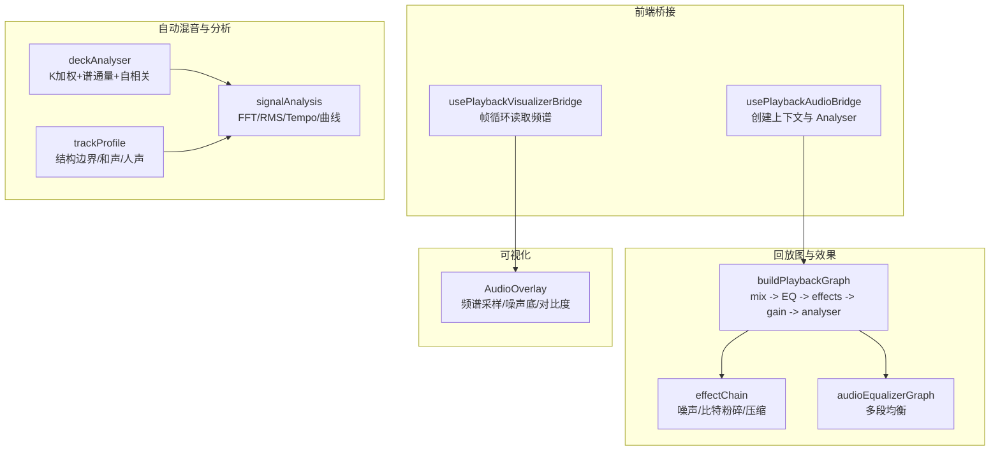
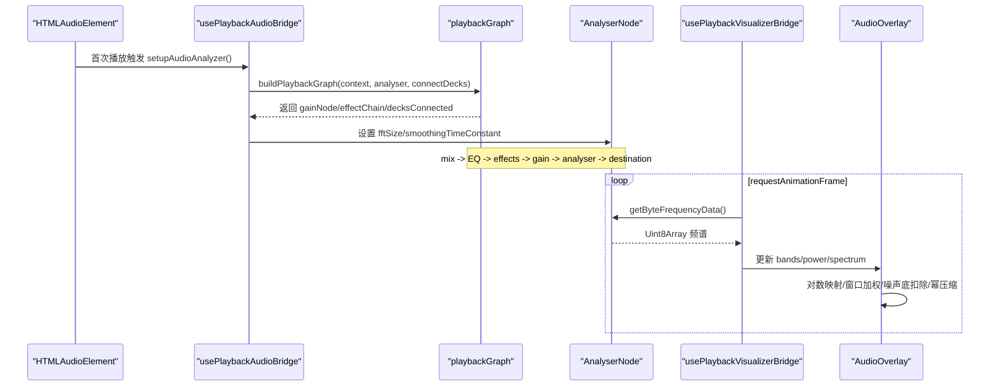
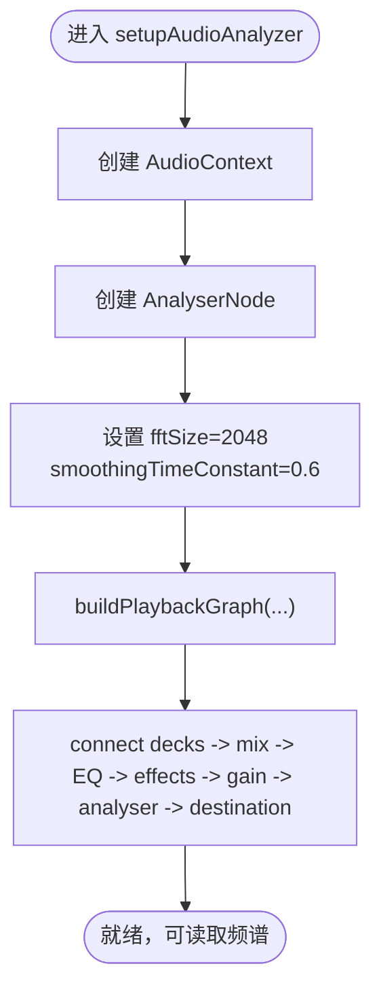
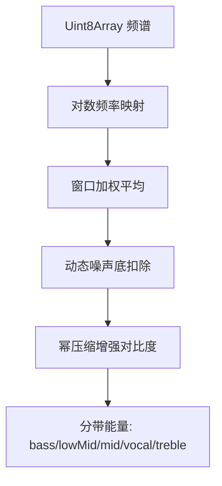
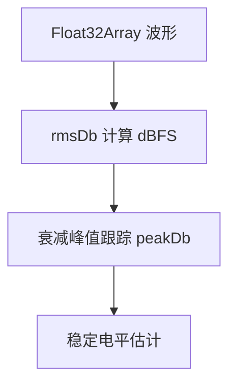
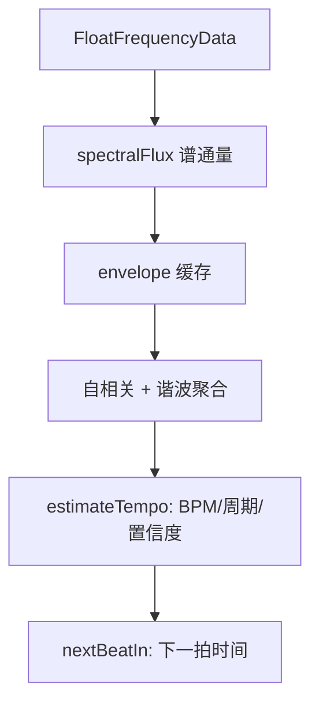
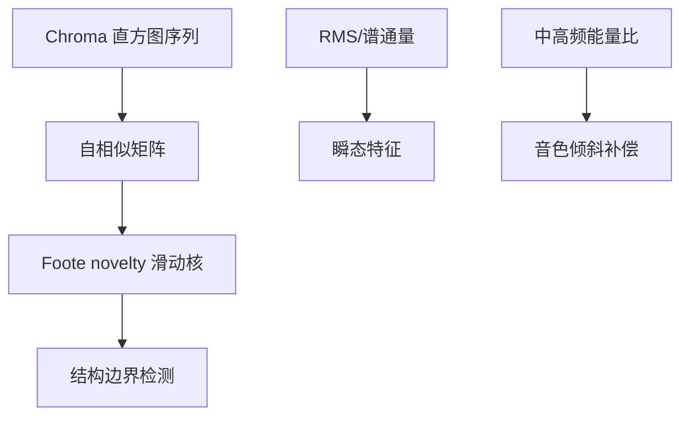
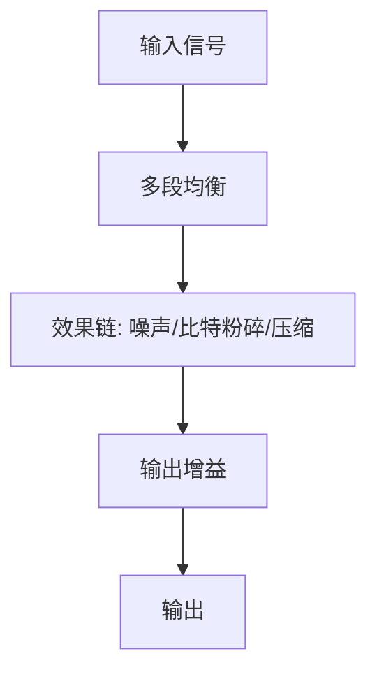
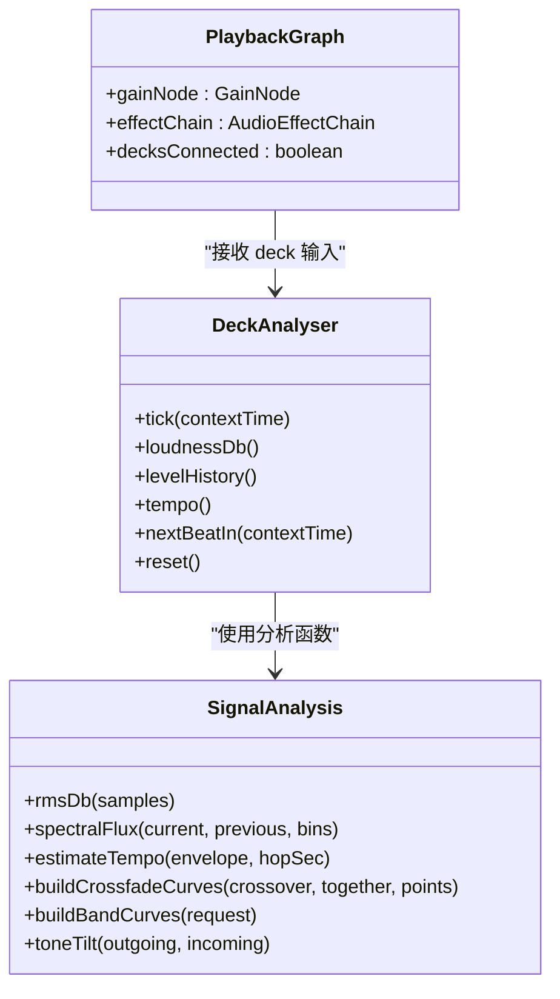
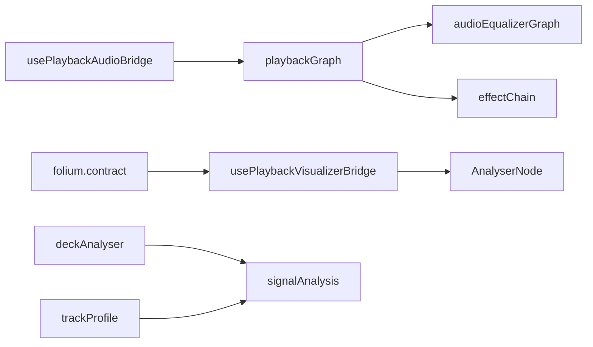

# 音频数据分析

<cite>
**本文引用的文件**   
- [usePlaybackAudioBridge.ts](file://src/hooks/usePlaybackAudioBridge.ts)
- [playbackGraph.ts](file://src/services/playbackGraph.ts)
- [deckAnalyser.ts](file://src/services/automix/deckAnalyser.ts)
- [signalAnalysis.ts](file://src/services/automix/signalAnalysis.ts)
- [trackProfile.ts](file://src/services/automix/trackProfile.ts)
- [usePlaybackVisualizerBridge.ts](file://src/hooks/usePlaybackVisualizerBridge.ts)
- [AudioOverlay.tsx](file://src/components/visualizer/monet/AudioOverlay.tsx)
- [effectChain.ts](file://src/services/audioEffects/effectChain.ts)
- [effectNodes.ts](file://src/services/audioEffects/effectNodes.ts)
- [noiseBranch.ts](file://src/services/audioEffects/noiseBranch.ts)
- [audioEqualizerGraph.ts](file://src/services/audioEqualizerGraph.ts)
- [contract.ts](file://src/mods/folium/contract.ts)
</cite>

## 目录
1. [简介](#简介)
2. [项目结构](#项目结构)
3. [核心组件](#核心组件)
4. [架构总览](#架构总览)
5. [详细组件分析](#详细组件分析)
6. [依赖关系分析](#依赖关系分析)
7. [性能与实时性](#性能与实时性)
8. [故障排查指南](#故障排查指南)
9. [结论](#结论)
10. [附录：可视化数据映射与渲染优化](#附录可视化数据映射与渲染优化)

## 简介
本技术文档围绕仓库中的实时音频数据分析系统，系统性说明 Web Audio API 的使用方式、频域与时域分析方法、节拍检测与节奏对齐、音频特征提取、预处理链路以及可视化数据映射。重点覆盖以下方面：
- Web Audio API 中 AnalyserNode 的配置、FFT 参数和数据读取路径
- 频域分析：频谱图生成、频率分带、能量分布计算与峰值处理
- 时域分析：波形采样、包络跟踪、过零检测思路与振幅统计
- 节拍检测：onset detection、节奏分析与 tempo 估计
- 音频特征：音色分析、谐波结构与瞬态特征
- 预处理：降噪、均衡化与动态范围压缩
- 实时性保证：异步处理、工作线程使用与性能优化策略
- 可视化：从音频特征到渲染的映射方法与优化技巧

## 项目结构
本项目在浏览器端通过 React Hook 管理播放与可视化桥接，在服务层实现自动混音、信号分析与轨道画像，同时在效果链与均衡器中提供音频预处理能力。关键模块分布如下：
- 播放与可视化桥接：hooks 层负责 AudioContext、AnalyserNode 生命周期与帧循环
- 回放图构建：services/playbackGraph.ts 定义节点顺序与连接拓扑
- 自动混音与分析：services/automix/* 提供节拍、节奏、音色等算法
- 可视化渲染：components/visualizer/* 将频域/能级数据映射为图形
- 效果与均衡：services/audioEffects/* 与 audioEqualizerGraph.ts 提供降噪、均衡与压缩

图示来源
- [usePlaybackAudioBridge.ts:133-164](file://src/hooks/usePlaybackAudioBridge.ts#L133-L164)
- [playbackGraph.ts:31-97](file://src/services/playbackGraph.ts#L31-L97)
- [deckAnalyser.ts:63-95](file://src/services/automix/deckAnalyser.ts#L63-L95)
- [signalAnalysis.ts:40-111](file://src/services/automix/signalAnalysis.ts#L40-L111)
- [trackProfile.ts:389-418](file://src/services/automix/trackProfile.ts#L389-L418)
- [usePlaybackVisualizerBridge.ts:77-131](file://src/hooks/usePlaybackVisualizerBridge.ts#L77-L131)
- [AudioOverlay.tsx:56-87](file://src/components/visualizer/monet/AudioOverlay.tsx#L56-L87)

章节来源
- [usePlaybackAudioBridge.ts:133-164](file://src/hooks/usePlaybackAudioBridge.ts#L133-L164)
- [playbackGraph.ts:31-97](file://src/services/playbackGraph.ts#L31-L97)

## 核心组件
- 播放音频桥接：负责 AudioContext 初始化、AnalyserNode 配置、回放图构建、ReplayGain 应用与音量同步
- 回放图构建：统一混音点、均衡器、效果链、输出增益与 Analyser 的顺序，确保可视化与听感一致
- 节拍与节奏分析：对每副唱机（deck）进行 K 加权、谱通量、包络缓存、自相关 tempo 估计与节拍相位预测
- 轨道画像：基于 chroma 自相似性与 Foote novelty 的结构边界检测、人声起始定位、结尾 tempo 重估
- 可视化桥接：requestAnimationFrame 驱动，读取频谱并计算频段能量，更新运动信号供 UI 消费
- 可视化渲染：对原始频谱进行对数映射、窗口加权、动态噪声底扣除与幂压缩，提升视觉对比度
- 效果与均衡：高通/低通滤波、压缩器阈值/比率/膝部调节、噪声分支与多段均衡

章节来源
- [usePlaybackAudioBridge.ts:133-164](file://src/hooks/usePlaybackAudioBridge.ts#L133-L164)
- [playbackGraph.ts:31-97](file://src/services/playbackGraph.ts#L31-L97)
- [deckAnalyser.ts:63-175](file://src/services/automix/deckAnalyser.ts#L63-L175)
- [signalAnalysis.ts:40-111](file://src/services/automix/signalAnalysis.ts#L40-L111)
- [trackProfile.ts:389-418](file://src/services/automix/trackProfile.ts#L389-L418)
- [usePlaybackVisualizerBridge.ts:77-131](file://src/hooks/usePlaybackVisualizerBridge.ts#L77-L131)
- [AudioOverlay.tsx:56-87](file://src/components/visualizer/monet/AudioOverlay.tsx#L56-L87)
- [effectChain.ts:51-76](file://src/services/audioEffects/effectChain.ts#L51-L76)
- [effectNodes.ts:29-35](file://src/services/audioEffects/effectNodes.ts#L29-L35)
- [noiseBranch.ts:34-35](file://src/services/audioEffects/noiseBranch.ts#L34-L35)
- [audioEqualizerGraph.ts:28-28](file://src/services/audioEqualizerGraph.ts#L28-L28)

## 架构总览
下图展示从音频源到可视化的完整数据流，包括自动混音侧的分析路径与主链路的回放图顺序。

图示来源
- [usePlaybackAudioBridge.ts:133-164](file://src/hooks/usePlaybackAudioBridge.ts#L133-L164)
- [playbackGraph.ts:31-97](file://src/services/playbackGraph.ts#L31-L97)
- [usePlaybackVisualizerBridge.ts:77-131](file://src/hooks/usePlaybackVisualizerBridge.ts#L77-L131)
- [AudioOverlay.tsx:56-87](file://src/components/visualizer/monet/AudioOverlay.tsx#L56-L87)

## 详细组件分析

### Web Audio API 与 AnalyserNode 配置
- 上下文与 Analyser 创建：在首次播放后创建 AudioContext 与 AnalyserNode，设置 FFT 大小与平滑常数
- 回放图顺序：mix -> 均衡器 -> 效果链 -> 输出增益 -> Analyser -> 输出，确保可视化反映最终听感
- 数据读取：可视化桥接在帧循环中调用 getByteFrequencyData 获取频谱；自动混音侧使用 getFloatTimeDomainData 与 FloatFrequencyData 进行高精度分析

图示来源
- [usePlaybackAudioBridge.ts:133-164](file://src/hooks/usePlaybackAudioBridge.ts#L133-L164)
- [playbackGraph.ts:31-97](file://src/services/playbackGraph.ts#L31-L97)

章节来源
- [usePlaybackAudioBridge.ts:133-164](file://src/hooks/usePlaybackAudioBridge.ts#L133-L164)
- [playbackGraph.ts:31-97](file://src/services/playbackGraph.ts#L31-L97)

### 频域分析：频谱图、频率分带与能量分布
- 频谱图生成：AnalyserNode 提供 FFT 幅度数据，可视化层将其映射到对数频率轴并进行窗口加权平均
- 频率分带：按 20–150Hz、150–400Hz、400–1200Hz、1000–3500Hz、3500–12000Hz 计算各频段能量
- 能量分布与峰值增强：对归一化值进行幂压缩以提升对比度，低频段采用更高的压缩指数以抑制底噪
- 动态噪声底：根据频率位置自适应扣除噪声底，避免低频嗡鸣影响视觉峰值

图示来源
- [usePlaybackVisualizerBridge.ts:87-131](file://src/hooks/usePlaybackVisualizerBridge.ts#L87-L131)
- [AudioOverlay.tsx:56-87](file://src/components/visualizer/monet/AudioOverlay.tsx#L56-L87)

章节来源
- [usePlaybackVisualizerBridge.ts:87-131](file://src/hooks/usePlaybackVisualizerBridge.ts#L87-L131)
- [AudioOverlay.tsx:56-87](file://src/components/visualizer/monet/AudioOverlay.tsx#L56-L87)

### 时域分析：波形、包络、过零与振幅统计
- 波形采样：自动混音侧使用 getFloatTimeDomainData 获取浮点波形样本
- RMS 与包络：rmsDb 计算每帧 dBFS 能量；peakDb 采用衰减峰值跟踪，避免静默段落拉低平衡
- 过零检测：代码未直接实现过零计数，但提供了 RMS 与谱通量作为瞬态与能量的基础
- 振幅统计：SILENCE_DB 作为数字静音下限，结合 RMS 与峰值形成稳定的电平估计

图示来源
- [deckAnalyser.ts:118-138](file://src/services/automix/deckAnalyser.ts#L118-L138)
- [signalAnalysis.ts:40-51](file://src/services/automix/signalAnalysis.ts#L40-L51)

章节来源
- [deckAnalyser.ts:118-138](file://src/services/automix/deckAnalyser.ts#L118-L138)
- [signalAnalysis.ts:40-51](file://src/services/automix/signalAnalysis.ts#L40-L51)

### 节拍检测：Onset Detection、节奏分析与 Tempo 估计
- Onset 检测：spectralFlux 计算相邻帧频谱能量增量，仅累加上升部分以避免衰减拖尾
- 包络缓存：每帧谱通量写入 envelope，限制长度 ENVELOPE_SIZE 以保留最近历史
- Tempo 估计：estimateTempo 对包络做半波整流与自相关，考虑谐波叠加与先验权重，得到 BPM、周期与节拍相位
- 节拍网格：nextBeatIn 基于估计周期与偏移推算下一拍时间，用于混音过渡的对齐

图示来源
- [deckAnalyser.ts:118-145](file://src/services/automix/deckAnalyser.ts#L118-L145)
- [signalAnalysis.ts:95-111](file://src/services/automix/signalAnalysis.ts#L95-L111)
- [signalAnalysis.ts:165-309](file://src/services/automix/signalAnalysis.ts#L165-L309)

章节来源
- [deckAnalyser.ts:118-145](file://src/services/automix/deckAnalyser.ts#L118-L145)
- [signalAnalysis.ts:95-111](file://src/services/automix/signalAnalysis.ts#L95-L111)
- [signalAnalysis.ts:165-309](file://src/services/automix/signalAnalysis.ts#L165-L309)

### 音频特征提取：音色、谐波结构与瞬态
- 音色分析：toneTilt 比较出/入曲目的中高频能量比例，计算倾斜补偿以匹配音色
- 谐波结构：trackProfile 使用 chroma 自相似矩阵与 Foote novelty 检测结构边界
- 瞬态特征：spectralFlux 与 rmsDb 提供瞬态与能量基础，配合 K 加权使响度感知一致
- 人声起始：VOCAL_RISE 阈值与最小持续时间检测人声出现时刻

图示来源
- [trackProfile.ts:389-418](file://src/services/automix/trackProfile.ts#L389-L418)
- [signalAnalysis.ts:576-596](file://src/services/automix/signalAnalysis.ts#L576-L596)
- [signalAnalysis.ts:40-111](file://src/services/automix/signalAnalysis.ts#L40-L111)

章节来源
- [trackProfile.ts:389-418](file://src/services/automix/trackProfile.ts#L389-L418)
- [signalAnalysis.ts:576-596](file://src/services/automix/signalAnalysis.ts#L576-L596)
- [signalAnalysis.ts:40-111](file://src/services/automix/signalAnalysis.ts#L40-L111)

### 音频预处理：降噪、均衡化与动态范围压缩
- 降噪：noiseBranch 提供带通滤波分支模拟黑胶噪声，effectChain 控制其开关
- 均衡化：audioEqualizerGraph 构建多段 BiquadFilterNode，支持用户设置
- 动态范围压缩：effectChain 中压缩器的阈值、比率与膝部随“Punch”效果参数变化
- 高通/低通：effectNodes 提供基础滤波器，用于去低频轰鸣或高频滚降

图示来源
- [effectChain.ts:51-76](file://src/services/audioEffects/effectChain.ts#L51-L76)
- [effectNodes.ts:29-35](file://src/services/audioEffects/effectNodes.ts#L29-L35)
- [noiseBranch.ts:34-35](file://src/services/audioEffects/noiseBranch.ts#L34-L35)
- [audioEqualizerGraph.ts:28-28](file://src/services/audioEqualizerGraph.ts#L28-L28)

章节来源
- [effectChain.ts:51-76](file://src/services/audioEffects/effectChain.ts#L51-L76)
- [effectNodes.ts:29-35](file://src/services/audioEffects/effectNodes.ts#L29-L35)
- [noiseBranch.ts:34-35](file://src/services/audioEffects/noiseBranch.ts#L34-L35)
- [audioEqualizerGraph.ts:28-28](file://src/services/audioEqualizerGraph.ts#L28-L28)

### 自动混音与回放图时序
- 混音点：两个 deck 接入共享 mix 节点，EQ 与效果链只存在一份，避免混音过程中音色跳变
- 体积控制：gainNode 置于效果链之后，确保音量控制作用于最终听感
- 可视化一致性：Analyser 位于最后，捕获包含音量与效果的真实输出

图示来源
- [playbackGraph.ts:31-97](file://src/services/playbackGraph.ts#L31-L97)
- [deckAnalyser.ts:63-175](file://src/services/automix/deckAnalyser.ts#L63-L175)
- [signalAnalysis.ts:435-469](file://src/services/automix/signalAnalysis.ts#L435-L469)
- [signalAnalysis.ts:539-574](file://src/services/automix/signalAnalysis.ts#L539-L574)
- [signalAnalysis.ts:584-596](file://src/services/automix/signalAnalysis.ts#L584-L596)

章节来源
- [playbackGraph.ts:31-97](file://src/services/playbackGraph.ts#L31-L97)
- [deckAnalyser.ts:63-175](file://src/services/automix/deckAnalyser.ts#L63-L175)
- [signalAnalysis.ts:435-469](file://src/services/automix/signalAnalysis.ts#L435-L469)
- [signalAnalysis.ts:539-574](file://src/services/automix/signalAnalysis.ts#L539-L574)
- [signalAnalysis.ts:584-596](file://src/services/automix/signalAnalysis.ts#L584-L596)

## 依赖关系分析
- 模块耦合：
  - usePlaybackAudioBridge 依赖 playbackGraph 与 effectChain/audioEqualizerGraph
  - usePlaybackVisualizerBridge 依赖 motionSignals 与 AnalyserNode
  - deckAnalyser 依赖 signalAnalysis 提供的 RMS、谱通量与 tempo 估计
  - trackProfile 依赖 chroma 与 novelty 算法（由 signalAnalysis 与外部工具支撑）
- 外部接口：
  - Folium 合约暴露音频能量、频段与原始频谱，供扩展可视化消费

图示来源
- [usePlaybackAudioBridge.ts:133-164](file://src/hooks/usePlaybackAudioBridge.ts#L133-L164)
- [playbackGraph.ts:31-97](file://src/services/playbackGraph.ts#L31-L97)
- [usePlaybackVisualizerBridge.ts:77-131](file://src/hooks/usePlaybackVisualizerBridge.ts#L77-L131)
- [deckAnalyser.ts:63-175](file://src/services/automix/deckAnalyser.ts#L63-L175)
- [signalAnalysis.ts:40-111](file://src/services/automix/signalAnalysis.ts#L40-L111)
- [contract.ts:364-376](file://src/mods/folium/contract.ts#L364-L376)

章节来源
- [usePlaybackAudioBridge.ts:133-164](file://src/hooks/usePlaybackAudioBridge.ts#L133-L164)
- [playbackGraph.ts:31-97](file://src/services/playbackGraph.ts#L31-L97)
- [usePlaybackVisualizerBridge.ts:77-131](file://src/hooks/usePlaybackVisualizerBridge.ts#L77-L131)
- [deckAnalyser.ts:63-175](file://src/services/automix/deckAnalyser.ts#L63-L175)
- [signalAnalysis.ts:40-111](file://src/services/automix/signalAnalysis.ts#L40-L111)
- [contract.ts:364-376](file://src/mods/folium/contract.ts#L364-L376)

## 性能与实时性
- 帧循环与节流：
  - 使用 requestAnimationFrame 驱动可视化更新，避免阻塞主线程
  - 仅在存在可听信号时读取频谱，过渡期间保持可视化连续性
- 数据复用与轻量计算：
  - 频谱数组每次分配新 Uint8Array，注意在高负载场景下可复用缓冲以降低 GC 压力
  - 频段能量计算采用简单求和与均值，复杂度 O(N)，适合实时
- 分析缓存：
  - tempo 估计结果缓存 TEMPO_REFRESH_SEC，减少自相关开销
  - envelope 长度受限 ENVELOPE_SIZE，避免无限增长
- 工作线程建议：
  - 当前分析在主线程执行；若需更高吞吐，可将重型离线分析（如 trackProfile）移至 Worker，并通过 postMessage 传递结果
- 渲染优化：
  - 对频谱进行对数映射与窗口加权，减少高频抖动
  - 动态噪声底与幂压缩提升对比度，降低后续着色器或 Canvas 绘制负担

章节来源
- [usePlaybackVisualizerBridge.ts:77-131](file://src/hooks/usePlaybackVisualizerBridge.ts#L77-L131)
- [deckAnalyser.ts:18-38](file://src/services/automix/deckAnalyser.ts#L18-L38)
- [signalAnalysis.ts:165-309](file://src/services/automix/signalAnalysis.ts#L165-L309)
- [AudioOverlay.tsx:56-87](file://src/components/visualizer/monet/AudioOverlay.tsx#L56-L87)

## 故障排查指南
- 无音频输出或可视化不更新：
  - 检查 AudioContext 是否成功创建，AnalyserNode 是否已连接至 destination
  - 确认回放图顺序是否正确，gainNode 是否在效果链之后
- 节拍估计不稳定：
  - 检查谱通量是否有效，envelope 是否有足够长度
  - 确认 hopSec 非零且连续，避免长时间停顿导致 continuity 标记失效
- 音色切换突兀：
  - 检查 toneTilt 是否启用，mid/top 倾斜补偿是否合理
  - 确认 band curves 的 crossover 与 swapBass/sweepOut 参数
- 可视化底噪过高：
  - 调整动态噪声底扣除与幂压缩指数，避免低频嗡鸣被误判为峰值

章节来源
- [usePlaybackAudioBridge.ts:133-164](file://src/hooks/usePlaybackAudioBridge.ts#L133-L164)
- [playbackGraph.ts:31-97](file://src/services/playbackGraph.ts#L31-L97)
- [deckAnalyser.ts:118-175](file://src/services/automix/deckAnalyser.ts#L118-L175)
- [signalAnalysis.ts:584-596](file://src/services/automix/signalAnalysis.ts#L584-L596)
- [AudioOverlay.tsx:56-87](file://src/components/visualizer/monet/AudioOverlay.tsx#L56-L87)

## 结论
该实时音频数据分析系统在浏览器端实现了完整的播放、分析与可视化链路。通过合理的回放图顺序、K 加权与谱通量的 onset 检测、自相关 tempo 估计与 Foote novelty 结构分析，系统在自动混音与可视化上均具备稳健表现。未来可在离线分析的工作线程化、频谱缓冲复用与更精细的降噪策略上进一步优化，以适配更大规模库与更高帧率需求。

## 附录：可视化数据映射与渲染优化
- 数据映射：
  - 原始频谱经对数映射到视觉索引，窗口加权平均得到平滑轮廓
  - 动态噪声底按频率自适应扣除，幂压缩提升对比度
  - 频段能量用于整体能量与分带显示
- 渲染优化：
  - 使用线性渐变与圆头线段减少绘制开销
  - 在柱状模式下按 BAR_COUNT 均匀划分，避免过多 drawRect 调用
  - 在静态模式下预计算曲线，减少运行时计算

章节来源
- [AudioOverlay.tsx:56-87](file://src/components/visualizer/monet/AudioOverlay.tsx#L56-L87)
- [AudioOverlay.tsx:201-295](file://src/components/visualizer/monet/AudioOverlay.tsx#L201-L295)