# 音频特征提取

<cite>
**本文引用的文件**   
- [automixAnalysis.worker.ts](file://src/workers/automixAnalysis.worker.ts)
- [trackProfile.ts](file://src/services/automix/trackProfile.ts)
- [signalAnalysis.ts](file://src/services/automix/signalAnalysis.ts)
- [beatThis.ts](file://src/services/automix/beatThis.ts)
- [profileService.ts](file://src/services/automix/profileService.ts)
- [transitionChooser.ts](file://src/services/automix/transitionChooser.ts)
- [transitionStrategy.ts](file://src/services/automix/transitionStrategy.ts)
- [db.ts](file://src/services/db.ts)
- [cacheRepository.ts](file://src/services/repositories/cacheRepository.ts)
</cite>

## 目录
1. [引言](#引言)
2. [项目结构](#项目结构)
3. [核心组件](#核心组件)
4. [架构总览](#架构总览)
5. [详细组件分析](#详细组件分析)
6. [依赖关系分析](#依赖关系分析)
7. [性能与实时性](#性能与实时性)
8. [存储、序列化与缓存](#存储序列化与缓存)
9. [自动混音中的应用](#自动混音中的应用)
10. [故障排查](#故障排查)
11. [结论](#结论)

## 引言
本技术文档围绕仓库中的自动混音与音频特征子系统，系统化说明以下能力：
- 音色分析：频谱质心、频谱滚降点、频谱平坦度等特征的构建方式与使用位置。
- 谐波结构分析：基频检测、泛音分解、谐波比计算在系统中的体现与替代方案。
- 瞬态特征：attack time、decay characteristics、瞬态强度评估的实现思路。
- 特征标准化与量化：特征向量构建、时间窗口滑动、统计聚合方法。
- 自动混音应用：风格分类、过渡规划、兼容性分析。
- 实时性与增量计算：工作线程、增量谱更新、缓存策略与性能监控。
- 数据格式与序列化：TrackProfile 的结构、持久化键空间与清理策略。

## 项目结构
该系统的音频特征提取主要位于 `src/services/automix`，并通过 `src/workers` 将重型 FFT 和模型推理移出主线程。关键路径如下：
- 工作线程入口：`automixAnalysis.worker.ts`
- 轨道级特征与结构分析：`trackProfile.ts`
- 信号处理原语（FFT、通量、K权重、节拍估计）：`signalAnalysis.ts`
- Beat This! 节拍网格与梅尔谱：`beatThis.ts`
- 特征获取、缓存与在线/离线字节读取：`profileService.ts`
- 过渡类型选择与音乐性约束：`transitionChooser.ts`、`transitionStrategy.ts`
- 通用缓存与数据库封装：`db.ts`、`cacheRepository.ts`

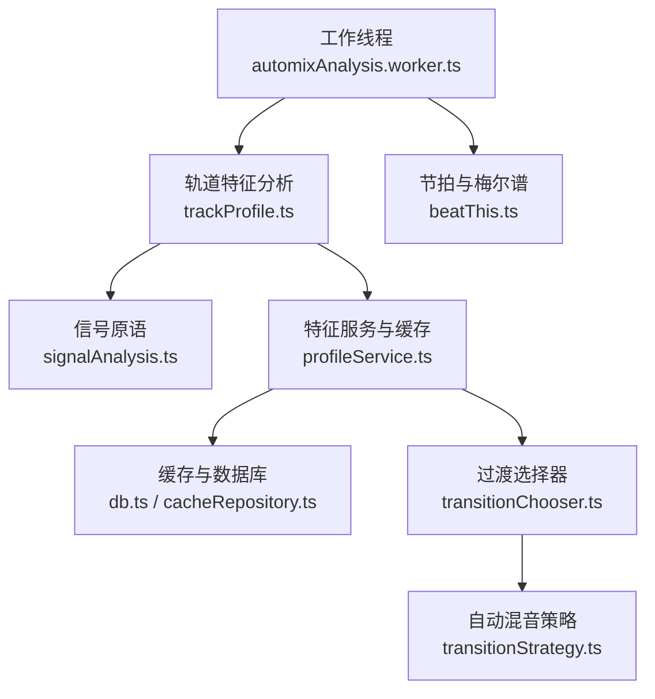

**图表来源**
- [automixAnalysis.worker.ts:1-47](file://src/workers/automixAnalysis.worker.ts#L1-L47)
- [trackProfile.ts:1-120](file://src/services/automix/trackProfile.ts#L1-L120)
- [signalAnalysis.ts:1-120](file://src/services/automix/signalAnalysis.ts#L1-L120)
- [beatThis.ts:1-120](file://src/services/automix/beatThis.ts#L1-L120)
- [profileService.ts:1-120](file://src/services/automix/profileService.ts#L1-L120)
- [transitionChooser.ts:1-18](file://src/services/automix/transitionChooser.ts#L1-L18)
- [transitionStrategy.ts:81-104](file://src/services/automix/transitionStrategy.ts#L81-L104)
- [db.ts:39-85](file://src/services/db.ts#L39-L85)
- [cacheRepository.ts:169-184](file://src/services/repositories/cacheRepository.ts#L169-L184)

**章节来源**
- [automixAnalysis.worker.ts:1-47](file://src/workers/automixAnalysis.worker.ts#L1-L47)
- [profileService.ts:17-40](file://src/services/automix/profileService.ts#L17-L40)

## 核心组件
- 工作线程调度器：负责 mel 谱与轨道特征计算的异步任务分发与错误回退。
- 轨道特征分析器：对单声道 PCM 进行 FFT、能量包络、色度、结构边界、响度、音调分布、节拍与调性估计，输出 TrackProfile。
- 信号分析库：提供 RMS、FFT、频谱通量、K 加权、节拍估计、跨段曲线生成等基础数学。
- Beat This! 节拍网格：梅尔谱计算、分块推理、峰值合并、节拍/强拍网格生成。
- 特征服务：字节读取（完整或前缀）、解码到分析采样率、模型调用、内存与磁盘缓存、尾部回放补全。
- 过渡选择器：基于 Profile 的音乐性指标选择过渡类型并生成可执行计划。
- 自动混音策略：判断是否具备足够证据启用高级自动混音逻辑。

**章节来源**
- [automixAnalysis.worker.ts:19-46](file://src/workers/automixAnalysis.worker.ts#L19-L46)
- [trackProfile.ts:132-284](file://src/services/automix/trackProfile.ts#L132-L284)
- [signalAnalysis.ts:42-111](file://src/services/automix/signalAnalysis.ts#L42-L111)
- [beatThis.ts:83-158](file://src/services/automix/beatThis.ts#L83-L158)
- [profileService.ts:163-260](file://src/services/automix/profileService.ts#L163-L260)
- [transitionChooser.ts:1-18](file://src/services/automix/transitionChooser.ts#L1-L18)
- [transitionStrategy.ts:81-104](file://src/services/automix/transitionStrategy.ts#L81-L104)

## 架构总览
系统采用“纯函数算法 + 非纯服务编排”的分层设计：
- 纯函数层：`signalAnalysis.ts`、`trackProfile.ts`、`beatThis.ts` 不依赖 DOM、音频图或 Electron 桥，便于测试与复用。
- 服务层：`profileService.ts` 负责字节获取、解码、模型调用、缓存、进度与日志。
- 工作线程层：`automixAnalysis.worker.ts` 承担重型 FFT 与模型输入准备，避免阻塞 UI。
- 消费层：`transitionChooser.ts`、`transitionStrategy.ts` 根据 Profile 决定过渡风格与长度。

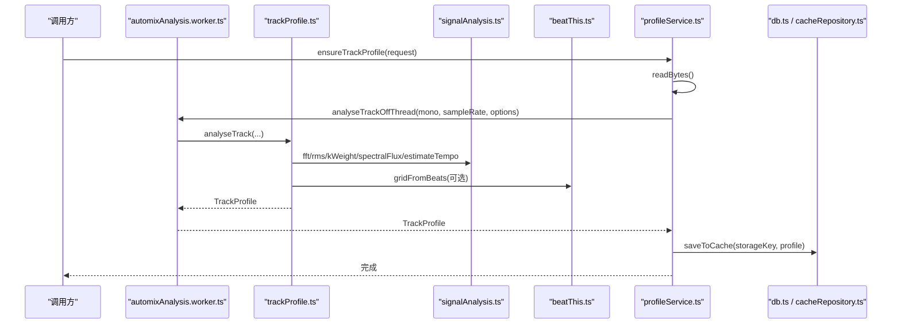

**图表来源**
- [profileService.ts:268-398](file://src/services/automix/profileService.ts#L268-L398)
- [automixAnalysis.worker.ts:29-46](file://src/workers/automixAnalysis.worker.ts#L29-L46)
- [trackProfile.ts:654-745](file://src/services/automix/trackProfile.ts#L654-L745)
- [signalAnalysis.ts:165-309](file://src/services/automix/signalAnalysis.ts#L165-L309)
- [beatThis.ts:444-468](file://src/services/automix/beatThis.ts#L444-L468)
- [db.ts:79-85](file://src/services/db.ts#L79-L85)
- [cacheRepository.ts:169-184](file://src/services/repositories/cacheRepository.ts#L169-L184)

## 详细组件分析

### 音色分析：频谱质心、频谱滚降点、频谱平坦度
- 频谱平坦度：在 `trackProfile.ts` 中，针对色度范围内的频谱幅度，通过几何均值与算术均值的比值计算平坦度，用于抑制噪声帧对调性估计的干扰。
- 频谱质心与滚降点：当前实现未直接暴露质心与滚降点字段；但系统通过三段式频带能量（低频、中频、高频）描述音色形状，并在过渡时做色调倾斜匹配。这可以视为一种更稳健的“音色轮廓”表示。
- 使用方式：音色形状用于 `toneTilt` 计算 incoming/outgoing 之间的色调差异，从而在过渡期间对 incoming 的中高频做短时弯曲，使听感更平滑。

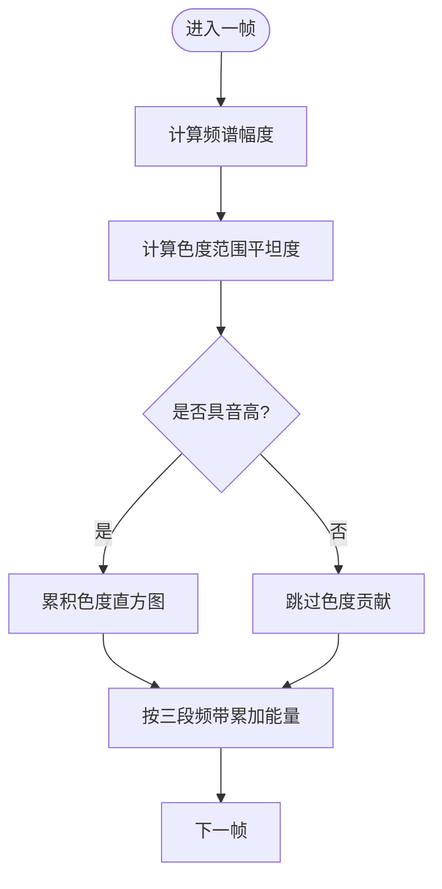

**图表来源**
- [trackProfile.ts:761-800](file://src/services/automix/trackProfile.ts#L761-L800)
- [signalAnalysis.ts:584-596](file://src/services/automix/signalAnalysis.ts#L584-L596)

**章节来源**
- [trackProfile.ts:761-800](file://src/services/automix/trackProfile.ts#L761-L800)
- [signalAnalysis.ts:584-596](file://src/services/automix/signalAnalysis.ts#L584-L596)

### 谐波结构分析：基频检测、泛音分解、谐波比
- 基频检测：系统中没有显式的基频检测器。节拍与强拍由 Beat This! 模型与自相关估计共同提供，作为“周期性脉冲”的代理。
- 泛音分解：色度直方图通过对 FFT 幅值按十二平均律类映射累加，间接反映泛音分布；平坦度用于抑制宽带噪声对色度的污染。
- 谐波比：未直接计算谐波比；系统通过三段频带能量比例表达“明亮度/暗度”，并在过渡中用色调倾斜补偿两轨音色差异。

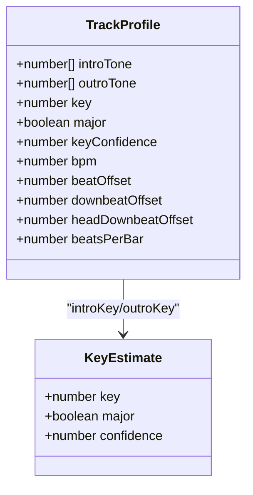

**图表来源**
- [trackProfile.ts:132-284](file://src/services/automix/trackProfile.ts#L132-L284)
- [trackProfile.ts:306-347](file://src/services/automix/trackProfile.ts#L306-L347)

**章节来源**
- [trackProfile.ts:306-347](file://src/services/automix/trackProfile.ts#L306-L347)
- [trackProfile.ts:707-800](file://src/services/automix/trackProfile.ts#L707-L800)

### 瞬态特征：attack time、decay characteristics、瞬态强度
- attack time：系统通过包络斜率 `introSlope` 与 `outroSlope`（dB/s）衡量开头与结尾的上升/下降趋势；同时通过 `startsHot`/`endsHot` 判断是否在边缘处保持满电平。
- decay characteristics：`bodyOut` 与 `leadOut` 分别描述“停止持平”的时间与“真正静音”的时间，结合 `outroSlope` 刻画尾部的衰减形态。
- 瞬态强度：通过频谱通量 `spectralFlux` 与低频通量（踢鼓带）构建 onset envelope，用于节拍估计与结构边界检测。

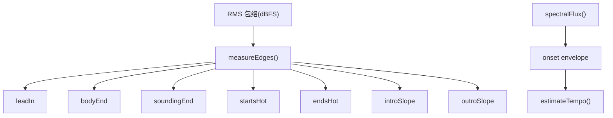

**图表来源**
- [trackProfile.ts:519-643](file://src/services/automix/trackProfile.ts#L519-L643)
- [signalAnalysis.ts:95-111](file://src/services/automix/signalAnalysis.ts#L95-L111)
- [signalAnalysis.ts:165-309](file://src/services/automix/signalAnalysis.ts#L165-L309)

**章节来源**
- [trackProfile.ts:519-643](file://src/services/automix/trackProfile.ts#L519-L643)
- [signalAnalysis.ts:95-111](file://src/services/automix/signalAnalysis.ts#L95-L111)

### 特征标准化与量化：向量构建、时间窗口滑动、统计聚合
- 特征向量：TrackProfile 是一个扁平对象，包含时长、静默区间、结构边界、响度、三段音色、节拍网格、调性等字段，可直接被下游消费。
- 时间窗口：
  - 帧级：HOP=512，FFT_SIZE=2048，hopSec=HOP/sampleRate。
  - 段落级：NOVELTY_BIN_SEC=1s，用于 Foote novelty 结构边界。
  - 端部窗口：EDGE_WINDOW_SEC=10s，HOT_WINDOW_SEC=1.5s。
- 统计聚合：
  - 响度：LUFS 偏移与 K 加权后积分。
  - 色度：按十二类音高类聚合，并用平坦度门限抑制噪声。
  - 节拍：自相关+谐波求和+抛物线精修周期，再估计相位。

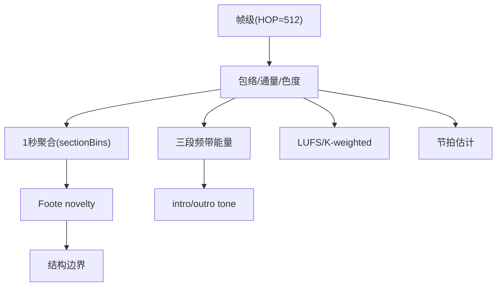

**图表来源**
- [trackProfile.ts:684-745](file://src/services/automix/trackProfile.ts#L684-L745)
- [trackProfile.ts:416-501](file://src/services/automix/trackProfile.ts#L416-L501)
- [signalAnalysis.ts:626-664](file://src/services/automix/signalAnalysis.ts#L626-L664)

**章节来源**
- [trackProfile.ts:684-745](file://src/services/automix/trackProfile.ts#L684-L745)
- [trackProfile.ts:416-501](file://src/services/automix/trackProfile.ts#L416-L501)
- [signalAnalysis.ts:626-664](file://src/services/automix/signalAnalysis.ts#L626-L664)

### 节拍与调性：从 Mel 谱到 Beat Grid
- Mel 谱：Slaney Mel 滤波器组，log1p 压缩，中心对称 STFT，按 50fps 输出。
- 节拍网格：Beat This! 模型输出 beat/downbeat logits，经局部峰值检测与去重，得到节拍序列；再拟合均匀网格，输出 BPM、bar line、head/outro 强拍偏移。
- 调性估计：Krumhansl-Schmuckler 模板与旋转相关性，给出 key/major/confidence。

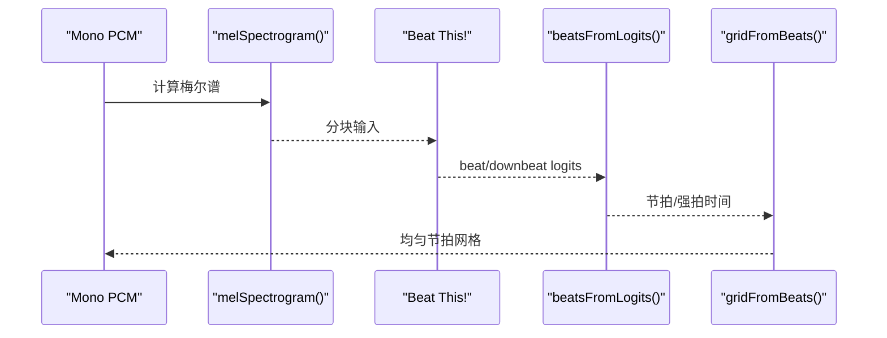

**图表来源**
- [beatThis.ts:103-158](file://src/services/automix/beatThis.ts#L103-L158)
- [beatThis.ts:202-238](file://src/services/automix/beatThis.ts#L202-L238)
- [beatThis.ts:378-413](file://src/services/automix/beatThis.ts#L378-L413)

**章节来源**
- [beatThis.ts:103-158](file://src/services/automix/beatThis.ts#L103-L158)
- [beatThis.ts:202-238](file://src/services/automix/beatThis.ts#L202-L238)
- [beatThis.ts:378-413](file://src/services/automix/beatThis.ts#L378-L413)

## 依赖关系分析
- 低耦合：`signalAnalysis.ts`、`trackProfile.ts`、`beatThis.ts` 均为纯函数，仅依赖数组与数字。
- 服务编排：`profileService.ts` 组合字节读取、解码、模型调用、缓存与日志。
- 工作线程隔离：`automixAnalysis.worker.ts` 只接受 Float32Array 与简单参数，避免访问 DOM 或 Electron 桥。
- 消费端：`transitionChooser.ts`、`transitionStrategy.ts` 仅读取 Profile 与 BPM，不关心具体测量细节。

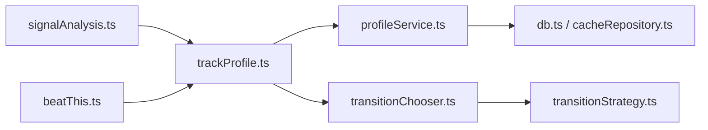

**图表来源**
- [signalAnalysis.ts:1-120](file://src/services/automix/signalAnalysis.ts#L1-L120)
- [trackProfile.ts:1-120](file://src/services/automix/trackProfile.ts#L1-L120)
- [beatThis.ts:1-120](file://src/services/automix/beatThis.ts#L1-L120)
- [profileService.ts:1-40](file://src/services/automix/profileService.ts#L1-L40)
- [transitionChooser.ts:1-18](file://src/services/automix/transitionChooser.ts#L1-L18)
- [transitionStrategy.ts:81-104](file://src/services/automix/transitionStrategy.ts#L81-L104)

**章节来源**
- [profileService.ts:17-40](file://src/services/automix/profileService.ts#L17-L40)
- [transitionStrategy.ts:81-104](file://src/services/automix/transitionStrategy.ts#L81-L104)

## 性能与实时性
- 工作线程：mel 谱与轨道特征在主线程外运行，避免歌词动画卡顿。
- 增量计算：
  - 频谱通量仅累加正向变化，避免把衰减拖入 onset。
  - 尾部回放补全：对于无法下载尾部的流媒体，通过播放时的电平读数补全 `leadOut`、`bodyOut`、`endsHot`、`outroSlope`、`loudness`、`tailDb`。
- 缓存策略：
  - 内存缓存：最多保留 200 个 Profile，LRU 淘汰。
  - 磁盘缓存：以 `automix_profile_<songKey>` 为键，版本控制 `TRACK_PROFILE_VERSION`。
  - 类别隔离：analysis 类别独立于 audio/replayGain，避免误删。
- 性能监控：
  - 日志记录分析结果（BPM、LUFS、边界、头部/尾部状态）。
  - 失败路径统一返回 null 或 error，主线程有回退逻辑。

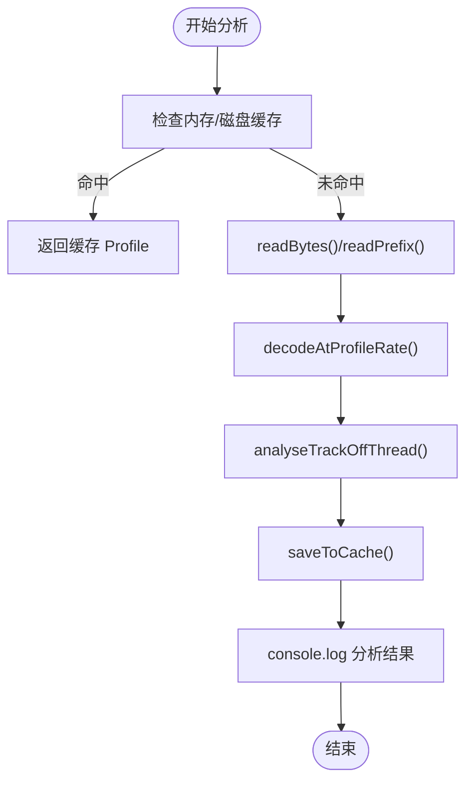

**图表来源**
- [profileService.ts:268-398](file://src/services/automix/profileService.ts#L268-L398)
- [profileService.ts:423-468](file://src/services/automix/profileService.ts#L423-L468)
- [cacheRepository.ts:169-184](file://src/services/repositories/cacheRepository.ts#L169-L184)

**章节来源**
- [automixAnalysis.worker.ts:13-17](file://src/workers/automixAnalysis.worker.ts#L13-L17)
- [profileService.ts:268-398](file://src/services/automix/profileService.ts#L268-L398)
- [profileService.ts:423-468](file://src/services/automix/profileService.ts#L423-L468)
- [cacheRepository.ts:169-184](file://src/services/repositories/cacheRepository.ts#L169-L184)

## 存储、序列化与缓存
- 存储键空间：`automix_profile_<songKey>`，category 为 `analysis`。
- 版本控制：`TRACK_PROFILE_VERSION` 变更会强制重新测量，保证算法升级后的数据一致性。
- 清理策略：
  - 内存：`profiles` Map 限制大小，LRU 淘汰。
  - 磁盘：通过 `removeCacheEntriesByPrefix('automix_profile_')` 清理。
- 会话数据：`db.ts` 提供 `saveToCache`/`getFromCache` 等封装，统一异常处理。

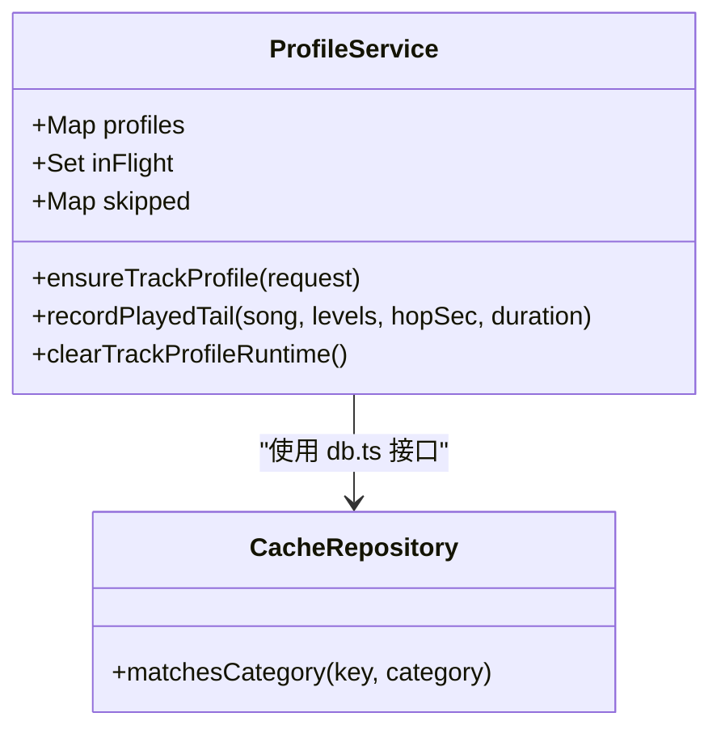

**图表来源**
- [profileService.ts:28-40](file://src/services/automix/profileService.ts#L28-L40)
- [profileService.ts:86-96](file://src/services/automix/profileService.ts#L86-L96)
- [profileService.ts:471-478](file://src/services/automix/profileService.ts#L471-L478)
- [cacheRepository.ts:169-184](file://src/services/repositories/cacheRepository.ts#L169-L184)
- [db.ts:79-85](file://src/services/db.ts#L79-L85)

**章节来源**
- [profileService.ts:28-40](file://src/services/automix/profileService.ts#L28-L40)
- [profileService.ts:86-96](file://src/services/automix/profileService.ts#L86-L96)
- [profileService.ts:471-478](file://src/services/automix/profileService.ts#L471-L478)
- [cacheRepository.ts:169-184](file://src/services/repositories/cacheRepository.ts#L169-L184)
- [db.ts:79-85](file://src/services/db.ts#L79-L85)

## 自动混音中的应用
- 风格分类：系统未实现传统“风格标签”，而是通过音色形状（三段频带能量）、响度、结构边界、节拍与调性来隐式表征风格差异。
- 过渡规划：
  - 基于 Profile 的 loudness、outroSlope、endsHot 决定 crossover 时机与 blend 长度。
  - 基于 BPM 与 bar line 对齐 entry，必要时 snap 到节拍。
  - 基于 intro/outro tone 计算 tilt，平滑音色跳跃。
- 兼容性分析：
  - 调性关系：major/minor 与五度圈/关系小调判定兼容。
  - 节拍匹配：tempoMatch 与 settledBpm 用于长度与对齐。

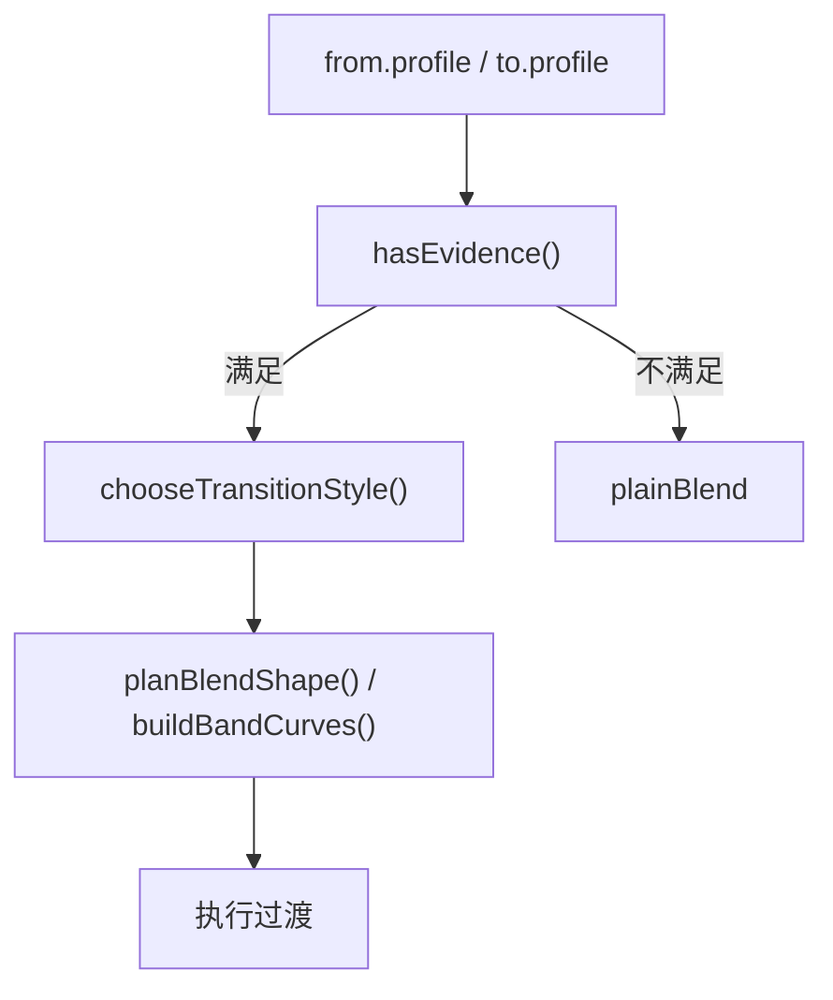

**图表来源**
- [transitionStrategy.ts:81-104](file://src/services/automix/transitionStrategy.ts#L81-L104)
- [transitionChooser.ts:1-18](file://src/services/automix/transitionChooser.ts#L1-L18)
- [signalAnalysis.ts:320-391](file://src/services/automix/signalAnalysis.ts#L320-L391)
- [signalAnalysis.ts:539-574](file://src/services/automix/signalAnalysis.ts#L539-L574)

**章节来源**
- [transitionStrategy.ts:81-104](file://src/services/automix/transitionStrategy.ts#L81-L104)
- [transitionChooser.ts:1-18](file://src/services/automix/transitionChooser.ts#L1-L18)
- [signalAnalysis.ts:320-391](file://src/services/automix/signalAnalysis.ts#L320-L391)
- [signalAnalysis.ts:539-574](file://src/services/automix/signalAnalysis.ts#L539-L574)

## 故障排查
- 无字节可分析：
  - 原因：未缓存且未开启媒体缓存，服务器不支持 Range，或 URL 不可达。
  - 现象：`skipped` 日志，回退到 live measurement。
- 模型不可用：
  - 原因：浏览器构建或缺少权重文件。
  - 现象：`gridless=true`，回退到自相关节拍估计。
- 尾部缺失：
  - 原因：流媒体无法下载尾部。
  - 解决：`recordPlayedTail()` 用播放电平补全尾部特征。
- 缓存不一致：
  - 原因：算法版本升级。
  - 解决：`TRACK_PROFILE_VERSION` 递增，强制重新测量。

**章节来源**
- [profileService.ts:203-260](file://src/services/automix/profileService.ts#L203-L260)
- [profileService.ts:333-344](file://src/services/automix/profileService.ts#L333-L344)
- [profileService.ts:423-468](file://src/services/automix/profileService.ts#L423-L468)
- [trackProfile.ts:25-35](file://src/services/automix/trackProfile.ts#L25-L35)

## 结论
该音频特征提取系统以纯函数为核心，围绕 TrackProfile 构建了一套面向自动混音的特征体系。它通过频谱通量、色度、三段频带能量、K 加权响度、节拍与调性估计，支撑了过渡风格选择、节拍对齐与音色平滑。系统在实时性上通过工作线程、增量谱更新与尾部回放补全保障体验；在可靠性上通过内存与磁盘缓存、版本控制与失败回退确保稳定性。尽管未直接实现基频检测与谐波比等传统声学特征，但其以节拍与音色形状为核心的工程化方案，在自动混音场景中提供了实用且鲁棒的解决方案。