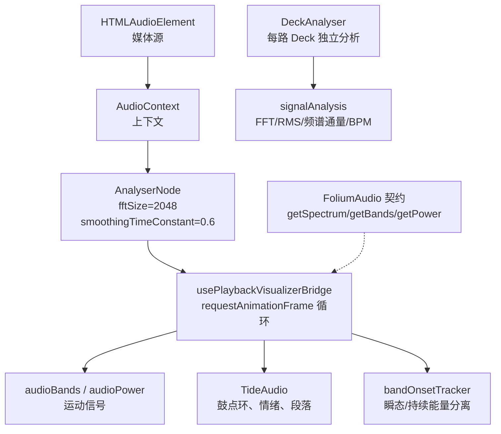
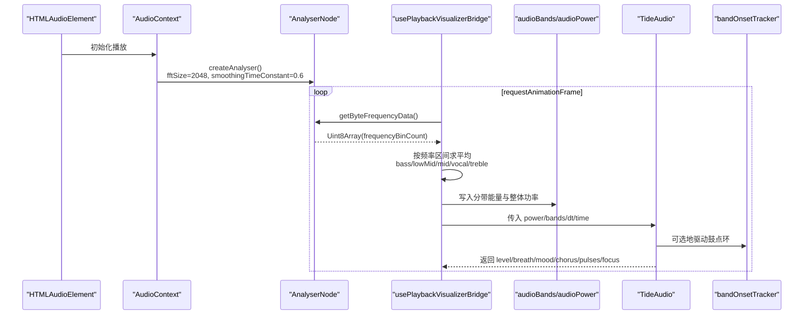
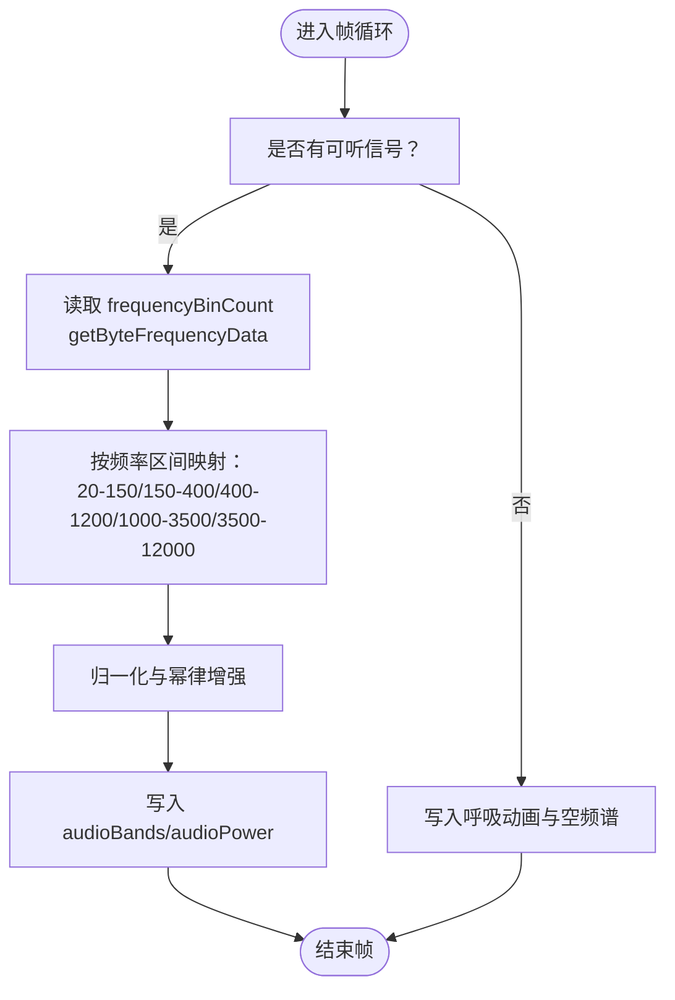
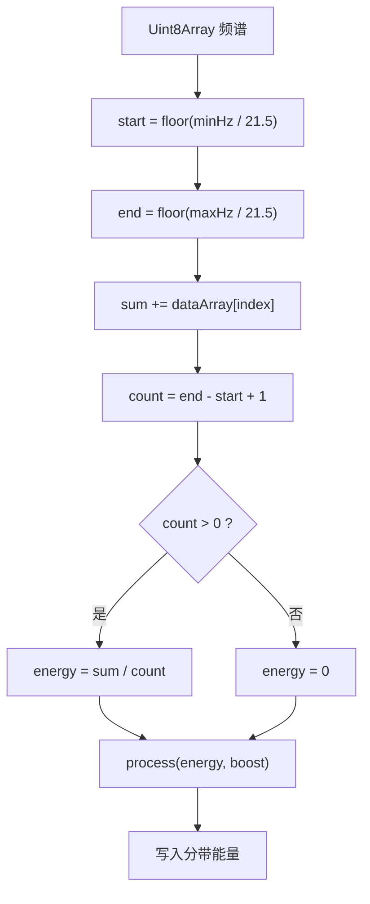
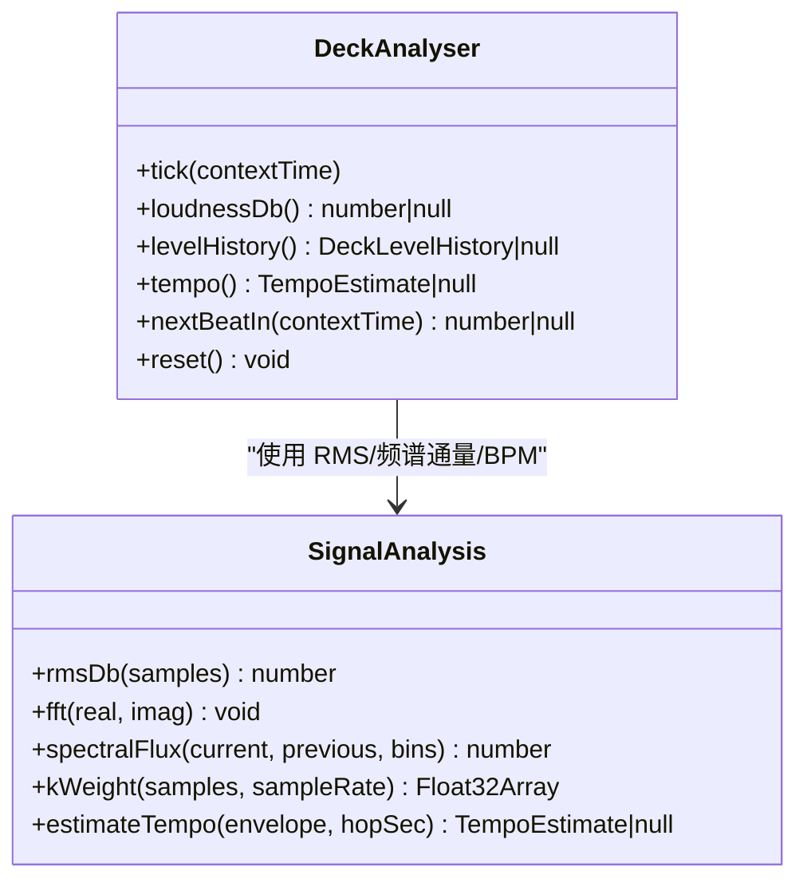
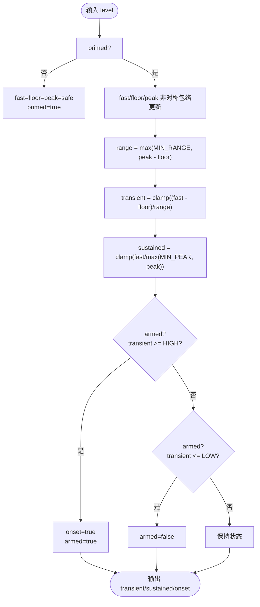
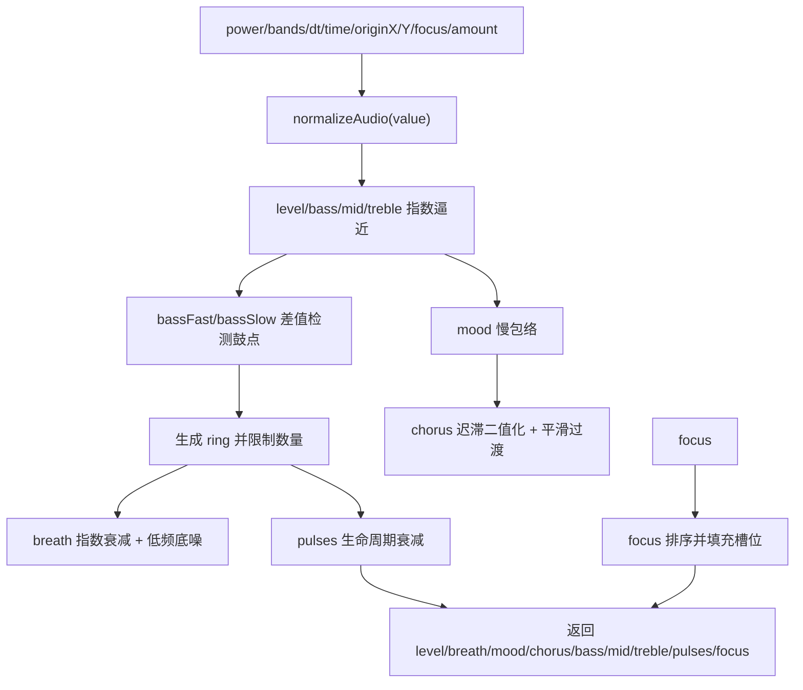
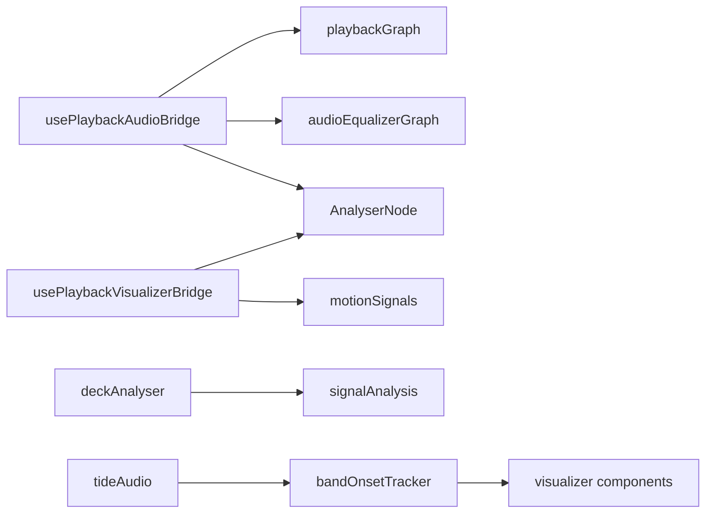

# 频域分析

<cite>
**本文引用的文件**   
- [usePlaybackAudioBridge.ts](file://src/hooks/usePlaybackAudioBridge.ts)
- [usePlaybackVisualizerBridge.ts](file://src/hooks/usePlaybackVisualizerBridge.ts)
- [deckAnalyser.ts](file://src/services/automix/deckAnalyser.ts)
- [signalAnalysis.ts](file://src/services/automix/signalAnalysis.ts)
- [bandOnsetTracker.ts](file://src/components/visualizer/bandOnsetTracker.ts)
- [tideAudio.ts](file://src/components/visualizer/backgrounds/tide/tideAudio.ts)
- [contract.ts](file://src/mods/folium/contract.ts)
</cite>

## 目录
1. [引言](#引言)
2. [项目结构](#项目结构)
3. [核心组件](#核心组件)
4. [架构总览](#架构总览)
5. [详细组件分析](#详细组件分析)
6. [依赖关系分析](#依赖关系分析)
7. [性能与实时性优化](#性能与实时性优化)
8. [故障排查指南](#故障排查指南)
9. [结论](#结论)

## 引言
本文面向“频域音频分析系统”，聚焦快速傅里叶变换（FFT）在 Web Audio API 中的工程化应用，覆盖以下主题：
- 频谱图生成、频率分带算法与能量分布计算。
- AnalyserNode 配置参数 fftSize、smoothingTimeConstant、frequencyBinCount 对分析精度和实时性的影响。
- 频域数据提取与处理：幅度谱、相位分析与频率响应特性。
- 多频段能量跟踪与瞬态检测：bandOnsetTracker 的实现原理、持续能量分离机制。
- 频域数据的可视化与映射策略：频谱显示、频率范围选择、动态范围压缩。
- 实时性优化：异步处理、内存管理与采样率对齐。

本仓库并未实现一个独立的 FFT 库；它主要使用浏览器内置的 AnalyserNode 进行实时频域采样，并在离线分析路径中内联了一个手写 radix-2 FFT，用于自动混音等离线任务。

## 项目结构
与频域分析直接相关的代码分布在以下位置：
- 播放链路桥接层：创建 AudioContext、AnalyserNode，并设置关键参数。
- 可视化桥接层：以 requestAnimationFrame 驱动帧循环，读取频域数据并计算分带能量。
- 自动混音分析器：为每个 Deck 建立独立 AnalyserNode，关闭平滑以测量频谱通量，估计节拍与 BPM。
- 信号分析工具：RMS、FFT、频谱通量、K-加权响度、三段式均衡曲线等。
- 可视化侧的多频段起音跟踪：将单频段能量序列分解为瞬态与持续分量，输出 Schmitt 触发事件。
- 水波背景音频模型：对主链路的 0..255 刻度与预览/主题公园的 0..1 刻度做统一归一化，并生成鼓点环与歌词焦点。

**图表来源**
- [usePlaybackAudioBridge.ts:133-164](file://src/hooks/usePlaybackAudioBridge.ts#L133-L164)
- [usePlaybackVisualizerBridge.ts:77-131](file://src/hooks/usePlaybackVisualizerBridge.ts#L77-L131)
- [deckAnalyser.ts:63-103](file://src/services/automix/deckAnalyser.ts#L63-L103)
- [signalAnalysis.ts:42-111](file://src/services/automix/signalAnalysis.ts#L42-L111)
- [bandOnsetTracker.ts:47-119](file://src/components/visualizer/bandOnsetTracker.ts#L47-L119)
- [tideAudio.ts:93-104](file://src/components/visualizer/backgrounds/tide/tideAudio.ts#L93-L104)
- [contract.ts:364-376](file://src/mods/folium/contract.ts#L364-L376)

**章节来源**
- [usePlaybackAudioBridge.ts:133-164](file://src/hooks/usePlaybackAudioBridge.ts#L133-L164)
- [usePlaybackVisualizerBridge.ts:77-131](file://src/hooks/usePlaybackVisualizerBridge.ts#L77-L131)
- [deckAnalyser.ts:63-103](file://src/services/automix/deckAnalyser.ts#L63-L103)
- [signalAnalysis.ts:42-111](file://src/services/automix/signalAnalysis.ts#L42-L111)
- [bandOnsetTracker.ts:47-119](file://src/components/visualizer/bandOnsetTracker.ts#L47-L119)
- [tideAudio.ts:93-104](file://src/components/visualizer/backgrounds/tide/tideAudio.ts#L93-L104)
- [contract.ts:364-376](file://src/mods/folium/contract.ts#L364-L376)

## 核心组件
- 播放链路桥接：负责创建 AudioContext 与 AnalyserNode，设置 fftSize 与 smoothingTimeConstant，构建回放图并接入均衡器与效果链。
- 可视化桥接：以帧循环读取 frequencyBinCount 长度的 Uint8Array 频域数据，按固定频率区间求平均得到 bass、lowMid、mid、vocal、treble，并写入全局运动信号。
- 自动混音分析器：为每条 Deck 创建独立 AnalyserNode，关闭平滑，串联 K-加权滤波器，计算 RMS、频谱通量、BPM 与下一拍时间。
- 信号分析工具：提供 RMS、radix-2 FFT、频谱通量、K-加权、三段均衡曲线、响度单位转换等纯函数。
- 多频段起音跟踪：维护 fast、floor、peak 三个包络，输出 transient、sustained 与 onset 事件。
- 水波音频模型：对双刻度输入做安全归一化，产生 level、breath、mood、chorus、bass/mid/treble、pulses、focus 等可视化信号。

**章节来源**
- [usePlaybackAudioBridge.ts:133-164](file://src/hooks/usePlaybackAudioBridge.ts#L133-L164)
- [usePlaybackVisualizerBridge.ts:77-131](file://src/hooks/usePlaybackVisualizerBridge.ts#L77-L131)
- [deckAnalyser.ts:63-103](file://src/services/automix/deckAnalyser.ts#L63-L103)
- [signalAnalysis.ts:42-111](file://src/services/automix/signalAnalysis.ts#L42-L111)
- [bandOnsetTracker.ts:47-119](file://src/components/visualizer/bandOnsetTracker.ts#L47-L119)
- [tideAudio.ts:93-104](file://src/components/visualizer/backgrounds/tide/tideAudio.ts#L93-L104)

## 架构总览
下图展示从媒体源到可视化信号的完整数据流，以及自动混音侧的独立分析路径。

**图表来源**
- [usePlaybackAudioBridge.ts:133-164](file://src/hooks/usePlaybackAudioBridge.ts#L133-L164)
- [usePlaybackVisualizerBridge.ts:77-131](file://src/hooks/usePlaybackVisualizerBridge.ts#L77-L131)
- [tideAudio.ts:131-224](file://src/components/visualizer/backgrounds/tide/tideAudio.ts#L131-L224)
- [bandOnsetTracker.ts:90-119](file://src/components/visualizer/bandOnsetTracker.ts#L90-L119)

## 详细组件分析

### AnalyserNode 配置与频域采样
- fftSize：决定时域窗口长度与频域分辨率。当前主链路设置为 2048，对应约 46 Hz 的 bin 间隔（在 48 kHz 采样率下）。更大的 fftSize 提高频率分辨率，但增加延迟与计算开销。
- smoothingTimeConstant：主链路设为 0.6，使频谱更平滑，适合可视化；自动混音分析器设为 0，避免抹平相邻帧之间的变化，从而准确测量频谱通量。
- frequencyBinCount：由 AnalyserNode 根据 fftSize 推导，可视化桥接层据此分配 Uint8Array 缓冲区，并以 getByteFrequencyData 读取 0..255 的幅度值。

**图表来源**
- [usePlaybackVisualizerBridge.ts:87-131](file://src/hooks/usePlaybackVisualizerBridge.ts#L87-L131)

**章节来源**
- [usePlaybackAudioBridge.ts:142-145](file://src/hooks/usePlaybackAudioBridge.ts#L142-L145)
- [usePlaybackVisualizerBridge.ts:87-131](file://src/hooks/usePlaybackVisualizerBridge.ts#L87-L131)

### 频谱图生成与频率分带算法
- 频谱图生成：可视化桥接层通过 getByteFrequencyData 获取幅度谱，并将其复制到全局 motion signal 供渲染层消费。
- 频率分带：采用线性频率区间近似，将 bin 索引映射到 Hz 后求均值，得到五个常用分带能量。该方案简单高效，适合实时可视化。
- 动态范围压缩：对每个分带能量执行幂律增强（如 bass 使用指数 1.8，整体功率使用 3），以突出低频与整体响度变化。

**图表来源**
- [usePlaybackVisualizerBridge.ts:93-120](file://src/hooks/usePlaybackVisualizerBridge.ts#L93-L120)

**章节来源**
- [usePlaybackVisualizerBridge.ts:93-120](file://src/hooks/usePlaybackVisualizerBridge.ts#L93-L120)

### 幅度谱、相位分析与频率响应特性
- 幅度谱：主链路使用 getByteFrequencyData，返回 0..255 的幅度值；自动混音分析器使用 getFloatFrequencyData，返回 dB 域的 Float32Array，便于离线/在线一致的 flux 计算。
- 相位分析：当前代码未直接使用相位信息；自动混音与可视化均基于幅度或能量。若需相位分析，可在 deckAnalyser 中扩展相位提取逻辑。
- 频率响应特性：自动混音分析器在 tap 前加入 K-加权滤波器（高 shelf + 高通），使电平读数与 ITU-R BS.1770 响度一致，避免低频过重导致的平衡偏差。

**图表来源**
- [deckAnalyser.ts:46-61](file://src/services/automix/deckAnalyser.ts#L46-L61)
- [signalAnalysis.ts:42-111](file://src/services/automix/signalAnalysis.ts#L42-L111)

**章节来源**
- [deckAnalyser.ts:63-103](file://src/services/automix/deckAnalyser.ts#L63-L103)
- [signalAnalysis.ts:42-111](file://src/services/automix/signalAnalysis.ts#L42-L111)

### 多频段能量跟踪与瞬态检测：bandOnsetTracker
bandOnsetTracker 将单频段能量序列分解为：
- transient：瞬态强度，normalized 为 (fast - floor) / range，对恒定节拍保持敏感。
- sustained：持续能量，normalized 为 fast / peak，反映该频段在当前歌曲响度下的存在感。
- onset：Schmitt 触发事件，避免同一鼓点连发。

其核心思想是分别跟踪 fast、floor、peak 三个包络，并使用非对称指数逼近，使 floor 缓慢上升、快速下降，peak 快速上升、缓慢下降，从而在稳定节拍下仍能区分瞬态与持续分量。

**图表来源**
- [bandOnsetTracker.ts:47-119](file://src/components/visualizer/bandOnsetTracker.ts#L47-L119)

**章节来源**
- [bandOnsetTracker.ts:47-119](file://src/components/visualizer/bandOnsetTracker.ts#L47-L119)

### 水波背景音频模型：TideAudio
TideAudio 对主链路的 0..255 刻度与预览/主题公园的 0..1 刻度进行统一归一化，避免数值溢出导致水面冻结或抽搐。它输出：
- level：平滑后的整体响度。
- breath：鼓点呼吸包络，命中时吸满，随后按时间常数呼出。
- mood/chorus：秒级慢包络与带迟滞的段落状态。
- pulses/focus：鼓点环与歌词焦点，供渲染层驱动流体表面。

**图表来源**
- [tideAudio.ts:93-104](file://src/components/visualizer/backgrounds/tide/tideAudio.ts#L93-L104)
- [tideAudio.ts:131-224](file://src/components/visualizer/backgrounds/tide/tideAudio.ts#L131-L224)

**章节来源**
- [tideAudio.ts:93-104](file://src/components/visualizer/backgrounds/tide/tideAudio.ts#L93-L104)
- [tideAudio.ts:131-224](file://src/components/visualizer/backgrounds/tide/tideAudio.ts#L131-L224)

### Folium 插件音频接口
FoliumAudio 暴露 getPower、getBands、getSpectrum，供外部插件读取整体能量、分带能量与原始频谱。该契约确保插件在主播放链路中读取的是 0..255 的幅度谱，而预览/主题公园可能使用 0..1 的合成信号。

**章节来源**
- [contract.ts:364-376](file://src/mods/folium/contract.ts#L364-L376)

## 依赖关系分析
- usePlaybackAudioBridge 依赖 playbackGraph、equalizer/effect chain，并负责创建 AnalyserNode。
- usePlaybackVisualizerBridge 依赖 analyserRef 与 motion signals，驱动可视化与歌词时间同步。
- deckAnalyser 依赖 signalAnalysis 提供的 RMS、频谱通量、BPM 估计。
- bandOnsetTracker 被可视化组件复用，提供稳定的瞬态/持续能量分离。
- tideAudio 依赖 normalizeAudio 与多个时间常数，输出渲染友好的信号。

**图表来源**
- [usePlaybackAudioBridge.ts:133-164](file://src/hooks/usePlaybackAudioBridge.ts#L133-L164)
- [usePlaybackVisualizerBridge.ts:77-131](file://src/hooks/usePlaybackVisualizerBridge.ts#L77-L131)
- [deckAnalyser.ts:63-103](file://src/services/automix/deckAnalyser.ts#L63-L103)
- [bandOnsetTracker.ts:47-119](file://src/components/visualizer/bandOnsetTracker.ts#L47-L119)
- [tideAudio.ts:131-224](file://src/components/visualizer/backgrounds/tide/tideAudio.ts#L131-L224)

**章节来源**
- [usePlaybackAudioBridge.ts:133-164](file://src/hooks/usePlaybackAudioBridge.ts#L133-L164)
- [usePlaybackVisualizerBridge.ts:77-131](file://src/hooks/usePlaybackVisualizerBridge.ts#L77-L131)
- [deckAnalyser.ts:63-103](file://src/services/automix/deckAnalyser.ts#L63-L103)
- [bandOnsetTracker.ts:47-119](file://src/components/visualizer/bandOnsetTracker.ts#L47-L119)
- [tideAudio.ts:131-224](file://src/components/visualizer/backgrounds/tide/tideAudio.ts#L131-L224)

## 性能与实时性优化
- 异步处理：可视化桥接使用 requestAnimationFrame 驱动帧循环，避免阻塞 UI；自动混音分析器以 tick 方式接收采样，不耦合渲染周期。
- 内存管理：可视化桥接每次帧循环分配新的 Uint8Array 读取频谱，建议在生产环境中复用缓冲区以减少 GC 压力；自动混音分析器预分配 spectrum、previous、samples 数组。
- 采样率对齐：自动混音分析器在 tap 前加入 K-加权滤波器，使在线与离线响度一致；FFT 与 bin 映射基于 context.sampleRate 计算。
- 平滑与瞬态：主链路 smoothingTimeConstant=0.6 提升可视化稳定性；自动混音分析器 smoothingTimeConstant=0 保留帧间变化，利于频谱通量与节拍估计。
- 动态范围压缩：可视化中对分带能量使用幂律增强，突出低频与整体响度变化，同时避免过度放大噪声。

[本节为通用指导，不直接分析具体文件]

## 故障排查指南
- 水面冻结或抽搐：检查 normalizeAudio 是否正确处理 0..255 与 0..1 双刻度；若误用 clamp(x, 0, 1)，会导致 0..255 全压成 1，引发水面冻结或安静段跳变。
- 鼓点检测失效：确认 bandOnsetTracker 的 MIN_RANGE 与 MIN_PEAK 未被静音通道拉低；检查 TRIGGER_HIGH/LOW 是否与音乐风格匹配。
- 频谱无响应：确认 analyserRef.current.frequencyBinCount 有效，且 getByteFrequencyData 已调用；检查 hasAudibleSignal 分支是否正确进入。
- 自动混音 BPM 不稳定：检查 smoothingTimeConstant 是否为 0，以及 spectralFlux 的 bins 上限是否合理；确认 hopSec 不为 0。

**章节来源**
- [tideAudio.ts:93-104](file://src/components/visualizer/backgrounds/tide/tideAudio.ts#L93-L104)
- [bandOnsetTracker.ts:74-79](file://src/components/visualizer/bandOnsetTracker.ts#L74-L79)
- [usePlaybackVisualizerBridge.ts:87-131](file://src/hooks/usePlaybackVisualizerBridge.ts#L87-L131)
- [deckAnalyser.ts:68-73](file://src/services/automix/deckAnalyser.ts#L68-L73)

## 结论
本系统的频域分析围绕 Web Audio API 的 AnalyserNode 展开：主链路使用较大的 fftSize 与适度平滑以获得稳定的可视化频谱；自动混音分析器关闭平滑并引入 K-加权，保证在线与离线响度一致，并基于频谱通量估计 BPM 与节拍网格。可视化侧通过频率区间平均与幂律增强生成分带能量，bandOnsetTracker 提供稳定的瞬态/持续能量分离，TideAudio 则将这些信号转化为渲染友好的鼓点环与段落状态。整体架构清晰、职责分离，适合实时音频可视化与自动混音场景。

[本节为总结性内容，不直接分析具体文件]