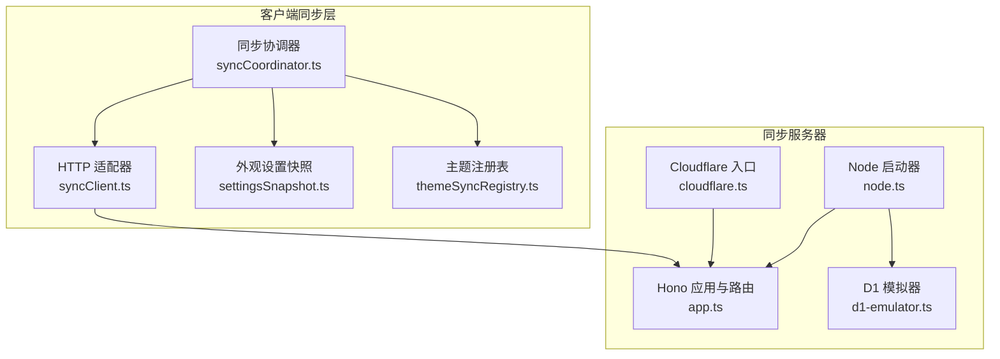
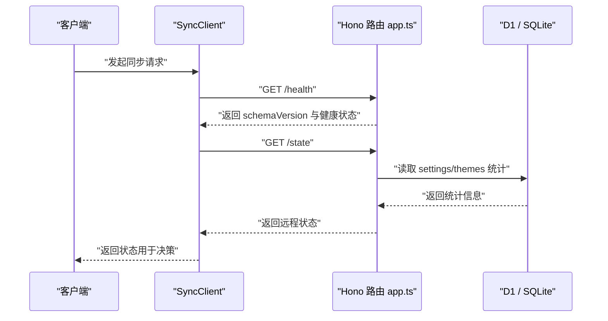
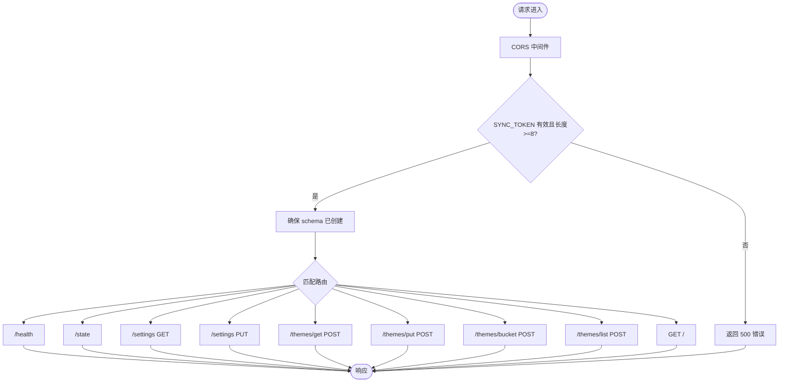
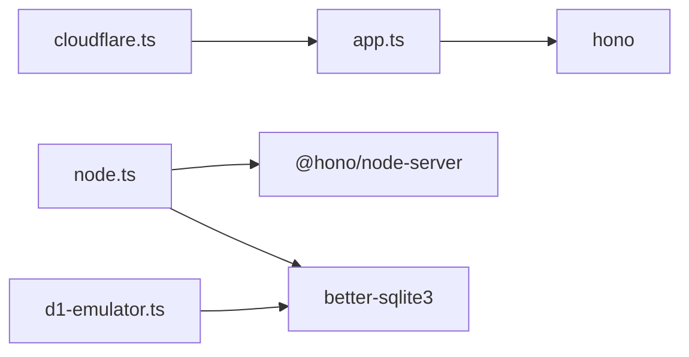
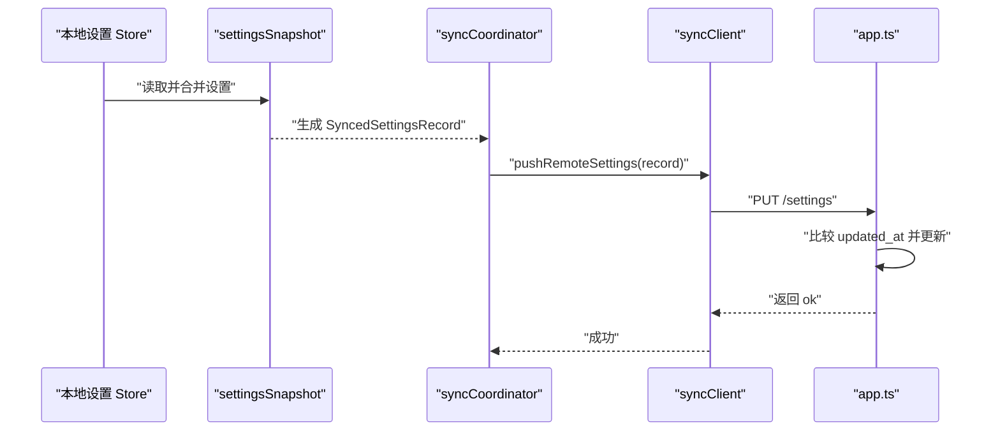
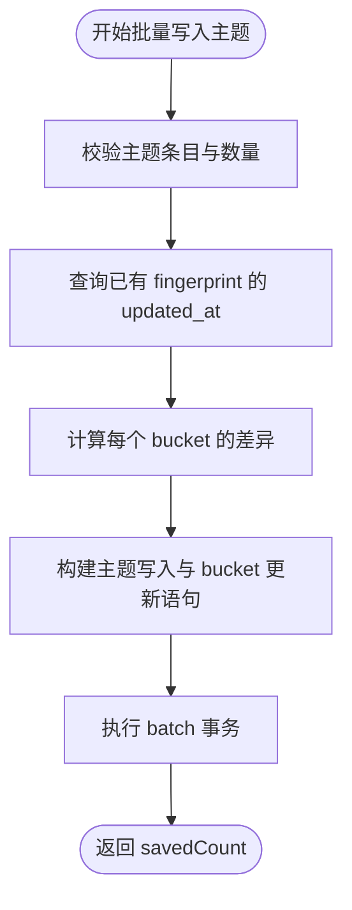

# 同步服务器

<cite>
**本文引用的文件**   
- [sync-server/README.md](file://sync-server/README.md)
- [sync-server/package.json](file://sync-server/package.json)
- [sync-server/src/app.ts](file://sync-server/src/app.ts)
- [sync-server/src/cloudflare.ts](file://sync-server/src/cloudflare.ts)
- [sync-server/src/node.ts](file://sync-server/src/node.ts)
- [sync-server/src/d1-emulator.ts](file://sync-server/src/d1-emulator.ts)
- [src/services/sync/syncClient.ts](file://src/services/sync/syncClient.ts)
- [src/services/sync/settingsSnapshot.ts](file://src/services/sync/settingsSnapshot.ts)
- [src/services/sync/themeSyncRegistry.ts](file://src/services/sync/themeSyncRegistry.ts)
- [src/services/sync/syncCoordinator.ts](file://src/services/sync/syncCoordinator.ts)
</cite>

## 目录
1. [简介](#简介)
2. [项目结构](#项目结构)
3. [核心组件](#核心组件)
4. [架构总览](#架构总览)
5. [详细组件分析](#详细组件分析)
6. [依赖关系分析](#依赖关系分析)
7. [性能与容量限制](#性能与容量限制)
8. [部署与配置指南](#部署与配置指南)
9. [客户端集成说明](#客户端集成说明)
10. [认证与安全机制](#认证与安全机制)
11. [数据同步机制与冲突解决](#数据同步机制与冲突解决)
12. [运维监控与排障](#运维监控与排障)
13. [结论](#结论)

## 简介
Folia Major 的同步服务器提供多端一致的“外观设置”和“AI 主题库”同步能力。服务端以 Hono 为核心，支持 Cloudflare Workers/D1 与 Node.js 自托管两种运行环境；客户端通过统一的 HTTP API 进行设置快照与主题增量同步，并配合本地 IndexedDB 实现断点续传、离线缓存与导入导出。

本技术文档面向部署者与维护者，覆盖架构设计、数据模型、API 协议、安全策略、部署配置、客户端集成、性能特征与故障排查。

## 项目结构
同步服务器代码位于 `sync-server` 子目录，核心由以下部分组成：
- 路由与业务逻辑：`src/app.ts`
- Cloudflare 入口：`src/cloudflare.ts`
- Node.js 启动器：`src/node.ts`
- D1 兼容模拟器：`src/d1-emulator.ts`
- 客户端同步适配层：`src/services/sync/syncClient.ts`
- 外观设置快照映射：`src/services/sync/settingsSnapshot.ts`
- AI 主题注册表与迁移：`src/services/sync/themeSyncRegistry.ts`
- 同步协调器：`src/services/sync/syncCoordinator.ts`

**图表来源**
- [sync-server/src/cloudflare.ts:1-3](file://sync-server/src/cloudflare.ts#L1-L3)
- [sync-server/src/node.ts:1-85](file://sync-server/src/node.ts#L1-L85)
- [sync-server/src/app.ts:121-523](file://sync-server/src/app.ts#L121-L523)
- [sync-server/src/d1-emulator.ts:1-50](file://sync-server/src/d1-emulator.ts#L1-L50)
- [src/services/sync/syncClient.ts:1-152](file://src/services/sync/syncClient.ts#L1-L152)
- [src/services/sync/syncCoordinator.ts:1-214](file://src/services/sync/syncCoordinator.ts#L1-L214)
- [src/services/sync/settingsSnapshot.ts:1-145](file://src/services/sync/settingsSnapshot.ts#L1-L145)
- [src/services/sync/themeSyncRegistry.ts:1-210](file://src/services/sync/themeSyncRegistry.ts#L1-L210)

**章节来源**
- [sync-server/README.md:1-334](file://sync-server/README.md#L1-L334)
- [sync-server/package.json:1-34](file://sync-server/package.json#L1-L34)

## 核心组件
- Hono 应用与路由：统一处理跨域、鉴权、健康检查、状态查询、设置读写、主题清单、主题批量写入、按桶拉取与分页导出。
- Cloudflare 适配：将 Hono 应用暴露为 Worker 默认导出，绑定 D1 数据库与环境变量。
- Node.js 适配：加载 `.env`、校验 Token、初始化 SQLite 模拟层、启动 HTTP 服务。
- D1 模拟器：在 Node 环境下用 better-sqlite3 实现 D1 风格的 prepare/batch/first/all/run 接口。
- 客户端同步适配器：封装 `/health`、`/state`、`/settings`、`/themes/*` 等 API 调用，并提供类型解析。
- 外观设置快照：聚合多个前端设置 Store，生成可同步的视觉设置 JSON，并在客户端应用远端设置。
- 主题注册表：维护本地 IndexedDB 中的指纹到缓存键映射，支持从旧 localStorage 迁移。
- 同步协调器：编排启动时主题同步、远端设置拉取、本地设置推送、完整库导入导出。

**章节来源**
- [sync-server/src/app.ts:121-523](file://sync-server/src/app.ts#L121-L523)
- [sync-server/src/node.ts:31-85](file://sync-server/src/node.ts#L31-L85)
- [sync-server/src/d1-emulator.ts:4-49](file://sync-server/src/d1-emulator.ts#L4-L49)
- [src/services/sync/syncClient.ts:19-152](file://src/services/sync/syncClient.ts#L19-L152)
- [src/services/sync/settingsSnapshot.ts:18-145](file://src/services/sync/settingsSnapshot.ts#L18-L145)
- [src/services/sync/themeSyncRegistry.ts:10-210](file://src/services/sync/themeSyncRegistry.ts#L10-L210)
- [src/services/sync/syncCoordinator.ts:19-214](file://src/services/sync/syncCoordinator.ts#L19-L214)

## 架构总览
同步服务器采用“同构路由 + 双后端存储”的设计：
- 路由层：Hono 定义 RESTful API，统一 CORS、Bearer Token 鉴权与 Dashboard 访问控制。
- 存储层：Cloudflare 使用 D1；Node.js 使用 better-sqlite3，并通过 D1Emulator 抽象出 D1 风格接口。
- 客户端层：浏览器或桌面客户端通过 SyncClient 调用 API，由 SyncCoordinator 协调主题与设置同步流程。

**图表来源**
- [src/services/sync/syncClient.ts:64-74](file://src/services/sync/syncClient.ts#L64-L74)
- [sync-server/src/app.ts:316-340](file://sync-server/src/app.ts#L316-L340)

## 详细组件分析

### 路由与 API 层（app.ts）
- 常量与约束：schema version、主题 bucket 数量、批量写入上限、bucket 请求上限、列表分页上限。
- 数据模型：
  - `settings`：保存视觉设置快照，主键 key，value_json 存储 JSON，updated_at 记录时间戳。
  - `themes`：保存主题对象，fingerprint 为主键，bucket_id 分桶，source 标记来源，updated_at 记录时间戳。
  - `theme_buckets`：每个 bucket 的 count、hash、updated_at，用于 manifest 与增量同步。
- 中间件：
  - CORS：允许跨域 GET/POST/PUT/OPTIONS，允许 Authorization 与 Content-Type。
  - Token 强度校验：若 SYNC_TOKEN 缺失或长度不足 8，直接返回错误。
  - Schema 初始化：首次访问非根路径时创建表结构与索引。
- API：
  - `GET /health`：健康检查与 schema 版本。
  - `GET /state`：返回设置更新时间、主题更新时间与主题总数。
  - `GET /settings`：读取视觉设置快照。
  - `PUT /settings`：按 updated_at 比较更新，避免旧值覆盖新值。
  - `POST /themes/get`：按 fingerprint 批量获取主题。
  - `POST /themes/put`：批量写入主题，按 fingerprint 去重并按 updated_at 比较冲突。
  - `POST /themes/bucket`：按 bucketId 增量拉取主题。
  - `POST /themes/list`：按 fingerprint 游标分页导出。
  - `GET /`：Dashboard 页面，需要 DASHBOARD_TOKEN 参数。

**图表来源**
- [sync-server/src/app.ts:121-523](file://sync-server/src/app.ts#L121-L523)

**章节来源**
- [sync-server/src/app.ts:23-29](file://sync-server/src/app.ts#L23-L29)
- [sync-server/src/app.ts:47-78](file://sync-server/src/app.ts#L47-L78)
- [sync-server/src/app.ts:121-143](file://sync-server/src/app.ts#L121-L143)
- [sync-server/src/app.ts:146-313](file://sync-server/src/app.ts#L146-L313)
- [sync-server/src/app.ts:316-523](file://sync-server/src/app.ts#L316-L523)

### Cloudflare 入口（cloudflare.ts）
- 默认导出 Hono 应用，供 Wrangler 部署到 Workers。
- 环境变量 FOLIA_SYNC_DB、SYNC_TOKEN、DASHBOARD_TOKEN 由 Cloudflare 注入。

**章节来源**
- [sync-server/src/cloudflare.ts:1-3](file://sync-server/src/cloudflare.ts#L1-L3)

### Node.js 启动器（node.ts）
- 自动加载同级 `.env`，解析 KEY=VALUE 行，支持引号包裹的值。
- 校验 SYNC_TOKEN 存在且长度至少 8，否则退出进程。
- 初始化 D1Emulator，指向 DB_PATH 对应的 SQLite 文件。
- 打印启动信息，包括端口、数据库路径与 Dashboard 地址。
- 使用 @hono/node-server 启动 HTTP 服务，并将 env 注入 Hono 应用。

**章节来源**
- [sync-server/src/node.ts:10-45](file://sync-server/src/node.ts#L10-L45)
- [sync-server/src/node.ts:47-85](file://sync-server/src/node.ts#L47-L85)

### D1 模拟器（d1-emulator.ts）
- 使用 better-sqlite3 打开数据库文件，启用 WAL 模式提升并发写性能。
- 实现 D1Database 接口：
  - prepare：返回带 bind/first/all/run 的方法链。
  - batch：在事务中顺序执行语句，返回结果数组。
- 注意：batch 内部对 run 方法做了简化适配，以满足当前同步写入场景。

**章节来源**
- [sync-server/src/d1-emulator.ts:1-50](file://sync-server/src/d1-emulator.ts#L1-L50)

### 客户端同步适配器（syncClient.ts）
- 封装所有与服务端交互的 HTTP 调用，统一添加 Authorization Bearer Token。
- 提供：
  - testSyncConnection：测试连通性。
  - getRemoteState：获取远程状态。
  - getRemoteThemeManifest：获取主题 manifest。
  - getRemoteSettings / putRemoteSettings：读取与推送外观设置。
  - getRemoteThemes / putRemoteThemes：批量获取与上传主题。
  - getRemoteThemesByBuckets：按桶增量拉取主题。
  - listRemoteThemes：分页列出全部主题。
- 错误处理：非 2xx 响应抛出 SyncClientError，包含 HTTP 状态码。

**章节来源**
- [src/services/sync/syncClient.ts:19-152](file://src/services/sync/syncClient.ts#L19-L152)

### 外观设置快照（settingsSnapshot.ts）
- 聚合多个前端设置 Store，构建统一的视觉设置 JSON。
- 支持新旧字段兼容：当 visualizerTunings 不存在时，回退到各 tuning 字段。
- 提供 applySyncedVisualSettings，将远端设置应用到本地 Store。
- 提供 buildSyncedSettingsRecord，生成包含 schemaVersion、updatedAt、data 的记录。

**章节来源**
- [src/services/sync/settingsSnapshot.ts:18-85](file://src/services/sync/settingsSnapshot.ts#L18-L85)
- [src/services/sync/settingsSnapshot.ts:91-145](file://src/services/sync/settingsSnapshot.ts#L91-L145)

### 主题注册表（themeSyncRegistry.ts）
- 维护 IndexedDB 中的主题同步注册表，记录 fingerprint、cacheKey、updatedAt、source。
- 支持从旧 localStorage 迁移到 IndexedDB，仅迁移较新的记录。
- 提供根据歌曲生成 fingerprint 与 cacheKey 的工具函数。
- 提供 upsert 与读取接口，供同步流程使用。

**章节来源**
- [src/services/sync/themeSyncRegistry.ts:10-44](file://src/services/sync/themeSyncRegistry.ts#L10-L44)
- [src/services/sync/themeSyncRegistry.ts:46-108](file://src/services/sync/themeSyncRegistry.ts#L46-L108)
- [src/services/sync/themeSyncRegistry.ts:110-210](file://src/services/sync/themeSyncRegistry.ts#L110-L210)

### 同步协调器（syncCoordinator.ts）
- 启动时触发主题同步，不立即应用远端设置。
- 提供 testSyncProviderConnection，验证服务连通性与状态可读。
- pullRemoteVisualSettings：仅在远端设置更新时应用，并记录本地更新时间。
- syncNow：编排主题同步、设置拉取与设置推送，输出统计摘要。
- export/import：支持导出完整同步库（设置+主题），导入后可选择推送到远端。

**章节来源**
- [src/services/sync/syncCoordinator.ts:19-53](file://src/services/sync/syncCoordinator.ts#L19-L53)
- [src/services/sync/syncCoordinator.ts:55-82](file://src/services/sync/syncCoordinator.ts#L55-L82)
- [src/services/sync/syncCoordinator.ts:94-149](file://src/services/sync/syncCoordinator.ts#L94-L149)
- [src/services/sync/syncCoordinator.ts:151-214](file://src/services/sync/syncCoordinator.ts#L151-L214)

## 依赖关系分析
- 运行时依赖：
  - hono：HTTP 框架与中间件。
  - @hono/node-server：Node.js 下运行 Hono。
  - better-sqlite3：Node 环境下的 SQLite 驱动。
- 开发依赖：
  - wrangler：Cloudflare Workers 开发与部署工具。
  - tsx/typescript：TypeScript 编译与运行。
  - cloudflare/workers-types：Workers 类型定义。

**图表来源**
- [sync-server/package.json:20-32](file://sync-server/package.json#L20-L32)
- [sync-server/src/app.ts:1-4](file://sync-server/src/app.ts#L1-L4)
- [sync-server/src/node.ts:1-6](file://sync-server/src/node.ts#L1-L6)
- [sync-server/src/d1-emulator.ts:1-2](file://sync-server/src/d1-emulator.ts#L1-L2)

**章节来源**
- [sync-server/package.json:1-34](file://sync-server/package.json#L1-L34)

## 性能与容量限制
- 主题 manifest 固定 256 个 bucket。
- 主题批量写入上限 500 条。
- 按桶拉取最多 32 个 bucket。
- 完整主题列表分页上限 1000 条。
- 设置更新使用 updated_at 比较，避免重复写入。
- Node 环境开启 SQLite WAL 模式，提高并发写性能。
- 服务端对输入做严格校验与去重，减少无效请求。

**章节来源**
- [sync-server/src/app.ts:23-29](file://sync-server/src/app.ts#L23-L29)
- [sync-server/src/app.ts:388-474](file://sync-server/src/app.ts#L388-L474)
- [sync-server/src/app.ts:476-518](file://sync-server/src/app.ts#L476-L518)
- [sync-server/src/d1-emulator.ts:8-10](file://sync-server/src/d1-emulator.ts#L8-L10)

## 部署与配置指南

### Cloudflare Workers/D1 部署
- 推荐使用安装脚本自动完成 D1 创建、wrangler.local.toml 生成、Secret 注入与部署。
- 必须配置：
  - SYNC_TOKEN：必填，至少 8 位。
  - DASHBOARD_TOKEN：选填，建议 16 位以上随机字符。
- 部署后通过 Worker 域名访问隐藏看板：`/?token=<DASHBOARD_TOKEN>`。

**章节来源**
- [sync-server/README.md:50-213](file://sync-server/README.md#L50-L213)
- [sync-server/README.md:327-334](file://sync-server/README.md#L327-L334)

### Docker 部署
- 使用仓库根目录的 compose.sync.yaml 启动服务。
- 容器内监听 3000 端口，映射宿主机 13000 端口。
- 数据库文件持久化在 `sync-server/data/folia-sync.db`。
- 通过 .env 配置 SYNC_TOKEN 与 DASHBOARD_TOKEN。

**章节来源**
- [sync-server/README.md:216-247](file://sync-server/README.md#L216-L247)

### Node.js 自托管部署
- 要求 Node.js >= 24。
- 通过 .env 配置：
  - SYNC_TOKEN：必填，至少 8 位。
  - DASHBOARD_TOKEN：选填。
  - PORT：可选，默认 3000。
  - DB_PATH：可选，默认当前目录 folia-sync.db。
- 启动命令：`npm run start:node`。

**章节来源**
- [sync-server/README.md:249-284](file://sync-server/README.md#L249-L284)
- [sync-server/src/node.ts:31-45](file://sync-server/src/node.ts#L31-L45)

## 客户端集成说明

### 同步协议
- 基础 URL：workerBaseUrl。
- 鉴权头：Authorization: Bearer <SYNC_TOKEN>。
- 主要 API：
  - GET /health：连通性与 schema 版本检查。
  - GET /state：读取设置/主题更新时间与主题数量。
  - GET /settings：读取视觉设置快照。
  - PUT /settings：按时间戳更新视觉设置快照。
  - GET /themes/manifest：读取 256 个主题 bucket 摘要。
  - POST /themes/get：按稳定 fingerprint 读取主题。
  - POST /themes/put：批量写入主题，旧时间戳不会覆盖新记录。
  - POST /themes/bucket：按 bucket 拉取主题，用于增量同步。
  - POST /themes/list：分页读取完整主题库，用于导出。

**章节来源**
- [sync-server/README.md:287-323](file://sync-server/README.md#L287-L323)
- [src/services/sync/syncClient.ts:34-152](file://src/services/sync/syncClient.ts#L34-L152)

### 断点续传与离线处理
- 客户端本地优先：AI 主题与主题同步 registry 保存在 IndexedDB。
- 启动时自动进行主题同步；视觉设置的拉取/推送、完整 sync library 的 zip 导入导出由设置页面或命令面板触发。
- 主题 registry 从旧 localStorage 迁移到 IndexedDB 时执行一次性兼容迁移。
- 同步协调器提供 syncNow、export/import 等方法，便于在离线恢复与手动同步场景中复用。

**章节来源**
- [sync-server/README.md:311-313](file://sync-server/README.md#L311-L313)
- [src/services/sync/themeSyncRegistry.ts:46-108](file://src/services/sync/themeSyncRegistry.ts#L46-L108)
- [src/services/sync/syncCoordinator.ts:49-53](file://src/services/sync/syncCoordinator.ts#L49-L53)
- [src/services/sync/syncCoordinator.ts:151-214](file://src/services/sync/syncCoordinator.ts#L151-L214)

## 认证与安全机制

### Token 验证
- SYNC_TOKEN：客户端鉴权，所有 API（除 /health 外）均需要 Bearer Token。
- DASHBOARD_TOKEN：网页看板访问密钥，通过查询参数 token 校验。
- 服务端强制 SYNC_TOKEN 长度至少 8 位，否则拒绝请求或启动失败。

**章节来源**
- [sync-server/README.md:10-47](file://sync-server/README.md#L10-L47)
- [sync-server/src/app.ts:129-135](file://sync-server/src/app.ts#L129-L135)
- [sync-server/src/app.ts:146-152](file://sync-server/src/app.ts#L146-L152)
- [sync-server/src/node.ts:36-45](file://sync-server/src/node.ts#L36-L45)

### 数据加密与访问控制
- 传输层：建议使用 HTTPS（Cloudflare 默认提供；自托管需自行配置反向代理）。
- 存储层：
  - Cloudflare D1：由平台管理，Token 通过 Secret 注入。
  - Node.js SQLite：WAL 模式提升并发写性能，敏感数据落盘需结合系统权限与备份策略保护。
- 访问控制：
  - API 鉴权：Bearer Token。
  - Dashboard 访问：DASHBOARD_TOKEN 查询参数。
  - 建议在边缘层（如 Cloudflare WAF 或 Nginx）配置频率限制，防范字典爆破。

**章节来源**
- [sync-server/README.md:44-47](file://sync-server/README.md#L44-L47)
- [sync-server/src/app.ts:121-143](file://sync-server/src/app.ts#L121-L143)
- [sync-server/src/d1-emulator.ts:8-10](file://sync-server/src/d1-emulator.ts#L8-L10)

## 数据同步机制与冲突解决

### 外观设置同步
- 客户端聚合多个设置 Store，生成统一的视觉设置 JSON。
- 服务端使用 `INSERT ... ON CONFLICT(key) DO UPDATE ... WHERE excluded.updated_at >= settings.updated_at`，保证只有更新的设置才会覆盖旧值。
- 客户端记录本地设置更新时间，仅在远端设置更新时应用。

**图表来源**
- [src/services/sync/settingsSnapshot.ts:78-85](file://src/services/sync/settingsSnapshot.ts#L78-L85)
- [src/services/sync/syncCoordinator.ts:38-47](file://src/services/sync/syncCoordinator.ts#L38-L47)
- [src/services/sync/syncClient.ts:80-85](file://src/services/sync/syncClient.ts#L80-L85)
- [sync-server/src/app.ts:352-371](file://sync-server/src/app.ts#L352-L371)

**章节来源**
- [src/services/sync/settingsSnapshot.ts:18-85](file://src/services/sync/settingsSnapshot.ts#L18-L85)
- [src/services/sync/syncCoordinator.ts:38-47](file://src/services/sync/syncCoordinator.ts#L38-L47)
- [sync-server/src/app.ts:352-371](file://sync-server/src/app.ts#L352-L371)

### AI 主题库同步
- 主题以 fingerprint 作为唯一标识，按 bucket_id 分桶，便于增量同步。
- 批量写入时：
  - 先查询已有记录的 updated_at。
  - 计算每个 bucket 的 countDelta、hashDelta、maxUpdatedAt。
  - 使用 batch 提交主题写入与 bucket 元数据更新。
- 客户端通过 manifest 与 bucket 差异决定增量拉取范围。

**图表来源**
- [sync-server/src/app.ts:388-474](file://sync-server/src/app.ts#L388-L474)

**章节来源**
- [sync-server/src/app.ts:373-474](file://sync-server/src/app.ts#L373-L474)
- [src/services/sync/themeSyncRegistry.ts:145-175](file://src/services/sync/themeSyncRegistry.ts#L145-L175)

### 冲突解决策略
- 外观设置：基于 updated_at 比较，只有新时间戳才覆盖旧值。
- 主题：基于 fingerprint 去重，按 updated_at 比较决定是否更新；bucket 元数据使用 XOR hash 与 MAX(updated_at) 保持一致性。
- 客户端：本地优先，IndexedDB 缓存主题与注册表，网络不可用时仍可工作；在线时再同步差异。

**章节来源**
- [sync-server/src/app.ts:352-371](file://sync-server/src/app.ts#L352-L371)
- [sync-server/src/app.ts:403-474](file://sync-server/src/app.ts#L403-L474)
- [src/services/sync/themeSyncRegistry.ts:46-108](file://src/services/sync/themeSyncRegistry.ts#L46-L108)

## 运维监控与排障

### 日志记录
- 服务端：
  - 设置更新与主题批量写入会输出控制台日志。
  - Node 启动器打印端口、数据库路径与 Dashboard 地址。
- 客户端：
  - 同步协调器在成功/失败时输出日志，并派发主题同步完成事件。

**章节来源**
- [sync-server/src/app.ts:369-370](file://sync-server/src/app.ts#L369-L370)
- [sync-server/src/app.ts:472-473](file://sync-server/src/app.ts#L472-L473)
- [sync-server/src/node.ts:67-75](file://sync-server/src/node.ts#L67-L75)
- [src/services/sync/syncCoordinator.ts:137-145](file://src/services/sync/syncCoordinator.ts#L137-L145)

### 错误追踪
- 客户端 SyncClientError 携带 HTTP 状态码，便于定位网络或服务端错误。
- 同步协调器捕获异常并设置 lastError，便于 UI 展示与上报。

**章节来源**
- [src/services/sync/syncClient.ts:19-27](file://src/services/sync/syncClient.ts#L19-L27)
- [src/services/sync/syncCoordinator.ts:142-149](file://src/services/sync/syncCoordinator.ts#L142-L149)

### 性能监控
- 使用 /state 与 /themes/manifest 观察主题数量与更新时间。
- Dashboard 页面展示主题总数、最近更新时间与设置最近更新时间。
- Node 环境开启 SQLite WAL，有助于高并发写入场景。

**章节来源**
- [sync-server/src/app.ts:326-340](file://sync-server/src/app.ts#L326-L340)
- [sync-server/src/app.ts:146-313](file://sync-server/src/app.ts#L146-L313)
- [sync-server/src/d1-emulator.ts:8-10](file://sync-server/src/d1-emulator.ts#L8-L10)

### 常见故障排除
- 无法连接服务：
  - 检查 workerBaseUrl 与 SYNC_TOKEN 是否正确。
  - 使用 /health 测试连通性。
- 鉴权失败：
  - 确认 Authorization 头格式为 Bearer Token。
  - 检查服务端 SYNC_TOKEN 是否配置且长度至少 8。
- 设置未更新：
  - 检查客户端本地设置更新时间与远端设置更新时间。
  - 确认 PUT /settings 的请求体包含正确的 schemaVersion 与 updatedAt。
- 主题不同步：
  - 检查 manifest 与 bucket 差异。
  - 确认批量写入未超过 500 条限制。
  - 查看服务端日志与客户端错误状态。

**章节来源**
- [sync-server/README.md:287-323](file://sync-server/README.md#L287-L323)
- [sync-server/src/app.ts:129-135](file://sync-server/src/app.ts#L129-L135)
- [sync-server/src/app.ts:352-371](file://sync-server/src/app.ts#L352-L371)
- [sync-server/src/app.ts:388-474](file://sync-server/src/app.ts#L388-L474)

## 结论
Folia Major 同步服务器以 Hono 为核心，提供简洁稳定的 REST API，支持 Cloudflare Workers/D1 与 Node.js 自托管两种部署方案。通过 updated_at 与 fingerprint 的冲突解决策略，确保外观设置与 AI 主题在多端一致。客户端采用本地优先与增量同步，结合 IndexedDB 实现断点续传与离线处理。运维层面提供健康检查、Dashboard 与日志输出，便于监控与排障。