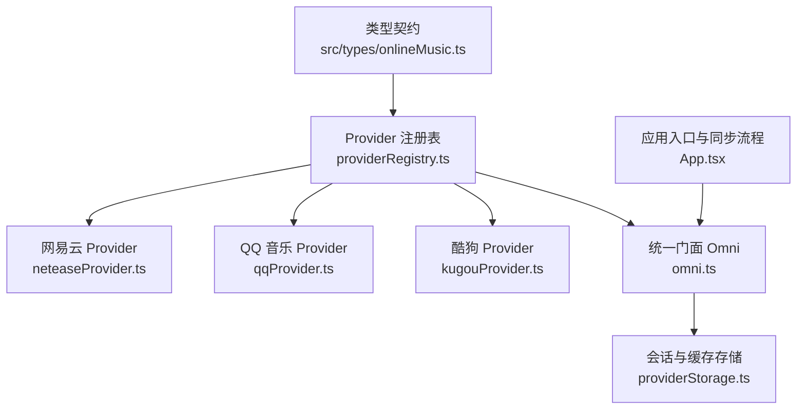
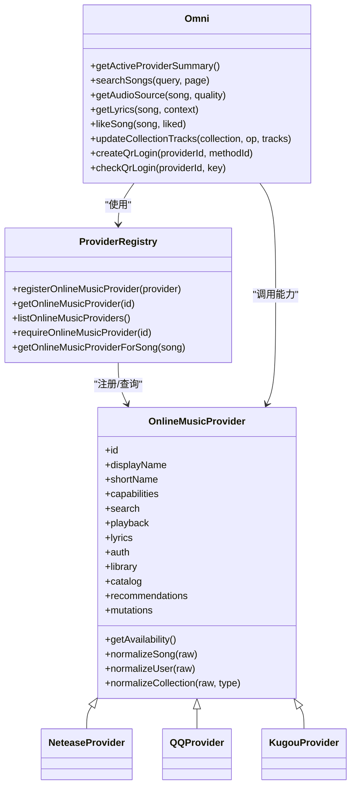
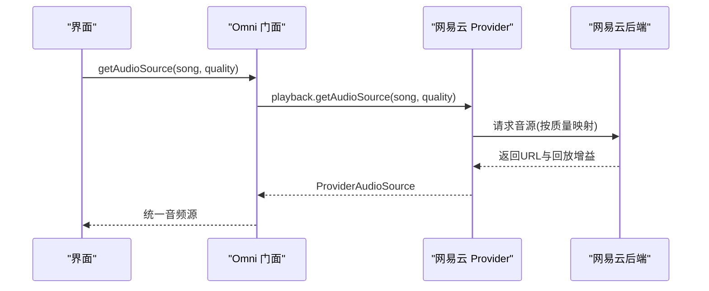
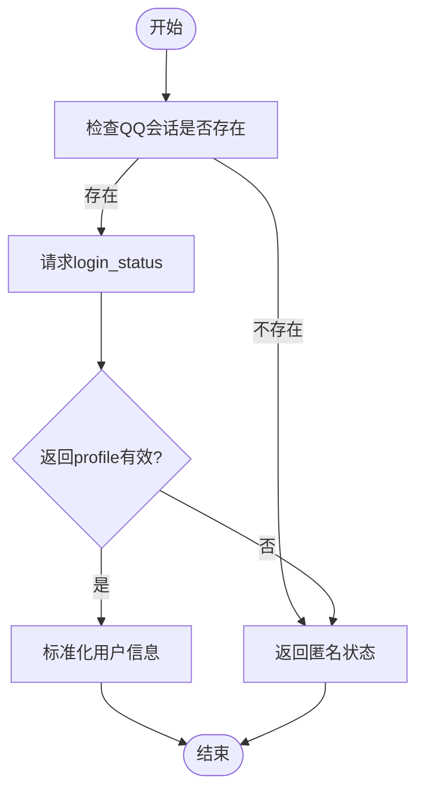
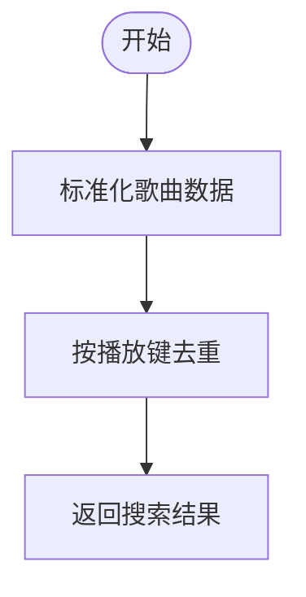
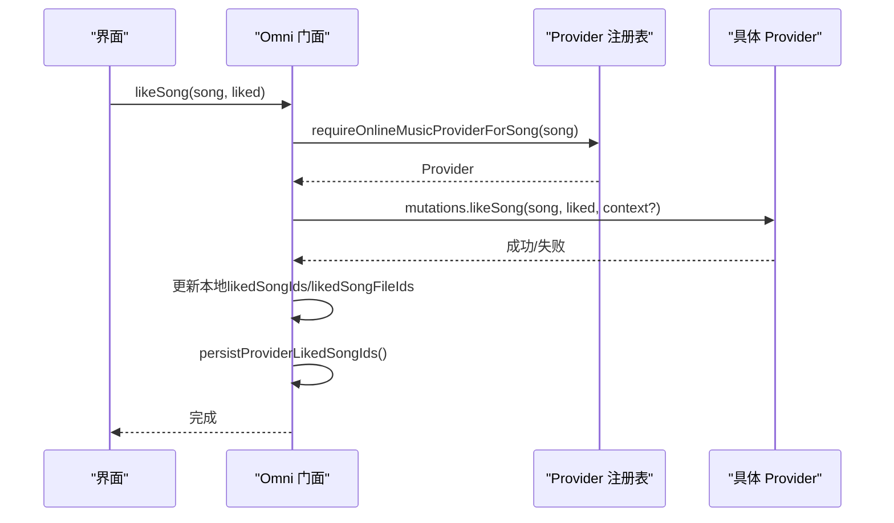
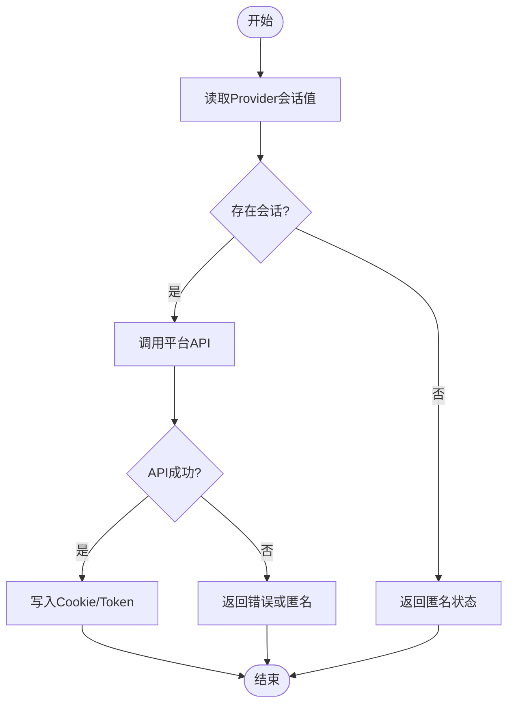
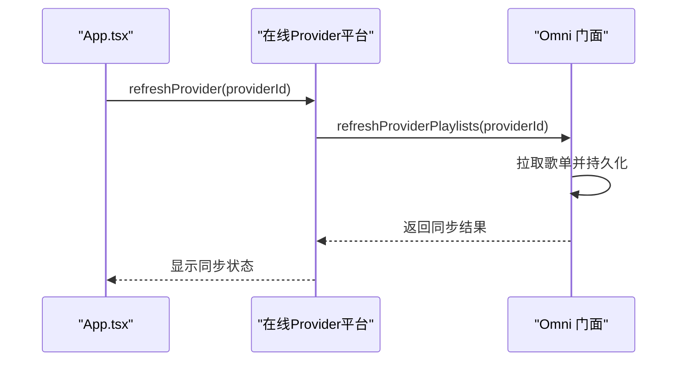
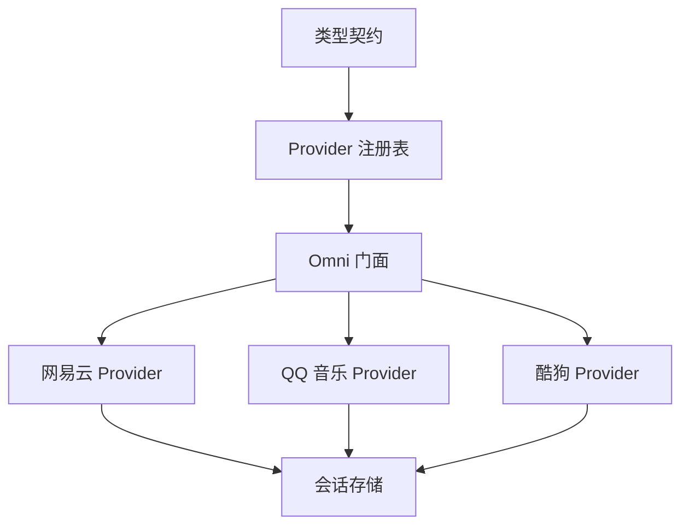

# 在线音乐服务

<cite>
**本文引用的文件**   
- [src/types/onlineMusic.ts](file://src/types/onlineMusic.ts)
- [src/services/onlineMusic/providerRegistry.ts](file://src/services/onlineMusic/providerRegistry.ts)
- [src/services/onlineMusic/omni.ts](file://src/services/onlineMusic/omni.ts)
- [src/services/onlineMusic/neteaseProvider.ts](file://src/services/onlineMusic/neteaseProvider.ts)
- [src/services/onlineMusic/qqProvider.ts](file://src/services/onlineMusic/qqProvider.ts)
- [src/services/onlineMusic/kugouProvider.ts](file://src/services/onlineMusic/kugouProvider.ts)
- [src/services/onlineMusic/providerStorage.ts](file://src/services/onlineMusic/providerStorage.ts)
- [src/App.tsx](file://src/App.tsx)
</cite>

## 目录
1. [引言](#引言)
2. [项目结构](#项目结构)
3. [核心组件](#核心组件)
4. [架构总览](#架构总览)
5. [详细组件分析](#详细组件分析)
6. [依赖关系分析](#依赖关系分析)
7. [性能与可用性](#性能与可用性)
8. [故障排查指南](#故障排查指南)
9. [结论](#结论)

## 引言
本技术文档面向 Folia Major 的在线音乐服务，重点说明“提供商适配器模式”的设计与实现：通过统一的 Omni 接口屏蔽网易云音乐、QQ 音乐、酷狗音乐等平台的差异，向上层 UI 和播放系统暴露一致的搜索、播放、歌词、收藏、歌单、推荐与认证能力。文档同时覆盖扫码登录、Cookie/会话管理、跨平台数据同步、错误处理与重试策略，以及第三方 API 集成的最佳实践。

## 项目结构
在线音乐相关代码主要位于 `src/services/onlineMusic` 与 `src/types/onlineMusic.ts`：
- 类型契约定义在统一类型文件中，所有 Provider 必须遵守。
- 每个音乐平台以独立 Provider 文件实现具体适配逻辑。
- `providerRegistry.ts` 负责注册与查找 Provider。
- `omni.ts` 提供统一门面，聚合搜索、播放、歌词、收藏、歌单、推荐、认证等能力。
- `providerStorage.ts` 提供按 Provider 隔离的本地会话与缓存读写。
- `App.tsx` 中集成在线 Provider 的数据同步流程。

**图示来源**
- [src/types/onlineMusic.ts:337-357](file://src/types/onlineMusic.ts#L337-L357)
- [src/services/onlineMusic/providerRegistry.ts:11-60](file://src/services/onlineMusic/providerRegistry.ts#L11-L60)
- [src/services/onlineMusic/omni.ts:105-177](file://src/services/onlineMusic/omni.ts#L105-L177)
- [src/services/onlineMusic/providerStorage.ts:6-54](file://src/services/onlineMusic/providerStorage.ts#L6-L54)
- [src/App.tsx:802-826](file://src/App.tsx#L802-L826)

**章节来源**
- [src/types/onlineMusic.ts:337-357](file://src/types/onlineMusic.ts#L337-L357)
- [src/services/onlineMusic/providerRegistry.ts:11-60](file://src/services/onlineMusic/providerRegistry.ts#L11-L60)
- [src/services/onlineMusic/omni.ts:105-177](file://src/services/onlineMusic/omni.ts#L105-L177)
- [src/services/onlineMusic/providerStorage.ts:6-54](file://src/services/onlineMusic/providerStorage.ts#L6-L54)
- [src/App.tsx:802-826](file://src/App.tsx#L802-L826)

## 核心组件
- 类型契约：定义 `OnlineMusicProvider`、`ProviderCapabilities`、`ProviderPage`、`ProviderAudioSource`、`ProviderCollection`、`QrLoginState`、`OnlineAuthProvider`、`OnlineLibraryProvider`、`OnlineCatalogProvider`、`OnlineRecommendationProvider`、`OnlineMutationProvider` 等统一接口。
- Provider 注册表：集中注册网易云、QQ、酷狗三个 Provider，并提供按歌曲来源路由到对应 Provider 的工具方法。
- Omni 门面：对外暴露统一 API，内部根据当前活跃 Provider 或歌曲所属 Provider 分发调用，并处理状态持久化、能力检查、异常转换。
- 各平台 Provider：分别实现搜索、播放、歌词、收藏、歌单、专辑、歌手、推荐、认证等能力。
- 会话存储：按 Provider 命名空间保存 Cookie、Token、UserId 等敏感信息。

**章节来源**
- [src/types/onlineMusic.ts:31-53](file://src/types/onlineMusic.ts#L31-L53)
- [src/types/onlineMusic.ts:74-87](file://src/types/onlineMusic.ts#L74-L87)
- [src/types/onlineMusic.ts:154-174](file://src/types/onlineMusic.ts#L154-L174)
- [src/types/onlineMusic.ts:176-277](file://src/types/onlineMusic.ts#L176-L277)
- [src/types/onlineMusic.ts:279-357](file://src/types/onlineMusic.ts#L279-L357)
- [src/services/onlineMusic/providerRegistry.ts:11-60](file://src/services/onlineMusic/providerRegistry.ts#L11-L60)
- [src/services/onlineMusic/omni.ts:105-177](file://src/services/onlineMusic/omni.ts#L105-L177)
- [src/services/onlineMusic/providerStorage.ts:6-54](file://src/services/onlineMusic/providerStorage.ts#L6-L54)

## 架构总览
整体采用“适配器 + 门面”的模式：
- 每种音乐平台实现一个 `OnlineMusicProvider`，将平台原始数据结构标准化为 `UnifiedSong`、`ProviderCollection` 等共享类型。
- `providerRegistry.ts` 维护 Provider 实例集合，支持按 ID 获取、按歌曲来源自动选择。
- `omni.ts` 作为统一门面，封装能力检测、分页、状态持久化、扩展钩子（如音频 URL 改写、歌词改写），并对上层隐藏平台差异。
- 认证流程由 `OnlineAuthProvider` 抽象，扫码登录状态机由 `QrLoginState` 描述，不同平台在各自 Provider 中实现细节。

**图示来源**
- [src/types/onlineMusic.ts:337-357](file://src/types/onlineMusic.ts#L337-L357)
- [src/services/onlineMusic/providerRegistry.ts:11-60](file://src/services/onlineMusic/providerRegistry.ts#L11-L60)
- [src/services/onlineMusic/omni.ts:105-177](file://src/services/onlineMusic/omni.ts#L105-L177)
- [src/services/onlineMusic/neteaseProvider.ts:231-259](file://src/services/onlineMusic/neteaseProvider.ts#L231-L259)
- [src/services/onlineMusic/qqProvider.ts:696-718](file://src/services/onlineMusic/qqProvider.ts#L696-L718)
- [src/services/onlineMusic/kugouProvider.ts:225-288](file://src/services/onlineMusic/kugouProvider.ts#L225-L288)

## 详细组件分析

### 网易云音乐 Provider
- 能力声明：搜索、播放、歌词、认证、用户库、歌单、专辑、歌手、推荐、变更操作、个人 FM 模式、逐字歌词、云盘、历史推荐、订阅、收藏、播放上报。
- 数据标准化：
  - 歌曲：`normalizeNeteaseSong` 将原始响应映射为 `UnifiedSong`，保留云盘标记、版权限制、资源状态等。
  - 用户：`normalizeUser` 提取昵称、头像、背景图、VIP 类型。
  - 集合：`normalizeCollection` 兼容多种字段名，填充封面、描述、作者、发布时间、播放次数、更新时间等。
- 搜索：调用云端搜索接口，返回分页结果。
- 播放：
  - 详情：`getSongDetail` 取第一条歌曲并标准化。
  - 音源：`getAudioSource` 根据质量偏好映射到平台音质参数，返回可播放 URL 与回放增益。
  - 可用性：`getAvailability` 根据是否被标记不可用返回状态与提示文案。
  - 替换：`getReplacement` 当歌曲不可用时尝试获取替代曲目。
- 歌词：优先走云盘歌词接口；否则走普通歌词接口，并解析主文本、逐字歌词、翻译、罗马音，同时拉取副歌区间。
- 认证：
  - 登录状态：校验登录与账户一致性，成功后写入 Cookie。
  - 登出：调用平台登出接口。
  - 扫码：获取二维码 Key、生成图片、轮询状态，确认时写入 Cookie，失败携带诊断信息。
- 用户库：获取歌单、喜欢歌曲、收藏专辑、云盘集合。
- 目录：歌单曲目、云盘曲目、专辑详情与曲目、歌手歌曲与专辑、订阅状态。
- 推荐：每日推荐、个人 FM、个性化歌单、历史日期与曲目、不喜欢推荐。
- 变更：点赞、更新歌单曲目、订阅歌单与专辑。

**图示来源**
- [src/services/onlineMusic/omni.ts:452-460](file://src/services/onlineMusic/omni.ts#L452-L460)
- [src/services/onlineMusic/neteaseProvider.ts:274-291](file://src/services/onlineMusic/neteaseProvider.ts#L274-L291)

**章节来源**
- [src/services/onlineMusic/neteaseProvider.ts:231-259](file://src/services/onlineMusic/neteaseProvider.ts#L231-L259)
- [src/services/onlineMusic/neteaseProvider.ts:266-309](file://src/services/onlineMusic/neteaseProvider.ts#L266-L309)
- [src/services/onlineMusic/neteaseProvider.ts:195-229](file://src/services/onlineMusic/neteaseProvider.ts#L195-L229)
- [src/services/onlineMusic/neteaseProvider.ts:341-386](file://src/services/onlineMusic/neteaseProvider.ts#L341-L386)
- [src/services/onlineMusic/neteaseProvider.ts:387-426](file://src/services/onlineMusic/neteaseProvider.ts#L387-L426)
- [src/services/onlineMusic/neteaseProvider.ts:427-496](file://src/services/onlineMusic/neteaseProvider.ts#L427-L496)
- [src/services/onlineMusic/neteaseProvider.ts:498-549](file://src/services/onlineMusic/neteaseProvider.ts#L498-L549)

### QQ 音乐 Provider
- 能力声明：搜索、播放、歌词、认证、用户库、歌单、专辑、歌手、逐字歌词、收藏、专辑列表。
- 数据标准化：通过 `normalizeQqSong`、`normalizeQqUser`、`normalizeQqCollection` 将 QQ 原始数据映射为标准类型。
- 搜索：复用歌词搜索路径，返回标准化歌曲列表。
- 播放：
  - 详情：`getSongDetail` 通过 songmid 获取详情。
  - 音源：`getAudioSource` 按质量回退策略尝试 128/320/flac，区分上游拒绝播放链接与网络异常。
  - 目录引用解析：`resolveQqSongCatalogRefs` 在需要导航时补全 album/singer mid。
- 歌词：委托现有 QRC 管线，返回主文本与纯音乐判断。
- 认证：
  - 登录状态：基于后端会话探测，无会话直接匿名。
  - 登出：调用登出接口并清理会话。
  - 扫码：支持 QQ 与微信通道，动态发现后端支持的 channel，轮询状态并在确认时写入 Cookie，支持取消二维码。
- 用户库：
  - 歌单：优先带凭据路由读取自建歌单，否则回落到匿名路径；对“我喜欢”使用专用路由。
  - 喜欢歌曲：分页拉取并标准化。
  - 专辑：分页拉取用户专辑。
- 目录：专辑详情与曲目、歌手详情与歌曲、歌手专辑。

**图示来源**
- [src/services/onlineMusic/qqProvider.ts:343-370](file://src/services/onlineMusic/qqProvider.ts#L343-L370)

**章节来源**
- [src/services/onlineMusic/qqProvider.ts:28-33](file://src/services/onlineMusic/qqProvider.ts#L28-L33)
- [src/services/onlineMusic/qqProvider.ts:219-239](file://src/services/onlineMusic/qqProvider.ts#L219-L239)
- [src/services/onlineMusic/qqProvider.ts:274-325](file://src/services/onlineMusic/qqProvider.ts#L274-L325)
- [src/services/onlineMusic/qqProvider.ts:327-341](file://src/services/onlineMusic/qqProvider.ts#L327-L341)
- [src/services/onlineMusic/qqProvider.ts:343-379](file://src/services/onlineMusic/qqProvider.ts#L343-L379)
- [src/services/onlineMusic/qqProvider.ts:381-491](file://src/services/onlineMusic/qqProvider.ts#L381-L491)
- [src/services/onlineMusic/qqProvider.ts:493-565](file://src/services/onlineMusic/qqProvider.ts#L493-L565)
- [src/services/onlineMusic/qqProvider.ts:567-694](file://src/services/onlineMusic/qqProvider.ts#L567-L694)
- [src/services/onlineMusic/qqProvider.ts:696-767](file://src/services/onlineMusic/qqProvider.ts#L696-L767)

### 酷狗音乐 Provider
- 能力声明：搜索、播放、歌词、认证、用户库、歌单、专辑、歌手、推荐、变更操作、收藏、云盘、历史推荐、订阅、播放上报。
- 数据标准化：
  - 歌曲：`normalizeKugouSong` 从多字段中提取 hash、标题、作者、专辑、时长，构造 `sourceRef` 与 providerData。
  - 用户：`normalizeUser` 兼容多种字段，必要时回退到会话中的 userId。
  - 集合：`normalizeCollection` 兼容歌单、专辑、歌手等多种实体，填充封面、描述、作者、发布时间、播放次数、更新时间等。
- 搜索：去重后返回标准化歌曲列表。
- 播放：
  - 音源：按质量回退策略尝试标准/高品/无损/高解，过滤无效协议 URL。
  - 目录引用解析：`resolveKugouSongCatalogRefs` 通过 KRM 元数据匹配 hash，补全专辑与歌手 canonical id。
- 歌词：先搜索候选，再拉取解码后的 KRC 文本，判断纯音乐与有效性，附带副歌区间。
- 认证：
  - 登录状态：基于会话探测，未认证则匿名。
  - 登出：清理会话值。
  - 扫码：支持多通道，动态发现后端支持的 channel，轮询状态并在确认时写入 Cookie，支持取消二维码。
- 用户库：
  - 歌单：混合用户库分页，区分专辑与歌单，过滤内置“我喜欢”。
  - 喜欢歌曲：分页拉取并标准化。
  - 专辑：分页拉取用户专辑。
- 目录：歌单曲目、专辑详情与曲目、歌手详情与歌曲、歌手专辑。
- 推荐：虚拟推荐卡片，缓存歌曲列表供虚拟歌单展示。
- 变更：点赞、更新歌单曲目、订阅歌单与专辑。

**图示来源**
- [src/services/onlineMusic/kugouProvider.ts:648-660](file://src/services/onlineMusic/kugouProvider.ts#L648-L660)

**章节来源**
- [src/services/onlineMusic/kugouProvider.ts:225-288](file://src/services/onlineMusic/kugouProvider.ts#L225-L288)
- [src/services/onlineMusic/kugouProvider.ts:450-462](file://src/services/onlineMusic/kugouProvider.ts#L450-L462)
- [src/services/onlineMusic/kugouProvider.ts:545-595](file://src/services/onlineMusic/kugouProvider.ts#L545-L595)
- [src/services/onlineMusic/kugouProvider.ts:648-660](file://src/services/onlineMusic/kugouProvider.ts#L648-L660)
- [src/services/onlineMusic/kugouProvider.ts:662-673](file://src/services/onlineMusic/kugouProvider.ts#L662-L673)
- [src/services/onlineMusic/kugouProvider.ts:711-760](file://src/services/onlineMusic/kugouProvider.ts#L711-L760)
- [src/services/onlineMusic/kugouProvider.ts:762-800](file://src/services/onlineMusic/kugouProvider.ts#L762-L800)

### 统一门面 Omni
- 活跃 Provider 切换保护：`withActiveProvider` 在活跃 Provider 切换时丢弃旧请求响应，避免状态错乱。
- 账号摘要：聚合 Provider 显示名、可用性、状态、用户、集合、错误、刷新状态。
- 搜索：按活跃 Provider 或指定 Provider 执行搜索。
- 认证：
  - 登录状态与登出：转发到对应 Provider。
  - 扫码：创建二维码、轮询状态、取消二维码、获取诊断信息、获取有效期。
- 用户库：
  - 歌单：分页拉取并持久化到账号快照。
  - 专辑：分页拉取。
  - 喜欢歌曲：拉取 ID 列表或完整歌曲。
  - 云盘：获取云盘集合。
- 推荐：每日推荐、个人 FM、个性化歌单、历史日期与曲目、不喜欢推荐。
- 播放：
  - 详情：按 Provider 拉取。
  - 音源：按 Provider 拉取，保存回放增益，并通过扩展钩子允许 URL 改写。
  - 可用性：按 Provider 判断。
  - 替换：按 Provider 获取替代曲目。
- 歌词：按 Provider 拉取，合并副歌区间，并通过扩展钩子允许歌词改写。
- 收藏与歌单：
  - 点赞：乐观更新本地状态，持久化账号快照，失败时丢弃可能失效的文件 ID。
  - 添加歌曲到歌单：校验来源与目标归属，调用 Provider 变更接口，刷新歌单列表。
  - 订阅：按集合类型调用订阅接口。
- 目录：专辑详情与曲目、歌手详情与歌曲/专辑、订阅状态。

**图示来源**
- [src/services/onlineMusic/omni.ts:593-634](file://src/services/onlineMusic/omni.ts#L593-L634)
- [src/services/onlineMusic/providerRegistry.ts:40-56](file://src/services/onlineMusic/providerRegistry.ts#L40-L56)

**章节来源**
- [src/services/onlineMusic/omni.ts:92-103](file://src/services/onlineMusic/omni.ts#L92-L103)
- [src/services/onlineMusic/omni.ts:113-177](file://src/services/onlineMusic/omni.ts#L113-L177)
- [src/services/onlineMusic/omni.ts:179-247](file://src/services/onlineMusic/omni.ts#L179-L247)
- [src/services/onlineMusic/omni.ts:249-304](file://src/services/onlineMusic/omni.ts#L249-L304)
- [src/services/onlineMusic/omni.ts:306-372](file://src/services/onlineMusic/omni.ts#L306-L372)
- [src/services/onlineMusic/omni.ts:374-442](file://src/services/onlineMusic/omni.ts#L374-L442)
- [src/services/onlineMusic/omni.ts:444-500](file://src/services/onlineMusic/omni.ts#L444-L500)
- [src/services/onlineMusic/omni.ts:502-565](file://src/services/onlineMusic/omni.ts#L502-L565)
- [src/services/onlineMusic/omni.ts:567-655](file://src/services/onlineMusic/omni.ts#L567-L655)

### 会话与认证机制
- 会话存储：`providerStorage.ts` 提供按 Provider 命名空间的 localStorage 读写，支持旧键迁移。
- 网易云：
  - 登录状态校验成功后写入 Cookie。
  - 扫码确认后写入 Cookie，失败携带诊断信息。
- QQ 音乐：
  - 登录状态基于后端会话探测，无会话即匿名。
  - 扫码确认后写入 Cookie，支持取消二维码。
- 酷狗音乐：
  - 会话值包括 Token、UserId 等，用于后续 API 调用。
  - 扫码确认后写入 Cookie，支持取消二维码。

**图示来源**
- [src/services/onlineMusic/providerStorage.ts:33-54](file://src/services/onlineMusic/providerStorage.ts#L33-L54)
- [src/services/onlineMusic/neteaseProvider.ts:341-386](file://src/services/onlineMusic/neteaseProvider.ts#L341-L386)
- [src/services/onlineMusic/qqProvider.ts:343-379](file://src/services/onlineMusic/qqProvider.ts#L343-L379)
- [src/services/onlineMusic/kugouProvider.ts:450-462](file://src/services/onlineMusic/kugouProvider.ts#L450-L462)

**章节来源**
- [src/services/onlineMusic/providerStorage.ts:6-54](file://src/services/onlineMusic/providerStorage.ts#L6-L54)
- [src/services/onlineMusic/neteaseProvider.ts:341-386](file://src/services/onlineMusic/neteaseProvider.ts#L341-L386)
- [src/services/onlineMusic/qqProvider.ts:343-379](file://src/services/onlineMusic/qqProvider.ts#L343-L379)
- [src/services/onlineMusic/kugouProvider.ts:450-462](file://src/services/onlineMusic/kugouProvider.ts#L450-L462)

### 数据同步机制
- 应用入口 `App.tsx` 中集成在线 Provider 的数据同步流程：
  - 网易云使用专用同步逻辑。
  - 其他 Provider 通过 `refreshProvider` 刷新账号数据，包括歌单、喜欢歌曲等。
  - 同步失败时显示错误消息，成功时显示成功消息。
- Omni 在点赞、添加歌曲到歌单等操作后主动刷新歌单列表，确保 UI 与后端一致。

**图示来源**
- [src/App.tsx:802-826](file://src/App.tsx#L802-L826)
- [src/services/onlineMusic/omni.ts:259-304](file://src/services/onlineMusic/omni.ts#L259-L304)

**章节来源**
- [src/App.tsx:802-826](file://src/App.tsx#L802-L826)
- [src/services/onlineMusic/omni.ts:259-304](file://src/services/onlineMusic/omni.ts#L259-L304)

## 依赖关系分析
- 类型契约是所有 Provider 的基础，确保数据一致性。
- Provider 注册表集中管理 Provider 实例，避免分散初始化。
- Omni 门面依赖注册表与 Provider，向上层提供统一 API。
- 各 Provider 依赖各自的 Transport 层（如 `neteaseApi`、`requestQq`、`requestKugou`）进行网络请求。
- 会话存储为所有 Provider 提供统一的本地存储能力。

**图示来源**
- [src/types/onlineMusic.ts:337-357](file://src/types/onlineMusic.ts#L337-L357)
- [src/services/onlineMusic/providerRegistry.ts:11-60](file://src/services/onlineMusic/providerRegistry.ts#L11-L60)
- [src/services/onlineMusic/omni.ts:105-177](file://src/services/onlineMusic/omni.ts#L105-L177)
- [src/services/onlineMusic/providerStorage.ts:6-54](file://src/services/onlineMusic/providerStorage.ts#L6-L54)

**章节来源**
- [src/types/onlineMusic.ts:337-357](file://src/types/onlineMusic.ts#L337-L357)
- [src/services/onlineMusic/providerRegistry.ts:11-60](file://src/services/onlineMusic/providerRegistry.ts#L11-L60)
- [src/services/onlineMusic/omni.ts:105-177](file://src/services/onlineMusic/omni.ts#L105-L177)
- [src/services/onlineMusic/providerStorage.ts:6-54](file://src/services/onlineMusic/providerStorage.ts#L6-L54)

## 性能与可用性
- 去重与缓存：
  - 酷狗搜索去重基于播放键，避免重复条目。
  - QQ 歌曲详情请求按 songmid 去重，避免并发重复请求。
  - 网易云与酷狗对副歌区间进行内存缓存，减少重复请求。
- 质量回退：
  - QQ 与酷狗均实现质量回退策略，提升播放成功率。
- 分页优化：
  - 各 Provider 的分页逻辑考虑后端 total 与实际返回数量，避免空页死循环。
- 活跃 Provider 切换保护：
  - Omni 在活跃 Provider 切换时丢弃旧请求响应，避免状态错乱。

**章节来源**
- [src/services/onlineMusic/kugouProvider.ts:648-660](file://src/services/onlineMusic/kugouProvider.ts#L648-L660)
- [src/services/onlineMusic/qqProvider.ts:227-239](file://src/services/onlineMusic/qqProvider.ts#L227-L239)
- [src/services/onlineMusic/neteaseProvider.ts:114-132](file://src/services/onlineMusic/neteaseProvider.ts#L114-L132)
- [src/services/onlineMusic/kugouProvider.ts:679-709](file://src/services/onlineMusic/kugouProvider.ts#L679-L709)
- [src/services/onlineMusic/omni.ts:92-103](file://src/services/onlineMusic/omni.ts#L92-L103)

## 故障排查指南
- 认证失败：
  - 检查会话是否存在，必要时重新扫码登录。
  - 查看平台返回的错误码，区分未登录、权限不足、风控等。
- 播放失败：
  - 检查音源 URL 是否有效，注意协议与域名。
  - 查看质量回退是否触发，确认平台是否支持所选音质。
- 歌词加载失败：
  - 检查歌词搜索候选是否找到，确认歌词格式是否有效。
  - 对于纯音乐，歌词可能为空或纯文本。
- 收藏与歌单操作失败：
  - 检查 Provider 是否支持相应变更操作。
  - 查看本地状态是否同步，必要时手动刷新歌单列表。
- 数据同步失败：
  - 检查网络连接与后端可用性。
  - 查看同步日志，确认具体失败的 API 调用。

**章节来源**
- [src/services/onlineMusic/neteaseProvider.ts:341-386](file://src/services/onlineMusic/neteaseProvider.ts#L341-L386)
- [src/services/onlineMusic/qqProvider.ts:343-379](file://src/services/onlineMusic/qqProvider.ts#L343-L379)
- [src/services/onlineMusic/kugouProvider.ts:450-462](file://src/services/onlineMusic/kugouProvider.ts#L450-L462)
- [src/services/onlineMusic/omni.ts:259-304](file://src/services/onlineMusic/omni.ts#L259-L304)

## 结论
Folia Major 的在线音乐服务通过统一的类型契约、Provider 适配器与 Omni 门面，实现了多平台音乐服务的无缝集成。网易云、QQ 音乐、酷狗音乐等平台在认证、播放、歌词、收藏、歌单等方面各有差异，但通过标准化数据与统一 API，上层应用无需关心底层实现细节。会话存储与数据同步机制确保了用户体验的一致性与数据的准确性。未来可扩展更多平台，只需实现 `OnlineMusicProvider` 接口并注册到 `providerRegistry` 即可。