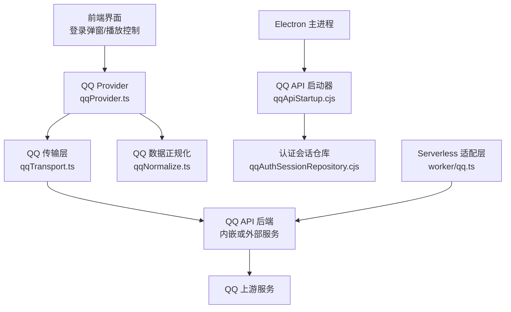
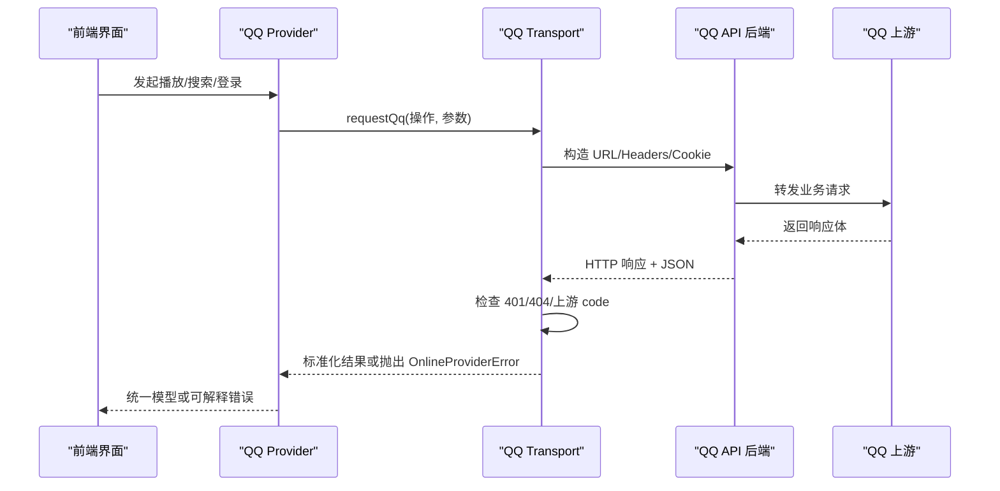
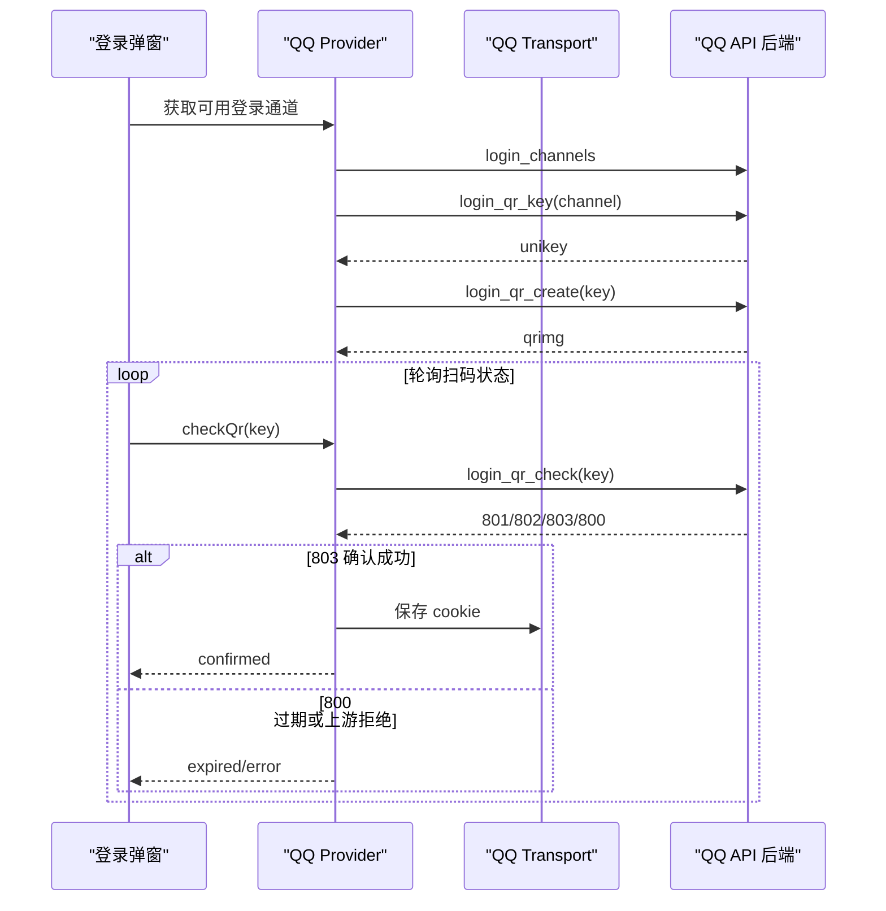
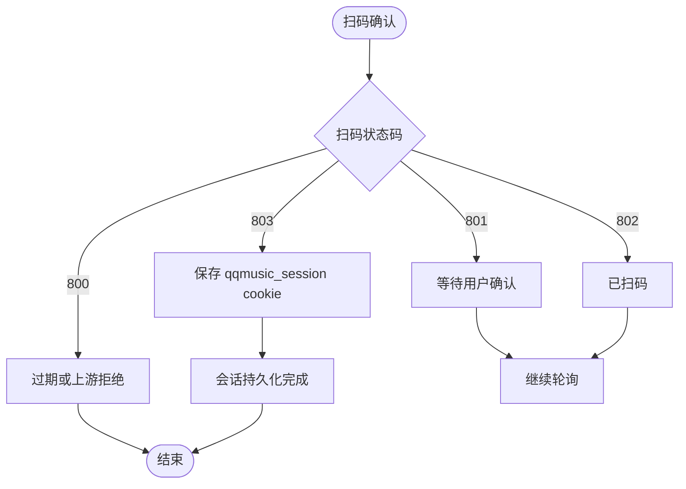
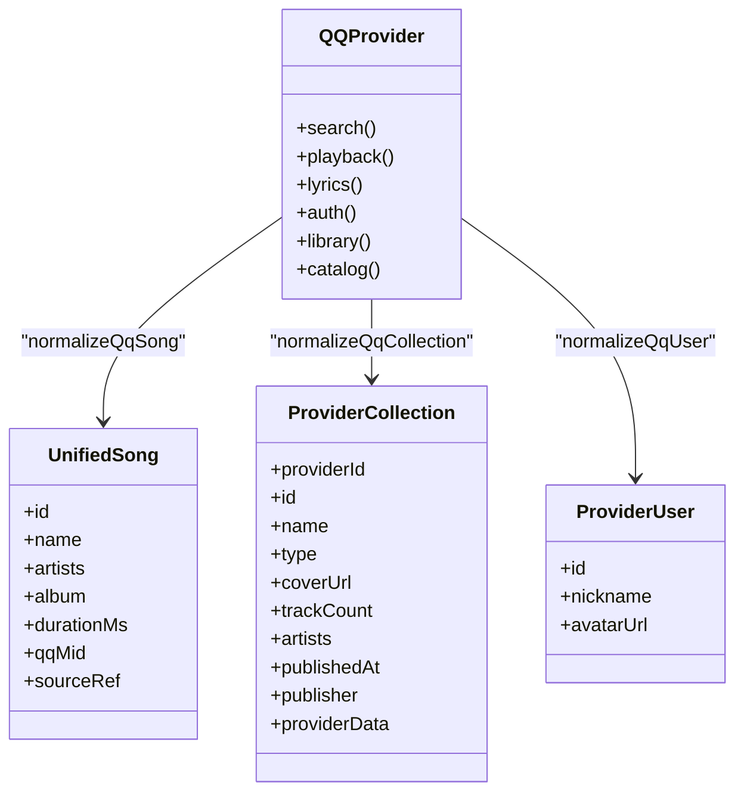
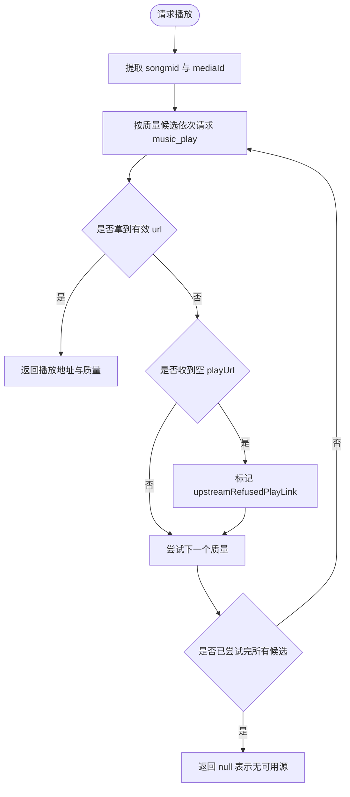
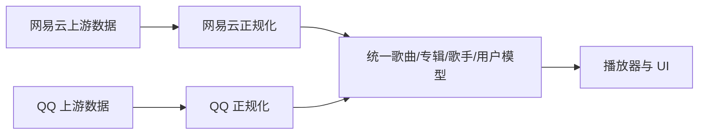
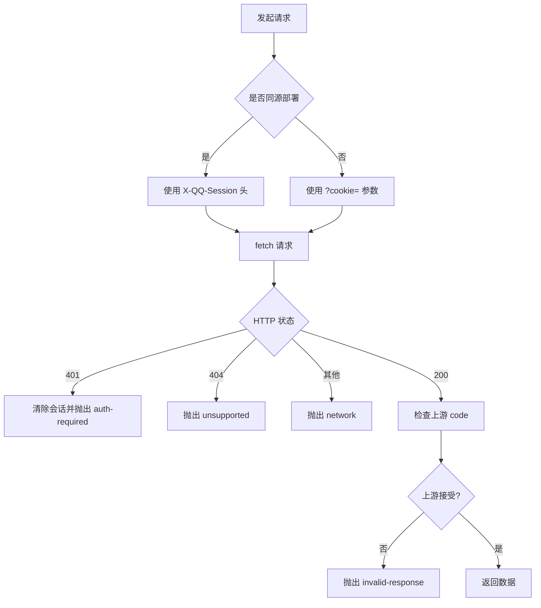
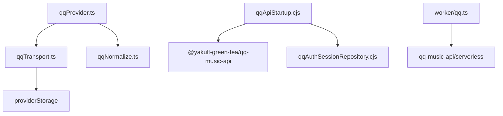
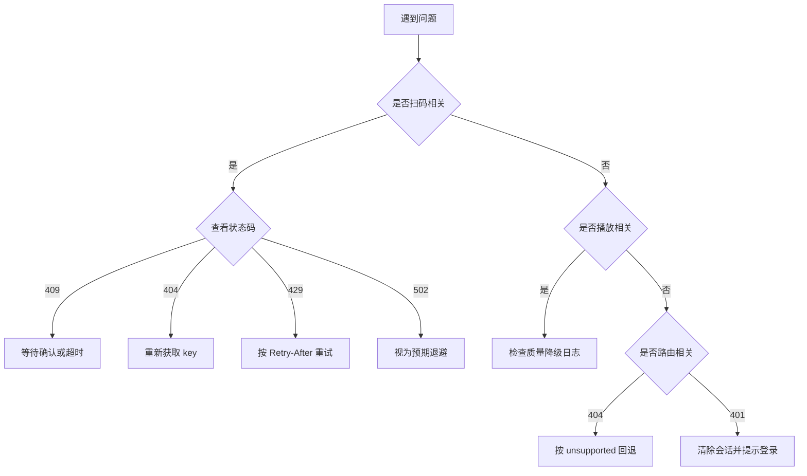

# QQ音乐集成

<cite>
**本文引用的文件**   
- [worker/qq.ts](file://worker/qq.ts)
- [electron/qqAuthSessionRepository.cjs](file://electron/qqAuthSessionRepository.cjs)
- [electron/qqApiStartup.cjs](file://electron/qqApiStartup.cjs)
- [src/services/onlineMusic/qqProvider.ts](file://src/services/onlineMusic/qqProvider.ts)
- [src/services/onlineMusic/qqTransport.ts](file://src/services/onlineMusic/qqTransport.ts)
- [src/services/onlineMusic/qqNormalize.ts](file://src/services/onlineMusic/qqNormalize.ts)
- [deploy/docker/qq-api/README.md](file://deploy/docker/qq-api/README.md)
- [src/services/netease.ts](file://src/services/netease.ts)
</cite>

## 目录
1. [引言](#引言)
2. [项目结构](#项目结构)
3. [核心组件](#核心组件)
4. [架构总览](#架构总览)
5. [详细组件分析](#详细组件分析)
6. [依赖关系分析](#依赖关系分析)
7. [性能与兼容性考量](#性能与兼容性考量)
8. [故障排查指南](#故障排查指南)
9. [结论](#结论)

## 引言
本文件面向需要在 Folia Major 中集成 QQ 音乐能力的开发者，系统性说明以下目标：
- QQ 音乐的认证机制：二维码登录、扫码验证、会话保持。
- 音乐资源获取：歌曲详情、歌单/专辑/歌手数据、歌词。
- 播放链接解析与质量降级策略。
- 版权信息处理与 VIP/独家内容的行为差异。
- 与网易云数据的映射思路，确保跨平台体验一致。
- QQ API 的特殊限制、错误码处理与降级方案。

## 项目结构
QQ 音乐集成由前端 Provider、传输层、规范化模块、Electron 内嵌服务以及 Serverless 适配层共同组成：
- `src/services/onlineMusic/qqProvider.ts`：对外暴露统一的在线音乐 Provider 接口，封装搜索、播放、歌词、用户库、认证等能力。
- `src/services/onlineMusic/qqTransport.ts`：负责请求路由、会话注入、上游状态检查、错误分类。
- `src/services/onlineMusic/qqNormalize.ts`：将 QQ 上游数据结构统一为应用内部模型。
- `electron/qqApiStartup.cjs` 与 `electron/qqAuthSessionRepository.cjs`：在 Electron 主进程启动内嵌 QQ API 并安全持久化认证会话。
- `worker/qq.ts`：Cloudflare/Vercel 等 Serverless 环境的接入层，把宿主前缀还原为后端路径，并可选接入 Durable Object 二维码通道。
- `deploy/docker/qq-api/README.md`：部署端常见错误码与多实例注意事项。

**图表来源**
- [src/services/onlineMusic/qqProvider.ts:28-33](file://src/services/onlineMusic/qqProvider.ts#L28-L33)
- [src/services/onlineMusic/qqTransport.ts:17-41](file://src/services/onlineMusic/qqTransport.ts#L17-L41)
- [electron/qqApiStartup.cjs:60-104](file://electron/qqApiStartup.cjs#L60-L104)
- [electron/qqAuthSessionRepository.cjs:28-77](file://electron/qqAuthSessionRepository.cjs#L28-L77)
- [worker/qq.ts:105-127](file://worker/qq.ts#L105-L127)

**章节来源**
- [src/services/onlineMusic/qqProvider.ts:1-20](file://src/services/onlineMusic/qqProvider.ts#L1-L20)
- [src/services/onlineMusic/qqTransport.ts:1-15](file://src/services/onlineMusic/qqTransport.ts#L1-L15)
- [electron/qqApiStartup.cjs:1-10](file://electron/qqApiStartup.cjs#L1-L10)
- [electron/qqAuthSessionRepository.cjs:1-10](file://electron/qqAuthSessionRepository.cjs#L1-L10)
- [worker/qq.ts:1-15](file://worker/qq.ts#L1-L15)

## 核心组件
- QQ Provider：统一对外能力，包括搜索、播放、歌词、认证、用户库、专辑/歌手导航。
- QQ Transport：构建请求、选择同源或跨源会话传递方式、统一错误类型、检测上游拒绝。
- QQ Normalize：把 QQ 上游字段映射到统一歌曲、专辑、歌手、用户、歌单模型。
- Electron 启动器：在 Electron 主进程启动内嵌 QQ API，注入环境变量与会话仓库。
- Serverless 适配层：把 `/api/qq` 下的请求交给后端 serverless handler，可选绑定二维码通道。

**章节来源**
- [src/services/onlineMusic/qqProvider.ts:696-767](file://src/services/onlineMusic/qqProvider.ts#L696-L767)
- [src/services/onlineMusic/qqTransport.ts:207-262](file://src/services/onlineMusic/qqTransport.ts#L207-L262)
- [src/services/onlineMusic/qqNormalize.ts:92-153](file://src/services/onlineMusic/qqNormalize.ts#L92-L153)
- [electron/qqApiStartup.cjs:67-157](file://electron/qqApiStartup.cjs#L67-L157)
- [worker/qq.ts:109-134](file://worker/qq.ts#L109-L134)

## 架构总览
QQ 音乐集成采用“Provider + Transport + Normalize”的三层结构，并在 Electron 和 Serverless 两个运行环境中分别提供会话持久化和二维码通道支持。

**图表来源**
- [src/services/onlineMusic/qqProvider.ts:274-325](file://src/services/onlineMusic/qqProvider.ts#L274-L325)
- [src/services/onlineMusic/qqTransport.ts:207-262](file://src/services/onlineMusic/qqTransport.ts#L207-L262)

## 详细组件分析

### 认证机制：二维码登录、扫码验证、会话保持
QQ 认证流程由 Provider 暴露登录方法，Transport 负责会话存储与注入，Electron 或 Serverless 环境负责凭证持久化与二维码通道。

#### 登录能力与扫码流程
- Provider 暴露 `getQrLoginMethods`、`resolveQrLoginMethods`、`getQrKey`、`createQr`、`checkQr`、`cancelQr`。
- 扫码状态码映射：等待、已扫码、确认成功、过期、上游拒绝。
- 确认成功后，Transport 会把后端返回的 `cookie` 写入 Provider 会话存储。

**图表来源**
- [src/services/onlineMusic/qqProvider.ts:381-491](file://src/services/onlineMusic/qqProvider.ts#L381-L491)
- [src/services/onlineMusic/qqTransport.ts:160-164](file://src/services/onlineMusic/qqTransport.ts#L160-L164)

#### 会话保持与安全性
- Web 环境：会话以 `qqmusic_session=<token>` 形式保存在 Provider 存储；同源部署时通过 `X-QQ-Session` 头发送裸 token，避免把密封 token 放入 URL。
- Electron 环境：主进程使用 `safeStorage` 加密持久化服务端凭据，渲染进程只持有不透明 token。
- Serverless 环境：未配置 `QQ_SESSION_SECRET` 时登录路由返回 501，曲库路由仍可工作。

**图表来源**
- [src/services/onlineMusic/qqProvider.ts:467-491](file://src/services/onlineMusic/qqProvider.ts#L467-L491)
- [src/services/onlineMusic/qqTransport.ts:89-113](file://src/services/onlineMusic/qqTransport.ts#L89-L113)
- [electron/qqAuthSessionRepository.cjs:28-77](file://electron/qqAuthSessionRepository.cjs#L28-L77)

**章节来源**
- [src/services/onlineMusic/qqProvider.ts:343-379](file://src/services/onlineMusic/qqProvider.ts#L343-L379)
- [src/services/onlineMusic/qqProvider.ts:381-491](file://src/services/onlineMusic/qqProvider.ts#L381-L491)
- [src/services/onlineMusic/qqTransport.ts:89-113](file://src/services/onlineMusic/qqTransport.ts#L89-L113)
- [electron/qqAuthSessionRepository.cjs:1-84](file://electron/qqAuthSessionRepository.cjs#L1-L84)
- [worker/qq.ts:17-29](file://worker/qq.ts#L17-L29)

### 音乐资源获取与数据正规化
Provider 通过 Transport 调用 QQ 后端，再经 Normalize 转换为统一模型。

- 歌曲详情：`song_info` 返回 `track_info`，Provider 用 `normalizeQqSong` 生成统一歌曲对象。
- 歌单：优先带凭据路由读取自建歌单，否则回退匿名路由；收藏歌单走匿名路由以保证完整性。
- 专辑与歌手：`album_info`、`artist_songs`、`artist_albums` 均经过正规化，保留 `catalogRef` 以便导航。
- 歌词：复用现有 QQ 歌词提供者，按 `qqMid` 与 `songId` 拉取。

**图表来源**
- [src/services/onlineMusic/qqProvider.ts:219-272](file://src/services/onlineMusic/qqProvider.ts#L219-L272)
- [src/services/onlineMusic/qqNormalize.ts:92-153](file://src/services/onlineMusic/qqNormalize.ts#L92-L153)
- [src/services/onlineMusic/qqNormalize.ts:232-331](file://src/services/onlineMusic/qqNormalize.ts#L232-L331)
- [src/services/onlineMusic/qqNormalize.ts:168-192](file://src/services/onlineMusic/qqNormalize.ts#L168-L192)

**章节来源**
- [src/services/onlineMusic/qqProvider.ts:219-272](file://src/services/onlineMusic/qqProvider.ts#L219-L272)
- [src/services/onlineMusic/qqProvider.ts:493-565](file://src/services/onlineMusic/qqProvider.ts#L493-L565)
- [src/services/onlineMusic/qqProvider.ts:567-694](file://src/services/onlineMusic/qqProvider.ts#L567-L694)
- [src/services/onlineMusic/qqNormalize.ts:92-153](file://src/services/onlineMusic/qqNormalize.ts#L92-L153)
- [src/services/onlineMusic/qqNormalize.ts:232-331](file://src/services/onlineMusic/qqNormalize.ts#L232-L331)

### 播放链接解析与质量降级
播放链路会尝试多个质量档位，遇到空播放链接或上游拒绝时进行降级。

- 质量候选：标准、高音质、无损、Hi-Res（当前后端仅暴露 FLAC）。
- 失败分支：网络错误记录警告；`auth-required` 直接向上抛出；空播放链接标记为上游拒绝。
- 最终结果：若所有候选都失败，返回 null，上层可提示不可播放。

**图表来源**
- [src/services/onlineMusic/qqProvider.ts:35-55](file://src/services/onlineMusic/qqProvider.ts#L35-L55)
- [src/services/onlineMusic/qqProvider.ts:274-325](file://src/services/onlineMusic/qqProvider.ts#L274-L325)

**章节来源**
- [src/services/onlineMusic/qqProvider.ts:35-55](file://src/services/onlineMusic/qqProvider.ts#L35-L55)
- [src/services/onlineMusic/qqProvider.ts:274-325](file://src/services/onlineMusic/qqProvider.ts#L274-L325)

### 版权信息与 VIP/独家内容处理
当前代码对 QQ 侧的版权判断主要体现为“播放链接为空但 HTTP 200”的上游拒绝场景，而不是显式的 VIP 字段。

- 当账号不具备播放权限（会员、地区、下架）时，后端可能返回空 `url` 并附带 `error` 字符串。
- Provider 区分“请求失败”和“上游拒绝”，避免把不可播歌曲误判为临时错误重试。
- 对于网易云侧，系统有明确的不可用歌曲替换逻辑与版权推荐接口，可作为跨平台一致性参考。

建议后续扩展：
- 若 QQ 上游返回明确版权字段，可在 `normalizeQqSong` 中补充 `privilege` 或 `copyright` 标记。
- 在 UI 层根据标记显示“需要会员”“地区受限”“暂无版权”等提示。

**章节来源**
- [src/services/onlineMusic/qqProvider.ts:282-325](file://src/services/onlineMusic/qqProvider.ts#L282-L325)
- [src/services/netease.ts:397-444](file://src/services/netease.ts#L397-L444)

### 与网易云数据的映射关系
为保证用户体验一致性，本项目对网易云与 QQ 的数据分别正规化后进入统一模型：
- 网易云侧：歌曲详情、版权推荐、不可用替换逻辑集中在 `netease.ts`。
- QQ 侧：通过 `qqNormalize.ts` 把上游字段映射到统一歌曲、专辑、歌手、用户、歌单结构。
- 统一模型中的 `sourceRef.providerId` 用于区分来源，上层播放器与 UI 无需关心具体平台差异。

**图表来源**
- [src/services/netease.ts:397-444](file://src/services/netease.ts#L397-L444)
- [src/services/onlineMusic/qqNormalize.ts:92-153](file://src/services/onlineMusic/qqNormalize.ts#L92-L153)

**章节来源**
- [src/services/netease.ts:397-444](file://src/services/netease.ts#L397-L444)
- [src/services/onlineMusic/qqNormalize.ts:92-153](file://src/services/onlineMusic/qqNormalize.ts#L92-L153)

### QQ API 特殊限制与兼容性处理
- 同源与跨源会话传递：同源使用 `X-QQ-Session` 头，跨源使用 `?cookie=`。
- 旧后端兼容：`login_channels`、`user_playlist_detail` 等路由可能不存在，Transport 将 404 转为 `unsupported`，Provider 据此回退。
- 上游拒绝仍返回 HTTP 200：专辑、歌单、歌手路由的状态码藏在响应体中，Transport 通过 `assertUpstreamAccepted` 抛出 `invalid-response`。
- 扫码通道能力发现：Provider 先探测后端支持的通道，再决定 UI 展示哪些登录方式。

**图表来源**
- [src/services/onlineMusic/qqTransport.ts:95-113](file://src/services/onlineMusic/qqTransport.ts#L95-L113)
- [src/services/onlineMusic/qqTransport.ts:123-158](file://src/services/onlineMusic/qqTransport.ts#L123-L158)
- [src/services/onlineMusic/qqTransport.ts:207-262](file://src/services/onlineMusic/qqTransport.ts#L207-L262)

**章节来源**
- [src/services/onlineMusic/qqTransport.ts:95-113](file://src/services/onlineMusic/qqTransport.ts#L95-L113)
- [src/services/onlineMusic/qqTransport.ts:123-158](file://src/services/onlineMusic/qqTransport.ts#L123-L158)
- [src/services/onlineMusic/qqTransport.ts:207-262](file://src/services/onlineMusic/qqTransport.ts#L207-L262)

## 依赖关系分析
- Provider 依赖 Transport 进行网络访问，依赖 Normalize 进行数据转换。
- Transport 依赖 Provider 会话存储，同时依赖运行时环境决定后端地址。
- Electron 启动器依赖 QQ API 包暴露的 `server` 与可选的 `configureAuthSessionRepository`。
- Serverless 适配层依赖 `@yakult-green-tea/qq-music-api/serverless`，并可注入 Durable Object 二维码通道。

**图表来源**
- [src/services/onlineMusic/qqProvider.ts:1-20](file://src/services/onlineMusic/qqProvider.ts#L1-L20)
- [src/services/onlineMusic/qqTransport.ts:1-3](file://src/services/onlineMusic/qqTransport.ts#L1-L3)
- [electron/qqApiStartup.cjs:6-10](file://electron/qqApiStartup.cjs#L6-L10)
- [electron/qqAuthSessionRepository.cjs:1-10](file://electron/qqAuthSessionRepository.cjs#L1-L10)
- [worker/qq.ts:1-15](file://worker/qq.ts#L1-L15)

**章节来源**
- [src/services/onlineMusic/qqProvider.ts:1-20](file://src/services/onlineMusic/qqProvider.ts#L1-L20)
- [src/services/onlineMusic/qqTransport.ts:1-15](file://src/services/onlineMusic/qqTransport.ts#L1-L15)
- [electron/qqApiStartup.cjs:6-10](file://electron/qqApiStartup.cjs#L6-L10)
- [electron/qqAuthSessionRepository.cjs:1-10](file://electron/qqAuthSessionRepository.cjs#L1-L10)
- [worker/qq.ts:1-15](file://worker/qq.ts#L1-L15)

## 性能与兼容性考量
- 歌曲详情去重：同一首歌的专辑与歌手详情页可能重复触发解析，Provider 用 Map 缓存 Promise，避免重复请求。
- 歌单分页优化：带凭据的歌单路由支持真正的分页，匿名路由则本地切片，减少无效翻页。
- 质量降级顺序：从高质量到低质量依次尝试，避免频繁失败导致卡顿。
- 后端路由能力探测：`login_channels` 与 `user_playlist_detail` 的 404 被当作能力缺失而非错误，避免整个会话粘住。
- Electron 端口探测：Transport 在 Electron 环境下动态读取内嵌服务端口，避免硬编码。

**章节来源**
- [src/services/onlineMusic/qqProvider.ts:227-239](file://src/services/onlineMusic/qqProvider.ts#L227-L239)
- [src/services/onlineMusic/qqProvider.ts:186-217](file://src/services/onlineMusic/qqProvider.ts#L186-L217)
- [src/services/onlineMusic/qqProvider.ts:274-325](file://src/services/onlineMusic/qqProvider.ts#L274-L325)
- [src/services/onlineMusic/qqTransport.ts:57-87](file://src/services/onlineMusic/qqTransport.ts#L57-L87)

## 故障排查指南
- 扫码 409：已有二维码正在确认或对同一 key 重复创建；应等待确认完成或超时。
- 扫码 404：二维码会话不存在或过期；重新获取新 key。
- 扫码 429：建立会话前的指数退避；按 `Retry-After` 等待重试。
- 扫码 502：装置注册或二维码创建向上游失败；首次附 `Retry-After`，随后转 429。
- 登录 401：会话缺失、过期或被拒绝；Transport 会清除会话并抛出 `auth-required`。
- 曲库 404：后端没有该路由；Provider 应回退到兼容路径。
- 歌单空白：可能是匿名路由无法读取非公开歌单；需使用带凭据路由或提示用户授权。

**图表来源**
- [deploy/docker/qq-api/README.md:185-194](file://deploy/docker/qq-api/README.md#L185-L194)
- [src/services/onlineMusic/qqTransport.ts:234-252](file://src/services/onlineMusic/qqTransport.ts#L234-L252)

**章节来源**
- [deploy/docker/qq-api/README.md:185-194](file://deploy/docker/qq-api/README.md#L185-L194)
- [src/services/onlineMusic/qqTransport.ts:234-252](file://src/services/onlineMusic/qqTransport.ts#L234-L252)

## 结论
QQ 音乐集成在本项目中通过 Provider、Transport、Normalize 三层解耦，既保证了与网易云等其他平台的统一体验，又妥善处理了 QQ 上游的特殊限制。认证方面支持二维码登录与扫码验证，并通过 Electron 安全持久化与会话注入实现会话保持；播放方面通过质量降级与上游拒绝识别提升鲁棒性；数据方面通过正规化保证跨平台一致性。未来可在版权字段与 VIP 标识上进一步细化，使不可播原因对用户更透明。