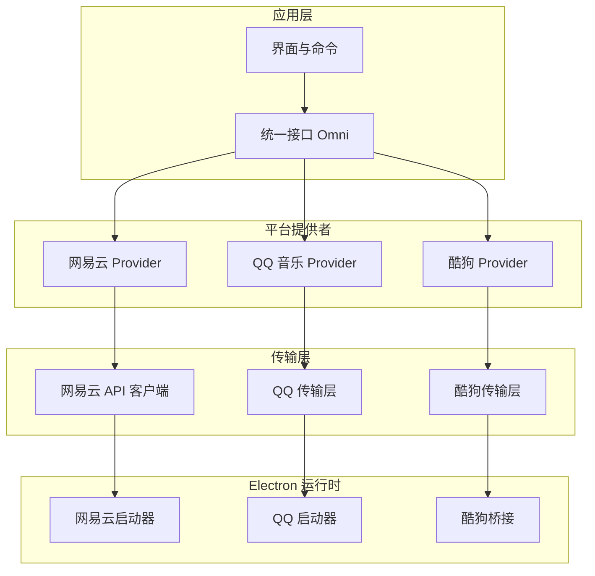
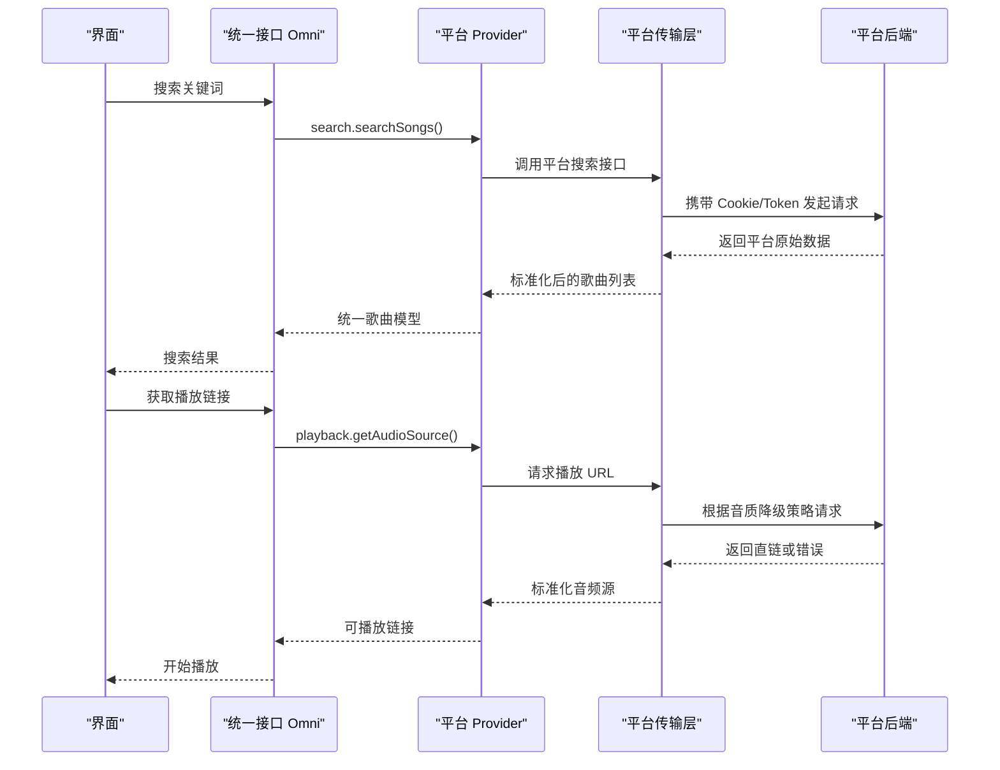
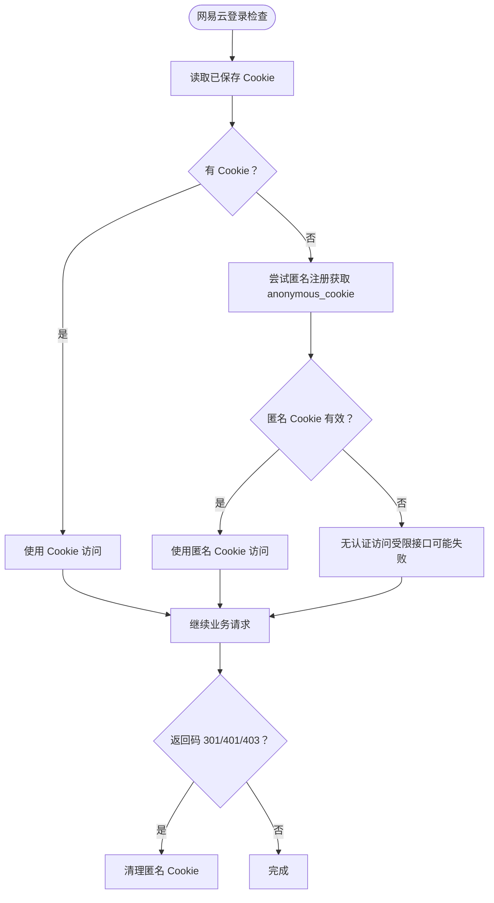
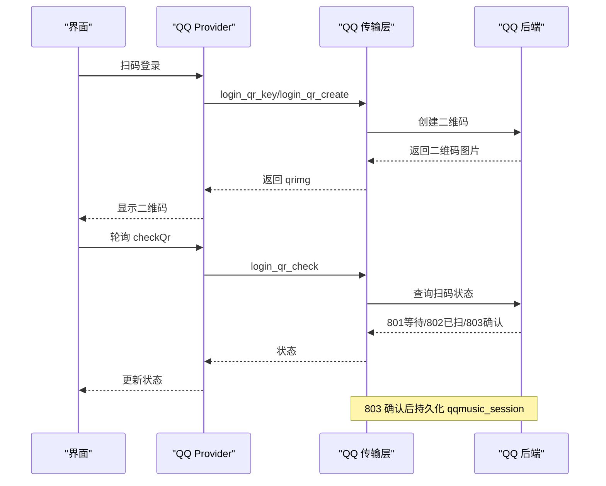
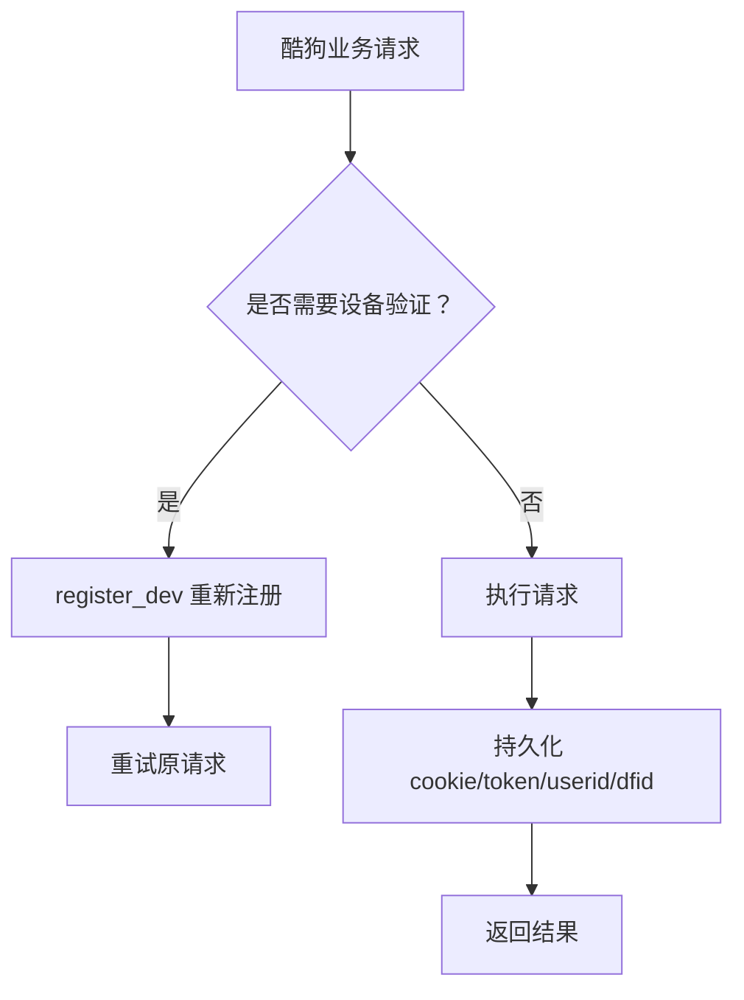
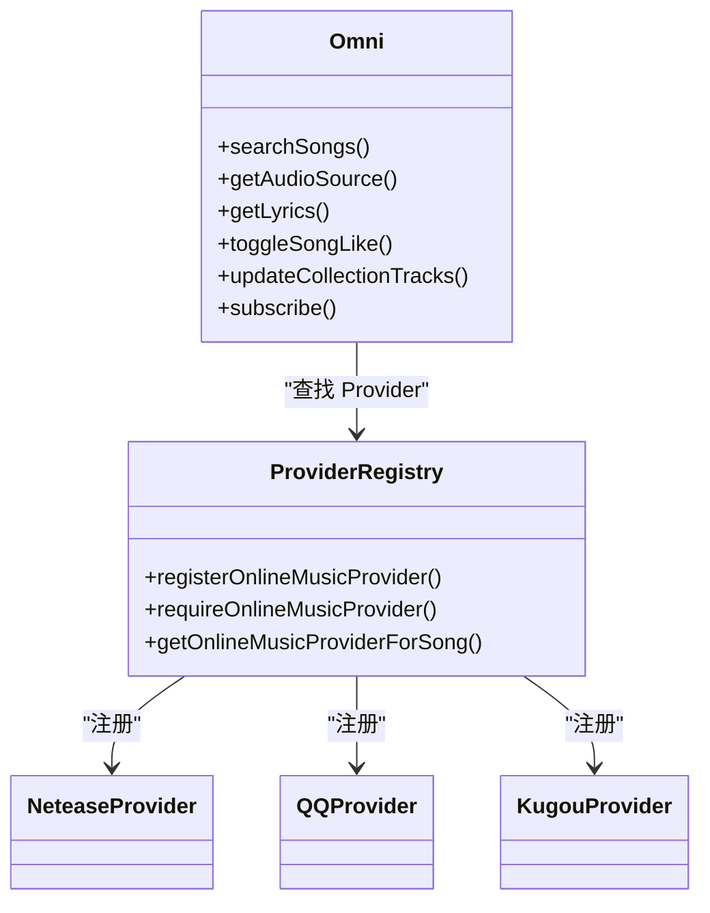
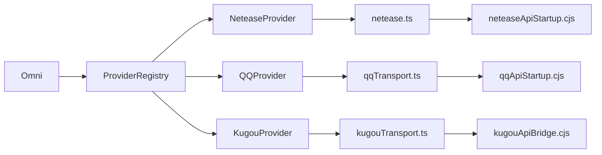

# 平台集成实现

<cite>
**本文引用的文件**   
- [README.md](file://README.md)
- [neteaseProvider.ts](file://src/services/onlineMusic/neteaseProvider.ts)
- [qqProvider.ts](file://src/services/onlineMusic/qqProvider.ts)
- [kugouProvider.ts](file://src/services/onlineMusic/kugouProvider.ts)
- [providerRegistry.ts](file://src/services/onlineMusic/providerRegistry.ts)
- [omni.ts](file://src/services/onlineMusic/omni.ts)
- [netease.ts](file://src/services/netease.ts)
- [qqTransport.ts](file://src/services/onlineMusic/qqTransport.ts)
- [kugouTransport.ts](file://src/services/onlineMusic/kugouTransport.ts)
- [neteaseApiStartup.cjs](file://electron/neteaseApiStartup.cjs)
- [qqApiStartup.cjs](file://electron/qqApiStartup.cjs)
- [kugouApiBridge.cjs](file://electron/kugouApiBridge.cjs)
</cite>

## 目录
1. [简介](#简介)
2. [项目结构](#项目结构)
3. [核心组件](#核心组件)
4. [架构总览](#架构总览)
5. [详细组件分析](#详细组件分析)
6. [依赖关系分析](#依赖关系分析)
7. [性能与限制](#性能与限制)
8. [故障排查指南](#故障排查指南)
9. [结论](#结论)

## 简介
本文件面向 Folia Major 的在线音乐平台集成，聚焦网易云音乐、QQ 音乐、酷狗音乐的 API 接入方案。文档从系统架构、认证流程、API 调用封装、数据格式转换、搜索/播放/收藏/歌单管理、网络请求与错误处理、速率限制与兼容性等维度进行系统化说明，帮助开发者理解各平台的差异与统一抽象层的设计。

## 项目结构
Folia 将在线音乐能力抽象为“提供者（Provider）+ 传输层（Transport）+ 统一接口（Omni）”三层：
- Provider：按平台实现搜索、播放、歌词、用户库、收藏、歌单、推荐等能力，并负责把平台原始响应标准化为内部统一模型。
- Transport：封装各平台后端地址解析、Cookie/Token 注入、同源/跨源策略、错误分类与重试边界。
- Omni：对外暴露统一的业务接口，屏蔽平台差异，供 UI 和上层服务调用。

**图示来源** 
- [providerRegistry.ts:1-61](file://src/services/onlineMusic/providerRegistry.ts#L1-L61)
- [omni.ts:105-184](file://src/services/onlineMusic/omni.ts#L105-L184)
- [neteaseProvider.ts:231-273](file://src/services/onlineMusic/neteaseProvider.ts#L231-L273)
- [qqProvider.ts:696-767](file://src/services/onlineMusic/qqProvider.ts#L696-L767)
- [kugouProvider.ts:225-288](file://src/services/onlineMusic/kugouProvider.ts#L225-L288)
- [netease.ts:95-161](file://src/services/netease.ts#L95-L161)
- [qqTransport.ts:166-263](file://src/services/onlineMusic/qqTransport.ts#L166-L263)
- [kugouTransport.ts:261-312](file://src/services/onlineMusic/kugouTransport.ts#L261-L312)

**章节来源**
- [README.md:32-38](file://README.md#L32-L38)
- [providerRegistry.ts:1-61](file://src/services/onlineMusic/providerRegistry.ts#L1-L61)

## 核心组件
- 统一接口 Omni：聚合所有 Provider 的能力，提供搜索、登录、二维码登录、播放、歌词、收藏、歌单、专辑、歌手、推荐、订阅、播放上报等统一入口。
- Provider 注册表：集中注册网易云、QQ、酷狗三个 Provider，并提供按歌曲来源自动选择 Provider 的工具方法。
- 平台 Provider：分别实现网易云、QQ、酷狗的数据标准化、能力声明、业务逻辑。
- 平台 Transport：分别封装网易云、QQ、酷狗的请求构造、凭据注入、错误分类、会话持久化。
- Electron 启动器/桥接：在桌面端启动或桥接各平台后端服务，处理端口发现、环境隔离、加密存储、设备注册等。

**章节来源**
- [omni.ts:105-184](file://src/services/onlineMusic/omni.ts#L105-L184)
- [providerRegistry.ts:1-61](file://src/services/onlineMusic/providerRegistry.ts#L1-L61)
- [neteaseProvider.ts:231-273](file://src/services/onlineMusic/neteaseProvider.ts#L231-L273)
- [qqProvider.ts:696-767](file://src/services/onlineMusic/qqProvider.ts#L696-L767)
- [kugouProvider.ts:225-288](file://src/services/onlineMusic/kugouProvider.ts#L225-L288)

## 架构总览
下图展示一次“搜索并播放”的典型调用链：UI 通过 Omni 发起搜索，Omni 路由到当前活跃 Provider；Provider 调用对应 Transport；Transport 完成鉴权、签名、URL 构建与错误分类；最终返回标准化结果给 UI。

**图示来源**
- [omni.ts:179-189](file://src/services/onlineMusic/omni.ts#L179-L189)
- [omni.ts:452-461](file://src/services/onlineMusic/omni.ts#L452-L461)
- [neteaseProvider.ts:266-292](file://src/services/onlineMusic/neteaseProvider.ts#L266-L292)
- [qqProvider.ts:274-325](file://src/services/onlineMusic/qqProvider.ts#L274-L325)
- [kugouProvider.ts:662-673](file://src/services/onlineMusic/kugouProvider.ts#L662-L673)

## 详细组件分析

### 网易云音乐集成
- 认证机制
  - 支持二维码登录：Provider 暴露 getQrKey/createQr/checkQr，并在确认时写入 Cookie。
  - Cookie 管理：netease.ts 中 fetchWithCreds 会优先使用已保存的 Cookie，否则尝试匿名注册获取 anonymous_cookie，并在 301/401/403 时清理匿名 Cookie。
  - Electron 启动器：neteaseApiStartup.cjs 提供 xeapi 公钥刷新、匿名 Token 刷新、指数退避重试、超时保护、IP 伪装开关等。
- API 调用封装
  - netease.ts 提供登录、用户、歌单、专辑、歌手、歌曲详情、歌词、云盘、搜索、电台等 API 封装，统一走 fetchWithCreds。
  - neteaseProvider.ts 将原始响应标准化为 UnifiedSong，并实现搜索、播放、歌词、收藏、歌单、专辑、歌手、推荐、订阅、播放上报等能力。
- 数据格式转换
  - normalizeSongResult 与 normalizeNeteaseSong 负责字段对齐、封面 HTTPS 化、云盘标记、版权建议、资源状态、权限等。
  - 歌词处理：getProcessedLyricPayload 兼容多种返回结构，Provider 侧再交给 lyrics 工具处理主词、逐字、翻译、罗马音等。
- 搜索、播放、收藏、歌单
  - 搜索：cloudSearch 返回 songs 与 privileges，Provider 合并后标准化。
  - 播放：getSongUrl 默认 exhigh 音质，支持 randomCNIP/https。
  - 收藏：likeSong 直接调用后端；getLikedSongIds 校验 code 非 200 时抛出异常，避免误清空本地收藏。
  - 歌单：getUserPlaylists/getPlaylistTracks/updatePlaylistTracks 等。
- 网络请求与错误处理
  - fetchWithCreds 对动态用户数据追加 timestamp，避免缓存。
  - 登录相关接口优先使用已登录 Cookie，否则回退匿名 Cookie。
  - 听歌打卡 scrobbleV1 对无 code 的情况视为失败，避免网关错误被误判成功。
- 平台限制与兼容
  - 个人 FM 模式：新后端支持 /personal/fm/mode，旧实例回退到 /personal_fm。
  - 不可用歌曲替代：优先使用 songId 替换，其次尝试版权推荐接口，失败则记录不支持并回退。

**图示来源**
- [netease.ts:95-161](file://src/services/netease.ts#L95-L161)
- [neteaseProvider.ts:341-386](file://src/services/onlineMusic/neteaseProvider.ts#L341-L386)

**章节来源**
- [netease.ts:95-161](file://src/services/netease.ts#L95-L161)
- [netease.ts:542-800](file://src/services/netease.ts#L542-L800)
- [neteaseProvider.ts:231-551](file://src/services/onlineMusic/neteaseProvider.ts#L231-L551)
- [neteaseApiStartup.cjs:1-216](file://electron/neteaseApiStartup.cjs#L1-L216)

### QQ 音乐集成
- 认证机制
  - 二维码登录：Provider 暴露 getQrLoginMethods/resolveQrLoginMethods/getQrKey/createQr/checkQr/cancelQr，支持 qq/wechat 通道，并通过 login_channels 动态发现后端能力。
  - Session 管理：qqTransport.ts 维护 qqmusic_session Cookie，同源部署走 X-QQ-Session Header，跨源走 ?cookie=；login_qr_check 成功后持久化 Cookie。
  - Electron 启动器：qqApiStartup.cjs 启动 @yakult-green-tea/qq-music-api，隔离环境变量，监听端口，处理模块缺失与服务器错误。
- API 调用封装
  - qqTransport.ts 定义 ENDPOINTS 与操作集合，封装 requestQq，统一处理 401/404/网络错误，并将上游 catalog 拒绝码转换为 OnlineProviderError。
  - qqProvider.ts 实现搜索、播放、歌词、用户库、歌单、专辑、歌手等能力，复用 utils/lyrics 的 QQ 歌词搜索。
- 数据格式转换
  - normalizeQqSong/normalizeQqUser/normalizeQqCollection 将 QQ 原始结构映射到统一模型，保留 providerData 以便后续导航与播放。
- 搜索、播放、收藏、歌单
  - 搜索：searchQQLyrics 复用歌词搜索路径，Provider 仅做结果标准化。
  - 播放：music_play 支持 quality 降级（flac→320→128），当上游返回空 url 但 entry 存在时标记 upstreamRefusedPlayLink，避免误重试。
  - 收藏：getLikedSongIds 分页拉取，最多 10000 条，过滤无效 id。
  - 歌单：优先 user_playlist_detail（带凭据），不公开自建歌单由后端判断；匿名 song_list_detail 用于分享链接与收藏歌单。
- 网络请求与错误处理
  - 401 清理 session 并抛出 auth-required；404 表示后端未声明该路由，抛出 unsupported，调用方据此回退旧路径。
  - catalog 路由（album_info/artist_songs/artist_albums/song_list_detail）即使 HTTP 200，也可能在 body 中返回错误码，需断言。
- 平台限制与兼容
  - login_channels 旧后端返回 404，视为“没有声明”，不报错。
  - ownedPlaylistRouteMissing 缓存探测结果，避免整会话反复探测。
  - QR TTL 前端早于后端 5 秒收手，避免轮询死码。

**图示来源**
- [qqProvider.ts:381-491](file://src/services/onlineMusic/qqProvider.ts#L381-L491)
- [qqTransport.ts:160-164](file://src/services/onlineMusic/qqTransport.ts#L160-L164)
- [qqTransport.ts:208-263](file://src/services/onlineMusic/qqTransport.ts#L208-L263)

**章节来源**
- [qqProvider.ts:28-33](file://src/services/onlineMusic/qqProvider.ts#L28-L33)
- [qqProvider.ts:274-325](file://src/services/onlineMusic/qqProvider.ts#L274-L325)
- [qqProvider.ts:343-491](file://src/services/onlineMusic/qqProvider.ts#L343-L491)
- [qqProvider.ts:696-767](file://src/services/onlineMusic/qqProvider.ts#L696-L767)
- [qqTransport.ts:16-41](file://src/services/onlineMusic/qqTransport.ts#L16-L41)
- [qqTransport.ts:166-263](file://src/services/onlineMusic/qqTransport.ts#L166-L263)
- [qqApiStartup.cjs:1-166](file://electron/qqApiStartup.cjs#L1-L166)

### 酷狗音乐集成
- 认证机制
  - Electron 桥接：kugouApiBridge.cjs 加载 kugoumusicapi，维护设备标识与加密 Cookie 信封，支持 register_dev/login_qr_*/logout/user_detail 等。
  - Web 传输：kugouTransport.ts 维护 cookie/token/userid/dfid，必要时触发 register_dev 重新注册设备。
  - 设备验证：errcode=20028 或消息包含“本次请求需要验证”时，清除 dfid 并重新注册。
- API 调用封装
  - kugouTransport.ts 定义 ENDPOINTS 与 KUGOU_OPERATIONS，封装 requestKugou，支持 Electron IPC 与 Web 后端两种模式。
  - 匿名搜索：requestKugouAnonymousSearch 模拟 Android 客户端签名，绕过 CORS 通过 lyric-proxy。
  - 历史播放信息：requestKugouLegacyPlayInfo 作为最后兜底，调用 m.kugou.com 旧接口。
- 数据格式转换
  - normalizeKugouSong 提取 hash/FileHash/hash_128 作为媒体 ID，解析艺术家、专辑、时长、封面、providerData（hash/mixSongId/albumAudioId/catalogLookupId/fileId）。
  - normalizeCollection 适配 playlist/album/artist 多形态，保留 listId/globalCollectionId/creator 等元数据。
- 搜索、播放、收藏、歌单
  - 搜索：Provider 去重基于播放键，避免重复条目。
  - 播放：qualityValue 映射 standard/high/lossless/hires，支持多级降级；若 /song/url 拒绝 hash，回退 legacy playInfo。
  - 收藏：区分“我喜欢”内置收藏与可编辑歌单，canAddToKugouPlaylist 排除只读集合。
  - 歌单：user_playlist 一次性拉取，本地切片分页；playlist_track_all 等用于编辑。
- 网络请求与错误处理
  - Electron 模式下，敏感 token/dfid/cookie 不在渲染进程存储，由主进程桥接注入。
  - Web 模式下，persistWebSession 持久化 cookie/token/userid/dfid；isDeviceVerificationRequired 触发重新注册。
- 平台限制与兼容
  - 青年 VIP：youth_union_vip/youth_day_vip/youth_day_vip_upgrade 组合调用，按中国日历日期领取升级。
  - 歌词：search_lyric + lyric(fmt=krc, decode=true)，解析 KRC 并检测纯音乐。
  - 副歌区间：song_climax 返回毫秒级 start_time/end_time，Provider 转为秒级范围。

**图示来源**
- [kugouTransport.ts:268-312](file://src/services/onlineMusic/kugouTransport.ts#L268-L312)
- [kugouApiBridge.cjs:227-305](file://electron/kugouApiBridge.cjs#L227-L305)

**章节来源**
- [kugouProvider.ts:225-288](file://src/services/onlineMusic/kugouProvider.ts#L225-L288)
- [kugouProvider.ts:662-673](file://src/services/onlineMusic/kugouProvider.ts#L662-L673)
- [kugouProvider.ts:711-760](file://src/services/onlineMusic/kugouProvider.ts#L711-L760)
- [kugouTransport.ts:106-173](file://src/services/onlineMusic/kugouTransport.ts#L106-L173)
- [kugouTransport.ts:232-312](file://src/services/onlineMusic/kugouTransport.ts#L232-L312)
- [kugouApiBridge.cjs:156-305](file://electron/kugouApiBridge.cjs#L156-L305)

### 统一接口与提供者注册
- Provider 注册：providerRegistry.ts 注册 netease/kugou/qq 三个 Provider，并提供 requireOnlineMusicProviderForSong、canPlayOnlineMusicSong 等工具。
- Omni 统一接口：omni.ts 暴露搜索、登录、二维码、播放、歌词、收藏、歌单、专辑、歌手、推荐、订阅、播放上报等统一方法，内部委托给当前 Provider。
- 账号与缓存：omni.ts 维护 activeProviderId，切换 Provider 时丢弃过期响应；likedSongIds 变更落盘，fileId 行号失效时及时清理。

**图示来源**
- [providerRegistry.ts:1-61](file://src/services/onlineMusic/providerRegistry.ts#L1-L61)
- [omni.ts:105-184](file://src/services/onlineMusic/omni.ts#L105-L184)

**章节来源**
- [providerRegistry.ts:1-61](file://src/services/onlineMusic/providerRegistry.ts#L1-L61)
- [omni.ts:105-184](file://src/services/onlineMusic/omni.ts#L105-L184)
- [omni.ts:593-634](file://src/services/onlineMusic/omni.ts#L593-L634)

## 依赖关系分析
- 耦合与内聚
  - Provider 与 Transport 解耦：Provider 专注业务与标准化，Transport 专注网络与凭据。
  - Omni 与 Provider 松耦合：通过 registry 查找，新增平台只需注册 Provider。
- 外部依赖
  - 网易云：@neteasecloudmusicapienhanced/api（Electron 启动器包装）、fetchWithCreds。
  - QQ：@yakult-green-tea/qq-music-api（Electron 启动器包装）、web 后端 VITE_QQ_API_BASE。
  - 酷狗：kugoumusicapi（Electron 桥接）、web 后端 VITE_KUGOU_API_BASE。
- 循环依赖
  - 未发现 Provider 与 Transport 之间的循环导入；Omni 仅依赖 registry 与 Provider 接口。

**图示来源**
- [providerRegistry.ts:1-61](file://src/services/onlineMusic/providerRegistry.ts#L1-L61)
- [neteaseProvider.ts:231-273](file://src/services/onlineMusic/neteaseProvider.ts#L231-L273)
- [qqProvider.ts:696-767](file://src/services/onlineMusic/qqProvider.ts#L696-L767)
- [kugouProvider.ts:225-288](file://src/services/onlineMusic/kugouProvider.ts#L225-L288)
- [netease.ts:95-161](file://src/services/netease.ts#L95-L161)
- [qqTransport.ts:166-263](file://src/services/onlineMusic/qqTransport.ts#L166-L263)
- [kugouTransport.ts:261-312](file://src/services/onlineMusic/kugouTransport.ts#L261-L312)

**章节来源**
- [providerRegistry.ts:1-61](file://src/services/onlineMusic/providerRegistry.ts#L1-L61)

## 性能与限制
- 网络请求优化
  - 网易云：对登录/用户/歌单详情等动态接口加 timestamp 防缓存；默认 exhigh 音质提高 VIP 曲成功率；randomCNIP 提升部分受限曲目可用性。
  - QQ：同源部署使用 X-QQ-Session Header，避免 CDN 日志泄露 sealed token；跨源使用 ?cookie= 兼容预检。
  - 酷狗：Electron 下敏感凭据不落渲染进程；Web 下 persistWebSession 持久化必要字段；设备验证失败自动重新注册。
- 重试与限流
  - 网易云启动器：retryStartupOperation 指数退避 + jitter，withTimeout 防止阻塞启动；xeapi 公钥与匿名 Token 刷新失败时回退缓存。
  - QQ：login_channels 探测冷却 30 秒，避免频繁探测；QR TTL 前端早 5 秒收手。
  - 酷狗：设备验证失败后清除 dfid 并重试；匿名搜索模拟 Android 客户端签名，降低风控概率。
- 兼容性处理
  - 网易云：个人 FM 模式新旧接口兼容；不可用歌曲替代优先 songId，其次版权推荐接口。
  - QQ：旧后端缺少 user_playlist_detail/login_channels 时，调用方以 unsupported 回退；catalog 路由 404 视为能力缺失而非错误。
  - 酷狗：legacy playInfo 作为最后兜底；KRC 歌词解析失败时回退纯文本。

[本节为通用指导，不直接分析具体文件]

## 故障排查指南
- 网易云
  - 现象：登录后仍提示未登录。
    - 排查：检查 fetchWithCreds 是否携带 Cookie；确认 301/401/403 时匿名 Cookie 是否被清理；确认 electron 本地 API 端口可用。
  - 现象：播放失败或链接无效。
    - 排查：确认 level 是否为 exhigh；检查 randomCNIP/https 参数；查看 noCopyrightRcmd 与 privilege.st 标记。
- QQ 音乐
  - 现象：扫码登录一直等待或过期。
    - 排查：检查 login_qr_check 返回码（801/802/803/800）；确认 QR TTL 设置；检查后端 login_channels 是否支持所选通道。
  - 现象：歌单为空或无法打开。
    - 排查：区分匿名 song_list_detail 与带凭据 user_playlist_detail；检查 dirShow 与 owned 标志；确认后端版本是否支持新路由。
- 酷狗音乐
  - 现象：搜索或播放报设备验证。
    - 排查：检查 errcode=20028 或 error_msg 包含“本次请求需要验证”；触发 register_dev 重新注册；Electron 下确认 safeStorage 加密可用。
  - 现象：歌词为空或解析失败。
    - 排查：检查 search_lyric 候选是否存在 accesskey；确认 lyric 接口 fmt=krc 且 decode=true；KRC 解析失败时回退纯文本。

**章节来源**
- [netease.ts:95-161](file://src/services/netease.ts#L95-L161)
- [neteaseProvider.ts:341-386](file://src/services/onlineMusic/neteaseProvider.ts#L341-L386)
- [qqProvider.ts:381-491](file://src/services/onlineMusic/qqProvider.ts#L381-L491)
- [qqTransport.ts:208-263](file://src/services/onlineMusic/qqTransport.ts#L208-L263)
- [kugouTransport.ts:268-312](file://src/services/onlineMusic/kugouTransport.ts#L268-L312)
- [kugouApiBridge.cjs:227-305](file://electron/kugouApiBridge.cjs#L227-L305)

## 结论
Folia Major 通过 Provider/Transport/Omni 的分层设计，将网易云、QQ、酷狗三大平台的认证、API 调用、数据标准化与业务逻辑解耦，既保留了各平台的差异化实现，又提供了统一的调用体验。Electron 启动器与桥接进一步屏蔽了后端运行环境的差异，提升了稳定性与可移植性。未来扩展新平台时，只需实现 Provider 与 Transport 并注册到 Registry，即可无缝接入 Omni 的统一能力。