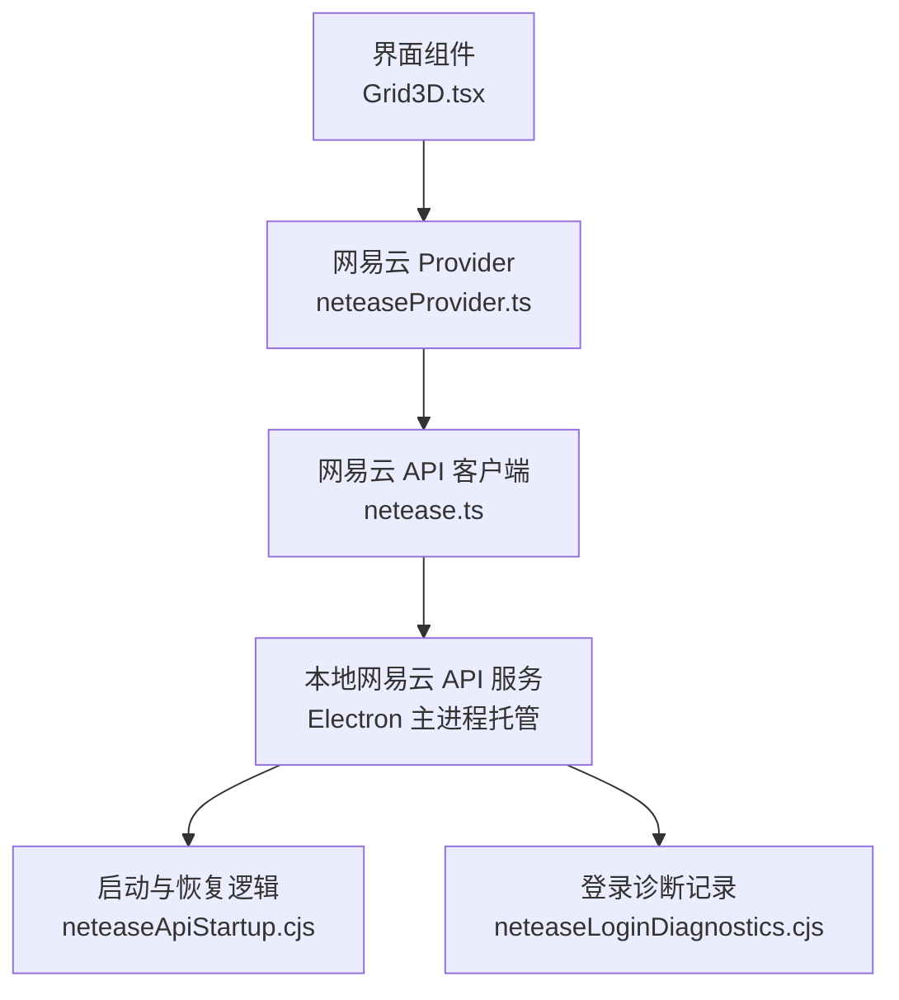
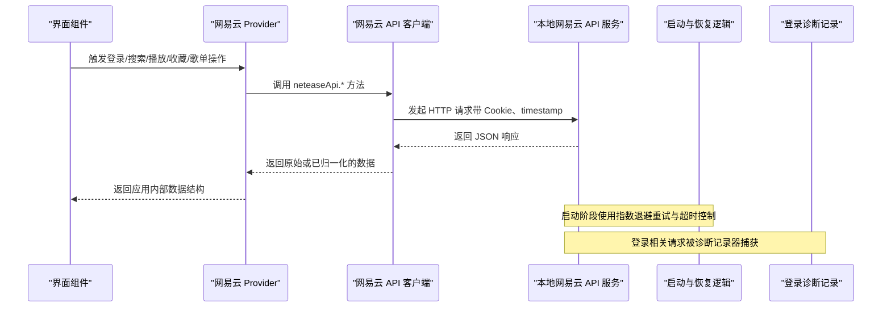
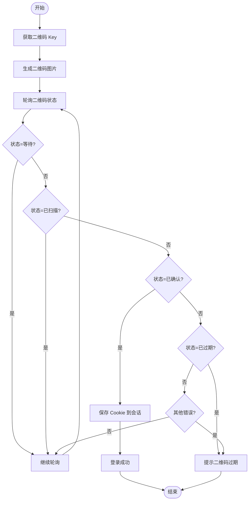
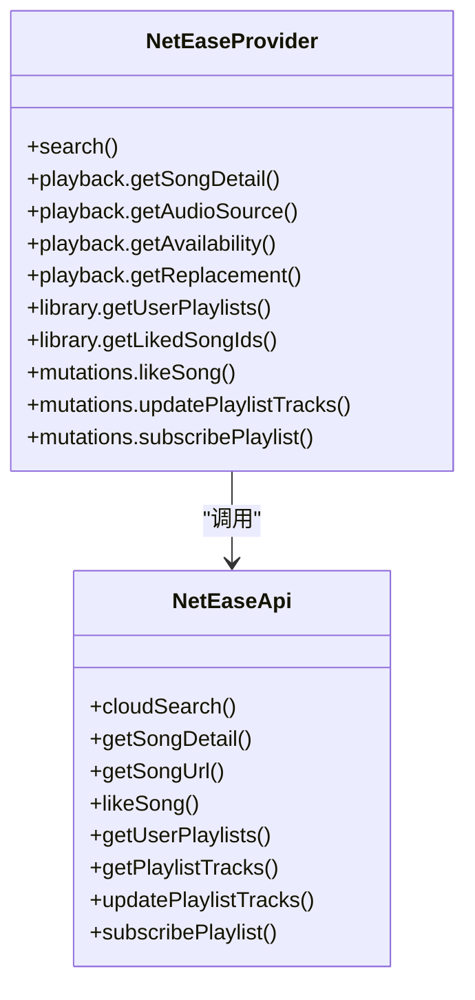
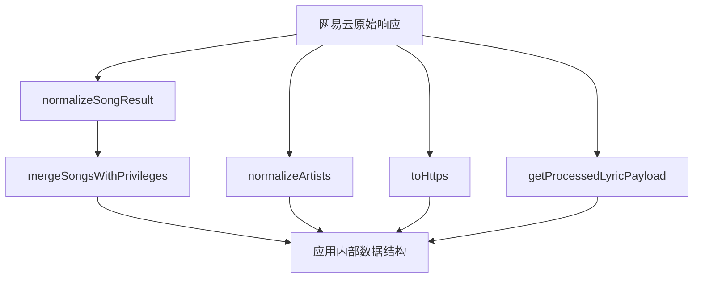
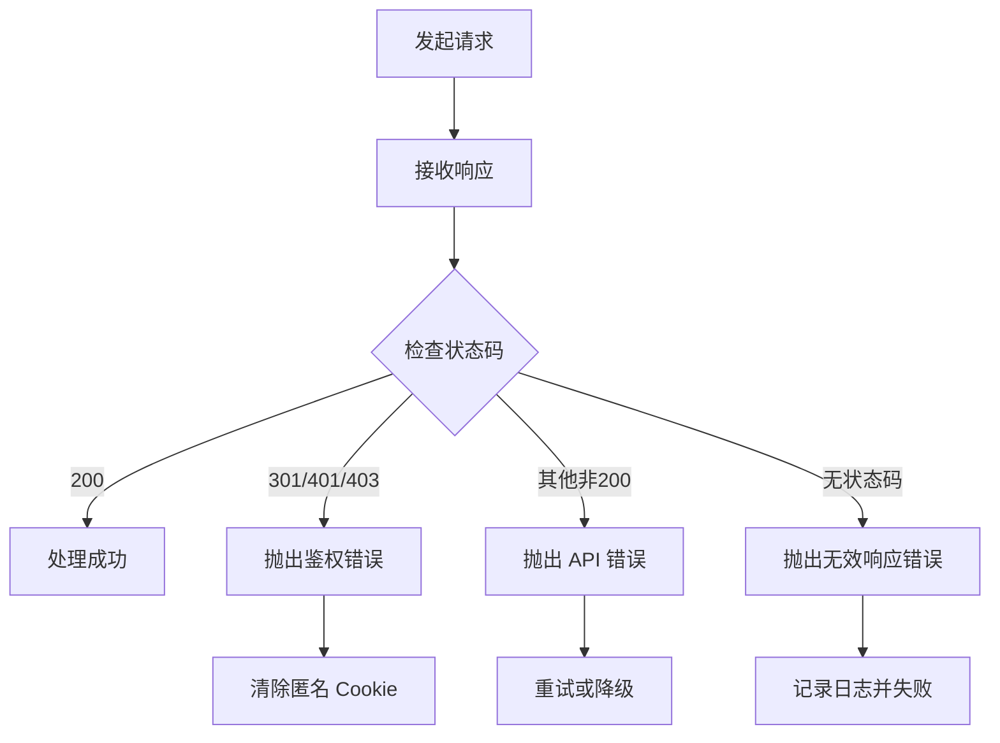
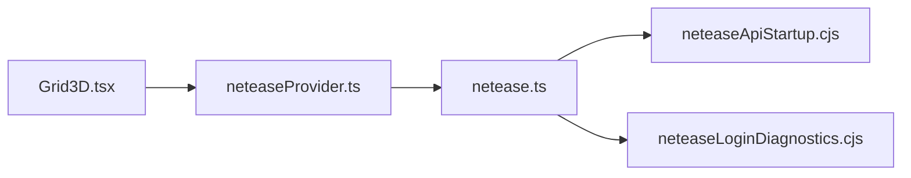

# 网易云音乐集成

<cite>
**本文引用的文件**   
- [src/services/netease.ts](file://src/services/netease.ts)
- [src/services/onlineMusic/neteaseProvider.ts](file://src/services/onlineMusic/neteaseProvider.ts)
- [electron/neteaseApiStartup.cjs](file://electron/neteaseApiStartup.cjs)
- [electron/neteaseLoginDiagnostics.cjs](file://electron/neteaseLoginDiagnostics.cjs)
- [src/hooks/useNeteaseLibrary.ts](file://src/hooks/useNeteaseLibrary.ts)
- [src/components/Grid3D.tsx](file://src/components/Grid3D.tsx)
</cite>

## 目录
1. [简介](#简介)
2. [项目结构](#项目结构)
3. [核心组件](#核心组件)
4. [架构总览](#架构总览)
5. [详细组件分析](#详细组件分析)
6. [依赖关系分析](#依赖关系分析)
7. [性能与可靠性](#性能与可靠性)
8. [故障排查指南](#故障排查指南)
9. [结论](#结论)

## 简介
本文件面向“网易云音乐平台集成”的技术文档，覆盖以下目标：
- 认证流程：OAuth2 授权、Cookie 管理、会话维护。
- 功能实现：音乐搜索、播放、收藏、歌单管理等 API 调用。
- 数据转换：将网易云 API 响应转换为应用内部数据结构。
- 错误处理：网络异常重试、API 限流与风控状态处理。
- 调试工具：二维码登录诊断、常见问题定位。
- 重点流程：二维码登录、用户状态检查、会话持久化。

本项目采用“渲染进程 + Electron 主进程 + 本地网易云 API 服务”的三层结构：
- 渲染进程负责 UI、状态与业务编排。
- Electron 主进程启动并守护本地网易云 API 服务，提供端口发现、超时控制、匿名令牌刷新等能力。
- 网易云 API 层封装 HTTP 请求、Cookie 注入、签名参数、数据归一化与错误语义。

## 项目结构
围绕网易云集成的关键代码分布如下：
- `src/services/netease.ts`：网易云 API 客户端，统一请求、Cookie 注入、URL 构建、数据归一化、搜索/播放/收藏/歌单/推荐等接口。
- `src/services/onlineMusic/neteaseProvider.ts`：网易云 Provider 适配层，将网易云 API 暴露为统一的在线音乐 Provider 接口，包含登录、二维码、播放、歌词、收藏、歌单、推荐、订阅等能力。
- `electron/neteaseApiStartup.cjs`：Electron 主进程侧启动辅助，包括指数退避重试、超时控制、xeapi 公钥刷新、匿名 Cookie 刷新、来源 IP 头策略。
- `electron/neteaseLoginDiagnostics.cjs`：登录相关请求的诊断记录器，用于收集扫码登录失败时的现场信息。
- `src/hooks/useNeteaseLibrary.ts`：网易云库数据 Hook，负责用户、歌单、收藏、云盘等数据的加载、缓存清理与状态同步。
- `src/components/Grid3D.tsx`：入口级登录交互，触发二维码登录流程，并根据网易云后端状态展示重启入口。

**图表来源**
- [src/components/Grid3D.tsx:322-345](file://src/components/Grid3D.tsx#L322-L345)
- [src/services/onlineMusic/neteaseProvider.ts:231-386](file://src/services/onlineMusic/neteaseProvider.ts#L231-L386)
- [src/services/netease.ts:95-160](file://src/services/netease.ts#L95-L160)
- [electron/neteaseApiStartup.cjs:80-104](file://electron/neteaseApiStartup.cjs#L80-L104)
- [electron/neteaseLoginDiagnostics.cjs:81-156](file://electron/neteaseLoginDiagnostics.cjs#L81-L156)

**章节来源**
- [src/services/netease.ts:1-160](file://src/services/netease.ts#L1-L160)
- [src/services/onlineMusic/neteaseProvider.ts:1-551](file://src/services/onlineMusic/neteaseProvider.ts#L1-L551)
- [electron/neteaseApiStartup.cjs:1-216](file://electron/neteaseApiStartup.cjs#L1-L216)
- [electron/neteaseLoginDiagnostics.cjs:1-162](file://electron/neteaseLoginDiagnostics.cjs#L1-L162)
- [src/hooks/useNeteaseLibrary.ts:67-100](file://src/hooks/useNeteaseLibrary.ts#L67-L100)
- [src/components/Grid3D.tsx:322-345](file://src/components/Grid3D.tsx#L322-L345)

## 核心组件
- 网易云 API 客户端（`netease.ts`）
  - 负责获取 API Base、等待 Electron 本地服务端口、构造 URL、注入 Cookie、选择性添加 timestamp、统一 fetch 与 JSON 解析。
  - 提供登录、二维码、用户账户、收藏、歌单、专辑、歌手、歌曲详情、歌词、云盘、搜索、推荐、FM、订阅等接口。
  - 提供数据归一化工具：歌曲、艺术家、专辑、权限、无版权替代方案、歌词载荷处理等。
- 网易云 Provider（`neteaseProvider.ts`）
  - 将网易云 API 暴露为统一的 `OnlineMusicProvider`，包括搜索、播放、歌词、认证、用户库、歌单、专辑、歌手、推荐、订阅、播放报告等能力。
  - 负责网易云数据到应用内部结构的映射，如 `normalizeNeteaseSong`、`normalizeUser`、`normalizeCollection`。
  - 处理二维码登录状态、保存 Cookie、上报播放记录、处理鉴权错误。
- Electron 启动辅助（`neteaseApiStartup.cjs`）
  - 提供指数退避重试、超时控制、xeapi 公钥刷新、匿名 Token 刷新、来源 IP 头策略。
- 登录诊断（`neteaseLoginDiagnostics.cjs`）
  - 记录登录相关请求的 URI、耗时、状态码、消息、IP 头类型、设备 ID 尾段、是否携带 MUSIC_U/MUSIC_A 等字段，便于问题复现。

**章节来源**
- [src/services/netease.ts:95-160](file://src/services/netease.ts#L95-L160)
- [src/services/netease.ts:542-889](file://src/services/netease.ts#L542-L889)
- [src/services/onlineMusic/neteaseProvider.ts:231-551](file://src/services/onlineMusic/neteaseProvider.ts#L231-L551)
- [electron/neteaseApiStartup.cjs:80-216](file://electron/neteaseApiStartup.cjs#L80-L216)
- [electron/neteaseLoginDiagnostics.cjs:81-156](file://electron/neteaseLoginDiagnostics.cjs#L81-L156)

## 架构总览
下图展示了从界面到网易云 API 的完整调用链，以及 Electron 主进程在其中的作用。

**图表来源**
- [src/services/onlineMusic/neteaseProvider.ts:231-386](file://src/services/onlineMusic/neteaseProvider.ts#L231-L386)
- [src/services/netease.ts:95-160](file://src/services/netease.ts#L95-L160)
- [electron/neteaseApiStartup.cjs:80-104](file://electron/neteaseApiStartup.cjs#L80-L104)
- [electron/neteaseLoginDiagnostics.cjs:81-156](file://electron/neteaseLoginDiagnostics.cjs#L81-L156)

## 详细组件分析

### 认证流程：OAuth2、Cookie 管理与会话维护
网易云集成通过以下方式完成认证与会话维护：
- 二维码登录：
  - Provider 调用 `getQrKey`、`createQr`、`checkQr`，根据返回码映射为 `waiting`、`scanned`、`confirmed`、`expired`、`error` 等状态。
  - 当 `checkQr` 返回确认状态时，若响应中包含 Cookie，则写入 Provider 会话存储。
- 用户状态检查：
  - Provider 先调用 `getLoginStatus`，再调用 `getUserAccount`，校验账号 ID 一致性；若任一接口返回未登录状态码（301、401、403），则视为未登录。
  - 登录成功后，若响应包含 Cookie，则写入会话存储。
- Cookie 管理：
  - API 客户端在每次请求前读取已存储的 Cookie；若无 Cookie 且非登录/登出/账户接口，则尝试匿名注册获取匿名 Cookie。
  - 若匿名 Cookie 导致鉴权失败（301、401、403），则清除匿名 Cookie。
  - Cookie 以查询参数形式附加到 URL，同时设置 `credentials: 'include'` 以支持跨站场景下的 Cookie 传递。
- 会话持久化：
  - 使用 Provider 会话存储写入/读取 Cookie；用户登出时会清除 Cookie、清空用户与歌单缓存、清理账户快照。

**图表来源**
- [src/services/onlineMusic/neteaseProvider.ts:341-386](file://src/services/onlineMusic/neteaseProvider.ts#L341-L386)
- [src/services/netease.ts:548-558](file://src/services/netease.ts#L548-L558)

**章节来源**
- [src/services/onlineMusic/neteaseProvider.ts:341-386](file://src/services/onlineMusic/neteaseProvider.ts#L341-L386)
- [src/services/netease.ts:95-160](file://src/services/netease.ts#L95-L160)
- [src/hooks/useNeteaseLibrary.ts:84-100](file://src/hooks/useNeteaseLibrary.ts#L84-L100)

### 音乐搜索、播放、收藏、歌单管理
- 搜索：
  - Provider 调用 `cloudSearch`，将结果中的歌曲列表映射为内部结构，并计算分页信息。
- 播放：
  - Provider 调用 `getSongDetail` 获取歌曲详情，调用 `getSongUrl` 获取音频源地址。
  - 默认音质为高音质，确保 VIP 歌曲能拿到有效签名链接；同时启用随机国内 IP 与 HTTPS 协议。
  - 可用性判断基于歌曲是否标记为不可用，并提供替代歌曲建议。
- 收藏：
  - Provider 调用 `likeSong` 进行点赞/取消点赞。
  - 获取已收藏歌曲列表时，对鉴权错误进行特殊处理，避免误判为空列表。
- 歌单管理：
  - 获取用户歌单、歌单详情、歌单曲目、更新歌单曲目、订阅/取消订阅歌单。
  - 歌单详情与曲目会合并权限信息，确保封面、创作者头像等字段转为 HTTPS。

**图表来源**
- [src/services/onlineMusic/neteaseProvider.ts:266-549](file://src/services/onlineMusic/neteaseProvider.ts#L266-L549)
- [src/services/netease.ts:542-889](file://src/services/netease.ts#L542-L889)

**章节来源**
- [src/services/onlineMusic/neteaseProvider.ts:266-549](file://src/services/onlineMusic/neteaseProvider.ts#L266-L549)
- [src/services/netease.ts:542-889](file://src/services/netease.ts#L542-L889)

### 数据格式转换逻辑
网易云 API 返回的数据结构存在多种变体，例如：
- 歌曲对象可能位于 `simpleSong` 或直接位于根对象。
- 艺术家可能是字符串数组、对象数组或字符串。
- 专辑封面可能位于 `al.picUrl`、`album.coverUrl`、`cover` 等不同字段。
- 权限信息可能单独返回或在歌曲对象内。

转换策略包括：
- `normalizeSongResult`：统一歌曲字段，包括 ID、名称、艺术家、专辑、时长、别名、翻译名、来源类型、费用、无版权推荐、资源状态、权限等。
- `mergeSongsWithPrivileges`：将歌曲与权限按 ID 对齐，优先匹配同名 ID，否则按索引对齐。
- `normalizeArtistName`、`normalizeArtists`：统一艺术家名称与数组结构。
- `toHttps`：将 HTTP 图片链接转为 HTTPS。
- `normalizeUnavailableSongReplacement`：从无版权推荐中解析替代歌曲与说明。
- `getProcessedLyricPayload`：兼容不同歌词返回结构，统一为主文本、逐字歌词、翻译歌词、罗马音歌词等。

**图表来源**
- [src/services/netease.ts:168-342](file://src/services/netease.ts#L168-L342)
- [src/services/netease.ts:522-540](file://src/services/netease.ts#L522-L540)

**章节来源**
- [src/services/netease.ts:168-342](file://src/services/netease.ts#L168-L342)
- [src/services/netease.ts:522-540](file://src/services/netease.ts#L522-L540)

### 错误处理策略、网络异常重试、API 限流处理
- 网络异常重试：
  - Electron 启动阶段使用指数退避重试，支持自定义延迟、抖动、最大尝试次数与回调。
  - 所有启动相关网络调用均受超时保护，防止阻塞启动流程。
- API 限流与风控：
  - 二维码登录状态码包含 800（过期）、801（等待）、802（已扫描）、803（确认）、8821（风控）等，Provider 将这些状态映射为前端可理解的状态。
  - 若服务端返回无状态码或非法状态码，Provider 抛出明确的错误类型，避免误判成功。
- 鉴权错误：
  - 对于 301、401、403 等鉴权错误，Provider 抛出 `auth-required` 错误，提示用户重新登录。
  - 匿名 Cookie 在鉴权失败时被自动清除，避免后续请求继续使用无效凭据。

**图表来源**
- [electron/neteaseApiStartup.cjs:80-104](file://electron/neteaseApiStartup.cjs#L80-L104)
- [src/services/onlineMusic/neteaseProvider.ts:311-338](file://src/services/onlineMusic/neteaseProvider.ts#L311-L338)
- [src/services/netease.ts:156-158](file://src/services/netease.ts#L156-L158)

**章节来源**
- [electron/neteaseApiStartup.cjs:80-104](file://electron/neteaseApiStartup.cjs#L80-L104)
- [src/services/onlineMusic/neteaseProvider.ts:311-338](file://src/services/onlineMusic/neteaseProvider.ts#L311-L338)
- [src/services/netease.ts:156-158](file://src/services/netease.ts#L156-L158)

### 调试工具与常见问题解决方案
- 登录诊断：
  - 记录登录相关请求的 URI、耗时、状态码、消息、IP 头类型、设备 ID 尾段、是否携带 MUSIC_U/MUSIC_A。
  - 提供网络接口摘要，包括网卡名称、IPv4/IPv6 支持情况、全局 IPv6 数量。
  - 输出结构化快照，便于问题复现与反馈。
- 常见问题：
  - 二维码登录失败：检查状态码是否为 8821（风控），查看诊断日志中的 IP 头类型与设备 ID。
  - 播放链接无效：检查音质选择与签名链接生成，确认是否启用随机国内 IP 与 HTTPS。
  - 歌单加载为空：检查鉴权状态，确认 Cookie 是否有效，必要时清除匿名 Cookie 后重试。

**章节来源**
- [electron/neteaseLoginDiagnostics.cjs:81-156](file://electron/neteaseLoginDiagnostics.cjs#L81-L156)
- [src/services/onlineMusic/neteaseProvider.ts:371-386](file://src/services/onlineMusic/neteaseProvider.ts#L371-L386)
- [src/services/netease.ts:728-734](file://src/services/netease.ts#L728-L734)

## 依赖关系分析
网易云集成的依赖关系如下：
- 界面组件依赖 Provider 提供的统一接口。
- Provider 依赖网易云 API 客户端。
- 网易云 API 客户端依赖 Electron 本地服务端口发现与配置。
- Electron 主进程提供启动辅助与诊断工具。

**图表来源**
- [src/components/Grid3D.tsx:322-345](file://src/components/Grid3D.tsx#L322-L345)
- [src/services/onlineMusic/neteaseProvider.ts:231-386](file://src/services/onlineMusic/neteaseProvider.ts#L231-L386)
- [src/services/netease.ts:95-160](file://src/services/netease.ts#L95-L160)
- [electron/neteaseApiStartup.cjs:80-104](file://electron/neteaseApiStartup.cjs#L80-L104)
- [electron/neteaseLoginDiagnostics.cjs:81-156](file://electron/neteaseLoginDiagnostics.cjs#L81-L156)

**章节来源**
- [src/components/Grid3D.tsx:322-345](file://src/components/Grid3D.tsx#L322-L345)
- [src/services/onlineMusic/neteaseProvider.ts:231-386](file://src/services/onlineMusic/neteaseProvider.ts#L231-L386)
- [src/services/netease.ts:95-160](file://src/services/netease.ts#L95-L160)
- [electron/neteaseApiStartup.cjs:80-104](file://electron/neteaseApiStartup.cjs#L80-L104)
- [electron/neteaseLoginDiagnostics.cjs:81-156](file://electron/neteaseLoginDiagnostics.cjs#L81-L156)

## 性能与可靠性
- 性能优化：
  - 选择性添加 timestamp，仅对动态数据接口（登录、用户、歌单详情）添加，避免内容接口被缓存。
  - 默认使用高音质获取播放链接，减少因权限不足导致的二次请求。
  - 歌词与合唱段落解析结果缓存，避免重复解析。
- 可靠性保障：
  - 启动阶段使用指数退避重试与超时控制，防止网络黑洞阻塞启动。
  - 匿名 Cookie 与 xeapi 公钥刷新失败时保留旧值，保证基本功能可用。
  - 二维码登录状态明确区分等待、扫描、确认、过期、错误，便于前端反馈。

[本节为通用指导，不直接分析具体文件]

## 故障排查指南
- 二维码登录失败：
  - 检查状态码是否为 8821（风控），查看诊断日志中的 IP 头类型与设备 ID。
  - 确认本地网易云 API 服务是否正常运行，必要时重启服务。
- 播放链接无效：
  - 检查音质选择与签名链接生成，确认是否启用随机国内 IP 与 HTTPS。
  - 查看歌曲是否标记为不可用，尝试获取替代歌曲。
- 歌单加载为空：
  - 检查鉴权状态，确认 Cookie 是否有效，必要时清除匿名 Cookie 后重试。
  - 查看用户账户接口返回状态，确认账号 ID 一致性。

**章节来源**
- [electron/neteaseLoginDiagnostics.cjs:81-156](file://electron/neteaseLoginDiagnostics.cjs#L81-L156)
- [src/services/onlineMusic/neteaseProvider.ts:371-386](file://src/services/onlineMusic/neteaseProvider.ts#L371-L386)
- [src/services/netease.ts:728-734](file://src/services/netease.ts#L728-L734)
- [src/services/netease.ts:344-388](file://src/services/netease.ts#L344-L388)

## 结论
网易云音乐集成通过分层架构实现了认证、数据转换、错误处理与调试工具的完整闭环。渲染进程与 Provider 负责业务编排与数据映射，网易云 API 客户端负责请求封装与归一化，Electron 主进程提供启动辅助与诊断能力。该设计在保证用户体验的同时，也提供了良好的可维护性与可扩展性。

[本节为总结性内容，不直接分析具体文件]