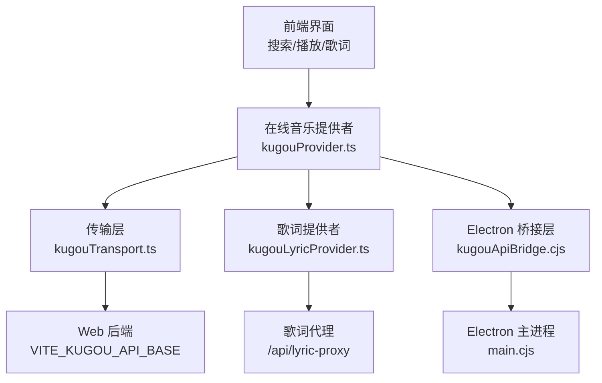
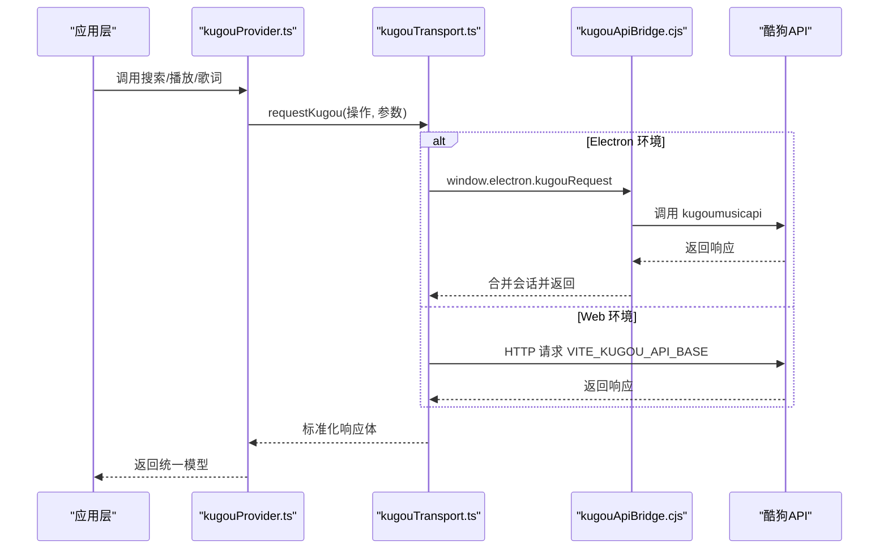
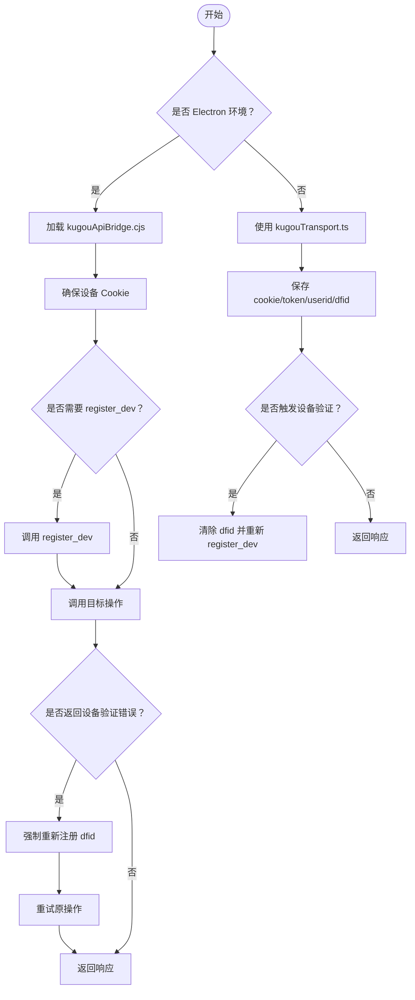
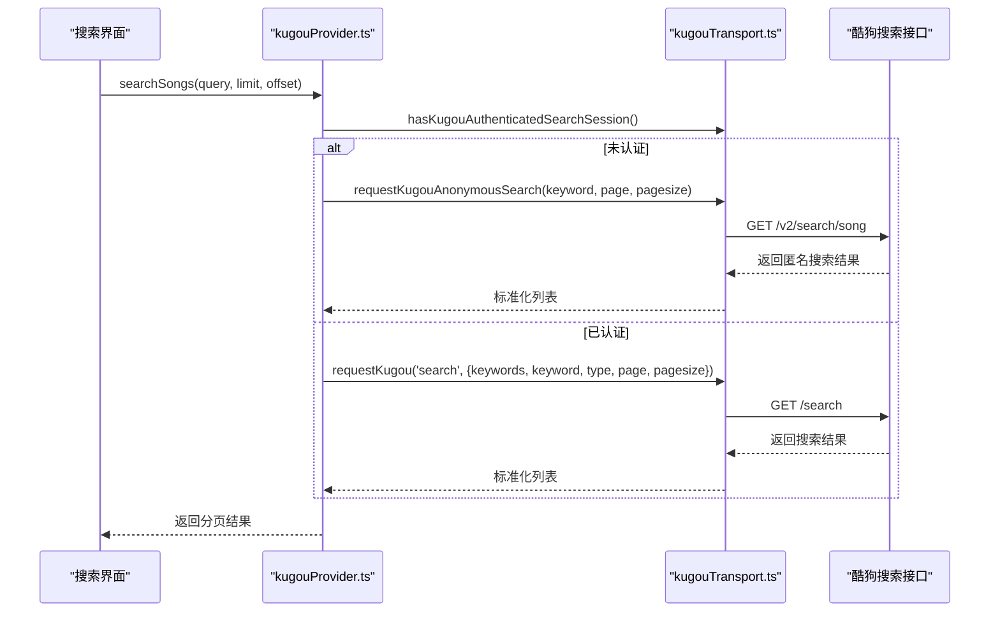
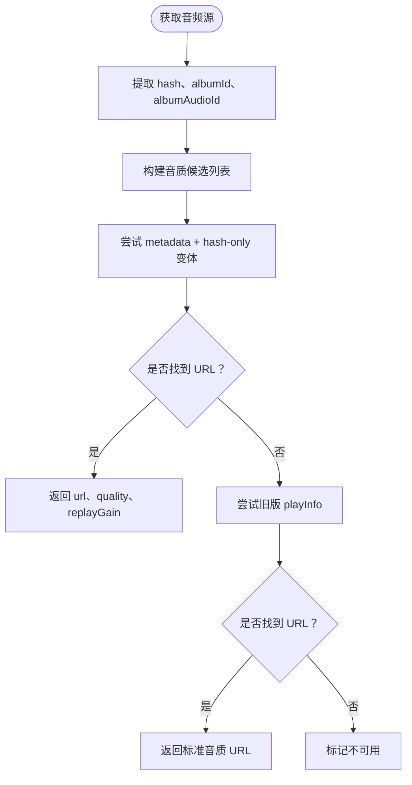
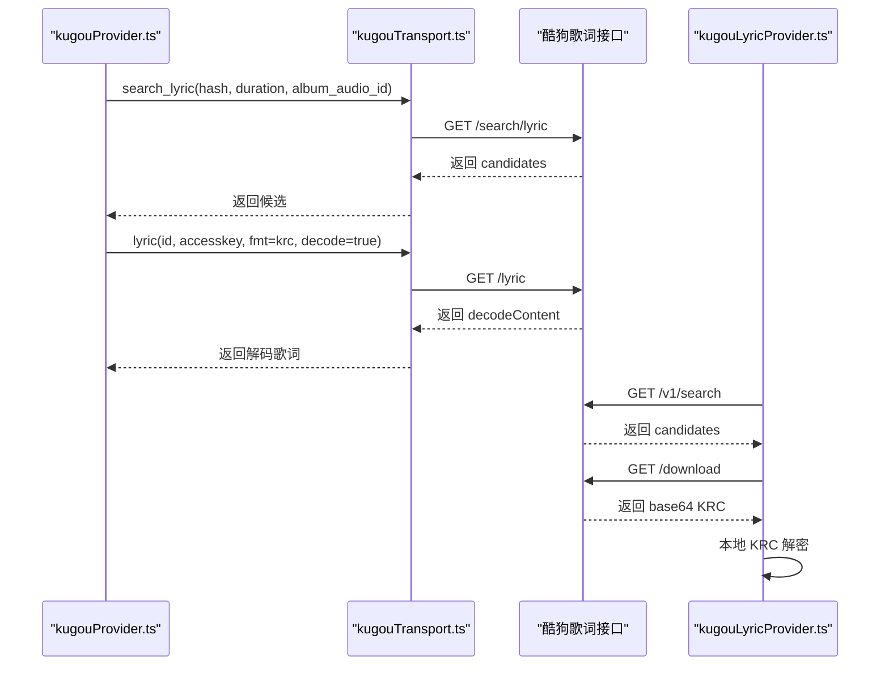
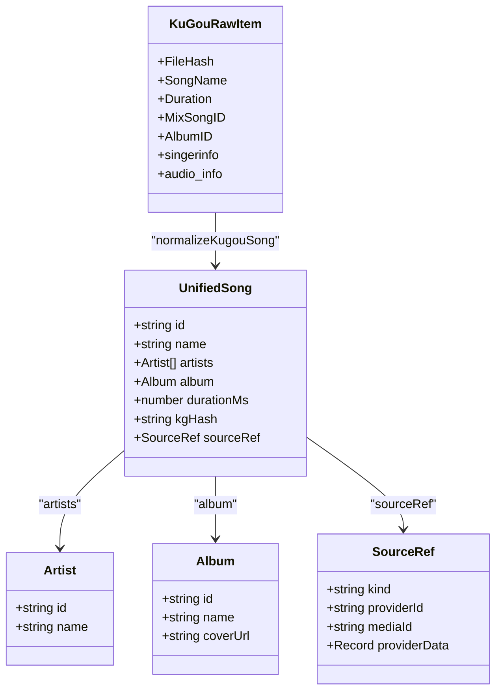
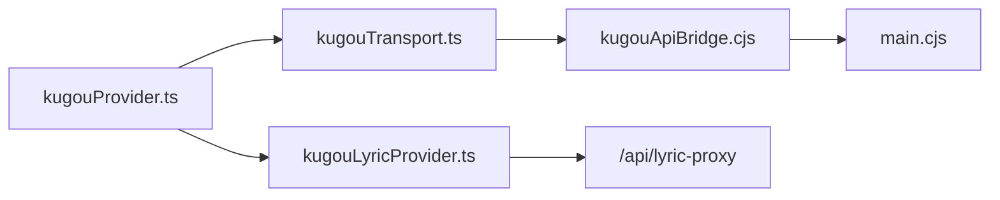

# 酷狗音乐集成

<cite>
**本文引用的文件**   
- [kugouProvider.ts](file://src/services/onlineMusic/kugouProvider.ts)
- [kugouTransport.ts](file://src/services/onlineMusic/kugouTransport.ts)
- [kugouApiBridge.cjs](file://electron/kugouApiBridge.cjs)
- [kugouLyricProvider.ts](file://src/utils/lyrics/providers/kugouLyricProvider.ts)
- [main.cjs](file://electron/main.cjs)
- [kugou_test.ts](file://test/manual/kugou_test.ts)
</cite>

## 目录
1. [简介](#简介)
2. [项目结构](#项目结构)
3. [核心组件](#核心组件)
4. [架构总览](#架构总览)
5. [详细组件分析](#详细组件分析)
6. [依赖关系分析](#依赖关系分析)
7. [性能与限制](#性能与限制)
8. [故障排查指南](#故障排查指南)
9. [结论](#结论)

## 简介
本技术文档面向在 Folia Major 中集成酷狗音乐平台的实现，重点说明以下方面：
- 认证流程与权限管理：包括设备注册、二维码登录、会话持久化、VIP 权益处理。
- 音乐搜索、播放、歌词获取的实现细节与数据流。
- 酷狗特有数据结构转换与字段映射逻辑。
- 音频质量选择、格式兼容与回退策略。
- 酷狗 API 的特殊限制与应对策略，如设备验证、IP/CORS 代理、频率控制。
- 酷狗特有的加密机制与解密方法，尤其是 KRC 歌词的识别与解密。

## 项目结构
本项目中与酷狗相关的代码主要分布在以下位置：
- 在线音乐提供者与传输层：`src/services/onlineMusic/kugouProvider.ts`、`src/services/onlineMusic/kugouTransport.ts`
- Electron 主进程桥接层：`electron/kugouApiBridge.cjs`
- 歌词专用提供者（独立于在线音乐提供者）：`src/utils/lyrics/providers/kugouLyricProvider.ts`
- Electron 主进程入口与媒体请求拦截：`electron/main.cjs`
- 手动测试脚本：`test/manual/kugou_test.ts`

**图表来源**
- [kugouProvider.ts:962-1009](file://src/services/onlineMusic/kugouProvider.ts#L962-L1009)
- [kugouTransport.ts:21-57](file://src/services/onlineMusic/kugouTransport.ts#L21-L57)
- [kugouApiBridge.cjs:156-305](file://electron/kugouApiBridge.cjs#L156-L305)
- [kugouLyricProvider.ts:83-147](file://src/utils/lyrics/providers/kugouLyricProvider.ts#L83-L147)

**章节来源**
- [kugouProvider.ts:1-34](file://src/services/onlineMusic/kugouProvider.ts#L1-L34)
- [kugouTransport.ts:1-19](file://src/services/onlineMusic/kugouTransport.ts#L1-L19)
- [kugouApiBridge.cjs:1-45](file://electron/kugouApiBridge.cjs#L1-L45)
- [kugouLyricProvider.ts:1-16](file://src/utils/lyrics/providers/kugouLyricProvider.ts#L1-L16)

## 核心组件
- 在线音乐提供者 `kugouProvider.ts`：统一封装酷狗的音乐搜索、播放、歌词、用户库、收藏、推荐、历史等能力，并将酷狗原始响应标准化为平台统一的歌曲、专辑、歌单、用户模型。
- 传输层 `kugouTransport.ts`：负责将操作名路由到具体酷狗接口，处理 Web 模式下的会话 Cookie、设备标识、错误码和设备验证重试；同时提供匿名搜索和旧版移动端播放信息回退。
- Electron 桥接层 `kugouApiBridge.cjs`：在主进程中加载 `kugoumusicapi`，安全地存储设备 Cookie 和账号凭证，自动处理设备注册与验证失败重试，并向渲染进程暴露受限状态。
- 歌词提供者 `kugouLyricProvider.ts`：独立实现酷狗歌词搜索、下载、KRC 识别与解密，以及非 TTML 定时歌词格式检测。
- Electron 主进程 `main.cjs`：注册 IPC 通道，允许渲染进程调用桥接层，并对酷狗媒体域名进行白名单放行。

**章节来源**
- [kugouProvider.ts:962-1009](file://src/services/onlineMusic/kugouProvider.ts#L962-L1009)
- [kugouTransport.ts:261-311](file://src/services/onlineMusic/kugouTransport.ts#L261-L311)
- [kugouApiBridge.cjs:156-305](file://electron/kugouApiBridge.cjs#L156-L305)
- [kugouLyricProvider.ts:291-376](file://src/utils/lyrics/providers/kugouLyricProvider.ts#L291-L376)
- [main.cjs:6058-6059](file://electron/main.cjs#L6058-L6059)

## 架构总览
酷狗集成的整体架构分为三层：
1. 应用层：通过 `kugouProvider.ts` 暴露统一的在线音乐提供者接口，供播放器、搜索、歌词、收藏等功能调用。
2. 传输层：根据运行环境选择 Electron IPC 或 Web 后端，统一处理签名、Cookie、设备标识、错误码和设备验证。
3. 主进程桥接层：在 Electron 中安全地持有设备 Cookie 和账号凭证，调用底层 `kugoumusicapi`，并自动处理设备注册与验证失败。

**图表来源**
- [kugouProvider.ts:981-1009](file://src/services/onlineMusic/kugouProvider.ts#L981-L1009)
- [kugouTransport.ts:269-311](file://src/services/onlineMusic/kugouTransport.ts#L269-L311)
- [kugouApiBridge.cjs:227-305](file://electron/kugouApiBridge.cjs#L227-L305)

## 详细组件分析

### 认证流程与权限管理
酷狗认证包含两个关键路径：
- Electron 模式：通过 `kugouApiBridge.cjs` 在主进程侧完成设备注册、二维码登录、会话持久化，并在每次请求前注入设备 Cookie 和账号信息。
- Web 模式：通过 `kugouTransport.ts` 维护 Cookie、token、userid、dfid，并在需要时重新注册设备。

**图表来源**
- [kugouApiBridge.cjs:128-176](file://electron/kugouApiBridge.cjs#L128-L176)
- [kugouApiBridge.cjs:247-305](file://electron/kugouApiBridge.cjs#L247-L305)
- [kugouTransport.ts:70-92](file://src/services/onlineMusic/kugouTransport.ts#L70-L92)
- [kugouTransport.ts:220-259](file://src/services/onlineMusic/kugouTransport.ts#L220-L259)
- [kugouTransport.ts:304-311](file://src/services/onlineMusic/kugouTransport.ts#L304-L311)

关键点：
- 设备标识由 `createDeviceCookies()` 生成，包含 GUID、MAC、WEBGL 等字段，模拟 lite 客户端身份。
- 会话持久化使用 Electron `safeStorage` 加密存储，避免明文泄露 token、dfid、cookie。
- 登录状态检查会调用 `user_detail`，并尝试领取青年 VIP 权益，再读取 `user_vip_detail` 更新 VIP 类型。
- 登出会清理敏感 Cookie，但保留设备身份信息。

**章节来源**
- [kugouApiBridge.cjs:47-68](file://electron/kugouApiBridge.cjs#L47-L68)
- [kugouApiBridge.cjs:128-141](file://electron/kugouApiBridge.cjs#L128-L141)
- [kugouApiBridge.cjs:156-208](file://electron/kugouApiBridge.cjs#L156-L208)
- [kugouApiBridge.cjs:268-305](file://electron/kugouApiBridge.cjs#L268-L305)
- [kugouProvider.ts:1138-1207](file://src/services/onlineMusic/kugouProvider.ts#L1138-L1207)
- [kugouTransport.ts:94-104](file://src/services/onlineMusic/kugouTransport.ts#L94-L104)

### 音乐搜索实现
搜索分为两种模式：
- 未认证搜索：使用匿名 Android 签名调用复杂搜索接口，适合快速体验。
- 已认证搜索：使用账户上下文调用 `/search`，返回更完整的搜索结果。

**图表来源**
- [kugouProvider.ts:981-1009](file://src/services/onlineMusic/kugouProvider.ts#L981-L1009)
- [kugouTransport.ts:106-173](file://src/services/onlineMusic/kugouTransport.ts#L106-L173)

关键点：
- 匿名搜索签名使用固定密钥包裹排序后的参数，生成 MD5 作为 signature。
- 已认证搜索优先使用账户上下文，提升结果准确性。
- 搜索结果通过 `normalizeKugouSong` 转换为统一模型，去重基于播放键值。

**章节来源**
- [kugouTransport.ts:106-173](file://src/services/onlineMusic/kugouTransport.ts#L106-L173)
- [kugouProvider.ts:225-288](file://src/services/onlineMusic/kugouProvider.ts#L225-L288)
- [kugouProvider.ts:648-660](file://src/services/onlineMusic/kugouProvider.ts#L648-L660)

### 播放与音频质量选择
播放流程首先尝试当前首选音质，若失败则按降级顺序尝试其他音质；如果所有变体都失败，则回退到旧版移动端播放信息接口。

**图表来源**
- [kugouProvider.ts:1016-1132](file://src/services/onlineMusic/kugouProvider.ts#L1016-L1132)
- [kugouTransport.ts:175-218](file://src/services/onlineMusic/kugouTransport.ts#L175-L218)

关键点：
- 音质映射：standard=128，high=320，lossless=flac，hires=high。
- 降级顺序：hires→lossless→high→standard。
- 云歌单直接走 `user_cloud_url`，不走 `song_url`。
- 支持解析多个候选 URL，并忽略逗号拼接的非法值。
- 旧版接口作为最后兜底，仅用于无法通过 `/song/url` 获取 URL 的场景。

**章节来源**
- [kugouProvider.ts:662-673](file://src/services/onlineMusic/kugouProvider.ts#L662-L673)
- [kugouProvider.ts:1016-1132](file://src/services/onlineMusic/kugouProvider.ts#L1016-L1132)
- [kugouTransport.ts:175-218](file://src/services/onlineMusic/kugouTransport.ts#L175-L218)

### 歌词获取与 KRC 解密
歌词获取分为两条路径：
- 在线音乐提供者路径：通过 `search_lyric` 获取候选，再通过 `lyric` 接口获取服务器解码后的 KRC 文本。
- 独立歌词提供者路径：通过 `lyrics.kugou.com` 搜索并下载 KRC，本地解密后解析。

**图表来源**
- [kugouProvider.ts:711-760](file://src/services/onlineMusic/kugouProvider.ts#L711-L760)
- [kugouLyricProvider.ts:291-376](file://src/utils/lyrics/providers/kugouLyricProvider.ts#L291-L376)

关键点：
- 在线提供者优先使用服务器解码后的 KRC，减少本地解密复杂度。
- 独立歌词提供者支持 KRC 头识别、Base64 转二进制、本地解密、非 TTML 格式检测。
- 歌词解析后标记 `isWordByWord`，并可选应用副歌效果。

**章节来源**
- [kugouProvider.ts:711-760](file://src/services/onlineMusic/kugouProvider.ts#L711-L760)
- [kugouLyricProvider.ts:20-65](file://src/utils/lyrics/providers/kugouLyricProvider.ts#L20-L65)
- [kugouLyricProvider.ts:291-376](file://src/utils/lyrics/providers/kugouLyricProvider.ts#L291-L376)

### 数据结构转换与字段映射
酷狗原始响应字段不统一，`kugouProvider.ts` 提供了大量辅助函数进行字段归一化：
- `valueOf`：从多个候选字段中取第一个有效值。
- `listOf`：递归查找嵌套对象中的数组列表。
- `songListOf`：专门查找歌曲数组，过滤非歌曲项。
- `coverOf`：处理封面 URL、占位符替换、HTTPS 安全化。
- `hashOf`：统一提取 FileHash、hash、audio_hash 等字段。
- `normalizeKugouSong`：将原始项转换为 `UnifiedSong`。
- `normalizeArtists`：处理歌手字符串、数组、嵌套 base 对象。
- `normalizeCollection`：统一歌单、专辑、艺人集合模型。

**图表来源**
- [kugouProvider.ts:37-42](file://src/services/onlineMusic/kugouProvider.ts#L37-L42)
- [kugouProvider.ts:66-89](file://src/services/onlineMusic/kugouProvider.ts#L66-L89)
- [kugouProvider.ts:91-112](file://src/services/onlineMusic/kugouProvider.ts#L91-L112)
- [kugouProvider.ts:166-184](file://src/services/onlineMusic/kugouProvider.ts#L166-L184)
- [kugouProvider.ts:225-288](file://src/services/onlineMusic/kugouProvider.ts#L225-L288)

**章节来源**
- [kugouProvider.ts:37-112](file://src/services/onlineMusic/kugouProvider.ts#L37-L112)
- [kugouProvider.ts:166-184](file://src/services/onlineMusic/kugouProvider.ts#L166-L184)
- [kugouProvider.ts:225-288](file://src/services/onlineMusic/kugouProvider.ts#L225-L288)

### 特殊限制与应对策略
- 设备验证：当酷狗返回错误码 `20028` 或消息包含“本次请求需要验证”时，系统会自动清除设备标识并重新注册 `register_dev`，然后重试原操作。
- IP/CORS 限制：Web 模式下通过 `/api/lyric-proxy` 代理酷狗歌词搜索和旧版播放接口，避免浏览器 CORS 限制。
- 频率控制：测试脚本和手动探针中未显式实现速率限制，建议上层调用方自行加限流，避免触发酷狗风控。
- 媒体域名放行：Electron 主进程对酷狗媒体域名进行白名单放行，允许播放资源加载。

**章节来源**
- [kugouTransport.ts:70-74](file://src/services/onlineMusic/kugouTransport.ts#L70-L74)
- [kugouTransport.ts:304-311](file://src/services/onlineMusic/kugouTransport.ts#L304-L311)
- [kugouLyricProvider.ts:117-147](file://src/utils/lyrics/providers/kugouLyricProvider.ts#L117-L147)
- [main.cjs:94-105](file://electron/main.cjs#L94-L105)
- [main.cjs:2834-2852](file://electron/main.cjs#L2834-L2852)

### 加密机制与解密方法
- KRC 歌词识别：通过检测字节头 `krc1` 判断是否为 KRC 格式。
- KRC 解密：调用 `krcDecrypt` 进行本地解密，失败时回退为纯文本歌词。
- Base64 转二进制：歌词下载接口返回 Base64，需转为 `Uint8Array` 后再解密。
- 非 TTML 格式检测：对普通 LRC、Enhanced LRC、VTT 进行格式识别。

**章节来源**
- [kugouLyricProvider.ts:20-65](file://src/utils/lyrics/providers/kugouLyricProvider.ts#L20-L65)
- [kugouLyricProvider.ts:349-376](file://src/utils/lyrics/providers/kugouLyricProvider.ts#L349-L376)

## 依赖关系分析

**图表来源**
- [kugouProvider.ts:22-34](file://src/services/onlineMusic/kugouProvider.ts#L22-L34)
- [kugouTransport.ts:269-311](file://src/services/onlineMusic/kugouTransport.ts#L269-L311)
- [kugouApiBridge.cjs:156-305](file://electron/kugouApiBridge.cjs#L156-L305)
- [kugouLyricProvider.ts:83-147](file://src/utils/lyrics/providers/kugouLyricProvider.ts#L83-L147)

**章节来源**
- [kugouProvider.ts:22-34](file://src/services/onlineMusic/kugouProvider.ts#L22-L34)
- [kugouTransport.ts:269-311](file://src/services/onlineMusic/kugouTransport.ts#L269-L311)
- [kugouApiBridge.cjs:156-305](file://electron/kugouApiBridge.cjs#L156-L305)
- [kugouLyricProvider.ts:83-147](file://src/utils/lyrics/providers/kugouLyricProvider.ts#L83-L147)

## 性能与限制
- 搜索分页：已认证搜索使用 `page` 和 `pagesize`，未认证搜索使用匿名接口，注意分页偏移计算。
- 播放回退：音质降级和旧版接口回退会增加网络请求次数，建议在缓存层优化。
- 歌词解析：KRC 解密和格式检测在浏览器端执行，可能影响首帧渲染性能，建议异步处理。
- 频率控制：酷狗 API 可能对频繁请求进行限制，建议在上层实现指数退避和并发控制。

[本节为通用指导，不直接分析具体文件]

## 故障排查指南
常见问题及定位方式：
- 设备验证失败：检查是否返回错误码 `20028` 或消息包含“本次请求需要验证”，确认是否触发了 `register_dev` 重试。
- 播放 URL 为空：检查 `song_url` 返回的 `status` 和 `errcode`，确认是否进入旧版 `playInfo` 回退。
- 歌词解密失败：检查 KRC 头是否正确，Base64 转换是否成功，本地解密是否抛出异常。
- 登录状态异常：检查 `user_detail` 是否返回 `userid` 和 `nickname`，确认 Electron 桥接层是否成功持久化会话。

**章节来源**
- [kugouTransport.ts:70-74](file://src/services/onlineMusic/kugouTransport.ts#L70-L74)
- [kugouProvider.ts:1077-1131](file://src/services/onlineMusic/kugouProvider.ts#L1077-L1131)
- [kugouLyricProvider.ts:49-65](file://src/utils/lyrics/providers/kugouLyricProvider.ts#L49-L65)
- [kugouProvider.ts:1138-1180](file://src/services/onlineMusic/kugouProvider.ts#L1138-L1180)

## 结论
本项目对酷狗音乐的集成实现了完整的认证、搜索、播放、歌词、收藏、推荐等能力，并通过 Electron 桥接层保障凭证安全，通过传输层统一处理设备验证和错误重试。数据结构转换层有效屏蔽了酷狗原始响应的不一致性，播放链路支持多音质降级和旧版接口回退，歌词模块支持 KRC 本地解密和非 TTML 格式检测。在实际使用中，建议关注频率控制和缓存优化，以提升用户体验和稳定性。

[本节为总结性内容，不直接分析具体文件]