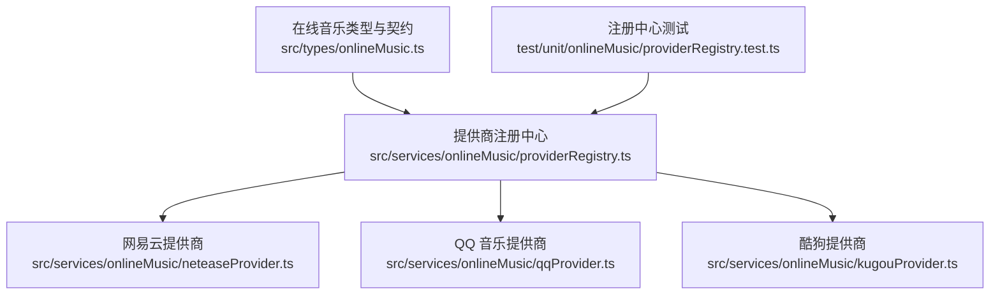
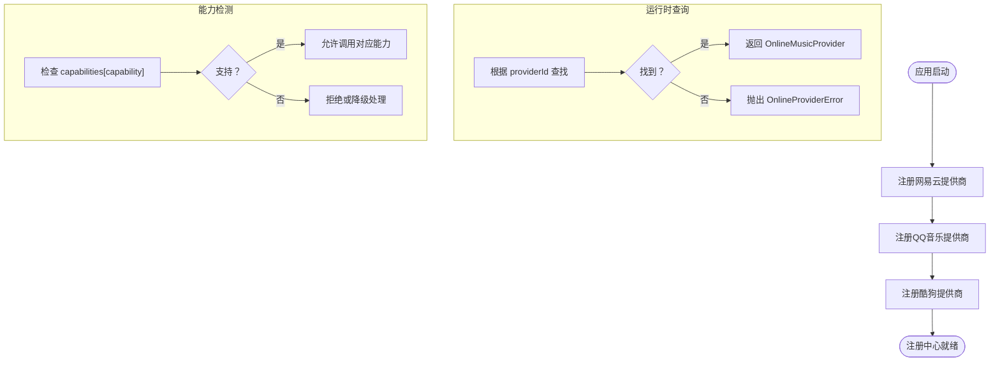
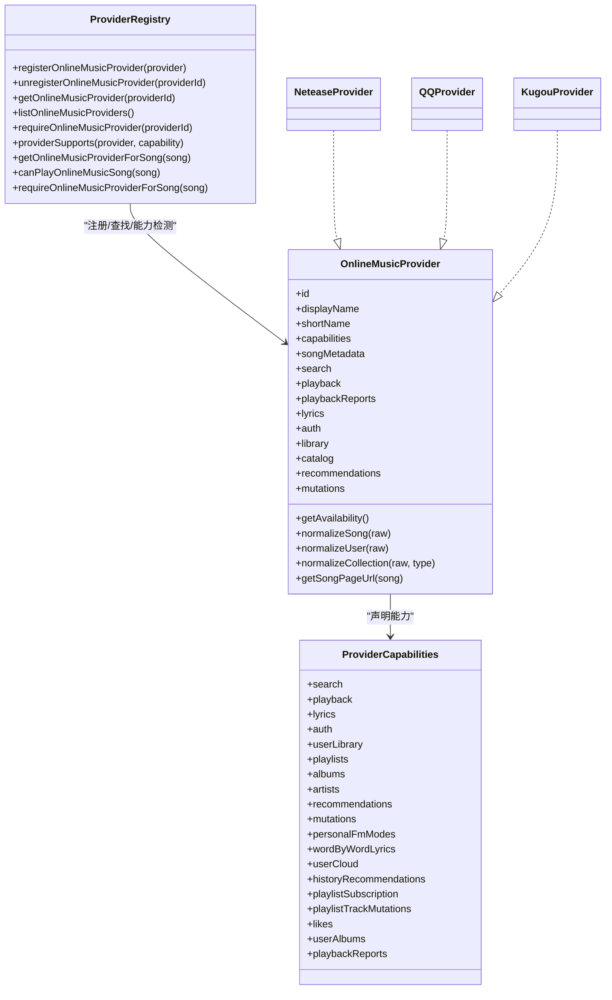
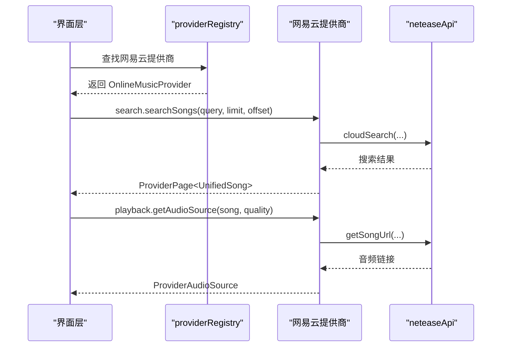
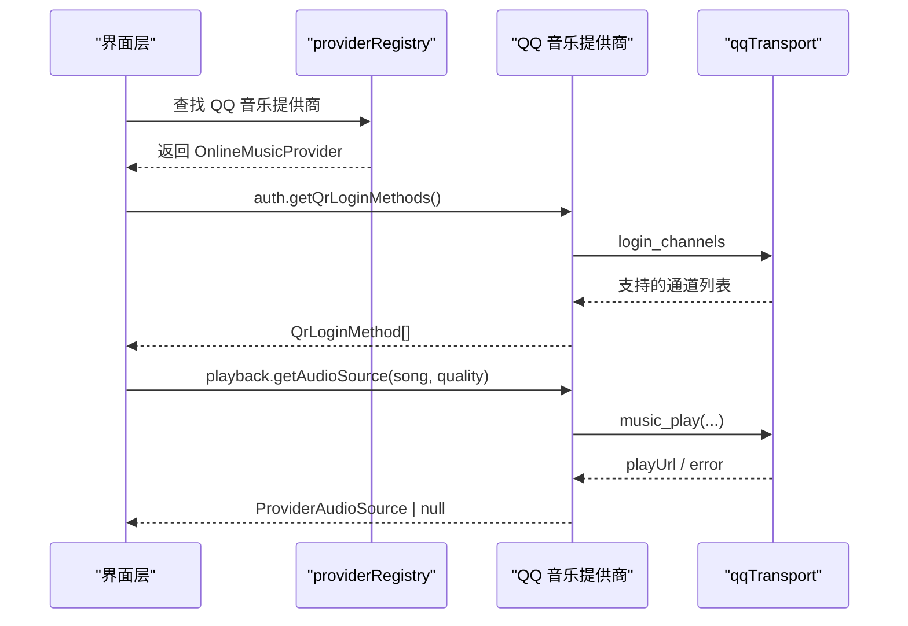
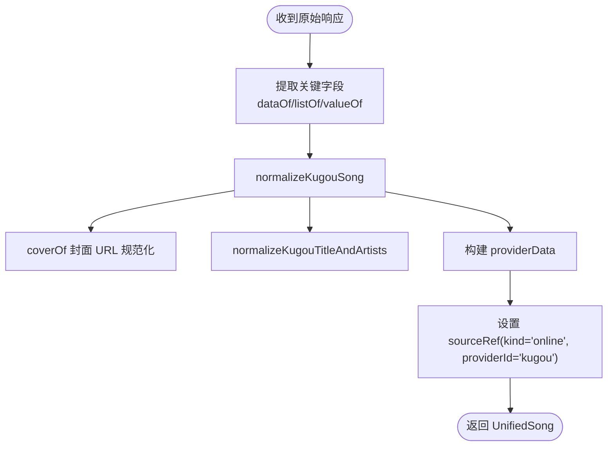
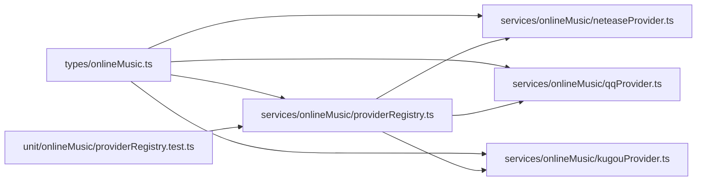

# 提供商架构设计

<cite>
**本文引用的文件**   
- [src/types/onlineMusic.ts](file://src/types/onlineMusic.ts)
- [src/services/onlineMusic/providerRegistry.ts](file://src/services/onlineMusic/providerRegistry.ts)
- [src/services/onlineMusic/neteaseProvider.ts](file://src/services/onlineMusic/neteaseProvider.ts)
- [src/services/onlineMusic/qqProvider.ts](file://src/services/onlineMusic/qqProvider.ts)
- [src/services/onlineMusic/kugouProvider.ts](file://src/services/onlineMusic/kugouProvider.ts)
- [test/unit/onlineMusic/providerRegistry.test.ts](file://test/unit/onlineMusic/providerRegistry.test.ts)
</cite>

## 目录
1. [引言](#引言)
2. [项目结构](#项目结构)
3. [核心组件](#核心组件)
4. [架构总览](#架构总览)
5. [详细组件分析](#详细组件分析)
6. [依赖关系分析](#依赖关系分析)
7. [性能与可扩展性](#性能与可扩展性)
8. [故障排查指南](#故障排查指南)
9. [新提供商集成指南](#新提供商集成指南)
10. [结论](#结论)

## 引言
本文面向 Folia Major 的在线音乐服务提供商架构，聚焦“提供商适配器模式”的设计与实现。文档解释统一的 `OnlineMusicProvider` 接口、`ProviderCapabilities` 能力声明、`providerRegistry` 注册中心机制，以及网易云、QQ 音乐、酷狗三家平台如何通过统一接口暴露搜索、播放、歌词、认证、歌单、专辑、歌手、推荐和变更能力。同时涵盖提供商生命周期管理、错误处理机制、扩展点设计，并提供新提供商集成的开发指南与最佳实践。

## 项目结构
围绕在线音乐提供商的核心代码集中在以下位置：
- 类型与契约定义：`src/types/onlineMusic.ts`
- 提供商注册中心：`src/services/onlineMusic/providerRegistry.ts`
- 网易云提供商适配：`src/services/onlineMusic/neteaseProvider.ts`
- QQ 音乐提供商适配：`src/services/onlineMusic/qqProvider.ts`
- 酷狗提供商适配：`src/services/onlineMusic/kugouProvider.ts`
- 注册中心单元测试：`test/unit/onlineMusic/providerRegistry.test.ts`

**图表来源**
- [src/types/onlineMusic.ts:31-53](file://src/types/onlineMusic.ts#L31-L53)
- [src/services/onlineMusic/providerRegistry.ts:11-60](file://src/services/onlineMusic/providerRegistry.ts#L11-L60)
- [src/services/onlineMusic/neteaseProvider.ts:231-256](file://src/services/onlineMusic/neteaseProvider.ts#L231-L256)
- [src/services/onlineMusic/qqProvider.ts:696-715](file://src/services/onlineMusic/qqProvider.ts#L696-L715)
- [src/services/onlineMusic/kugouProvider.ts:1-34](file://src/services/onlineMusic/kugouProvider.ts#L1-L34)

**章节来源**
- [src/types/onlineMusic.ts:1-380](file://src/types/onlineMusic.ts#L1-L380)
- [src/services/onlineMusic/providerRegistry.ts:1-61](file://src/services/onlineMusic/providerRegistry.ts#L1-L61)

## 核心组件
本系统的核心由三类组件构成：
- 统一接口与能力声明：`OnlineMusicProvider` 与 `ProviderCapabilities`
- 提供商注册中心：`providerRegistry`
- 具体平台适配：网易云、QQ 音乐、酷狗

### 统一接口与能力声明
`OnlineMusicProvider` 是各平台的统一抽象，包含基础标识、显示名称、可用性检测、能力声明、数据正规化方法，以及可选的搜索、播放、歌词、认证、用户库、目录、推荐、变更等能力模块。`ProviderCapabilities` 以布尔字段描述平台支持的能力集合，例如搜索、播放、歌词、认证、用户库、歌单、专辑、歌手、推荐、变更、逐字歌词、个人 FM、播放报告等。

关键要点：
- 所有能力通过 `capabilities` 显式声明，避免隐式假设。
- 可选能力（如 `auth`、`library`、`catalog`）允许部分实现，便于渐进式接入。
- 数据正规化方法将平台原始数据结构转换为统一的 `UnifiedSong`、`ProviderUser`、`ProviderCollection` 等模型。

**章节来源**
- [src/types/onlineMusic.ts:31-53](file://src/types/onlineMusic.ts#L31-L53)
- [src/types/onlineMusic.ts:337-357](file://src/types/onlineMusic.ts#L337-L357)

### 提供商注册中心
`providerRegistry` 提供以下核心功能：
- 注册：`registerOnlineMusicProvider`
- 注销：`unregisterOnlineMusicProvider`
- 查找：`getOnlineMusicProvider`
- 列出：`listOnlineMusicProviders`
- 强校验查找：`requireOnlineMusicProvider`
- 能力检测：`providerSupports`
- 按歌曲解析提供商：`getOnlineMusicProviderForSong`
- 判断是否可播放在线歌曲：`canPlayOnlineMusicSong`
- 按歌曲强校验提供商：`requireOnlineMusicProviderForSong`

启动时自动注册网易云、QQ 音乐、酷狗三个提供商。

**图表来源**
- [src/services/onlineMusic/providerRegistry.ts:11-60](file://src/services/onlineMusic/providerRegistry.ts#L11-L60)

**章节来源**
- [src/services/onlineMusic/providerRegistry.ts:1-61](file://src/services/onlineMusic/providerRegistry.ts#L1-L61)

## 架构总览
整体架构采用适配器模式：上层业务逻辑只依赖统一的 `OnlineMusicProvider` 接口，不直接耦合任何平台实现；`providerRegistry` 作为中央调度器，负责提供商的生命周期管理与能力路由。

**图表来源**
- [src/types/onlineMusic.ts:31-53](file://src/types/onlineMusic.ts#L31-L53)
- [src/types/onlineMusic.ts:337-357](file://src/types/onlineMusic.ts#L337-L357)
- [src/services/onlineMusic/providerRegistry.ts:11-60](file://src/services/onlineMusic/providerRegistry.ts#L11-L60)
- [src/services/onlineMusic/neteaseProvider.ts:231-256](file://src/services/onlineMusic/neteaseProvider.ts#L231-L256)
- [src/services/onlineMusic/qqProvider.ts:696-715](file://src/services/onlineMusic/qqProvider.ts#L696-L715)
- [src/services/onlineMusic/kugouProvider.ts:1-34](file://src/services/onlineMusic/kugouProvider.ts#L1-L34)

## 详细组件分析

### 网易云提供商
网易云提供商实现了较完整的能力集，包括搜索、播放、歌词、认证、用户库、目录、推荐、变更、个人 FM、逐字歌词、用户云盘、历史推荐、歌单订阅、歌单曲目变更、喜欢、用户专辑、播放报告等。其特点包括：
- 使用 `neteaseApi` 进行网络请求与数据获取。
- 对歌词进行多格式处理，并支持逐字歌词与副歌区间。
- 对播放可用性、不可用替换、听歌上报等进行精细控制。
- 扫码登录流程与诊断信息收集。

**图表来源**
- [src/services/onlineMusic/neteaseProvider.ts:266-272](file://src/services/onlineMusic/neteaseProvider.ts#L266-L272)
- [src/services/onlineMusic/neteaseProvider.ts:274-292](file://src/services/onlineMusic/neteaseProvider.ts#L274-L292)

**章节来源**
- [src/services/onlineMusic/neteaseProvider.ts:231-256](file://src/services/onlineMusic/neteaseProvider.ts#L231-L256)
- [src/services/onlineMusic/neteaseProvider.ts:266-292](file://src/services/onlineMusic/neteaseProvider.ts#L266-L292)
- [src/services/onlineMusic/neteaseProvider.ts:311-339](file://src/services/onlineMusic/neteaseProvider.ts#L311-L339)
- [src/services/onlineMusic/neteaseProvider.ts:341-386](file://src/services/onlineMusic/neteaseProvider.ts#L341-L386)
- [src/services/onlineMusic/neteaseProvider.ts:387-497](file://src/services/onlineMusic/neteaseProvider.ts#L387-L497)
- [src/services/onlineMusic/neteaseProvider.ts:498-549](file://src/services/onlineMusic/neteaseProvider.ts#L498-L549)

### QQ 音乐提供商
QQ 音乐提供商强调扫码登录通道发现、会话状态管理、匿名与带凭据路径的分流、歌单与专辑/歌手的目录导航、歌词获取与纯音乐识别、播放质量回退策略等。其特点包括：
- 动态探测后端支持的扫码登录通道，并在 UI 层展示可用选项。
- 对公开与非公开歌单采用不同读取路径，区分“未公开”与“无效响应”。
- 播放链路对空链接与上游拒绝进行区分，避免误判为临时错误。
- 歌词获取复用现有歌词服务，并处理缺失身份信息的边界情况。

**图表来源**
- [src/services/onlineMusic/qqProvider.ts:385-431](file://src/services/onlineMusic/qqProvider.ts#L385-L431)
- [src/services/onlineMusic/qqProvider.ts:274-325](file://src/services/onlineMusic/qqProvider.ts#L274-L325)

**章节来源**
- [src/services/onlineMusic/qqProvider.ts:696-715](file://src/services/onlineMusic/qqProvider.ts#L696-L715)
- [src/services/onlineMusic/qqProvider.ts:385-431](file://src/services/onlineMusic/qqProvider.ts#L385-L431)
- [src/services/onlineMusic/qqProvider.ts:274-325](file://src/services/onlineMusic/qqProvider.ts#L274-L325)
- [src/services/onlineMusic/qqProvider.ts:493-524](file://src/services/onlineMusic/qqProvider.ts#L493-L524)
- [src/services/onlineMusic/qqProvider.ts:526-565](file://src/services/onlineMusic/qqProvider.ts#L526-L565)
- [src/services/onlineMusic/qqProvider.ts:567-622](file://src/services/onlineMusic/qqProvider.ts#L567-L622)
- [src/services/onlineMusic/qqProvider.ts:624-694](file://src/services/onlineMusic/qqProvider.ts#L624-L694)

### 酷狗提供商
酷狗提供商在数据正规化方面较为复杂，需处理多种字段名、嵌套结构、封面 URL 规范化、标题与歌手拆分、专辑/歌手目录引用补全、虚拟推荐卡片、收藏与订阅、歌词与副歌区间、VIP 权益等。其特点包括：
- 强大的数据提取工具函数，用于从不同 API 响应中定位目标字段。
- 对封面 URL 进行安全协议转换与尺寸标准化。
- 对标题与歌手进行智能拆分，提升歌词匹配与目录导航准确性。
- 对专辑/歌手目录引用进行延迟解析，仅在需要导航时发起请求。
- 对歌词进行 KRC 解码与纯音乐识别，并支持副歌区间。

**图表来源**
- [src/services/onlineMusic/kugouProvider.ts:37-155](file://src/services/onlineMusic/kugouProvider.ts#L37-L155)
- [src/services/onlineMusic/kugouProvider.ts:225-288](file://src/services/onlineMusic/kugouProvider.ts#L225-L288)

**章节来源**
- [src/services/onlineMusic/kugouProvider.ts:1-34](file://src/services/onlineMusic/kugouProvider.ts#L1-L34)
- [src/services/onlineMusic/kugouProvider.ts:37-155](file://src/services/onlineMusic/kugouProvider.ts#L37-L155)
- [src/services/onlineMusic/kugouProvider.ts:225-288](file://src/services/onlineMusic/kugouProvider.ts#L225-L288)
- [src/services/onlineMusic/kugouProvider.ts:301-365](file://src/services/onlineMusic/kugouProvider.ts#L301-L365)
- [src/services/onlineMusic/kugouProvider.ts:367-448](file://src/services/onlineMusic/kugouProvider.ts#L367-L448)
- [src/services/onlineMusic/kugouProvider.ts:450-595](file://src/services/onlineMusic/kugouProvider.ts#L450-L595)
- [src/services/onlineMusic/kugouProvider.ts:648-709](file://src/services/onlineMusic/kugouProvider.ts#L648-L709)
- [src/services/onlineMusic/kugouProvider.ts:711-760](file://src/services/onlineMusic/kugouProvider.ts#L711-L760)

## 依赖关系分析
- 类型层：`src/types/onlineMusic.ts` 定义了所有公共契约，被注册中心与各提供商共同依赖。
- 注册中心：`providerRegistry` 依赖类型层，并在模块加载时自动注册网易云、QQ 音乐、酷狗。
- 提供商实现：各提供商依赖类型层与各自的传输层（如 `neteaseApi`、`qqTransport`、`kugouTransport`）。
- 测试：`providerRegistry.test.ts` 验证注册、查找、能力检测、按歌曲解析等核心行为。

**图表来源**
- [src/types/onlineMusic.ts:1-380](file://src/types/onlineMusic.ts#L1-L380)
- [src/services/onlineMusic/providerRegistry.ts:1-61](file://src/services/onlineMusic/providerRegistry.ts#L1-L61)
- [test/unit/onlineMusic/providerRegistry.test.ts:1-15](file://test/unit/onlineMusic/providerRegistry.test.ts#L1-L15)

**章节来源**
- [src/types/onlineMusic.ts:1-380](file://src/types/onlineMusic.ts#L1-L380)
- [src/services/onlineMusic/providerRegistry.ts:1-61](file://src/services/onlineMusic/providerRegistry.ts#L1-L61)
- [test/unit/onlineMusic/providerRegistry.test.ts:1-95](file://test/unit/onlineMusic/providerRegistry.test.ts#L1-L95)

## 性能与可扩展性
- 能力检测短路：通过 `providerSupports` 快速判断是否支持某项能力，避免不必要的调用。
- 按需解析目录引用：QQ 与酷狗在需要导航时才补全专辑/歌手 ID，减少冗余请求。
- 缓存策略：网易云与酷狗对副歌区间、推荐卡片、元数据解析等进行缓存，降低重复开销。
- 质量回退：QQ 与酷狗在播放链路中对音质进行回退，提高成功率。
- 可扩展点：新增提供商只需实现 `OnlineMusicProvider` 并通过 `registerOnlineMusicProvider` 注册，无需修改现有调用方。

[本节为通用指导，不直接分析具体文件]

## 故障排查指南
常见错误与处理：
- 提供商未注册：调用 `requireOnlineMusicProvider` 会抛出 `OnlineProviderError`，错误码为 `unavailable`。
- 非在线歌曲：调用 `requireOnlineMusicProviderForSong` 会对非在线来源抛出错误码 `unsupported`。
- 认证失败：网易云与 QQ 在登录状态、扫码流程、听歌上报等场景下会抛出 `auth-required`。
- 资源不可用：网易云的不可用歌曲可通过 `getReplacement` 获取替代方案；QQ 与酷狗在播放链路中区分空链接与上游拒绝。
- 网络或协议异常：各提供商对无效响应、超时、网关错误等进行日志记录与降级处理。

建议排查步骤：
1. 确认提供商已注册：使用 `listOnlineMusicProviders` 或 `getOnlineMusicProvider` 检查。
2. 检查能力声明：使用 `providerSupports` 确认所需能力是否启用。
3. 查看错误码：捕获 `OnlineProviderError` 并根据 `code` 分类处理。
4. 检查会话状态：网易云与 QQ 的登录状态与二维码流程需结合后端会话与前端存储。
5. 查看日志：各提供商对关键路径有 console.warn/info 输出，便于定位问题。

**章节来源**
- [src/services/onlineMusic/providerRegistry.ts:27-33](file://src/services/onlineMusic/providerRegistry.ts#L27-L33)
- [src/services/onlineMusic/providerRegistry.ts:50-56](file://src/services/onlineMusic/providerRegistry.ts#L50-L56)
- [src/services/onlineMusic/neteaseProvider.ts:311-339](file://src/services/onlineMusic/neteaseProvider.ts#L311-L339)
- [src/services/onlineMusic/qqProvider.ts:274-325](file://src/services/onlineMusic/qqProvider.ts#L274-L325)

## 新提供商集成指南
### 设计原则
- 遵循统一接口：实现 `OnlineMusicProvider`，明确声明 `capabilities`。
- 数据正规化：提供 `normalizeSong`、`normalizeUser`、`normalizeCollection`，确保与系统模型一致。
- 能力渐进：先实现搜索与播放，再逐步接入歌词、认证、用户库、目录、推荐、变更等。
- 错误语义化：使用 `OnlineProviderError` 表达认证、不支持、不可用等错误。
- 可观测性：对关键路径添加日志，便于调试与监控。

### 集成步骤
1. 创建提供商文件：例如 `src/services/onlineMusic/myProvider.ts`。
2. 实现 `OnlineMusicProvider`：至少实现 `id`、`displayName`、`capabilities`、`normalizeSong`。
3. 注册提供商：在模块末尾调用 `registerOnlineMusicProvider(myProvider)`。
4. 编写测试：参考 `providerRegistry.test.ts`，验证注册、查找、能力检测、按歌曲解析等行为。
5. 对接传输层：封装 HTTP 请求、会话管理、错误处理。
6. 接入 UI：通过 `getOnlineMusicProvider` 或 `useOnlineProviderPlatform` 等钩子使用。

### 最佳实践
- 能力声明保守：仅声明已实现的能力，避免 UI 误判。
- 数据校验严格：对空值、非法 ID、异常响应进行防御性处理。
- 缓存合理：对频繁访问的数据（如副歌区间、推荐卡片）进行短期缓存。
- 回退策略：在播放、歌词、目录解析等路径提供降级方案。
- 安全优先：对 URL、Cookie、Token 进行安全处理，避免泄露。

[本节为通用指导，不直接分析具体文件]

## 结论
Folia Major 的在线音乐提供商架构通过统一的 `OnlineMusicProvider` 接口与 `ProviderCapabilities` 能力声明，结合 `providerRegistry` 注册中心，实现了高度解耦的适配器模式。网易云、QQ 音乐、酷狗三家平台在保持各自特性的同时，对外暴露一致的 API，使上层业务无需关心底层差异。该架构具备良好的可扩展性与可维护性，为新提供商的接入提供了清晰的规范与路径。

[本节为总结性内容，不直接分析具体文件]