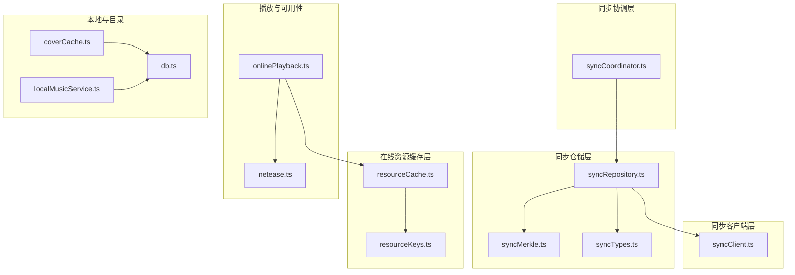
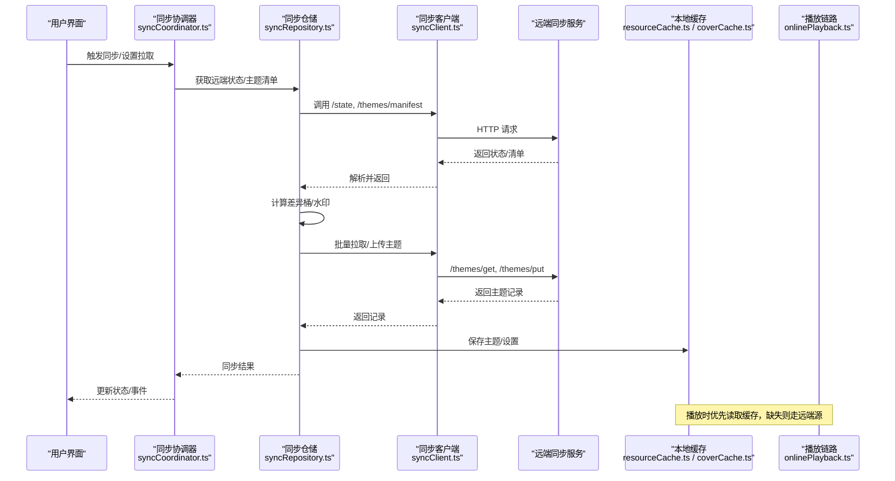
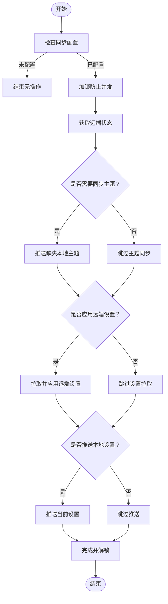
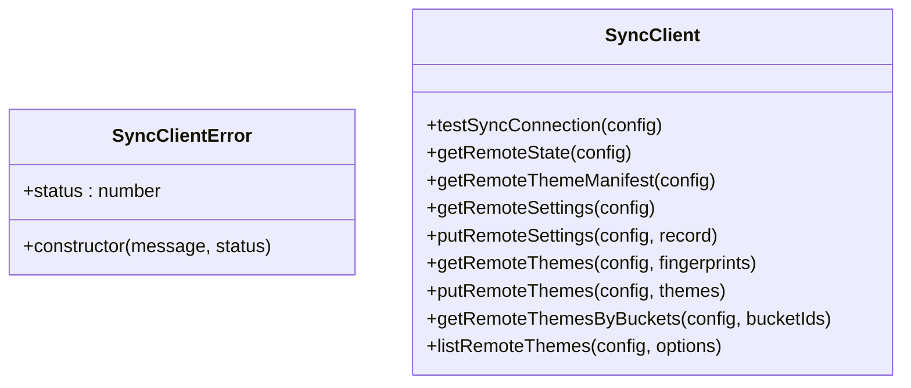
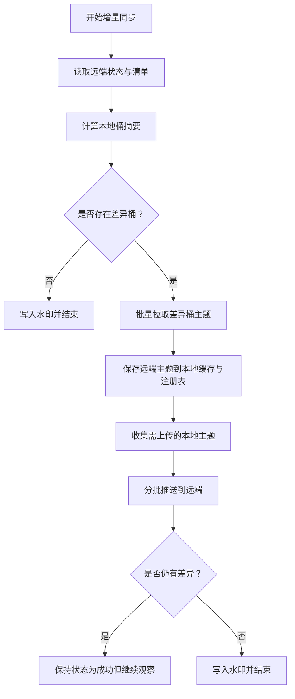
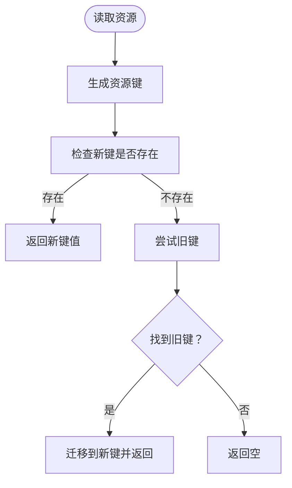
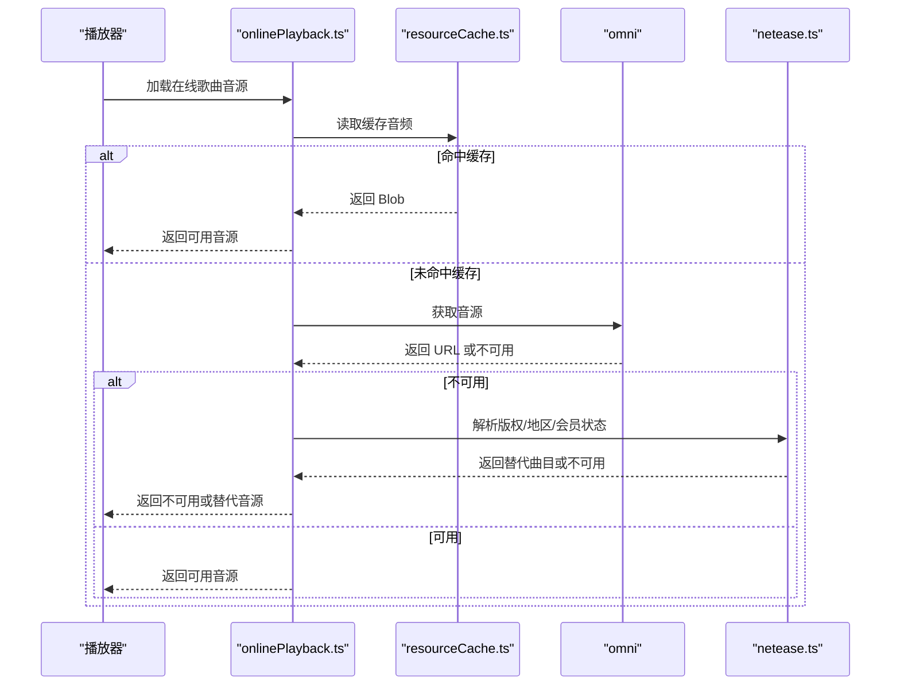
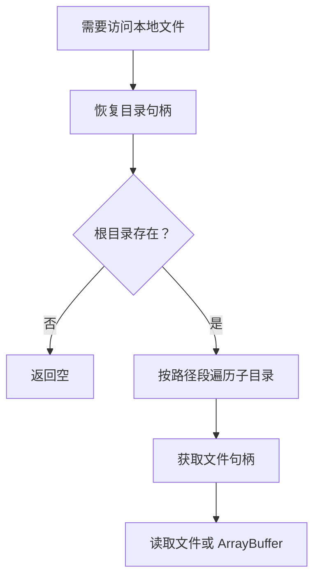
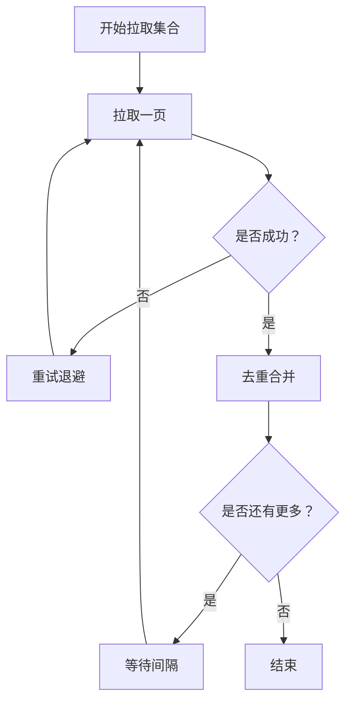
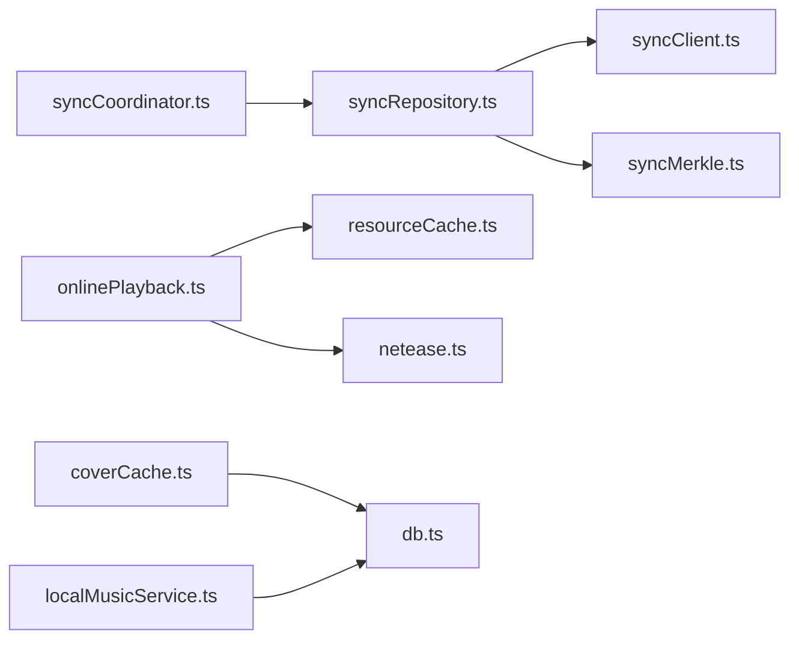

# 数据同步机制

<cite>
**本文引用的文件**   
- [syncCoordinator.ts](file://src/services/sync/syncCoordinator.ts)
- [syncClient.ts](file://src/services/sync/syncClient.ts)
- [syncRepository.ts](file://src/services/sync/syncRepository.ts)
- [syncTypes.ts](file://src/services/sync/syncTypes.ts)
- [syncMerkle.ts](file://src/services/sync/syncMerkle.ts)
- [resourceCache.ts](file://src/services/onlineMusic/resourceCache.ts)
- [resourceKeys.ts](file://src/services/onlineMusic/resourceKeys.ts)
- [onlinePlayback.ts](file://src/services/onlinePlayback.ts)
- [netease.ts](file://src/services/netease.ts)
- [coverCache.ts](file://src/services/coverCache.ts)
- [db.ts](file://src/services/db.ts)
- [localMusicService.ts](file://src/services/localMusicService.ts)
- [onlineCollectionSync.ts](file://src/components/folia-grid/onlineCollectionSync.ts)
</cite>

## 目录
1. [简介](#简介)
2. [项目结构](#项目结构)
3. [核心组件](#核心组件)
4. [架构总览](#架构总览)
5. [详细组件分析](#详细组件分析)
6. [依赖关系分析](#依赖关系分析)
7. [性能与内存优化](#性能与内存优化)
8. [故障排查指南](#故障排查指南)
9. [结论](#结论)

## 简介
本文面向 Folia Major 的在线音乐数据同步机制，聚焦以下目标：
- 音乐资源缓存策略：本地缓存、内存缓存、失效与迁移。
- 目录引用统一管理：跨平台一致性、路径与句柄恢复。
- 歌曲可用性检测：版权检查、地区限制、会员状态验证。
- 增量同步算法：差异桶、水印、冲突解决与完整性保证。
- 性能优化与内存管理最佳实践。

## 项目结构
本仓库中与“数据同步”直接相关的代码主要分布在以下模块：
- 同步协调层：负责启动同步、手动触发、设置拉取与推送、导出导入。
- 同步客户端层：封装 HTTP 请求、鉴权、分页与批量接口。
- 同步仓储层：主题指纹、差异桶、注册表、落盘与远程交互。
- 在线资源缓存层：音频、封面、歌词、ReplayGain 的统一键与迁移。
- 播放链路：从缓存到远端源的选择与元数据回填。
- 可用性检测：网易云等平台的不可用替代方案。
- 目录与本地库：文件系统句柄恢复、快照与持久化。

**图示来源**
- [syncCoordinator.ts:1-214](file://src/services/sync/syncCoordinator.ts#L1-L214)
- [syncClient.ts:1-152](file://src/services/sync/syncClient.ts#L1-L152)
- [syncRepository.ts:1-515](file://src/services/sync/syncRepository.ts#L1-L515)
- [syncMerkle.ts:1-49](file://src/services/sync/syncMerkle.ts#L1-L49)
- [syncTypes.ts:1-119](file://src/services/sync/syncTypes.ts#L1-L119)
- [resourceCache.ts:1-114](file://src/services/onlineMusic/resourceCache.ts#L1-L114)
- [resourceKeys.ts:1-26](file://src/services/onlineMusic/resourceKeys.ts#L1-L26)
- [onlinePlayback.ts:1-251](file://src/services/onlinePlayback.ts#L1-L251)
- [netease.ts:205-491](file://src/services/netease.ts#L205-L491)
- [coverCache.ts:101-129](file://src/services/coverCache.ts#L101-L129)
- [db.ts:258-277](file://src/services/db.ts#L258-L277)
- [localMusicService.ts:1503-1537](file://src/services/localMusicService.ts#L1503-L1537)

**章节来源**
- [syncCoordinator.ts:1-214](file://src/services/sync/syncCoordinator.ts#L1-L214)
- [syncClient.ts:1-152](file://src/services/sync/syncClient.ts#L1-L152)
- [syncRepository.ts:1-515](file://src/services/sync/syncRepository.ts#L1-L515)
- [syncMerkle.ts:1-49](file://src/services/sync/syncMerkle.ts#L1-L49)
- [syncTypes.ts:1-119](file://src/services/sync/syncTypes.ts#L1-L119)
- [resourceCache.ts:1-114](file://src/services/onlineMusic/resourceCache.ts#L1-L114)
- [resourceKeys.ts:1-26](file://src/services/onlineMusic/resourceKeys.ts#L1-L26)
- [onlinePlayback.ts:1-251](file://src/services/onlinePlayback.ts#L1-L251)
- [netease.ts:205-491](file://src/services/netease.ts#L205-L491)
- [coverCache.ts:101-129](file://src/services/coverCache.ts#L101-L129)
- [db.ts:258-277](file://src/services/db.ts#L258-L277)
- [localMusicService.ts:1503-1537](file://src/services/localMusicService.ts#L1503-L1537)

## 核心组件
- 同步协调器：统一入口，控制主题同步、设置拉取/推送、导出/导入。
- 同步客户端：HTTP 适配层，提供健康检查、状态、主题清单、设置与主题批量接口。
- 同步仓储：主题指纹与差异桶计算、本地注册表、增量同步、远端拉取与本地落盘。
- 在线资源缓存：按资源类型（音频、歌词、封面、ReplayGain）构建稳定键，支持旧键迁移。
- 播放链路：优先使用缓存，回退到远端源，回填 ReplayGain 与歌词选择。
- 可用性检测：解析版权标记、地区限制与会员状态，必要时推荐可播替代曲目。
- 目录与本地库：目录句柄恢复、本地快照、封面与二进制资源存储。

**章节来源**
- [syncCoordinator.ts:1-214](file://src/services/sync/syncCoordinator.ts#L1-L214)
- [syncClient.ts:1-152](file://src/services/sync/syncClient.ts#L1-L152)
- [syncRepository.ts:1-515](file://src/services/sync/syncRepository.ts#L1-L515)
- [resourceCache.ts:1-114](file://src/services/onlineMusic/resourceCache.ts#L1-L114)
- [onlinePlayback.ts:1-251](file://src/services/onlinePlayback.ts#L1-L251)
- [netease.ts:205-491](file://src/services/netease.ts#L205-L491)
- [coverCache.ts:101-129](file://src/services/coverCache.ts#L101-L129)
- [db.ts:258-277](file://src/services/db.ts#L258-L277)
- [localMusicService.ts:1503-1537](file://src/services/localMusicService.ts#L1503-L1537)

## 架构总览
Folia Major 的数据同步采用“协调器 + 客户端 + 仓储”的分层设计，配合在线资源缓存与播放链路，形成从远端到本地的闭环。

**图示来源**
- [syncCoordinator.ts:94-149](file://src/services/sync/syncCoordinator.ts#L94-L149)
- [syncRepository.ts:335-459](file://src/services/sync/syncRepository.ts#L335-L459)
- [syncClient.ts:64-151](file://src/services/sync/syncClient.ts#L64-L151)
- [resourceCache.ts:13-34](file://src/services/onlineMusic/resourceCache.ts#L13-L34)
- [onlinePlayback.ts:18-64](file://src/services/onlinePlayback.ts#L18-L64)

## 详细组件分析

### 同步协调器
职责：
- 初始化同步任务。
- 测试连接与获取远端状态。
- 拉取远端视觉设置并应用。
- 执行主题同步、设置推送。
- 导出/导入同步库包。

关键点：
- 防重入锁：避免重复同步。
- 状态机：idle/syncing/success/error。
- 事件通知：主题同步完成后派发事件。

**图示来源**
- [syncCoordinator.ts:94-149](file://src/services/sync/syncCoordinator.ts#L94-L149)

**章节来源**
- [syncCoordinator.ts:1-214](file://src/services/sync/syncCoordinator.ts#L1-L214)

### 同步客户端
职责：
- 构造带鉴权的 HTTP 请求。
- 暴露健康检查、状态、主题清单、设置与主题批量接口。
- 分页与去重处理。

关键点：
- 错误包装：统一 SyncClientError，携带状态码。
- 空响应处理：204 返回 null。
- 分页：主题列表通过 cursor 分页。

**图示来源**
- [syncClient.ts:19-151](file://src/services/sync/syncClient.ts#L19-L151)

**章节来源**
- [syncClient.ts:1-152](file://src/services/sync/syncClient.ts#L1-L152)

### 同步仓储与增量同步
职责：
- 主题指纹与差异桶计算。
- 本地注册表维护与历史迁移。
- 增量同步：比较本地与远端差异，批量拉取/上传。
- 水印机制：避免重复扫描。

关键流程：
- 读取远端状态与清单。
- 计算本地桶摘要并与远端对比。
- 对差异桶进行批量拉取。
- 收集需上传的本地主题并分批推送。
- 更新水印与状态。

**图示来源**
- [syncRepository.ts:335-459](file://src/services/sync/syncRepository.ts#L335-L459)
- [syncMerkle.ts:1-49](file://src/services/sync/syncMerkle.ts#L1-L49)

**章节来源**
- [syncRepository.ts:1-515](file://src/services/sync/syncRepository.ts#L1-L515)
- [syncMerkle.ts:1-49](file://src/services/sync/syncMerkle.ts#L1-L49)

### 在线资源缓存与键策略
职责：
- 统一资源键生成，区分音频、歌词、封面、ReplayGain。
- 兼容旧键迁移（如网易云旧格式）。
- 独立缓存音频与封面，支持独立清理。

要点：
- 键前缀决定存储类别（例如 metadata_cache）。
- 旧键迁移：首次读取时自动迁移到新键。
- ReplayGain 与音频同生命周期，避免音量跳变。

**图示来源**
- [resourceCache.ts:13-34](file://src/services/onlineMusic/resourceCache.ts#L13-L34)
- [resourceKeys.ts:8-25](file://src/services/onlineMusic/resourceKeys.ts#L8-L25)

**章节来源**
- [resourceCache.ts:1-114](file://src/services/onlineMusic/resourceCache.ts#L1-L114)
- [resourceKeys.ts:1-26](file://src/services/onlineMusic/resourceKeys.ts#L1-L26)

### 播放链路与可用性检测
职责：
- 优先使用缓存音频；若缺失则通过远端源获取。
- 回填 ReplayGain 与歌词选择。
- 检测歌曲可用性：版权标记、地区限制、会员状态。
- 不可用时尝试替代版本或推荐。

流程：
- 读取缓存音频 → 若无 → 调用 omni.getAudioSource。
- 若远端返回不可用 → 解析 privilege.st < 0 等标记。
- 尝试替代曲目 ID 或版权推荐接口。

**图示来源**
- [onlinePlayback.ts:18-64](file://src/services/onlinePlayback.ts#L18-L64)
- [netease.ts:205-491](file://src/services/netease.ts#L205-L491)

**章节来源**
- [onlinePlayback.ts:1-251](file://src/services/onlinePlayback.ts#L1-L251)
- [netease.ts:205-491](file://src/services/netease.ts#L205-L491)

### 目录引用与本地库一致性
职责：
- 目录句柄恢复：根据根文件夹名与相对路径恢复文件句柄。
- 本地快照：保存/读取/删除本地库快照。
- 封面与二进制资源：统一写入与缓存。

要点：
- 跨平台路径解析：按段遍历目录句柄。
- 快照键命名：local_snapshot_{rootFolderName}。
- 封面缓存：优先写资产再写缓存，失败回退。

**图示来源**
- [localMusicService.ts:1507-1537](file://src/services/localMusicService.ts#L1507-L1537)
- [db.ts:258-277](file://src/services/db.ts#L258-L277)
- [coverCache.ts:101-129](file://src/services/coverCache.ts#L101-L129)

**章节来源**
- [localMusicService.ts:1503-1537](file://src/services/localMusicService.ts#L1503-L1537)
- [db.ts:258-277](file://src/services/db.ts#L258-L277)
- [coverCache.ts:101-129](file://src/services/coverCache.ts#L101-L129)

### 集合增量同步与重试
职责：
- 分页拉取集合，支持重试与取消。
- 去重合并，防止重复条目。
- 在未知 total 时防止原地打转。

关键点：
- 指数退避重试：[500ms, 1500ms, 4000ms]。
- 页面间隔：默认 100ms。
- 最大页数：1000 页保护。

**图示来源**
- [onlineCollectionSync.ts:46-104](file://src/components/folia-grid/onlineCollectionSync.ts#L46-L104)

**章节来源**
- [onlineCollectionSync.ts:36-104](file://src/components/folia-grid/onlineCollectionSync.ts#L36-L104)

## 依赖关系分析
- 协调器依赖仓储层进行主题与设置同步。
- 仓储层依赖客户端进行 HTTP 通信，依赖 Merkle 计算差异桶。
- 播放链路依赖资源缓存与远端源，依赖可用性检测逻辑。
- 本地库与目录句柄相互协作，确保跨平台一致性。

**图示来源**
- [syncCoordinator.ts:1-214](file://src/services/sync/syncCoordinator.ts#L1-L214)
- [syncRepository.ts:1-515](file://src/services/sync/syncRepository.ts#L1-L515)
- [syncClient.ts:1-152](file://src/services/sync/syncClient.ts#L1-L152)
- [syncMerkle.ts:1-49](file://src/services/sync/syncMerkle.ts#L1-L49)
- [onlinePlayback.ts:1-251](file://src/services/onlinePlayback.ts#L1-L251)
- [resourceCache.ts:1-114](file://src/services/onlineMusic/resourceCache.ts#L1-L114)
- [netease.ts:205-491](file://src/services/netease.ts#L205-L491)
- [coverCache.ts:101-129](file://src/services/coverCache.ts#L101-L129)
- [db.ts:258-277](file://src/services/db.ts#L258-L277)
- [localMusicService.ts:1503-1537](file://src/services/localMusicService.ts#L1503-L1537)

**章节来源**
- [syncCoordinator.ts:1-214](file://src/services/sync/syncCoordinator.ts#L1-L214)
- [syncRepository.ts:1-515](file://src/services/sync/syncRepository.ts#L1-L515)
- [syncClient.ts:1-152](file://src/services/sync/syncClient.ts#L1-L152)
- [syncMerkle.ts:1-49](file://src/services/sync/syncMerkle.ts#L1-L49)
- [onlinePlayback.ts:1-251](file://src/services/onlinePlayback.ts#L1-L251)
- [resourceCache.ts:1-114](file://src/services/onlineMusic/resourceCache.ts#L1-L114)
- [netease.ts:205-491](file://src/services/netease.ts#L205-L491)
- [coverCache.ts:101-129](file://src/services/coverCache.ts#L101-L129)
- [db.ts:258-277](file://src/services/db.ts#L258-L277)
- [localMusicService.ts:1503-1537](file://src/services/localMusicService.ts#L1503-L1537)

## 性能与内存优化
- 增量同步：通过差异桶与水印减少全量扫描，降低网络与 IO 压力。
- 批量操作：主题上传/拉取采用批大小限制，避免单次过大负载。
- 缓存分层：音频、封面、歌词、ReplayGain 分别缓存，独立清理，避免互相影响。
- 键迁移：旧键自动迁移到新键，避免重复下载与存储膨胀。
- 播放链路：优先使用缓存，减少远端请求；ReplayGain 持久化避免音量跳变。
- 集合同步：重试退避与页面间隔，防止雪崩与死循环。
- 内存监控：调试工具记录工作集峰值与均值，避免长期运行导致内存泄漏。

**章节来源**
- [syncRepository.ts:335-459](file://src/services/sync/syncRepository.ts#L335-L459)
- [resourceCache.ts:13-34](file://src/services/onlineMusic/resourceCache.ts#L13-L34)
- [onlinePlayback.ts:18-64](file://src/services/onlinePlayback.ts#L18-L64)
- [onlineCollectionSync.ts:46-104](file://src/components/folia-grid/onlineCollectionSync.ts#L46-L104)

## 故障排查指南
- 同步失败：检查协调器状态与错误信息，确认远端连接与鉴权。
- 主题不同步：查看差异桶与水印，确认本地注册表与远端清单一致。
- 播放不可用：检查版权标记与替代曲目推荐，确认会员状态与地区限制。
- 缓存异常：核对资源键与前缀，确认旧键迁移是否成功。
- 目录访问失败：检查根目录句柄与路径段解析，确认权限恢复。

**章节来源**
- [syncCoordinator.ts:142-149](file://src/services/sync/syncCoordinator.ts#L142-L149)
- [syncRepository.ts:335-459](file://src/services/sync/syncRepository.ts#L335-L459)
- [netease.ts:344-491](file://src/services/netease.ts#L344-L491)
- [resourceCache.ts:13-34](file://src/services/onlineMusic/resourceCache.ts#L13-L34)
- [localMusicService.ts:1507-1537](file://src/services/localMusicService.ts#L1507-L1537)

## 结论
Folia Major 的数据同步机制通过分层架构、增量算法与多层缓存，实现了高效、可靠且可扩展的音乐资源同步。结合可用性检测与目录句柄恢复，确保了跨平台的一致性与用户体验。未来可进一步优化差异桶粒度与缓存淘汰策略，以应对更大规模的数据集与更高的并发场景。