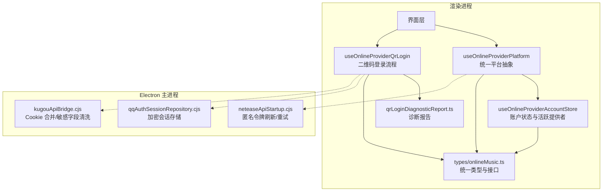
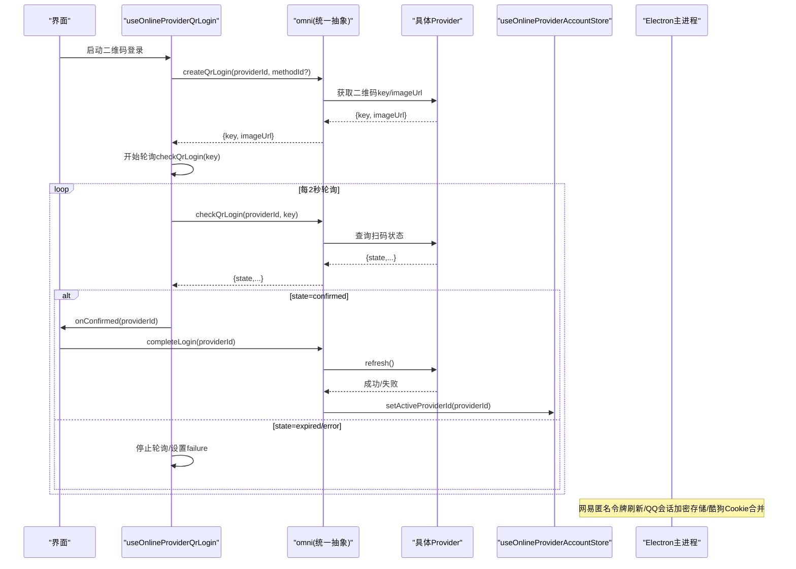
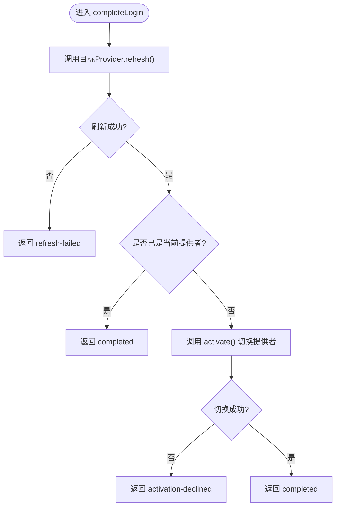
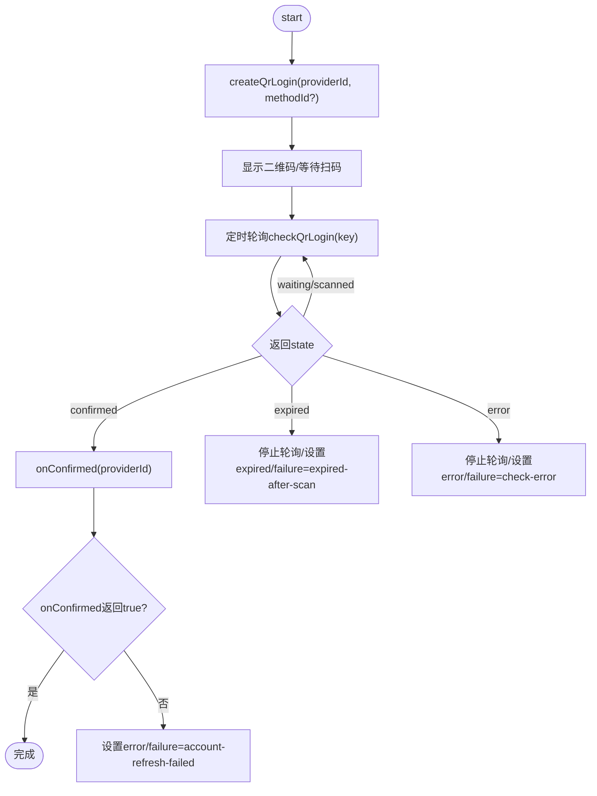
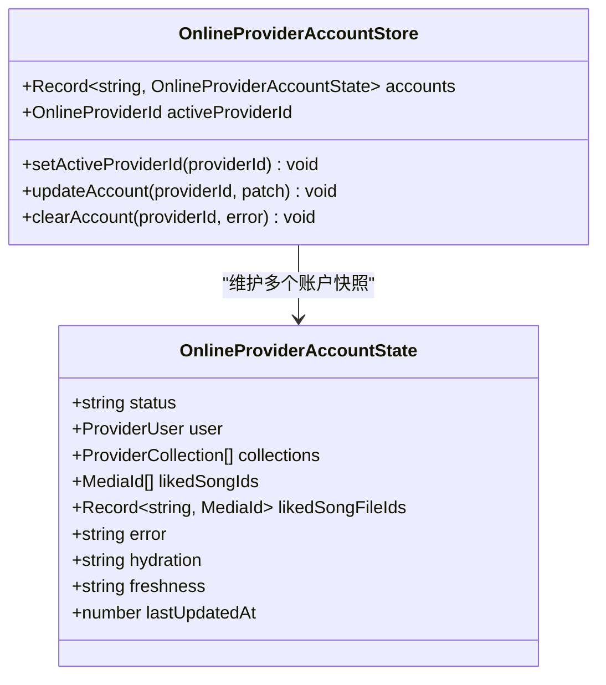
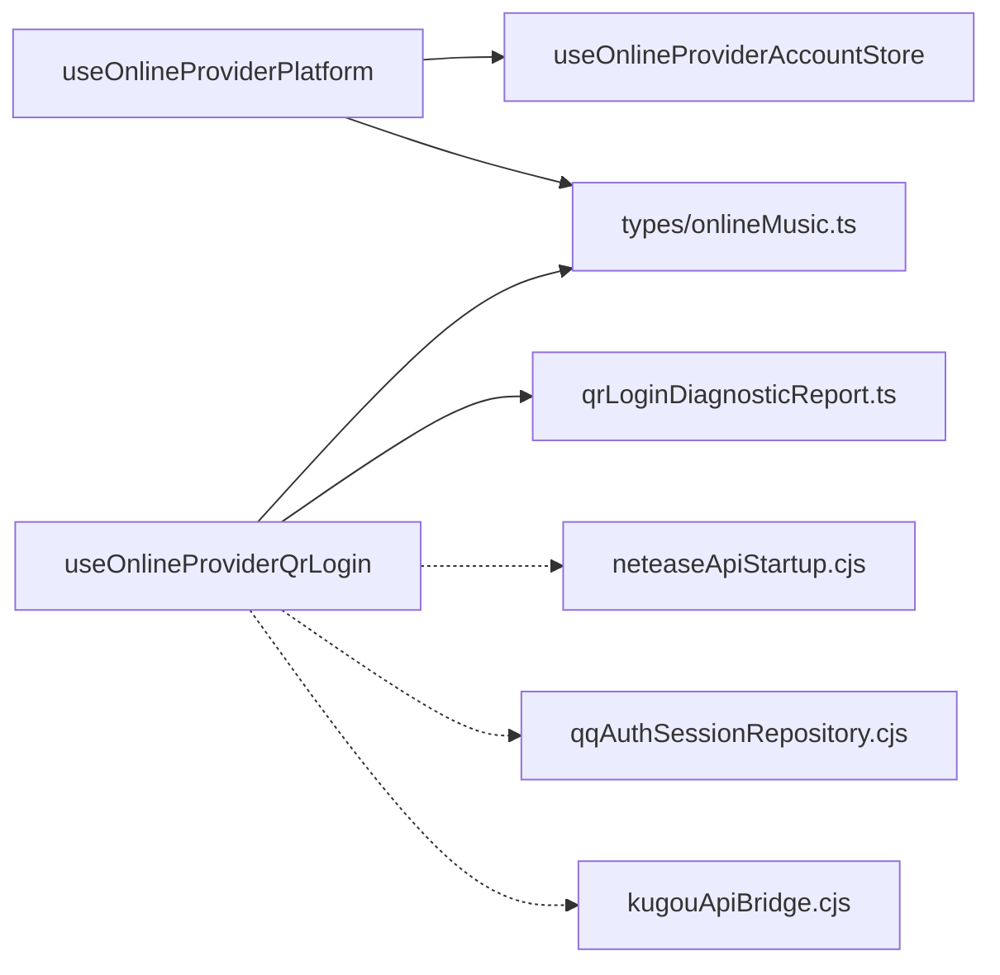

# 认证系统

<cite>
**本文引用的文件**   
- [src/hooks/useOnlineProviderPlatform.ts](file://src/hooks/useOnlineProviderPlatform.ts)
- [src/hooks/useOnlineProviderQrLogin.ts](file://src/hooks/useOnlineProviderQrLogin.ts)
- [src/stores/useOnlineProviderAccountStore.ts](file://src/stores/useOnlineProviderAccountStore.ts)
- [src/types/onlineMusic.ts](file://src/types/onlineMusic.ts)
- [src/utils/qrLoginDiagnosticReport.ts](file://src/utils/qrLoginDiagnosticReport.ts)
- [electron/neteaseApiStartup.cjs](file://electron/neteaseApiStartup.cjs)
- [electron/qqAuthSessionRepository.cjs](file://electron/qqAuthSessionRepository.cjs)
- [electron/kugouApiBridge.cjs](file://electron/kugouApiBridge.cjs)
</cite>

## 目录
1. [简介](#简介)
2. [项目结构](#项目结构)
3. [核心组件](#核心组件)
4. [架构总览](#架构总览)
5. [详细组件分析](#详细组件分析)
6. [依赖关系分析](#依赖关系分析)
7. [性能与可靠性](#性能与可靠性)
8. [故障排查指南](#故障排查指南)
9. [安全与隐私最佳实践](#安全与隐私最佳实践)
10. [结论](#结论)

## 简介
本技术文档面向 Folia Major 的在线音乐认证子系统，重点说明多平台认证的统一抽象层设计、认证状态管理、会话持久化、自动刷新机制、二维码登录流程、用户账户信息缓存策略、失败恢复与登出清理，以及认证安全与隐私保护实践。文档以代码级实现为依据，辅以架构图与时序图，帮助开发者快速理解并扩展新的音乐平台认证能力。

## 项目结构
认证相关代码主要分布在以下位置：
- 前端 Hook 与 Store：统一抽象层、二维码登录流程、账户状态与活跃提供者切换。
- 类型定义：统一的 Provider 接口、二维码状态、错误码等。
- Electron 主进程：网易匿名令牌刷新、QQ 加密会话存储、酷狗 Cookie 合并与敏感字段清洗。
- 诊断工具：扫码登录时间线与问题报告生成。

**图示来源**
- [src/hooks/useOnlineProviderPlatform.ts:1-115](file://src/hooks/useOnlineProviderPlatform.ts#L1-L115)
- [src/hooks/useOnlineProviderQrLogin.ts:1-228](file://src/hooks/useOnlineProviderQrLogin.ts#L1-L228)
- [src/stores/useOnlineProviderAccountStore.ts:1-130](file://src/stores/useOnlineProviderAccountStore.ts#L1-L130)
- [src/types/onlineMusic.ts:1-380](file://src/types/onlineMusic.ts#L1-L380)
- [src/utils/qrLoginDiagnosticReport.ts:1-90](file://src/utils/qrLoginDiagnosticReport.ts#L1-L90)
- [electron/neteaseApiStartup.cjs:1-216](file://electron/neteaseApiStartup.cjs#L1-L216)
- [electron/qqAuthSessionRepository.cjs:1-84](file://electron/qqAuthSessionRepository.cjs#L1-L84)
- [electron/kugouApiBridge.cjs:181-225](file://electron/kugouApiBridge.cjs#L181-L225)

**章节来源**
- [src/hooks/useOnlineProviderPlatform.ts:1-115](file://src/hooks/useOnlineProviderPlatform.ts#L1-L115)
- [src/hooks/useOnlineProviderQrLogin.ts:1-228](file://src/hooks/useOnlineProviderQrLogin.ts#L1-L228)
- [src/stores/useOnlineProviderAccountStore.ts:1-130](file://src/stores/useOnlineProviderAccountStore.ts#L1-L130)
- [src/types/onlineMusic.ts:1-380](file://src/types/onlineMusic.ts#L1-L380)
- [src/utils/qrLoginDiagnosticReport.ts:1-90](file://src/utils/qrLoginDiagnosticReport.ts#L1-L90)
- [electron/neteaseApiStartup.cjs:1-216](file://electron/neteaseApiStartup.cjs#L1-L216)
- [electron/qqAuthSessionRepository.cjs:1-84](file://electron/qqAuthSessionRepository.cjs#L1-L84)
- [electron/kugouApiBridge.cjs:181-225](file://electron/kugouApiBridge.cjs#L181-L225)

## 核心组件
- 统一平台抽象层：提供多平台账号摘要、活跃提供者切换、登录后激活与刷新事务、登出钩子。
- 二维码登录流程：封装二维码创建、轮询校验、过期处理、确认回调、诊断报告生成。
- 账户状态与活跃提供者：维护每个平台的账户快照、集合、收藏歌曲、水合与新鲜度；持久化当前活跃提供者。
- 类型契约：统一描述 Provider 能力、二维码状态、错误码、登录方法、诊断信息等。
- Electron 主进程支撑：网易匿名令牌刷新与重试、QQ 会话加密存储、酷狗 Cookie 合并与敏感字段清洗。
- 诊断工具：将扫码时间线、失败原因、平台专属日志汇总为可粘贴到 Issue 的诊断文本。

**章节来源**
- [src/hooks/useOnlineProviderPlatform.ts:1-115](file://src/hooks/useOnlineProviderPlatform.ts#L1-L115)
- [src/hooks/useOnlineProviderQrLogin.ts:1-228](file://src/hooks/useOnlineProviderQrLogin.ts#L1-L228)
- [src/stores/useOnlineProviderAccountStore.ts:1-130](file://src/stores/useOnlineProviderAccountStore.ts#L1-L130)
- [src/types/onlineMusic.ts:1-380](file://src/types/onlineMusic.ts#L1-L380)
- [electron/neteaseApiStartup.cjs:1-216](file://electron/neteaseApiStartup.cjs#L1-L216)
- [electron/qqAuthSessionRepository.cjs:1-84](file://electron/qqAuthSessionRepository.cjs#L1-L84)
- [electron/kugouApiBridge.cjs:181-225](file://electron/kugouApiBridge.cjs#L181-L225)
- [src/utils/qrLoginDiagnosticReport.ts:1-90](file://src/utils/qrLoginDiagnosticReport.ts#L1-L90)

## 架构总览
认证系统采用“前端统一抽象 + 后端 Provider 适配 + Electron 主进程安全支撑”的分层架构：
- 前端通过统一接口调用各 Provider 的认证能力，屏蔽平台差异。
- 二维码登录由 Hook 驱动状态机，轮询结果后触发账户刷新与提供者激活。
- Electron 主进程负责敏感数据（如 QQ 会话）的加密持久化，以及网易匿名令牌的健壮刷新。
- 诊断工具在扫码失败时收集时间线与平台日志，辅助定位问题。

**图示来源**
- [src/hooks/useOnlineProviderQrLogin.ts:101-198](file://src/hooks/useOnlineProviderQrLogin.ts#L101-L198)
- [src/hooks/useOnlineProviderPlatform.ts:40-103](file://src/hooks/useOnlineProviderPlatform.ts#L40-L103)
- [src/stores/useOnlineProviderAccountStore.ts:90-129](file://src/stores/useOnlineProviderAccountStore.ts#L90-L129)
- [electron/neteaseApiStartup.cjs:152-197](file://electron/neteaseApiStartup.cjs#L152-L197)
- [electron/qqAuthSessionRepository.cjs:28-76](file://electron/qqAuthSessionRepository.cjs#L28-L76)
- [electron/kugouApiBridge.cjs:194-207](file://electron/kugouApiBridge.cjs#L194-L207)

## 详细组件分析

### 统一平台抽象层：useOnlineProviderPlatform
职责与行为：
- 聚合所有已配置 Provider 的账户摘要，暴露 activeProviderId、activeProvider。
- 提供 switchProvider、refreshProvider、logoutProvider、completeLogin 四个稳定回调。
- 使用事务函数完成“先刷新再激活”或“清理旧请求再切换”的原子操作。
- 支持 prepareSwitch 钩子在切换前进行业务确认。

关键流程：
- completeOnlineProviderLoginTransaction：先执行目标 Provider 的 refresh，若失败返回 refresh-failed；若与当前提供者不同则尝试 activate，拒绝则返回 activation-declined。
- switchOnlineProviderTransaction：可选 prepare 确认后，清空 omni 的活跃请求，commit 新提供者，再执行 refresh。

**图示来源**
- [src/hooks/useOnlineProviderPlatform.ts:40-50](file://src/hooks/useOnlineProviderPlatform.ts#L40-L50)
- [src/hooks/useOnlineProviderPlatform.ts:53-66](file://src/hooks/useOnlineProviderPlatform.ts#L53-L66)
- [src/hooks/useOnlineProviderPlatform.ts:86-103](file://src/hooks/useOnlineProviderPlatform.ts#L86-L103)

**章节来源**
- [src/hooks/useOnlineProviderPlatform.ts:1-115](file://src/hooks/useOnlineProviderPlatform.ts#L1-L115)

### 二维码登录流程：useOnlineProviderQrLogin
职责与行为：
- 管理二维码图片、状态机（idle/loading/waiting/scanned/confirmed/expired/error）、失败类型。
- 控制轮询间隔（默认2秒），避免重复轮询与并发冲突。
- 根据 Provider 声明的 TTL 决定是否前端计时过期。
- 在 confirmed 后调用 onConfirmed，并根据返回值决定后续状态。
- 提供 buildDiagnosticReport 生成可粘贴的诊断报告。

关键流程：
- start：创建二维码会话，记录时间线，初始化 TTL 与轮询定时器。
- poll：周期性调用 checkQrLogin，更新状态；scanned 标记已扫描；confirmed 时停止轮询并触发 onConfirmed；expired/error 时停止轮询并设置 failure。
- stopChecking：清理定时器、释放会话、重置活跃会话引用。

**图示来源**
- [src/hooks/useOnlineProviderQrLogin.ts:101-198](file://src/hooks/useOnlineProviderQrLogin.ts#L101-L198)
- [src/hooks/useOnlineProviderQrLogin.ts:20-38](file://src/hooks/useOnlineProviderQrLogin.ts#L20-L38)
- [src/hooks/useOnlineProviderQrLogin.ts:202-215](file://src/hooks/useOnlineProviderQrLogin.ts#L202-L215)

**章节来源**
- [src/hooks/useOnlineProviderQrLogin.ts:1-228](file://src/hooks/useOnlineProviderQrLogin.ts#L1-L228)
- [src/utils/qrLoginDiagnosticReport.ts:1-90](file://src/utils/qrLoginDiagnosticReport.ts#L1-L90)

### 账户状态与活跃提供者：useOnlineProviderAccountStore
职责与行为：
- 维护每个 Provider 的账户快照（status、user、collections、likedSongIds、hydration、freshness、lastUpdatedAt）。
- 持久化当前活跃提供者 ID 到 localStorage。
- 提供 updateAccount、clearAccount、setActiveProviderId 等方法。
- 对集合快照进行 reconcile，保持对象引用稳定，减少重渲染。

关键点：
- getInitialProviderId：从 localStorage 读取活跃提供者，不存在则回退到 netease。
- reconcileProviderCollections：按 providerId:type:id 作为键比较新旧集合，尽量复用旧对象引用。
- placeCloudCollectionSecond：保证云集合始终位于第二位，提升 UI 稳定性。

**图示来源**
- [src/stores/useOnlineProviderAccountStore.ts:6-25](file://src/stores/useOnlineProviderAccountStore.ts#L6-L25)
- [src/stores/useOnlineProviderAccountStore.ts:90-129](file://src/stores/useOnlineProviderAccountStore.ts#L90-L129)

**章节来源**
- [src/stores/useOnlineProviderAccountStore.ts:1-130](file://src/stores/useOnlineProviderAccountStore.ts#L1-L130)

### 类型契约与能力声明：types/onlineMusic.ts
职责与行为：
- 定义 Provider 能力矩阵（search、playback、lyrics、auth、userLibrary、playlists 等）。
- 定义二维码登录状态、失败类型、登录方法、诊断信息接口。
- 定义统一的用户、专辑、歌手、收藏、播放源等数据结构。

关键点：
- QrLoginState：包含 waiting、scanned、confirmed、expired、error 五种状态。
- QrLoginFailureKind：start-error、check-error、expired-after-scan、account-refresh-failed。
- OnlineAuthProvider：统一认证接口，包括 getLoginStatus、logout、getQrLoginMethods、createQr、checkQr、cancelQr、getQrTtlMs、getQrLoginDiagnostics。

**章节来源**
- [src/types/onlineMusic.ts:31-53](file://src/types/onlineMusic.ts#L31-L53)
- [src/types/onlineMusic.ts:176-189](file://src/types/onlineMusic.ts#L176-L189)
- [src/types/onlineMusic.ts:252-277](file://src/types/onlineMusic.ts#L252-L277)

### Electron 主进程支撑

#### 网易匿名令牌刷新：neteaseApiStartup.cjs
职责与行为：
- 提供 retryStartupOperation 指数退避重试。
- resolveXeapiPublicKey：刷新公钥，失败时回退到缓存可用密钥。
- refreshAnonymousToken：注册匿名账户并持久化 MUSIC_A 令牌，失败不阻塞启动。
- withoutImplicitClientIp：避免伪造 IP 导致扫码位置不一致。

关键点：
- withTimeout：为启动网络调用加超时保护。
- getAnonymousCookie：兼容 body.cookie 字符串与顶层 cookie 数组两种返回格式。

**章节来源**
- [electron/neteaseApiStartup.cjs:80-104](file://electron/neteaseApiStartup.cjs#L80-L104)
- [electron/neteaseApiStartup.cjs:106-149](file://electron/neteaseApiStartup.cjs#L106-L149)
- [electron/neteaseApiStartup.cjs:152-197](file://electron/neteaseApiStartup.cjs#L152-L197)
- [electron/neteaseApiStartup.cjs:199-205](file://electron/neteaseApiStartup.cjs#L199-L205)

#### QQ 加密会话存储：qqAuthSessionRepository.cjs
职责与行为：
- 使用 electron-store 保存 base64 编码的密文，解密后解析 envelope.sessions。
- 强制要求 safeStorage 可用且非 basic_text 明文后端。
- save([]) 时删除旧密文，确保登出与 TTL 清理能移除残留数据。

关键点：
- assertEncryptionAvailable：检查 safeStorage 可用性，拒绝 basic_text 后端。
- ENVELOPE_VERSION：版本化信封，便于未来迁移。

**章节来源**
- [electron/qqAuthSessionRepository.cjs:10-26](file://electron/qqAuthSessionRepository.cjs#L10-L26)
- [electron/qqAuthSessionRepository.cjs:28-76](file://electron/qqAuthSessionRepository.cjs#L28-L76)

#### 酷狗 Cookie 合并与敏感字段清洗：kugouApiBridge.cjs
职责与行为：
- mergeResponseSession：从响应中提取 token、userid、dfid 等并合并到 sessionCookies，然后持久化。
- sanitizeRendererBody：对 login_qr_check、register_dev 等操作的返回体进行敏感字段过滤，防止 token/cookie/dfid 泄露到渲染进程。

关键点：
- ensureCookies：确保 cookies 对象存在。
- parseCookieEntry：解析 cookie 条目为键值对。

**章节来源**
- [electron/kugouApiBridge.cjs:194-207](file://electron/kugouApiBridge.cjs#L194-L207)
- [electron/kugouApiBridge.cjs:213-225](file://electron/kugouApiBridge.cjs#L213-L225)

## 依赖关系分析
- useOnlineProviderPlatform 依赖 omni 统一抽象与 useOnlineProviderAccountStore 的状态管理。
- useOnlineProviderQrLogin 依赖 omni 的二维码 API 与 qrLoginDiagnosticReport 的诊断格式化。
- types/onlineMusic.ts 被上述模块共同消费，形成稳定的契约边界。
- Electron 主进程模块（neteaseApiStartup、qqAuthSessionRepository、kugouApiBridge）通过 IPC 或桥接方式与渲染进程交互，提供安全与健壮性保障。

**图示来源**
- [src/hooks/useOnlineProviderPlatform.ts:1-115](file://src/hooks/useOnlineProviderPlatform.ts#L1-L115)
- [src/hooks/useOnlineProviderQrLogin.ts:1-228](file://src/hooks/useOnlineProviderQrLogin.ts#L1-L228)
- [src/stores/useOnlineProviderAccountStore.ts:1-130](file://src/stores/useOnlineProviderAccountStore.ts#L1-L130)
- [src/types/onlineMusic.ts:1-380](file://src/types/onlineMusic.ts#L1-L380)
- [src/utils/qrLoginDiagnosticReport.ts:1-90](file://src/utils/qrLoginDiagnosticReport.ts#L1-L90)
- [electron/neteaseApiStartup.cjs:1-216](file://electron/neteaseApiStartup.cjs#L1-L216)
- [electron/qqAuthSessionRepository.cjs:1-84](file://electron/qqAuthSessionRepository.cjs#L1-L84)
- [electron/kugouApiBridge.cjs:181-225](file://electron/kugouApiBridge.cjs#L181-L225)

**章节来源**
- [src/hooks/useOnlineProviderPlatform.ts:1-115](file://src/hooks/useOnlineProviderPlatform.ts#L1-L115)
- [src/hooks/useOnlineProviderQrLogin.ts:1-228](file://src/hooks/useOnlineProviderQrLogin.ts#L1-L228)
- [src/stores/useOnlineProviderAccountStore.ts:1-130](file://src/stores/useOnlineProviderAccountStore.ts#L1-L130)
- [src/types/onlineMusic.ts:1-380](file://src/types/onlineMusic.ts#L1-L380)
- [src/utils/qrLoginDiagnosticReport.ts:1-90](file://src/utils/qrLoginDiagnosticReport.ts#L1-L90)
- [electron/neteaseApiStartup.cjs:1-216](file://electron/neteaseApiStartup.cjs#L1-L216)
- [electron/qqAuthSessionRepository.cjs:1-84](file://electron/qqAuthSessionRepository.cjs#L1-L84)
- [electron/kugouApiBridge.cjs:181-225](file://electron/kugouApiBridge.cjs#L181-L225)

## 性能与可靠性
- 轮询节流：二维码轮询使用 setTimeout 串行调度，避免并发请求堆积。
- 对象引用稳定：集合 reconcile 与 useStableCallbacks 减少不必要的重渲染。
- 启动容错：网易匿名令牌刷新失败不阻塞启动，保留现有令牌；公钥刷新失败回退缓存。
- 超时保护：启动阶段网络调用带超时，避免卡死。
- 会话清理：stopChecking 清理定时器与会话，避免资源泄漏。

[本节为通用指导，无需特定文件引用]

## 故障排查指南
- 二维码登录失败分类：
  - start-error：创建二维码失败。
  - check-error：轮询校验失败。
  - expired-after-scan：扫码后过期，可能手机端确认被拒。
  - account-refresh-failed：扫码确认成功但账户刷新失败。
- 诊断报告：
  - 使用 buildDiagnosticReport 生成 Markdown 文本，包含时间线、应用版本、UA、Provider 详情。
  - 可通过 buildQrLoginIssueUrl 生成预填 GitHub Issue 链接（长度限制内）。
- 常见定位点：
  - 检查 Provider 是否声明 auth 能力与二维码 TTL。
  - 查看 Electron 主进程的匿名令牌刷新日志与 QQ 会话加密状态。
  - 确认酷狗 Cookie 合并是否成功，敏感字段是否被清洗。

**章节来源**
- [src/hooks/useOnlineProviderQrLogin.ts:202-215](file://src/hooks/useOnlineProviderQrLogin.ts#L202-L215)
- [src/utils/qrLoginDiagnosticReport.ts:35-89](file://src/utils/qrLoginDiagnosticReport.ts#L35-L89)
- [electron/neteaseApiStartup.cjs:180-197](file://electron/neteaseApiStartup.cjs#L180-L197)
- [electron/qqAuthSessionRepository.cjs:61-76](file://electron/qqAuthSessionRepository.cjs#L61-L76)
- [electron/kugouApiBridge.cjs:213-225](file://electron/kugouApiBridge.cjs#L213-L225)

## 安全与隐私最佳实践
- 最小权限原则：仅向渲染进程传递必要字段，敏感 token/cookie/dfid 在主进程侧清洗。
- 加密存储：QQ 会话使用 safeStorage 加密，拒绝 basic_text 明文后端。
- 本地持久化：活跃提供者 ID 使用 localStorage，其他敏感数据由主进程安全存储。
- 诊断脱敏：诊断报告不包含 cookie、token、IP 或账号信息。
- 网络防护：启动阶段网络调用加超时，避免恶意路由拖垮进程。

**章节来源**
- [electron/kugouApiBridge.cjs:213-225](file://electron/kugouApiBridge.cjs#L213-L225)
- [electron/qqAuthSessionRepository.cjs:10-26](file://electron/qqAuthSessionRepository.cjs#L10-L26)
- [src/utils/qrLoginDiagnosticReport.ts:35-89](file://src/utils/qrLoginDiagnosticReport.ts#L35-L89)
- [electron/neteaseApiStartup.cjs:10-32](file://electron/neteaseApiStartup.cjs#L10-L32)

## 结论
Folia Major 的认证系统通过统一抽象层屏蔽多平台差异，结合稳健的二维码登录流程、账户状态管理与 Electron 主进程的安全支撑，实现了跨平台、高可靠、易扩展的在线音乐认证能力。建议在新增 Provider 时严格遵循类型契约，完善能力声明与诊断输出，并确保敏感数据在主进程侧加密与清洗。

[本节为总结性内容，无需特定文件引用]